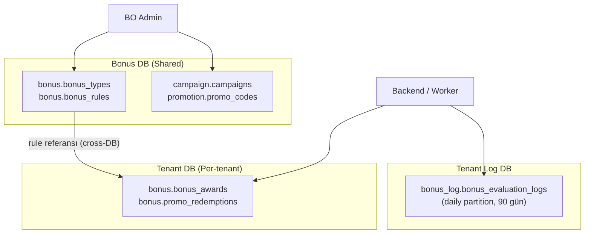

# Bonus Engine — Geliştirici Rehberi

Bonus sistemi **JSON-driven generic rule engine** mimarisi kullanır. Eski MSSQL'deki 14 tablolu rigid yapı yerine, 6 JSONB bileşen ile her bonus tipini tek genel yapıda tanımlar.

---

## Büyük Resim



| Veritabanı | Tablolar | Erişim | Açıklama |
|------------|----------|--------|----------|
| **Bonus DB** (Shared) | `bonus.bonus_types`, `bonus.bonus_rules`, `campaign.campaigns`, `promotion.promo_codes` | BO Admin | Kural tanımları (shared, tüm tenant'lar için ortak yapılandırma) |
| **Tenant DB** (Per-tenant) | `bonus.bonus_awards`, `bonus.promo_redemptions` | Backend/Worker | Oyuncu bazlı bonus kazanımları ve promosyon kullanımları (izole) |
| **Tenant Log DB** | `bonus_log.bonus_evaluation_logs` | Worker | Değerlendirme audit trail (daily partition, 90 gün retention) |

---

## 6 JSONB Bileşen

Her bonus kuralı (`bonus.bonus_rules`) 6 JSONB bileşenden oluşur:

| # | Bileşen | Soru | Zorunlu | Örnek |
|---|---------|------|---------|-------|
| 1 | `trigger_config` | Ne zaman tetiklenir? | **Evet** | `{"event":"first_deposit","conditions":{"min_amount":100}}` |
| 2 | `data_config` | Hangi veri gerekli? | Hayır | `{"source":"deposit_event","fields":["amount","currency"]}` |
| 3 | `eligibility_criteria` | Kim hak eder? | Hayır | `{"conditions":[{"field":"player.country","op":"in","value":["TR","DE"]}]}` |
| 4 | `reward_config` | Ne kadar verilir? | **Evet** | `{"type":"percentage","source_field":"event.amount","value":100,"max_amount":1000}` |
| 5 | `usage_criteria` | Nasıl kullanılmalı? | Hayır | `{"wagering_multiplier":30,"expires_in_days":30,"game_contributions":{"SLOT":100}}` |
| 6 | `target_config` | Bonus alt tipi? | Hayır | `{"bonus_subtype":"freebet","completion_target":"real"}` |

### Neden JSONB?

Sektörde 15+ bonus tipi var (deposit match, cashback, freebet, freespin, loyalty, referral...). Hepsi aynı 6 bileşenin farklı kombinasyonları. JSONB ile:

- Yeni bonus tipi = yeni JSON yapısı, **DB şema değişikliği yok**
- Backend handler'lar generic: expression evaluator ile koşulları değerlendirir
- Operatörler: `eq`, `neq`, `gt`, `gte`, `lt`, `lte`, `in`, `not_in`, `between`, `contains`

---

## Değerlendirme Tipleri

`bonus_rules.evaluation_type` kolonu:

| Tip | Tetiklenme | Örnek |
|-----|-----------|-------|
| `immediate` | Event-driven: deposit gelince hemen | Hoş geldin bonusu (%100 ilk yatırım) |
| `periodic` | Cron schedule ile | Haftalık cashback (Pazartesi 00:00) |
| `manual` | Admin tetikler | VIP özel bonus |
| `claim` | Oyuncu talep eder | Talep et butonu ile aktifleştirme |

---

## Wallet Mimarisi

**Kritik karar:** Tüm bonuslar HER ZAMAN **BONUS wallet**'a gider.

| Cüzdan | Tip | Açıklama |
|--------|-----|----------|
| **REAL Wallet** | `real` | Gerçek para (deposit/withdraw) |
| **BONUS Wallet** | `bonus` | Bonus para (tüm bonuslar buraya gider) |
| **LOCKED Wallet** | `locked` | Kilitli bakiye (çevrim şartı tamamlanana kadar) |

### Harcama Önceliği

Oyuncu bahis yaptığında:
1. Uygun BONUS award'ları filtrele (`usage_criteria` ile)
2. Sırala: **earliest expiry first**
3. Sırayla bonus bakiyesinden düş
4. Tüm uygun bonuslar tükendiyse → REAL wallet'tan düş

### Çevrim (Wagering) Akışı

```
Bonus: 100 TL, 30x çevrim
wagering_target = 100 × 30 = 3.000 TL

Oyuncu oynar:
  50 TL slot  (%100 katkı) → progress += 50
  100 TL live (%10 katkı)  → progress += 10
  ...
  progress >= 3.000 → wagering completed!
```

### Transfer Politikaları (Çevrim tamamlandığında)

| Politika | Davranış |
|----------|----------|
| `transfer_earned` | Kazanılan tutar REAL wallet'a, kalan bonus iptal |
| `forfeit_remaining` | Bonus bakiye iptal, sadece kazanç REAL'a |
| `forfeit_all` | Tüm bonus + kazanç iptal |

---

## DB Yapısı

### Bonus DB (Shared)

| Tablo | Şema | Açıklama |
|-------|------|----------|
| `bonus_types` | bonus | Bonus tipi tanımları (deposit_match, free_spin, cashback) |
| `bonus_rules` | bonus | 6 JSONB bileşenli kural motoru |
| `campaigns` | campaign | Kampanya yönetimi (bonus kuralına bağlı, bütçe takibi) |
| `promo_codes` | promotion | Promosyon kodları (kullanım limiti, geçerlilik) |

### Tenant DB (Per-tenant)

| Tablo | Şema | Açıklama |
|-------|------|----------|
| `bonus_awards` | bonus | Oyuncuya verilen bonuslar (durum takibi, çevrim, bakiye) |
| `promo_redemptions` | bonus | Promosyon kod kullanım kayıtları |

### Tenant Log DB

| Tablo | Şema | Açıklama |
|-------|------|----------|
| `bonus_evaluation_logs` | bonus_log | Worker değerlendirme audit trail (daily partition, 90 gün) |

---

## Transaction Type ID'leri

Bonus işlemleri `transaction.transactions` tablosunda şu type ID'leri kullanır:

| ID | İşlem | Açıklama |
|----|-------|----------|
| 40 | Bonus Credit | Oyuncuya bonus verilir (BONUS wallet'a) |
| 41 | Bonus Debit | Bonus iptal edilir (BONUS wallet'tan) |
| 42 | Bonus Completion | Çevrim tamamlandı → REAL wallet'a transfer |
| 50-57 | Rollback serileri | İlgili işlemlerin geri alınması |

---

## Temel Akışlar

### 1. Bonus Kuralı Oluşturma (BO Admin → Bonus DB)

```
BO Admin → Backend → bonus.bonus_rule_create(
    tenant_id, rule_code, rule_name, bonus_type_id,
    trigger_config,    -- JSONB (TEXT param → JSONB cast)
    reward_config,     -- JSONB
    eligibility_criteria, usage_criteria, ...
)
```

- `trigger_config` ve `reward_config` zorunlu
- `(tenant_id, rule_code)` unique — aynı tenant'ta aynı kod olamaz
- `tenant_id = NULL` → platform seviyesi kural (tüm tenant'lara uygulanabilir)

### 2. Bonus Verme (Backend/Worker → Tenant DB)

```
Event (deposit, registration, cron) →
  Worker:
    1. Kural değerlendir (eligibility check)
    2. Reward hesapla (percentage/fixed/tiered)
    3. bonus.bonus_award_create(player_id, bonus_rule_id, ...)
       → BONUS wallet credit (type_id=40)
       → bonus_awards INSERT (status=active)
       → rule_snapshot JSONB (kural anındaki hali)
```

### 3. Bonus İptal (BO Admin → Tenant DB)

```
bonus.bonus_award_cancel(award_id, cancelled_by, reason)
  → BONUS wallet debit (type_id=41)
  → status: active → cancelled
```

### 4. Çevrim Tamamlama (Worker → Tenant DB)

```
bonus.bonus_award_complete(award_id)
  → BONUS → REAL wallet transfer (type_id=42)
  → status: active → completed
```

### 5. Toplu Expire (Cron Worker → Tenant DB)

```
bonus.bonus_award_expire(batch_size)
  → SKIP LOCKED (concurrent worker güvenliği)
  → Süresi geçmiş aktif bonusları expire eder
  → BONUS wallet debit
```

---

## Kampanya ve Promosyon

### Kampanya Akışı

```
BO Admin → campaign_create (bonus_rule_ids, bütçe, süre, hedef segment)
         → status: draft → active → ended
         → award_strategy: automatic | claim | manual
```

- `automatic`: Event tetiklediğinde otomatik verilir
- `claim`: Oyuncu "Talep Et" butonuyla aktifleştirir
- `manual`: Admin tek tek verir

### Promosyon Kodu Akışı

```
BO Admin → promo_code_create (code, bonus_rule_id, max_redemptions, valid_from/until)

Oyuncu → promo_redeem (code)
  → Kod geçerlilik kontrolü
  → Kullanım limiti kontrolü (max_redemptions, max_per_player)
  → Süre kontrolü
  → Bonus award oluştur
```

---

## Stacking ve Çakışma Kontrolü

| Kolon | Açıklama |
|-------|----------|
| `disables_other_bonuses` | Bu bonus aktifken başka bonus alınamaz |
| `stacking_group` | Aynı grupta max 1 aktif bonus (ör: "welcome_group") |

Backend award öncesinde kontrol eder:
1. Oyuncunun aktif bonus'u var mı ve `disables_other_bonuses = true` mi?
2. Aynı `stacking_group`'ta aktif bonus var mı?

---

## Fonksiyon Listesi

### Bonus DB (18 fonksiyon)

| Grup | Fonksiyon | Açıklama |
|------|----------|----------|
| Bonus Types | `bonus_type_create/update/get/list` | Bonus tipi CRUD |
| Bonus Rules | `bonus_rule_create/update/get/list/delete` | Kural CRUD (6 JSONB) |
| Campaigns | `campaign_create/update/get/list/delete` | Kampanya CRUD |
| Promotions | `promo_code_create/update/get/list` | Promosyon kodu CRUD |

### Tenant DB (8 fonksiyon)

| Fonksiyon | Açıklama |
|----------|----------|
| `bonus_award_create` | Oyuncuya bonus ver (BONUS wallet credit, type_id=40) |
| `bonus_award_get` | Award detayı |
| `bonus_award_list` | Oyuncu bonus listesi (durum filtreleme) |
| `bonus_award_cancel` | Bonus iptal (BONUS wallet debit, type_id=41) |
| `bonus_award_complete` | Çevrim tamamlandı → REAL wallet transfer (type_id=42) |
| `bonus_award_expire` | Batch expire (SKIP LOCKED, concurrent güvenliği) |
| `promo_redeem` | Promosyon kodu kullan |
| `promo_redemption_list` | Kullanım geçmişi |

---

## Backend İçin Notlar

- **JSONB parametreler TEXT olarak geçirilir** — fonksiyon içinde `::JSONB` cast yapılır
- **Cross-DB**: Bonus kuralları Bonus DB'de, award'lar Tenant DB'de → backend ayrı connection kullanır
- **Auth**: Bonus DB fonksiyonları auth-agnostic. Backend Core DB'den yetki kontrolü yapar
- **Worker**: Periodic evaluation ve expire işlemleri için .NET Worker servisi (Quartz scheduler)
- **rule_snapshot**: Award oluşturulurken kuralın o anki hali JSONB olarak saklanır (kural sonradan değişse bile award etkilenmez)

---

_İlgili dokümanlar: [BONUS_ENGINE_DESIGN.md](../../.planning/BONUS_ENGINE_DESIGN.md) · [BONUS_ENGINE_DB_ISSUE.md](../../.planning/BONUS_ENGINE_DB_ISSUE.md) · [FUNCTIONS_GATEWAY.md](../reference/FUNCTIONS_GATEWAY.md)_
