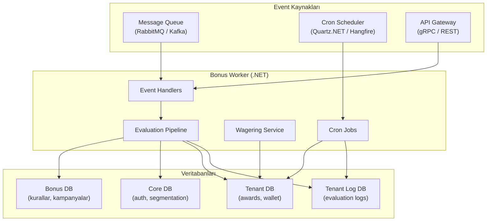
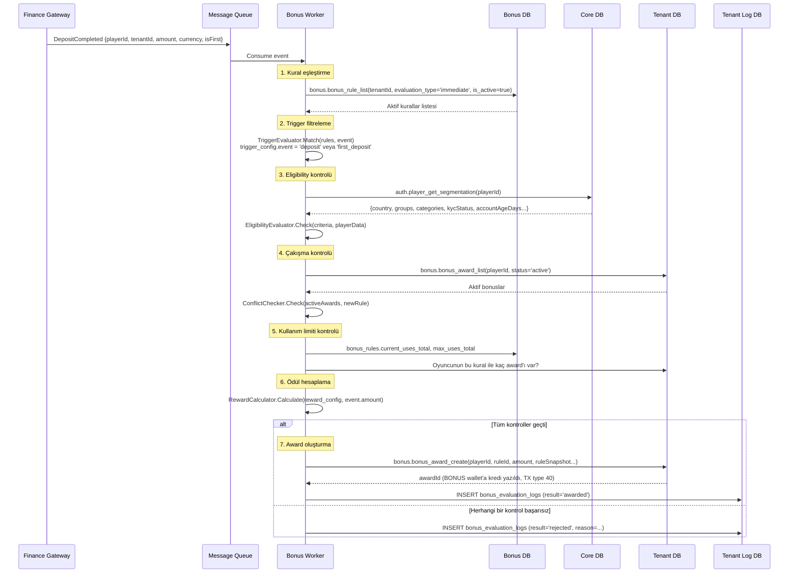
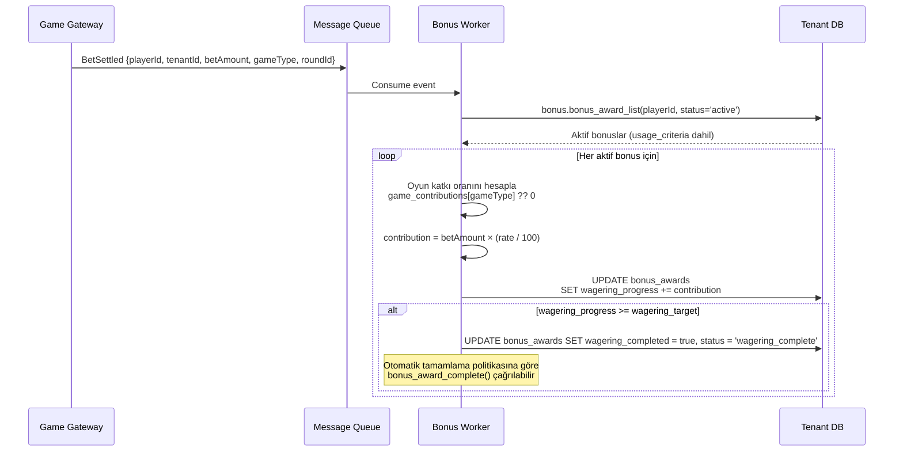
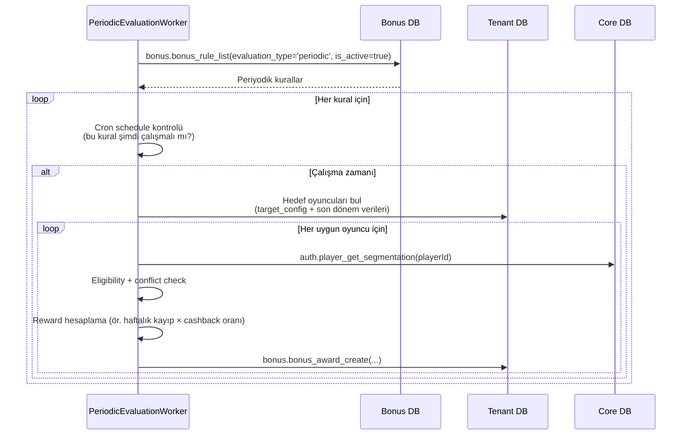
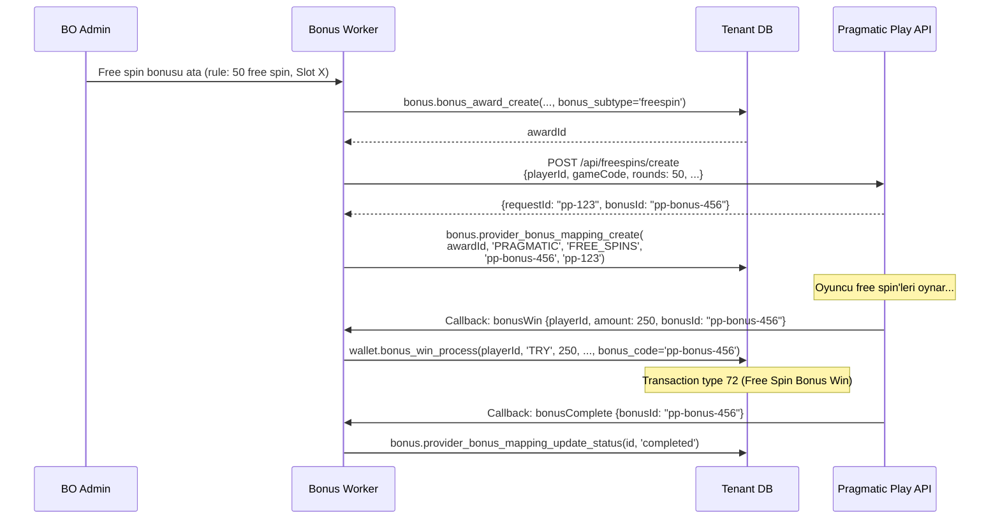

# Bonus Worker — Backend Mimari Rehberi

Bonus Engine'in backend tarafını oluşturan .NET Worker servisinin mimarisi, event akışları, cross-DB orkestrasyon kalıpları ve uygulama planı.

> İlgili dökümanlar: [SPEC_BONUS_ENGINE.md](SPEC_BONUS_ENGINE.md) · [SPEC_GAME_GATEWAY.md](SPEC_GAME_GATEWAY.md) · [SPEC_FINANCE_GATEWAY.md](SPEC_FINANCE_GATEWAY.md)

---

## 1. Genel Mimari

Bonus Worker, **3 ayrı fiziksel veritabanı** arasında orkestrasyon yapan event-driven bir .NET Background Service'tir. Her veritabanına ayrı connection ile bağlanır; cross-DB join yoktur.



### Veritabanı Bağlantı İzolasyonu

| Bağlantı | Veritabanı | Kullanım |
|-----------|-----------|----------|
| `BonusDbConnection` | Bonus DB | Kural, kampanya, promo okuma (çoğunlukla read-only) |
| `TenantDbConnection` | Tenant DB | Award CRUD, wallet işlemleri, request workflow |
| `CoreDbConnection` | Core DB | `auth.player_get_segmentation()` — sadece read |
| `TenantLogDbConnection` | Tenant Log DB | `bonus_evaluation_logs` yazma |

**Multi-tenant:** Her tenant için ayrı Tenant DB bağlantısı. Bonus DB ve Core DB shared.

---

## 2. Servis Yapısı

```
BonusWorker/
├── Program.cs                          # Host builder, DI registration
├── appsettings.json                    # Connection strings, cron schedules
│
├── Configuration/
│   ├── BonusWorkerOptions.cs           # Worker ayarları (batch size, intervals)
│   └── TenantConnectionFactory.cs      # Tenant bazlı connection resolver
│
├── EventHandlers/                      # Message queue consumer'ları
│   ├── DepositCompletedHandler.cs      # Deposit → bonus evaluation
│   ├── BetSettledHandler.cs            # Bet settle → wagering update
│   ├── RegistrationCompletedHandler.cs # Kayıt → welcome bonus evaluation
│   ├── KycApprovedHandler.cs           # KYC onay → pending_kyc bonusları aktifleştir
│   └── ProviderBonusCallbackHandler.cs # Provider callback → bonus_win_process
│
├── Pipeline/                           # Değerlendirme pipeline'ı
│   ├── BonusEvaluationPipeline.cs      # Ana orkestratör
│   ├── Steps/
│   │   ├── RuleMatchStep.cs            # trigger_config eşleştirme
│   │   ├── EligibilityCheckStep.cs     # eligibility_criteria kontrol
│   │   ├── ConflictCheckStep.cs        # stacking_group + disables check
│   │   ├── UsageLimitCheckStep.cs      # max_uses_total/per_player kontrol
│   │   ├── CampaignBudgetCheckStep.cs  # Bütçe doluluk kontrolü
│   │   └── RewardCalculationStep.cs    # reward_config hesaplama
│   └── Models/
│       ├── EvaluationContext.cs         # Pipeline boyunca taşınan state
│       └── EvaluationResult.cs          # awarded/rejected/skipped/error
│
├── Services/
│   ├── BonusAwardService.cs            # Award oluşturma orkestrasyon
│   ├── WageringTrackingService.cs      # Çevrim ilerleme takibi
│   ├── PromoCodeService.cs             # Promo kod doğrulama & redeem
│   ├── CampaignService.cs              # Kampanya bütçe takibi
│   ├── ProviderBonusService.cs         # Provider bonus eşleştirme
│   └── ExpressionEvaluator.cs          # Generic JSON koşul değerlendirici
│
├── Workers/                            # Background hosted services (cron)
│   ├── AwardExpirationWorker.cs        # bonus_award_expire() — dakika/saat
│   ├── RequestExpirationWorker.cs      # bonus_request_expire() — günlük
│   ├── RequestCleanupWorker.cs         # bonus_request_cleanup() — haftalık
│   ├── PeriodicEvaluationWorker.cs     # Periyodik bonus dağıtım — cron
│   ├── CampaignStatusWorker.cs         # Kampanya bitiş tarihi kontrol — saatlik
│   └── WageringCompletionWorker.cs     # wagering_complete → auto-complete check
│
└── Evaluators/                         # JSON bileşen yorumlayıcıları
    ├── TriggerEvaluator.cs             # trigger_config → event match
    ├── EligibilityEvaluator.cs         # eligibility_criteria → player match
    ├── RewardCalculator.cs             # reward_config → tutar hesaplama
    └── UsageCriteriaResolver.cs        # usage_criteria merge (override sırası)
```

---

## 3. Event-Driven Bonus Değerlendirme

### 3.1 Event Akışı (Immediate Evaluation)

Oyuncu bir aksiyon yaptığında (deposit, kayıt, KYC onay vb.) ilgili servis bir event publish eder. Bonus Worker bu event'i consume ederek değerlendirme pipeline'ını çalıştırır.



### 3.2 Desteklenen Event Tipleri

| Event | Publish Eden | Tetiklenen Bonus Türleri |
|-------|-------------|--------------------------|
| `DepositCompleted` | Finance Gateway | İlk yatırım bonusu, yatırım eşleştirme, reload bonus |
| `RegistrationCompleted` | Auth Service | Hoş geldin bonusu (depositsiz), kayıt free spin |
| `BetSettled` | Game Gateway | Wagering progress güncelleme, cashback hesaplama |
| `KycApproved` | IDManager | `pending_kyc` → `active` geçişi |
| `ProviderBonusCallback` | Game Provider | Free spin kazanç (`bonus_win_process`) |
| `PlayerLevelChanged` | Loyalty Service | Seviye atlama bonusu |
| `ReferralCompleted` | Referral Service | Arkadaş davet bonusu |

### 3.3 Event Payload Formatı

```json
{
  "eventType": "DepositCompleted",
  "tenantId": 1001,
  "playerId": 50234,
  "timestamp": "2026-02-26T14:30:00Z",
  "data": {
    "transactionId": 982341,
    "amount": 500.00,
    "currency": "TRY",
    "paymentMethod": "credit_card",
    "isFirstDeposit": true,
    "depositCount": 1
  },
  "metadata": {
    "correlationId": "uuid-here",
    "source": "finance-gateway"
  }
}
```

---

## 4. Değerlendirme Pipeline Detayları

### 4.1 Pipeline Adımları

Her event için pipeline sırayla şu adımları çalıştırır. Herhangi bir adım `reject` döndürürse pipeline durur ve log yazılır.

| # | Adım | DB | Açıklama | Reject Nedeni |
|---|------|----|----------|---------------|
| 1 | **RuleMatch** | Bonus DB | `trigger_config.event` event tipine eşleşiyor mu? Koşullar sağlanıyor mu? | `trigger_not_matched` |
| 2 | **EligibilityCheck** | Core DB | Oyuncu segmentasyon verisi ile `eligibility_criteria` karşılaştırma | `eligibility_not_met` |
| 3 | **ConflictCheck** | Tenant DB | `disables_other_bonuses` ve `stacking_group` kontrolü | `conflict_stacking`, `conflict_disabled` |
| 4 | **UsageLimitCheck** | Bonus + Tenant DB | `max_uses_total` ve `max_uses_per_player` aşılmadı mı? | `max_uses_exceeded` |
| 5 | **CampaignBudgetCheck** | Bonus DB | Kampanya bağlıysa: `spent_budget < total_budget`? | `budget_exhausted` |
| 6 | **RewardCalculation** | — (in-memory) | `reward_config`'e göre tutar hesapla | `reward_zero` (hesaplanan tutar 0) |
| 7 | **AwardCreation** | Tenant DB | `bonus.bonus_award_create()` çağır | `award_creation_failed` |
| 8 | **LogWrite** | Tenant Log DB | `bonus_evaluation_logs`'a sonuç yaz | — (best-effort) |

### 4.2 ExpressionEvaluator (Generic JSON Koşul Motoru)

Tüm JSONB bileşenlerdeki koşulları değerlendiren generic bir motor. Her koşul `{field, op, value}` formatında.

```csharp
// Desteklenen operatörler
public enum Operator
{
    Eq,         // field == value
    Neq,        // field != value
    Gt,         // field > value
    Gte,        // field >= value
    Lt,         // field < value
    Lte,        // field <= value
    In,         // field IN [values]
    NotIn,      // field NOT IN [values]
    Between,    // value[0] <= field <= value[1]
    Contains    // array field contains value
}

// Kullanım
var context = new Dictionary<string, object>
{
    ["player.country"] = "TR",
    ["player.groups"] = new[] { "vip", "high_rollers" },
    ["player.kyc_status"] = "approved",
    ["event.amount"] = 500.00m
};

bool eligible = ExpressionEvaluator.Evaluate(rule.EligibilityCriteria, context);
```

### 4.3 RewardCalculator Tipleri

| Tip | `reward_config.type` | Hesaplama | Örnek |
|-----|---------------------|-----------|-------|
| **Yüzde** | `percentage` | `event.amount × value / 100` (max_amount ile sınırlı) | %100 deposit match, max 1000 TL |
| **Sabit** | `fixed_amount` | `value` (doğrudan) | 50 TL kayıt bonusu |
| **Kademeli** | `tiered` | Tutar aralığına göre farklı oran | 100-500: %50, 500-1000: %75, 1000+: %100 |
| **Ölçekli** | `scaled` | Tutar arttıkça oran artar (linear) | Min %20, max %100, 100-10000 TL aralığı |

```json
// Kademeli (tiered) örnek
{
  "type": "tiered",
  "source_field": "event.amount",
  "tiers": [
    {"min": 100, "max": 499, "value": 50, "value_type": "percentage"},
    {"min": 500, "max": 999, "value": 75, "value_type": "percentage"},
    {"min": 1000, "max": null, "value": 100, "value_type": "percentage", "max_amount": 5000}
  ]
}
```

### 4.4 UsageCriteria Merge Sırası

Çevrim şartları birden fazla kaynaktan gelebilir. Öncelik sırası (yüksekten düşüğe):

| # | Kaynak | Açıklama |
|---|--------|----------|
| 1 | Operatör override | `bonus_request_approve(p_usage_criteria)` parametresi |
| 2 | Setting default | `bonus_request_settings.default_usage_criteria` |
| 3 | Kural tanımı | `bonus_rules.usage_criteria` |
| 4 | Çevrim yok | Tümü NULL → bonus direkt kullanılabilir |

```csharp
// Merge mantığı
JsonNode ResolveUsageCriteria(
    JsonNode? operatorOverride,
    JsonNode? settingDefault,
    JsonNode? ruleDefinition)
{
    return operatorOverride ?? settingDefault ?? ruleDefinition;
}
```

---

## 5. Wagering (Çevrim) Takibi

### 5.1 Akış

Her bahis sonuçlandığında (`BetSettled` event) çevrim ilerlemesi güncellenir.



### 5.2 Game Contribution Oranları

`usage_criteria.game_contributions` alanında her oyun kategorisi için çevrim katkı yüzdesi tanımlanır:

```json
{
  "wagering_multiplier": 30,
  "game_contributions": {
    "SLOT": 100,
    "LIVE_CASINO": 10,
    "TABLE_GAME": 20,
    "VIRTUAL": 0,
    "SPORT": 50
  },
  "excluded_bet_types": ["virtual", "esports"],
  "min_odds": 1.50,
  "min_combined_count": 3,
  "expires_in_days": 30,
  "max_withdrawal_factor": 10
}
```

| Alan | Açıklama |
|------|----------|
| `wagering_multiplier` | Çevrim çarpanı (bonus × bu değer = hedef) |
| `game_contributions` | Oyun kategorisi → katkı yüzdesi |
| `excluded_bet_types` | Çevrime sayılmayan bahis tipleri |
| `min_odds` | Spor bahislerinde minimum oran (altı sayılmaz) |
| `min_combined_count` | Kombine bahis minimum maç sayısı |
| `expires_in_days` | Çevrim süresi (award oluşturma + N gün) |
| `max_withdrawal_factor` | Maks çekim = bonus × bu değer |

### 5.3 Bahis Sırasında Cüzdan Önceliği

Oyuncu bahis koyduğunda Game Gateway (veya Wallet Service) şu sırayı izler:

```
1. Oyuncunun aktif bonus award'larını al (status='active')
2. Event'in oyun tipi ile usage_criteria.game_contributions eşleştir
3. Uygun bonus'ları sırala: expires_at ASC NULLS LAST (en yakın expire önce)
4. Sırayla bonus current_balance'tan düş
5. Tüm bonuslar tükendiyse → REAL wallet'tan düş
```

Bu mantık **Game Gateway tarafında** (veya shared wallet service'te) uygulanır, Bonus Worker'da değil. Bonus Worker sadece **wagering progress güncellemesini** yapar.

---

## 6. Cron Jobs (Zamanlanmış Görevler)

| Worker | Zamanlama | Çağırdığı Fonksiyon | Batch Size | Açıklama |
|--------|-----------|---------------------|------------|----------|
| `AwardExpirationWorker` | Her 5 dakika | `bonus.bonus_award_expire(p_batch_size)` | 500 | `expires_at < NOW()` olan award'ları expire et |
| `RequestExpirationWorker` | Günlük 02:00 | `bonus.bonus_request_expire(p_batch_size)` | 200 | Pending/assigned request'leri expire et |
| `RequestCleanupWorker` | Haftalık Pazar 04:00 | `bonus.bonus_request_cleanup(90, p_batch_size)` | 100 | 90 günden eski cancelled/expired request hard-delete |
| `PeriodicEvaluationWorker` | Kural bazlı cron | Evaluation pipeline | — | `evaluation_type='periodic'` kuralları çalıştır |
| `CampaignStatusWorker` | Saatlik | `campaign.campaign_update(status='ended')` | — | `end_date < NOW()` kampanyaları sonlandır |
| `WageringCompletionWorker` | Her 10 dakika | `bonus.bonus_award_complete()` | 100 | `wagering_complete` → auto-complete (politikaya göre) |

### 6.1 Periyodik Bonus Değerlendirme

`evaluation_type = 'periodic'` olan kurallar cron schedule ile çalışır. Tipik kullanım: haftalık cashback.



**Cashback hesaplama örneği:**

```json
// trigger_config
{
  "event": "periodic_cashback",
  "schedule": "0 0 * * MON",
  "period": "last_7_days"
}

// reward_config
{
  "type": "percentage",
  "source_field": "period.net_loss",
  "value": 10,
  "max_amount": 5000,
  "min_source_amount": 100
}
```

Worker son 7 günün net kaybını hesaplar → %10'unu cashback olarak verir (max 5000 TL, min kayıp 100 TL).

---

## 7. Provider Bonus Entegrasyonu

Game provider'ların kendi bonus mekanizmaları (Pragmatic Free Spins, Hub88 Freebets) ile platform bonus sistemi arasında köprü kurar.

### 7.1 Free Spin Akışı



### 7.2 Provider Mapping Durumları

| Durum | Açıklama |
|-------|----------|
| `active` | Provider'da bonus aktif, oyuncu kullanıyor |
| `completed` | Tüm free spin/freebet kullanıldı |
| `cancelled` | Platform tarafından iptal edildi |
| `expired` | Süre aşımı |

---

## 8. Kampanya Bütçe Yönetimi

### 8.1 Bütçe Kontrolü

Her award oluşturmada kampanya bütçesi atomik olarak güncellenir:

```
1. Campaign aktif mi? (status = 'active')
2. Tarih aralığında mı? (start_date <= NOW() <= end_date)
3. Bütçe yeterli mi? (spent_budget + award_amount <= total_budget)
4. Award oluştur → spent_budget += award_amount (atomik UPDATE)
```

### 8.2 Award Strategy

| Strateji | Açıklama | Tetikleme |
|----------|----------|-----------|
| `automatic` | Koşullar sağlandığında otomatik verilir | Event → pipeline → award |
| `claim` | Oyuncu "al" butonuna basar | Player claim → pipeline → award |
| `manual` | BO operatör elle verir | Admin action → award |

---

## 9. Hata Yönetimi ve Dayanıklılık

### 9.1 Retry Stratejisi

| Hata Tipi | Strateji | Detay |
|-----------|----------|-------|
| DB bağlantı hatası | Exponential backoff | 1s, 2s, 4s, 8s — max 3 retry |
| Provider API hatası | Retry with backoff | Max 5 retry, dead-letter queue'ya at |
| Evaluation hatası | Log & skip | `evaluation_result = 'error'`, bir sonraki kural ile devam |
| Duplicate event | Idempotency check | `award.idempotency_key` veya event correlationId ile kontrol |

### 9.2 Idempotency

Aynı event birden fazla kez işlense bile çift bonus verilmemeli:

```
1. Event correlationId + ruleId kombinasyonu ile kontrol
2. bonus_evaluation_logs'ta aynı kayıt var mı?
3. bonus_awards'ta aynı player + rule + aynı dönem (periyodik) var mı?
4. Varsa → skip (log: 'skipped', reason: 'already_awarded')
```

### 9.3 Circuit Breaker

Cross-DB çağrıları için circuit breaker:

| Bağlantı | Threshold | Timeout | Recovery |
|-----------|-----------|---------|----------|
| Core DB (segmentation) | 5 hata / 30s | 3s | 30s sonra half-open |
| Bonus DB (kural okuma) | 5 hata / 30s | 3s | 30s sonra half-open |
| Provider API | 3 hata / 60s | 10s | 60s sonra half-open |

---

## 10. Monitoring ve Observability

### 10.1 Metrikler

| Metrik | Tip | Açıklama |
|--------|-----|----------|
| `bonus.evaluations.total` | Counter | Toplam değerlendirme sayısı (label: result) |
| `bonus.evaluations.duration_ms` | Histogram | Değerlendirme pipeline süresi |
| `bonus.awards.created` | Counter | Oluşturulan award sayısı (label: bonus_type) |
| `bonus.awards.expired` | Counter | Expire edilen award sayısı |
| `bonus.wagering.progress_updated` | Counter | Çevrim güncelleme sayısı |
| `bonus.provider.api_calls` | Counter | Provider API çağrı sayısı (label: provider, status) |
| `bonus.worker.job_duration_ms` | Histogram | Cron job süreleri (label: job_name) |

### 10.2 Alerting

| Alert | Koşul | Aksiyon |
|-------|-------|---------|
| Evaluation error spike | error rate > %5 (5 dk) | PagerDuty + Slack |
| Award expire backlog | expire queue > 10.000 | Batch size artır |
| Provider API down | Circuit breaker open | Provider durumunu kontrol et |
| DB connection pool exhausted | Available connections = 0 | Pool size artır / leak kontrol |

---

## 11. Konfigürasyon

```json
{
  "BonusWorker": {
    "BatchSizes": {
      "AwardExpiration": 500,
      "RequestExpiration": 200,
      "RequestCleanup": 100,
      "WageringCompletion": 100
    },
    "Schedules": {
      "AwardExpiration": "*/5 * * * *",
      "RequestExpiration": "0 2 * * *",
      "RequestCleanup": "0 4 * * SUN",
      "CampaignStatus": "0 * * * *",
      "WageringCompletion": "*/10 * * * *"
    },
    "RetentionDays": {
      "RequestCleanup": 90
    },
    "CircuitBreaker": {
      "FailureThreshold": 5,
      "SamplingDuration": "00:00:30",
      "BreakDuration": "00:00:30"
    },
    "Retry": {
      "MaxRetries": 3,
      "InitialDelay": "00:00:01"
    }
  }
}
```

---

## 12. Uygulama Sırası (Önerilen)

| Faz | Kapsam | Bağımlılık |
|-----|--------|------------|
| **Faz 1** | Temel altyapı: DI, connection factory, expression evaluator | — |
| **Faz 2** | Evaluation pipeline (6 adım) + DepositCompletedHandler | Faz 1 |
| **Faz 3** | Cron jobs: AwardExpiration, RequestExpiration, RequestCleanup | Faz 1 |
| **Faz 4** | Wagering tracking: BetSettledHandler + WageringTrackingService | Faz 2 |
| **Faz 5** | Periyodik değerlendirme: PeriodicEvaluationWorker + cashback | Faz 2 |
| **Faz 6** | Provider entegrasyonu: Pragmatic Free Spins, Hub88 Freebets | Faz 4 |
| **Faz 7** | Kampanya bütçe yönetimi + CampaignStatusWorker | Faz 2 |
| **Faz 8** | Monitoring, alerting, circuit breaker, retry polish | Faz 1-7 |

---

## 13. İlgili Dökümanlar

| Döküman | İçerik |
|---------|--------|
| [SPEC_BONUS_ENGINE.md](SPEC_BONUS_ENGINE.md) | DB fonksiyon spesifikasyonu (46 fn, 11 tablo) |
| [SPEC_GAME_GATEWAY.md](SPEC_GAME_GATEWAY.md) | Game provider entegrasyonu, bet/win akışları |
| [SPEC_FINANCE_GATEWAY.md](SPEC_FINANCE_GATEWAY.md) | Deposit/withdraw akışları, event publish |
| [SPEC_PLAYER_AUTH_KYC.md](SPEC_PLAYER_AUTH_KYC.md) | Player segmentation, KYC akışları |
| [../reference/DATABASE_ARCHITECTURE.md](../reference/DATABASE_ARCHITECTURE.md) | Veritabanı izolasyon mimarisi |
