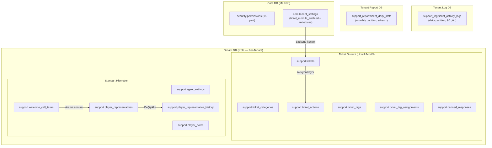
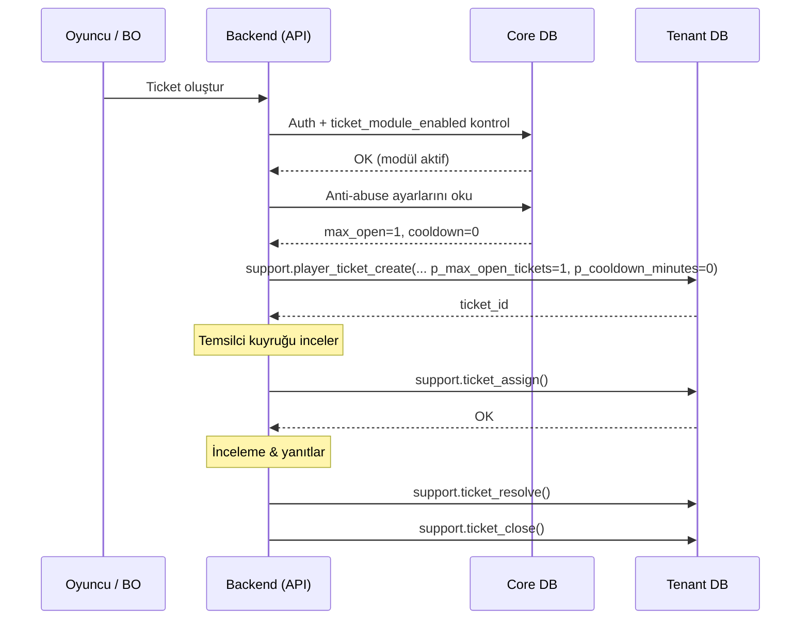
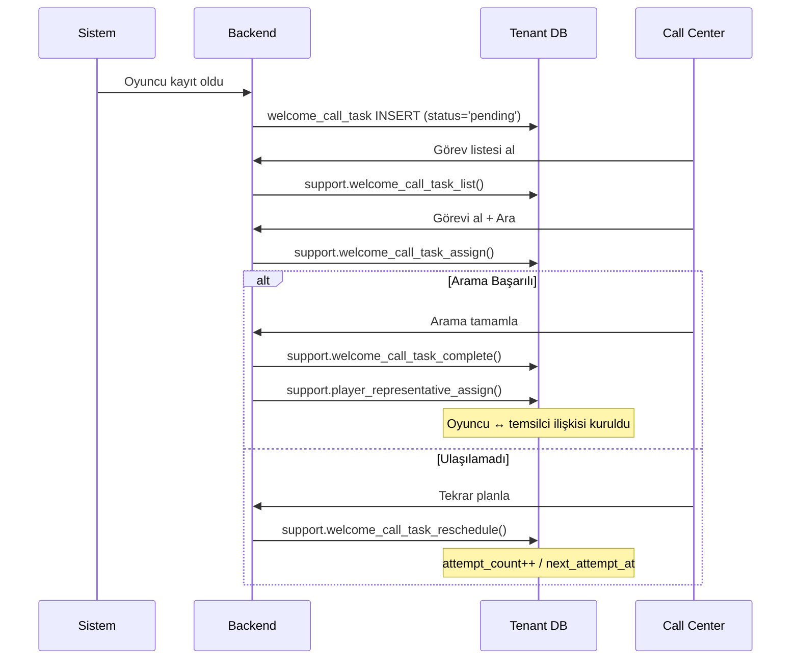
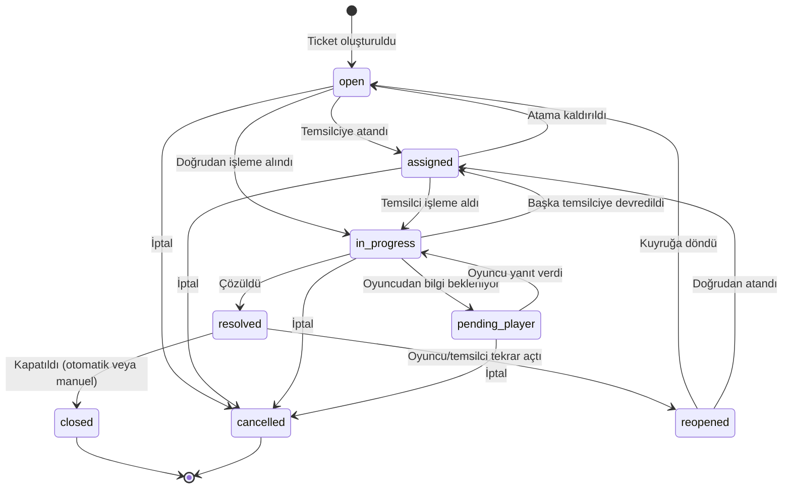
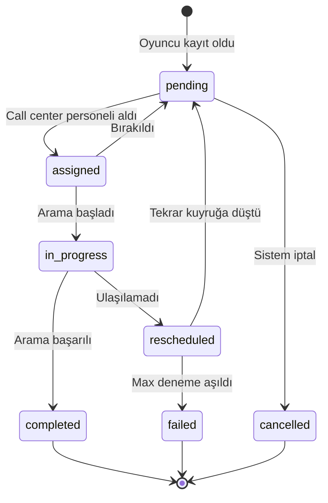

# Çağrı Merkezi & Müşteri Temsilcisi — Geliştirici Rehberi

Oyuncu destek sistemi üç alt sistemden oluşur: **Ticket Sistemi** (ücretli modül), **Temsilci Atama** ve **Hoşgeldin Araması** (standart hizmetler). Tüm veriler Tenant DB `support` şemasında tutulur; yetki kontrolleri Core DB üzerinden yapılır.

> **Detaylı spesifikasyon:** [CALL_CENTER_DESIGN.md](../../.planning/CALL_CENTER_DESIGN.md)

---

## 1. Mimari Genel Bakış

### 1.1 Üç Alt Sistem

| # | Alt Sistem | Başlatan | Tür | Açıklama |
|---|------------|----------|-----|----------|
| 1 | **Ticket Sistemi** | Oyuncu / BO kullanıcısı | **Ücretli modül** | Şikâyet, soru, talep → kuyruk → atama → çözüm → kapatma |
| 2 | **Temsilci Atama** | BO kullanıcısı | **Standart** | Her oyuncuya kalıcı müşteri temsilcisi. Değişiklik historik |
| 3 | **Hoşgeldin Araması** | Sistem (otomatik) | **Standart** | Kayıt sonrası arama görevi → call center kuyruk → arama → temsilci atama |

> **Modül ayrımı:** Temsilci atama ve hoşgeldin araması tüm tenant'lar için ücretsiz standart hizmettir. Ticket sistemi ayrıca faturalandırılır — yalnızca platform admin'ler (superadmin/admin) `ticket_module_enabled` ayarını açabilir.

### 1.2 Veritabanı Dağılımı



### 1.3 Backend Orchestration — Ticket Akışı



### 1.4 Backend Orchestration — Hoşgeldin Araması



---

## 2. Modül Aktivasyonu & Tenant Konfigürasyonu

### 2.1 Hizmet Modeli

| Katman | Hizmetler | Kontrol |
|--------|-----------|---------|
| **Standart** (her zaman açık) | Temsilci atama, hoşgeldin araması, agent ayarları, oyuncu notları | Yok — her zaman çalışır |
| **Ücretli modül** (platform admin) | Ticket CRUD, kategoriler, etiketler, hazır yanıtlar, ticket dashboard, oyuncu self-service | `ticket_module_enabled` ayarı |

### 2.2 Tenant Settings Key'leri

#### Modül Aktivasyonu (`'Module'` kategorisi — sadece superadmin/admin)

| Key | Tip | Varsayılan | Açıklama |
|-----|-----|------------|----------|
| `ticket_module_enabled` | `boolean` | `false` | Ticket modülü aktif mi? `false` ise ticket fonksiyonları engellenir. Standart hizmetleri **etkilemez** |

> **Yetki kısıtı:** `'Module'` kategorisindeki key'ler sadece superadmin/admin tarafından değiştirilebilir. Backend middleware'de kategori bazlı rol kontrolü yapılır.

#### Anti-Abuse Ayarları (`'Support'` kategorisi — tenantadmin+)

| Key | Tip | Varsayılan | Açıklama |
|-----|-----|------------|----------|
| `support_max_open_tickets_per_player` | `integer` | `1` | Oyuncunun aynı anda açık tutabileceği max ticket. `0` = limitsiz |
| `support_ticket_cooldown_minutes` | `integer` | `0` | Ticket kapandıktan/iptalden sonra yeni ticket açma bekleme süresi (dk). `0` = yok |

### 2.3 Modül Kapsamı — Neyi Etkiler, Neyi Etkilemez

| Fonksiyon grubu | `ticket_module_enabled = false` | `= true` |
|------------------|---------------------------------|-----------|
| `player_representative_*` | Çalışır | Çalışır |
| `welcome_call_task_*` | Çalışır | Çalışır |
| `agent_setting_*` | Çalışır | Çalışır |
| `player_note_*` | Çalışır | Çalışır |
| `ticket_*`, `player_ticket_*` | **Engellenir** | Çalışır |
| `ticket_category_*`, `ticket_tag_*` | **Engellenir** | Çalışır |
| `canned_response_*` | **Engellenir** | Çalışır |
| Ticket dashboard & kuyruk | **Engellenir** | Çalışır |

### 2.4 Backend Akışı

```
1. API isteği gelir (ticket ile ilgili)
2. Backend → Core DB: tenant_setting_get(tenant_id, 'ticket_module_enabled')
3. false ise → 403 "error.support.ticket-module-disabled" — Tenant DB'ye çağrı yapılmaz
4. true ise → anti-abuse ayarlarını da oku (max_open, cooldown)
5. Tenant DB fonksiyonuna parametre olarak ilet
```

> **Cross-DB izolasyonu:** Tenant DB fonksiyonları Core DB'ye erişmez. Tüm ayarlar backend tarafından parametre olarak iletilir.

### 2.5 FE/BO Sayfa Görünürlüğü

#### `required_module` Kolonu

`presentation.menus` tablosuna eklenen `required_module VARCHAR(100)` kolonu, permission kontrolüne ek olarak **modül bazlı** görünürlük sağlar:

| Kolon Değeri | Davranış |
|-------------|----------|
| `NULL` | Modül bağımlılığı yok — permission yeterliyse gösterilir |
| `'ticket_module_enabled'` | Bu tenant için ilgili `core.tenant_settings` key'i `true` olmalı |

#### Menü Yapısı

```
Tenants (menu_group)
  └── support-standard (menu, required_module: NULL)
  │     ├── representatives → Temsilci yönetimi
  │     ├── welcome-calls   → Hoşgeldin araması
  │     └── player-notes    → Oyuncu notları
  │
  └── support-tickets (menu, required_module: 'ticket_module_enabled')
        ├── ticket-queue   → Kuyruk / dashboard
        ├── ticket-config  → Kategori, tag, hazır yanıt
        └── agent-settings → Agent ayarları
```

#### Görünürlük Tablosu

| Durum | Standart Menü | Ticket Menüsü |
|-------|---------------|----------------|
| `ticket_module_enabled = true` + permission var | Görünür | Görünür |
| `ticket_module_enabled = false` + permission var | Görünür | **Gizli** |
| Permission yok | Gizli | Gizli |

#### Backend Menü Sorgusu

```sql
SELECT m.*
FROM presentation.menus m
WHERE m.is_active = true
  AND m.required_permission IN (... kullanıcı permission'ları ...)
  AND (
    m.required_module IS NULL
    OR EXISTS (
      SELECT 1 FROM core.tenant_settings ts
      WHERE ts.tenant_id = p_tenant_id
        AND ts.setting_key = m.required_module
        AND ts.setting_value::boolean = true
    )
  )
```

> **Oyuncu FE:** Oyuncu panelinde "Destek Talebi" sayfası da koşulludur. FE, tenant config endpoint'inden modül durumunu alır ve "Destek" menü öğesini koşullu gösterir.

> **Genişletilebilirlik:** `required_module` generic'tir. İleride başka ücretli modüller eklendiğinde (ör: `affiliate_module_enabled`) aynı mekanizma kullanılır.

---

## 3. Ticket Durum Makinesi

### 3.1 Durum Geçişleri



### 3.2 Durum Açıklamaları

| Durum | Açıklama | Kim Geçiş Yapar | BO'da Görünüm |
|-------|----------|-----------------|---------------|
| `open` | Yeni ticket, kimse almamış | sistem, oyuncu | Kuyrukta — tüm temsilciler görür |
| `assigned` | Temsilciye atandı, henüz başlamadı | BO kullanıcı | Atandı — atanan temsilci görür |
| `in_progress` | Aktif olarak işleniyor | atanan temsilci | **İşlemde** — "X inceliyor" görünür |
| `pending_player` | Oyuncudan yanıt/bilgi bekleniyor | temsilci | **Beklemede** — neden notu ile |
| `resolved` | Çözüldü | temsilci | Çözüldü |
| `closed` | Kapatıldı (final) | temsilci, sistem | Kapalı |
| `reopened` | Tekrar açıldı | oyuncu, temsilci | Tekrar Açıldı |
| `cancelled` | İptal (final) | oyuncu, BO kullanıcı | İptal |

---

## 4. Hoşgeldin Araması Durum Makinesi

### 4.1 Durum Geçişleri



### 4.2 Arama Sonuçları

| Sonuç | Açıklama | Sonraki Adım |
|-------|----------|-------------|
| `answered` | Oyuncu cevap verdi, görüşme yapıldı | → completed, temsilci atanır |
| `no_answer` | Cevap yok | → rescheduled (deneme artar) |
| `busy` | Hat meşgul | → rescheduled |
| `voicemail` | Sesli mesaja düştü | → rescheduled |
| `wrong_number` | Yanlış numara | → failed |
| `declined` | Oyuncu görüşmeyi reddetti | → completed (temsilci atanabilir) |

---

## 5. DB Yapısı

### 5.1 Tenant DB — `support` Şeması

#### Ticket Tabloları (Ücretli Modül)

| Tablo | Açıklama |
|-------|----------|
| `ticket_categories` | Hiyerarşik kategori ağacı (parent_id ile). JSONB lokalize ad |
| `tickets` | Ana ticket tablosu. Tüm kanallardan gelen talepler (phone, live_chat, email, social_media) |
| `ticket_actions` | Immutable aksiyon logu. Her durum değişikliği, yanıt, not kaydedilir |
| `ticket_tags` | Yeniden kullanılabilir etiketler (ad + renk) |
| `ticket_tag_assignments` | M:N ticket ↔ tag ilişkisi |
| `canned_responses` | Hazır yanıt şablonları (opsiyonel kategori bağlantısı) |

#### Standart Tablolar

| Tablo | Açıklama |
|-------|----------|
| `agent_settings` | Per-tenant agent profili: müsaitlik, kapasite, yetenekler (JSONB skills) |
| `player_notes` | Ticket'tan bağımsız CRM tarzı oyuncu notları (general, warning, vip, compliance) |
| `player_representatives` | Oyuncu ↔ temsilci kalıcı atama (UNIQUE player_id). Değiştirilir, silinmez |
| `player_representative_history` | Immutable atama değişiklik tarihçesi (zorunlu neden) |
| `welcome_call_tasks` | Hoşgeldin araması görevleri (otomatik oluşturulur, deneme yönetimi) |

### 5.2 Tenant Log DB — `support_log` Şeması

| Tablo | Partition | Retention | Açıklama |
|-------|-----------|-----------|----------|
| `ticket_activity_logs` | Daily | 90 gün | Bildirim gönderim logları (email, SMS, push) |

### 5.3 Tenant Report DB — `support_report` Şeması

| Tablo | Partition | Retention | Açıklama |
|-------|-----------|-----------|----------|
| `ticket_daily_stats` | Monthly | Süresiz | Günlük ticket istatistikleri (kategori, kanal, temsilci bazlı) |

### 5.4 Mevcut Tablolara Eklenen Kolon

`representative_id BIGINT` kolonu şu report tablolarına eklenir (prim hakediş raporları için):

- `tenant_report/tables/finance/player_hourly_stats.sql`
- `tenant_report/tables/finance/transaction_hourly_stats.sql`
- `tenant_report/tables/game/game_hourly_stats.sql`

---

## 6. Fonksiyon Haritası

### 6.1 Ticket Yönetimi — BO (11 fonksiyon, Ücretli Modül)

| Fonksiyon | İmza (kısa) | Açıklama |
|-----------|-------------|----------|
| `ticket_create` | `(p_player_id, p_channel, p_subject, p_description, ...)` → `BIGINT` | Ticket oluştur (BO adına, anti-abuse yok) |
| `ticket_get` | `(p_ticket_id)` → `JSONB` | Ticket detay + actions + tags |
| `ticket_list` | `(p_status, p_channel, p_priority, ... p_page)` → `JSONB` | Filtreli listeleme |
| `ticket_update` | `(p_ticket_id, p_performed_by_id, p_priority, p_category_id)` → `VOID` | Priority/category güncelle |
| `ticket_assign` | `(p_ticket_id, p_assigned_to_id, p_performed_by_id)` → `VOID` | Temsilciye ata / devret |
| `ticket_add_note` | `(p_ticket_id, p_performed_by_id, p_content, p_is_internal)` → `BIGINT` | İç not ekle |
| `ticket_reply_player` | `(p_ticket_id, p_performed_by_id, p_content, p_channel)` → `BIGINT` | Oyuncuya yanıt |
| `ticket_resolve` | `(p_ticket_id, p_performed_by_id, p_resolution_note)` → `VOID` | Çöz |
| `ticket_close` | `(p_ticket_id, p_performed_by_id)` → `VOID` | Kapat |
| `ticket_reopen` | `(p_ticket_id, p_performed_by_id, p_performed_by_type, p_reason)` → `VOID` | Tekrar aç |
| `ticket_cancel` | `(p_ticket_id, p_performed_by_id, p_performed_by_type)` → `VOID` | İptal |

### 6.2 Ticket — Oyuncu (4 fonksiyon, Ücretli Modül)

| Fonksiyon | İmza (kısa) | Açıklama |
|-----------|-------------|----------|
| `player_ticket_create` | `(p_player_id, p_channel, p_subject, p_description, p_category_id, p_max_open_tickets, p_cooldown_minutes)` → `BIGINT` | Oyuncu ticket oluştur (**anti-abuse kontrolleri dahil**) |
| `player_ticket_list` | `(p_player_id, p_status, p_page)` → `JSONB` | Kendi ticketlarını listele (internal notlar filtrelenir) |
| `player_ticket_get` | `(p_player_id, p_ticket_id)` → `JSONB` | Ticket detay (is_internal=true gizlenir) |
| `player_ticket_reply` | `(p_player_id, p_ticket_id, p_content)` → `BIGINT` | Oyuncu yanıt verdi |

> **Anti-abuse:** `player_ticket_create` fonksiyonu `p_max_open_tickets` ve `p_cooldown_minutes` parametrelerini alır. Bu değerler backend tarafından `core.tenant_settings`'ten okunup iletilir. BO `ticket_create` fonksiyonunda anti-abuse kontrolü **yoktur** — BO kullanıcıları telefon/e-posta kanallarından gelen talepleri kayıt altına alabilmelidir.

### 6.3 Oyuncu Notları — BO (4 fonksiyon, Standart)

| Fonksiyon | Açıklama |
|-----------|----------|
| `player_note_create` | Not oluştur (general, warning, vip, compliance) |
| `player_note_list` | Pinned önce, sonra created_at DESC |
| `player_note_update` | İçerik, tip, pin durumu güncelle |
| `player_note_delete` | Soft delete |

### 6.4 Agent Ayarları — BO (3 fonksiyon, Standart)

| Fonksiyon | Açıklama |
|-----------|----------|
| `agent_setting_upsert` | Agent profili oluştur/güncelle (müsaitlik, kapasite, skills) |
| `agent_setting_get` | Tekil agent ayarı |
| `agent_setting_list` | Agent listesi + mevcut açık ticket sayısı (workload) |

### 6.5 Temsilci Atama — BO (3 fonksiyon, Standart)

| Fonksiyon | Açıklama |
|-----------|----------|
| `player_representative_assign` | Temsilci ata/değiştir (zorunlu neden, history kaydı) |
| `player_representative_get` | Mevcut temsilci bilgisi |
| `player_representative_history_list` | Atama değişiklik tarihçesi |

### 6.6 Hoşgeldin Araması — BO (4 fonksiyon, Standart)

| Fonksiyon | Açıklama |
|-----------|----------|
| `welcome_call_task_list` | Görev kuyruğu (pending: created_at ASC, rescheduled: next_attempt_at ASC) |
| `welcome_call_task_assign` | Görevi al (status: pending/rescheduled → assigned) |
| `welcome_call_task_complete` | Arama tamamla (answered/declined → completed, wrong_number → failed) |
| `welcome_call_task_reschedule` | Tekrar planla (attempt_count++, max aşılınca → failed) |

### 6.7 Ticket Konfig — BO (11 fonksiyon, Ücretli Modül)

| Grup | Fonksiyonlar | Açıklama |
|------|-------------|----------|
| Kategori (4) | `ticket_category_create`, `_update`, `_list`, `_delete` | Hiyerarşik kategori yönetimi |
| Tag (3) | `ticket_tag_create`, `_update`, `_list` | Etiket yönetimi |
| Canned Response (4) | `canned_response_create`, `_update`, `_list`, `_delete` | Hazır yanıt şablonları |

### 6.8 Dashboard — BO (2 fonksiyon, Ücretli Modül)

| Fonksiyon | Açıklama |
|-----------|----------|
| `ticket_queue_list` | Atanmamış ticketlar (open/reopened), priority DESC |
| `ticket_dashboard_stats` | Status/priority/channel dağılımı, hoşgeldin arama özeti |

### 6.9 Maintenance (1 fonksiyon)

| Fonksiyon | Açıklama |
|-----------|----------|
| `welcome_call_task_cleanup` | Tamamlanan/başarısız görevleri sil (180 gün, batch) |

---

## 7. Ticket Aksiyon Tipleri

`ticket_actions.action` kolonunda kullanılan değerler:

| Action | Açıklama | performed_by_type | Status Değişimi |
|--------|----------|-------------------|-----------------|
| `CREATED` | Ticket oluşturuldu | PLAYER / BO_USER | → open |
| `ASSIGNED` | Temsilciye atandı | BO_USER | → assigned |
| `REASSIGNED` | Başka temsilciye devredildi | BO_USER | → assigned |
| `UNASSIGNED` | Atama kaldırıldı | BO_USER | → open |
| `STARTED` | İşleme alındı | BO_USER | → in_progress |
| `PENDING_PLAYER` | Oyuncudan bilgi bekleniyor | BO_USER | → pending_player |
| `REPLIED_INTERNAL` | Dahili not eklendi | BO_USER | — |
| `REPLIED_PLAYER` | Oyuncuya yanıt | BO_USER | — (veya → in_progress) |
| `PLAYER_REPLIED` | Oyuncu yanıt verdi | PLAYER | → in_progress |
| `RESOLVED` | Çözüldü | BO_USER | → resolved |
| `CLOSED` | Kapatıldı | BO_USER / SYSTEM | → closed |
| `REOPENED` | Tekrar açıldı | PLAYER / BO_USER | → reopened |
| `CANCELLED` | İptal edildi | PLAYER / BO_USER | → cancelled |
| `PRIORITY_CHANGED` | Öncelik değiştirildi | BO_USER | — |
| `CATEGORY_CHANGED` | Kategori değiştirildi | BO_USER | — |
| `TAG_ADDED` | Etiket eklendi | BO_USER | — |
| `TAG_REMOVED` | Etiket kaldırıldı | BO_USER | — |

---

## 8. Anti-Abuse Kontrolleri

### 8.1 Açık Ticket Limiti

- **Ayar:** `support_max_open_tickets_per_player` (varsayılan: 1)
- **Kapsam:** Sadece oyuncu self-service (`player_ticket_create`)
- **Sayılan statuslar:** `open`, `assigned`, `in_progress`, `pending_player`, `reopened`
- **`0`** = limitsiz

### 8.2 Ticket Cooldown

- **Ayar:** `support_ticket_cooldown_minutes` (varsayılan: 0)
- **Kapsam:** Sadece oyuncu self-service (`player_ticket_create`)
- **Kontrol:** Son `closed` veya `cancelled` ticket'ın kapanma zamanından itibaren bekleme
- **`0`** = cooldown yok

### 8.3 BO Muafiyeti

BO kullanıcıları (`ticket_create`) anti-abuse kısıtlamalarından **muaftır**. Telefon, e-posta gibi kanallardan gelen talepleri herhangi bir kısıtlama olmadan kayıt altına alabilmelidirler.

---

## 9. Permission'lar

### 9.1 Yeni Permission'lar (15 adet)

**Ticket (5):**

| Permission Key | Açıklama |
|----------------|----------|
| `tenant.support-ticket.list` | Ticket listesi görüntüleme |
| `tenant.support-ticket.view` | Ticket detay + aksiyon geçmişi |
| `tenant.support-ticket.create` | Oyuncu adına ticket oluşturma |
| `tenant.support-ticket.assign` | Temsilciye atama |
| `tenant.support-ticket.manage` | Çöz, kapat, tekrar aç, iptal, priority/category yönetimi |

**Player Note (2):**

| Permission Key | Açıklama |
|----------------|----------|
| `tenant.support-player-note.list` | Oyuncu notlarını görüntüleme |
| `tenant.support-player-note.manage` | Not oluştur, güncelle, sil |

**Representative (2):**

| Permission Key | Açıklama |
|----------------|----------|
| `tenant.support-representative.view` | Atanmış temsilci ve tarihçe görüntüleme |
| `tenant.support-representative.manage` | Temsilci ata veya değiştir |

**Agent & Config (4):**

| Permission Key | Açıklama |
|----------------|----------|
| `tenant.support-agent.manage` | Agent müsaitlik, kapasite, yetenek yönetimi |
| `tenant.support-category.manage` | Ticket kategori CRUD |
| `tenant.support-tag.manage` | Ticket etiket CRUD |
| `tenant.support-canned-response.manage` | Hazır yanıt şablonu CRUD |

**Dashboard & Welcome Call (2):**

| Permission Key | Açıklama |
|----------------|----------|
| `tenant.support-dashboard.view` | Dashboard istatistikleri ve kuyruk |
| `tenant.support-welcome-call.manage` | Hoşgeldin araması görev yönetimi |

### 9.2 Rol Dağılımı

| Rol | ticket (list/view/create) | ticket (assign/manage) | note | rep (view) | rep (manage) | agent/config | dashboard | welcome-call |
|-----|--------------------------|----------------------|------|-----------|-------------|--------------|-----------|-------------|
| superadmin | bypass | bypass | bypass | bypass | bypass | bypass | bypass | bypass |
| admin | ✓ | ✓ | ✓ | ✓ | ✓ | ✓ | ✓ | ✓ |
| companyadmin | ✓ | ✓ | ✓ | ✓ | ✓ | ✓ | ✓ | ✓ |
| tenantadmin | ✓ | ✓ | ✓ | ✓ | ✓ | ✓ | ✓ | ✓ |
| moderator | ✓ | ✓ | ✓ | ✓ | — | — | ✓ | ✓ |
| operator | ✓ | — | ✓ | ✓ | — | — | — | ✓ |

> **operator:** Ticket oluşturabilir, not ekleyebilir, yanıt yazabilir. Atama/çözüm/kapatma yapamaz.
> **moderator:** Atama ve yönetim yapabilir. Temsilci değiştiremez, config yönetemez.

---

## 10. Bildirim Mekanizması

### 10.1 Oyuncu Bildirimleri

| Olay | Bildirim | Kanal |
|------|----------|-------|
| Ticket atandı | "Talebiniz bir temsilciye atandı" | player_messages + push |
| Temsilci yanıt verdi | "Talebinize yanıt verildi" | player_messages + push |
| Ticket çözüldü | "Talebiniz çözüldü" | player_messages + push |
| Ticket kapatıldı | "Talebiniz kapatıldı" | player_messages + push |

### 10.2 BO Bildirimleri

| Olay | Hedef | Kanal |
|------|-------|-------|
| Yeni ticket (oyuncudan) | İlgili temsilciler | BO dashboard (SignalR) |
| Oyuncu yanıt verdi | Atanan temsilci | BO notification |
| Ticket tekrar açıldı | Çözen temsilci | BO notification |
| Yeni hoşgeldin araması görevi | Call center personeli | BO notification |

---

## 11. Hata Mesajları

### Modül & Anti-Abuse

| Key | Durum | Kaynak |
|-----|-------|--------|
| `error.support.ticket-module-disabled` | Ticket modülü bu tenant için aktif değil | Backend (API) |
| `error.support.max-open-tickets-reached` | Oyuncunun açık ticket limiti dolmuş | Tenant DB |
| `error.support.ticket-cooldown-active` | Cooldown süresi dolmamış | Tenant DB |

### Ticket

| Key | Durum |
|-----|-------|
| `error.support.ticket-not-found` | Ticket bulunamadı |
| `error.support.ticket-invalid-status` | Geçersiz durum geçişi |
| `error.support.ticket-not-owner` | Ticket bu oyuncuya ait değil |
| `error.support.ticket-already-assigned` | Zaten bu temsilciye atanmış |
| `error.support.ticket-closed` | Kapalı ticket'a işlem yapılamaz |
| `error.support.subject-required` | Başlık zorunlu |
| `error.support.description-required` | Açıklama zorunlu |
| `error.support.invalid-channel` | Geçersiz kanal |
| `error.support.invalid-priority` | Geçersiz öncelik |

### Player Note

| Key | Durum |
|-----|-------|
| `error.support.note-not-found` | Not bulunamadı |
| `error.support.note-content-required` | İçerik zorunlu |
| `error.support.invalid-note-type` | Geçersiz not tipi |

### Temsilci Atama

| Key | Durum |
|-----|-------|
| `error.support.representative-reason-required` | Değişiklik nedeni zorunlu |
| `error.support.representative-already-assigned` | Aynı temsilci zaten atanmış |

### Hoşgeldin Araması

| Key | Durum |
|-----|-------|
| `error.support.task-not-found` | Görev bulunamadı |
| `error.support.task-invalid-status` | Geçersiz durum geçişi |
| `error.support.invalid-call-result` | Geçersiz arama sonucu |
| `error.support.task-max-attempts` | Max deneme aşıldı |

### Kategori / Tag / Config

| Key | Durum |
|-----|-------|
| `error.support.category-not-found` | Kategori bulunamadı |
| `error.support.category-has-children` | Alt kategorisi var, silinemez |
| `error.support.category-code-exists` | Kod zaten mevcut |
| `error.support.tag-not-found` | Etiket bulunamadı |
| `error.support.tag-name-exists` | Ad zaten mevcut |
| `error.support.canned-response-not-found` | Hazır yanıt bulunamadı |

---

## 12. Partition & Retention

| Tablo | Partition | Retention | Gerekçe |
|-------|-----------|-----------|---------|
| tickets + ticket_actions | Yok | Süresiz | FK bütünlüğü, düşük-orta hacim |
| Tüm config tabloları | Yok | Süresiz | Çok düşük hacim |
| player_representatives + history | Yok | Süresiz | Prim hakediş gerekçesi |
| welcome_call_tasks | Yok | 180 gün (cleanup) | Hard delete (batch) |
| ticket_activity_logs | Daily | 90 gün | Partition DROP ile temizlenir |
| ticket_daily_stats | Monthly | Süresiz | Raporlama |

---

## 13. Dosya Haritası

### Yeni Tablolar (13)

| Dosya | DB |
|-------|----|
| `tenant/tables/support/ticket_categories.sql` | Tenant |
| `tenant/tables/support/tickets.sql` | Tenant |
| `tenant/tables/support/ticket_actions.sql` | Tenant |
| `tenant/tables/support/ticket_tags.sql` | Tenant |
| `tenant/tables/support/ticket_tag_assignments.sql` | Tenant |
| `tenant/tables/support/player_notes.sql` | Tenant |
| `tenant/tables/support/agent_settings.sql` | Tenant |
| `tenant/tables/support/canned_responses.sql` | Tenant |
| `tenant/tables/support/player_representatives.sql` | Tenant |
| `tenant/tables/support/player_representative_history.sql` | Tenant |
| `tenant/tables/support/welcome_call_tasks.sql` | Tenant |
| `tenant_log/tables/support/ticket_activity_logs.sql` | Tenant Log |
| `tenant_report/tables/support/ticket_daily_stats.sql` | Tenant Report |

### Yeni Fonksiyonlar (39)

| Grup | Adet | Dosya Konumu |
|------|------|-------------|
| Ticket BO | 11 | `tenant/functions/support/ticket_*.sql` |
| Ticket Oyuncu | 4 | `tenant/functions/support/player_ticket_*.sql` |
| Player Notes | 4 | `tenant/functions/support/player_note_*.sql` |
| Agent Settings | 3 | `tenant/functions/support/agent_setting_*.sql` |
| Kategori | 4 | `tenant/functions/support/ticket_category_*.sql` |
| Tag | 3 | `tenant/functions/support/ticket_tag_*.sql` |
| Canned Response | 4 | `tenant/functions/support/canned_response_*.sql` |
| Temsilci Atama | 3 | `tenant/functions/support/player_representative_*.sql` |
| Hoşgeldin Araması | 4 | `tenant/functions/support/welcome_call_task_*.sql` |
| Dashboard | 2 | `tenant/functions/support/ticket_queue_list.sql`, `ticket_dashboard_stats.sql` |
| Maintenance | 1 | `tenant/functions/support/maintenance/welcome_call_task_cleanup.sql` |

### Güncellenecek Dosyalar (9)

| Dosya | Değişiklik |
|-------|------------|
| `tenant_report/tables/finance/player_hourly_stats.sql` | `representative_id BIGINT` |
| `tenant_report/tables/finance/transaction_hourly_stats.sql` | `representative_id BIGINT` |
| `tenant_report/tables/game/game_hourly_stats.sql` | `representative_id BIGINT` |
| `core/data/permissions_full.sql` | 15 yeni permission (107 → 122) |
| `core/data/role_permissions_full.sql` | Yeni rol atamaları |
| `core/data/staging_seed.sql` | 3 yeni tenant_settings kaydı |
| `core/functions/core/provisioning/tenant_config_auto_populate.sql` | Support ayarları otomatik ekleme |
| `core/tables/presentation/backoffice/menus.sql` | `required_module VARCHAR(100)` kolonu |
| `core/data/seed_presentation.sql` | Support menü, submenu, page, tab, context kayıtları |

---

## 14. Özet Sayılar

| Metrik | Değer |
|--------|-------|
| Yeni tablo | 13 (11 tenant + 1 log + 1 report) |
| Yeni fonksiyon | 39 |
| Yeni permission | 15 |
| Yeni tenant_settings key | 3 (1 Module + 2 Support) |
| Yeni indeks | ~25 (2 dosya) |
| Yeni FK constraint | 6 (1 dosya) |
| Yeni error key | 3 (modül & anti-abuse) + 22 (iş mantığı) |
| Güncellenecek dosya | 9 |
| Toplam yeni dosya | 59 |
