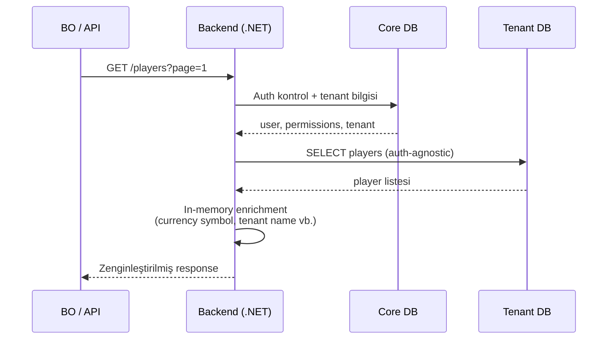
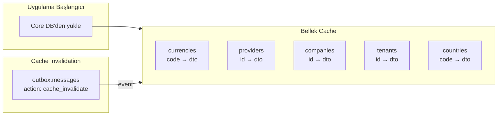
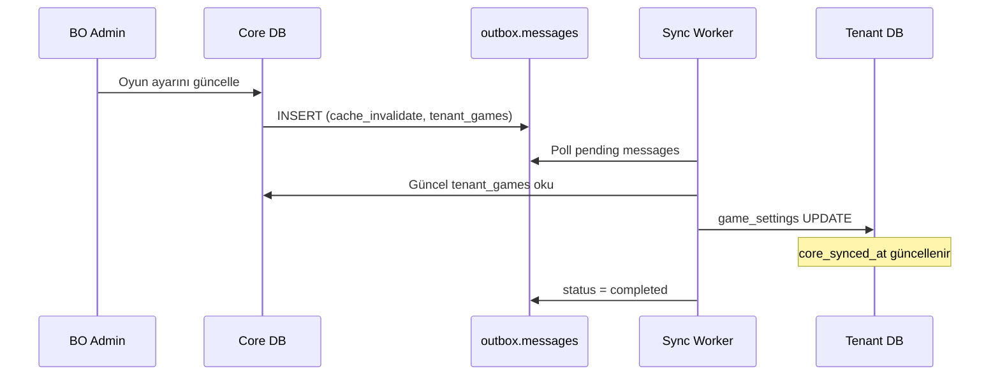
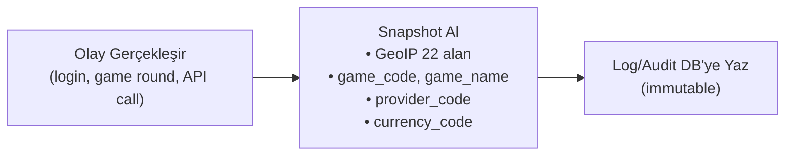

# Cross-DB Denormalizasyon ve Uygulama Katmanı Join Rehberi

Core DB'den diğer veritabanlarına yapılan denormalizasyonların tam haritası ve uygulama katmanında nasıl birleştirileceğinin stratejileri.

> **Temel Kural:** Fiziksel veritabanları arasında SQL JOIN yapılamaz. Tüm birleştirmeler uygulama katmanında gerçekleşir.

---

## Büyük Resim

```mermaid
flowchart TD
    subgraph core["Core DB (Master Data)"]
        providers["catalog.providers"]
        currencies["catalog.currencies<br/>catalog.cryptocurrencies"]
        companies["core.companies"]
        tenants["core.tenants"]
        tgames["core.tenant_games"]
        tpay["core.tenant_payment_methods"]
        geocache["catalog.ip_geo_cache"]
    end

    subgraph game["Game DB"]
        gp["catalog.game_providers"]
        games["catalog.games"]
        gcl["catalog.game_currency_limits"]
    end

    subgraph finance["Finance DB"]
        pp["catalog.payment_providers"]
        pm["catalog.payment_methods"]
        pmcl["catalog.payment_method_currency_limits"]
    end

    subgraph tenant["Tenant DB"]
        gs["game.game_settings"]
        gl["game.game_limits"]
        pms["finance.payment_method_settings"]
        pml["finance.payment_method_limits"]
        wallets["wallet.wallets"]
        rates["finance.currency_rates*"]
        ba["bonus.bonus_awards"]
    end

    subgraph logs["Log / Audit / Report DB'ler"]
        gr["game_rounds"]
        api["provider_api_requests"]
        audit["login_attempts/sessions"]
        report["*_hourly_stats"]
        aff["affiliate tracking"]
    end

    providers -->|"provider_sync"| gp
    providers -->|"provider_sync"| pp
    games -->|"game_settings_sync"| gs
    games -->|"denormalize"| tgames
    pm -->|"payment_settings_sync"| pms
    pm -->|"denormalize"| tpay
    currencies -->|"currency_code"| wallets
    currencies -->|"currency_code"| rates
    currencies -->|"currency_code"| report
    currencies -->|"currency_code"| aff
    geocache -->|"snapshot"| audit
    gs -->|"snapshot"| gr
    gs -->|"snapshot"| api
```



---

## 1. Provider Kopyaları (Core → Game DB, Finance DB)

| Kaynak (Core) | Hedef DB | Hedef Tablo | Kopyalanan Alanlar |
|---|---|---|---|
| `catalog.providers` | **Game** | `catalog.game_providers` | `provider_code`, `provider_name` |
| `catalog.providers` | **Finance** | `catalog.payment_providers` | `provider_code`, `provider_name` |

**Senkronizasyon:** Backend `game_provider_sync` / `payment_provider_sync` servisleri. Aynı `id` değerleri kullanılır (cross-DB ID consistency).

---

## 2. Game Kataloğu (Core ↔ Game → Tenant)

| Akış | Tablo | Kopyalanan Alanlar |
|---|---|---|
| Game → **Core** | `core.tenant_games` | `game_name`, `game_code`, `provider_code`, `game_type`, `thumbnail_url` |
| Game + Core → **Tenant** | `game.game_settings` | `game_code`, `game_name`, `provider_code`, `studio`, `game_type`, `game_subtype`, `categories[]`, `tags[]`, `rtp`, `volatility`, `max_multiplier`, `paylines`, `thumbnail_url`, `features[]`, `has_demo`, `has_jackpot`, `is_mobile`, `is_desktop` + tenant override (`custom_name`, `custom_thumbnail_url`, `rollout_status`) |
| Game + Core → **Tenant** | `game.game_limits` | `currency_code`, `currency_type` |

---

## 3. Payment Kataloğu (Core ↔ Finance → Tenant)

| Akış | Tablo | Kopyalanan Alanlar |
|---|---|---|
| Finance → **Core** | `core.tenant_payment_methods` | `payment_method_name`, `provider_code`, `payment_type`, `icon_url` |
| Finance + Core → **Tenant** | `finance.payment_method_settings` | `payment_method_code`, `payment_method_name`, `provider_code`, `payment_type`, `payment_subtype`, `channel`, `icon_url`, `logo_url`, `features[]`, `supports_recurring`, `supports_tokenization` + tenant override (`custom_name`, `custom_icon_url`, `rollout_status`) |
| Finance + Core → **Tenant** | `finance.payment_method_limits` | `currency_code`, `currency_type` |

---

## 4. Currency Kodu (Core → Her Yer)

`catalog.currencies.currency_code` ve `catalog.cryptocurrencies.symbol` neredeyse tüm DB'lere yayılmıştır:

| Hedef DB | Tablolar |
|---|---|
| **Tenant** | `wallet.wallets`, `finance.currency_rates*`, `finance.crypto_rates*`, `finance.payment_player_limits`, `finance.player_financial_limits`, `transaction.transactions`, `bonus.bonus_awards` |
| **Tenant Report** | Tüm 5 tablo (`currency` alanı) |
| **Core Report** | 4/5 tablo (`currency` alanı) |
| **Tenant Affiliate** | ~15 tablo (`currency` alanı: commissions, payouts, stats, tracking) |
| **Tenant Log** | `game_rounds`, `commission_calculations` |
| **Game Log** | `provider_api_requests`, `provider_api_callbacks` |
| **Bonus** | `campaign.campaigns` (`budget_currency`) |

---

## 5. GeoIP Verileri (Core → Audit DB'ler)

`catalog.ip_geo_cache` → 22 alan, **snapshot olarak** audit tablolarına yazılır:

| Hedef DB | Tablolar | Alan Sayısı |
|---|---|---|
| **Core Audit** | `backoffice.auth_audit_log` | 22 GeoIP alanı |
| **Tenant Audit** | `player_audit.login_attempts`, `login_sessions` | 22 GeoIP alanı |
| **Tenant Audit** | `affiliate_audit.login_attempts`, `login_sessions` | 22 GeoIP alanı |

**22 GeoIP alanı:** `country`, `country_code`, `continent`, `continent_code`, `region`, `region_name`, `city`, `district`, `zip`, `lat`, `lon`, `timezone`, `utc_offset`, `currency`, `isp`, `org`, `as_number`, `as_name`, `reverse_dns`, `is_mobile`, `is_proxy`, `is_hosting`

---

## 6. Game/Provider Kodları (Core/Game → Log DB'ler)

| Hedef DB | Tablo | Kopyalanan Alanlar |
|---|---|---|
| **Tenant Log** | `game_log.game_rounds` | `game_code`, `game_name`, `provider_code`, `currency_code` |
| **Game Log** | `provider_api_requests` | `provider_code`, `game_code`, `currency_code` |
| **Game Log** | `provider_api_callbacks` | `provider_code`, `game_code`, `currency_code` |

---

## 7. Company/Tenant ID'leri (Core → Report DB'ler)

| Hedef DB | Tablolar | Alanlar |
|---|---|---|
| **Core Report** | `monthly_invoices`, `tenant_daily_kpi`, `tenant_traffic_hourly` | `company_id`, `tenant_id` |

---

## 8. Bonus Rule Snapshot (Bonus DB → Tenant)

| Akış | Tablo | Strateji |
|---|---|---|
| Bonus → **Tenant** | `bonus.bonus_awards` | `bonus_rule_id`, `bonus_type_code`, `bonus_subtype` + **`rule_snapshot` JSONB** (tüm kural immutable kopyası) |

---

## Uygulama Katmanı Join Stratejileri

### Strateji 1: Backend Orchestration

Gerçek zamanlı UI istekleri için iki (veya daha fazla) DB'ye ayrı sorgu atılıp bellekte birleştirilir.



**Pseudocode:**

```csharp
// 1. Core DB'den auth + tenant bilgisi
var user = await coreDb.GetUserWithPermissions(userId);
var tenant = await coreDb.GetTenant(tenantId);

// 2. Tenant DB'den oyuncu listesi (auth-agnostic)
var players = await tenantDb.GetPlayers(page, filters);

// 3. Uygulama katmanında zenginleştirme
// currency_code zaten tenant DB'de var (denormalize)
// Ek bilgi gerekirse Core'dan çekilir
```

**Ne zaman:** Gerçek zamanlı kullanıcı arayüzü istekleri (BO panel, API çağrıları)

---

### Strateji 2: Reference Data Cache

Az değişen referans veriler uygulama belleğinde tutulur, outbox pattern ile invalidate edilir.



**Pseudocode:**

```csharp
public class ReferenceDataCache
{
    Dictionary<string, CurrencyDto> _currencies;   // currency_code → dto
    Dictionary<long, ProviderDto> _providers;       // provider_id → dto
    Dictionary<long, CompanyDto> _companies;        // company_id → dto
    Dictionary<long, TenantDto> _tenants;           // tenant_id → dto
    Dictionary<string, CountryDto> _countries;      // country_code → dto

    // Tenant DB'den gelen sonuçları zenginleştir
    public PlayerListDto Enrich(List<PlayerRow> rows)
    {
        return rows.Select(r => new PlayerListDto
        {
            PlayerId = r.Id,
            Username = r.Username,
            Balance = r.Balance,
            CurrencyCode = r.CurrencyCode,          // zaten denormalize
            CurrencySymbol = _currencies[r.CurrencyCode].Symbol,
            CurrencyName = _currencies[r.CurrencyCode].Name,
        });
    }
}
```

**Ne zaman:** Currency, country, provider gibi az değişen referans verileri

---

### Strateji 3: Sync Pipeline (Provisioning ve Event-Driven)

Master veri Core/Game/Finance DB'de değiştiğinde, outbox event ile Tenant DB'ye senkronize edilir.



**Akış:**
1. **İlk provisioning:** Tenant oluşturulurken Core'daki `tenant_games`, `tenant_payment_methods` → Tenant DB'ye `game_settings`, `payment_method_settings` olarak kopyalanır
2. **Güncelleme:** BO'dan oyun/ödeme yöntemi değiştiğinde → Core güncellenir → Outbox event → Backend sync → Tenant güncellenir
3. **`core_synced_at`:** Her tenant tablosunda son sync zamanı tutulur

**Ne zaman:** Oyun kataloğu, ödeme yöntemi ayarları, provider yapılandırması

---

### Strateji 4: Snapshot at Write Time (Log ve Audit)

Olay anında tüm bağlam verisi satıra gömülür. Sonrasında join gerekmez.



**Mantık:** Log/audit kayıtları yazıldıktan sonra **asla join gerekmez** — tüm bağlam olay anında yakalanır. Kaynak veri sonradan değişse bile log doğru kalır.

**Ne zaman:** `tenant_audit`, `core_audit`, `tenant_log`, `game_log` — tüm audit/log tabloları

---

### Strateji 5: JSONB Snapshot (Immutable Kural Dondurma)

Karmaşık iş kuralları, uygulandığı andaki haliyle JSONB olarak saklanır.

```csharp
// Bonus ödülü verilirken kural snapshot'ı alınır
var award = new BonusAward
{
    BonusRuleId = rule.Id,
    BonusTypeCode = rule.TypeCode,         // denormalize
    BonusSubtype = rule.Subtype,            // denormalize

    // Tüm kural JSONB olarak saklanır — cross-DB join'e gerek kalmaz
    RuleSnapshot = JsonSerializer.Serialize(rule),
    UsageCriteria = rule.UsageCriteria,
    RewardDetails = rule.RewardDetails,
};
```

**Neden:** Bonus kuralı sonradan değişebilir ama oyuncunun aldığı ödül, **o andaki** kurala göre değerlendirilmeli.

**Ne zaman:** Bonus kuralları, kampanya koşulları — zaman bağımlı iş kuralları

---

## Strateji Özet Tablosu

| Strateji | Kullanım Alanı | Join Yöntemi | Veri Tazeliği |
|---|---|---|---|
| **Backend Orchestration** | Gerçek zamanlı UI | İki DB'ye ayrı sorgu → bellek birleştirme | Anlık |
| **Reference Cache** | Currency, country, provider | Uygulama bellek cache + outbox invalidation | Dakikalar |
| **Sync Pipeline** | Game/payment settings | Provisioning + event-driven sync | Dakikalar–saatler |
| **Snapshot at Write** | Log/audit kayıtları | Join gerekmez — veri olay anında yakalanır | Immutable |
| **JSONB Snapshot** | Bonus kuralları | Join gerekmez — tüm kural JSON olarak saklanır | Immutable |

---

## İlgili Dökümanlar

- [DATABASE_ARCHITECTURE](../reference/DATABASE_ARCHITECTURE.md) — 14 veritabanı izolasyon modeli
- [PARTITION_ARCHITECTURE](../reference/PARTITION_ARCHITECTURE.md) — Partition ve retention stratejileri
- [PROVISIONING_GUIDE](PROVISIONING_GUIDE.md) — Tenant oluşturma ve ilk veri senkronizasyonu
- [BONUS_ENGINE_GUIDE](BONUS_ENGINE_GUIDE.md) — JSONB snapshot stratejisinin detayları
