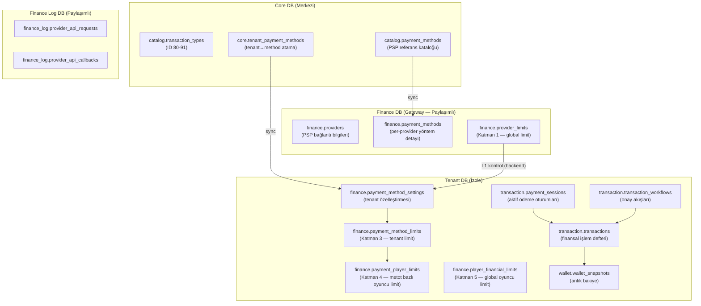
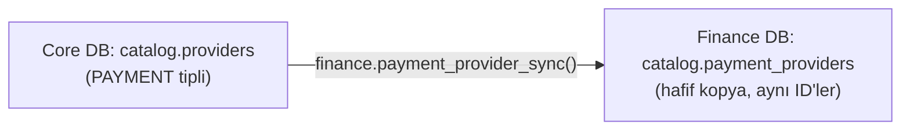
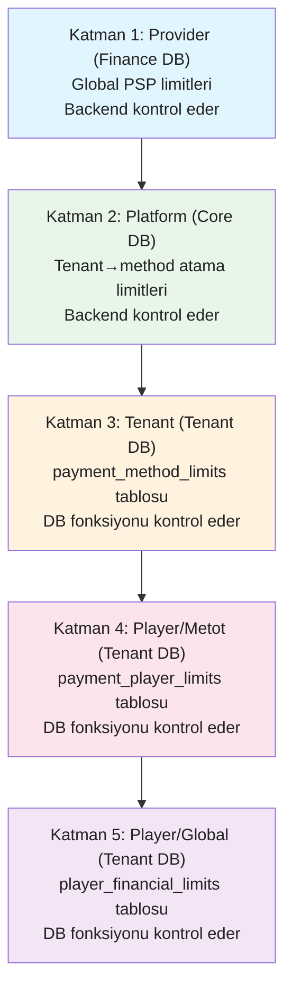
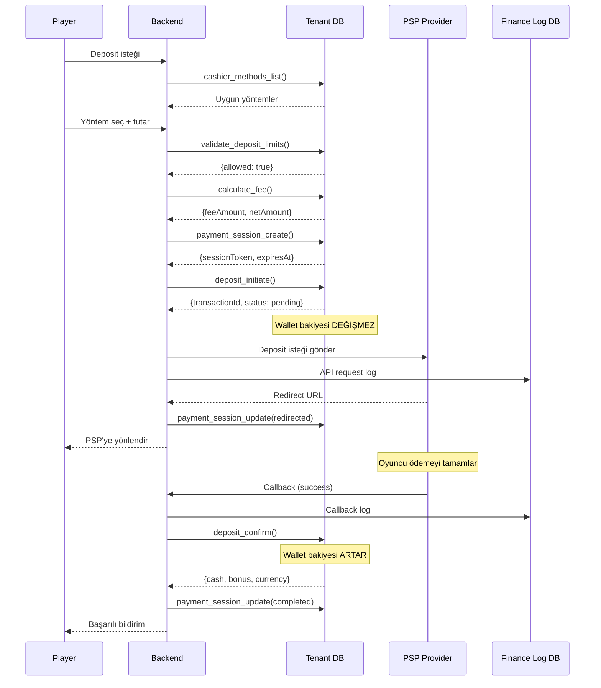
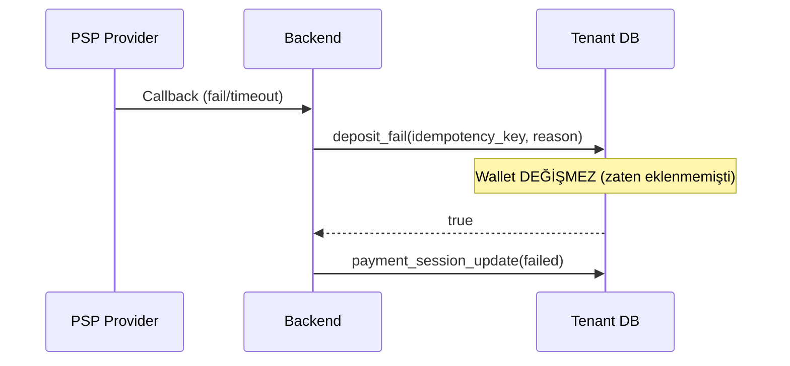
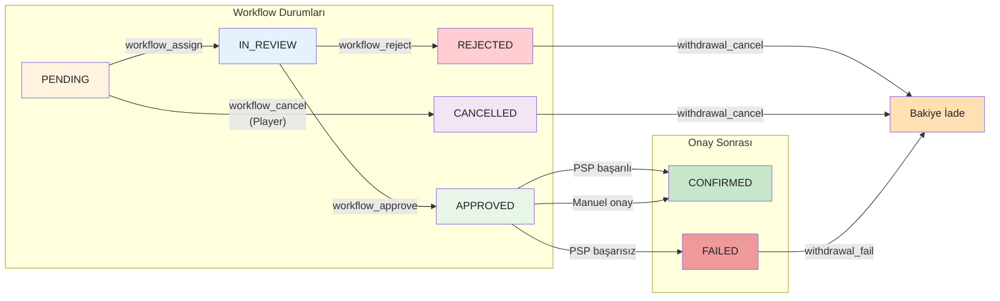
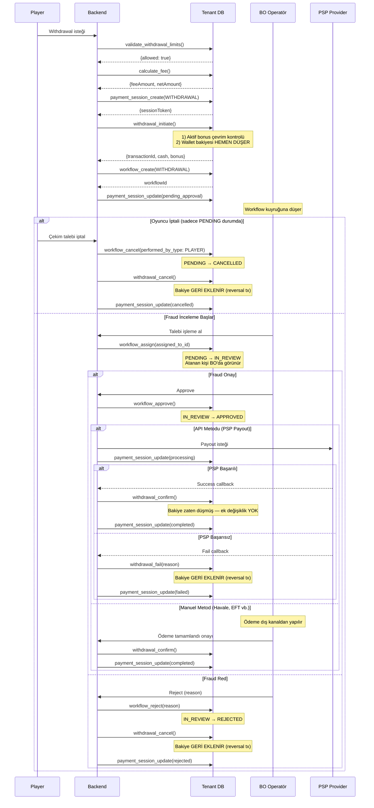
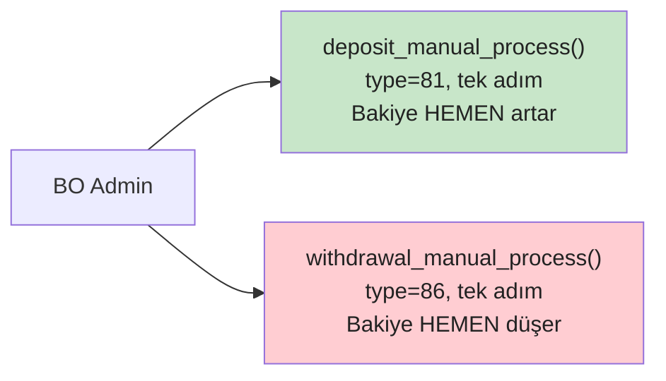
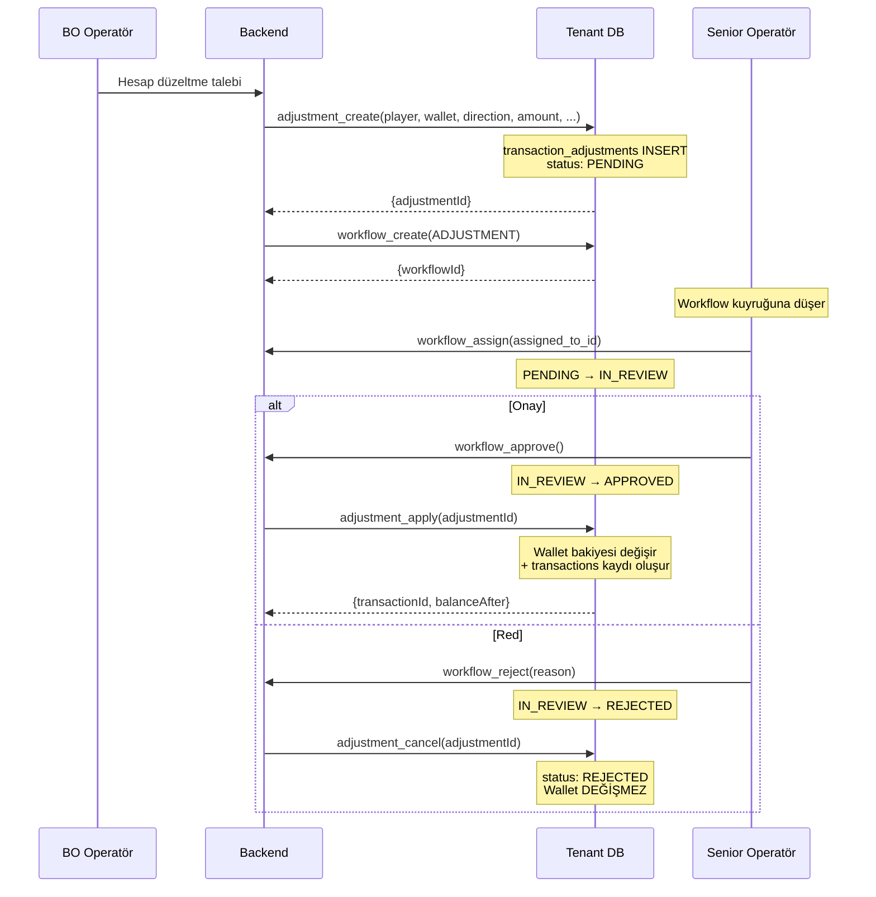

> **KULLANIM DIŞI:** Bu rehber artık güncel değildir.
> Fonksiyonel spesifikasyon için bkz. [SPEC_FINANCE_GATEWAY.md](SPEC_FINANCE_GATEWAY.md).
> Bu dosya yalnızca ek referans olarak korunmaktadır.

# Finance Gateway — Geliştirici Rehberi

Ödeme entegrasyonu iki temel bileşenden oluşur: **Ödeme Kataloğu** (Finance DB + Core DB + Tenant DB) ve **Ödeme İşlemleri** (deposit, withdrawal, manuel, workflow). Bu rehber her iki bileşeni de kapsar.

> **Kapsam:** TR (Papara, Mpay, Havale) + EU (Visa, Skrill, Paysafecard, Swift) + Crypto
> **Detaylı spesifikasyon:** [FINANCE_GATEWAY.md](../../.planning/FINANCE_GATEWAY.md)

---

## 1. Mimari Genel Bakış

### 1.1 Backend Gateway Mimarisi

| Katman | Bileşen | Teknoloji | Sorumluluk |
|--------|---------|-----------|------------|
| **API** | CashierController | ASP.NET Core | Ödeme yöntemi listeleme, deposit/withdrawal başlatma |
| | CallbackController | ASP.NET Core | PSP callback/webhook karşılama |
| | WorkflowController | ASP.NET Core | BO onay/red/atama işlemleri |
| **Orchestration** | PaymentSessionGrain | Orleans | Session yaşam döngüsü, durum geçişleri |
| | PlayerWalletGrain | Orleans | Oyuncu başına wallet işlemleri (seri erişim) |
| **Cache** | Session Cache | Redis | `payment-session:{token}` → session bilgisi |
| | Limit Cache | Redis | `limit:{tenantId}:{methodId}:{currency}` → limit bilgisi |
| | Rate Cache | Redis | `fee:{tenantId}:{methodId}:{currency}` → fee bilgisi |
| **Async** | callback.logged | RabbitMQ → Consumer | Finance Log DB'ye ham callback yaz |
| | workflow.created | RabbitMQ → Consumer | Workflow notification gönder |
| | session.expired | RabbitMQ → Consumer | Süresi dolan session'ları temizle |
| **DB** | Core / Finance / Tenant / Finance Log | PostgreSQL | Kalıcı veri |

### 1.2 Veritabanı Katmanları



---

## 2. Ödeme Kataloğu ve Yapılandırma

### 2.1 Bounded Context

Game ile aynı mimari pattern. Finance DB kendi catalog'unun sahibi olur.

| Fark | Game | Finance |
|------|------|---------|
| Catalog doldurma | Gateway API + BO import | **Sadece BO admin** (provider dokümantasyonuna göre) |
| Limit katmanı | 2 seviye (catalog → tenant) | **4 seviye** (provider → platform → tenant → player) |
| CRUD kaynağı | Fonksiyonlar yeni yazıldı | 6 fonksiyon **Core'dan taşındı** |
| Ek özellik | — | Player individual limits (sorumlu oyun) |

### 2.2 Provider Sync



- **Aynı ID'ler kullanılır** — `BIGINT PK`, serial değil. Cross-DB consistency sağlanır
- **TEXT→JSONB pattern**: `p_sync_data TEXT` → fonksiyon içinde `::JSONB` cast
- **UPSERT**: Mevcut provider varsa günceller, yoksa ekler

### 2.3 Tenant'a Provider Açma

```
1. Core: tenant_provider_enable(tenant_id, provider_id)
2. Finance DB: payment_method_list(provider_id) → metot listesi
3. Core: tenant_payment_method_upsert(tenant_id, method_data)
4. Tenant DB: payment_method_settings_sync + payment_method_limits_sync
```

### 2.4 Denormalizasyon

Core DB'deki `tenant_payment_methods` tablosunda denormalize alanlar: `payment_method_name`, `payment_method_code`, `provider_code`, `payment_type`, `icon_url`

**Neden?** Cross-DB FK kullanılamaz. Backend Finance DB'den veriyi alır, Core'a denormalize yazar. Tenant DB'ye sync ederken bu veriler aktarılır.

### 2.5 Core'da Metot Kapanması

```
Core: payment_method.is_active = false
  → Backend: tenant_payment_method_refresh çağrılır
  → Tenant DB: payment_method_settings.is_enabled = false (sync)
  → Oyuncu cashier'da göremez
```

**Provider kapanırsa** (`tenant_providers.is_enabled = false`): Metotların state'i değişmez, sadece provider'ın tüm metotları backend seviyesinde filtrelenir.

### 2.6 Crypto Desteği

Tüm limit tabloları `currency_code VARCHAR(20)` + `currency_type SMALLINT` kullanır:

| currency_type | Açıklama | Örnekler |
|---------------|----------|----------|
| 1 | Fiat | TRY, USD, EUR |
| 2 | Crypto | BTC, ETH, DOGE, SOL |

`DECIMAL(18,8)` hassasiyeti hem fiat hem crypto değerleri destekler.

---

## 3. 4 Katmanlı Limit Hiyerarşisi



| Katman | DB | Kontrol Eden | Tablo |
|--------|----|-------------|-------|
| L1 — Provider | Finance DB | Backend | `catalog.payment_method_currency_limits` |
| L2 — Platform | Core DB | Backend | `core.tenant_provider_limits` |
| L3 — Tenant | Tenant DB | DB fonksiyonu | `finance.payment_method_limits` |
| L4 — Player/Metot | Tenant DB | DB fonksiyonu | `finance.payment_player_limits` |
| L5 — Player/Global | Tenant DB | DB fonksiyonu | `finance.player_financial_limits` |

> L1+L2: Backend uygulama katmanında kontrol (farklı DB'ler arası join yapılamaz). L3-L5: Tenant DB fonksiyonu ile kontrol. En kısıtlayıcı limit geçerli olur.

### Player Limit Katmanları

| Tablo | Kapsam | Örnek |
|-------|--------|-------|
| `payment_player_limits` | Per-metot, per-currency | "Papara ile günde max 1000 TRY" |
| `player_financial_limits` | Global, per-currency | "Tüm yöntemlerle günde max 5000 TRY" |

### Player Limit Tipleri

| Tip | Belirleyen | Açıklama |
|-----|-----------|----------|
| `self_imposed` | Oyuncu | Kendi koyduğu limit (sorumlu oyun) |
| `admin_imposed` | BO Admin | Admin tarafından konulan limit |

---

## 4. Deposit Akışı

### 4.1 PSP Deposit (Başarılı Senaryo)



### 4.2 Deposit — Başarısız Senaryo



---

## 5. Withdrawal Akışı (PSP + Workflow)

### 5.1 Workflow Durum Geçiş Haritası



| Durum | Açıklama | Sonraki Geçiş |
|-------|----------|---------------|
| `PENDING` | Talep oluşturuldu, kuyrukta | → `IN_REVIEW` (BO atar) veya `CANCELLED` (oyuncu iptal) |
| `IN_REVIEW` | Fraud ekibi inceliyor, `assigned_to_id` dolu | → `APPROVED` veya `REJECTED` |
| `APPROVED` | Fraud onayladı, ödeme bekleniyor | → PSP/Manuel sonuç |
| `REJECTED` | Fraud reddetti, bakiye iade edilir | Son durum |
| `CANCELLED` | Oyuncu iptal etti, bakiye iade edilir | Son durum |

### 5.2 Tam Akış (Tüm Senaryolar)



### 5.3 Oyuncu İptal Kuralları

| Kural | Açıklama |
|-------|----------|
| Sadece `PENDING` durumda | Workflow `IN_REVIEW`'a geçtikten sonra oyuncu iptal **edemez** |
| `performed_by_type: PLAYER` | `workflow_actions` tablosunda kim iptal ettiği kaydedilir |
| Bakiye otomatik iade | `withdrawal_cancel()` ile reversal transaction oluşturulur |
| Session kapatılır | `payment_session_update(cancelled)` ile session sonlandırılır |

> **Kullanım senaryosu:** Oyuncu çekim talebi verdikten sonra oyuna devam etmek isterse, henüz fraud ekibi talebi almamışsa talebi iptal edebilir.

### 5.4 Bonus Çevrim Kontrolü (Otomatik)

`withdrawal_initiate()` fonksiyonu içinde otomatik çevrim kontrolü yapılır. Tenant'ın `wagering_completion_policy` ayarına göre iki farklı davranış:

#### Adım 1 — Tamamlanmamış çevrim engeli (her iki politikada ortak)

```sql
-- Aktif bonus çevrim kontrolü
SELECT EXISTS (
    SELECT 1 FROM bonus.bonus_awards
    WHERE player_id = p_player_id
      AND status = 'active'
      AND wagering_completed = false
) INTO v_has_active_wagering;

IF v_has_active_wagering THEN
    RAISE EXCEPTION 'error.withdrawal.active-wagering-incomplete'
        USING ERRCODE = 'P0403';
END IF;
```

#### Adım 2 — Tamamlanmış çevrim: politikaya göre işlem

| Politika | Çevrim tamamlandığında | Çekim anında |
|----------|----------------------|-------------|
| `auto_transfer` | Worker hemen BONUS → REAL transfer eder | REAL wallet'tan düşülür |
| `hold_until_withdrawal` | BONUS wallet'ta bekler | BONUS kilitlenir + REAL düşülür, onayda BONUS düşülür |

**`hold_until_withdrawal` politikası:**

```sql
-- Çevrimi tamamlanmış ama transfer edilmemiş bonusları kilitle
FOR v_award IN
    SELECT id, current_balance FROM bonus.bonus_awards
    WHERE player_id = p_player_id
      AND status = 'wagering_complete'
    ORDER BY expires_at ASC  -- En yakın süreli bonus önce
LOOP
    IF v_remaining_from_bonus <= 0 THEN EXIT; END IF;

    v_lock_amount := LEAST(v_award.current_balance, v_remaining_from_bonus);

    UPDATE bonus.bonus_awards
    SET status = 'pending_withdrawal',
        locked_for_withdrawal = v_lock_amount
    WHERE id = v_award.id;

    v_remaining_from_bonus := v_remaining_from_bonus - v_lock_amount;
END LOOP;

-- REAL wallet'tan kalan kısmı pessimistic lock ile düşür
```

**İptal durumunda:** BONUS kilidi açılır (`pending_withdrawal` → `wagering_complete`), REAL iade edilir. Transfer hiç olmadığı için temiz bir geri alma.

**Onay durumunda:** BONUS wallet'tan kilitli tutar düşülür, REAL kısmı zaten düşmüş — ek işlem yok.

> **Neden tenant-configurable?** Bazı tenant'lar çevrim tamamlanınca anında REAL'a aktarım isterken, diğerleri bonus parasının çekim onaylanana kadar BONUS wallet'ta kalmasını tercih eder. `hold_until_withdrawal` iptalleri temiz tutar ve bonus parasının kontrolünü korur.

---

## 6. BO İşlemleri

### 6.1 Manuel Deposit / Withdrawal



- PSP entegrasyonu gerektirmez
- Tek adımda tamamlanır (`confirmed_at = NOW()`)
- Workflow gerektirmez — BO admin zaten onay mercii
- İdempotency korumalı

### 6.2 Hesap Düzeltme (Account Adjustment)

Yetkili BO operatörünün oyuncu wallet'ına **credit** (ekleme) veya **debit** (kesme) yapması. Manuel deposit/withdrawal'dan farklı olarak **workflow zorunludur** ve opsiyonel olarak **GGR raporlamasına** dahil edilebilir.

#### Kullanım Senaryoları

| Senaryo | Yön | Wallet | GGR Etkisi |
|---------|-----|--------|-----------|
| Geç bildirilen kazanç (ör: Pragmatic geç win) | CREDIT | REAL | Evet — provider + game referansı |
| Haksız verilen bonus kesimi | DEBIT | BONUS | Hayır |
| Fraud tespiti sonrası bakiye düzeltme | DEBIT | REAL | Hayır |
| Teknik hata telafisi | CREDIT | REAL | Opsiyonel |
| Provider settlement farkı | CREDIT/DEBIT | REAL | Evet — provider referansı |

#### Akış



#### GGR Etkisi

Game provider kaynaklı düzeltmelerde `provider_id` ve `game_id` referans verilmesi **zorunludur**. Bu sayede:

- **GGR = Toplam Bahis − Toplam Kazanç** formülü doğru kalır
- Provider settlement raporlarıyla eşleştirme yapılabilir
- Düzeltme, ilgili provider'ın GGR raporuna dahil edilir

```
Örnek: Pragmatic 250 TL geç kazanç bildirdi
→ adjustment_create(
    direction: CREDIT,
    wallet_type: REAL,
    amount: 250,
    adjustment_type: GAME_CORRECTION,
    provider_id: 5,        -- Pragmatic
    game_id: 142,          -- Sweet Bonanza
    external_ref: 'PGM-2026-88431'  -- Provider referansı
  )
→ GGR raporunda Pragmatic kazanç sütununa +250 TL eklenir
```

#### `transaction_adjustments` Detay Tablosu

```sql
CREATE TABLE transaction.transaction_adjustments (
    id              bigserial PRIMARY KEY,
    transaction_id  bigint,                  -- NULL → apply sonrası dolar
    player_id       bigint NOT NULL,
    wallet_type     varchar(10) NOT NULL,    -- REAL, BONUS
    direction       varchar(10) NOT NULL,    -- CREDIT, DEBIT
    amount          numeric(18,8) NOT NULL,
    currency_code   varchar(20) NOT NULL,
    adjustment_type varchar(30) NOT NULL,    -- GAME_CORRECTION, BONUS_CORRECTION, FRAUD, MANUAL
    status          varchar(20) NOT NULL DEFAULT 'PENDING',
    provider_id     bigint,                  -- GGR için (nullable)
    game_id         bigint,                  -- GGR için (nullable)
    external_ref    varchar(100),            -- Provider referansı
    reason          varchar(500) NOT NULL,
    created_by_id   bigint NOT NULL,         -- Talebi oluşturan BO user
    approved_by_id  bigint,                  -- Onaylayan (workflow'dan)
    workflow_id     bigint,
    created_at      timestamptz NOT NULL DEFAULT now(),
    applied_at      timestamptz
);
```

> **Neden ayrı tablo?** `transactions` tablosu partitioned ve yalın tutulmalı. Adjustment metadata (provider, game, reason, external_ref) sadece düzeltme işlemlerine özgü — her transaction'a eklenmesi gereksiz şişkinlik yaratır.

---

## 7. Kritik Tasarım Kararları

### 7.1 Deposit vs Withdrawal — Bakiye Stratejisi

| | Deposit | Withdrawal |
|---|---------|-----------|
| **Initiate** | Bakiye değişmez | Bakiye HEMEN düşer + çevrim kontrolü |
| **Confirm** | Bakiye artar | Bakiye değişmez (zaten düşmüş) |
| **Cancel** | — | Bakiye GERİ eklenir (BO red / oyuncu iptal) |
| **Fail** | Bakiye değişmez | Bakiye GERİ eklenir (PSP red) |
| **Sebep** | PSP onayı olmadan para eklenmemeli | Oyuncu parayı başka yerde harcamasın |

### 7.2 Workflow Ayrımı

- **DB fonksiyonları:** Sadece workflow durumunu yönetir (PENDING → IN_REVIEW → APPROVED/REJECTED/CANCELLED)
- **Backend:** Approve sonrası `withdrawal_confirm()`, reject sonrası `withdrawal_cancel()`, PSP fail sonrası `withdrawal_fail()` çağırmalı
- Separation of concerns — DB tek sorumluluğu wallet ve workflow yönetimi

### 7.5 Workflow Durum Geçiş Kuralları

| Mevcut Durum | Aksiyon | Yeni Durum | Kim Yapabilir |
|-------------|---------|-----------|---------------|
| `PENDING` | `workflow_assign` | `IN_REVIEW` | BO Operatör |
| `PENDING` | `workflow_cancel` | `CANCELLED` | Player |
| `IN_REVIEW` | `workflow_approve` | `APPROVED` | BO Operatör |
| `IN_REVIEW` | `workflow_reject` | `REJECTED` | BO Operatör |
| `IN_REVIEW` | `workflow_escalate` | `IN_REVIEW` | BO Operatör (üst seviyeye) |

> **Önemli:** `IN_REVIEW` durumundaki talep oyuncu tarafından iptal edilemez. Bu, fraud ekibinin inceleme sürecini korur.

### 7.6 API vs Manuel Metod Akışı (Onay Sonrası)

| Akış | Tetikleyen | Sonuç |
|------|-----------|-------|
| **API Metodu** | `workflow_approve` → Backend PSP'ye payout gönderir | PSP callback: `withdrawal_confirm()` veya `withdrawal_fail()` |
| **Manuel Metod** | `workflow_approve` → BO'da "ödeme tamamlandı" butonu bekler | BO onayı: `withdrawal_confirm()` |

Backend, ödeme yönteminin `integration_type` alanına göre (`API` / `MANUAL`) hangi akışa gireceğine karar verir.

### 7.7 Bonus Çevrim Politikaları (Tenant-Configurable)

Tenant ayarı: `wagering_completion_policy` — çevrim tamamlanınca ne olacağını belirler.

#### Politika Karşılaştırması

| | `auto_transfer` | `hold_until_withdrawal` |
|---|---|---|
| **Çevrim tamamlanınca** | Worker: BONUS → REAL transfer (tx 42) | BONUS wallet'ta bekler (`wagering_complete` status) |
| **Çekim talebi** | Sadece REAL'dan düşülür | BONUS kilitlenir + REAL düşülür |
| **Onay** | Zaten REAL'dan düşmüş | BONUS wallet'tan kilitli tutar düşülür |
| **İptal** | REAL'a iade (bonus artık REAL'da kalır) | REAL iade + BONUS kilidi açılır (temiz geri alma) |
| **Avantaj** | Basit implementasyon | Temiz iptal, bonus kontrolü korunur |
| **Dezavantaj** | İptal sonrası bonus parası REAL'da | Daha karmaşık wallet yönetimi |

#### `hold_until_withdrawal` — Bonus Award Status Geçişleri

```
active → wagering_complete → pending_withdrawal → completed
                                    ↓ (iptal)
                            wagering_complete (geri)
```

| Status | Açıklama |
|--------|----------|
| `active` | Çevrim devam ediyor |
| `wagering_complete` | Çevrim tamamlandı, BONUS wallet'ta bekliyor |
| `pending_withdrawal` | Çekim talebi var, kilitli (oyuncu harcayamaz) |
| `completed` | Çekim onaylandı, BONUS wallet'tan düşüldü |

#### Bakiye Hesaplama (hold politikası)

```
Çekilebilir bakiye = REAL wallet + Σ(wagering_complete bonus bakiyeleri)

Örnek:
  REAL: 300 TL
  BONUS award #1: 200 TL (wagering_complete)
  BONUS award #2: 300 TL (wagering_complete)
  BONUS award #3: 150 TL (active, wagering %60) → DAHİL DEĞİL
  ─────────────────────────────
  Çekilebilir: 300 + 200 + 300 = 800 TL

Çekim talebi: 700 TL
  → BONUS #1: 200 TL kilitlenir (pending_withdrawal)
  → BONUS #2: 300 TL'den 200 TL kilitlenir (kısmi kilit)
  → REAL: 300 TL düşülür (pessimistic lock)
  → Toplam: 200 + 200 + 300 = 700 TL ✓
```

- **Frontend:** `bonus_award_list()` fonksiyonundaki `wageringPercent` ile progress bar gösterilir
- **Backend:** Çekilebilir bakiyeyi hesaplarken `wagering_complete` bonusları dahil eder
- **DB:** `withdrawal_initiate()` içinde bypass edilemez kontrol (son savunma hattı)

### 7.3 Cross-DB Limit Kontrolü

- **L1 (Provider) + L2 (Platform):** Backend uygulama katmanında kontrol (Finance DB + Core DB)
- **L3 (Tenant) + L4 (Player):** Tenant DB fonksiyonu ile kontrol
- Farklı DB'ler arası join yapılamaz, backend orchestrate eder

### 7.4 Manuel İşlemler

- PSP entegrasyonu gerektirmez
- Tek adımda tamamlanır — `confirmed_at = NOW()`
- Workflow gerektirmez — BO admin zaten onay mercii
- İdempotency ile tekrardan korunur

---

## 8. Transaction Type Matrisi

| ID | Kod | Kategori | Rollback | Açıklama |
|----|-----|----------|----------|----------|
| 80 | `deposit.provider` | deposit | - | PSP para yatırma |
| 81 | `deposit.manual` | deposit | - | Manuel para yatırma |
| 82 | `deposit.crypto` | deposit | - | Kripto para yatırma |
| 85 | `withdrawal.provider` | withdrawal | - | PSP para çekme |
| 86 | `withdrawal.manual` | withdrawal | - | Manuel para çekme |
| 87 | `withdrawal.crypto` | withdrawal | - | Kripto para çekme |
| 90 | `deposit.chargeback` | chargeback | rollback | Chargeback |
| 91 | `withdrawal.reversal` | reversal | rollback | Çekim iptali |
| 95 | `adjustment.credit` | adjustment | - | Hesap düzeltme — ekleme |
| 96 | `adjustment.debit` | adjustment | - | Hesap düzeltme — kesme |

---

## 9. Ödeme İşlem Fonksiyonları (36 fonksiyon)

### 9.1 Payment Session (transaction schema — 3 fonksiyon)

| Fonksiyon | Parametreler (kısa) | Döner | Açıklama |
|-----------|---------------------|-------|----------|
| `payment_session_create` | player_id, type, method, amount, currency, ttl | JSONB | Session oluştur, token üret |
| `payment_session_get` | session_token | JSONB | Session bilgisi (expire kontrollü) |
| `payment_session_update` | session_token, status, provider_* | VOID | COALESCE ile güncelle |

### 9.2 Deposit (wallet schema — 4 fonksiyon)

| Fonksiyon | Bakiye Etkisi | Açıklama |
|-----------|---------------|----------|
| `deposit_initiate` | Değişmez | PENDING tx oluştur, PSP onayı bekle |
| `deposit_confirm` | +amount | Wallet bakiye artır, tx onayla |
| `deposit_fail` | Değişmez | Fail reason kaydet |
| `deposit_manual_process` | +amount | Tek adım: wallet artır + confirmed tx |

### 9.3 Withdrawal (wallet schema — 5 fonksiyon)

| Fonksiyon | Bakiye Etkisi | Açıklama |
|-----------|---------------|----------|
| `withdrawal_initiate` | −(amount+fee) | Çevrim kontrolü + HEMEN bakiye düşür, PENDING tx |
| `withdrawal_confirm` | Değişmez | Bakiye zaten düşmüş, tx onayla |
| `withdrawal_cancel` | +(amount+fee) | BO red / oyuncu iptal → reversal tx ile bakiye geri |
| `withdrawal_fail` | +(amount+fee) | PSP red → reversal tx ile bakiye geri |
| `withdrawal_manual_process` | −amount | Tek adım: bakiye düşür + confirmed tx |

### 9.4 Workflow (transaction schema — 9 fonksiyon)

| Fonksiyon | Durum Geçişi | Açıklama |
|-----------|-------------|----------|
| `workflow_create` | → `PENDING` | Onay akışı başlat (WITHDRAWAL, ADJUSTMENT, HIGH_VALUE, SUSPICIOUS, KYC_REQUIRED) |
| `workflow_assign` | `PENDING` → `IN_REVIEW` | BO kullanıcısına ata, `assigned_to_id` güncelle |
| `workflow_approve` | `IN_REVIEW` → `APPROVED` | Onayla → backend withdrawal_confirm veya PSP payout çağırır |
| `workflow_reject` | `IN_REVIEW` → `REJECTED` | Reddet → backend withdrawal_cancel çağırır |
| `workflow_cancel` | `PENDING` → `CANCELLED` | Oyuncu iptali → backend withdrawal_cancel çağırır |
| `workflow_escalate` | `IN_REVIEW` (kalır) | Üst seviyeye yükselt, `assigned_to_id` değişir |
| `workflow_add_note` | — (değişmez) | Not ekle (durumu değiştirmez) |
| `workflow_list` | — | Filtrelemeli + sayfalı liste (status, assigned_to filtresi) |
| `workflow_get` | — | Detay + action geçmişi + transaction bilgisi |

### 9.5 Limit + Cashier (finance schema — 6 fonksiyon)

| Fonksiyon | Açıklama |
|-----------|----------|
| `validate_transaction_limits` | L3+L4 limit kontrolü (direction parametreli) |
| `validate_deposit_limits` | Deposit wrapper → validate_transaction_limits |
| `validate_withdrawal_limits` | Withdrawal wrapper → validate_transaction_limits |
| `calculate_fee` | fee = MAX(min, MIN(max, amount×percent+fixed)) |
| `cashier_methods_list` | Aktif yöntemler (shadow/platform/country filtreli) |
| `cashier_method_detail` | Yöntem detayı + player limit + fee |

### 9.6 Finance Log (maintenance schema — 4 fonksiyon)

| Fonksiyon | Açıklama |
|-----------|----------|
| `create_partitions` | 14 gün ileri daily partition oluştur |
| `drop_expired_partitions` | 14 gün retention ile eski partition'ları sil |
| `partition_info` | Partition durum raporu |
| `run_maintenance` | Cron: oluştur + sil |

### 9.7 Hesap Düzeltme (transaction schema — 5 fonksiyon)

| Fonksiyon | Bakiye Etkisi | Açıklama |
|-----------|---------------|----------|
| `adjustment_create` | Değişmez | PENDING kayıt oluştur, workflow beklenir |
| `adjustment_apply` | ±amount | Workflow onayı sonrası wallet'a uygula (CREDIT veya DEBIT) |
| `adjustment_cancel` | Değişmez | Workflow reddi sonrası iptal et |
| `adjustment_get` | — | Düzeltme detayı + workflow durumu |
| `adjustment_list` | — | Filtrelemeli + sayfalı liste (status, player, type) |

> **GGR notu:** `adjustment_apply()` fonksiyonu `provider_id` ve `game_id` doluysa, oluşturduğu transaction kaydında bu bilgileri `description` alanına yapısal olarak yazar. Raporlama fonksiyonları bu bilgiyi GGR hesaplamasına dahil eder.

---

## 10. Hata Kodu Haritası

| Kod | ERRCODE | Açıklama |
|-----|---------|----------|
| `error.deposit.player-required` | P0400 | player_id zorunlu |
| `error.deposit.invalid-amount` | P0400 | amount > 0 olmalı |
| `error.deposit.idempotency-required` | P0400 | idempotency_key zorunlu |
| `error.deposit.player-not-active` | P0403 | Oyuncu aktif değil |
| `error.deposit.wallet-not-found` | P0404 | REAL wallet bulunamadı |
| `error.deposit-confirm.transaction-not-found` | P0404 | Pending tx bulunamadı |
| `error.deposit-confirm.already-confirmed` | — | İdempotent (mevcut sonuç dönülür) |
| `error.deposit-confirm.player-mismatch` | P0403 | Player ID uyumsuz |
| `error.deposit-fail.already-confirmed` | P0409 | Zaten onaylanmış tx fail edilemez |
| `error.withdrawal.insufficient-balance` | P0402 | Yetersiz bakiye |
| `error.withdrawal-confirm.already-confirmed` | P0409 | Zaten onaylanmış |
| `error.withdrawal-cancel.already-confirmed` | P0409 | Onaylanmış çekim iptal edilemez |
| `error.withdrawal.active-wagering-incomplete` | P0403 | Aktif bonus çevrim şartı tamamlanmamış |
| `error.withdrawal-fail.already-confirmed` | P0409 | Zaten onaylanmış çekim fail edilemez |
| `error.workflow.not-pending` | P0409 | Workflow PENDING durumda değil (oyuncu iptal) |
| `error.workflow.not-in-review` | P0409 | Workflow IN_REVIEW durumda değil (approve/reject) |
| `error.adjustment.invalid-direction` | P0400 | direction CREDIT veya DEBIT olmalı |
| `error.adjustment.invalid-wallet-type` | P0400 | wallet_type REAL veya BONUS olmalı |
| `error.adjustment.provider-required` | P0400 | GAME_CORRECTION tipi için provider_id zorunlu |
| `error.adjustment.not-pending` | P0409 | Adjustment PENDING durumda değil |
| `error.adjustment.insufficient-balance` | P0402 | DEBIT için yetersiz wallet bakiyesi |
| `error.finance.session-not-found` | P0404 | Session bulunamadı |
| `error.finance.session-expired` | P0410 | Session süresi dolmuş |
| `error.workflow.already-pending` | P0409 | Aynı tx için aktif workflow var |
| `error.workflow.invalid-type` | P0400 | Geçersiz workflow tipi |
| `error.limit-validation.invalid-direction` | P0400 | Geçersiz direction |
| `error.calculate-fee.invalid-direction` | P0400 | Geçersiz direction |
| `error.cashier.invalid-direction` | P0400 | Geçersiz direction |

---

## 11. Index Stratejisi — payment_sessions

| Index | Tip | Koşul | Amaç |
|-------|-----|-------|------|
| `idx_payment_sessions_token` | UNIQUE btree | — | Token ile hızlı lookup |
| `idx_payment_sessions_player` | btree(player_id, created_at DESC) | — | Oyuncu session'ları |
| `idx_payment_sessions_active` | btree(status, created_at DESC) | status IN (aktif durumlar) | Aktif session'lar |
| `idx_payment_sessions_expires` | btree(expires_at) | status IN (aktif durumlar) | Expire temizliği |
| `idx_payment_sessions_idempotency` | btree(idempotency_key, created_at) | idempotency_key IS NOT NULL | İdempotency kontrolü |
| `idx_payment_sessions_method_status` | btree(payment_method_id, status) | payment_method_id IS NOT NULL | Yönteme göre filtreleme |

---

## 12. Backend Orchestration

### 12.1 Deposit

```
1.  cashier_methods_list() → Yöntem listele
2.  cashier_method_detail() → Seçilen yöntem detayı
3.  validate_deposit_limits() → Limit kontrol (L3+L4)
4.  calculate_fee() → Fee hesapla
5.  payment_session_create() → Session oluştur
6.  deposit_initiate() → PENDING tx oluştur
7.  PSP API call → Provider'a ilet
8.  payment_session_update(processing/redirected) → Durum güncelle
9.  [Callback] deposit_confirm() veya deposit_fail()
10. payment_session_update(completed/failed)
```

### 12.2 Withdrawal

```
1.  validate_withdrawal_limits() → Limit kontrol (L3+L4)
2.  calculate_fee() → Fee hesapla
3.  payment_session_create(WITHDRAWAL)
4.  withdrawal_initiate() → Çevrim kontrolü + Bakiye HEMEN düşür
5.  workflow_create(WITHDRAWAL) → Onay akışı başlat (PENDING)
6.  payment_session_update(pending_approval)

--- Oyuncu İptal (sadece PENDING durumda) ---
7a. workflow_cancel(PLAYER) → CANCELLED
7b. withdrawal_cancel() → Bakiye geri
7c. payment_session_update(cancelled)

--- Fraud İnceleme ---
8.  workflow_assign(assigned_to_id) → PENDING → IN_REVIEW
9.  workflow_approve() veya workflow_reject()

--- Onay Sonrası ---
10a. Approve + API metod → PSP payout → withdrawal_confirm() veya withdrawal_fail()
10b. Approve + Manuel metod → BO "ödeme tamamlandı" → withdrawal_confirm()
10c. Reject → withdrawal_cancel() → Bakiye geri
11.  payment_session_update(completed/failed/rejected/cancelled)
```

### 12.3 Hesap Düzeltme (Account Adjustment)

```
1. adjustment_create(player, wallet_type, direction, amount, ...) → PENDING
2. workflow_create(ADJUSTMENT) → Onay akışı başlat
3. [BO] workflow_assign() → PENDING → IN_REVIEW
4. [BO] workflow_approve() veya workflow_reject()
5a. Approve → adjustment_apply() → Wallet bakiyesi değişir
5b. Reject → adjustment_cancel() → Wallet değişmez
```

> **GAME_CORRECTION** tipinde `provider_id` ve `game_id` zorunludur. GGR raporlaması bu bilgiyi kullanır.

### 12.4 Provider Entegrasyon Haritası

| Bölge | Provider | Yöntemler | Tip |
|-------|----------|-----------|-----|
| **TR** | Papara | E-wallet | EWALLET |
| | Mpay | E-wallet | EWALLET |
| | Havale/EFT | Banka transferi | BANK |
| **EU** | Visa/MC | Kredi/Debit kart | CARD |
| | Skrill | E-wallet | EWALLET |
| | Paysafecard | Prepaid | PREPAID |
| | Swift | Banka transferi | BANK |
| **Global** | BTC/ETH/USDT | Kripto | CRYPTO |

---

## 13. Ödeme Kataloğu Fonksiyonları (27 fonksiyon)

| DB | Grup | Fonksiyonlar |
|----|------|-------------|
| Finance DB | Provider Sync | `payment_provider_sync` |
| Finance DB | Catalog CRUD | `payment_method_create/update/delete/get/list/lookup`, `payment_method_currency_limit_sync` |
| Core DB | Tenant Provider | `tenant_provider_enable/disable/list` (Finance variant) |
| Core DB | Tenant Method | `tenant_payment_method_upsert/list/remove/refresh` |
| Tenant DB | Sync | `payment_method_settings_sync/remove`, `payment_method_limits_sync` |
| Tenant DB | BO + Cashier | `payment_method_settings_get/update/list`, `payment_method_limit_upsert/list` |
| Tenant DB | Player Limits | `payment_player_limit_set/get/list` |

---

## 14. Backend İçin Notlar

- **TEXT→JSONB pattern**: Tüm sync fonksiyonları `p_data TEXT` → `::JSONB` cast
- **Cross-DB**: Her DB ayrı connection. Backend orchestrate eder: Finance DB → Core DB → Tenant DB
- **Auth**: Finance DB fonksiyonları auth-agnostic. Core DB'de `user_assert_access_tenant` ile kontrol
- **Shadow mode**: `payment_method_settings_list` fonksiyonunda `rollout_status` filtresi → [SHADOW_MODE_GUIDE.md](SHADOW_MODE_GUIDE.md)
- **Limit kontrolü**: Cashier akışında 4 katman sırasıyla kontrol edilmeli, en kısıtlayıcı değer geçerli
- **Toplam fonksiyon**: 36 (ödeme işlemleri) + 27 (katalog) = 63 fonksiyon

---

_İlgili dokümanlar: [FINANCE_GATEWAY.md](../../.planning/FINANCE_GATEWAY.md) · [GAME_GATEWAY_GUIDE.md](GAME_GATEWAY_GUIDE.md) · [FUNCTIONS_GATEWAY.md](../reference/FUNCTIONS_GATEWAY.md) · [FUNCTIONS_CORE.md](../reference/FUNCTIONS_CORE.md) · [SHADOW_MODE_GUIDE.md](SHADOW_MODE_GUIDE.md)_
