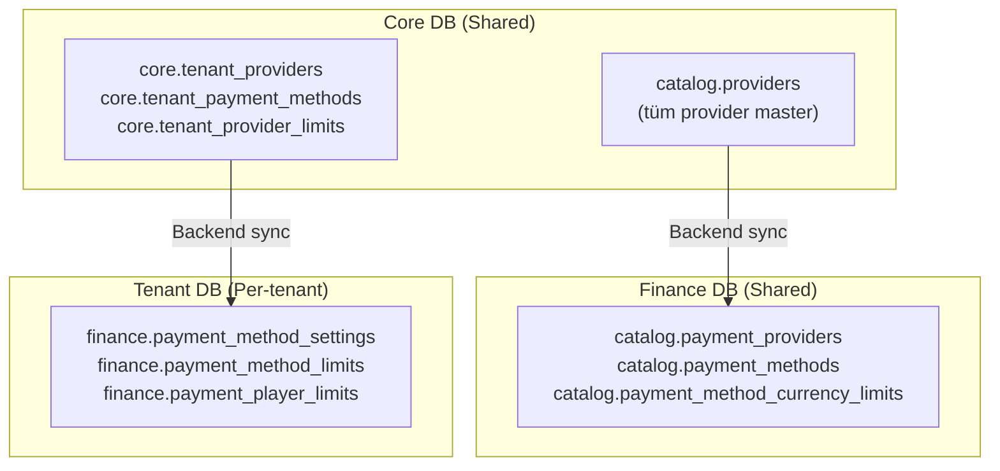
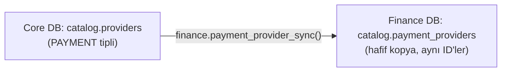

# Finance Gateway — Geliştirici Rehberi

Ödeme entegrasyonu **bounded context** mimarisi kullanır. **Finance DB ödeme kataloğunun sahibidir**. Core DB yalnızca tenant mapping tutar. Game ile aynı mimari pattern, önemli farklar aşağıda.

---

## Büyük Resim



---

## Game'den Farkları

| Fark | Game | Finance |
|------|------|---------|
| Catalog doldurma | Gateway API + BO import | **Sadece BO admin** (provider dokümantasyonuna göre) |
| Limit katmanı | 2 seviye (catalog → tenant) | **4 seviye** (provider → platform → tenant → player) |
| CRUD kaynağı | Fonksiyonlar yeni yazıldı | 6 fonksiyon **Core'dan taşındı** |
| Ek özellik | — | Player individual limits (sorumlu oyun) |

---

## Provider Sync Akışı



- **Aynı ID'ler kullanılır** — `BIGINT PK`, serial değil. Cross-DB consistency sağlanır
- **TEXT→JSONB pattern**: `p_sync_data TEXT` → fonksiyon içinde `::JSONB` cast
- **UPSERT**: Mevcut provider varsa günceller, yoksa ekler

---

## Limit Hiyerarşisi (4 Katman)

Finance'in en önemli farkı: deposit/withdrawal limitleri 4 katmanlı hiyerarşik yapıdadır.

```
1. catalog.payment_method_currency_limits  (Provider ceiling — Finance DB)
   Provider'ın desteklediği max/min limitler
       ↓
2. core.tenant_provider_limits             (Platform ceiling — Core DB)
   Nucleo platformunun tenant'a verdiği limit
       ↓
3. finance.payment_method_limits           (Tenant site limit — Tenant DB)
   Tenant operatörünün belirlediği limit
       ↓
4. finance.payment_player_limits           (Player limit — Tenant DB)
   Oyuncu bazlı bireysel limit (self-set veya admin/RG)
```

**Cashier akışında backend tüm katmanları kontrol eder**, en kısıtlayıcı limit geçerli olur.

---

## Tenant'a Provider Açma

```
1. Core: tenant_provider_enable(tenant_id, provider_id)
2. Finance DB: payment_method_list(provider_id) → metot listesi
3. Core: tenant_payment_method_upsert(tenant_id, method_data)
4. Tenant DB: payment_method_settings_sync + payment_method_limits_sync
```

---

## Cashier Flow (Para Yatırma/Çekme)

```
Player → Cashier UI → Backend:
  1. payment_method_settings_list(player_id) → görünür metotlar
  2. Player metot seçer + tutar girer
  3. Backend limit kontrolleri:
     a. Provider limit (Finance DB) — MAX kontrolü
     b. Platform limit (Core DB)
     c. Tenant limit (Tenant DB)
     d. Player limit (Tenant DB)
  4. Backend → Finance Gateway → Provider API → işlem başlatılır
  5. Callback → transaction kaydı → wallet güncelleme
```

---

## Player Limit Tipleri

| Tip | Belirleyen | Açıklama |
|-----|-----------|----------|
| `self` | Oyuncu | Kendi koyduğu limit (sorumlu oyun) |
| `admin` | BO Admin | Admin tarafından konulan limit |
| `responsible_gaming` | Sistem | RG politikası gereği otomatik |

---

## Core'da Metot Kapanması

Core'da `is_active = false` yapıldığında:

```
Core: payment_method.is_active = false
  → Backend: tenant_payment_method_refresh çağrılır
  → Tenant DB: payment_method_settings.is_enabled = false (sync)
  → Oyuncu cashier'da göremez
```

**Provider kapanırsa** (`tenant_providers.is_enabled = false`): Metotların state'i değişmez, sadece provider'ın tüm metotları backend seviyesinde filtrelenir.

---

## Denormalizasyon

Core DB'deki `tenant_payment_methods` tablosunda denormalize alanlar tutulur:

`payment_method_name`, `payment_method_code`, `provider_code`, `payment_type`, `icon_url`

**Neden?** Cross-DB FK kullanılamaz. Backend Finance DB'den veriyi alır, Core'a denormalize yazar. Tenant DB'ye sync ederken bu veriler aktarılır.

---

## Crypto Desteği

Tüm limit tabloları `currency_code VARCHAR(20)` + `currency_type SMALLINT` kullanır:

| currency_type | Açıklama | Örnekler |
|---------------|----------|----------|
| 1 | Fiat | TRY, USD, EUR |
| 2 | Crypto | BTC, ETH, DOGE, SOL |

`DECIMAL(18,8)` hassasiyeti hem fiat hem crypto değerleri destekler.

---

## Fonksiyon Listesi (27 toplam)

| DB | Grup | Fonksiyonlar |
|----|------|-------------|
| Finance DB | Provider Sync | `payment_provider_sync` |
| Finance DB | Catalog CRUD | `payment_method_create/update/delete/get/list/lookup`, `payment_method_currency_limit_sync` |
| Core DB | Tenant Provider | `tenant_provider_enable/disable/list` (Finance variant) |
| Core DB | Tenant Method | `tenant_payment_method_upsert/list/remove/refresh` |
| Tenant DB | Sync | `payment_method_settings_sync/remove`, `payment_method_limits_sync` |
| Tenant DB | BO + Cashier | `payment_method_settings_get/update/list`, `payment_method_limit_upsert/list` |
| Tenant DB | Player Limits | `payment_player_limit_set/get/list` |

---

## Backend İçin Notlar

- **TEXT→JSONB pattern**: Tüm sync fonksiyonları `p_data TEXT` parametresi alır → `::JSONB` cast
- **Cross-DB**: Her DB ayrı connection. Backend orchestrate eder: Finance DB → Core DB → Tenant DB sırasıyla
- **Auth**: Finance DB fonksiyonları auth-agnostic. Core DB'de `user_assert_access_tenant` ile kontrol
- **Shadow mode**: `payment_method_settings_list` fonksiyonunda `rollout_status` filtresi var → [SHADOW_MODE_GUIDE.md](SHADOW_MODE_GUIDE.md)
- **Limit kontrolü**: Cashier akışında 4 katman sırasıyla kontrol edilmeli, en kısıtlayıcı değer geçerli

---

_İlgili dokümanlar: [FINANCE_ARCHITECTURE.md](../../.planning/FINANCE_ARCHITECTURE.md) · [GAME_GATEWAY_GUIDE.md](GAME_GATEWAY_GUIDE.md) · [FUNCTIONS_GATEWAY.md](../reference/FUNCTIONS_GATEWAY.md) · [FUNCTIONS_CORE.md](../reference/FUNCTIONS_CORE.md)_
