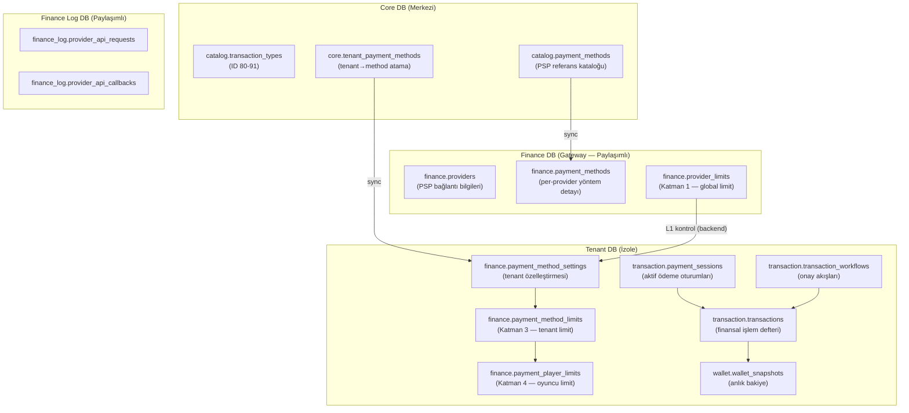
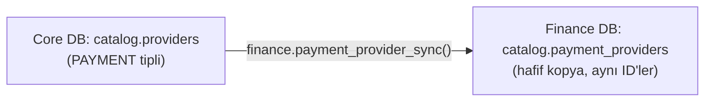
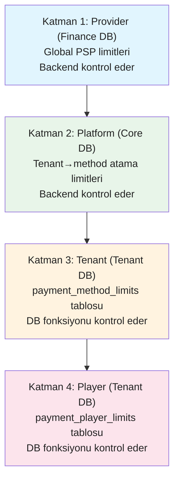
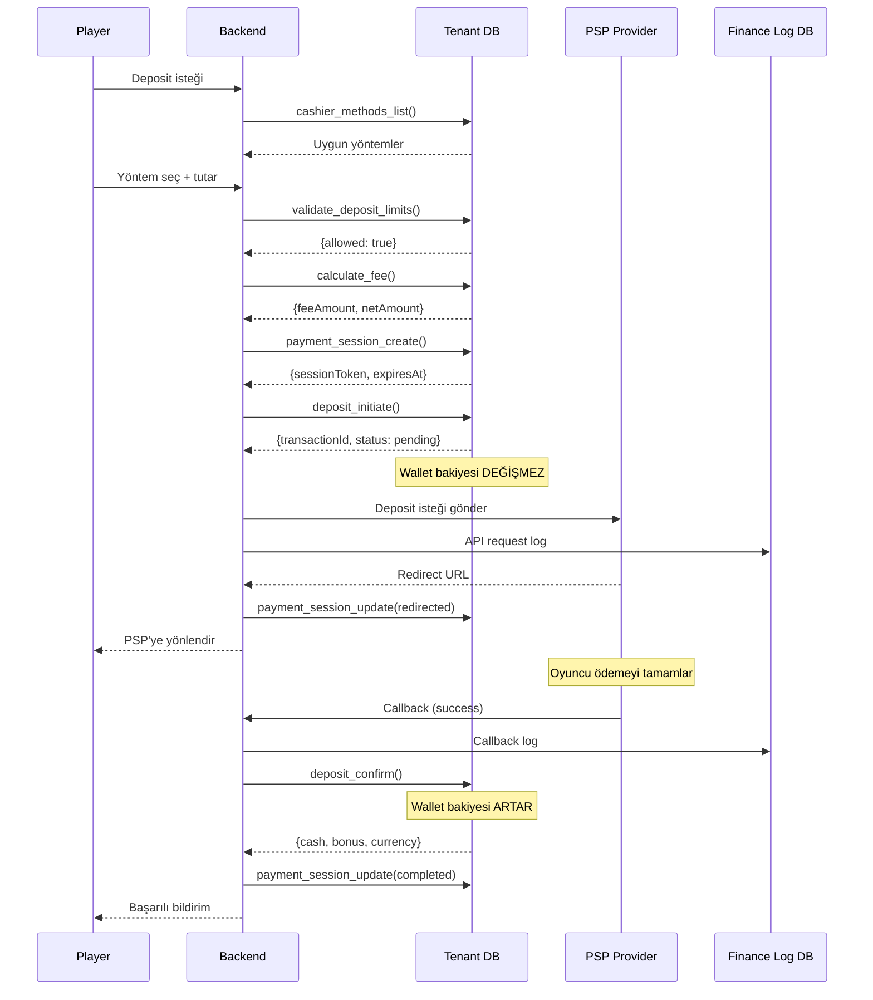
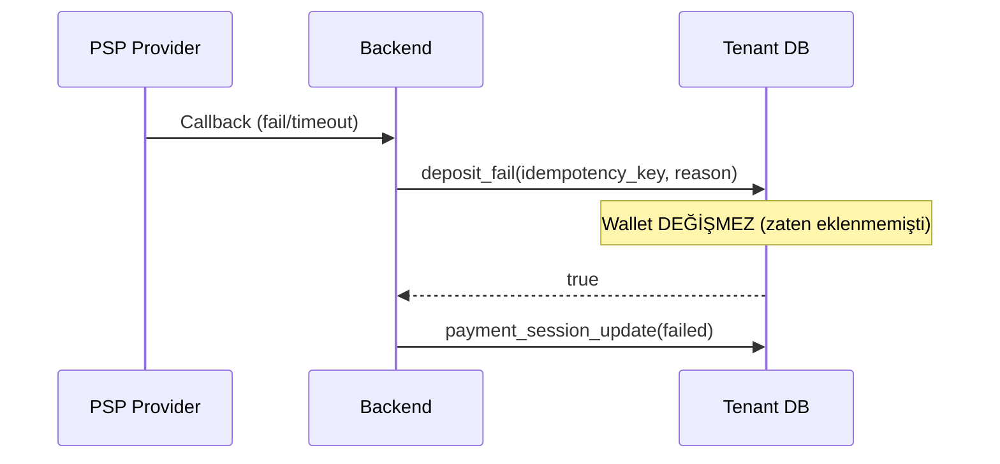
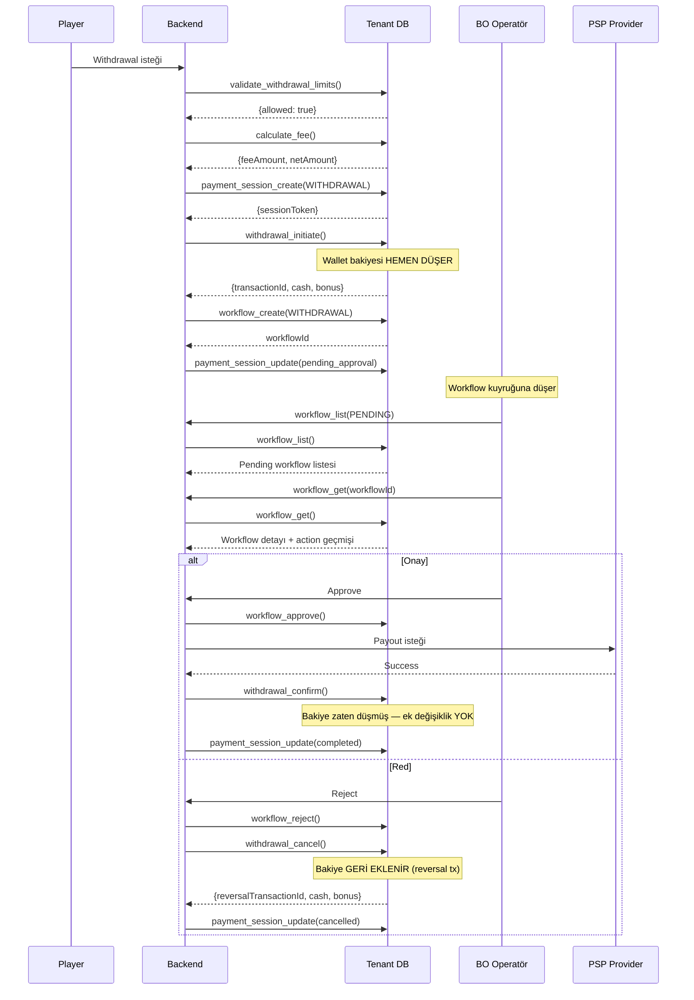
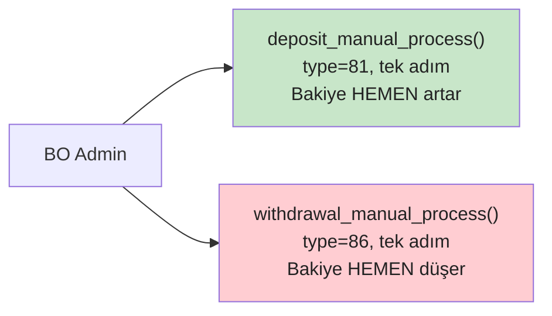

# Finance Gateway — Geliştirici Rehberi

Ödeme entegrasyonu iki temel bileşenden oluşur: **Ödeme Kataloğu** (Finance DB + Core DB + Tenant DB) ve **Ödeme İşlemleri** (deposit, withdrawal, manuel, workflow). Bu rehber her iki bileşeni de kapsar.

> **Kapsam:** TR (Papara, Mpay, Havale) + EU (Visa, Skrill, Paysafecard, Swift) + Crypto
> **Detaylı spesifikasyon:** [FINANCE_GATEWAY.md](../../.planning/FINANCE_GATEWAY.md)

---

## 1. Mimari Genel Bakış

### 1.1 Backend Gateway Mimarisi

| Katman | Bileşen | Teknoloji | Sorumluluk |
|--------|---------|-----------|------------|
| **API** | CashierController | ASP.NET Core | Ödeme yöntemi listeleme, deposit/withdrawal başlatma |
| | CallbackController | ASP.NET Core | PSP callback/webhook karşılama |
| | WorkflowController | ASP.NET Core | BO onay/red/atama işlemleri |
| **Orchestration** | PaymentSessionGrain | Orleans | Session yaşam döngüsü, durum geçişleri |
| | PlayerWalletGrain | Orleans | Oyuncu başına wallet işlemleri (seri erişim) |
| **Cache** | Session Cache | Redis | `payment-session:{token}` → session bilgisi |
| | Limit Cache | Redis | `limit:{tenantId}:{methodId}:{currency}` → limit bilgisi |
| | Rate Cache | Redis | `fee:{tenantId}:{methodId}:{currency}` → fee bilgisi |
| **Async** | callback.logged | RabbitMQ → Consumer | Finance Log DB'ye ham callback yaz |
| | workflow.created | RabbitMQ → Consumer | Workflow notification gönder |
| | session.expired | RabbitMQ → Consumer | Süresi dolan session'ları temizle |
| **DB** | Core / Finance / Tenant / Finance Log | PostgreSQL | Kalıcı veri |

### 1.2 Veritabanı Katmanları



---

## 2. Ödeme Kataloğu ve Yapılandırma

### 2.1 Bounded Context

Game ile aynı mimari pattern. Finance DB kendi catalog'unun sahibi olur.

| Fark | Game | Finance |
|------|------|---------|
| Catalog doldurma | Gateway API + BO import | **Sadece BO admin** (provider dokümantasyonuna göre) |
| Limit katmanı | 2 seviye (catalog → tenant) | **4 seviye** (provider → platform → tenant → player) |
| CRUD kaynağı | Fonksiyonlar yeni yazıldı | 6 fonksiyon **Core'dan taşındı** |
| Ek özellik | — | Player individual limits (sorumlu oyun) |

### 2.2 Provider Sync



- **Aynı ID'ler kullanılır** — `BIGINT PK`, serial değil. Cross-DB consistency sağlanır
- **TEXT→JSONB pattern**: `p_sync_data TEXT` → fonksiyon içinde `::JSONB` cast
- **UPSERT**: Mevcut provider varsa günceller, yoksa ekler

### 2.3 Tenant'a Provider Açma

```
1. Core: tenant_provider_enable(tenant_id, provider_id)
2. Finance DB: payment_method_list(provider_id) → metot listesi
3. Core: tenant_payment_method_upsert(tenant_id, method_data)
4. Tenant DB: payment_method_settings_sync + payment_method_limits_sync
```

### 2.4 Denormalizasyon

Core DB'deki `tenant_payment_methods` tablosunda denormalize alanlar: `payment_method_name`, `payment_method_code`, `provider_code`, `payment_type`, `icon_url`

**Neden?** Cross-DB FK kullanılamaz. Backend Finance DB'den veriyi alır, Core'a denormalize yazar. Tenant DB'ye sync ederken bu veriler aktarılır.

### 2.5 Core'da Metot Kapanması

```
Core: payment_method.is_active = false
  → Backend: tenant_payment_method_refresh çağrılır
  → Tenant DB: payment_method_settings.is_enabled = false (sync)
  → Oyuncu cashier'da göremez
```

**Provider kapanırsa** (`tenant_providers.is_enabled = false`): Metotların state'i değişmez, sadece provider'ın tüm metotları backend seviyesinde filtrelenir.

### 2.6 Crypto Desteği

Tüm limit tabloları `currency_code VARCHAR(20)` + `currency_type SMALLINT` kullanır:

| currency_type | Açıklama | Örnekler |
|---------------|----------|----------|
| 1 | Fiat | TRY, USD, EUR |
| 2 | Crypto | BTC, ETH, DOGE, SOL |

`DECIMAL(18,8)` hassasiyeti hem fiat hem crypto değerleri destekler.

---

## 3. 4 Katmanlı Limit Hiyerarşisi



| Katman | DB | Kontrol Eden | Tablo |
|--------|----|-------------|-------|
| L1 — Provider | Finance DB | Backend | `catalog.payment_method_currency_limits` |
| L2 — Platform | Core DB | Backend | `core.tenant_provider_limits` |
| L3 — Tenant | Tenant DB | DB fonksiyonu | `finance.payment_method_limits` |
| L4 — Player | Tenant DB | DB fonksiyonu | `finance.payment_player_limits` |

> L1+L2: Backend uygulama katmanında kontrol (farklı DB'ler arası join yapılamaz). L3+L4: Tenant DB fonksiyonu ile kontrol. En kısıtlayıcı limit geçerli olur.

### Player Limit Tipleri

| Tip | Belirleyen | Açıklama |
|-----|-----------|----------|
| `self` | Oyuncu | Kendi koyduğu limit (sorumlu oyun) |
| `admin` | BO Admin | Admin tarafından konulan limit |
| `responsible_gaming` | Sistem | RG politikası gereği otomatik |

---

## 4. Deposit Akışı

### 4.1 PSP Deposit (Başarılı Senaryo)



### 4.2 Deposit — Başarısız Senaryo



---

## 5. Withdrawal Akışı (PSP + Workflow)



---

## 6. Manuel İşlemler



- PSP entegrasyonu gerektirmez
- Tek adımda tamamlanır (`confirmed_at = NOW()`)
- Workflow gerektirmez — BO admin zaten onay mercii
- İdempotency korumalı

---

## 7. Kritik Tasarım Kararları

### 7.1 Deposit vs Withdrawal — Bakiye Stratejisi

| | Deposit | Withdrawal |
|---|---------|-----------|
| **İnitiate** | Bakiye değişmez | Bakiye HEMEN düşer |
| **Confirm** | Bakiye artar | Bakiye değişmez (zaten düşmüş) |
| **Cancel/Fail** | Bakiye değişmez | Bakiye GERİ eklenir |
| **Sebep** | PSP onayı olmadan para eklenmemeli | Oyuncu parayı başka yerde harcamasın |

### 7.2 Workflow Ayrımı

- **DB fonksiyonları:** Sadece workflow durumunu yönetir (PENDING → APPROVED/REJECTED)
- **Backend:** Approve sonrası `withdrawal_confirm()`, reject sonrası `withdrawal_cancel()` çağırmalı
- Separation of concerns — DB tek sorumluluğu wallet ve workflow yönetimi

### 7.3 Cross-DB Limit Kontrolü

- **L1 (Provider) + L2 (Platform):** Backend uygulama katmanında kontrol (Finance DB + Core DB)
- **L3 (Tenant) + L4 (Player):** Tenant DB fonksiyonu ile kontrol
- Farklı DB'ler arası join yapılamaz, backend orchestrate eder

### 7.4 Manuel İşlemler

- PSP entegrasyonu gerektirmez
- Tek adımda tamamlanır — `confirmed_at = NOW()`
- Workflow gerektirmez — BO admin zaten onay mercii
- İdempotency ile tekrardan korunur

---

## 8. Transaction Type Matrisi

| ID | Kod | Kategori | Rollback | Açıklama |
|----|-----|----------|----------|----------|
| 80 | `deposit.provider` | deposit | - | PSP para yatırma |
| 81 | `deposit.manual` | deposit | - | Manuel para yatırma |
| 82 | `deposit.crypto` | deposit | - | Kripto para yatırma |
| 85 | `withdrawal.provider` | withdrawal | - | PSP para çekme |
| 86 | `withdrawal.manual` | withdrawal | - | Manuel para çekme |
| 87 | `withdrawal.crypto` | withdrawal | - | Kripto para çekme |
| 90 | `deposit.chargeback` | chargeback | rollback | Chargeback |
| 91 | `withdrawal.reversal` | reversal | rollback | Çekim iptali |

---

## 9. Ödeme İşlem Fonksiyonları (29 fonksiyon)

### 9.1 Payment Session (transaction schema — 3 fonksiyon)

| Fonksiyon | Parametreler (kısa) | Döner | Açıklama |
|-----------|---------------------|-------|----------|
| `payment_session_create` | player_id, type, method, amount, currency, ttl | JSONB | Session oluştur, token üret |
| `payment_session_get` | session_token | JSONB | Session bilgisi (expire kontrollü) |
| `payment_session_update` | session_token, status, provider_* | VOID | COALESCE ile güncelle |

### 9.2 Deposit (wallet schema — 4 fonksiyon)

| Fonksiyon | Bakiye Etkisi | Açıklama |
|-----------|---------------|----------|
| `deposit_initiate` | Değişmez | PENDING tx oluştur, PSP onayı bekle |
| `deposit_confirm` | +amount | Wallet bakiye artır, tx onayla |
| `deposit_fail` | Değişmez | Fail reason kaydet |
| `deposit_manual_process` | +amount | Tek adım: wallet artır + confirmed tx |

### 9.3 Withdrawal (wallet schema — 4 fonksiyon)

| Fonksiyon | Bakiye Etkisi | Açıklama |
|-----------|---------------|----------|
| `withdrawal_initiate` | −(amount+fee) | HEMEN bakiye düşür, PENDING tx |
| `withdrawal_confirm` | Değişmez | Bakiye zaten düşmüş, tx onayla |
| `withdrawal_cancel` | +(amount+fee) | Reversal tx ile bakiye geri |
| `withdrawal_manual_process` | −amount | Tek adım: bakiye düşür + confirmed tx |

### 9.4 Workflow (transaction schema — 8 fonksiyon)

| Fonksiyon | Açıklama |
|-----------|----------|
| `workflow_create` | Onay akışı başlat (WITHDRAWAL, HIGH_VALUE, SUSPICIOUS, KYC_REQUIRED) |
| `workflow_approve` | Onayla → backend withdrawal_confirm çağırır |
| `workflow_reject` | Reddet → backend withdrawal_cancel çağırır |
| `workflow_assign` | BO kullanıcısına ata |
| `workflow_escalate` | Üst seviyeye yükselt |
| `workflow_add_note` | Not ekle (durumu değiştirmez) |
| `workflow_list` | Filtrelemeli + sayfalı liste |
| `workflow_get` | Detay + action geçmişi + transaction bilgisi |

### 9.5 Limit + Cashier (finance schema — 6 fonksiyon)

| Fonksiyon | Açıklama |
|-----------|----------|
| `validate_transaction_limits` | L3+L4 limit kontrolü (direction parametreli) |
| `validate_deposit_limits` | Deposit wrapper → validate_transaction_limits |
| `validate_withdrawal_limits` | Withdrawal wrapper → validate_transaction_limits |
| `calculate_fee` | fee = MAX(min, MIN(max, amount×percent+fixed)) |
| `cashier_methods_list` | Aktif yöntemler (shadow/platform/country filtreli) |
| `cashier_method_detail` | Yöntem detayı + player limit + fee |

### 9.6 Finance Log (maintenance schema — 4 fonksiyon)

| Fonksiyon | Açıklama |
|-----------|----------|
| `create_partitions` | 14 gün ileri daily partition oluştur |
| `drop_expired_partitions` | 14 gün retention ile eski partition'ları sil |
| `partition_info` | Partition durum raporu |
| `run_maintenance` | Cron: oluştur + sil |

---

## 10. Hata Kodu Haritası

| Kod | ERRCODE | Açıklama |
|-----|---------|----------|
| `error.deposit.player-required` | P0400 | player_id zorunlu |
| `error.deposit.invalid-amount` | P0400 | amount > 0 olmalı |
| `error.deposit.idempotency-required` | P0400 | idempotency_key zorunlu |
| `error.deposit.player-not-active` | P0403 | Oyuncu aktif değil |
| `error.deposit.wallet-not-found` | P0404 | REAL wallet bulunamadı |
| `error.deposit-confirm.transaction-not-found` | P0404 | Pending tx bulunamadı |
| `error.deposit-confirm.already-confirmed` | — | İdempotent (mevcut sonuç dönülür) |
| `error.deposit-confirm.player-mismatch` | P0403 | Player ID uyumsuz |
| `error.deposit-fail.already-confirmed` | P0409 | Zaten onaylanmış tx fail edilemez |
| `error.withdrawal.insufficient-balance` | P0402 | Yetersiz bakiye |
| `error.withdrawal-confirm.already-confirmed` | P0409 | Zaten onaylanmış |
| `error.withdrawal-cancel.already-confirmed` | P0409 | Onaylanmış çekim iptal edilemez |
| `error.finance.session-not-found` | P0404 | Session bulunamadı |
| `error.finance.session-expired` | P0410 | Session süresi dolmuş |
| `error.workflow.already-pending` | P0409 | Aynı tx için aktif workflow var |
| `error.workflow.invalid-type` | P0400 | Geçersiz workflow tipi |
| `error.limit-validation.invalid-direction` | P0400 | Geçersiz direction |
| `error.calculate-fee.invalid-direction` | P0400 | Geçersiz direction |
| `error.cashier.invalid-direction` | P0400 | Geçersiz direction |

---

## 11. Index Stratejisi — payment_sessions

| Index | Tip | Koşul | Amaç |
|-------|-----|-------|------|
| `idx_payment_sessions_token` | UNIQUE btree | — | Token ile hızlı lookup |
| `idx_payment_sessions_player` | btree(player_id, created_at DESC) | — | Oyuncu session'ları |
| `idx_payment_sessions_active` | btree(status, created_at DESC) | status IN (aktif durumlar) | Aktif session'lar |
| `idx_payment_sessions_expires` | btree(expires_at) | status IN (aktif durumlar) | Expire temizliği |
| `idx_payment_sessions_idempotency` | btree(idempotency_key, created_at) | idempotency_key IS NOT NULL | İdempotency kontrolü |
| `idx_payment_sessions_method_status` | btree(payment_method_id, status) | payment_method_id IS NOT NULL | Yönteme göre filtreleme |

---

## 12. Backend Orchestration

### 12.1 Deposit

```
1.  cashier_methods_list() → Yöntem listele
2.  cashier_method_detail() → Seçilen yöntem detayı
3.  validate_deposit_limits() → Limit kontrol (L3+L4)
4.  calculate_fee() → Fee hesapla
5.  payment_session_create() → Session oluştur
6.  deposit_initiate() → PENDING tx oluştur
7.  PSP API call → Provider'a ilet
8.  payment_session_update(processing/redirected) → Durum güncelle
9.  [Callback] deposit_confirm() veya deposit_fail()
10. payment_session_update(completed/failed)
```

### 12.2 Withdrawal

```
1. validate_withdrawal_limits() → Limit kontrol
2. calculate_fee() → Fee hesapla
3. payment_session_create(WITHDRAWAL)
4. withdrawal_initiate() → Bakiye HEMEN düşür
5. workflow_create(WITHDRAWAL) → Onay akışı başlat
6. payment_session_update(pending_approval)
7. [BO] workflow_approve() veya workflow_reject()
8a. Approve → PSP payout → withdrawal_confirm()
8b. Reject → withdrawal_cancel() → Bakiye geri
9. payment_session_update(completed/cancelled)
```

### 12.3 Provider Entegrasyon Haritası

| Bölge | Provider | Yöntemler | Tip |
|-------|----------|-----------|-----|
| **TR** | Papara | E-wallet | EWALLET |
| | Mpay | E-wallet | EWALLET |
| | Havale/EFT | Banka transferi | BANK |
| **EU** | Visa/MC | Kredi/Debit kart | CARD |
| | Skrill | E-wallet | EWALLET |
| | Paysafecard | Prepaid | PREPAID |
| | Swift | Banka transferi | BANK |
| **Global** | BTC/ETH/USDT | Kripto | CRYPTO |

---

## 13. Ödeme Kataloğu Fonksiyonları (27 fonksiyon)

| DB | Grup | Fonksiyonlar |
|----|------|-------------|
| Finance DB | Provider Sync | `payment_provider_sync` |
| Finance DB | Catalog CRUD | `payment_method_create/update/delete/get/list/lookup`, `payment_method_currency_limit_sync` |
| Core DB | Tenant Provider | `tenant_provider_enable/disable/list` (Finance variant) |
| Core DB | Tenant Method | `tenant_payment_method_upsert/list/remove/refresh` |
| Tenant DB | Sync | `payment_method_settings_sync/remove`, `payment_method_limits_sync` |
| Tenant DB | BO + Cashier | `payment_method_settings_get/update/list`, `payment_method_limit_upsert/list` |
| Tenant DB | Player Limits | `payment_player_limit_set/get/list` |

---

## 14. Backend İçin Notlar

- **TEXT→JSONB pattern**: Tüm sync fonksiyonları `p_data TEXT` → `::JSONB` cast
- **Cross-DB**: Her DB ayrı connection. Backend orchestrate eder: Finance DB → Core DB → Tenant DB
- **Auth**: Finance DB fonksiyonları auth-agnostic. Core DB'de `user_assert_access_tenant` ile kontrol
- **Shadow mode**: `payment_method_settings_list` fonksiyonunda `rollout_status` filtresi → [SHADOW_MODE_GUIDE.md](SHADOW_MODE_GUIDE.md)
- **Limit kontrolü**: Cashier akışında 4 katman sırasıyla kontrol edilmeli, en kısıtlayıcı değer geçerli
- **Toplam fonksiyon**: 29 (ödeme işlemleri) + 27 (katalog) = 56 fonksiyon

---

_İlgili dokümanlar: [FINANCE_GATEWAY.md](../../.planning/FINANCE_GATEWAY.md) · [GAME_GATEWAY_GUIDE.md](GAME_GATEWAY_GUIDE.md) · [FUNCTIONS_GATEWAY.md](../reference/FUNCTIONS_GATEWAY.md) · [FUNCTIONS_CORE.md](../reference/FUNCTIONS_CORE.md) · [SHADOW_MODE_GUIDE.md](SHADOW_MODE_GUIDE.md)_
