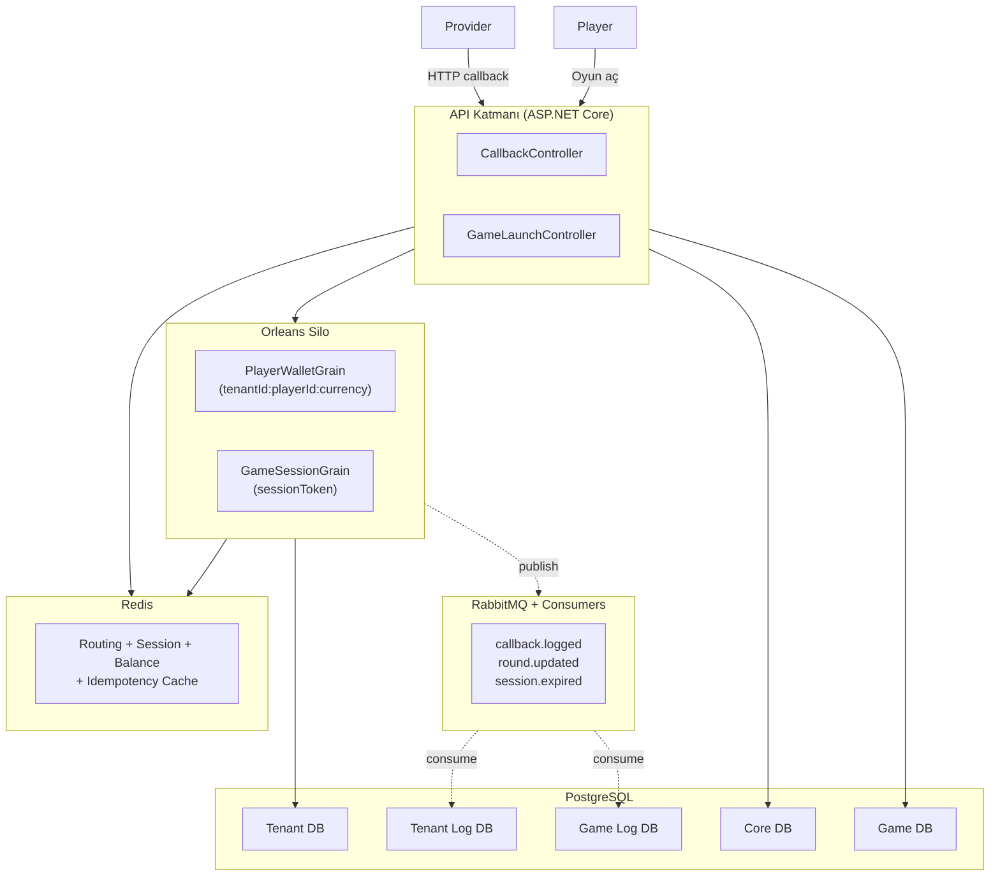
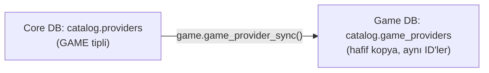
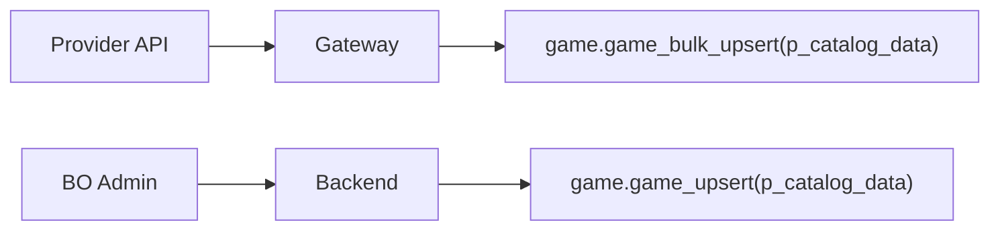
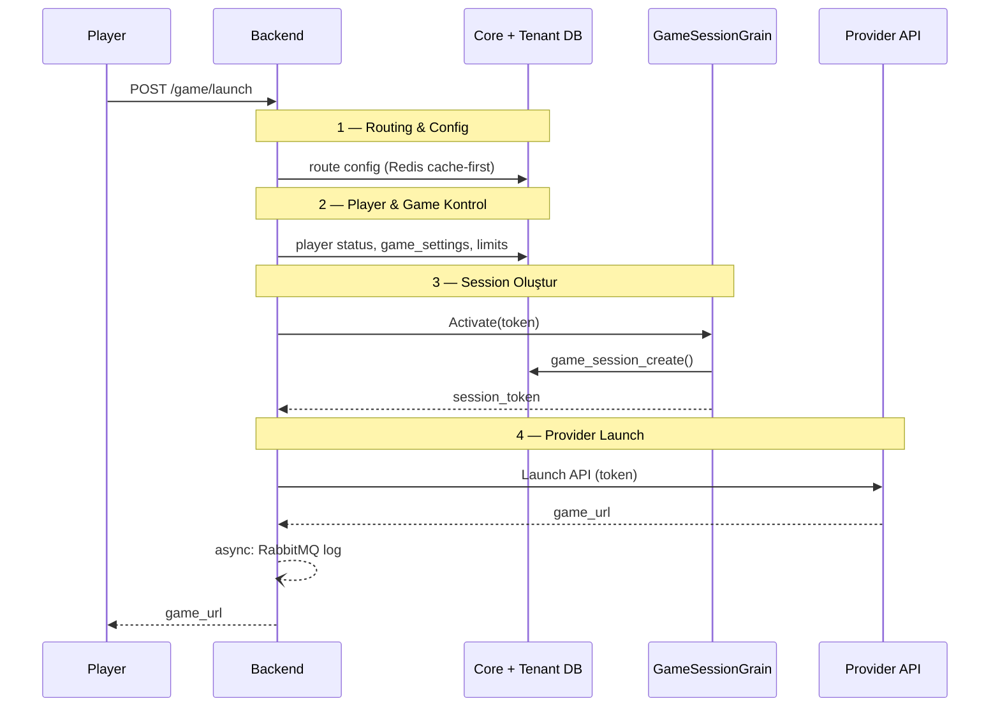
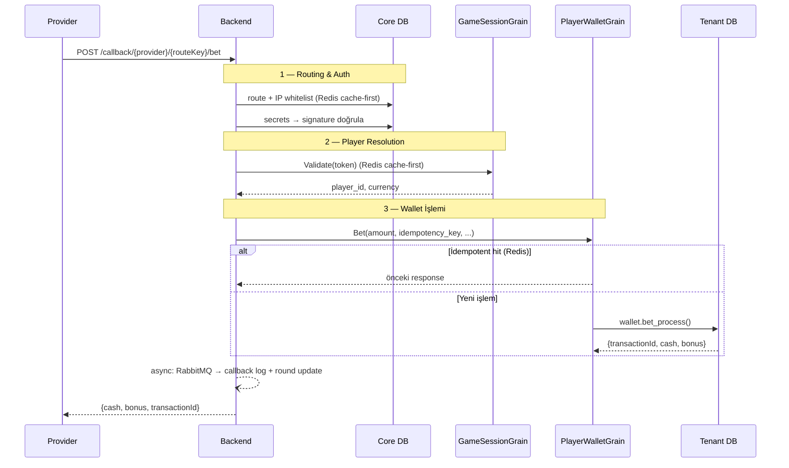
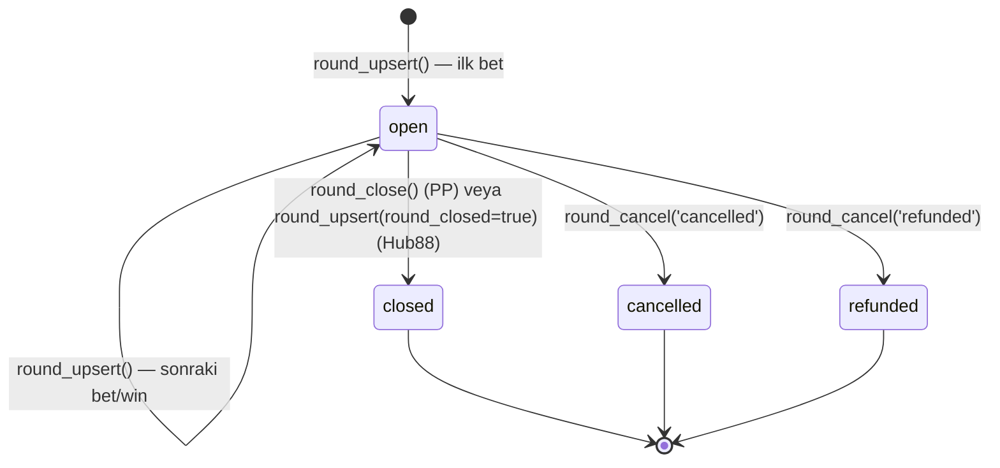
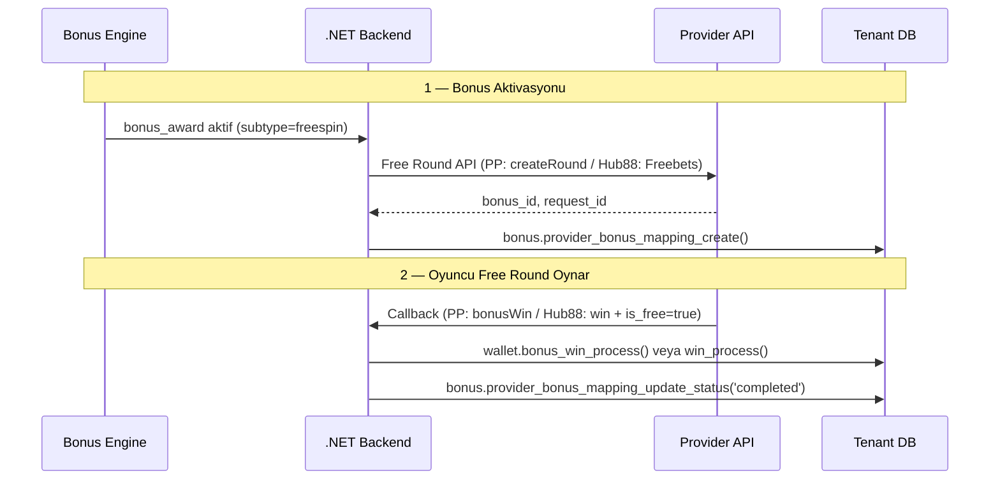
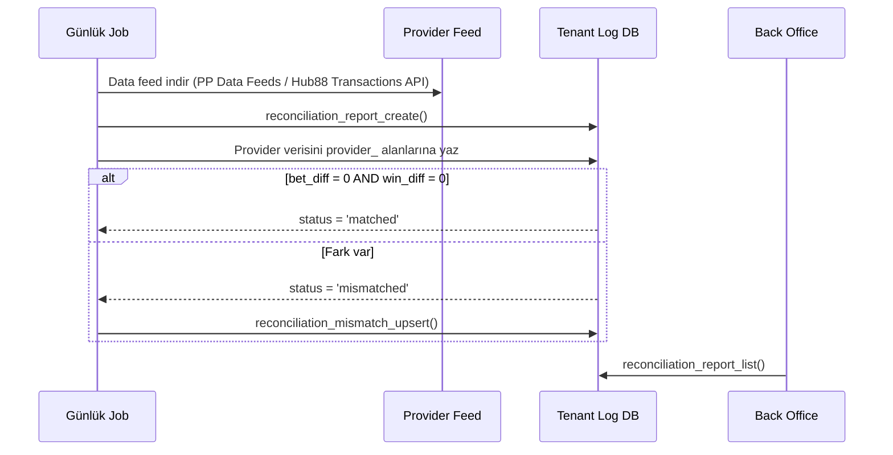

# Game Gateway — Geliştirici Rehberi

Oyun entegrasyonu iki temel bileşenden oluşur: **Oyun Kataloğu** (Game DB + Core DB + Tenant DB) ve **Seamless Wallet Gateway** (wallet işlemleri + game session + round yaşam döngüsü). Bu rehber her iki bileşeni de kapsar.

> **Desteklenen provider'lar:** Pragmatic Play (PP) API v3.235, Hub88 Operator API
> **Detaylı spesifikasyon:** [GAME_GATEWAY_SEAMLESS_WALLET.md](../../.planning/GAME_GATEWAY_SEAMLESS_WALLET.md)

---

## 1. Mimari Genel Bakış

### 1.1 Backend Gateway Mimarisi

| Katman | Bileşen | Teknoloji | Sorumluluk |
|--------|---------|-----------|------------|
| **API** | CallbackController | ASP.NET Core | Provider HTTP callback'lerini karşılar |
| | GameLaunchController | ASP.NET Core | Oyun açma isteklerini karşılar |
| **Orchestration** | PlayerWalletGrain | Orleans | Oyuncu başına wallet işlemleri (seri erişim) |
| | GameSessionGrain | Orleans | Oturum yaşam döngüsü, token doğrulama |
| **Cache** | Session Cache | Redis | `session:{token}` → player/tenant/game bilgisi |
| | Routing Cache | Redis | `route:{routeKey}` → tenant_id, provider_id |
| | Balance Cache | Redis | `balance:{tenantId}:{playerId}:{currency}` → cash, bonus |
| | Idempotency Cache | Redis | `idemp:{tenantId}:{key}` → önceki response |
| **Async** | callback.logged | RabbitMQ → Consumer | Game Log DB'ye ham callback yaz |
| | round.updated | RabbitMQ → Consumer | Tenant Log DB'ye round kaydı yaz |
| | session.expired | RabbitMQ → Consumer | Süresi dolan session'ları temizle |
| **DB** | Core / Game / Tenant / Tenant Log / Game Log | PostgreSQL | Kalıcı veri |

### 1.2 Katmanlı Mimari



### 1.3 Veritabanı Topolojisi

5 fiziksel veritabanı, her biri izole bağlantı ile erişilir (◆ = partitioned tablo):

| DB | Schema → Tablolar | Rol |
|----|-------------------|-----|
| **Core DB** | `routing` → callback_routes, provider_callbacks, provider_endpoints<br/>`security` → secrets_provider<br/>`catalog` → providers, provider_types, provider_settings<br/>`core` → tenant_providers, tenant_games | Routing, auth, secret yönetimi |
| **Game DB** | `catalog` → games, game_providers, game_currency_limits | Oyun kataloğu |
| **Tenant DB** | `wallet` → wallets, wallet_snapshots<br/>`transaction` → transactions ◆<br/>`game` → game_settings, game_limits, game_sessions<br/>`auth` → players<br/>`bonus` → bonus_awards, provider_bonus_mappings | Wallet, transaction, player, session |
| **Tenant Log DB** | `game_log` → game_rounds ◆, reconciliation_reports, reconciliation_mismatches | Round takip, reconciliation |
| **Game Log DB** | `game_log` → provider_api_requests ◆, provider_api_callbacks ◆ | Ham callback log |

> Cross-DB bağlantılarda FK yok. `idempotency_key` ve `external_round_id` ile correlation sağlanır.

### 1.4 Orleans Grain Tasarımı

| Grain | Key Format | Yaşam Döngüsü | Sorumluluk |
|-------|-----------|---------------|------------|
| **PlayerWalletGrain** | `{tenantId}:{playerId}:{currency}` | İlk bet'te aktif → idle timeout (5dk) sonra deaktif | Wallet işlemleri (bet/win/rollback/balance). **Seri erişim garantisi** — aynı oyuncuya paralel callback'ler grain seviyesinde sıralanır. |
| **GameSessionGrain** | `{sessionToken}` | Game launch'ta aktif → session expire'da deaktif | Token doğrulama, session metadata cache, expire reminder. |

> **Neden Orleans?** Wallet işlemlerinde aynı oyuncuya eşzamanlı gelen callback'ler (hızlı spin'lerde bet+win arka arkaya) grain'in single-threaded yapısıyla sıralanır. DB `FOR UPDATE` kilidine ek koruma katmanı sağlar, deadlock riskini ortadan kaldırır.

### 1.5 Redis Cache Stratejisi

| Key Pattern | Value | TTL | Yazılma Zamanı | Geçersizleşme |
|-------------|-------|-----|----------------|---------------|
| `route:{routeKey}` | `{tenantId, providerId, providerCode}` | 5 dk | İlk callback | TTL expire veya config değişikliği |
| `session:{token}` | `{playerId, tenantId, gameCode, currency, mode}` | 30 dk (sliding) | Game launch | Session end / expire |
| `balance:{tenantId}:{playerId}:{currency}` | `{cash, bonus}` | 60 sn | Her wallet işlemi sonrası | Sonraki wallet işlemi üzerine yazar |
| `idemp:{tenantId}:{key}` | Önceki response JSONB | 5 dk | Başarılı wallet işlemi | TTL expire |
| `whitelist:{providerId}` | `cidr[]` | 10 dk | İlk IP kontrol | TTL expire |

> **Balance cache:** Sadece okuma hızlandırma (balance endpoint). Wallet işlemleri **her zaman** DB'den okur (`FOR UPDATE`). Cache, provider'ın sık balance sorguları için kullanılır.

### 1.6 RabbitMQ Topolojisi

| Exchange | Routing Key | Queue | Consumer | Hedef DB | Kritiklik |
|----------|-------------|-------|----------|----------|-----------|
| `game.gateway` | `callback.logged` | `q.callback.log` | CallbackLogConsumer | Game Log DB | Düşük — log kaybı tolere edilir |
| `game.gateway` | `round.updated` | `q.round.update` | RoundUpdateConsumer | Tenant Log DB | Orta — eventual consistency |
| `game.gateway` | `session.expired` | `q.session.cleanup` | SessionCleanupConsumer | Tenant DB | Düşük — temizlik |

> Wallet işlemi senkron, loglama asenkron — provider SLA'ını (1-3 sn) etkilememek için.

### 1.7 DB Rol Matrisi

| Akış | Core DB | Game DB | Tenant DB | Tenant Log DB | Game Log DB |
|------|---------|---------|-----------|--------------|-------------|
| Game launch | READ | READ | READ+WRITE | — | WRITE |
| Routing + Auth | READ | — | — | — | — |
| Bet / Win / Rollback | — | — | READ+WRITE | — | — |
| Round upsert/close | — | — | — | READ+WRITE | — |
| Callback log | — | — | — | — | WRITE |
| Reconciliation | — | — | — | READ+WRITE | — |

---

## 2. Oyun Kataloğu ve Yapılandırma

### 2.1 Bounded Context

Core DB eskiden hem provider hem game tablosunu tutuyordu. Sorunları:

1. **Cross-DB FK**: `core.tenant_games → catalog.games` FK'sı çalışmaz (farklı fiziksel DB)
2. **Monolith catalog**: Game domain'i Core'a bağımlı kalır
3. **Performans**: Game DB kendi catalog'unu lokalde okur, Core'a sorgu atmaz

**Çözüm**: Game DB kendi catalog'unun sahibi olur. Core DB'deki `catalog.providers` master kalır, hafif kopya sync edilir.

### 2.2 Provider Sync



- **Aynı ID'ler kullanılır** — `BIGINT PK`, serial değil. Cross-DB consistency sağlanır
- **TEXT→JSONB pattern**: `p_sync_data TEXT` → fonksiyon içinde `::JSONB` cast
- **UPSERT**: Mevcut provider varsa günceller, yoksa ekler

### 2.3 Catalog Doldurma (Hibrit)

| Yöntem | Kaynak | Kullanım |
|--------|--------|----------|
| Gateway otomatik sync | Provider API | API'si olan provider'lar (Pragmatic, Evolution) |
| BO admin import | CSV/Excel veya manuel CRUD | API'si olmayan provider'lar |



### 2.4 Tenant'a Provider Açma

```
1. BO Admin "Provider Aç" butonuna basar
2. Backend:
   a. Core: tenant_provider_enable(tenant_id, provider_id, rollout_status)
      → core.tenant_providers INSERT
   b. Game DB: game_list(provider_id) → oyun listesini çeker
   c. Core: tenant_game_upsert(tenant_id, game_data)
      → core.tenant_games INSERT (denormalize: game_name, game_code, provider_code...)
   d. Tenant DB: game_settings_sync(settings_data) + game_limits_sync(limits_data)
```

### 2.5 Denormalizasyon

Core DB'deki `tenant_games` tablosunda denormalize alanlar: `game_name`, `game_code`, `provider_code`, `game_type`, `thumbnail_url`

**Neden?** Cross-DB FK kullanılamaz. Backend Game DB'den veriyi alır, Core'a denormalize yazar. Tenant DB'ye sync ederken bu veriler aktarılır.

### 2.6 Core'da Oyun Kapanması

Core'da `is_active = false` yapıldığında:

```
Core: game.is_active = false
  → Backend: tenant_game_refresh çağrılır
  → Tenant DB: game_settings.is_enabled = false (sync)
  → Oyuncu lobide göremez
```

**Provider kapanırsa** (`tenant_providers.is_enabled = false`): Oyunların state'i değişmez, sadece provider'ın tüm oyunları backend seviyesinde filtrelenir.

### 2.7 Crypto Desteği

Limit tabloları `currency_code VARCHAR(20)` + `currency_type SMALLINT` kullanır:

| currency_type | Açıklama | Örnekler |
|---------------|----------|----------|
| 1 | Fiat | TRY, USD, EUR |
| 2 | Crypto | BTC, ETH, DOGE, SOL |

`DECIMAL(18,8)` hassasiyeti hem fiat hem crypto değerleri destekler.

---

## 3. Game Open Akışı



| # | Adım | Senkron/Asenkron | Hedef | Hata → |
|---|------|-----------------|-------|--------|
| 1 | Routing & config al | Senkron (cache-first) | Redis → Core DB | 404 route bulunamadı |
| 2 | Player + game kontrol | Senkron | Tenant DB | 403 frozen / oyun kapalı |
| 3 | Session oluştur | Senkron | Orleans → Tenant DB → Redis | 500 session hatası |
| 4 | Provider launch API | Senkron | Provider HTTP | 502 provider yanıt yok |
| 5 | Launch log | **Asenkron** | RabbitMQ → Game Log DB | Fire-and-forget |

---

## 4. Callback İşlem Akışı (Bet / Win / Rollback)



### Callback Aşamaları

| # | Adım | Senkron/Asenkron | Hedef | Cache | Hata → |
|---|------|-----------------|-------|-------|--------|
| 1a | Route çöz | Senkron (cache-first) | Redis → Core DB | `route:{routeKey}` TTL 5dk | 404 |
| 1b | IP whitelist | Senkron | Core DB | — | 403 |
| 1c | Signature doğrula | Senkron | Core DB → Backend | — | 401 |
| 2 | Player çöz (token) | Senkron (cache-first) | Redis → Orleans → Tenant DB | `session:{token}` TTL 30dk | session-not-found / expired |
| 3a | İdempotency kontrol | Senkron (cache-first) | Redis → Grain → Tenant DB | `idemp:{key}` TTL 5dk | — |
| 3b | Wallet işlemi | **Senkron (grain-serialized)** | Orleans → Tenant DB | Balance sonra güncellenir | insufficient-balance, frozen |
| 4a | Callback log | **Asenkron** | RabbitMQ → Game Log DB | — | Fire-and-forget |
| 4b | Round kaydı | **Asenkron** | RabbitMQ → Tenant Log DB | — | Fire-and-forget |

### Action → Fonksiyon Eşleştirmesi

| Action | Wallet Fonksiyonu | Op | Açıklama |
|--------|-------------------|----|----------|
| balance | `player_balance_get()` | READ | Bakiye sorgula |
| bet | `bet_process()` | DEBIT | Bahis düş |
| win / result | `win_process()` | CREDIT | Kazanç ekle |
| refund / rollback | `rollback_process()` | CREDIT veya DEBIT | İade / geri alma |
| jackpotWin | `jackpot_win_process()` → win_process | CREDIT | Jackpot kazancı |
| bonusWin | `bonus_win_process()` → win_process | CREDIT | Free spin kazancı |
| promoWin | `promo_win_process()` → win_process | CREDIT | Turnuva / prize drop |
| adjustment | `adjustment_process()` | DEBIT veya CREDIT | Düzeltme |

---

## 5. Wallet Fonksiyonları

Tüm fonksiyonlar `wallet` schema'sında, auth-agnostic. Return tipi: `JSONB`

```json
{"transactionId": 123, "cash": 1000.00, "bonus": 50.00, "currency": "TRY"}
```

### 5.1 bet_process — En Kritik Fonksiyon

```
(p_player_id, p_currency_code, p_amount, p_idempotency_key,
 p_external_reference_id, p_game_code, p_provider_code, p_round_id,
 p_transaction_type_id DEFAULT 3, p_metadata) → JSONB
```

| # | Adım | SQL / Mantık | Hata → |
|---|------|-------------|--------|
| 1 | **İdempotency** | `SELECT FROM transactions WHERE idempotency_key = p_idempotency_key` | Bulunursa → mevcut sonucu dön |
| 2 | **Player kontrol** | `SELECT status FROM auth.players WHERE id = p_player_id` | player-not-found / player-frozen |
| 3 | **Wallet kilitle** | `SELECT balance FROM wallet_snapshots ... FOR UPDATE` (REAL wallet) | player-not-found |
| 4 | **Bakiye kontrol** | `balance >= p_amount ?` | insufficient-balance |
| 5 | **Transaction yaz** | `INSERT INTO transactions` (operation_type_id=1, source='GAME') | — |
| 6 | **Bakiye düş** | `UPDATE wallet_snapshots SET balance = balance - p_amount` | — |
| 7 | **Bonus bakiye** | BONUS wallet balance'ını oku (response için) | — |
| 8 | **Dön** | `{transactionId, cash, bonus, currency}` | — |

### 5.2 win_process

```
(p_player_id, p_currency_code, p_amount, p_idempotency_key,
 p_external_reference_id, p_reference_transaction_key,
 p_game_code, p_provider_code, p_round_id,
 p_transaction_type_id DEFAULT 12, p_metadata) → JSONB
```

**Akış:** İdempotency → player kontrol → wallet `FOR UPDATE` → referans bağla (opsiyonel) → INSERT credit → UPDATE balance → JSONB dön

- `p_reference_transaction_key`: Hub88 gönderir (orijinal bet UUID), PP göndermez (NULL). Doluysa → `related_transaction_id` olarak kaydedilir.
- `amount=0` olabilir (kayıp round — yine de transaction kaydı oluşur)

### 5.3 rollback_process

Hem bet refund (PP) hem win rollback (Hub88) destekler:

```
(p_player_id, p_currency_code, p_idempotency_key, p_original_reference,
 p_external_reference_id, p_provider_code, p_round_id,
 p_transaction_type_id DEFAULT 60, p_metadata) → JSONB
```

**Akış:** İdempotency → orijinal tx ara → bulunamazsa başarılı dön (spec) → zaten rollback edilmişse bakiye dön → orijinal tipine göre ters işlem:

| Orijinal | Rollback İşlemi | tx_type |
|----------|----------------|---------|
| Debit (bet) | Wallet'a credit (geri ekle) | 60 (default) |
| Credit (win) | Wallet'tan debit (geri al) + bakiye kontrolü | 63 (otomatik) |

> **Kritik fark:** PP sadece bet refund kolunu kullanır. Hub88 her iki kolu (bet refund + win rollback) kullanabilir.

### 5.4 Thin Wrapper'lar

Hepsi internal olarak `win_process()` çağırır, sadece `transaction_type_id` ve metadata farklıdır:

| Fonksiyon | tx_type | PP Endpoint | Hub88 | Ek Parametre |
|-----------|---------|-------------|-------|-------------|
| `jackpot_win_process` | 70 | jackpotWin.html | Kullanmaz | `p_jackpot_id` |
| `bonus_win_process` | 72 | bonusWin.html | Kullanmaz | `p_bonus_code` |
| `promo_win_process` | 71 | promoWin.html | Kullanmaz | `p_campaign_id`, `p_campaign_type` |

### 5.5 Diğer Wallet Fonksiyonları

| Fonksiyon | Açıklama |
|-----------|----------|
| `player_info_get(p_player_id)` | Player bilgileri döner (Hub88 `/user/info` için gerekli, PP kullanmaz) |
| `player_balance_get(p_player_id, p_currency_code)` | REAL + BONUS wallet bakiye: `{cash, bonus, currency}` |
| `player_balance_per_game_get(p_player_id, p_currency_code, p_game_codes)` | Oyun bazlı bakiye, `game_limits` kontrollü (PP `getBalancePerGame`, Hub88 kullanmaz) |
| `adjustment_process(...)` | amount > 0 → credit, < 0 → debit. tx_type=26. PP: `adjustment.html` (sadece Live Casino) |

---

## 6. Game Sessions

Game launch sırasında oluşturulur. Provider callback'lerinde `session_token` ile player çözümlenir.

> **Neden gerekli?** Callback geldiğinde `route_key` ile tenant çözülür (Core DB), ama **hangi player?** sorusu kalır. PP `playerId` gönderir ama Hub88 sadece `token` + `user` gönderir. `game_sessions` tablosu tüm provider'lar için tutarlı bir doğrulama noktası oluşturur.

### 6.1 game.game_sessions Tablosu

Temel alanlar: `session_token VARCHAR(100)`, `player_id`, `provider_code`, `game_code`, `currency_code`, `mode` (real/demo/fun), `status` (active/expired/closed), `expires_at`, `ended_reason` (PLAYER_LOGOUT/TIMEOUT/PROVIDER_CLOSE/FORCED)

**Token akışı:**
- PP: Backend `session_token` üretir → PP'ye `token` parametresi olarak gönderir → PP callback'lerde `hash` ile gönderir
- Hub88: Backend `session_token` üretir → Hub88'e `token` olarak gönderir → Hub88 callback'lerde `token` alanında geri gönderir

### 6.2 Session Fonksiyonları

| Fonksiyon | Parametreler | Açıklama |
|-----------|-------------|----------|
| `game_session_create` | player_id, provider_code, game_code, currency_code, mode, ip_address, device_type, ttl_minutes(default 480) | Token üret, session oluştur, player durum kontrolü |
| `game_session_validate` | session_token | Token doğrula, expire kontrolü → player_id, gameCode, currency dön |
| `game_session_end` | session_token, reason(default 'PLAYER_LOGOUT') | Session kapat (idempotent — zaten closed/expired ise sessizce `true` dön) |

---

## 7. Round Yaşam Döngüsü

Fonksiyonlar `game_log` schema'sında, Tenant Log DB'de çalışır.



| Geçiş | Tetikleyen | Fonksiyon | PP | Hub88 |
|--------|-----------|-----------|-----|-------|
| → open | İlk bet callback | `round_upsert()` | bet.html | /transaction/bet |
| open → open | Sonraki bet/win | `round_upsert()` — kümülatif artar | Her callback | Her callback |
| open → closed | Round bitti | `round_close()` veya `round_upsert(round_closed=true)` | endRound.html | round_closed flag |
| open → cancelled | Provider iptal | `round_cancel('cancelled')` | cancelRound | — |
| open → refunded | Full refund | `round_cancel('refunded')` | refund sonrası | rollback sonrası |

### Round Fonksiyonları

| Fonksiyon | Açıklama |
|-----------|----------|
| `round_upsert(player_id, game_code, provider_code, external_round_id, round_data)` | UPDATE-first pattern: mevcut round varsa bet/win tutarlarını kümülatif artırır, yoksa INSERT. `round_closed=true` ise otomatik `status='closed'` |
| `round_close(player_id, provider_code, external_round_id, round_detail)` | `status='closed'`, `ended_at=NOW()`, `duration_ms` hesapla. Bulunamazsa sessizce başarılı (idempotent) |
| `round_cancel(player_id, provider_code, external_round_id, status)` | `status='cancelled'` veya `'refunded'`, `ended_at=NOW()` |

---

## 8. Bonus / Free Round Entegrasyonu



| Adım | PP | Hub88 | DB Fonksiyonu |
|------|-----|-------|---------------|
| Bonus oluştur | createRound API | Freebets API | `provider_bonus_mapping_create()` |
| Kazanç callback | bonusWin.html | win + is_free flag | `bonus_win_process()` / `win_process()` |
| Mapping güncelle | — | — | `provider_bonus_mapping_update_status()` |

### bonus.provider_bonus_mappings Tablosu

Provider tarafı bonus takibi: `bonus_award_id` (FK → bonus_awards), `provider_code`, `provider_bonus_type` (FREE_SPINS/FREE_CHIPS/TOURNAMENT/FREEBET), `provider_bonus_id`, `provider_request_id`, `status` (active/completed/cancelled/expired), `provider_data JSONB`

---

## 9. Reconciliation

Günlük job ile provider data feed'leri karşılaştırılır. Tablolar Tenant Log DB'de (`game_log` schema).



### Reconciliation Tabloları

| Tablo | Temel Alanlar | Açıklama |
|-------|--------------|----------|
| `reconciliation_reports` | provider_code, report_date, currency_code, our_total_bet/win, provider_total_bet/win, `GENERATED` bet_diff/win_diff, status (pending/matched/mismatched/resolved) | Günlük aggregate karşılaştırma |
| `reconciliation_mismatches` | report_id (FK), external_round_id, mismatch_type (missing_our_side/missing_provider/amount_diff/status_diff), our_amount vs provider_amount, resolution_status (open/resolved/ignored) | Round bazlı detay |

### Reconciliation Fonksiyonları

| Fonksiyon | Açıklama |
|-----------|----------|
| `reconciliation_report_create` | Rapor oluştur (game_rounds'tan aggregate) |
| `reconciliation_mismatch_upsert` | Mismatch kayıt/güncelle |
| `reconciliation_report_list` | Raporları listele (filtreleme + mismatch sayısı + pagination) |

---

## 10. Provider Karşılaştırma (PP vs Hub88)

| Konu | Pragmatic Play (PP) | Hub88 | DB Tasarım Kararı |
|------|---------------------|-------|-------------------|
| **Auth** | MD5 hash (params + secretKey) | RSA-SHA256 signature (X-Hub88-Signature) | Backend'de; DB auth-agnostic |
| **İdempotency key** | Provider referans ID | `transaction_uuid` (UUID) | Tek `idempotency_key varchar(100)` |
| **Tutar formatı** | Decimal (3.56) | Integer × 100.000 (356000) | Backend dönüştürür; DB `DECIMAL(18,8)` |
| **Bakiye response** | `{cash, bonus}` ayrı | Tek `balance` integer | DB JSONB döner; backend filtreler |
| **Round kapatma** | Ayrı `endRound` callback | `round_closed=true` flag | `round_close()` + `round_upsert(round_closed)` |
| **Refund / Rollback** | `refund` — sadece bet iadesi | `rollback` — bet VEYA win geri alma | `rollback_process()` her iki senaryoyu destekler |
| **Win → Bet bağlantısı** | Round bazlı (implicit) | `reference_transaction_uuid` (explicit) | `p_reference_transaction_key` (opsiyonel) |
| **Bonus/Free round** | Ayrı endpoint'ler (bonusWin, promoWin, jackpotWin) | Aynı bet/win + flag'ler | Thin wrapper'lar + generic `win_process` |
| **Error code'lar** | Numerik (0,1,2,3,6,50,100) | String enum (RS_OK, RS_ERROR_*) | DB provider-agnostic error key'ler; backend map'ler |
| **Player bilgisi** | authenticate → balance | /user/info → country, tags, sex vb. | `player_info_get()` eklenir |
| **Token doğrulama** | Backend MD5 hash | Backend RSA; `is_supplier_promo=true` → expire atla | Tamamen backend |

### Backend Provider Mapping Örnekleri

**Bet callback:**

| Alan | PP Kaynak | Hub88 Kaynak |
|------|-----------|-------------|
| p_player_id | playerId (backend resolve) | user (backend resolve) |
| p_amount | amount (decimal) | amount ÷ 100.000 |
| p_idempotency_key | reference | transaction_uuid |
| p_external_reference_id | providerId | supplier_transaction_id |
| p_round_id | roundId | round |
| p_metadata | {platform, ...} | {is_free, reward_uuid, is_aggregated, ...} |

**Win callback:**

| Alan | PP Kaynak | Hub88 Kaynak |
|------|-----------|-------------|
| p_reference_transaction_key | NULL (round bazlı) | reference_transaction_uuid |
| p_transaction_type_id | 12 / 70 / 71 / 72 (endpoint'e göre) | 12 (her zaman generic win) |

---

## 11. Transaction Type'lar

| ID | Kod | Kategori | is_rollback | is_winning | Açıklama |
|----|-----|----------|-------------|------------|----------|
| 3 | `casino.bet` | bet | false | false | Casino bahis (default bet) |
| 8 | `casino.free.bet` | bet | false | false | Free round bahisi |
| 12 | `casino.win` | win | false | true | Casino kazanç (default win) |
| 60 | `casino.bet.refund` | refund | false | false | Casino bahis iadesi |
| 61 | `live.casino.bet.refund` | refund | false | false | Live casino bahis iadesi |
| 62 | `casino.free.bet.refund` | refund | true | false | Free round bahis iadesi |
| 63 | `casino.win.rollback` | rollback | true | false | Win geri alma (Hub88) |
| 70 | `casino.jackpot.win` | win | false | true | Jackpot kazancı |
| 71 | `casino.promo.win` | win | false | true | Turnuva / prize drop |
| 72 | `casino.bonus.free.win` | win | false | true | Free spins bonus kazancı |

---

## 12. Error Code Mapping

| DB Error Key | PP Error | Hub88 Status | Açıklama |
|-------------|----------|-------------|----------|
| (başarılı) | 0 | RS_OK | Başarılı |
| `error.wallet.insufficient-balance` | 1 | RS_ERROR_NOT_ENOUGH_MONEY | Yetersiz bakiye |
| `error.wallet.player-not-found` | 2 | RS_ERROR_UNKNOWN | Oyuncu bulunamadı |
| `error.wallet.bet-not-allowed` | 3 | RS_ERROR_USER_DISABLED | Bahis yapılamaz |
| `error.wallet.player-frozen` | 6 | RS_ERROR_USER_DISABLED | Oyuncu dondurulmuş |
| `error.wallet.bet-limit-exceeded` | 50 | RS_ERROR_LIMIT_REACHED | Bahis limiti aşıldı |
| `error.wallet.currency-mismatch` | 100 | RS_ERROR_WRONG_CURRENCY | Para birimi uyumsuz |
| `error.wallet.duplicate-transaction` | — | RS_ERROR_DUPLICATE_TRANSACTION | Aynı key farklı veri |
| `error.wallet.original-not-found` | — | RS_ERROR_TRANSACTION_DOES_NOT_EXIST | Rollback'te orijinal tx yok |
| `error.game.session-not-found` | 4 | RS_ERROR_INVALID_TOKEN | Session bulunamadı |
| `error.game.session-expired` | 4 | RS_ERROR_TOKEN_EXPIRED | Session süresi dolmuş |
| Backend: geçersiz token | 4 | RS_ERROR_INVALID_TOKEN | Token doğrulama (backend) |
| Backend: geçersiz hash/signature | 5 | RS_ERROR_INVALID_SIGNATURE | Auth doğrulama (backend) |
| PostgreSQL exception | 100 | RS_ERROR_UNKNOWN | Sunucu hatası |

---

## 13. Fonksiyon Listesi (48 toplam)

### Oyun Kataloğu (26 fonksiyon)

| DB | Grup | Fonksiyonlar |
|----|------|-------------|
| Game DB | Provider Sync | `game_provider_sync` |
| Game DB | Catalog CRUD | `game_upsert`, `game_bulk_upsert`, `game_update`, `game_get`, `game_list`, `game_lookup`, `game_currency_limit_sync` |
| Core DB | Tenant Provider | `tenant_provider_enable`, `tenant_provider_disable`, `tenant_provider_list` |
| Core DB | Tenant Game | `tenant_game_upsert`, `tenant_game_list`, `tenant_game_remove`, `tenant_game_refresh` |
| Core DB | Rollout | `tenant_provider_set_rollout` |
| Tenant DB | Sync | `game_settings_sync`, `game_settings_remove`, `game_limits_sync` |
| Tenant DB | BO + Game Open | `game_settings_get`, `game_settings_update`, `game_settings_list`, `game_limit_upsert`, `game_limit_list` |
| Tenant DB | Shadow Mode | `shadow_tester_add`, `shadow_tester_remove` |

### Seamless Wallet (22 fonksiyon)

| DB | Grup | Fonksiyonlar |
|----|------|-------------|
| Tenant DB | Game Session (3) | `game_session_create`, `game_session_validate`, `game_session_end` |
| Tenant DB | Wallet (10) | `player_info_get`, `player_balance_get`, `player_balance_per_game_get`, `bet_process`, `win_process`, `rollback_process`, `jackpot_win_process`, `bonus_win_process`, `promo_win_process`, `adjustment_process` |
| Tenant DB | Bonus Mapping (3) | `provider_bonus_mapping_create`, `provider_bonus_mapping_get`, `provider_bonus_mapping_update_status` |
| Tenant Log DB | Round (3) | `round_upsert`, `round_close`, `round_cancel` |
| Tenant Log DB | Reconciliation (3) | `reconciliation_report_create`, `reconciliation_mismatch_upsert`, `reconciliation_report_list` |

---

## 14. Performans Analizi

### Callback Senkron Yolu (worst-case, tüm cache miss)

| Adım | Hedef | Süre | Not |
|------|-------|------|-----|
| 1a | Redis → `route:{routeKey}` | ~1 ms | Cache hit |
| 1b | Core DB → signature secret | ~3-5 ms | Tek SELECT |
| 2 | Redis → `session:{token}` | ~1 ms | Cache hit |
| 3a | Redis → `idemp:{key}` | ~1 ms | Cache miss (yeni işlem) |
| **3b** | **Orleans → Tenant DB → `bet_process()`** | **~10-25 ms** | **Kritik yol** |
| 4 | RabbitMQ publish | ~1 ms | Asenkron |
| | **Toplam** | **~18-35 ms** | Provider SLA: 1-3 sn |

### 3 Kademeli Hızlandırma

| Kademe | Koşul | Süre |
|--------|-------|------|
| 1 | Redis idempotency cache HIT | ~2 ms |
| 2 | Orleans grain'de cached balance | ~5-8 ms |
| 3 | Tümü MISS (worst case) | ~12 ms |

### Ölçeklenebilirlik — 20K Eşzamanlı Oyuncu

| Metrik | Değer |
|--------|-------|
| Callback/sn | ~13K (20K × 2 / 3sn) |
| DB write ops/sn | ~26K |
| Gereken connection | ~156 |
| Redis ops/sn | ~40K |
| RabbitMQ msg/sn | ~26K |

| Katman | Darboğaz? | Neden |
|--------|-----------|-------|
| Orleans Silos | Hayır | Milyonlarca grain destekler, auto-scale |
| Redis | Hayır | 100K+ ops/sn tek instance |
| RabbitMQ | Hayır | Asenkron, consumer horizontal scale |
| PostgreSQL | **Dikkat** | PgBouncer + oyuncu bazlı grain seri erişim ile yönetilebilir |

> Detaylı AWS altyapı önerileri ve sharding eşikleri için bkz. [GAME_GATEWAY_SEAMLESS_WALLET.md](../../.planning/GAME_GATEWAY_SEAMLESS_WALLET.md)

---

## 15. Backend İçin Notlar

- **TEXT→JSONB pattern**: Tüm sync fonksiyonları `p_data TEXT` → `::JSONB` cast
- **Cross-DB**: Her DB ayrı connection. Backend orchestrate eder
- **Auth**: Game DB ve wallet fonksiyonları auth-agnostic. Core DB'de `user_assert_access_tenant`
- **Shadow mode**: `game_settings_list` fonksiyonunda `rollout_status` filtresi → [SHADOW_MODE_GUIDE.md](SHADOW_MODE_GUIDE.md)
- **Wallet senkron, log asenkron**: Provider response SLA'ını karşılamak için
- **Grain seri erişim + DB FOR UPDATE**: Çift katmanlı koruma — deadlock riski yok
- **Redis idempotency**: Aynı key tekrar geldiğinde DB'ye gitmeden döner (5dk TTL)
- **Bulk upsert**: `game_bulk_upsert` ve `game_currency_limit_sync` JSONB array ile çalışır

---

_İlgili dokümanlar: [GAME_GATEWAY_SEAMLESS_WALLET.md](../../.planning/GAME_GATEWAY_SEAMLESS_WALLET.md) · [FINANCE_GATEWAY_GUIDE.md](FINANCE_GATEWAY_GUIDE.md) · [FUNCTIONS_GATEWAY.md](../reference/FUNCTIONS_GATEWAY.md) · [FUNCTIONS_TENANT.md](../reference/FUNCTIONS_TENANT.md) · [SHADOW_MODE_GUIDE.md](SHADOW_MODE_GUIDE.md)_
