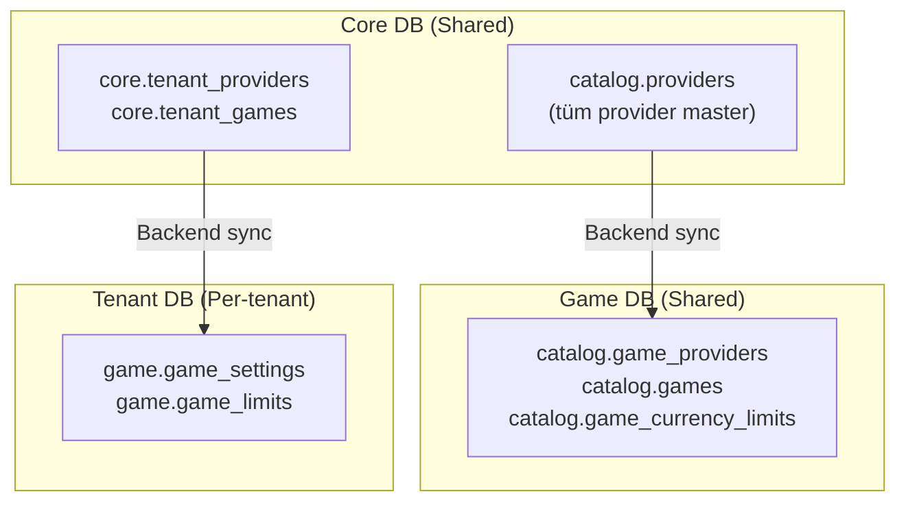
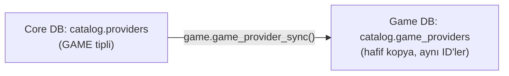
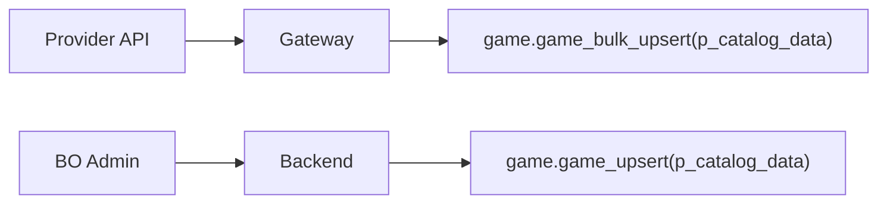

# Game Gateway — Geliştirici Rehberi

Oyun entegrasyonu **bounded context** mimarisi kullanır. **Game DB oyun kataloğunun sahibidir**. Core DB yalnızca tenant mapping tutar.

---

## Büyük Resim



---

## Bounded Context Neden?

Core DB eskiden hem provider hem game tablosunu tutuyordu. Sorunları:

1. **Cross-DB FK**: `core.tenant_games → catalog.games` FK'sı çalışmaz (farklı fiziksel DB)
2. **Monolith catalog**: Game domain'i Core'a bağımlı kalır
3. **Performans**: Game DB kendi catalog'unu lokalde okur, Core'a sorgu atmaz

**Çözüm**: Game DB kendi catalog'unun sahibi olur. Core DB'deki `catalog.providers` master kalır, hafif kopya sync edilir.

---

## Provider Sync Akışı



- **Aynı ID'ler kullanılır** — `BIGINT PK`, serial değil. Cross-DB consistency sağlanır
- **TEXT→JSONB pattern**: 30+ parametre yerine `p_sync_data TEXT` → fonksiyon içinde `::JSONB` cast
- **UPSERT**: Mevcut provider varsa günceller, yoksa ekler

---

## Catalog Doldurma (Hibrit)

Oyun kataloğu iki yoldan doldurulur:

| Yöntem | Kaynak | Kullanım |
|--------|--------|----------|
| Gateway otomatik sync | Provider API | API'si olan provider'lar (Pragmatic, Evolution) |
| BO admin import | CSV/Excel veya manuel CRUD | API'si olmayan provider'lar |



---

## Tenant'a Provider Açma

```
1. BO Admin "Provider Aç" butonuna basar
2. Backend:
   a. Core: tenant_provider_enable(tenant_id, provider_id, rollout_status)
      → core.tenant_providers INSERT
   b. Game DB: game_list(provider_id) → oyun listesini çeker
   c. Core: tenant_game_upsert(tenant_id, game_data)
      → core.tenant_games INSERT (denormalize: game_name, game_code, provider_code...)
   d. Tenant DB: game_settings_sync(settings_data)
      → game.game_settings INSERT
   e. Tenant DB: game_limits_sync(limits_data)
      → game.game_limits INSERT
```

---

## Tenant Oyun Düzenleme

Tenant BO'dan oyun ayarları düzenlenebilir (sadece Tenant DB):

```
game_settings_update(game_settings_id, ...)
  → custom_name, display_order, is_visible, is_featured, blocked_countries...
```

---

## Game Open (Oyuncu Oyun Açma)

```
Player → Frontend → Backend:
  1. game_settings_list(player_id) → görünür oyunlar (shadow mode filtreli)
  2. Player oyun seçer
  3. Backend → Game Gateway → Provider API → launch_url döner
  4. Frontend iframe/redirect ile oyunu açar
```

---

## Core'da Oyun Kapanması

Core'da `is_active = false` yapıldığında:

```
Core: game.is_active = false
  → Backend: tenant_game_refresh çağrılır
  → Tenant DB: game_settings.is_enabled = false (sync)
  → Oyuncu lobide göremez
```

**Provider kapanırsa** (`tenant_providers.is_enabled = false`): Oyunların state'i değişmez, sadece provider'ın tüm oyunları backend seviyesinde filtrelenir.

---

## Denormalizasyon

Core DB'deki `tenant_games` tablosunda denormalize alanlar tutulur:

`game_name`, `game_code`, `provider_code`, `game_type`, `thumbnail_url`

**Neden?** Cross-DB FK kullanılamaz. Backend Game DB'den veriyi alır, Core'a denormalize yazar. Tenant DB'ye sync ederken bu veriler aktarılır.

---

## Crypto Desteği

Limit tabloları `currency_code VARCHAR(20)` + `currency_type SMALLINT` kullanır:

| currency_type | Açıklama | Örnekler |
|---------------|----------|----------|
| 1 | Fiat | TRY, USD, EUR |
| 2 | Crypto | BTC, ETH, DOGE, SOL |

`DECIMAL(18,8)` hassasiyeti hem fiat hem crypto değerleri destekler.

---

## Fonksiyon Listesi (26 toplam)

| DB | Grup | Fonksiyonlar |
|----|------|-------------|
| Game DB | Provider Sync | `game_provider_sync` |
| Game DB | Catalog CRUD | `game_upsert`, `game_bulk_upsert`, `game_update`, `game_get`, `game_list`, `game_lookup`, `game_currency_limit_sync` |
| Core DB | Tenant Provider | `tenant_provider_enable`, `tenant_provider_disable`, `tenant_provider_list` |
| Core DB | Tenant Game | `tenant_game_upsert`, `tenant_game_list`, `tenant_game_remove`, `tenant_game_refresh` |
| Core DB | Rollout | `tenant_provider_set_rollout` |
| Tenant DB | Sync | `game_settings_sync`, `game_settings_remove`, `game_limits_sync` |
| Tenant DB | BO + Game Open | `game_settings_get`, `game_settings_update`, `game_settings_list`, `game_limit_upsert`, `game_limit_list` |
| Tenant DB | Shadow Mode | `shadow_tester_add`, `shadow_tester_remove` |

---

## Backend İçin Notlar

- **TEXT→JSONB pattern**: Tüm sync fonksiyonları `p_data TEXT` parametresi alır → `::JSONB` cast
- **Cross-DB**: Her DB ayrı connection. Backend orchestrate eder: Game DB → Core DB → Tenant DB sırasıyla
- **Bulk upsert**: `game_bulk_upsert` ve `game_currency_limit_sync` JSONB array ile çalışır
- **Auth**: Game DB fonksiyonları auth-agnostic. Core DB'de `user_assert_access_tenant` ile kontrol
- **Shadow mode**: `game_settings_list` fonksiyonunda `rollout_status` filtresi var → [SHADOW_MODE_GUIDE.md](SHADOW_MODE_GUIDE.md)

---

_İlgili dokümanlar: [GAME_ARCHITECTURE.md](../../.planning/GAME_ARCHITECTURE.md) · [FINANCE_GATEWAY_GUIDE.md](FINANCE_GATEWAY_GUIDE.md) · [FUNCTIONS_GATEWAY.md](../reference/FUNCTIONS_GATEWAY.md) · [FUNCTIONS_CORE.md](../reference/FUNCTIONS_CORE.md)_
