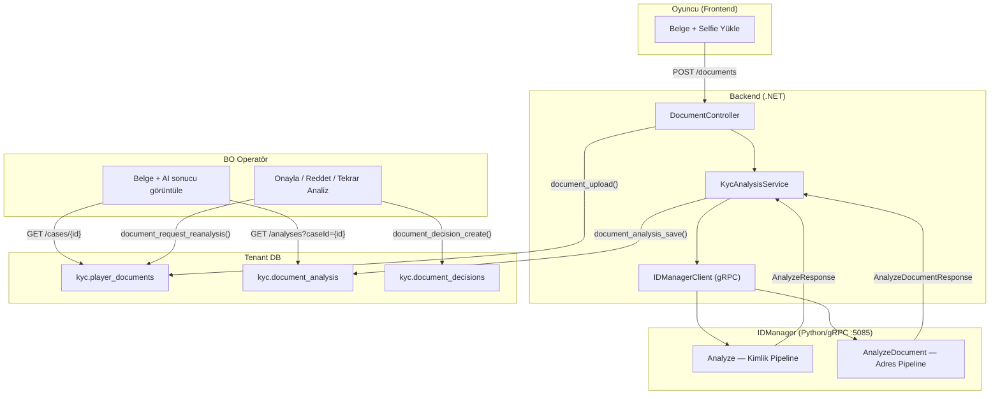
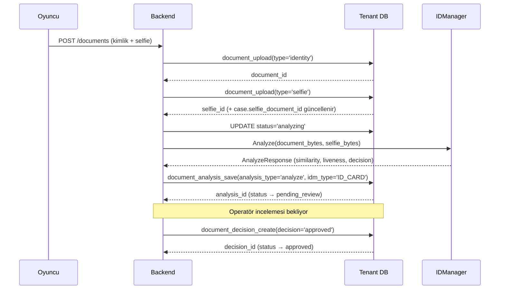
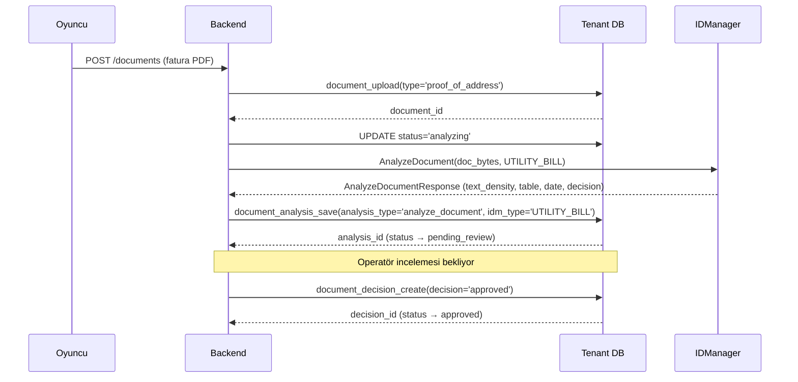
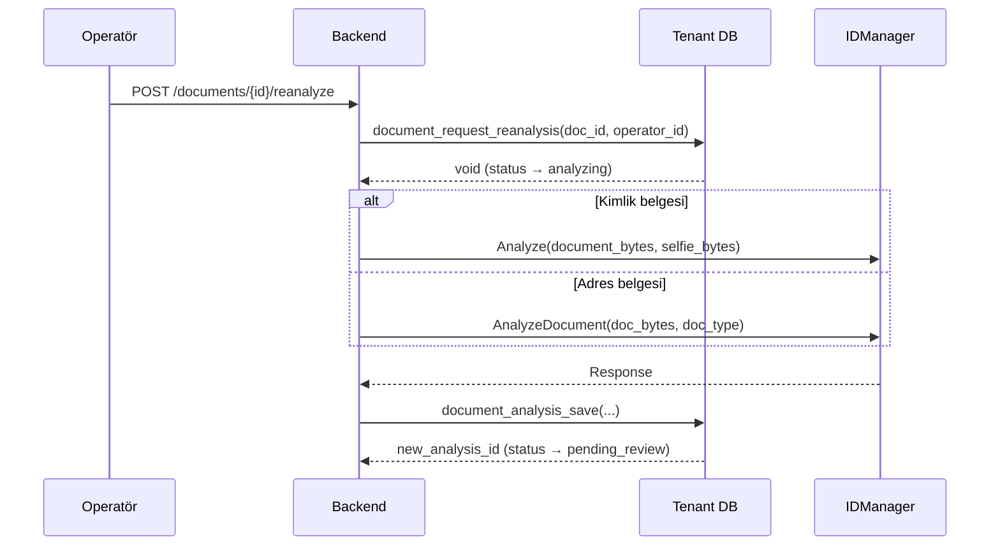

> **FONKSİYONEL SPESİFİKASYON:** Detaylı fonksiyon imzaları, iş kuralları ve hata kodları için bkz. [SPEC_IDMANAGER_INTEGRATION.md](SPEC_IDMANAGER_INTEGRATION.md).
> Bu rehber backend entegrasyon detaylarını, C# örneklerini ve mimari kararları içerir.

# IDManager Integration — Geliştirici Rehberi

IDManager (Python/gRPC) AI-destekli KYC belge doğrulama servisinin backend entegrasyonu. Kimlik belgesi (yüz + canlılık) ve adres belgesi (metin analizi) pipeline'ları destekler. Operatör her zaman son kararı verir.

> İlgili servis: `C:\Projects\Git\IDManager` (gRPC :5085, Python 3.11)

---

## Büyük Resim



---

## IDManager gRPC Servisi

### Proto Tanımları

IDManager iki ana RPC endpoint sunar:

```protobuf
service IDManagerService {
    // Kimlik belgesi + selfie karşılaştırma
    rpc Analyze (AnalyzeRequest) returns (AnalyzeResponse);

    // Adres belgesi doğrulama (PDF destekli)
    rpc AnalyzeDocument (AnalyzeDocumentRequest) returns (AnalyzeDocumentResponse);
}

enum DocumentType {
    ID_CARD = 0;         // Kimlik, pasaport, ehliyet
    UTILITY_BILL = 1;    // Fatura
    BANK_STATEMENT = 2;  // Banka hesap özeti
    INVOICE = 3;         // Fatura
    OTHER_DOCUMENT = 4;  // Diğer
}
```

### C# gRPC Client

```csharp
public class IdManagerClient
{
    private readonly IDManagerService.IDManagerServiceClient _client;

    public IdManagerClient(GrpcChannel channel)
    {
        _client = new IDManagerService.IDManagerServiceClient(channel);
    }

    /// <summary>
    /// Kimlik belgesi + selfie analizi (Analyze RPC)
    /// </summary>
    public async Task<AnalyzeResponse> AnalyzeIdentityAsync(
        byte[] documentBytes,
        byte[] selfieBytes,
        CancellationToken ct = default)
    {
        var request = new AnalyzeRequest
        {
            DocumentImage = ByteString.CopyFrom(documentBytes),
            SelfieImage = ByteString.CopyFrom(selfieBytes)
        };

        return await _client.AnalyzeAsync(request, cancellationToken: ct);
    }

    /// <summary>
    /// Adres belgesi analizi (AnalyzeDocument RPC)
    /// </summary>
    public async Task<AnalyzeDocumentResponse> AnalyzeAddressDocAsync(
        byte[] documentBytes,
        DocumentType documentType,
        CancellationToken ct = default)
    {
        var request = new AnalyzeDocumentRequest
        {
            DocumentImage = ByteString.CopyFrom(documentBytes),
            DocumentType = documentType
        };

        return await _client.AnalyzeDocumentAsync(request, cancellationToken: ct);
    }
}
```

---

## Akış Detayları

### Kimlik Belgesi Akışı (Sequence)



### Adres Belgesi Akışı (Sequence)



### Tekrar Analiz Akışı



---

## Backend Servis Katmanı

### KycAnalysisService

```csharp
public class KycAnalysisService
{
    private readonly IdManagerClient _idManager;
    private readonly ITenantDbConnection _db;

    /// <summary>
    /// Belge yüklendikten sonra analiz başlat.
    /// document_type'a göre uygun pipeline'ı seçer.
    /// </summary>
    public async Task<long> AnalyzeDocumentAsync(
        long playerId,
        long caseId,
        long documentId,
        string documentType,
        CancellationToken ct)
    {
        // 1. Status → analyzing
        await _db.ExecuteAsync(
            "UPDATE kyc.player_documents SET status = 'analyzing' WHERE id = @id",
            new { id = documentId });

        // 2. Belge ve selfie byte'larını storage'dan al
        var docBytes = await GetDocumentBytesAsync(documentId);

        // 3. Pipeline'a göre IDManager çağrısı
        if (IsIdentityDocument(documentType))
        {
            return await AnalyzeIdentityAsync(playerId, caseId, documentId, docBytes, ct);
        }
        else
        {
            var idmDocType = MapToIdManagerDocType(documentType);
            return await AnalyzeAddressAsync(playerId, caseId, documentId, docBytes, idmDocType, ct);
        }
    }

    private async Task<long> AnalyzeIdentityAsync(
        long playerId, long caseId, long documentId,
        byte[] docBytes, CancellationToken ct)
    {
        // Selfie'yi case'den al
        var selfieBytes = await GetSelfieBytesForCaseAsync(caseId);

        var sw = Stopwatch.StartNew();
        var response = await _idManager.AnalyzeIdentityAsync(docBytes, selfieBytes, ct);
        sw.Stop();

        // DB'ye kaydet
        return await _db.QuerySingleAsync<long>(
            "SELECT kyc.document_analysis_save(" +
            "p_player_id := @playerId, p_kyc_case_id := @caseId, " +
            "p_document_id := @documentId, p_request_id := @requestId, " +
            "p_analysis_type := 'analyze', p_idm_document_type := 'ID_CARD', " +
            "p_ai_decision := @decision, p_risk_score := @riskScore, " +
            "p_rejection_reasons := @reasons, p_quality_details := @quality::jsonb, " +
            "p_processing_time_ms := @timeMs, " +
            "p_face_detected_doc := @faceDoc, p_face_detected_selfie := @faceSelfie, " +
            "p_document_check := @docCheck, " +
            "p_similarity_score := @similarity, p_liveness_score := @liveness)",
            new
            {
                playerId, caseId, documentId,
                requestId = response.RequestId,
                decision = response.Decision.ToString(),
                riskScore = response.RiskScore,
                reasons = response.RejectionReasons.ToArray(),
                quality = JsonSerializer.Serialize(response.Quality),
                timeMs = (int)sw.ElapsedMilliseconds,
                faceDoc = response.FaceDetectedId,
                faceSelfie = response.FaceDetectedSelfie,
                docCheck = response.DocumentCheck,
                similarity = response.FaceSimilarity,
                liveness = response.LivenessScore
            });
    }

    private async Task<long> AnalyzeAddressAsync(
        long playerId, long caseId, long documentId,
        byte[] docBytes, DocumentType idmDocType, CancellationToken ct)
    {
        var sw = Stopwatch.StartNew();
        var response = await _idManager.AnalyzeAddressDocAsync(docBytes, idmDocType, ct);
        sw.Stop();

        return await _db.QuerySingleAsync<long>(
            "SELECT kyc.document_analysis_save(" +
            "p_player_id := @playerId, p_kyc_case_id := @caseId, " +
            "p_document_id := @documentId, p_request_id := @requestId, " +
            "p_analysis_type := 'analyze_document', p_idm_document_type := @idmType, " +
            "p_ai_decision := @decision, p_risk_score := @riskScore, " +
            "p_rejection_reasons := @reasons, p_quality_details := @quality::jsonb, " +
            "p_processing_time_ms := @timeMs, " +
            "p_address_doc_details := @addressDetails::jsonb)",
            new
            {
                playerId, caseId, documentId,
                requestId = response.RequestId,
                idmType = idmDocType.ToString(),
                decision = response.Decision.ToString(),
                riskScore = response.RiskScore,
                reasons = response.RejectionReasons.ToArray(),
                quality = JsonSerializer.Serialize(response.Quality),
                timeMs = (int)sw.ElapsedMilliseconds,
                addressDetails = JsonSerializer.Serialize(response.AddressDocInfo)
            });
    }

    /// <summary>
    /// player_documents.document_type → IDManager DocumentType eşleştirmesi
    /// </summary>
    private static bool IsIdentityDocument(string docType)
        => docType is "identity" or "passport" or "driver_license";

    private static DocumentType MapToIdManagerDocType(string docType)
        => docType switch
        {
            // proof_of_address için varsayılan UTILITY_BILL
            // Spesifik tip BO tarafından veya yükleme sırasında belirtilir
            _ => DocumentType.UtilityBill
        };
}
```

---

## Operatör Ekranı API'si

### Case Detay Endpoint'i

```csharp
[HttpGet("cases/{caseId}")]
public async Task<IActionResult> GetCase(long caseId)
{
    // Tek çağrıda case + belgeler + son analiz/karar özeti
    var caseDetail = await _db.QuerySingleAsync<string>(
        "SELECT kyc.kyc_case_get(@caseId)", new { caseId });

    return Ok(JsonDocument.Parse(caseDetail));
}
```

**Response örneği:**
```json
{
  "id": 1,
  "playerId": 100,
  "currentStatus": "in_review",
  "selfieDocumentId": 5,
  "documents": [
    {
      "id": 3,
      "documentType": "identity",
      "status": "pending_review",
      "latestAiDecision": "PASS",
      "latestRiskScore": 85,
      "latestIdmDocumentType": "ID_CARD",
      "latestOperatorDecision": null
    },
    {
      "id": 7,
      "documentType": "proof_of_address",
      "status": "approved",
      "latestAiDecision": "PASS",
      "latestRiskScore": 95,
      "latestIdmDocumentType": "UTILITY_BILL",
      "latestOperatorDecision": "approved"
    }
  ],
  "workflows": [...]
}
```

### Analiz Detayları Endpoint'i

```csharp
[HttpGet("analyses")]
public async Task<IActionResult> GetAnalysesByCase(long caseId)
{
    var analyses = await _db.QuerySingleAsync<string>(
        "SELECT kyc.document_analysis_list_by_case(@caseId)", new { caseId });

    return Ok(JsonDocument.Parse(analyses));
}
```

### Karar Oluşturma Endpoint'i

```csharp
[HttpPost("documents/{documentId}/decide")]
public async Task<IActionResult> DecideDocument(
    long documentId,
    [FromBody] DecisionRequest req)
{
    var decisionId = await _db.QuerySingleAsync<long>(
        "SELECT kyc.document_decision_create(" +
        "p_document_id := @documentId, p_analysis_id := @analysisId, " +
        "p_decision := @decision, p_reason := @reason, " +
        "p_decided_by := @decidedBy)",
        new
        {
            documentId,
            analysisId = req.AnalysisId,
            decision = req.Decision,   // "approved" veya "rejected"
            reason = req.Reason,
            decidedBy = GetCurrentUserId()
        });

    return Ok(new { decisionId });
}
```

### Tekrar Analiz Endpoint'i

```csharp
[HttpPost("documents/{documentId}/reanalyze")]
public async Task<IActionResult> RequestReanalysis(long documentId)
{
    // 1. DB status güncelle
    await _db.ExecuteAsync(
        "SELECT kyc.document_request_reanalysis(@docId, @requestedBy)",
        new { docId = documentId, requestedBy = GetCurrentUserId() });

    // 2. Async olarak IDManager'ı tekrar çağır
    await _analysisService.ReanalyzeDocumentAsync(documentId);

    return Ok();
}
```

---

## Konfigürasyon

### appsettings.json

```json
{
  "IDManager": {
    "GrpcEndpoint": "http://localhost:5085",
    "TimeoutSeconds": 30,
    "MaxRetries": 2,
    "RetryDelayMs": 1000
  }
}
```

### DI Registrasyonu

```csharp
services.AddGrpcClient<IDManagerService.IDManagerServiceClient>(options =>
{
    options.Address = new Uri(config["IDManager:GrpcEndpoint"]);
});
services.AddScoped<IdManagerClient>();
services.AddScoped<KycAnalysisService>();
```

---

## Hata Yönetimi

### gRPC Hata → HTTP Hata Eşleştirmesi

| gRPC Status | HTTP | Aksiyon |
|------------|------|---------|
| OK | 200 | Analiz sonucu kaydet |
| DEADLINE_EXCEEDED | 504 | Retry → log → status='uploaded' bırak |
| UNAVAILABLE | 503 | Retry → log → status='uploaded' bırak |
| INVALID_ARGUMENT | 400 | Log → status='uploaded' bırak, operatöre bildir |
| INTERNAL | 500 | Log → status='uploaded' bırak |

**Önemli:** IDManager hatası durumunda belge status'u `analyzing`'de kalmamalı. Hata sonrası `uploaded`'a geri al, operatör tekrar analiz talep edebilir.

### Retry Stratejisi

```csharp
// Polly ile exponential backoff
var retryPolicy = Policy
    .Handle<RpcException>(ex =>
        ex.StatusCode is StatusCode.Unavailable or StatusCode.DeadlineExceeded)
    .WaitAndRetryAsync(
        retryCount: 2,
        sleepDurationProvider: attempt => TimeSpan.FromSeconds(Math.Pow(2, attempt)));
```

---

## Operatör Ekranı — Görünüm Tasarımı

### Kimlik Belgesi Görünümü

```
┌───────────────────────────────────────────────────┐
│ 📄 Kimlik: id_front.jpg    AI: PASS (85/100)     │
│ 🤳 Selfie: selfie.jpg     Benzerlik: %72         │
│                             Canlılık: %89          │
│                             Belge format: ✓        │
│                             Kalite: ✓              │
│                                                    │
│ Red sebepleri: —                                   │
│                                                    │
│          [✓ Onayla]  [✗ Reddet]  [↻ Tekrar Analiz]│
└───────────────────────────────────────────────────┘
```

### Adres Belgesi Görünümü

```
┌───────────────────────────────────────────────────┐
│ 📄 Fatura: elektrik.pdf    AI: PASS (85/110)     │
│ Tip: UTILITY_BILL          Metin yoğunluğu: %15  │
│ Sayfa: 3                   Tablo yapısı: ✓        │
│                             Tarih tespit: ✓        │
│                             Geçerli belge: ✓       │
│                                                    │
│ Red sebepleri: —                                   │
│                                                    │
│          [✓ Onayla]  [✗ Reddet]  [↻ Tekrar Analiz]│
└───────────────────────────────────────────────────┘
```

---

## Mimari Kararlar

### Neden Tek Tablo (document_analysis)?

Her iki pipeline'ın sonuçları `document_analysis` tablosunda tutulur. Pipeline'a özgü kolonlar nullable:

- **Avantaj:** Tek sorgu ile tüm analizler döner, JOIN gerekmez
- **Avantaj:** `idm_document_type` ile pipeline kolayca ayrıştırılır
- **Trade-off:** Kimlik analizinde adres kolonları NULL, adres analizinde kimlik kolonları NULL

### Neden Append-Only?

- `document_analysis`: Her IDManager çağrısı yeni satır. Tekrar analiz durumunda geçmiş korunur
- `document_decisions`: Her operatör kararı yeni satır. Karar geçmişi denetlenebilir

### Selfie Neden Case Seviyesinde?

Tek selfie birden fazla kimlik belgesi için kullanılabilir. `player_kyc_cases.selfie_document_id` ile case seviyesinde bağlanır, belge seviyesinde değil.

### document_review Neden Deprecated?

Eski fonksiyon doğrudan status güncelliyordu, karar geçmişi tutmuyordu. Yeni `document_decision_create()` hem status günceller hem `document_decisions` tablosuna kayıt oluşturur. Geriye uyumluluk için eski fonksiyon approved/rejected çağrılarını yeni fonksiyona yönlendirir.
