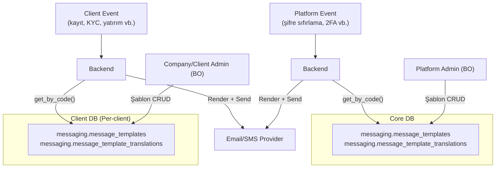

> **FONKSİYONEL SPESİFİKASYON:** Detaylı fonksiyon imzaları, iş kuralları ve hata kodları için bkz. [SPEC_MESSAGE_TEMPLATE.md](SPEC_MESSAGE_TEMPLATE.md).
> Bu rehber backend entegrasyon detaylarını, C# örneklerini ve mimari kararları içerir.

# Message Template — Geliştirici Rehberi

Platform ve client seviyesinde e-posta/SMS şablon yönetimi. Transaksiyonel bildirimler (kayıt, şifre sıfırlama, KYC) için şablon oluşturma, çok dilli çeviri ve backend rendering altyapısı.

---

## Büyük Resim



| Veritabanı | Tablolar | Fonksiyonlar | Hedef Kitle | Açıklama |
|------------|----------|--------------|-------------|----------|
| **Core DB** | `message_templates`, `message_template_translations` | 6 | BO kullanıcıları | Platform bildirim şablonları |
| **Client DB** | `message_templates`, `message_template_translations` | 6 | Oyuncular | Client bildirim şablonları |

---

## Kampanya vs Bildirim Şablonları

Client DB'de `messaging.message_templates` tablosu hem kampanya hem bildirim şablonlarını barındırır. `category` kolonu ile ayrıştırılır:

| Kategori | Kullanım | Tetiklenme | Fonksiyonlar |
|----------|----------|------------|-------------|
| `campaign` | Kampanya mesajları (mevcut) | BO → campaign publish → worker | `admin_template_*` |
| `transactional` | Sistem bildirimleri | Event → backend → render → send | `admin_message_template_*` |
| `notification` | Bilgilendirme | Event → backend → render → send | `admin_message_template_*` |
| `marketing` | Pazarlama | Event → backend → render → send | `admin_message_template_*` |

Core DB'de `category` değerleri: `transactional`, `notification`, `system`.

---

## Kanal ve Çeviri Sistemi

### Kanal Bazlı Alan Kullanımı

| Alan | Email | SMS |
|------|-------|-----|
| `subject` | **Zorunlu** | NULL |
| `body_html` | **Zorunlu** | NULL |
| `body_text` | Opsiyonel (plain text fallback) | **Zorunlu** (ana içerik) |
| `preview_text` | Opsiyonel | NULL |

### Merge Tag Sistemi

Şablon gövdelerinde `{{variable_name}}` placeholder'lar kullanılır. Her şablonun `variables` JSONB alanı hangi tag'lerin kullanıldığını tanımlar:

```json
[
  {"key": "player_name", "type": "string", "required": true, "description": "Oyuncu adı"},
  {"key": "reset_link", "type": "string", "required": true, "description": "Şifre sıfırlama URL"},
  {"key": "expiry_hours", "type": "number", "required": false, "default": 24, "description": "Geçerlilik süresi"}
]
```

- `variables` alanı **bilgilendirme amaçlı** — SQL seviyesinde render yapılmaz
- Backend template engine `{{key}}` → gerçek değer dönüşümünü yapar
- Validasyon: backend rendering sırasında `required: true` alanlar kontrol edilir

### Çeviri Yönetimi

- Her şablon birden fazla dile çevrilebilir (CHAR(2) dil kodu)
- `(template_id, language_code)` UNIQUE — dil tekrarı yok
- **Replace-all stratejisi:** Update sırasında tüm çeviriler silinip yeniden eklenir
- `message_template_get_by_code()` belirli bir dilde tek çeviri döndürür

---

## Şablon Durum Makinası

```
draft → active → archived
  ↓       ↓        ↓
 (delete) (delete) (delete)  ← yalnızca is_system=FALSE
```

- Yeni şablon her zaman `draft` ile başlar
- Yalnızca `active` durumundaki şablonlar `get_by_code()` ile alınabilir
- `is_system=TRUE` şablonlar silinemez (seed data koruması)

---

## DB Yapısı

### Core DB — Platform Şablonları

| Tablo | Şema | Açıklama |
|-------|------|----------|
| `message_templates` | messaging | Platform bildirim şablonları (code, name, channel, category, variables, is_system, status) |
| `message_template_translations` | messaging | Dil bazlı çeviri (subject, body_html, body_text, preview_text) |

**Soft delete:** `is_active = FALSE`
**Timestamp:** `TIMESTAMPTZ`
**Caller ID:** `BIGINT`

### Client DB — Oyuncu Şablonları

| Tablo | Şema | Açıklama |
|-------|------|----------|
| `message_templates` | messaging | Client bildirim + kampanya şablonları (category ile ayrım) |
| `message_template_translations` | messaging | Dil bazlı çeviri |

**Soft delete:** `is_deleted = TRUE` + `deleted_at` + `deleted_by`
**Timestamp:** `TIMESTAMP WITHOUT TIME ZONE`
**Caller ID:** `INTEGER`

---

## Temel Akışlar

### 1. Şablon Oluşturma (BO Admin → Core/Client DB)

```
BO Admin → Backend → messaging.admin_message_template_create(
    p_caller_id,                     -- veya p_user_id (Client)
    p_code: 'user.welcome.email',    -- benzersiz kod
    p_name: 'User Welcome Email',
    p_channel_type: 'email',
    p_category: 'transactional',
    p_variables: '[{"key":"user_name",...}]'::JSONB,
    p_translations: '[{
        "language_code": "en",
        "subject": "Welcome!",
        "body_html": "<h1>Hello, {{user_name}}</h1>",
        "body_text": "Hello, {{user_name}}"
    }]'::JSONB
)
→ RETURNS template_id (INTEGER)
→ status: 'draft'
```

### 2. Şablon Aktifleştirme

```
messaging.admin_message_template_update(
    p_caller_id, p_id, p_status: 'active'
)
→ Artık get_by_code() ile alınabilir
```

### 3. Backend Rendering (Event → Email/SMS Gönderimi)

```
Event (kullanıcı kaydı, şifre sıfırlama vb.) →
  Backend:
    1. messaging.message_template_get_by_code('user.welcome.email', 'tr')
       → {code, channelType, subject, bodyHtml, bodyText, variables}
    2. Template engine: {{user_name}} → "Ahmet"
    3. Email/SMS provider'a gönder
```

### 4. Şablon Silme

```
messaging.admin_message_template_delete(p_caller_id, p_id)
  → is_system=TRUE ise HATA: "system-template-cannot-be-deleted"
  → Core: is_active = FALSE
  → Client: is_deleted = TRUE, deleted_at, deleted_by
```

---

## C# Backend Entegrasyonu

### Servis Arayüzü

```csharp
public interface IMessageTemplateService
{
    /// <summary>
    /// Şablon koduna göre render edilmiş içerik döndürür.
    /// Core veya Client DB'den okur (context'e göre).
    /// </summary>
    Task<RenderedTemplate> RenderTemplateAsync(
        string code,
        string languageCode,
        Dictionary<string, object> mergeData,
        CancellationToken ct = default);
}

public record RenderedTemplate(
    string Code,
    string ChannelType,     // "email" veya "sms"
    string? Subject,        // Email: rendered subject, SMS: null
    string? BodyHtml,       // Email: rendered HTML, SMS: null
    string BodyText,        // Email: rendered plain text, SMS: rendered SMS body
    string? PreviewText     // Email: rendered preview, SMS: null
);
```

### Rendering Akışı

```csharp
public class MessageTemplateService : IMessageTemplateService
{
    private readonly IDbConnectionFactory _dbFactory;
    private readonly ITemplateEngine _templateEngine;

    public async Task<RenderedTemplate> RenderTemplateAsync(
        string code, string languageCode,
        Dictionary<string, object> mergeData,
        CancellationToken ct)
    {
        // 1. DB'den şablonu al (Core veya Client context'e göre)
        await using var conn = _dbFactory.CreateConnection();
        var template = await conn.QuerySingleAsync<JsonElement>(
            "SELECT messaging.message_template_get_by_code(@code, @lang)",
            new { code, lang = languageCode });

        // 2. Merge tag'leri render et
        var channelType = template.GetProperty("channelType").GetString()!;
        var bodyText = _templateEngine.Render(
            template.GetProperty("bodyText").GetString()!, mergeData);

        string? subject = null, bodyHtml = null, previewText = null;

        if (channelType == "email")
        {
            subject = _templateEngine.Render(
                template.GetProperty("subject").GetString()!, mergeData);
            bodyHtml = _templateEngine.Render(
                template.GetProperty("bodyHtml").GetString()!, mergeData);

            var previewRaw = template.GetProperty("previewText").GetString();
            if (previewRaw != null)
                previewText = _templateEngine.Render(previewRaw, mergeData);
        }

        return new RenderedTemplate(code, channelType, subject, bodyHtml, bodyText, previewText);
    }
}
```

### Kullanım Örneği — Hoş Geldiniz E-postası

```csharp
public class UserRegistrationHandler : INotificationHandler<UserRegisteredEvent>
{
    private readonly IMessageTemplateService _templateService;
    private readonly IEmailSender _emailSender;

    public async Task Handle(UserRegisteredEvent evt, CancellationToken ct)
    {
        var rendered = await _templateService.RenderTemplateAsync(
            code: "user.welcome.email",
            languageCode: evt.PreferredLanguage ?? "en",
            mergeData: new Dictionary<string, object>
            {
                ["user_name"] = evt.DisplayName,
                ["login_url"] = _config.PlatformLoginUrl
            },
            ct);

        await _emailSender.SendAsync(new EmailMessage
        {
            To = evt.Email,
            Subject = rendered.Subject!,
            HtmlBody = rendered.BodyHtml!,
            TextBody = rendered.BodyText
        }, ct);
    }
}
```

### Kullanım Örneği — Oyuncu Şifre Sıfırlama SMS

```csharp
public class PlayerPasswordResetHandler : INotificationHandler<PlayerPasswordResetEvent>
{
    private readonly IMessageTemplateService _templateService;
    private readonly ISmsSender _smsSender;

    public async Task Handle(PlayerPasswordResetEvent evt, CancellationToken ct)
    {
        var rendered = await _templateService.RenderTemplateAsync(
            code: "player.password_reset.sms",
            languageCode: evt.PreferredLanguage ?? "en",
            mergeData: new Dictionary<string, object>
            {
                ["player_name"] = evt.DisplayName,
                ["reset_code"] = evt.ResetCode,
                ["brand_name"] = evt.BrandName
            },
            ct);

        await _smsSender.SendAsync(new SmsMessage
        {
            To = evt.PhoneNumber,
            Body = rendered.BodyText
        }, ct);
    }
}
```

### Client Provisioning — Varsayılan Şablon Seed

```csharp
public class ClientProvisioningService
{
    public async Task SeedDefaultTemplatesAsync(int clientId, CancellationToken ct)
    {
        await using var conn = _dbFactory.CreateClientConnection(clientId);

        // Varsayılan şablonları oluştur
        var templates = GetDefaultPlayerTemplates();
        foreach (var tmpl in templates)
        {
            await conn.ExecuteAsync(
                "SELECT messaging.admin_message_template_create(" +
                "@userId, @code, @name, @channelType, @category, " +
                "@description, @variables::JSONB, @isSystem, @translations::JSONB)",
                new
                {
                    userId = -1, // system user
                    tmpl.Code, tmpl.Name, tmpl.ChannelType,
                    tmpl.Category, tmpl.Description,
                    variables = JsonSerializer.Serialize(tmpl.Variables),
                    isSystem = true,
                    translations = JsonSerializer.Serialize(tmpl.Translations)
                });

            // Draft → Active
            // (veya create fonksiyonunu override edip direkt active oluşturabilirsiniz)
        }
    }

    private static List<TemplateDefinition> GetDefaultPlayerTemplates() =>
    [
        new("player.welcome.email", "Player Welcome Email", "email", "transactional",
            "Yeni oyuncu hoş geldiniz e-postası",
            [
                new("player_name", "string", true, "Oyuncu adı"),
                new("brand_name", "string", true, "Marka adı"),
                new("login_url", "string", true, "Giriş URL'i")
            ]),
        new("player.password_reset.email", "Player Password Reset", "email", "transactional",
            "Oyuncu şifre sıfırlama",
            [
                new("player_name", "string", true, "Oyuncu adı"),
                new("reset_link", "string", true, "Sıfırlama URL'i"),
                new("expiry_hours", "number", false, "Geçerlilik süresi", 24),
                new("brand_name", "string", true, "Marka adı")
            ]),
        // ... diğer şablonlar (bkz. SPEC §7.2)
    ];
}
```

---

## Şablon Kodu Konvansiyonu

```
{hedef}.{olay}.{kanal}
```

| Segment | Platform (Core) | Client | Açıklama |
|---------|-----------------|--------|----------|
| hedef | `user` | `player` | Kimin için |
| olay | `welcome`, `password_reset`, `role_changed` | `welcome`, `kyc_approved`, `deposit_confirmed` | İş olayı |
| kanal | `email`, `sms` | `email`, `sms` | Gönderim kanalı |

**Örnekler:**
- `user.welcome.email` — BO kullanıcı hoş geldiniz e-postası
- `player.kyc_rejected.email` — Oyuncu KYC reddedildi bildirimi
- `player.password_reset.sms` — Oyuncu şifre sıfırlama SMS

---

## Varsayılan Şablonlar

### Platform (Core DB — 8 şablon)

| Kod | Kanal | Kategori |
|-----|-------|----------|
| `user.welcome.email` | email | transactional |
| `user.password_reset.email` | email | transactional |
| `user.email_verification.email` | email | transactional |
| `user.account_locked.email` | email | notification |
| `user.two_factor_enabled.email` | email | notification |
| `user.role_changed.email` | email | notification |
| `user.password_reset.sms` | sms | transactional |
| `user.two_factor_code.sms` | sms | transactional |

Tümü `is_system=TRUE`, `status='active'`, EN+TR çevirileri dahil.
Dosya: `core/data/notification_templates_seed.sql`

### Client (Backend Seed — 18 şablon)

14 email + 4 SMS şablonu. Tümü `is_system=TRUE`.
Detaylar: [SPEC_MESSAGE_TEMPLATE.md §7.2](SPEC_MESSAGE_TEMPLATE.md)

---

## Fonksiyon Listesi

### Core DB (6 fonksiyon)

| Fonksiyon | Dönüş | Açıklama |
|----------|-------|----------|
| `admin_message_template_create` | INTEGER | Yeni şablon + çeviriler oluştur |
| `admin_message_template_update` | BOOLEAN | Şablon güncelle (çeviriler replace-all) |
| `admin_message_template_get` | JSONB | Tek şablon + tüm çeviriler |
| `admin_message_template_list` | JSONB | Sayfalı liste (kanal/kategori/durum/arama filtresi) |
| `admin_message_template_delete` | VOID | Soft delete (is_system koruma) |
| `message_template_get_by_code` | JSONB | Backend rendering için (auth yok) |

### Client DB (6 fonksiyon)

Aynı fonksiyon seti, farklar: `p_user_id INTEGER`, `is_deleted = FALSE` filtresi, `category IN ('transactional', 'notification', 'marketing')`.

---

## Permission'lar

| Permission | Scope | Açıklama |
|-----------|-------|----------|
| `platform.notification-template.manage` | platform | Platform şablon CRUD |
| `platform.notification-template.view` | platform | Platform şablon görüntüleme |
| `client.notification-template.manage` | client | Client şablon CRUD |
| `client.notification-template.view` | client | Client şablon görüntüleme |

> `message_template_get_by_code` auth kontrolü yapmaz — backend internal kullanım.

---

## Backend İçin Notlar

- **İki ayrı DB, iki ayrı connection:** Core DB platform şablonlarını, Client DB oyuncu şablonlarını yönetir. Cross-DB sorgu yok.
- **Render backend'de:** SQL yalnızca depolama ve çeviri yönetimi yapar. `{{placeholder}}` dönüşümü C# template engine'de yapılır.
- **channel_type immutable:** Şablon oluşturulduktan sonra kanal tipi değiştirilemez.
- **Replace-all çeviriler:** Update'te `p_translations` verilirse tüm mevcut çeviriler silinir, yenileri eklenir. `NULL` gönderilirse çeviriler değişmez.
- **Client provisioning:** Client oluşturulurken backend varsayılan şablonları seed'ler. SQL dosyası ile değil, C# kodu ile yapılır.
- **Kampanya şablonları:** Mevcut `admin_template_create/update/get/list` fonksiyonları kampanya şablonları (`category='campaign'`) için kullanılmaya devam eder.

---

_İlgili dokümanlar: [SPEC_MESSAGE_TEMPLATE.md](SPEC_MESSAGE_TEMPLATE.md) · [SPEC_CALL_CENTER.md](SPEC_CALL_CENTER.md) · [FUNCTIONS_CORE.md](../reference/FUNCTIONS_CORE.md) · [FUNCTIONS_CLIENT.md](../reference/FUNCTIONS_CLIENT.md)_
