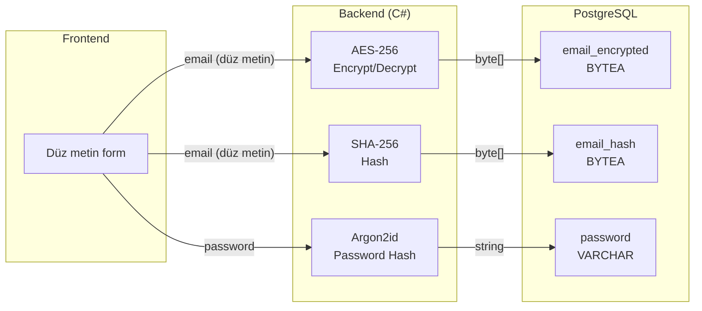
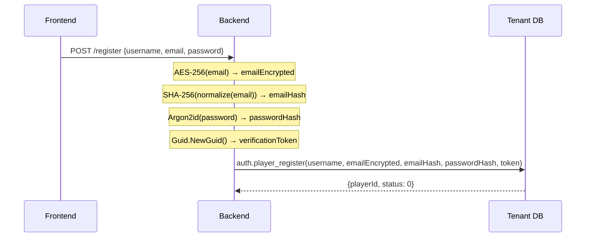
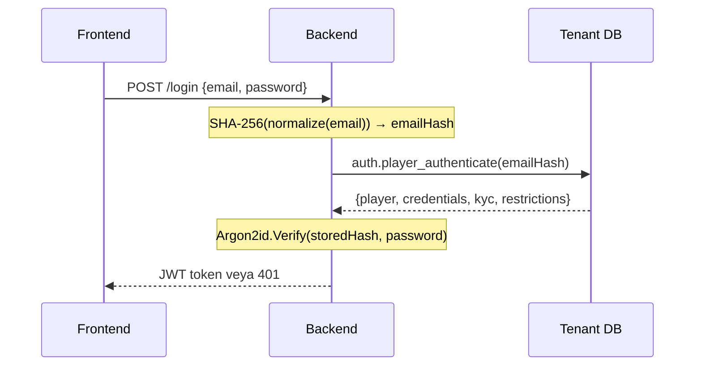

# PII Şifreleme & Hashing — Backend Geliştirici Rehberi

Oyuncu kişisel verilerinin (PII) C# backend tarafında şifrelenmesi, hash'lenmesi, DB'ye gönderilmesi ve okunması için kapsamlı rehber.

> **İlgili dokümanlar:**
> - [PLAYER_AUTH_KYC_GUIDE.md](PLAYER_AUTH_KYC_GUIDE.md) — Oyuncu yaşam döngüsü & DB fonksiyonları
> - [DATABASE_ARCHITECTURE.md](../reference/DATABASE_ARCHITECTURE.md) — Veritabanı mimarisi

---

## 1. Genel Mimari

### 1.1 Şifreleme Sorumluluk Dağılımı

| Katman | Sorumluluk |
|--------|-----------|
| **Backend (C#)** | Argon2id hash (şifre), AES-256 encrypt/decrypt (PII), SHA-256 hash (arama) |
| **DB (PostgreSQL)** | BYTEA depolama, hash ile WHERE karşılaştırma, base64 encode (okuma) |
| **Frontend** | Düz metin gönderir, şifreleme bilmez |

### 1.2 Alan-Strateji Matrisi

| Alan | DB Tipi | Şifreleme | Arama | Açıklama |
|------|---------|-----------|-------|----------|
| `email` | BYTEA × 2 | AES-256 + SHA-256 | Hash ile tam eşleşme | GDPR/KVKK zorunlu |
| `first_name`, `last_name` | BYTEA × 2 | AES-256 + SHA-256 | Hash ile tam eşleşme | PII koruma |
| `phone`, `gsm` | BYTEA × 2 | AES-256 + SHA-256 | Hash ile tam eşleşme | PII koruma |
| `identity_no` | BYTEA × 2 | AES-256 + SHA-256 | Hash ile tam eşleşme | Kimlik numarası |
| `address`, `middle_name` | BYTEA × 1 | Sadece AES-256 | Aranamaz | Yalnızca görüntüleme |
| `password` | VARCHAR(255) | Argon2id | — | Tek yönlü hash, doğrulama |
| `username` | VARCHAR(150) | Düz metin | ILIKE | Herkese açık |
| `birth_date` | DATE | Düz metin | Aralık sorgusu | Yaş kontrolü |
| `country_code`, `city`, `gender` | Düz metin | Düz metin | Doğrudan sorgu | Düşük hassasiyet |

### 1.3 Veri Akış Diyagramı



---

## 2. Crypto Service Implementasyonu

### 2.1 Interface

```csharp
public interface IPlayerCryptoService
{
    /// <summary>AES-256 ile şifreler. DB'ye BYTEA olarak gider.</summary>
    byte[] Encrypt(string plainText);

    /// <summary>AES-256 ile çözer. DB'den gelen BYTEA → string.</summary>
    string Decrypt(byte[] cipherData);

    /// <summary>SHA-256 hash üretir. Normalize eder (lowercase + trim).</summary>
    byte[] Hash(string value);

    /// <summary>Telefon numarasını normalize edip hash'ler.</summary>
    byte[] HashPhone(string phone);
}
```

### 2.2 Sabit IV Implementasyonu (Basit)

Tüm kayıtlar aynı IV kullanır. Daha basit ama aynı plaintext her zaman aynı ciphertext'i üretir.

```csharp
public class PlayerCryptoService : IPlayerCryptoService
{
    private readonly byte[] _aesKey; // 32 bytes (256-bit)
    private readonly byte[] _aesIv;  // 16 bytes (128-bit)

    public PlayerCryptoService(IConfiguration config)
    {
        // Key yönetimi: Azure Key Vault, AWS KMS veya config
        _aesKey = Convert.FromBase64String(config["Encryption:AesKey"]);
        _aesIv = Convert.FromBase64String(config["Encryption:AesIv"]);
    }

    public byte[] Encrypt(string plainText)
    {
        if (string.IsNullOrEmpty(plainText))
            return null;

        using var aes = Aes.Create();
        aes.Key = _aesKey;
        aes.IV = _aesIv;
        aes.Mode = CipherMode.CBC;
        aes.Padding = PaddingMode.PKCS7;

        using var encryptor = aes.CreateEncryptor();
        var plainBytes = Encoding.UTF8.GetBytes(plainText);
        return encryptor.TransformFinalBlock(plainBytes, 0, plainBytes.Length);
    }

    public string Decrypt(byte[] cipherData)
    {
        if (cipherData == null || cipherData.Length == 0)
            return null;

        using var aes = Aes.Create();
        aes.Key = _aesKey;
        aes.IV = _aesIv;
        aes.Mode = CipherMode.CBC;
        aes.Padding = PaddingMode.PKCS7;

        using var decryptor = aes.CreateDecryptor();
        var plainBytes = decryptor.TransformFinalBlock(cipherData, 0, cipherData.Length);
        return Encoding.UTF8.GetString(plainBytes);
    }

    public byte[] Hash(string value)
    {
        if (string.IsNullOrEmpty(value))
            return null;

        var normalized = value.Trim().ToLowerInvariant();
        return SHA256.HashData(Encoding.UTF8.GetBytes(normalized));
    }

    public byte[] HashPhone(string phone)
    {
        if (string.IsNullOrEmpty(phone))
            return null;

        var normalized = new string(phone.Where(char.IsDigit).ToArray());
        return SHA256.HashData(Encoding.UTF8.GetBytes(normalized));
    }
}
```

### 2.3 Random IV Implementasyonu (Production)

Her kayıt için ayrı IV üretilir, ciphertext'in başına eklenir. Aynı plaintext farklı ciphertext üretir.

```csharp
public class PlayerCryptoServiceRandomIv : IPlayerCryptoService
{
    private readonly byte[] _aesKey;
    private const int IvLength = 16;

    public PlayerCryptoServiceRandomIv(IConfiguration config)
    {
        _aesKey = Convert.FromBase64String(config["Encryption:AesKey"]);
    }

    public byte[] Encrypt(string plainText)
    {
        if (string.IsNullOrEmpty(plainText))
            return null;

        using var aes = Aes.Create();
        aes.Key = _aesKey;
        aes.GenerateIV(); // her kayıt için yeni IV
        aes.Mode = CipherMode.CBC;
        aes.Padding = PaddingMode.PKCS7;

        using var encryptor = aes.CreateEncryptor();
        var plainBytes = Encoding.UTF8.GetBytes(plainText);
        var cipherBytes = encryptor.TransformFinalBlock(plainBytes, 0, plainBytes.Length);

        // [IV (16 byte)] + [CipherText] → tek BYTEA olarak DB'ye
        var result = new byte[IvLength + cipherBytes.Length];
        Buffer.BlockCopy(aes.IV, 0, result, 0, IvLength);
        Buffer.BlockCopy(cipherBytes, 0, result, IvLength, cipherBytes.Length);
        return result;
    }

    public string Decrypt(byte[] cipherData)
    {
        if (cipherData == null || cipherData.Length <= IvLength)
            return null;

        using var aes = Aes.Create();
        aes.Key = _aesKey;
        aes.Mode = CipherMode.CBC;
        aes.Padding = PaddingMode.PKCS7;

        // İlk 16 byte = IV, geri kalanı = ciphertext
        var iv = new byte[IvLength];
        Buffer.BlockCopy(cipherData, 0, iv, 0, IvLength);
        aes.IV = iv;

        using var decryptor = aes.CreateDecryptor();
        return Encoding.UTF8.GetString(
            decryptor.TransformFinalBlock(cipherData, IvLength, cipherData.Length - IvLength));
    }

    public byte[] Hash(string value)
    {
        if (string.IsNullOrEmpty(value))
            return null;

        var normalized = value.Trim().ToLowerInvariant();
        return SHA256.HashData(Encoding.UTF8.GetBytes(normalized));
    }

    public byte[] HashPhone(string phone)
    {
        if (string.IsNullOrEmpty(phone))
            return null;

        var normalized = new string(phone.Where(char.IsDigit).ToArray());
        return SHA256.HashData(Encoding.UTF8.GetBytes(normalized));
    }
}
```

### 2.4 Sabit IV vs Random IV Karşılaştırması

| Özellik | Sabit IV | Random IV |
|---------|---------|-----------|
| Güvenlik | Aynı plaintext → aynı ciphertext (pattern sızıntısı) | Aynı plaintext → farklı ciphertext |
| DB boyutu | Sadece ciphertext | +16 byte (IV prefix) |
| Performans | Biraz daha hızlı | Fark ihmal edilebilir |
| Decrypt karmaşıklığı | Basit | IV ayırma gerekir |
| **Öneri** | Geliştirme/test | **Production** |

---

## 3. Normalizasyon Kuralları

### 3.1 Neden Normalizasyon Gerekli?

SHA-256 hash deterministik — aynı input her zaman aynı output üretir. Ama `John@Email.com` ile `john@email.com` farklı hash üretir. Bu yüzden hash öncesi normalizasyon **zorunludur** ve kayıt ile arama aynı kuralı kullanmalıdır.

### 3.2 Alan Bazlı Normalizasyon

| Alan | Kural | Örnek |
|------|-------|-------|
| `email` | `Trim().ToLowerInvariant()` | `" John@Email.COM "` → `"john@email.com"` |
| `first_name` | `Trim().ToLowerInvariant()` | `" Ahmet "` → `"ahmet"` |
| `last_name` | `Trim().ToLowerInvariant()` | `" Yılmaz "` → `"yılmaz"` |
| `phone`, `gsm` | Sadece rakamlar | `"+90 (532) 123-4567"` → `"905321234567"` |
| `identity_no` | `Trim()` (büyük-küçük harf yok) | `" 12345678901 "` → `"12345678901"` |

### 3.3 Telefon Normalizasyon Detayı

```csharp
/// <summary>
/// Telefon numarasını normalize eder: tüm rakam olmayan karakterleri kaldırır.
/// Kayıt ve arama sırasında aynı fonksiyon kullanılmalıdır.
/// </summary>
private static string NormalizePhone(string phone)
{
    return new string(phone.Where(char.IsDigit).ToArray());
}
```

Örnekler:

```
Kayıt:  "+90 (532) 123-4567"  → "905321234567" → SHA-256 → 0xABC123...
Arama:  "90 532 123 45 67"    → "905321234567" → SHA-256 → 0xABC123...  ✅ eşleşir
Arama:  "5321234567"           → "5321234567"   → SHA-256 → 0xDEF456...  ❌ eşleşmez!
```

> **Dikkat:** Ülke kodu dahil/hariç farkı hash'i değiştirir. Kayıt sırasında ülke kodunu dahil etme politikası belirlenmeli ve tutarlı uygulanmalıdır.

---

## 4. Veritabanında Nasıl Görünür?

Aşağıdaki örnekler, `john@example.com` e-posta adresiyle kayıt olan bir oyuncunun verilerinin DB'de nasıl saklandığını gösterir.

### 4.1 auth.players Tablosu

```
 id │ username  │ email_encrypted                          │ email_hash                               │ status │ email_verified │ password                                           │ two_factor_enabled
────┼───────────┼──────────────────────────────────────────┼──────────────────────────────────────────┼────────┼────────────────┼────────────────────────────────────────────────────────┼────────────────────
  1 │ player1   │ \x8a3f2b7c91d4e60f5a28b1c3d7e9f04b1c... │ \xb4c9a289323b21a01c3e940f150eb6f6e0... │      1 │ t              │ $argon2id$v=19$m=65536,t=3,p=4$c2FsdC...$aGFzaC4... │ f
  2 │ testuser  │ \x71e5d3a8f209c4b6e81a7f3c52d0b9e847... │ \x2cf24dba5fb0a30e26e83b2ac5b9e29e1b... │      0 │ f              │ $argon2id$v=19$m=65536,t=3,p=4$dW50cy...$ZmRzYS4... │ f
  3 │ ahmet_42  │ \xf4a8b2c6d1e5930748bf2c1d6a09e3f57b... │ \x9f86d081884c7d659a2feaa0c55ad015a3... │      1 │ t              │ $argon2id$v=19$m=65536,t=3,p=4$eTJrNn...$MnZkZW0... │ t
```

**Gözlemler:**
- `email_encrypted`: AES-256 ciphertext, `\x` prefix ile hex gösterim (BYTEA)
- `email_hash`: SHA-256 digest (32 byte = 64 hex karakter), her zaman aynı uzunluk
- `password`: Argon2id formatı — `$argon2id$v=19$m=65536,t=3,p=4$salt$hash` (düz metin string, BYTEA değil)
- **Aynı email → aynı hash**: Login/arama sırasında `WHERE email_hash = \x...` ile bulunur
- **Aynı email, sabit IV → aynı ciphertext**: Random IV kullanılırsa her kayıtta farklı olur

### 4.2 profile.player_profile Tablosu

```
 id │ player_id │ first_name                   │ first_name_hash                          │ middle_name │ last_name                    │ last_name_hash                           │ birth_date │ address                              │ phone                        │ phone_hash                             │ gsm                          │ gsm_hash                               │ country_code │ city     │ gender
────┼───────────┼──────────────────────────────┼──────────────────────────────────────────┼─────────────┼──────────────────────────────┼──────────────────────────────────────────┼────────────┼──────────────────────────────────────┼──────────────────────────────┼────────────────────────────────────────┼──────────────────────────────┼────────────────────────────────────────┼──────────────┼──────────┼────────
  1 │         1 │ \x3a7b9c1d2e4f6a8b0c1d2e3f.. │ \xe3b98a4da81e5cb28f0cdd2e3771e026a7.. │ [NULL]      │ \x5c8d1a2b3e4f7c9d0a1b2c3d.. │ \xd14a028c2a3a2bc9476102bb288234c4.. │ 1990-01-15 │ \x9a2b3c4d5e6f7a8b9c0d1e2f3a4b5c6d.. │ \x1f2a3b4c5d6e7f8a9b0c1d2e.. │ \xa1b2c3d4e5f6a7b8c9d0e1f2a3b4c5d6.. │ \x7e8f9a0b1c2d3e4f5a6b7c8d.. │ \xf1e2d3c4b5a69788796a5b4c3d2e1f0a.. │ TR           │ Istanbul │      1
  2 │         2 │ \x4b5c6d7e8f9a0b1c2d3e4f5a.. │ \xca978112ca1bbdcafac231b39a23dc4da7.. │ [NULL]      │ \x6d7e8f9a0b1c2d3e4f5a6b7c.. │ \x8b2c3d4e5f6a7b8c9d0e1f2a3b4c5d6e.. │ 1985-06-22 │ \xab1c2d3e4f5a6b7c8d9e0f1a2b3c4d5e.. │ \x2a3b4c5d6e7f8a9b0c1d2e3f.. │ \xb2c3d4e5f6a7b8c9d0e1f2a3b4c5d6e7.. │ [NULL]                       │ [NULL]                                 │ DE           │ Berlin   │      2
```

**Gözlemler:**
- `first_name`, `last_name`, `phone`, `gsm`, `address`: Tümü `\x...` formatında BYTEA — okunamaz
- `first_name_hash`, `last_name_hash`, `phone_hash`, `gsm_hash`: SHA-256 hash (arama için)
- `middle_name`: Sadece encrypt, hash yok — arama yapılamaz
- `birth_date`: **Düz metin** DATE — `WHERE birth_date BETWEEN '1990-01-01' AND '1990-12-31'` çalışır
- `country_code`, `city`, `gender`: Düz metin — doğrudan sorgulanabilir
- `gsm` NULL ise `gsm_hash` de NULL

### 4.3 psql ile Doğrulama Örnekleri

```sql
-- Hash ile oyuncu arama (BO operatör "john@example.com" girdi)
-- Backend SHA-256("john@example.com") hesaplar ve gönderir
SELECT id, username, status
FROM auth.players
WHERE email_hash = '\xb4c9a289323b21a01c3e940f150eb6f6e0...'::bytea;
--  id | username | status
-- ----+----------+--------
--   1 | player1  |      1

-- Encrypted email'i görmek (debug amaçlı, backend decrypt eder)
SELECT encode(email_encrypted, 'base64') AS email_b64
FROM auth.players WHERE id = 1;
-- email_b64: ij8rfJHU5g9aKLHD1+nwSxw=...
-- Backend: Convert.FromBase64String → AES Decrypt → "john@example.com"

-- Profil okuma — DB fonksiyonu base64 döner
SELECT json_build_object(
    'firstName', encode(first_name, 'base64'),
    'lastName', encode(last_name, 'base64'),
    'birthDate', birth_date,
    'city', city
) FROM profile.player_profile WHERE player_id = 1;
-- {"firstName": "On2cHS......", "lastName": "XI0aKz......", "birthDate": "1990-01-15", "city": "Istanbul"}

-- Hash boyutu kontrolü (her zaman 32 byte = SHA-256)
SELECT length(email_hash) AS hash_bytes FROM auth.players WHERE id = 1;
-- hash_bytes: 32
```

### 4.4 Veri Dönüşüm Özeti

```
Kayıt sırasında (C# → DB):
┌────────────────────────────┐     ┌──────────────────────────────┐
│ C# (plaintext)             │     │ PostgreSQL (stored)          │
├────────────────────────────┤     ├──────────────────────────────┤
│ "john@example.com"         │ ──► │ \x8a3f2b... (BYTEA, AES)    │ email_encrypted
│ "john@example.com"         │ ──► │ \xb4c9a2... (BYTEA, SHA256) │ email_hash
│ "P@ssw0rd123"              │ ──► │ "$argon2id$v=19$..." (text)  │ password
│ "Ahmet"                    │ ──► │ \x3a7b9c... (BYTEA, AES)    │ first_name
│ "ahmet"                    │ ──► │ \xe3b98a... (BYTEA, SHA256) │ first_name_hash
│ "+90 532 123 4567"         │ ──► │ \x1f2a3b... (BYTEA, AES)    │ phone
│ "905321234567"             │ ──► │ \xa1b2c3... (BYTEA, SHA256) │ phone_hash
│ DateOnly(1990, 1, 15)      │ ──► │ 1990-01-15 (DATE)           │ birth_date
│ "Istanbul"                 │ ──► │ "Istanbul" (varchar)         │ city
└────────────────────────────┘     └──────────────────────────────┘

Okuma sırasında (DB → C#):
┌──────────────────────────────┐     ┌────────────────────────────┐
│ PostgreSQL (JSONB response)  │     │ C# (decrypted)             │
├──────────────────────────────┤     ├────────────────────────────┤
│ "ij8rfJHU5g9a..." (base64)   │ ──► │ "john@example.com"         │ email
│ "On2cHS..." (base64)         │ ──► │ "Ahmet"                    │ firstName
│ "1990-01-15"                 │ ──► │ DateOnly(1990, 1, 15)      │ birthDate
│ "Istanbul"                   │ ──► │ "Istanbul"                 │ city
└──────────────────────────────┘     └────────────────────────────┘
```

---

## 5. Akış Bazlı Implementasyon (C# Örnekleri)

### 5.1 Kayıt (Register)



```csharp
public async Task<long> RegisterAsync(RegisterRequest request)
{
    var emailEncrypted = _crypto.Encrypt(request.Email);
    var emailHash = _crypto.Hash(request.Email);
    var passwordHash = Argon2id.Hash(request.Password);
    var verificationToken = Guid.NewGuid();

    await using var cmd = new NpgsqlCommand(@"
        SELECT auth.player_register(
            @username, @email_enc, @email_hash,
            @pwd_hash, @token, 1440, @country, @lang
        )", _tenantDb);

    cmd.Parameters.AddWithValue("username", request.Username);
    cmd.Parameters.AddWithValue("email_enc", emailEncrypted);   // byte[] → BYTEA
    cmd.Parameters.AddWithValue("email_hash", emailHash);       // byte[] → BYTEA
    cmd.Parameters.AddWithValue("pwd_hash", passwordHash);      // string → VARCHAR
    cmd.Parameters.AddWithValue("token", verificationToken);    // Guid → UUID
    cmd.Parameters.AddWithValue("country", request.CountryCode);
    cmd.Parameters.AddWithValue("lang", request.Language);

    var result = await cmd.ExecuteScalarAsync();
    var doc = JsonDocument.Parse(result!.ToString()!);
    return doc.RootElement.GetProperty("playerId").GetInt64();
}
```

### 5.2 Login (Authenticate)



```csharp
public async Task<PlayerAuthResult> AuthenticateAsync(string email, string password)
{
    // 1. Email hash ile DB'den bul
    var emailHash = _crypto.Hash(email);

    await using var cmd = new NpgsqlCommand(
        "SELECT auth.player_authenticate(@email_hash)", _tenantDb);
    cmd.Parameters.AddWithValue("email_hash", emailHash);

    var json = await cmd.ExecuteScalarAsync();
    if (json == null)
        throw new AuthenticationException("Player not found");

    var doc = JsonDocument.Parse(json.ToString()!);

    // 2. Argon2id ile şifre doğrula (uygulama tarafında)
    var storedHash = doc.RootElement
        .GetProperty("credentials")
        .GetProperty("password").GetString();

    if (!Argon2id.Verify(storedHash, password))
        throw new AuthenticationException("Invalid credentials");

    return MapToAuthResult(doc);
}
```

> **DB ne yapar:** `WHERE email_hash = p_email_hash` — sadece BYTEA karşılaştırma. DB şifreyi bilmez.

### 5.3 Profil Oluşturma

```csharp
public async Task<long> CreateProfileAsync(long playerId, ProfileRequest req)
{
    await using var cmd = new NpgsqlCommand(@"
        SELECT profile.player_profile_create(
            @player_id, @first_name, @first_name_hash,
            @middle_name, @last_name, @last_name_hash,
            @birth_date, @address, @phone, @phone_hash,
            @gsm, @gsm_hash, @country_code, @city, @gender
        )", _tenantDb);

    cmd.Parameters.AddWithValue("player_id", playerId);

    // Ad-soyad: encrypt + hash
    cmd.Parameters.AddWithValue("first_name",
        (object?)_crypto.Encrypt(req.FirstName) ?? DBNull.Value);
    cmd.Parameters.AddWithValue("first_name_hash",
        (object?)_crypto.Hash(req.FirstName) ?? DBNull.Value);
    cmd.Parameters.AddWithValue("last_name",
        (object?)_crypto.Encrypt(req.LastName) ?? DBNull.Value);
    cmd.Parameters.AddWithValue("last_name_hash",
        (object?)_crypto.Hash(req.LastName) ?? DBNull.Value);

    // İkinci ad: sadece encrypt (arama yok)
    cmd.Parameters.AddWithValue("middle_name",
        (object?)_crypto.Encrypt(req.MiddleName) ?? DBNull.Value);

    // Telefon: encrypt + normalize-hash
    cmd.Parameters.AddWithValue("phone",
        (object?)_crypto.Encrypt(req.Phone) ?? DBNull.Value);
    cmd.Parameters.AddWithValue("phone_hash",
        (object?)_crypto.HashPhone(req.Phone) ?? DBNull.Value);
    cmd.Parameters.AddWithValue("gsm",
        (object?)_crypto.Encrypt(req.Gsm) ?? DBNull.Value);
    cmd.Parameters.AddWithValue("gsm_hash",
        (object?)_crypto.HashPhone(req.Gsm) ?? DBNull.Value);

    // Adres: sadece encrypt (arama yok)
    cmd.Parameters.AddWithValue("address",
        (object?)_crypto.Encrypt(req.Address) ?? DBNull.Value);

    // Düz metin alanlar
    cmd.Parameters.AddWithValue("birth_date",
        (object?)req.BirthDate ?? DBNull.Value);            // DateOnly → DATE
    cmd.Parameters.AddWithValue("country_code",
        (object?)req.CountryCode ?? DBNull.Value);
    cmd.Parameters.AddWithValue("city",
        (object?)req.City ?? DBNull.Value);
    cmd.Parameters.AddWithValue("gender",
        (object?)req.Gender ?? DBNull.Value);

    return (long)(await cmd.ExecuteScalarAsync())!;
}
```

### 5.4 Profil Okuma (Decrypt)

```csharp
public async Task<PlayerProfile> GetProfileAsync(long playerId)
{
    await using var cmd = new NpgsqlCommand(
        "SELECT profile.player_profile_get(@player_id)", _tenantDb);
    cmd.Parameters.AddWithValue("player_id", playerId);

    var json = await cmd.ExecuteScalarAsync();
    var root = JsonDocument.Parse(json!.ToString()!).RootElement;

    // DB, BYTEA alanları encode(field, 'base64') ile döner
    return new PlayerProfile
    {
        FirstName   = DecryptBase64(root, "firstName"),
        LastName    = DecryptBase64(root, "lastName"),
        MiddleName  = DecryptBase64(root, "middleName"),
        Phone       = DecryptBase64(root, "phone"),
        Gsm         = DecryptBase64(root, "gsm"),
        Address     = DecryptBase64(root, "address"),
        BirthDate   = GetDateOrNull(root, "birthDate"),
        CountryCode = GetStringOrNull(root, "countryCode"),
        City        = GetStringOrNull(root, "city"),
        Gender      = GetIntOrNull(root, "gender"),
    };
}

/// <summary>
/// DB'den gelen base64-encoded BYTEA → byte[] → AES decrypt → plain string.
/// </summary>
private string? DecryptBase64(JsonElement root, string fieldName)
{
    if (!root.TryGetProperty(fieldName, out var prop) || prop.ValueKind == JsonValueKind.Null)
        return null;

    var cipherBytes = Convert.FromBase64String(prop.GetString()!);
    return _crypto.Decrypt(cipherBytes);
}
```

### 5.5 BO Arama (player_list)

```csharp
public async Task<PagedResult<PlayerSummary>> SearchPlayersAsync(PlayerSearchRequest req)
{
    await using var cmd = new NpgsqlCommand(@"
        SELECT auth.player_list(
            @status, @email_verified, @search, @email_hash,
            @first_name_hash, @last_name_hash, @phone_hash,
            @identity_no_hash, @category_id, @group_id,
            @country_code, @birth_date_from, @birth_date_to,
            @registered_from, @registered_to, @page, @page_size
        )", _tenantDb);

    // Hash-based arama: operatör tam değeri girer → backend hash'ler → DB eşleştirir
    cmd.Parameters.AddWithValue("email_hash",
        (object?)_crypto.Hash(req.Email) ?? DBNull.Value);
    cmd.Parameters.AddWithValue("first_name_hash",
        (object?)_crypto.Hash(req.FirstName) ?? DBNull.Value);
    cmd.Parameters.AddWithValue("last_name_hash",
        (object?)_crypto.Hash(req.LastName) ?? DBNull.Value);
    cmd.Parameters.AddWithValue("phone_hash",
        (object?)_crypto.HashPhone(req.Phone) ?? DBNull.Value);
    cmd.Parameters.AddWithValue("identity_no_hash",
        (object?)_crypto.Hash(req.IdentityNo) ?? DBNull.Value);

    // Düz metin aramalar
    cmd.Parameters.AddWithValue("search",
        (object?)req.Username ?? DBNull.Value);             // ILIKE '%...%'
    cmd.Parameters.AddWithValue("status",
        (object?)req.Status ?? DBNull.Value);
    cmd.Parameters.AddWithValue("email_verified",
        (object?)req.EmailVerified ?? DBNull.Value);
    cmd.Parameters.AddWithValue("country_code",
        (object?)req.CountryCode ?? DBNull.Value);
    cmd.Parameters.AddWithValue("birth_date_from",
        (object?)req.BirthDateFrom ?? DBNull.Value);
    cmd.Parameters.AddWithValue("birth_date_to",
        (object?)req.BirthDateTo ?? DBNull.Value);
    cmd.Parameters.AddWithValue("registered_from",
        (object?)req.RegisteredFrom ?? DBNull.Value);
    cmd.Parameters.AddWithValue("registered_to",
        (object?)req.RegisteredTo ?? DBNull.Value);
    cmd.Parameters.AddWithValue("category_id",
        (object?)req.CategoryId ?? DBNull.Value);
    cmd.Parameters.AddWithValue("group_id",
        (object?)req.GroupId ?? DBNull.Value);
    cmd.Parameters.AddWithValue("page", req.Page);
    cmd.Parameters.AddWithValue("page_size", req.PageSize);

    var result = await cmd.ExecuteScalarAsync();
    return ParsePagedResult(result);
}
```

### 5.6 Kimlik Belgesi (Identity Upsert)

```csharp
public async Task<long> UpsertIdentityAsync(long playerId, string identityNo)
{
    var identityEncrypted = _crypto.Encrypt(identityNo);
    var identityHash = _crypto.Hash(identityNo);     // Trim() only, no lowercase

    await using var cmd = new NpgsqlCommand(@"
        SELECT profile.player_identity_upsert(
            @player_id, @identity_no, @identity_no_hash
        )", _tenantDb);

    cmd.Parameters.AddWithValue("player_id", playerId);
    cmd.Parameters.AddWithValue("identity_no", identityEncrypted);
    cmd.Parameters.AddWithValue("identity_no_hash", identityHash);

    return (long)(await cmd.ExecuteScalarAsync())!;
}
```

---

## 6. Npgsql & BYTEA Mapping

### 6.1 Otomatik Mapping

Npgsql `byte[]` parametresini otomatik olarak PostgreSQL `BYTEA` tipine map eder. Manuel conversion gerekmez.

```csharp
// byte[] → BYTEA (otomatik)
cmd.Parameters.AddWithValue("email_hash", emailHash);          // byte[] → BYTEA ✅

// null handling — DBNull.Value kullan
cmd.Parameters.AddWithValue("phone", (object?)phone ?? DBNull.Value);
```

### 6.2 DB'den Okuma

DB fonksiyonları BYTEA alanlarını `encode(field, 'base64')` ile base64 string olarak döner:

```sql
-- DB fonksiyonundaki pattern (player_profile_get içinde)
json_build_object(
    'firstName', encode(pp.first_name, 'base64'),
    'phone', encode(pp.phone, 'base64'),
    'birthDate', pp.birth_date   -- düz metin, encode yok
)
```

C# tarafında:

```csharp
// base64 string → byte[] → decrypt → plain string
var base64 = jsonElement.GetString();        // "SGVsbG8gV29ybGQ="
var cipherBytes = Convert.FromBase64String(base64);
var plainText = _crypto.Decrypt(cipherBytes);  // "john@example.com"
```

### 6.3 NpgsqlDbType Açık Belirtme (Opsiyonel)

Belirsiz tiplerde Npgsql'e tipi açıkça söyleyebilirsiniz:

```csharp
cmd.Parameters.Add(new NpgsqlParameter("email_hash", NpgsqlDbType.Bytea)
{
    Value = (object?)emailHash ?? DBNull.Value
});
```

---

## 7. DI Kayıt & Konfigürasyon

### 7.1 appsettings.json

```json
{
  "Encryption": {
    "AesKey": "BASE64_ENCODED_32_BYTE_KEY_HERE",
    "AesIv": "BASE64_ENCODED_16_BYTE_IV_HERE"
  }
}
```

> **Production:** Key'leri doğrudan config'de saklamak yerine Azure Key Vault, AWS Secrets Manager veya HashiCorp Vault kullanın.

### 7.2 Key Üretme (Tek Seferlik)

```csharp
// 256-bit AES key üretme
var key = new byte[32];
RandomNumberGenerator.Fill(key);
Console.WriteLine(Convert.ToBase64String(key));

// 128-bit IV üretme (sabit IV yaklaşımı için)
var iv = new byte[16];
RandomNumberGenerator.Fill(iv);
Console.WriteLine(Convert.ToBase64String(iv));
```

### 7.3 Service Registration

```csharp
// Program.cs veya Startup.cs
builder.Services.AddSingleton<IPlayerCryptoService, PlayerCryptoService>();

// Production (random IV)
// builder.Services.AddSingleton<IPlayerCryptoService, PlayerCryptoServiceRandomIv>();
```

---

## 8. Arama Sınırlamaları

### 8.1 Hash ile Arama — Sadece Tam Eşleşme

SHA-256 hash ile yalnızca **tam eşleşme** (exact match) mümkündür. Partial/fuzzy arama desteklenmez:

| Arama Türü | Destekleniyor mu? | Açıklama |
|------------|:-:|----------|
| `email = "john@example.com"` | ✅ | Hash eşleşmesi |
| `email LIKE "%john%"` | ❌ | Hash'lenmiş veride partial arama imkansız |
| `email ILIKE "%JOHN%"` | ❌ | Aynı sebep |
| `username ILIKE "%john%"` | ✅ | Username düz metin, hash yok |
| `birth_date BETWEEN ... AND ...` | ✅ | Düz metin DATE |

### 8.2 Arama Stratejisi

```
BO Operatörü "john" araması yapıyorsa:
├── username alanında ILIKE '%john%'  → ✅ çalışır
├── email alanında partial arama      → ❌ hash ile imkansız
└── email tam değer girerse            → ✅ hash eşleşmesi

Sonuç: Operatör bir PII alanını aramak istiyorsa tam değeri bilmeli.
       Fuzzy arama yalnızca düz metin alanlarında (username, country_code vb.) mümkün.
```

---

## 9. Key Rotation Stratejisi

Key rotation gerektiğinde (güvenlik politikası, key sızıntısı vb.) aşağıdaki adımlar izlenir:

### 9.1 Çift Key Okuma

```csharp
public class PlayerCryptoServiceWithRotation : IPlayerCryptoService
{
    private readonly byte[] _currentKey;
    private readonly byte[] _previousKey; // rotation sırasında eski key

    public string Decrypt(byte[] cipherData)
    {
        // Önce mevcut key ile dene
        try { return DecryptWithKey(cipherData, _currentKey); }
        catch (CryptographicException) { }

        // Başarısızsa eski key ile dene
        return DecryptWithKey(cipherData, _previousKey);
    }

    // Encrypt her zaman mevcut key ile yapılır
    public byte[] Encrypt(string plainText)
        => EncryptWithKey(plainText, _currentKey);
}
```

### 9.2 Batch Re-encryption

```
1. Yeni key'i deploy et (eski key hala config'de)
2. Yeni kayıtlar otomatik olarak yeni key ile şifrelenir
3. Batch job ile eski kayıtları oku (eski key ile decrypt) → yeni key ile encrypt → güncelle
4. Tamamlandığında eski key'i config'den kaldır
```

> **Not:** SHA-256 hash'ler key'den bağımsızdır. Key rotation sırasında hash'ler değişmez, sadece encrypted alanlar re-encrypt edilir.

---

## 10. Özet — İşlem Akış Tablosu

| İşlem | C# Adımları | DB Parametreleri |
|-------|------------|-----------------|
| **Kayıt** | `Encrypt(email)`, `Hash(email)`, `Argon2id(password)` | `email_encrypted: byte[]`, `email_hash: byte[]`, `password_hash: string` |
| **Login** | `Hash(email)` → DB'den bul → `Argon2id.Verify()` | `email_hash: byte[]` |
| **Profil oluştur** | Her PII alan için `Encrypt()` + `Hash()` | `first_name: byte[]`, `first_name_hash: byte[]`, ... |
| **Profil oku** | DB'den base64 → `FromBase64()` → `Decrypt()` | — |
| **BO arama** | Aranan değer için `Hash()` veya `HashPhone()` | `email_hash: byte[]`, `phone_hash: byte[]`, ... |
| **Şifre değiştir** | `Argon2id.Verify(eski)` → `Argon2id.Hash(yeni)` | `new_password_hash: string` |
