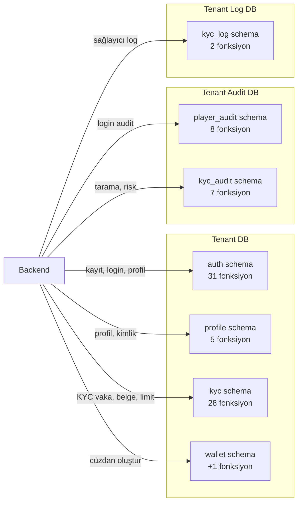
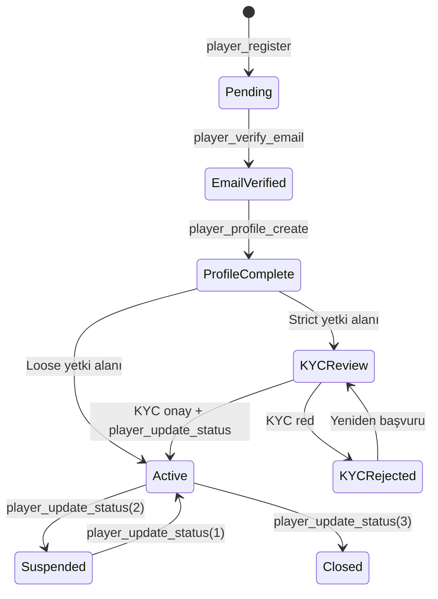
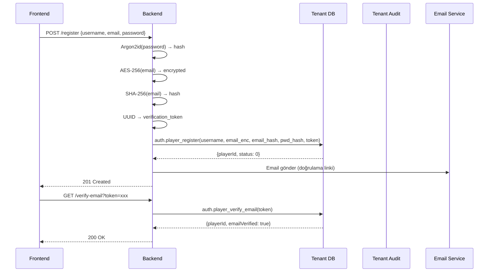
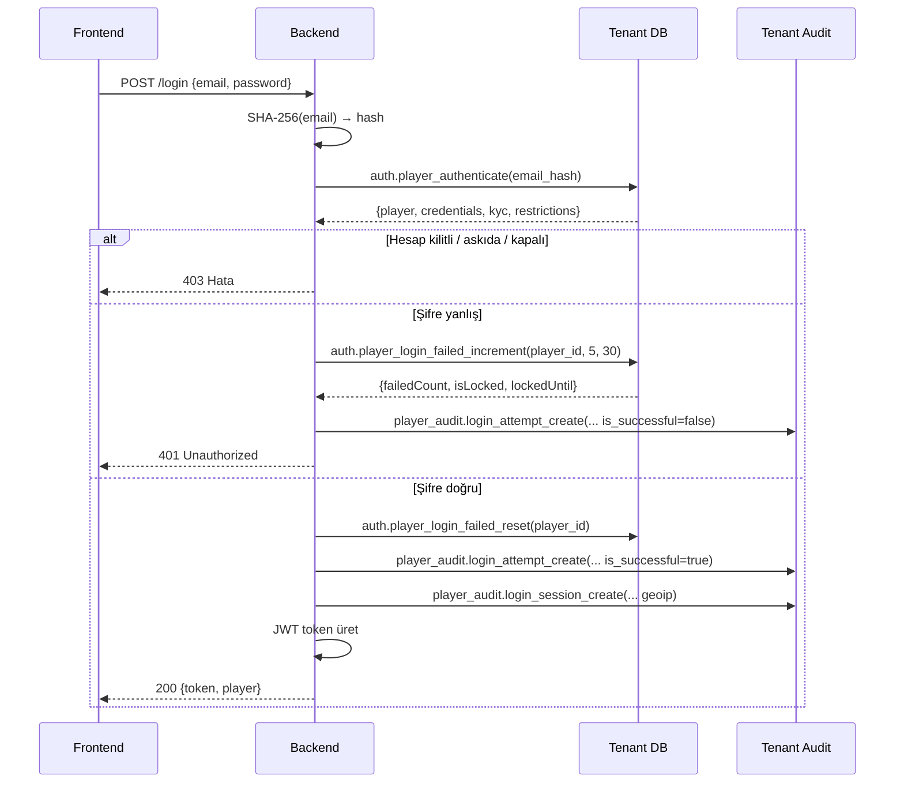
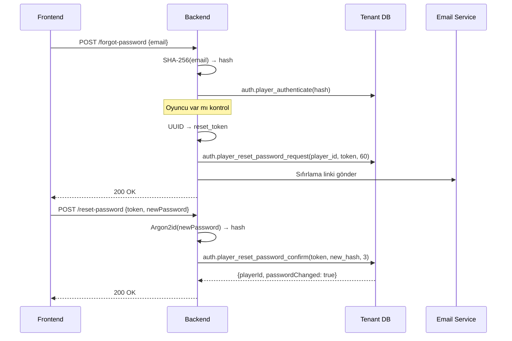
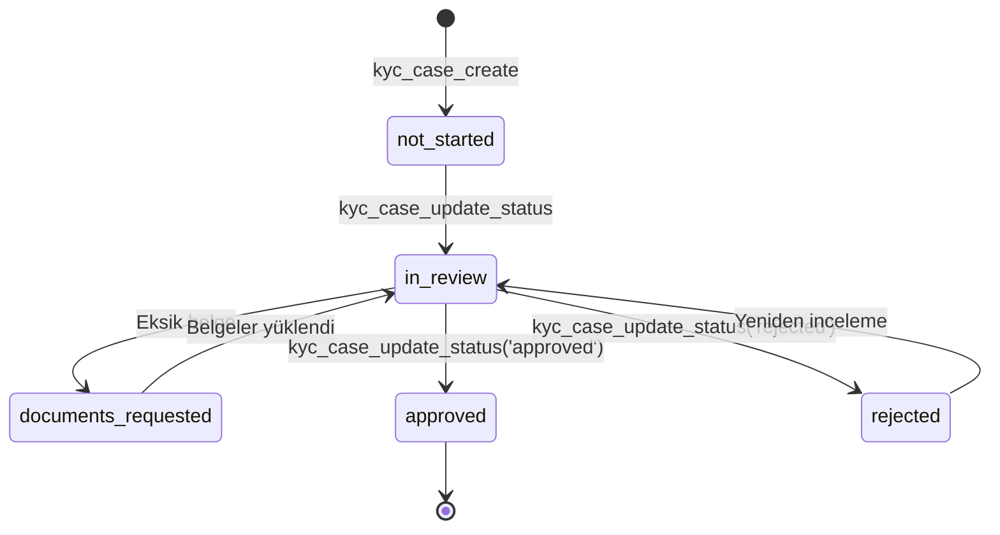
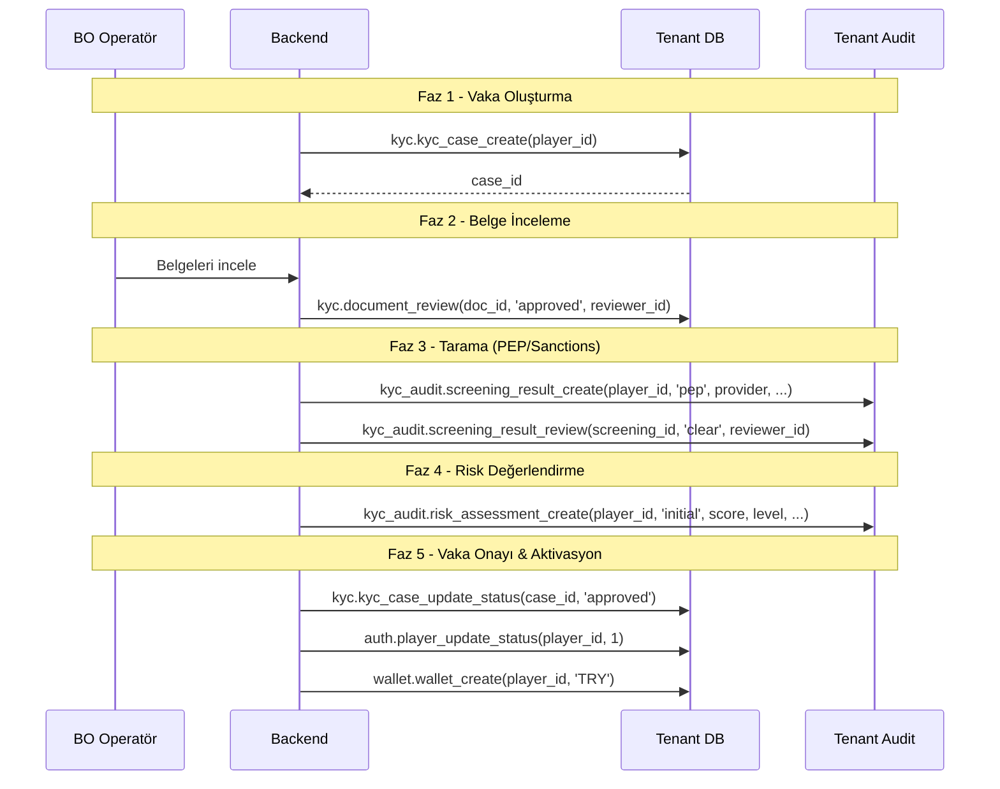
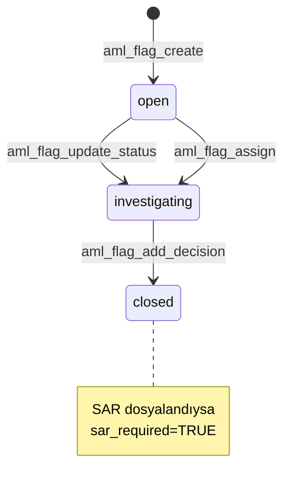

# Oyuncu Kimlik Doğrulama & KYC Rehberi

Oyuncu yaşam döngüsünün tamamını kapsayan geliştirici rehberi: kayıt → e-posta doğrulama → profil → KYC → aktivasyon → cüzdan oluşturma.

> **Tasarım dokümanları:**
> - [PLAYER_AUTH_REGISTRATION.md](../../.planning/PLAYER_AUTH_REGISTRATION.md) — Kayıt, doğrulama, profil (18 fonksiyon)
> - [KYC_OPERATIONS.md](../../.planning/KYC_OPERATIONS.md) — KYC operasyonları (37 fonksiyon)
> - [FUNCTIONS_TENANT.md](../reference/FUNCTIONS_TENANT.md) — Fonksiyon referansı

---

## 1. Büyük Resim

### Veritabanı Dağılımı



### Fonksiyon Dağılımı

| DB | Schema | Fonksiyon | Açıklama |
|----|--------|-----------|----------|
| tenant | auth | 12 (yeni) | Kayıt, doğrulama, login, şifre, BO yönetimi |
| tenant | profile | 5 (yeni) | Profil CRUD, kimlik belgesi |
| tenant | kyc | 28 (yeni) | Vaka, belge, kısıtlama, limit, AML, yetki alanı |
| tenant | wallet | 1 (yeni) | Cüzdan oluşturma |
| tenant_audit | kyc_audit | 7 (yeni) | PEP/Sanctions tarama, risk değerlendirme |
| tenant_log | kyc_log | 2 (yeni) | KYC sağlayıcı API logları |
| **Toplam** | | **55** | |

### Temel Prensipler

- **Auth-agnostic:** Tüm DB fonksiyonları yetkilendirme kontrolü yapmaz. Backend, Core DB'den `user_assert_access_tenant()` ile yetki doğrular, sonra tenant fonksiyonunu çağırır.
- **Şifreleme uygulama katmanında:** DB'ye yalnızca hash/şifreli veri gelir. Argon2id (şifre), AES-256 (PII), SHA-256 (arama hash'i) backend tarafından yapılır.
- **Cross-DB orchestration:** Backend ayrı bağlantılar üzerinden birden fazla DB'yi koordine eder. DB'ler arası doğrudan sorgu yapılmaz.

---

## 2. Oyuncu Yaşam Döngüsü

### Durum Akışı



### Player Status Kodları

| Kod | Durum | Açıklama |
|-----|-------|----------|
| 0 | Pending | Kayıt yapılmış, henüz aktif değil |
| 1 | Active | Tam erişim |
| 2 | Suspended | Geçici askıya alınmış (BO kararı) |
| 3 | Closed | Kalıcı kapatılmış |

### Backend Lifecycle State'leri

Backend, DB'den gelen verilere bakarak oyuncunun hangi aşamada olduğunu hesaplar:

| State | Koşul | Açıklama |
|-------|-------|----------|
| `email_verification_pending` | `email_verified = false` | E-posta doğrulama bekliyor |
| `profile_incomplete` | Doğrulanmış ama profil yok | Profil tamamlanmalı |
| `kyc_required` | Strict yetki alanı, KYC yok | KYC başvurusu gerekli |
| `kyc_in_review` | KYC vakası inceleniyor | Operatör incelemesi bekliyor |
| `kyc_rejected` | KYC reddedildi | Yeniden başvuru gerekli |
| `active_kyc_pending` | `status=1`, loose yetki alanı | Oynayabilir ama çekim yapamaz |
| `active` | `status=1`, KYC onaylı | Tam erişim |

### İki Aktivasyon Modeli

```mermaid
flowchart TD
    subgraph strict["Strict Yetki Alanı (UK, DE)"]
        S1[Kayıt] --> S2[E-posta Doğrula]
        S2 --> S3[Profil Tamamla]
        S3 --> S4[KYC Başvurusu]
        S4 --> S5[Operatör Onayı]
        S5 --> S6[Aktif - Oyna]
    end

    subgraph loose["Loose Yetki Alanı (Curacao)"]
        L1[Kayıt] --> L2[E-posta Doğrula]
        L2 --> L3[Profil Tamamla]
        L3 --> L4[Aktif - Oyna]
        L4 -.->|"Çekim talep edince"| L5[KYC Talep Et]
        L5 --> L6[KYC Onay → Çekim]
    end
```



---

## 3. Kayıt & Kimlik Doğrulama Akışı

### Kayıt Sequence



### Kayıt Fonksiyonları

| Fonksiyon | Parametreler | Dönüş | Açıklama |
|-----------|-------------|-------|----------|
| `auth.player_register` | username, email_encrypted, email_hash, password_hash, verification_token, token_expires_minutes(=1440), country_code, language | JSONB | Yeni oyuncu oluşturur (status=0) |
| `auth.player_verify_email` | token (UUID) | JSONB | Token ile e-postayı doğrular |
| `auth.player_resend_verification` | player_id, new_token, token_expires_minutes(=1440) | VOID | Mevcut tokenları siler, yeni token oluşturur |

### Login Sequence



### Login Fonksiyonları

| Fonksiyon | Parametreler | Dönüş | Açıklama |
|-----------|-------------|-------|----------|
| `auth.player_authenticate` | email_hash (BYTEA) | JSONB (STABLE) | Oyuncu + credentials + KYC + restrictions döner |
| `auth.player_login_failed_increment` | player_id, lock_threshold(=5), lock_duration_minutes(=30) | JSONB | Sayacı artırır, eşik aşılınca kilitler |
| `auth.player_login_failed_reset` | player_id | VOID | Sayacı sıfırlar, last_login_at günceller |

### Token Pattern

| Token Tipi | Tablo | TTL | Kullanım |
|------------|-------|-----|----------|
| Email doğrulama | `auth.email_verification_tokens` | 24 saat (1440 dk) | Tek kullanımlık, `used_at` ile izlenir |
| Şifre sıfırlama | `auth.password_reset_tokens` | 60 dakika | Tek kullanımlık, `used_at` ile izlenir |

Her iki tablo da aynı yapıda: `id, player_id, token (UUID UNIQUE), expires_at, used_at, created_at`. Yeni token oluşturulduğunda eski kullanılmamış tokenlar silinir.

---

## 4. Şifre Yönetimi

### Şifre Değiştirme

```
Backend: Mevcut şifreyi Argon2id ile doğrula
Backend: Yeni şifreyi Argon2id ile hashle
Backend → DB: auth.player_change_password(player_id, new_hash, history_count=3)
DB: Eski hash'i password_history'ye kaydet
DB: Yeni hash'i players.password'e yaz
DB: history_count'tan fazla kayıt varsa eski olanları sil
```

### Şifre Sıfırlama



### Şifre Fonksiyonları

| Fonksiyon | Parametreler | Dönüş | Açıklama |
|-----------|-------------|-------|----------|
| `auth.player_change_password` | player_id, new_password_hash, history_count(=3) | VOID | Eski hash'i saklar, yeniyi yazar |
| `auth.player_reset_password_request` | player_id, token (UUID), expires_minutes(=60) | VOID | Mevcut tokenları siler, yeni oluşturur |
| `auth.player_reset_password_confirm` | token (UUID), new_password_hash, history_count(=3) | JSONB | Token doğrular, şifreyi değiştirir |

---

## 5. Profil & Kimlik Belgesi

### Şifreleme Stratejisi

| Alan | Depolama | Arama | Açıklama |
|------|----------|-------|----------|
| email | BYTEA (AES-256) + BYTEA (SHA-256) | Hash ile tam eşleşme | GDPR/KVKK zorunlu |
| first_name, last_name | BYTEA (AES-256) + BYTEA (SHA-256) | Hash ile tam eşleşme | PII koruma |
| phone, gsm | BYTEA (AES-256) + BYTEA (SHA-256) | Hash ile tam eşleşme | PII koruma |
| address | BYTEA (AES-256) | Aranamaz | Yalnızca görüntüleme |
| identity_no | BYTEA (AES-256) + BYTEA (SHA-256) | Hash ile tam eşleşme | Kimlik numarası |
| birth_date | DATE (düz metin) | Aralık sorgusu | Yaş kontrolü, filtreleme |
| country_code, city, gender | Düz metin | Doğrudan sorgu | Düşük hassasiyet |
| username | VARCHAR (düz metin) | ILIKE | Herkese açık |

### Profil Akışı

```
1. player_profile_create(player_id, first_name, first_name_hash, ...)
   → Tek profil oluşturur (zaten varsa hata verir)

2. player_profile_get(player_id) [STABLE]
   → BYTEA alanları base64 olarak döner (backend AES-256 ile çözer)

3. player_profile_update(player_id, first_name, ...)
   → COALESCE ile kısmi güncelleme (sadece gönderilen alanlar değişir)
```

### Kimlik Belgesi Akışı

```
1. player_identity_upsert(player_id, identity_no_enc, identity_no_hash)
   → Yoksa oluştur, varsa güncelle + identity_confirmed=FALSE sıfırla

2. player_identity_get(player_id) [STABLE]
   → Bulunamazsa NULL döner (hata değil — henüz kimlik yüklenmemiş olabilir)
```

### Profil Fonksiyonları

| Fonksiyon | Parametreler | Dönüş | Açıklama |
|-----------|-------------|-------|----------|
| `profile.player_profile_create` | player_id, first_name, first_name_hash, middle_name, last_name, last_name_hash, birth_date, address, phone, phone_hash, gsm, gsm_hash, country_code, city, gender | BIGINT | Profil oluştur |
| `profile.player_profile_get` | player_id | JSONB (STABLE) | Profil getir (BYTEA→base64) |
| `profile.player_profile_update` | player_id, first_name, ... (tümü opsiyonel) | VOID | Kısmi güncelleme |
| `profile.player_identity_upsert` | player_id, identity_no (BYTEA), identity_no_hash (BYTEA) | BIGINT | Kimlik oluştur/güncelle |
| `profile.player_identity_get` | player_id | JSONB (STABLE) | Kimlik getir (NULL olabilir) |

---

## 6. KYC İş Akışı

### KYC Vaka Yaşam Döngüsü



### BO Operatör İş Akışı



### Workflow Tarihçe Pattern

Her `kyc_case_update_status` ve `kyc_case_assign_reviewer` çağrısında `kyc.player_kyc_workflows` tablosuna otomatik bir tarihçe kaydı eklenir. Bu sayede vaka üzerindeki tüm durum değişiklikleri ve atamalar izlenebilir:

```
kyc_workflows: (case_id, action, previous_status, new_status, performed_by, reason, created_at)
```

### KYC Vaka Fonksiyonları

| Fonksiyon | Parametreler | Dönüş | Açıklama |
|-----------|-------------|-------|----------|
| `kyc.kyc_case_create` | player_id, initial_status(='not_started'), kyc_level(='basic') | BIGINT | Vaka oluştur |
| `kyc.kyc_case_update_status` | case_id, new_status, reason, performed_by | VOID | Durum güncelle + workflow kaydı |
| `kyc.kyc_case_assign_reviewer` | case_id, reviewer_id | VOID | İnceleyici ata + workflow kaydı |
| `kyc.kyc_case_get` | case_id | JSONB (STABLE) | Detay: belgeler + workflow tarihçesi |
| `kyc.kyc_case_list` | status, kyc_level, risk_level, reviewer_id, player_id, page, page_size | JSONB | Sayfalı filtrelemeli liste |

### Belge Fonksiyonları

| Fonksiyon | Parametreler | Dönüş | Açıklama |
|-----------|-------------|-------|----------|
| `kyc.document_upload` | player_id, kyc_case_id, document_type, file_name, mime_type, storage_type, file_data, storage_path, encryption_key_id, file_hash, file_size | BIGINT | Belge kaydı oluştur |
| `kyc.document_review` | document_id, new_status, rejection_reason, reviewed_by | VOID | Belge incele (onayla/reddet) |
| `kyc.document_get` | document_id | JSONB (STABLE) | Belge meta verisi (file_data hariç) |
| `kyc.document_list` | player_id, kyc_case_id, document_type, status | JSONB | Belge listesi |

---

## 7. Kısıtlama & Limit Yönetimi

### Kısıtlama Tipleri

| Tip | Açıklama | Etki |
|-----|----------|------|
| `deposit` | Para yatırma kısıtlaması | Yatırım işlemleri engellenir |
| `withdrawal` | Para çekme kısıtlaması | Çekim işlemleri engellenir |
| `login` | Giriş kısıtlaması | Hesaba giriş engellenir |
| `gameplay` | Oyun kısıtlaması | Oyun oturumları engellenir |
| `cooling_off` | Soğuma dönemi | Belirli süre tam kısıtlama |
| `self_exclusion` | Öz dışlama | Uzun süreli tam kısıtlama |

### Kısıtlama Fonksiyonları

| Fonksiyon | Parametreler | Dönüş | Açıklama |
|-----------|-------------|-------|----------|
| `kyc.restriction_create` | player_id, restriction_type, scope(='all'), starts_at, ends_at, reason, set_by(='admin'), can_be_revoked, min_duration_days | BIGINT | Kısıtlama oluştur |
| `kyc.restriction_revoke` | restriction_id, revoked_by, reason | VOID | Kısıtlamayı kaldır |
| `kyc.restriction_get` | restriction_id | JSONB (STABLE) | Kısıtlama detayı |
| `kyc.restriction_list` | player_id, status, restriction_type | JSONB | Kısıtlama listesi |

**Kaldırma kuralları:**
- `can_be_revoked = FALSE` → kaldırılamaz
- `min_duration_days` belirtildiyse → minimum süre dolmadan kaldırılamaz
- Kaldırıldığında `status = 'revoked'` olur

### Limit Yönetimi

#### Cooling Period Kuralları

| Senaryo | Etki | Açıklama |
|---------|------|----------|
| Oyuncu limit **azaltır** | Anında | Sorumlu oyun: anında koruma |
| Oyuncu limit **artırır** | 24 saat bekleme | `status = 'pending'`, `pending_activation_at` ayarlanır |
| Admin limit değiştirir | Anında | `set_by = 'admin'` ise bekleme yok |
| Scheduler çalışır | Bekleyenleri aktifleştirir | `kyc.limit_activate_pending()` → INT |

#### Limit Tipleri

| Tip | Periyot | Açıklama |
|-----|---------|----------|
| `deposit` | daily / weekly / monthly | Para yatırma limiti |
| `loss` | daily / weekly / monthly | Kayıp limiti |
| `wager` | daily / weekly / monthly | Bahis limiti |
| `session` | daily | Oturum süresi limiti |

### Limit Fonksiyonları

| Fonksiyon | Parametreler | Dönüş | Açıklama |
|-----------|-------------|-------|----------|
| `kyc.limit_set` | player_id, limit_type, limit_period, limit_value, currency_code, set_by(='player'), admin_user_id | BIGINT | Limit ata (cooling period uygulanır) |
| `kyc.limit_remove` | limit_id, performed_by, admin_user_id, reason | VOID | Limiti kaldır (soft delete) |
| `kyc.limit_activate_pending` | — | INT | Bekleyen limitleri aktifleştir (scheduler) |
| `kyc.limit_get` | player_id | JSONB (STABLE) | Aktif limitler |
| `kyc.limit_history_list` | player_id, entity_type, page, page_size | JSONB | Değişiklik tarihçesi |

---

## 8. AML & Compliance

### AML Flag Yaşam Döngüsü



### AML Flag Oluşturma Kaynakları

| Kaynak | Açıklama |
|--------|----------|
| `automated` | Kural motoru tarafından otomatik tespit |
| `manual` | Operatör tarafından manuel oluşturma |
| `external` | Harici kaynak (regülatör, ortak vb.) |

### SAR (Suspicious Activity Report) Akışı

```
1. aml_flag_create(player_id, flag_type, severity, description, detection_method, ...)
   → AML işareti oluşturulur (status='open')

2. aml_flag_assign(flag_id, assigned_to)
   → Soruşturmacı atanır

3. aml_flag_update_status(flag_id, 'investigating', investigated_by, notes)
   → Soruşturma başlar

4. aml_flag_add_decision(flag_id, decision, decision_by, reason, sar_required, sar_reference, actions_taken)
   → Karar verilir, flag otomatik olarak 'closed' durumuna geçer
   → sar_required=TRUE ise SAR bilgileri kaydedilir
```

### AML Fonksiyonları

| Fonksiyon | Parametreler | Dönüş | Açıklama |
|-----------|-------------|-------|----------|
| `kyc.aml_flag_create` | player_id, flag_type, severity, description, detection_method, rule_id, rule_name, related_transactions, evidence_data, threshold_amount, actual_amount, currency_code, period_start, period_end, transaction_count | BIGINT | AML işareti oluştur |
| `kyc.aml_flag_assign` | flag_id, assigned_to | VOID | Soruşturmacı ata |
| `kyc.aml_flag_update_status` | flag_id, new_status, investigated_by, notes | VOID | Durum güncelle |
| `kyc.aml_flag_add_decision` | flag_id, decision, decision_by, decision_reason, sar_required, sar_reference, actions_taken | VOID | Karar ekle + flag kapat |
| `kyc.aml_flag_get` | flag_id | JSONB (STABLE) | Tam detay |
| `kyc.aml_flag_list` | player_id, status, severity, flag_type, assigned_to, page, page_size | JSONB | Sayfalı liste |

### Tarama & Risk Değerlendirme (Tenant Audit DB)

| Fonksiyon | DB | Açıklama |
|-----------|-----|----------|
| `kyc_audit.screening_result_create` | tenant_audit | PEP/Sanctions tarama sonucu kaydet |
| `kyc_audit.screening_result_review` | tenant_audit | Tarama sonucunu incele |
| `kyc_audit.screening_result_get` | tenant_audit | Tarama detayı |
| `kyc_audit.screening_result_list` | tenant_audit | Sayfalı tarama listesi |
| `kyc_audit.risk_assessment_create` | tenant_audit | Risk değerlendirmesi oluştur (6 bileşen skor) |
| `kyc_audit.risk_assessment_get` | tenant_audit | Son risk değerlendirmesi |
| `kyc_audit.risk_assessment_list` | tenant_audit | Risk tarihçesi |

#### Risk Skoru Bileşenleri

| Bileşen | Açıklama |
|---------|----------|
| `country_risk_score` | Ülke risk skoru |
| `occupation_risk_score` | Meslek risk skoru |
| `pep_risk_score` | Siyasi nüfuz sahibi skoru |
| `transaction_risk_score` | İşlem pattern risk skoru |
| `sof_risk_score` | Kaynak fonları (Source of Funds) skoru |
| `behavioral_risk_score` | Davranış analizi skoru |

### KYC Sağlayıcı Logları (Tenant Log DB)

| Fonksiyon | DB | Açıklama |
|-----------|-----|----------|
| `kyc_log.provider_log_create` | tenant_log | API istek/yanıt logu |
| `kyc_log.provider_log_list` | tenant_log | Sayfalı log listesi |

---

## 9. Jurisdiction & GeoIP

### Yetki Alanı Akışı

```
1. Kayıt sırasında:
   jurisdiction_create(player_id, registration_country_code, registration_ip_country)
   → İlk yetki alanı kaydı oluşturulur

2. KYC doğrulama sonrası:
   jurisdiction_update(player_id, verified_country_code, jurisdiction_id, assigned_by='operator')
   → Doğrulanmış ülke ve yetki alanı ID'si atanır

3. Her giriş/işlemde:
   jurisdiction_update_geo(player_id, ip_address, ip_country, is_vpn)
   → GeoIP verileri güncellenir, VPN tespiti izlenir
```

### VPN Tespit Pattern

`jurisdiction_update_geo` her çağrıda:
- `last_ip_address`, `last_ip_country`, `last_geo_check_at` günceller
- `is_vpn = TRUE` ise `vpn_detected = TRUE`, `vpn_detection_count++`, `last_vpn_detection_at` günceller

### Jurisdiction Fonksiyonları

| Fonksiyon | Parametreler | Dönüş | Açıklama |
|-----------|-------------|-------|----------|
| `kyc.jurisdiction_create` | player_id, registration_country_code, registration_ip_country, declared_country_code, jurisdiction_id, assigned_by | BIGINT | Yetki alanı oluştur (UNIQUE per player) |
| `kyc.jurisdiction_update` | player_id, verified_country_code, jurisdiction_id, assigned_by, change_reason, geo_status, geo_block_reason, geo_reviewed_by | VOID | Yetki alanı güncelle |
| `kyc.jurisdiction_update_geo` | player_id, ip_address, ip_country, is_vpn | VOID | GeoIP güncelle (her login/işlem) |
| `kyc.jurisdiction_get` | player_id | JSONB (STABLE) | Yetki alanı detayı (NULL olabilir) |

---

## 10. Cüzdan Oluşturma

### Aktivasyon Sonrası Cüzdan

Oyuncu aktifleştirildiğinde (`status=1`) backend, oyuncunun varsayılan para birimiyle cüzdan oluşturur:

```
Backend: auth.player_update_status(player_id, 1)   → Aktifleştir
Backend: wallet.wallet_create(player_id, 'TRY', 1) → REAL + BONUS cüzdan
```

### Idempotent Pattern

`wallet_create` `ON CONFLICT (player_id, wallet_type, currency_code) DO NOTHING` kullanır. Aynı parametrelerle birden fazla çağrı güvenlidir:
- İlk çağrı: 2 cüzdan oluşturur (REAL + BONUS)
- Sonraki çağrılar: mevcut cüzdanları döner, yeni oluşturmaz

| Fonksiyon | Parametreler | Dönüş | Açıklama |
|-----------|-------------|-------|----------|
| `wallet.wallet_create` | player_id, currency_code, currency_type(=1) | JSONB | REAL + BONUS cüzdan oluştur (idempotent) |

---

## 11. BO Oyuncu Yönetimi

### Oyuncu Detay (player_get)

`auth.player_get` kapsamlı oyuncu bilgisi döner:

```json
{
  "id": 1, "username": "player1", "status": 1,
  "emailEncrypted": "base64...", "emailVerified": true,
  "profile": { "firstName": "base64...", "birthDate": "1990-01-15", ... },
  "identity": { "identityNo": "base64...", "identityConfirmed": true },
  "kyc": { "caseId": 1, "status": "approved", "level": "enhanced", "riskLevel": "low" },
  "classification": { "category": {...}, "groups": [...] },
  "wallets": [{ "walletId": 1, "walletType": "REAL", "balance": 1500.00, ... }],
  "restrictions": []
}
```

### Oyuncu Arama (player_list)

Hash-based arama pattern'ı: BO operatörü `john@example.com` araması yapmak isterse:

```
Backend: SHA-256("john@example.com") → email_hash
Backend → DB: auth.player_list(p_email_hash => email_hash)
```

Desteklenen filtreler: status, email_verified, username (ILIKE), email_hash, first_name_hash, last_name_hash, phone_hash, identity_no_hash, category_id, group_id, country_code, birth_date aralığı, kayıt tarihi aralığı.

### BO Fonksiyonları

| Fonksiyon | Parametreler | Dönüş | Açıklama |
|-----------|-------------|-------|----------|
| `auth.player_get` | player_id | JSONB (STABLE) | Kapsamlı oyuncu detay |
| `auth.player_list` | status, email_verified, search, email_hash, name hashes, category_id, group_id, country_code, date ranges, page, page_size | JSONB (STABLE) | Sayfalı filtrelemeli liste |
| `auth.player_update_status` | player_id, new_status (0-3), reason | VOID | Durum güncelle |

---

## 12. DB Yapısı

### Yeni Tablolar

| Tablo | DB | Açıklama |
|-------|-----|----------|
| `auth.email_verification_tokens` | tenant | E-posta doğrulama tokenları (UUID, TTL 24h) |
| `auth.password_reset_tokens` | tenant | Şifre sıfırlama tokenları (UUID, TTL 60m) |

### Modifiye Tablolar

| Tablo | Değişiklik |
|-------|-----------|
| `auth.players` | `status DEFAULT 1` → `DEFAULT 0`, +`email_verified BOOLEAN DEFAULT FALSE`, +`email_verified_at TIMESTAMPTZ` |
| `profile.player_profile` | `birth_date BYTEA` → `DATE` (şifrelenmeden düz metin olarak saklanır) |

### FK Constraints (tenant/constraints/auth.sql)

| FK | Kaynak → Hedef | Kural |
|----|---------------|-------|
| `fk_email_verification_tokens_player` | email_verification_tokens.player_id → players.id | ON DELETE CASCADE |
| `fk_password_reset_tokens_player` | password_reset_tokens.player_id → players.id | ON DELETE CASCADE |

### Indexes (tenant/indexes/auth.sql)

| Index | Tablo | Kolon | Not |
|-------|-------|-------|-----|
| `idx_players_email_verified` | players | email_verified | Partial: WHERE NOT email_verified |
| `idx_evt_token` | email_verification_tokens | token | UNIQUE |
| `idx_evt_player` | email_verification_tokens | player_id | |
| `idx_evt_expires` | email_verification_tokens | expires_at | Partial: WHERE used_at IS NULL |
| `idx_prt_token` | password_reset_tokens | token | UNIQUE |
| `idx_prt_player` | password_reset_tokens | player_id | |
| `idx_prt_expires` | password_reset_tokens | expires_at | Partial: WHERE used_at IS NULL |

---

## 13. Hata Kodları Referansı

### ERRCODE Anlamları

| Kod | Anlam | HTTP Karşılığı |
|-----|-------|----------------|
| P0400 | Geçersiz parametre / validasyon hatası | 400 Bad Request |
| P0401 | Kimlik doğrulama başarısız | 401 Unauthorized |
| P0403 | Erişim engellendi (askı/kapalı/aktif değil) | 403 Forbidden |
| P0404 | Kayıt bulunamadı | 404 Not Found |
| P0409 | Çakışma (zaten mevcut) | 409 Conflict |
| P0410 | Süresi dolmuş (token) | 410 Gone |
| P0423 | Hesap kilitli | 423 Locked |

### Domain Bazlı Hata Key'leri

| Domain | Prefix | Key Sayısı | Örnek |
|--------|--------|-----------|-------|
| Kayıt | `error.player-register.*` | 6 | `username-required`, `email-exists` |
| E-posta Doğrulama | `error.player-verify.*` | 6 | `token-expired`, `already-verified` |
| Login | `error.player-auth.*` | 7 | `account-locked`, `account-suspended` |
| Şifre | `error.player-password.*` | 7 | `token-expired`, `account-inactive` |
| Profil | `error.player-profile.*` | 4 | `already-exists`, `not-found` |
| Kimlik | `error.player-identity.*` | 3 | `identity-required` |
| Oyuncu BO | `error.player.*` | 4 | `invalid-status`, `status-unchanged` |
| Cüzdan | `error.wallet.*` | 3 | `player-not-active` |
| KYC Vaka | `error.kyc-case.*` | 7 | `status-unchanged`, `reviewer-required` |
| KYC Belge | `error.kyc-document.*` | 9 | `case-not-found`, `hash-required` |
| KYC Kısıtlama | `error.kyc-restriction.*` | 8 | `cannot-revoke`, `min-duration-not-met` |
| KYC Limit | `error.kyc-limit.*` | 7 | `not-active`, `value-required` |
| KYC AML | `error.kyc-aml.*` | 12 | `decision-by-required`, `assignee-required` |
| KYC Yetki Alanı | `error.kyc-jurisdiction.*` | 5 | `already-exists`, `country-required` |
| KYC Tarama | `error.kyc-screening.*` | 8 | `provider-required`, `decision-required` |
| KYC Risk | `error.kyc-risk.*` | 3 | `level-required`, `type-required` |
| KYC Log | `error.kyc-provider-log.*` | 3 | `case-required`, `provider-required` |
| **Toplam** | | **~97** | |

---

## 14. Dosya Haritası

### Yeni Tablolar

| Dosya | Açıklama |
|-------|----------|
| `tenant/tables/player_auth/email_verification_tokens.sql` | E-posta doğrulama tokenları |
| `tenant/tables/player_auth/password_reset_tokens.sql` | Şifre sıfırlama tokenları |

### Yeni Fonksiyonlar

| Dizin | Dosya Sayısı | Açıklama |
|-------|-------------|----------|
| `tenant/functions/frontend/auth/` | 9 | Kayıt, doğrulama, login, şifre |
| `tenant/functions/frontend/profile/` | 5 | Profil, kimlik belgesi |
| `tenant/functions/backoffice/auth/` | 3 | BO oyuncu yönetimi |
| `tenant/functions/backoffice/kyc/` | 28 | KYC operasyonları |
| `tenant/functions/gateway/wallet/` | 1 | Cüzdan oluşturma |
| `tenant_audit/functions/kyc_audit/` | 7 | Tarama, risk değerlendirme |
| `tenant_log/functions/kyc_log/` | 2 | Sağlayıcı API logları |

### Güncellenen Dosyalar

| Dosya | Değişiklik |
|-------|-----------|
| `tenant/tables/player_auth/players.sql` | +email_verified, status default 0 |
| `tenant/tables/player_profile/player_profile.sql` | birth_date BYTEA→DATE |
| `tenant/constraints/auth.sql` | +2 FK |
| `tenant/indexes/auth.sql` | +7 index |
| `deploy_tenant.sql` | +48 entry |
| `deploy_tenant_audit.sql` | +7 entry |
| `deploy_tenant_log.sql` | +2 entry |
| `core/data/localization_keys.sql` | +97 key |
| `core/data/localization_values_en.sql` | +97 EN çeviri |
| `core/data/localization_values_tr.sql` | +97 TR çeviri |

---

## 15. Özet

| Metrik | Değer |
|--------|-------|
| Toplam yeni fonksiyon | 55 |
| Yeni tablo | 2 |
| Modifiye tablo | 2 |
| Yeni FK constraint | 2 |
| Yeni index | 7 |
| Hata key | ~97 |
| Etkilenen DB | 3 (tenant, tenant_audit, tenant_log) |
| Etkilenen schema | 6 (auth, profile, kyc, wallet, kyc_audit, kyc_log) |
| Deploy script | 3 güncelleme |
| Localization | 3 dosya × 97 key |
