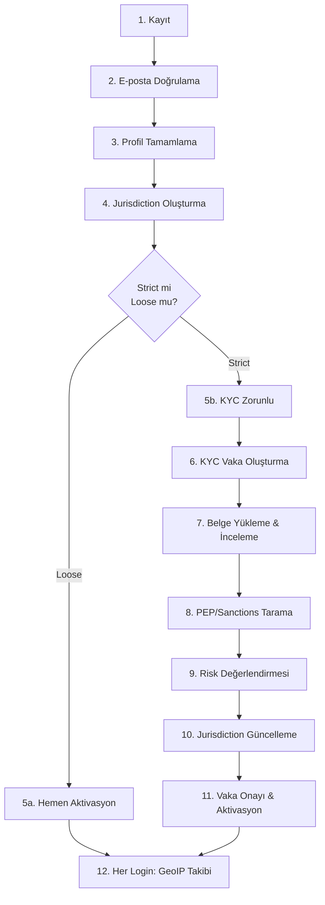
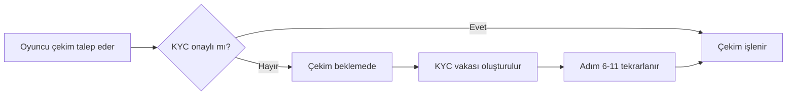

# Oyuncu Yaşam Döngüsü: Adım Adım Akış

Oyuncunun kayıt anından oyun oynamasına kadar tüm adımlar, hangi fonksiyonun kim tarafından çağrıldığı ve jurisdiction mekanizmasının detaylı açıklaması.

> **İlgili spesifikasyon:** [SPEC_PLAYER_AUTH_KYC.md](SPEC_PLAYER_AUTH_KYC.md)

---

## Genel Bakış

---

## Adım 1 — Kayıt

**Tetikleyen:** Oyuncu, kayıt formunu doldurur.

| Sıra | Yapan | İşlem |
|------|-------|-------|
| 1 | Backend | `Argon2id(şifre)` → password_hash |
| 2 | Backend | `AES-256(email)` → email_encrypted |
| 3 | Backend | `SHA-256(email)` → email_hash |
| 4 | Backend | `UUID` → verification_token |
| 5 | Backend → Client DB | `auth.player_register(username, email_enc, email_hash, pwd_hash, token, country_code, language)` |
| 6 | Client DB | `players` tablosuna yazar → **status=0** (Pending), **email_verified=false** |
| 7 | Backend → Email Service | Doğrulama linki gönderir |

**Sonuç:** Oyuncu oluştu ama hiçbir şey yapamaz. `status=0`.

---

## Adım 2 — E-posta Doğrulama

**Tetikleyen:** Oyuncu, e-postadaki doğrulama linkine tıklar.

| Sıra | Yapan | İşlem |
|------|-------|-------|
| 1 | Backend → Client DB | `auth.player_verify_email(token)` |
| 2 | Client DB | `email_verified=true`, `email_verified_at=now()` |

**Sonuç:** E-posta doğrulandı, hâlâ `status=0`.

**Hata senaryoları:**
- Token süresi dolmuş → `error.player-verify.token-expired` (P0410)
- Zaten doğrulanmış → `error.player-verify.already-verified` (P0409)
- Token bulunamadı → `error.player-verify.token-not-found` (P0404)

---

## Adım 3 — Profil Tamamlama

**Tetikleyen:** Oyuncu, kişisel bilgilerini girer (ad, soyad, doğum tarihi, adres, telefon).

| Sıra | Yapan | İşlem |
|------|-------|-------|
| 1 | Backend | Her PII alanı için: `AES-256(alan)` → encrypted, `SHA-256(alan)` → hash |
| 2 | Backend → Client DB | `profile.player_profile_create(player_id, first_name_enc, first_name_hash, ...)` |
| 3 | Client DB | `player_profile` tablosuna tek kayıt oluşturur (zaten varsa hata) |

**Sonuç:** Profil tamamlandı, hâlâ `status=0`. Yol burada ikiye ayrılıyor.

---

## Adım 4 — Jurisdiction Oluşturma

**Tetikleyen:** Backend, profil tamamlandıktan hemen sonra otomatik olarak çağırır.

| Sıra | Yapan | İşlem |
|------|-------|-------|
| 1 | Backend → Client DB | `kyc.jurisdiction_create(player_id, 'TR', 'TR')` |
| 2 | Client DB | `player_jurisdiction` tablosuna kayıt oluşturur (player başına UNIQUE) |

**Fonksiyon parametreleri:**

| Parametre | Örnek | Açıklama |
|-----------|-------|----------|
| `player_id` | 42 | Oyuncu ID |
| `registration_country_code` | `'TR'` | Oyuncunun formda seçtiği ülke |
| `registration_ip_country` | `'TR'` | GeoIP'den tespit edilen ülke |

**Oluşturulan kayıt:**

| Alan | Değer | Açıklama |
|------|-------|----------|
| `registration_country_code` | `'TR'` | Formdan gelen ülke |
| `registration_ip_country` | `'TR'` | IP'den tespit edilen ülke |
| `jurisdiction_id` | **NULL** | Henüz atanmadı — KYC sonrası operatör atayacak |
| `verified_country_code` | **NULL** | Henüz doğrulanmadı |
| `geo_status` | `'active'` | GeoIP takibi aktif |

> **Neden var?** Bu kayıt iki amaca hizmet eder:
> 1. **Aktivasyon modelini belirler:** Backend, `registration_country_code`'a bakarak client konfigürasyonuna göre strict/loose kararı verir
> 2. **GeoIP takibi için temel oluşturur:** Her login'de bu kayıt güncellenerek VPN tespiti ve ülke değişikliği izlenir

---

## Adım 5a — Loose Yetki Alanı Aktivasyonu (Curacao vb.)

**Koşul:** Client konfigürasyonunda oyuncunun ülkesi "loose" olarak tanımlı.

| Sıra | Yapan | İşlem |
|------|-------|-------|
| 1 | Backend | Jurisdiction kaydındaki ülke kodunu kontrol eder → loose |
| 2 | Backend → Client DB | `auth.player_update_status(player_id, 1)` → **Aktif!** |
| 3 | Backend → Client DB | `wallet.wallet_create(player_id, 'TRY', 1)` → REAL + BONUS cüzdan |

**Sonuç:** Oyuncu hemen oynayabilir! KYC ancak **çekim talep edince** istenir.

---

## Adım 5b — Strict Yetki Alanı (UK, DE vb.)

**Koşul:** Client konfigürasyonunda oyuncunun ülkesi "strict" olarak tanımlı.

| Sıra | Yapan | İşlem |
|------|-------|-------|
| 1 | Backend | Jurisdiction kaydındaki ülke kodunu kontrol eder → strict |
| 2 | Backend | Oyuncuyu KYC bekleme durumunda bırakır |

**Sonuç:** `status=0` kalır, oyuncu oynayamaz. BO operatör devreye girer.

---

## Adım 6 — KYC Vaka Oluşturma

**Tetikleyen:** Oyuncu KYC başvurusu yapar veya operatör manuel oluşturur.

| Sıra | Yapan | İşlem |
|------|-------|-------|
| 1 | Backend → Client DB | `kyc.kyc_case_create(player_id)` |
| 2 | Client DB | `player_kyc_cases` tablosuna kayıt → `status='not_started'` |
| 3 | Client DB | `player_kyc_workflows` tablosuna ilk tarihçe kaydı |

**Sonuç:** KYC vakası açıldı, `case_id` döner.

---

## Adım 7 — Belge Yükleme & İnceleme

**Tetikleyen:** Oyuncu kimlik/adres belgesi yükler, operatör inceler.

| Sıra | Yapan | İşlem |
|------|-------|-------|
| 1 | Oyuncu → Backend → Client DB | `kyc.document_upload(player_id, case_id, 'id_card', file_name, ...)` |
| 2 | Oyuncu → Backend → Client DB | `kyc.document_upload(player_id, case_id, 'proof_of_address', ...)` |
| 3 | BO Operatör → Backend → Client DB | `kyc.document_review(doc_id, 'approved', reviewer_id)` |

**Belge türleri:** `id_card`, `passport`, `driving_license`, `proof_of_address`, `utility_bill`, `bank_statement`

---

## Adım 8 — PEP/Sanctions Tarama

**Tetikleyen:** Operatör, harici tarama sağlayıcısını çalıştırır.

| Sıra | Yapan | İşlem |
|------|-------|-------|
| 1 | Backend → Client Audit DB | `kyc_audit.screening_result_create(player_id, 'pep', 'provider_x', ...)` |
| 2 | Backend → Client Audit DB | `kyc_audit.screening_result_create(player_id, 'sanctions', 'provider_x', ...)` |
| 3 | BO Operatör → Backend → Client Audit DB | `kyc_audit.screening_result_review(screening_id, 'clear', reviewer_id)` |

> **Farklı DB:** Tarama sonuçları `client_audit` DB'sinde saklanır, `client` DB'sinde değil. Cross-DB iletişim backend üzerinden yapılır.

---

## Adım 9 — Risk Değerlendirmesi

**Tetikleyen:** Tarama tamamlandıktan sonra operatör veya otomatik sistem.

| Sıra | Yapan | İşlem |
|------|-------|-------|
| 1 | Backend → Client Audit DB | `kyc_audit.risk_assessment_create(player_id, 'initial', score, level, ...)` |

**6 bileşen skor:**

| Bileşen | Açıklama |
|---------|----------|
| `country_risk_score` | Ülke risk skoru |
| `occupation_risk_score` | Meslek risk skoru |
| `pep_risk_score` | Siyasi nüfuz sahibi skoru |
| `transaction_risk_score` | İşlem pattern risk skoru |
| `sof_risk_score` | Kaynak fonları (Source of Funds) skoru |
| `behavioral_risk_score` | Davranış analizi skoru |

---

## Adım 10 — Jurisdiction Güncelleme

**Tetikleyen:** Operatör, KYC belgelerinden oyuncunun ülkesini doğruladı.

| Sıra | Yapan | İşlem |
|------|-------|-------|
| 1 | BO Operatör → Backend → Client DB | `kyc.jurisdiction_update(player_id, 'GB', 'uk_gc', 'operator')` |

**Güncellenen alanlar:**

| Alan | Önce | Sonra | Açıklama |
|------|------|-------|----------|
| `verified_country_code` | NULL | `'GB'` | KYC belgelerinden doğrulandı |
| `jurisdiction_id` | NULL | `'uk_gc'` | UK Gambling Commission atandı |
| `assigned_by` | NULL | `'operator'` | Kim tarafından atandığı |

> **Adım 4'te oluşturulan boş kabuk, şimdi tamamlandı.** Artık oyuncunun hangi regülatör altında olduğu kesinleşti.

---

## Adım 11 — Vaka Onayı & Aktivasyon

**Tetikleyen:** Tüm incelemeler tamamlandı, operatör onay verir.

| Sıra | Yapan | İşlem |
|------|-------|-------|
| 1 | BO Operatör → Backend → Client DB | `kyc.kyc_case_update_status(case_id, 'approved')` |
| 2 | Backend → Client DB | `auth.player_update_status(player_id, 1)` → **Aktif!** |
| 3 | Backend → Client DB | `wallet.wallet_create(player_id, 'GBP', 1)` → REAL + BONUS cüzdan |

**Sonuç:** Oyuncu artık tam erişime sahip — oyun oynayabilir, para yatırabilir, çekim yapabilir.

---

## Adım 12 — Her Login'de GeoIP Takibi (sürekli)

**Tetikleyen:** Her başarılı login ve kritik işlemlerde backend otomatik çağırır.

| Sıra | Yapan | İşlem |
|------|-------|-------|
| 1 | Backend → Client DB | `kyc.jurisdiction_update_geo(player_id, '1.2.3.4', 'GB', false)` |

**Güncellenen alanlar:**

| Alan | Açıklama |
|------|----------|
| `last_ip_address` | Son IP adresi |
| `last_ip_country` | Son IP ülkesi |
| `last_geo_check_at` | Son kontrol zamanı |
| `is_vpn = TRUE` ise | `vpn_detected = TRUE`, `vpn_detection_count++`, `last_vpn_detection_at` güncellenir |

---

## Jurisdiction Özet: 3 Aşama

| Aşama | Fonksiyon | Ne olur | Kim çağırır |
|-------|-----------|---------|-------------|
| Kayıt | `jurisdiction_create` | Boş kabuk: sadece kayıt ülkesi + IP ülkesi | Backend (otomatik) |
| KYC sonrası | `jurisdiction_update` | Doğrulanmış ülke + yetki alanı ID atanır | Operatör |
| Her login | `jurisdiction_update_geo` | IP/ülke/VPN bilgisi güncellenir | Backend (otomatik) |

> **Önemli:** `jurisdiction_create` tek başına bir "yetkilendirme" değildir — yalnızca **takip kaydını başlatır**. Asıl yetki alanı ataması (`jurisdiction_id`) KYC doğrulamasından sonra operatör tarafından yapılır.

---

## Loose Modelde KYC Tetiklenme Noktası

Loose modelde oyuncu KYC olmadan oynayabilir, ancak **çekim talep edince** KYC zorunlu hâle gelir:

> **Finance Gateway entegrasyonu:** Çekim sırasında `kyc.kyc_case_get` ile KYC durumu kontrol edilir. Detaylar için bkz. [SPEC_FINANCE_GATEWAY.md](SPEC_FINANCE_GATEWAY.md).
