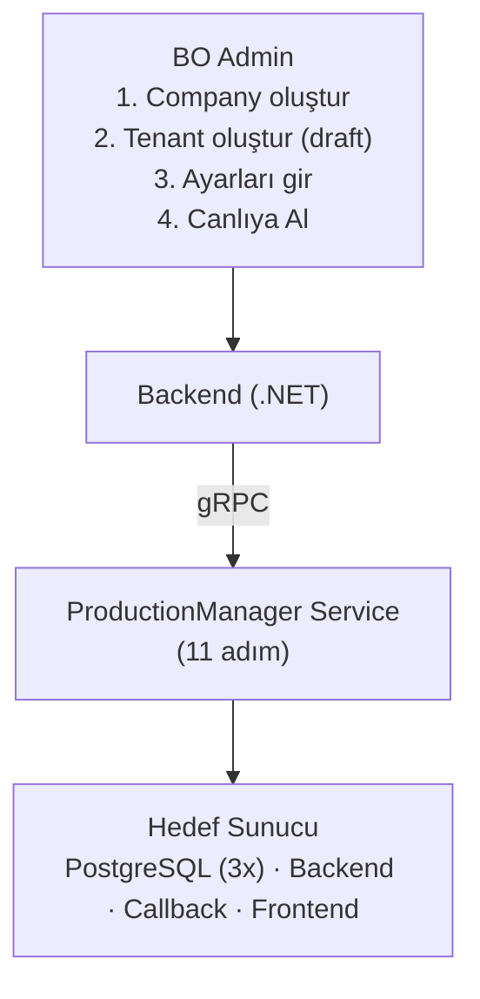
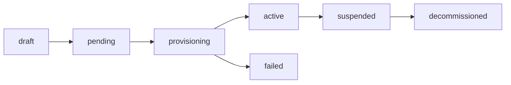
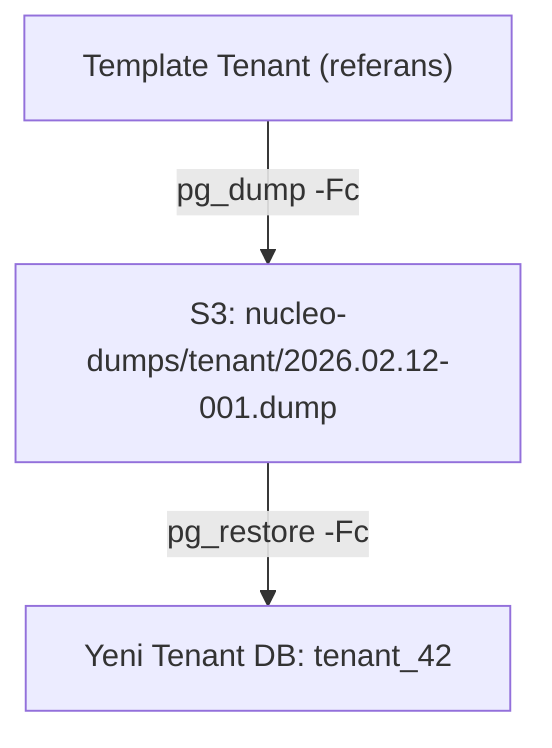
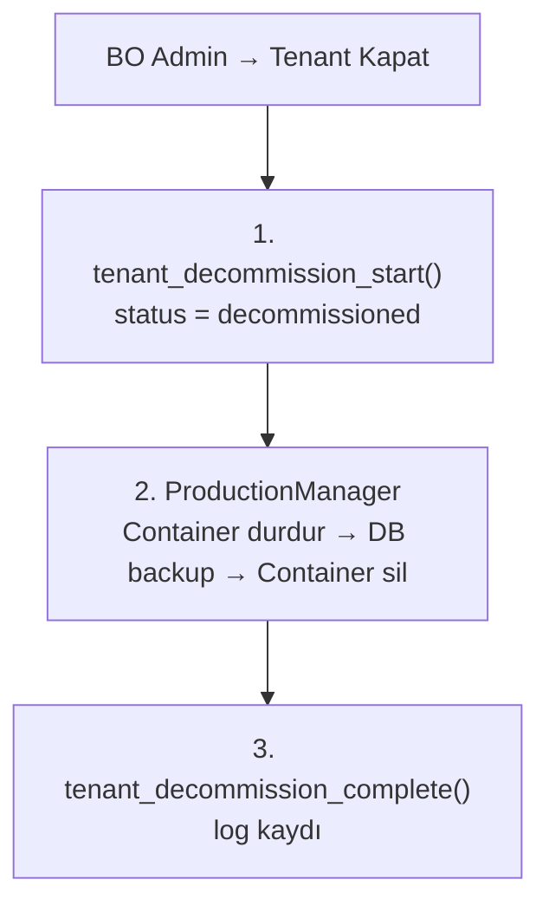

> **KULLANIM DIŞI:** Bu rehber artık güncel değildir.
> Fonksiyonel spesifikasyon için bkz. [SPEC_PLATFORM_OPERATIONS.md](SPEC_PLATFORM_OPERATIONS.md).
> Bu dosya yalnızca ek referans olarak korunmaktadır.

# Whitelabel Provisioning — Geliştirici Rehberi

Yeni whitelabel (tenant) açılışından canlıya alınmasına kadar tam provisioning yaşam döngüsü. **ProductionManager** gRPC servisi bu süreci orchestrate eder.

---

## Büyük Resim



---

## Tenant Yaşam Döngüsü



| Durum | Açıklama |
|-------|----------|
| `draft` | Tenant kaydı yapıldı, ayarlar giriliyor |
| `pending` | "Canlıya Al" tıklandı, kuyrukta bekliyor |
| `provisioning` | ProductionManager adımları çalıştırıyor |
| `active` | Tüm health check'ler geçti, tenant canlı |
| `failed` | Bir adımda hata oluştu (retry edilebilir) |
| `suspended` | Admin tarafından geçici kapatma |
| `decommissioned` | Kalıcı kapatma (login engellenir) |

**Not:** `user_authenticate` fonksiyonunda `provisioning_status != 'decommissioned'` filtresi var. Draft, pending ve provisioning durumundaki tenant'lara erişim açıktır.

---

## 11 Provisioning Adımı

| # | Adım | Açıklama | Retry |
|---|------|----------|-------|
| 1 | `VALIDATE` | Konfigürasyon kontrol, sunucu erişim testi | 3 |
| 2 | `DB_PROVISION` | PostgreSQL container oluştur (dedicated) veya user oluştur (shared) | 3 |
| 3 | `DB_CREATE` | 5 veritabanı oluştur | 3 |
| 4 | `DB_MIGRATE` | Template dump'tan `pg_restore` | 3 |
| 5 | `DB_SEED` | transaction_types, operation_types, ilk partition'lar | 3 |
| 6 | `WRITE_CONFIG` | DB connection string, secrets, routing | 3 |
| 7 | `BACKEND_DEPLOY` | Backend container deploy | 3 |
| 8 | `CALLBACK_DEPLOY` | Callback service container deploy | 3 |
| 9 | `FRONTEND_DEPLOY` | Nginx + Vue container deploy | 3 |
| 10 | `HEALTH_CHECK` | Tüm component'leri kontrol (`pg_isready` + HTTP `/health`) | 3 |
| 11 | `ACTIVATE` | `provisioning_status = 'active'`, `provisioned_at = NOW()` | 1 |

### Hata Durumunda

- Adım başarısız → `retry_count` artırılır, `max_retries`'a kadar tekrarlanır
- Max retry aşılırsa → `provisioning_status = 'failed'`, `provisioning_step = başarısız adım`
- Admin retry tetikleyebilir: `tenant_provision_update_step` ile kaldığı yerden devam

---

## Her Tenant İçin Oluşturulan DB'ler

| # | Veritabanı | Açıklama |
|---|-----------|----------|
| 1 | `tenant_{id}` | Ana iş verileri (oyuncu, cüzdan, işlem) |
| 2 | `tenant_audit_{id}` | Oyuncu login/oturum audit kayıtları |
| 3 | `tenant_log_{id}` | Operasyonel loglar (affiliate, KYC, mesajlaşma, game rounds) |
| 4 | `tenant_report_{id}` | Raporlama ve istatistikler |
| 5 | `tenant_affiliate_{id}` | Affiliate tracking ve komisyon |

---

## Hosting Modları

`core.tenants.hosting_mode` kolonu:

| Mod | Açıklama |
|-----|----------|
| `dedicated` | Tenant'a özel PostgreSQL container (yüksek trafik) |
| `shared` | Paylaşımlı PostgreSQL instance'da ayrı DB'ler (düşük trafik) |

---

## Template Dump Sistemi

Yeni tenant DB'leri sıfırdan `deploy_*.sql` çalıştırmak yerine **template dump'tan restore** edilir (çok daha hızlı).



### `core.template_dumps` Tablosu

Her 5 DB tipi için ayrı dump kaydı tutulur:

| Kolon | Açıklama |
|-------|----------|
| `db_type` | tenant, tenant_audit, tenant_log, tenant_report, tenant_affiliate |
| `version` | Versiyon etiketi: `2026.02.12-001` |
| `dump_path` | S3 konumu |
| `schema_hash` | Deploy script SHA256 (değişiklik tespiti) |
| `status` | active, deprecated, failed |

---

## Sunucu Yönetimi

### Infrastructure Sunucuları (`core.infrastructure_servers`)

Fiziksel/sanal sunucu envanteri. ProductionManager'ın hedef makineleri.

| Kolon | Açıklama |
|-------|----------|
| `server_name` | Sunucu adı |
| `server_type` | database, application, mixed |
| `region` | eu-west-1, tr-istanbul |
| `max_tenants` | Kapasite limiti |
| `current_tenant_count` | Mevcut tenant sayısı |
| `health_status` | healthy, unhealthy, maintenance |

### Tenant Sunucu Atamaları (`core.tenant_servers`)

Her tenant component'inin hangi sunucuda çalıştığını tanımlar.

| Kolon | Açıklama |
|-------|----------|
| `server_role` | db_primary, db_replica, db_failover, backend, callback, frontend |
| `container_id` | Docker container ID (provisioning sonrası yazılır) |
| `container_name` | ör: `nucleo_tenant_42_db_primary` |
| `container_image` | ör: `postgres:16`, `nucleo/tenant-backend:latest` |
| `status` | pending, creating, running, stopped, error, removed |
| `health_status` | healthy, unhealthy, unknown |
| `health_endpoint` | ör: `http://10.0.1.5:8080/health` |

---

## Health Check

ProductionManager her **60 saniyede** tüm tenant component'lerini kontrol eder:

| Component | Kontrol Yöntemi |
|-----------|----------------|
| DB Primary | `pg_isready -h host -p port` |
| DB Replica | `pg_isready` + replication lag kontrolü |
| Backend | `HTTP GET /health` → 200 OK |
| Callback | `HTTP GET /health` → 200 OK |
| Frontend | `HTTP GET /` → 200 OK |

Sonuç `core.tenant_servers.health_status` ve `last_health_at` kolonlarına yazılır.

---

## Provisioning Log

`core.tenant_provisioning_log` tablosu her adımı ayrıntılı takip eder:

```
provision_run_id: UUID (aynı denemenin tüm adımları)
step_name: VALIDATE, DB_PROVISION, ...
step_order: 1, 2, 3, ...
status: pending → running → completed/failed
duration_ms: adım süresi
error_message/error_detail: hata bilgisi
output: JSONB (adım-spesifik çıktılar)
retry_count: deneme sayısı
```

---

## Decommission (Tenant Kapatma)



**Decommission sonrası:**
- `user_authenticate` fonksiyonu bu tenant'ı filtreler → hiçbir kullanıcı login olamaz
- DB verileri backup'ta korunur (regülasyon gereği)
- Container kaynakları serbest kalır

---

## DB Yapısı Özeti

| Tablo | Şema | Açıklama |
|-------|------|----------|
| `tenants` | core | Tenant kaydı + provisioning durum/adım |
| `infrastructure_servers` | core | Fiziksel sunucu envanteri |
| `tenant_servers` | core | Tenant-sunucu atamaları + container bilgileri |
| `template_dumps` | core | Template DB dump versiyonları |
| `tenant_provisioning_log` | core | Adım adım provisioning takibi |

---

## Fonksiyon Listesi

### Provisioning Orchestration (4 fonksiyon)

| Fonksiyon | Açıklama |
|----------|----------|
| `tenant_provision_start` | Provisioning başlat (status → provisioning) |
| `tenant_provision_update_step` | Adım ilerlet/güncelle |
| `tenant_provision_complete` | Başarılı tamamla (status → active) |
| `tenant_provision_fail` | Hata kaydet (status → failed) |

### Decommission (3 fonksiyon)

| Fonksiyon | Açıklama |
|----------|----------|
| `tenant_decommission_start` | Kapatma başlat (status → decommissioned) |
| `tenant_decommission_complete` | Kapatma tamamla + log |
| `tenant_provision_history_list` | Provisioning geçmişi listesi |

### Infrastructure (4 fonksiyon)

| Fonksiyon | Açıklama |
|----------|----------|
| `infrastructure_server_create` | Sunucu kaydı oluştur |
| `infrastructure_server_update` | Sunucu bilgisi güncelle |
| `infrastructure_server_get` | Sunucu detayı |
| `infrastructure_server_list` | Sunucu listesi + kapasite |

### Tenant Server (2 mevcut)

| Fonksiyon | Açıklama |
|----------|----------|
| `tenant_server_update` | Sunucu ataması güncelle |
| `tenant_server_list` | Tenant sunucu listesi |

> **Not:** `tenant_server_create`, `tenant_server_health_update` ve 3 template fonksiyonu henüz yazılmadı (ProductionManager bağımlılığı).

---

## ProductionManager gRPC API (Ayrı Repo)

```protobuf
service ProductionManager {
    rpc ProvisionTenant(ProvisionRequest) returns (ProvisionResponse);
    rpc RetryProvisionStep(RetryRequest) returns (StepResponse);
    rpc DeprovisionTenant(DeprovisionRequest) returns (DeprovisionResponse);
    rpc GetProvisioningStatus(StatusRequest) returns (StatusResponse);
    rpc CheckTenantHealth(HealthRequest) returns (HealthResponse);
    rpc CreateTemplateDump(DumpRequest) returns (DumpResponse);
}
```

Pattern: CryptoManager gRPC servisi ile aynı mimari (`C:\Projects\Git\CryptoManager`).

---

## Backend İçin Notlar

- **Tenant seeding backend üzerinden yapılır** — Core DB'de tenant kaydı + Tenant DB'lerde seed data ayrı connection'lar
- **DB_SEED adımı**: `transaction_types`, `operation_types` ve ilk partition'lar her yeni tenant'a eklenir
- **Config auto-populate**: Connection string'ler, API key'ler ve secret'lar otomatik oluşturulur
- **Domain yönetimi**: `core.tenants.domain` ve `subdomain` alanları DNS routing için kullanılır
- **Retry**: Her adım bağımsız retry edilebilir, kaldığı yerden devam eder

---

_İlgili dokümanlar: [PROVISIONING_ARCHITECTURE.md](../../.planning/PROVISIONING_ARCHITECTURE.md) · [FUNCTIONS_CORE.md](../reference/FUNCTIONS_CORE.md) · [DATABASE_ARCHITECTURE.md](../reference/DATABASE_ARCHITECTURE.md)_
