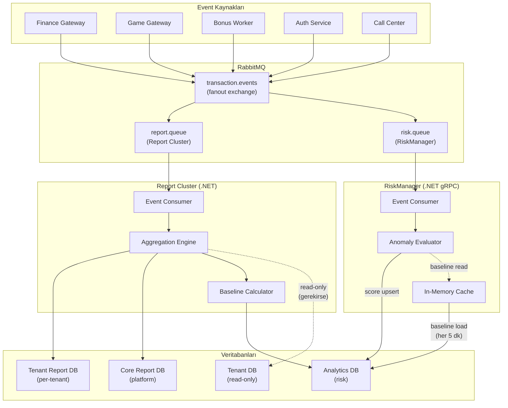
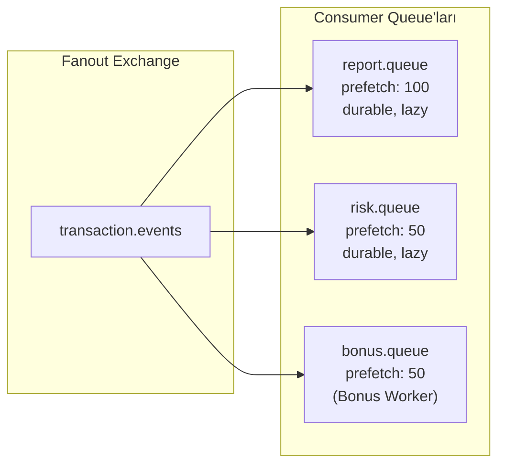
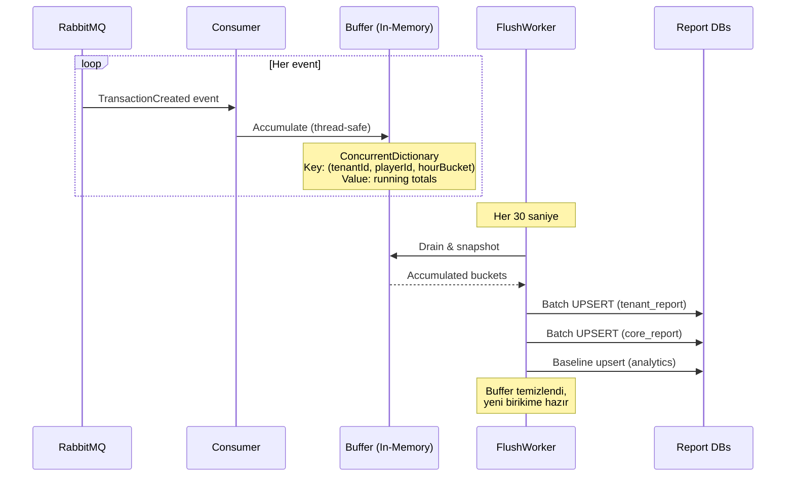
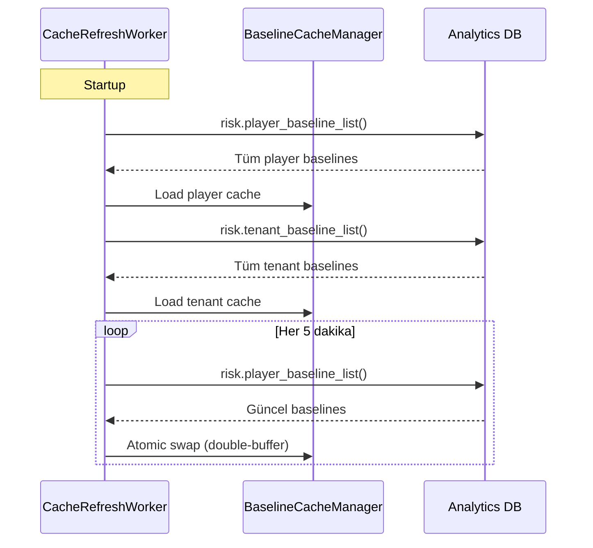
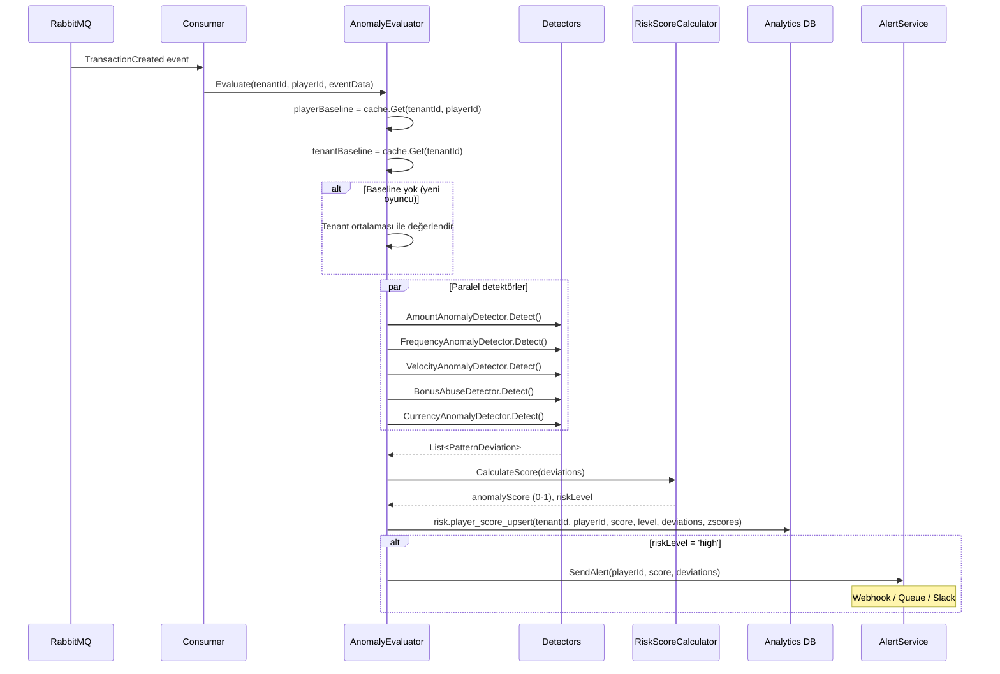
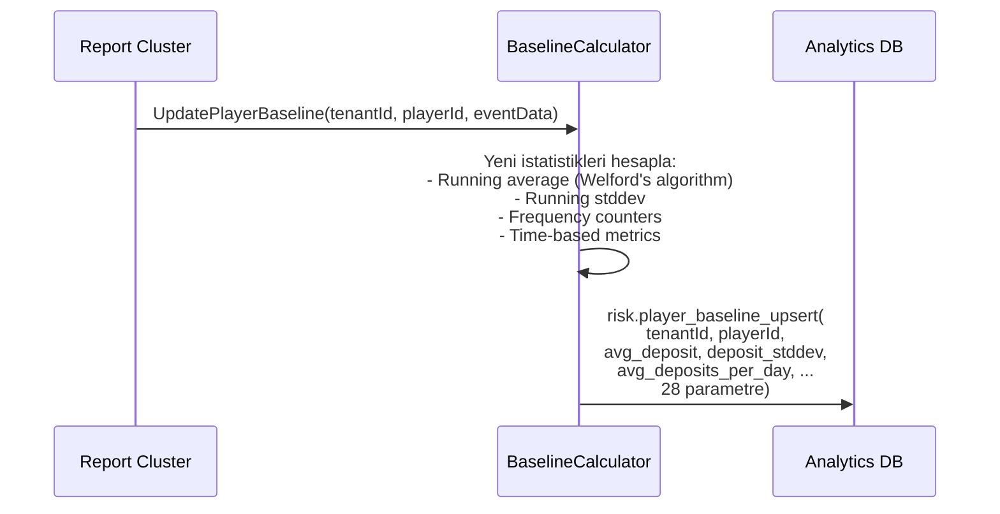

# Report Cluster & RiskManager — Backend Mimari Rehberi

Transaction insert sonrası RabbitMQ'ya bırakılan eventleri tüketen iki bağımsız servisin mimarisi: **Report Cluster** (raporlama agregasyonu) ve **RiskManager** (risk analizi). Her ikisi de aynı message bus'tan beslenir, farklı veritabanlarına yazar.

> İlgili dökümanlar: [SPEC_BONUS_ENGINE.md](SPEC_BONUS_ENGINE.md) · [SPEC_FINANCE_GATEWAY.md](SPEC_FINANCE_GATEWAY.md) · [SPEC_GAME_GATEWAY.md](SPEC_GAME_GATEWAY.md) · [BONUS_WORKER_BACKEND.md](BONUS_WORKER_BACKEND.md)
> Referans: [PARTITION_ARCHITECTURE.md](../reference/PARTITION_ARCHITECTURE.md) · [LOGSTRATEGY.md](../reference/LOGSTRATEGY.md)

---

## 1. Genel Mimari

İki servis aynı RabbitMQ exchange'inden bağımsız queue'lar ile consume eder. Birbirlerine bağımlılıkları yoktur.



### İki Servisin Sorumluluk Ayrımı

| | Report Cluster | RiskManager |
|--|--|--|
| **Girdi** | RabbitMQ: transaction events | RabbitMQ: transaction events |
| **Çıktı** | Tenant Report + Core Report + Analytics (baselines) | Analytics (scores) |
| **Yapısı** | .NET Worker Service | .NET gRPC + Worker Service |
| **İşlem** | Agregasyon (saatlik/günlük) | Gerçek zamanlı anomali tespiti |
| **DB yazma** | 3 DB (tenant_report, core_report, analytics) | 1 DB (analytics) |
| **DB okuma** | Tenant DB (read-only, gerekirse) | Analytics (baselines, cache) |
| **Ölçek** | Tenant başına bir worker instance | Platform geneli tek instance |

---

## 2. RabbitMQ Topolojisi

### Exchange & Queue Yapısı



**Fanout exchange:** Her event tüm bağlı queue'lara kopyalanır. Report Cluster ve RiskManager bağımsız consume eder.

### Event Tipleri

| Event | Publish Eden | İçerik | Report Cluster | RiskManager |
|-------|-------------|--------|:-:|:-:|
| `TransactionCreated` | Finance GW | deposit/withdraw TX detayları | **Evet** | **Evet** |
| `BetPlaced` | Game GW | bahis detayları (game, amount, round) | **Evet** | **Evet** |
| `BetSettled` | Game GW | sonuç (win/loss, payout) | **Evet** | **Evet** |
| `BonusAwarded` | Bonus Worker | bonus award detayları | **Evet** | **Evet** |
| `BonusCompleted` | Bonus Worker | bonus tamamlama (REAL transfer) | **Evet** | Hayır |
| `BonusCancelled` | Bonus Worker | bonus iptal | **Evet** | Hayır |
| `PlayerRegistered` | Auth Service | yeni kayıt | **Evet** | Hayır |
| `KycStatusChanged` | Auth Service | KYC durum değişikliği | Hayır | **Evet** |
| `LoginCompleted` | Auth Service | başarılı giriş | **Evet** | Hayır |
| `TicketCreated` | Call Center | destek talebi | **Evet** | Hayır |
| `TicketResolved` | Call Center | destek çözümü | **Evet** | Hayır |

### Event Payload Standart Formatı

```json
{
  "eventId": "uuid",
  "eventType": "TransactionCreated",
  "tenantId": 1001,
  "playerId": 50234,
  "timestamp": "2026-02-26T14:30:00.000Z",
  "data": {
    "transactionId": 982341,
    "transactionTypeId": 10,
    "amount": 500.00,
    "currency": "TRY",
    "walletType": "real",
    "paymentMethod": "papara",
    "balanceAfter": 1500.00
  },
  "metadata": {
    "correlationId": "uuid",
    "source": "finance-gateway",
    "version": "1.0"
  }
}
```

---

## 3. Report Cluster — Detaylı Mimari

### 3.1 Servis Yapısı

```
ReportCluster/
├── Program.cs
├── appsettings.json
│
├── Configuration/
│   ├── ReportClusterOptions.cs        # Flush interval, batch size, connection strings
│   └── TenantConnectionFactory.cs     # Tenant bazlı connection resolver
│
├── Consumers/                         # RabbitMQ consumer'ları
│   ├── TransactionEventConsumer.cs    # TransactionCreated handler
│   ├── GameEventConsumer.cs           # BetPlaced, BetSettled handler
│   ├── BonusEventConsumer.cs          # BonusAwarded/Completed/Cancelled handler
│   ├── PlayerEventConsumer.cs         # Registration, login handler
│   └── SupportEventConsumer.cs        # Ticket events handler
│
├── Aggregation/                       # Agregasyon motoru
│   ├── AggregationEngine.cs           # Ana orkestratör (in-memory buffer → flush)
│   ├── Buffers/
│   │   ├── SystemKpiBuffer.cs         # system_hourly_kpi accumulator
│   │   ├── PlayerStatsBuffer.cs       # player_hourly_stats accumulator
│   │   ├── TransactionStatsBuffer.cs  # transaction_hourly_stats accumulator
│   │   ├── GameStatsBuffer.cs         # game_hourly_stats accumulator
│   │   ├── GamePerformanceBuffer.cs   # game_performance_daily accumulator
│   │   ├── TicketStatsBuffer.cs       # ticket_daily_stats accumulator
│   │   ├── TenantKpiBuffer.cs         # tenant_daily_kpi accumulator (core_report)
│   │   ├── ProviderGlobalBuffer.cs    # provider_global_daily accumulator
│   │   ├── PaymentGlobalBuffer.cs     # payment_global_daily accumulator
│   │   └── TrafficBuffer.cs           # tenant_traffic_hourly accumulator
│   ├── Flushers/
│   │   ├── TenantReportFlusher.cs     # Buffer → tenant_report DB UPSERT
│   │   ├── CoreReportFlusher.cs       # Buffer → core_report DB UPSERT
│   │   └── FlushCoordinator.cs        # Zamanlanmış flush orkestrasyon
│   └── Models/
│       ├── HourlyBucket.cs            # Saatlik zaman dilimi key
│       └── DailyBucket.cs             # Günlük zaman dilimi key
│
├── Baseline/                          # Analytics DB baseline hesaplama
│   ├── BaselineCalculator.cs          # İstatistiksel hesaplama
│   ├── PlayerBaselineService.cs       # player_baseline_upsert() çağrısı
│   └── TenantBaselineService.cs       # tenant_baseline_upsert() çağrısı
│
├── Workers/                           # Background cron jobs
│   ├── FlushWorker.cs                 # Periyodik buffer flush (her 30 sn)
│   ├── DailyRollupWorker.cs           # Saatlik → günlük toplama (gece 01:00)
│   ├── MonthlyInvoiceWorker.cs        # Aylık fatura oluşturma (ayın 1'i)
│   ├── TenantBaselineWorker.cs        # Tenant baseline güncelleme (saatlik)
│   └── PartitionMaintenanceWorker.cs  # Partition oluşturma/temizlik (haftalık)
│
└── Infrastructure/
    ├── UpsertBuilder.cs               # Generic UPSERT SQL builder
    └── JsonbMerger.cs                 # JSONB alanları merge eden utility
```

### 3.2 Veritabanı Bağlantıları

| Bağlantı | DB | Erişim | Kullanım |
|-----------|-----|--------|----------|
| `TenantReportConnection` | Tenant Report DB | Read + Write | Saatlik/günlük raporlar |
| `CoreReportConnection` | Core Report DB | Read + Write | Platform KPI, fatura, trafik |
| `AnalyticsConnection` | Analytics DB | Write only | Baseline upsert |
| `TenantConnection` | Tenant DB | Read only | Gerekirse ek veri okuma |

### 3.3 In-Memory Buffer & Flush Akışı

Report Cluster her event'i doğrudan DB'ye yazmaz. Bunun yerine **in-memory buffer'larda biriktirir** ve periyodik olarak toplu UPSERT yapar.



**Neden buffer?**
- Transaction başına DB yazması = saniyede binlerce INSERT → performans problemi
- Buffer ile 30 saniyelik pencere → tek UPSERT ile yüzlerce satır → %99 daha az DB yükü
- JSONB alanları in-memory merge → DB'de `jsonb_set` döngüsü gereksiz

### 3.4 Buffer Key Yapısı

Her buffer tipi için benzersiz key:

| Buffer | Key | Açıklama |
|--------|-----|----------|
| SystemKpiBuffer | `(tenantId, currency, hourBucket)` | Tenant × para birimi × saat |
| PlayerStatsBuffer | `(tenantId, playerId, walletId, hourBucket)` | Oyuncu × cüzdan × saat |
| TransactionStatsBuffer | `(tenantId, playerId, walletId, hourBucket)` | Oyuncu × cüzdan × saat |
| GameStatsBuffer | `(tenantId, playerId, walletId, hourBucket)` | Oyuncu × cüzdan × saat |
| GamePerformanceBuffer | `(tenantId, gameId, providerId, currency, dateBucket)` | Oyun × provider × gün |
| TenantKpiBuffer | `(companyId, tenantId, currency, dateBucket)` | Tenant × para birimi × gün |
| ProviderGlobalBuffer | `(providerId, currency, dateBucket)` | Provider × para birimi × gün |
| PaymentGlobalBuffer | `(methodId, currency, dateBucket)` | Ödeme metodu × para birimi × gün |
| TrafficBuffer | `(companyId, tenantId, hourBucket)` | Tenant × saat |
| TicketStatsBuffer | `(tenantId, categoryId, channel, repId, dateBucket)` | Çok boyutlu × gün |

### 3.5 UPSERT Stratejisi

Tüm report tabloları `ON CONFLICT ... DO UPDATE` ile çalışır. Aynı zaman dilimi + key için:

```sql
-- Örnek: system_hourly_kpi UPSERT
INSERT INTO finance.system_hourly_kpi
    (period_hour, currency, unique_active_players, new_registrations,
     total_bet, total_win, total_deposits, total_withdrawals, total_bonuses)
VALUES ($1, $2, $3, $4, $5, $6, $7, $8, $9)
ON CONFLICT (currency, period_hour)
DO UPDATE SET
    unique_active_players = EXCLUDED.unique_active_players,
    new_registrations     = system_hourly_kpi.new_registrations + EXCLUDED.new_registrations,
    total_bet             = system_hourly_kpi.total_bet + EXCLUDED.total_bet,
    total_win             = system_hourly_kpi.total_win + EXCLUDED.total_win,
    total_deposits        = system_hourly_kpi.total_deposits + EXCLUDED.total_deposits,
    total_withdrawals     = system_hourly_kpi.total_withdrawals + EXCLUDED.total_withdrawals,
    total_bonuses         = system_hourly_kpi.total_bonuses + EXCLUDED.total_bonuses,
    updated_at            = NOW();
```

### 3.6 JSONB Merge Stratejisi

`player_hourly_stats.game_stats` gibi JSONB alanlar in-memory merge edilir:

```csharp
// Buffer'da biriktirme
var key = (tenantId, playerId, walletId, hourBucket);
var existing = _buffer.GetOrAdd(key, new PlayerStatsAccumulator());

// game_stats merge: {"sports": {"bet": 100, "win": 50, "count": 10}}
existing.GameStats.AddOrMerge(gameType, bet, win, count);

// Flush sırasında tüm JSONB tek seferde yazılır
// DB tarafında jsonb_set döngüsü yok → tek INSERT/UPDATE
```

### 3.7 Event → Tablo Eşleştirmesi

Hangi event hangi tabloları günceller:

| Event | Tenant Report Tabloları | Core Report Tabloları | Analytics |
|-------|------------------------|----------------------|-----------|
| `TransactionCreated` (deposit) | system_hourly_kpi, player_hourly_stats, transaction_hourly_stats | tenant_daily_kpi, payment_global_daily | player_baseline |
| `TransactionCreated` (withdraw) | system_hourly_kpi, player_hourly_stats, transaction_hourly_stats | tenant_daily_kpi, payment_global_daily | player_baseline |
| `BetPlaced` | system_hourly_kpi, player_hourly_stats, game_hourly_stats | tenant_daily_kpi, provider_global_daily | player_baseline |
| `BetSettled` | system_hourly_kpi, player_hourly_stats, game_hourly_stats, game_performance_daily | tenant_daily_kpi, provider_global_daily | player_baseline |
| `BonusAwarded` | system_hourly_kpi, player_hourly_stats | tenant_daily_kpi | player_baseline |
| `PlayerRegistered` | system_hourly_kpi | tenant_daily_kpi | — |
| `LoginCompleted` | — | tenant_traffic_hourly | — |
| `TicketCreated` | ticket_daily_stats | — | — |
| `TicketResolved` | ticket_daily_stats | — | — |

### 3.8 Unique Active Player (UAP) Sayımı

`unique_active_players` ve `active_player_count` alanları **HyperLogLog** veya **HashSet** ile hesaplanır:

```csharp
// In-memory: HyperLogLog approximate count
var uapTracker = new HyperLogLog<long>(precision: 14); // ~0.8% hata payı

// Her event'te
uapTracker.Add(playerId);

// Flush sırasında
int uniquePlayers = uapTracker.Count();
```

**Neden HyperLogLog?**
- Milyon oyunculu tenant'ta HashSet = GB RAM
- HyperLogLog = sabit 16KB, %0.8 hata payı ile yeterli doğruluk
- Saatlik pencere → yeni HyperLogLog instance

---

## 4. RiskManager — Detaylı Mimari

### 4.1 Servis Yapısı

```
RiskManager/
├── Program.cs
├── appsettings.json
│
├── Configuration/
│   ├── RiskManagerOptions.cs          # Eşik değerleri, cache interval
│   └── RiskModelConfig.cs             # Model parametreleri
│
├── Consumers/                         # RabbitMQ consumer'ları
│   └── TransactionEventConsumer.cs    # Transaction + bet + bonus events
│
├── Cache/                             # In-memory baseline cache
│   ├── BaselineCacheManager.cs        # Cache yöneticisi (load/refresh)
│   ├── PlayerBaselineCache.cs         # Dictionary<(tenantId, playerId), PlayerBaseline>
│   └── TenantBaselineCache.cs         # Dictionary<tenantId, TenantBaseline>
│
├── Evaluation/                        # Anomali tespit motoru
│   ├── AnomalyEvaluator.cs            # Ana değerlendirici
│   ├── Detectors/
│   │   ├── AmountAnomalyDetector.cs   # Tutar anomalisi (z-score)
│   │   ├── FrequencyAnomalyDetector.cs # Sıklık anomalisi
│   │   ├── VelocityAnomalyDetector.cs # Hız anomalisi (deposit→withdraw arası)
│   │   ├── BonusAbuseDetector.cs      # Bonus kötüye kullanım
│   │   ├── CurrencyAnomalyDetector.cs # Çoklu döviz anomalisi
│   │   └── PatternDetector.cs         # Genel kalıp sapması
│   ├── Models/
│   │   ├── EvaluationResult.cs        # Skor + risk level + deviations
│   │   └── ZScoreDetail.cs            # Metrik bazlı z-score
│   └── Scoring/
│       ├── RiskScoreCalculator.cs     # Ağırlıklı anomali skoru (0-1)
│       └── RiskLevelClassifier.cs     # Skor → low/medium/high
│
├── Services/
│   ├── RiskScoreService.cs            # player_score_upsert() çağrısı
│   └── AlertService.cs                # Yüksek risk → alert (webhook/queue)
│
├── Workers/
│   ├── CacheRefreshWorker.cs          # Baseline cache yenileme (5 dk)
│   └── ModelVersionWorker.cs          # Model versiyon yönetimi
│
└── Grpc/                              # gRPC API (Backoffice için)
    ├── RiskService.cs                 # GetPlayerRisk, ListHighRiskPlayers
    └── risk.proto                     # gRPC contract
```

### 4.2 Veritabanı Bağlantıları

| Bağlantı | DB | Erişim | Kullanım |
|-----------|-----|--------|----------|
| `AnalyticsConnection` | Analytics DB | Read + Write | Baseline read (cache), score write |

RiskManager sadece Analytics DB ile konuşur. Diğer DB'lere erişimi yoktur.

### 4.3 Cache Mekanizması

RiskManager tüm baseline'ları memory'de tutar. Her 5 dakikada yeniler.



**Double-buffer pattern:** Yeni cache hazır olana kadar eski cache kullanılır. Swap atomik (Interlocked.Exchange).

### 4.4 Anomali Değerlendirme Akışı



### 4.5 Z-Score Hesaplama

Her metrik için oyuncunun mevcut değeri, kendi baseline'ı ve tenant ortalaması ile karşılaştırılır:

```
Z-score = (mevcut_değer - ortalama) / standart_sapma
```

| Metrik | Baseline Alanı | Açıklama |
|--------|---------------|----------|
| Deposit tutarı | `avg_deposit`, `deposit_stddev` | Normalden yüksek deposit |
| Deposit sıklığı | `avg_deposits_per_day` | Günde çok fazla deposit |
| Deposit aralığı | `avg_deposit_interval_sec`, `deposit_interval_stddev` | Anormal kısa aralık |
| Deposit→withdraw hızı | `avg_deposit_to_withdraw_min` | Çok hızlı para çekme |
| Bonus/deposit oranı | `bonus_to_deposit_ratio` | Aşırı bonus kullanımı |
| Çevrim tamamlama | `avg_wagering_completion` | Anormal yüksek/düşük |
| Bonus iptal oranı | `bonus_forfeit_ratio` | Sürekli bonus iptal |
| Chargeback | `chargeback_count` | Chargeback geçmişi |
| Döviz sayısı | `currency_count` | Çoklu döviz kullanımı |

### 4.6 Risk Skoru Hesaplama

```csharp
// Ağırlıklı anomali skoru
public decimal CalculateScore(List<PatternDeviation> deviations)
{
    // Her detektörün ağırlığı
    var weights = new Dictionary<string, decimal>
    {
        ["amount_anomaly"]    = 0.25m,
        ["frequency_anomaly"] = 0.20m,
        ["velocity_anomaly"]  = 0.20m,
        ["bonus_abuse"]       = 0.15m,
        ["currency_anomaly"]  = 0.10m,
        ["pattern_deviation"] = 0.10m
    };

    decimal weightedSum = deviations
        .Sum(d => d.Severity * weights.GetValueOrDefault(d.Type, 0.1m));

    // Normalize to 0-1
    return Math.Min(1.0m, Math.Max(0.0m, weightedSum));
}
```

### 4.7 Risk Level Sınıflandırma

| Skor Aralığı | Risk Level | Aksiyon |
|---------------|-----------|---------|
| 0.00 – 0.39 | `low` | Pasif izleme |
| 0.40 – 0.69 | `medium` | Dashboard'da sarı flag |
| 0.70 – 1.00 | `high` | Alert + otomatik aksiyon tetikleme |

### 4.8 Pattern Deviations (JSONB)

```json
[
  {
    "type": "amount_anomaly",
    "metric": "deposit_amount",
    "current_value": 50000,
    "baseline_avg": 500,
    "baseline_stddev": 200,
    "zscore": 247.5,
    "severity": 1.0,
    "description": "Deposit amount 100x above baseline"
  },
  {
    "type": "velocity_anomaly",
    "metric": "deposit_to_withdraw_minutes",
    "current_value": 3,
    "baseline_avg": 1440,
    "zscore": 15.2,
    "severity": 0.85,
    "description": "Withdrawal 3 min after deposit (avg: 24h)"
  }
]
```

---

## 5. Report Cluster — Cron Jobs

| Worker | Zamanlama | Açıklama |
|--------|-----------|----------|
| `FlushWorker` | Her 30 saniye | In-memory buffer'ları DB'ye UPSERT |
| `DailyRollupWorker` | Her gün 01:00 | Saatlik verileri günlük tablolara topla (game_performance_daily, tenant_daily_kpi) |
| `MonthlyInvoiceWorker` | Ayın 1'i 03:00 | Önceki ayın verilerinden fatura oluştur (monthly_invoices) |
| `TenantBaselineWorker` | Saatlik | Tenant bazlı istatistik özeti → `tenant_baseline_upsert()` |
| `PartitionMaintenanceWorker` | Haftalık Pazartesi 03:00 | `create_partitions(3)` + `drop_expired_partitions()` |

### 5.1 DailyRollupWorker Detayı

Bazı tablolar (tenant_daily_kpi, game_performance_daily) günlük agregasyondur. Saatlik verilerden toplanır:

```sql
-- tenant_daily_kpi: Saatlik system_hourly_kpi'den günlük toplam
INSERT INTO core_report.finance.tenant_daily_kpi
    (report_date, company_id, tenant_id, currency,
     total_bet, total_win, total_deposits, total_withdrawals, total_bonuses,
     active_player_count, new_register_count, ftd_count)
SELECT
    p_date,
    t.company_id,
    t.tenant_id,
    s.currency,
    SUM(s.total_bet),
    SUM(s.total_win),
    SUM(s.total_deposits),
    SUM(s.total_withdrawals),
    SUM(s.total_bonuses),
    -- UAP: saatlik toplamların toplamı değil, günlük unique sayım gerekli
    -- Bu değer ayrı hesaplanır (HyperLogLog daily bucket)
    v_daily_uap,
    SUM(s.new_registrations),
    SUM(s.first_time_depositors)
FROM tenant_report.finance.system_hourly_kpi s
WHERE s.period_hour >= p_date AND s.period_hour < p_date + INTERVAL '1 day'
...
ON CONFLICT (tenant_id, report_date, currency)
DO UPDATE SET ...;
```

### 5.2 MonthlyInvoiceWorker Detayı

Aylık fatura oluşturma akışı:

```
1. Önceki ayın tenant_daily_kpi verilerini topla (GGR, bonus, deposit, withdraw)
2. Provider maliyetlerini hesapla (provider_global_daily × commission oranları)
3. Ödeme işlemci maliyetlerini hesapla (payment_global_daily × fee oranları)
4. Platform ücretini hesapla (sabit + GGR yüzdesi)
5. Net gelir = GGR - bonus - provider - payment - platform
6. monthly_invoices tablosuna INSERT (status = 0: Draft)
7. Finalize onayı → status = 1 (BO Admin tarafından)
```

---

## 6. Baseline Hesaplama (Report Cluster → Analytics)

### 6.1 Player Baseline Güncelleme

Her transaction event'inde Report Cluster, player baseline'ı günceller:



### 6.2 İstatistiksel Hesaplama Yöntemleri

| Metrik | Yöntem | Açıklama |
|--------|--------|----------|
| `avg_deposit` | Welford's online algorithm | Tüm geçmişi saklamadan running average |
| `deposit_stddev` | Welford's online algorithm | Running standard deviation |
| `avg_deposits_per_day` | Kayıt tarihi farkı | `deposit_count / account_age_days` |
| `avg_deposit_interval_sec` | Son N deposit arası ortalama | Sliding window (son 50 deposit) |
| `deposit_count_24h` | Rolling window | Son 24 saat sayaç (TTL-based) |
| `bonus_to_deposit_ratio` | Kümülatif | `total_bonus / total_deposit` |
| `avg_deposit_to_withdraw_min` | Event pair tracking | Deposit → ilk withdraw arası dakika |

### 6.3 Tenant Baseline Güncelleme

Saatlik cron ile tüm tenant'ların özet istatistiği:

```
1. Her tenant için: aktif oyuncuların baseline ortalamaları
2. tenant_baseline_upsert(tenantId, base_currency, avg_deposit, deposit_stddev, ...)
3. RiskManager yeni oyuncuları (baseline'ı olmayan) tenant ortalaması ile değerlendirir
```

---

## 7. Hata Yönetimi ve Dayanıklılık

### 7.1 Message Queue Garantileri

| Özellik | Ayar | Açıklama |
|---------|------|----------|
| Delivery | Manual ACK | Event başarıyla işlendikten sonra ACK |
| Retry | 3 retry + dead-letter | Başarısız event → DLQ'ya |
| Prefetch | Report: 100, Risk: 50 | Paralel işleme kapasitesi |
| Queue | Durable + Lazy | Restart'ta kayıp yok, disk-backed |

### 7.2 Buffer Dayanıklılık

| Senaryo | Davranış |
|---------|----------|
| Report Cluster crash | Buffer kaybı (30 sn pencere). RabbitMQ'da unacked mesajlar requeue olur. Yeniden işleme → UPSERT idempotent |
| DB bağlantı hatası | Buffer birikmeye devam eder. Retry ile flush. Bellek limiti aşılırsa → event'leri NACK et (backpressure) |
| Partition eksik | `_default` partition'a düşer. Monitoring alert → partition oluştur |

### 7.3 Idempotency

UPSERT pattern doğası gereği idempotent:
- Aynı event iki kez işlense bile `ON CONFLICT DO UPDATE` ile mevcut satır güncellenir
- Counter alanları (count, total) additive → çift sayım riski var
- **Çözüm:** Event `eventId` ile dedup kontrolü (in-memory LRU cache, 5 dk TTL)

```csharp
// Dedup kontrolü
private readonly LruCache<string, bool> _processedEvents = new(capacity: 100_000);

public bool ShouldProcess(string eventId)
{
    if (_processedEvents.ContainsKey(eventId)) return false;
    _processedEvents.Add(eventId, true);
    return true;
}
```

### 7.4 Backpressure

```
Buffer memory > threshold (512 MB)
  → Consumer.BasicNack(requeue: true)
  → RabbitMQ mesajları yeniden kuyruğa alır
  → Consumer geçici olarak durur
  → FlushWorker buffer'ı boşaltır
  → Consumer devam eder
```

---

## 8. Monitoring ve Observability

### 8.1 Report Cluster Metrikleri

| Metrik | Tip | Açıklama |
|--------|-----|----------|
| `report.events.consumed` | Counter | İşlenen event sayısı (label: event_type) |
| `report.events.processing_ms` | Histogram | Event işleme süresi |
| `report.buffer.size` | Gauge | Buffer'daki entry sayısı (label: buffer_type) |
| `report.buffer.memory_bytes` | Gauge | Buffer bellek kullanımı |
| `report.flush.duration_ms` | Histogram | Flush süresi (label: target_db) |
| `report.flush.rows_upserted` | Counter | UPSERT edilen satır sayısı |
| `report.baseline.upsert_count` | Counter | Baseline güncelleme sayısı |
| `report.dedup.hit_count` | Counter | Duplicate event sayısı |

### 8.2 RiskManager Metrikleri

| Metrik | Tip | Açıklama |
|--------|-----|----------|
| `risk.evaluations.total` | Counter | Değerlendirme sayısı (label: risk_level) |
| `risk.evaluations.duration_ms` | Histogram | Değerlendirme süresi |
| `risk.cache.size` | Gauge | Cache'teki baseline sayısı |
| `risk.cache.refresh_duration_ms` | Histogram | Cache yenileme süresi |
| `risk.alerts.sent` | Counter | Gönderilen alert sayısı |
| `risk.scores.high_risk_count` | Gauge | Toplam yüksek riskli oyuncu |

### 8.3 Alerting

| Alert | Koşul | Aksiyon |
|-------|-------|---------|
| Buffer overflow | memory > 512 MB | Flush hızlandır / ölçeklendir |
| Flush failure | 3 ardışık flush hatası | DB bağlantı kontrolü |
| Event lag | Queue depth > 50.000 | Consumer scale-out |
| High risk spike | Yeni high-risk > 10/saat | Güvenlik ekibine bildir |
| Partition missing | Default partition > 0 rows | Partition oluştur |
| Baseline stale | Güncelleme > 1 saat yok | Report Cluster sağlık kontrolü |

---

## 9. Konfigürasyon

```json
{
  "ReportCluster": {
    "FlushIntervalSeconds": 30,
    "MaxBufferMemoryMB": 512,
    "DedupCacheCapacity": 100000,
    "DedupCacheTtlMinutes": 5,
    "UapPrecision": 14,
    "BatchUpsertSize": 500,
    "RabbitMQ": {
      "Queue": "report.queue",
      "PrefetchCount": 100,
      "RetryCount": 3
    },
    "Schedules": {
      "DailyRollup": "0 1 * * *",
      "MonthlyInvoice": "0 3 1 * *",
      "TenantBaseline": "0 * * * *",
      "PartitionMaintenance": "0 3 * * MON"
    }
  },
  "RiskManager": {
    "CacheRefreshIntervalMinutes": 5,
    "RiskThresholds": {
      "Low": 0.0,
      "Medium": 0.40,
      "High": 0.70
    },
    "DetectorWeights": {
      "AmountAnomaly": 0.25,
      "FrequencyAnomaly": 0.20,
      "VelocityAnomaly": 0.20,
      "BonusAbuse": 0.15,
      "CurrencyAnomaly": 0.10,
      "PatternDeviation": 0.10
    },
    "RabbitMQ": {
      "Queue": "risk.queue",
      "PrefetchCount": 50,
      "RetryCount": 3
    },
    "Alerts": {
      "HighRiskWebhookUrl": "https://...",
      "HighRiskSpikeThreshold": 10,
      "HighRiskSpikeWindowMinutes": 60
    }
  }
}
```

---

## 10. Ölçeklendirme

### Report Cluster

| Strateji | Açıklama |
|----------|----------|
| **Tenant-based sharding** | Her Report Cluster instance belirli tenant grubunu işler |
| **Consumer group** | RabbitMQ consistent hashing exchange ile tenant bazlı routing |
| **Flush parallelism** | Tenant Report ve Core Report flush'ı paralel |
| **Read replica** | Tenant DB okumalarını read replica'ya yönlendir |

### RiskManager

| Strateji | Açıklama |
|----------|----------|
| **Tek instance** | Baseline cache tutarlılığı için tercih edilen |
| **Horizontal scale** | Cache sharding (tenant bazlı) ile mümkün |
| **gRPC load balancing** | Backoffice istekleri için L7 load balancer |

---

## 11. Uygulama Sırası (Önerilen)

| Faz | Kapsam | Bağımlılık |
|-----|--------|------------|
| **Faz 1** | Altyapı: RabbitMQ topoloji, connection factory, dedup cache | — |
| **Faz 2** | Report Cluster: buffer + flush mekanizması (system_hourly_kpi, player_hourly_stats) | Faz 1 |
| **Faz 3** | Report Cluster: tüm tenant_report tabloları (game, transaction, ticket) | Faz 2 |
| **Faz 4** | Report Cluster: core_report tabloları (tenant_daily_kpi, provider, payment) | Faz 2 |
| **Faz 5** | Report Cluster: baseline hesaplama → Analytics DB upsert | Faz 2 |
| **Faz 6** | RiskManager: cache mekanizması + baseline yükleme | Faz 5 |
| **Faz 7** | RiskManager: anomali detektörleri + skor hesaplama | Faz 6 |
| **Faz 8** | Report Cluster: DailyRollup + MonthlyInvoice cron jobs | Faz 4 |
| **Faz 9** | RiskManager: gRPC API + alert mekanizması | Faz 7 |
| **Faz 10** | Monitoring, alerting, backpressure, partition maintenance | Faz 1-9 |

---

## 12. Tablo Özeti

### Core Report DB (5 tablo, Monthly partition, sınırsız retention)

| Şema | Tablo | Granülarite | Key |
|------|-------|-------------|-----|
| finance | tenant_daily_kpi | Günlük | (tenant_id, report_date, currency) |
| billing | monthly_invoices | Aylık | (tenant_id, period_year, period_month, currency) |
| performance | tenant_traffic_hourly | Saatlik | (tenant_id, period_hour) |
| performance | provider_global_daily | Günlük | (provider_id, report_date, currency) |
| performance | payment_global_daily | Günlük | (method_id, report_date, currency) |

### Tenant Report DB (6 tablo, Monthly partition, sınırsız retention)

| Şema | Tablo | Granülarite | JSONB Strateji |
|------|-------|-------------|----------------|
| finance | system_hourly_kpi | Saatlik | — |
| finance | player_hourly_stats | Saatlik | game_stats, payment_stats |
| finance | transaction_hourly_stats | Saatlik | transaction_details |
| game | game_hourly_stats | Saatlik | game_details, provider_stats |
| game | game_performance_daily | Günlük | — |
| support_report | ticket_daily_stats | Günlük | — |

### Analytics DB (3 tablo, partition yok, sınırsız retention)

| Şema | Tablo | Yazan | Okuyan |
|------|-------|-------|--------|
| risk | risk_player_baselines | Report Cluster | RiskManager (cache) |
| risk | risk_tenant_baselines | Report Cluster | RiskManager (cache) |
| risk | risk_player_scores | RiskManager | Backoffice |

---

## 13. İlgili Dökümanlar

| Döküman | İçerik |
|---------|--------|
| [SPEC_BONUS_ENGINE.md](SPEC_BONUS_ENGINE.md) | Bonus event'leri ve transaction type'ları |
| [SPEC_FINANCE_GATEWAY.md](SPEC_FINANCE_GATEWAY.md) | Deposit/withdraw event akışları |
| [SPEC_GAME_GATEWAY.md](SPEC_GAME_GATEWAY.md) | Bet/win event akışları |
| [SPEC_CALL_CENTER.md](SPEC_CALL_CENTER.md) | Ticket event'leri |
| [BONUS_WORKER_BACKEND.md](BONUS_WORKER_BACKEND.md) | Bonus Worker backend mimarisi |
| [../reference/PARTITION_ARCHITECTURE.md](../reference/PARTITION_ARCHITECTURE.md) | Partition yönetimi |
| [../reference/LOGSTRATEGY.md](../reference/LOGSTRATEGY.md) | Log ve retention stratejisi |
