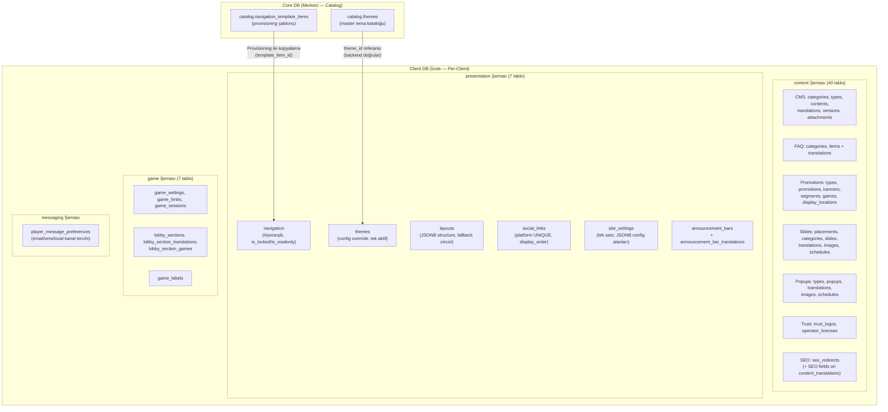
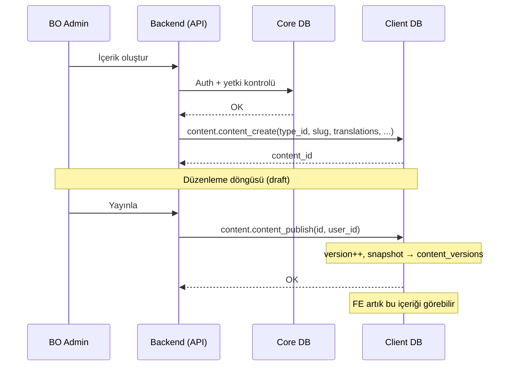
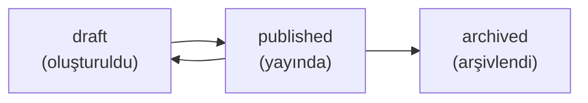
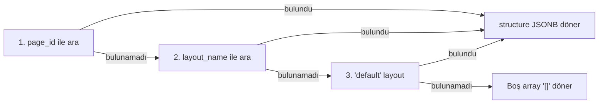

> **KULLANIM DIŞI:** Bu rehber artık güncel değildir.
> Fonksiyonel spesifikasyon için bkz. [SPEC_SITE_MANAGEMENT.md](SPEC_SITE_MANAGEMENT.md).
> Bu dosya yalnızca ek referans olarak korunmaktadır.

# Site Yönetimi — Geliştirici Rehberi

Client bazlı site içeriği ve arayüz yönetimi. Dört ana alan: **Content Management** (CMS, FAQ, Popup, Promosyon, Slide/Banner, Güven Elementleri, SEO), **Presentation** (Navigasyon, Tema, Layout, Sosyal Medya, Site Ayarları, Duyuru Çubukları), **Game Lobby** (Lobi Bölümleri, Oyun Etiketleri) ve **Mesaj Tercihleri**. Tüm veriler Client DB'de tutulur; yetki kontrolleri Core DB üzerinden yapılır.

> **⚠️ Kırıcı Değişiklik:** `security.company_password_policy_upsert` fonksiyonunun imzası değişti. Detaylar için bkz. [§15 Kırıcı Değişiklikler](#15-kırıcı-değişiklikler).

---

## 1. Mimari Genel Bakış

### 1.1 Modül Yapısı

| # | Modül | Şema | BO | FE | Toplam |
|---|-------|------|----|----|--------|
| 1 | **CMS İçerik** | `content` | 11 | 2 | 13 |
| 2 | **FAQ** | `content` | 5 | 2 | 7 |
| 3 | **Popup** | `content` | 8 | 1 | 9 |
| 4 | **Promosyon** | `content` | 8 | 2 | 10 |
| 5 | **Slide/Banner** | `content` | 10 | 1 | 11 |
| 6 | **Güven Logoları** | `content` | 4 | 1 | 5 |
| 7 | **Operatör Lisansları** | `content` | 4 | (6 ile ortak) | 4 |
| 8 | **SEO Yönlendirme** | `content` | 5 | — | 5 |
| 9 | **İçerik SEO Meta** | `content` | 3 | — | 3 |
| 10 | **Navigasyon** | `presentation` | 7 | 1 | 8 |
| 11 | **Tema** | `presentation` | 4 | 1 | 5 |
| 12 | **Layout** | `presentation` | 4 | 1 | 5 |
| 13 | **Sosyal Medya** | `presentation` | 4 | — | 4 |
| 14 | **Site Ayarları** | `presentation` | 3 | — | 3 |
| 15 | **Duyuru Çubukları** | `presentation` | 4 | 1 | 5 |
| 16 | **Lobi Bölümleri** | `game` | 8 | 1 | 9 |
| 17 | **Oyun Etiketleri** | `game` | 3 | (16 ile ortak) | 3 |
| 18 | **Mesaj Tercihleri** | `messaging` | 1 | 2 | 3 |
| | **Toplam** | | **96** | **16** | **112** |

### 1.2 Veritabanı Dağılımı



### 1.3 Backend Orchestration — İçerik Yaşam Döngüsü



---

## 2. Content Management (CMS)

### 2.1 İçerik Durumları



| Durum | Açıklama | FE'de Görünür? |
|-------|----------|----------------|
| `draft` | Yeni oluşturulmuş veya düzenleniyor | Hayır |
| `published` | Yayında, FE'de erişilebilir | Evet |
| `archived` | Arşivlenmiş, FE'de görünmez | Hayır |

### 2.2 Çeviri Deseni (Translation Pattern)

Tüm content modülleri aynı çeviri deseni kullanır:

1. **Ana kayıt** → dile bağımsız veriler (slug, status, dates, config)
2. **Translation tablosu** → her dil için ayrı satır (title, description, body)
3. **CREATE**: Ana kayıt INSERT → çeviriler foreach INSERT
4. **UPDATE**: Ana kayıt UPDATE → çeviriler DELETE + foreach INSERT (replace-all)

```sql
-- Çeviri JSONB format (tüm modüllerde aynı yapı)
p_translations := '[
    {"languageCode": "en", "title": "Hello", "body": "..."},
    {"languageCode": "tr", "title": "Merhaba", "body": "..."}
]'::JSONB;
```

> **Neden DELETE+INSERT?** Hangi dillerin eklendiğini/kaldırıldığını takip etmek karmaşık. Tümünü silip yeniden eklemek daha güvenilir ve atomik.

### 2.3 Versiyonlama (content_publish)

`content_publish` çağrıldığında:

1. `contents.version` bir artırılır
2. `contents.status` → `'published'`, `published_at` → `NOW()`
3. Her dildeki çeviri `content_versions` tablosuna snapshot olarak kopyalanır
4. Çevirilerin `status` alanı → `'published'`

```
contents (v3, published) ←── Güncel
content_versions (v1, en) ←── Geçmiş
content_versions (v2, en) ←── Geçmiş
content_versions (v3, en) ←── Son yayın
```

### 2.4 Slug Benzersizliği

Her `contents.slug` client içinde benzersizdir (UNIQUE INDEX). FE tarafında `public_content_get(p_slug)` ile SEO-friendly URL'ler desteklenir.

### 2.5 Backend Çağrı Örnekleri

```sql
-- Kategori oluştur
SELECT content.content_category_upsert(
    NULL,           -- p_id (NULL = create)
    'blog',         -- p_code
    TRUE,           -- p_is_active
    '[{"languageCode":"en","name":"Blog"},{"languageCode":"tr","name":"Blog"}]'::JSONB,
    1               -- p_user_id
);

-- İçerik oluştur
SELECT content.content_create(
    1,              -- p_content_type_id
    'hello-world',  -- p_slug
    NULL,           -- p_featured_image_url
    '[{"languageCode":"en","title":"Hello World","body":"<p>Content...</p>"}]'::JSONB,
    NULL,           -- p_attachments
    1               -- p_user_id
);

-- Yayınla
SELECT content.content_publish(1, 1);

-- FE: Slug ile getir
SELECT content.public_content_get('hello-world', 'en');
```

---

## 3. FAQ Modülü

### 3.1 Yapı

FAQ sistemi iki seviyeli: **Kategoriler** ve **Öğeler**. Her ikisinin de çeviri tabloları var.

| Fonksiyon | Özel Davranış |
|-----------|---------------|
| `faq_category_delete` | Aktif öğeleri (`is_active=TRUE`) varsa silinemez |
| `faq_category_list` | Her kategori ile birlikte aktif öğe sayısını döner |
| `faq_item_upsert` | `is_featured` ile öne çıkan öğeler |
| `public_faq_get` | Her çağrıda `view_count` otomatik artırılır |

### 3.2 FE Filtreleme

`public_faq_list` şu filtreleri destekler:

| Parametre | Tip | Açıklama |
|-----------|-----|----------|
| `p_category_code` | VARCHAR | Kategori kodu filtresi |
| `p_is_featured` | BOOLEAN | Sadece öne çıkanlar |
| `p_search_text` | TEXT | Başlık/içerik arama (ILIKE) |
| `p_language_code` | CHAR(2) | Dil kodu |
| `p_offset/p_limit` | INTEGER | Sayfalama |

---

## 4. Popup Modülü

### 4.1 Popup Tipi ve Yapılandırma

Popup'lar `popup_types` tablosundan tip alır. Tip varsayılan boyut, overlay ve kapatma davranışını tanımlar. Popup kaydı bu değerleri override edebilir.

### 4.2 Hedefleme Sistemi (Targeting)

Popup'lar çoklu hedefleme kriterleriyle filtrelenir:

| Kriter | Tablo Kolonu | Mantık |
|--------|-------------|--------|
| **Ülke** | `country_codes[]`, `excluded_country_codes[]` | Dahil/hariç listeleri |
| **Segment** | `segment_ids[]` | Array overlap (`&&`) |
| **Sayfa URL** | `page_urls[]` | Array `ANY` eşleşme |
| **Zamanlama** | `popup_schedules` | Gün + saat aralığı |
| **Tarih** | `start_date`, `end_date` | Yayın penceresi |

### 4.3 Zamanlama (Schedule) Deseni

Slide ve Popup modülleri aynı zamanlama deseni kullanır:

```sql
-- Gün bazlı kontrol (DOW: 0=Pazar, 6=Cumartesi)
CASE EXTRACT(DOW FROM NOW())
    WHEN 0 THEN sc.day_sunday
    WHEN 1 THEN sc.day_monday
    ...
END = TRUE
-- Saat aralığı kontrolü
AND (sc.start_time IS NULL OR NOW()::TIME >= sc.start_time)
AND (sc.end_time IS NULL OR NOW()::TIME <= sc.end_time)
```

### 4.4 Tetikleme Tipleri

| Tip | Açıklama |
|-----|----------|
| `immediate` | Sayfa yüklenir yüklenmez |
| `delay` | `trigger_delay` saniye sonra |
| `scroll` | `trigger_scroll_percent` kaydırma sonrası |
| `exit_intent` | Fare sayfa dışına çıkınca |
| `click` | Belirli elemente tıklama |
| `login` | Giriş sonrası |
| `first_visit` | İlk ziyarette |
| `returning_visit` | Tekrar ziyarette |

### 4.5 Frekans Kontrolü

| Tip | Açıklama |
|-----|----------|
| `always` | Her seferinde |
| `once_per_session` | Oturum başına bir kez |
| `once_per_day` | Günde bir kez |
| `once_per_week` | Haftada bir kez |
| `once_ever` | Sadece bir kez (kalıcı) |
| `custom` | `frequency_cap` ve `frequency_hours` ile |

> **Not:** Frekans takibi backend/frontend cookie/localStorage tarafında yapılır. DB sadece kuralları tanımlar.

---

## 5. Promosyon Modülü

### 5.1 Alt Kayıt Tipleri

Her promosyon 5 alt kayıt tipine sahiptir:

| Alt Kayıt | Tablo | Açıklama |
|-----------|-------|----------|
| Çeviriler | `promotion_translations` | Dil bazlı başlık/açıklama |
| Bannerlar | `promotion_banners` | Cihaz bazlı görsel (desktop/mobile/tablet/app) |
| Segmentler | `promotion_segments` | Hedef kitle (player_category, vip_level, country...) |
| Oyunlar | `promotion_games` | Oyun/provider/kategori filtresi |
| Lokasyonlar | `promotion_display_locations` | Gösterim yeri (homepage, lobby, deposit...) |

### 5.2 Update Deseni

`promotion_update` tüm alt kayıtları DELETE+INSERT yapar:

```sql
-- 1. Ana kaydı güncelle
UPDATE content.promotions SET ... WHERE id = p_id;

-- 2. Alt kayıtları yenile (her biri için)
DELETE FROM content.promotion_translations WHERE promotion_id = p_id;
FOR v_item IN SELECT * FROM jsonb_array_elements(p_translations) LOOP
    INSERT INTO content.promotion_translations ...;
END LOOP;

-- Aynı desen: banners, segments, games, display_locations
```

### 5.3 FE Hedefleme

`public_promotion_list` şu filtreleri uygular:
- `is_active = TRUE` ve tarih aralığı kontrolü
- Ülke kodu filtresi (`country_codes && p_segment_ids` mantığı)
- Segment ID'leri overlap kontrolü
- `bonus_id IS NOT NULL` ise bonus bağlantılı promosyonlar

---

## 6. Slide/Banner Modülü

### 6.1 Placement Sistemi

Slide'lar placement'lara bağlıdır. Her placement bir `max_slides` limiti tanımlar.

```
slide_placements (homepage_hero, max_slides=5)
  └── slides (sort_order ile sıralı, max 5 tanesi FE'de gösterilir)
        ├── slide_translations (dil bazlı başlık/açıklama)
        ├── slide_images (cihaz + dil bazlı görseller)
        └── slide_schedules (gün + saat zamanlama)
```

### 6.2 FE Slide Akışı

`public_slide_list(p_placement_code, p_language_code, ...)`:

1. Placement'ın `max_slides` değerini al
2. Aktif + tarih aralığında olan slide'ları filtrele
3. Ülke ve segment hedeflemesini uygula
4. Zamanlama (gün + saat) kontrolü yap
5. `sort_order` ile sırala, `LIMIT max_slides`

### 6.3 Sıralama (Reorder)

`slide_reorder(p_placement_id, p_slide_ids, p_user_id)`:

- Frontend sürükle-bırak sonrası yeni sırayı array olarak gönderir
- Array index doğrudan `sort_order` olur: `[5,3,1]` → slide 5=0, slide 3=1, slide 1=2

---

## 7. Güven Elementleri (Trust Logos & Operator Licenses)

### 7.1 Tablo Yapısı

```
content.trust_logos          → Ödeme/güven logoları, rozet ve sertifikalar
content.operator_licenses    → Lisans bilgileri (jurisdiction bazlı)
```

Her iki tablo da `country_codes varchar(2)[]` kolonu ile GeoIP tabanlı ülke filtrelemesi destekler.

### 7.2 FE Tek Endpoint: `get_public_trust_elements`

Tek fonksiyon hem logoları hem lisansları döndürür. Tip bazlı gruplama:

```json
{
  "licenses": [...],
  "rgOrgs": [...],
  "payments": [...],
  "certs": [...],
  "awards": [...],
  "partners": [...]
}
```

**Ülke filtreleme kuralı:**
```sql
country_codes = '{}' OR p_player_country IS NULL OR p_player_country = ANY(country_codes)
```
Boş array (`{}`) = tüm ülkelere göster. GeoIP yoksa (`p_player_country IS NULL`) = her ülkeye göster.

### 7.3 `operator_licenses` — Özel Notlar

- `jurisdiction_id` → Core DB `catalog.jurisdictions` referansı. Backend doğrular, client DB'de FK yok.
- Lisans görüntüleme yetkisi `client.operator-license.view` ile ayrı kontrol edilir (bkz. [§14 Yetkiler](#14-yetkiler)).
- `uq_operator_license` unique constraint: `(jurisdiction_id, license_number)`

---

## 8. SEO Yönetimi

### 8.1 SEO Yönlendirme (`seo_redirects`)

Middleware lookup için tasarlanmış. Backend her sayfa isteğinde şunu çağırır:

```sql
SELECT content.get_seo_redirect_by_slug(p_slug := '/eski-url');
-- → {"toUrl": "/yeni-url", "redirectType": 301}
-- → NULL (eşleşme yok)
```

**Döngüsel redirect koruması:** `upsert_seo_redirect` içinde `to_url = from_slug` kontrolü var.

**Toplu içe aktarma:**
```sql
SELECT content.bulk_import_seo_redirects('[
  {"fromSlug": "/old1", "toUrl": "/new1", "redirectType": 301},
  {"fromSlug": "/old2", "toUrl": "/new2", "redirectType": 302}
]');
-- → {"inserted": 1, "updated": 1, "skipped": 0}
```
Geçersiz satırlar (eksik alan, geçersiz tip, döngüsel) atlanır (`skipped` sayacına eklenir).

### 8.2 İçerik SEO Meta (`content_translations` üzerinde)

SEO meta alanları `content_translations` tablosuna eklendi. Ayrı tablo değil.

**Yeni kolonlar:**

| Kolon | Açıklama |
|-------|----------|
| `og_title`, `og_description`, `og_image_url` | Open Graph |
| `twitter_card`, `twitter_title`, `twitter_description`, `twitter_image_url` | Twitter Card |
| `robots_directive` | `index,follow` / `noindex,nofollow` vb. NULL = `index,follow` varsayımı |
| `canonical_url` | NULL = slug'dan otomatik hesaplanır |

**⚠️ Mevcut `content_translations` sorguları etkilenmez** — yeni kolonlar NULL başlangıç değeriyle gelir, mevcut INSERT/SELECT'ler kırılmaz. Ancak `content_get` çıktısı artık SEO alanlarını da içerir — bunu parse eden tüketici kodlar güncellenmeli.

**COALESCE güncelleme deseni:** `update_content_seo_meta` sadece `NULL olmayan` parametreleri yazar:
```sql
-- Sadece og_title'ı güncellemek için:
SELECT content.update_content_seo_meta(
    p_content_id := 42,
    p_language_code := 'tr',
    p_og_title := 'Yeni OG Başlık'
    -- Diğer parametreler DEFAULT NULL → mevcut değer korunur
);
```

**SEO Puanı:** `list_contents_seo_status` 0–100 puan hesaplar:
- meta_title + meta_description = 40 puan
- og_title + og_description + og_image_url = 30 puan
- twitter_card + canonical_url = 30 puan

---

## 9. Presentation Modülü

### 9.1 Navigasyon — Master Data Koruması

Navigation öğeleri provisioning ile core catalog'dan kopyalanabilir. Bu öğeler koruma bayraklarına sahiptir:

| Bayrak | Anlam | Etki |
|--------|-------|------|
| `is_locked = TRUE` | Silinmez öğe | `navigation_delete` → `error.navigation.item-locked` |
| `is_readonly = TRUE` | Hedef korumalı | `navigation_update` → target_type/url/action değişmez |
| Her ikisi `FALSE` | Serbest öğe | Tam düzenleme ve silme yetkisi |

```sql
-- navigation_update: Korumalı alan mantığı
target_type = CASE WHEN is_readonly
    THEN target_type                         -- Mevcut değer korunur
    ELSE COALESCE(p_target_type, target_type) -- Yeni değer uygulanır
END
```

> **Client oluşturduğu öğeler:** `is_locked=FALSE, is_readonly=FALSE, template_item_id=NULL` — tam serbestlik.

### 9.2 Navigasyon — Hiyerarşik Ağaç

`navigation_list` recursive CTE ile iç içe ağaç yapısı döner:

```json
[
    {
        "id": 1,
        "menuLocation": "main_header",
        "translationKey": "menu.main.casino",
        "children": [
            {"id": 3, "translationKey": "menu.main.slots", "children": []},
            {"id": 4, "translationKey": "menu.main.live", "children": []}
        ]
    }
]
```

### 9.3 Navigasyon — FE Dil Çözümleme

`public_navigation_get` hibrit lokalizasyon kullanır:

1. `custom_label` JSONB'de istenen dil varsa → onu kullan
2. Yoksa → `translation_key` döner, FE kendi i18n sistemiyle çevirir

```sql
-- Dil çözümleme mantığı
CASE
    WHEN n.custom_label IS NOT NULL AND n.custom_label ? p_language_code
    THEN n.custom_label ->> p_language_code
    ELSE NULL  -- FE translation_key ile çevirecek
END AS "label"
```

### 9.4 Tema — Tek Aktif Tema

Client'ın aynı anda sadece bir aktif teması olabilir (`UNIQUE partial index on is_active WHERE TRUE`).

```sql
-- theme_activate: Önce hepsini pasifle, sonra seçileni aktifle
UPDATE presentation.themes SET is_active = FALSE;
UPDATE presentation.themes SET is_active = TRUE WHERE id = p_id;
```

`theme_id` kolonu core `catalog.themes` tablosundaki tema referansıdır. Backend tarafında doğrulanır (cross-DB).

### 9.5 Layout — Fallback Zinciri

`public_layout_get` üç aşamalı fallback ile çalışır:



| Senaryo | Girdi | Açıklama |
|---------|-------|----------|
| Sayfa özel layout | `page_id=42` | O sayfaya özel widget yapısı |
| İsimli layout | `layout_name='game_detail'` | Oyun detay sayfası şablonu |
| Varsayılan | otomatik | Global default layout |
| Layout yok | — | Boş `[]` — FE varsayılan render |

### 9.6 Sosyal Medya Bağlantıları (`social_links`)

UPSERT by `platform` (LOWER normalize edilir):

```sql
SELECT presentation.upsert_social_link(
    p_platform := 'instagram',     -- UNIQUE key (lower/trim sonrası)
    p_url      := 'https://...',
    p_icon_url := 'https://cdn.../instagram.svg',
    p_is_contact := FALSE          -- TRUE = iletişim kanalı (WhatsApp, Telegram)
);
```

**`p_is_contact` kullanımı:**
- `FALSE` (default) → sosyal medya ikonları (footer)
- `TRUE` → iletişim widget'ı (WhatsApp, Telegram, Signal)
- `list_social_links(p_is_contact := NULL)` → tümünü döndürür

### 9.7 Site Ayarları (`site_settings`)

Tek satır tablo. UPDATE-then-INSERT pattern:

```sql
-- İlk çağrı: satır yoksa INSERT
-- Sonraki çağrılar: UPDATE (COALESCE ile kısmi güncelleme)
SELECT presentation.upsert_site_settings(
    p_company_name := 'TurkBet',
    p_support_email := 'support@turkbet.com'
    -- Diğer parametreler NULL → mevcut değer korunur
);
```

**JSONB config alanları kısmi güncelleme için `update_site_settings_partial`:**

```sql
SELECT presentation.update_site_settings_partial(
    p_field_name := 'analyticsConfig',
    p_value      := '{"googleAnalyticsId": "UA-12345", "enabled": true}'
);
```

Geçerli `p_field_name` değerleri: `analyticsConfig`, `cookieConsentConfig`, `ageGateConfig`, `liveChatConfig`

### 9.8 Duyuru Çubukları (`announcement_bars`)

Zaman pencereli, hedef kitleye özel duyurular. Çeviri desteği vardır.

**Hedef kitle (`target_audience`):**
- `all` → herkese göster
- `guest` → sadece misafir (giriş yapmamış) kullanıcılara
- `logged_in` → sadece oturum açmış oyunculara

**FE akışı (`get_active_announcement_bars`):**
1. `is_active = TRUE` kontrolü
2. `starts_at <= NOW() AND ends_at > NOW()` zaman penceresi
3. `country_codes = '{}' OR p_player_country = ANY(country_codes)` ülke filtresi
4. `target_audience` filtresi
5. `priority DESC` sıralama
6. Çeviri: önce `p_language_code`, bulunamazsa `'en'`

```sql
SELECT presentation.get_active_announcement_bars(
    p_player_country   := 'TR',
    p_language_code    := 'tr',
    p_target_audience  := 'logged_in'
);
```

---

## 10. Lobi Yönetimi

### 10.1 Bölüm Tipleri

| `section_type` | Açıklama | Küratörlük |
|----------------|----------|-----------|
| `manual` | Elle seçilmiş oyunlar | `lobby_section_games` tablosu |
| `auto_new` | Yeni oyunlar | Backend core DB'den doldurur |
| `auto_popular` | Popüler oyunlar | Backend istatistikten belirler |
| `auto_jackpot` | Jackpot oyunlar | Backend core DB'den filtreler |
| `auto_top_rated` | Üst sıra oyunlar | Backend RTP/puan bazlı |

**Kural:** `add_game_to_lobby_section` yalnızca `section_type = 'manual'` olan bölümlere oyun ekler. Diğer tipler için `error.lobby-section-game.section-not-manual` fırlatır.

### 10.2 FE Lobi Akışı

```
Backend:
  1. game.get_public_lobby(p_language_code, p_player_id)
     → manual bölümler: game_id listesi dolu
     → auto_* bölümler: gameIds = []

  2. auto_* bölümler için backend Core DB'ye sorgu atar
     → Provider/oyun kataloğundan filtreler

  3. game.get_public_game_list(...) ile oyun detayları
     → is_enabled=TRUE + is_visible=TRUE zorunlu
     → Shadow mode filtresi otomatik
     → labels dahil (new, hot, exclusive vb.)

  4. Birleştirilmiş sonucu FE'ye döndürür
```

### 10.3 Cursor Pagination

`get_public_game_list` cursor bazlı sayfalama kullanır:

```sql
-- İlk sayfa
SELECT game.get_public_game_list(p_limit := 24);
-- → {"items": [...], "hasMore": true, "nextCursorOrder": 10, "nextCursorId": 157}

-- Sonraki sayfa
SELECT game.get_public_game_list(
    p_limit        := 24,
    p_cursor_order := 10,
    p_cursor_id    := 157
);
```

`OFFSET` kullanılmaz — büyük kataloglarda performanslı.

### 10.4 Oyun Etiketleri

Oyun kartlarında rozet/etiket gösterimi:

```sql
-- Etiket ekle / güncelle (UPSERT by game_id + label_type)
SELECT game.upsert_game_label(
    p_game_id    := 1001,
    p_label_type := 'new',          -- new, hot, exclusive, jackpot, featured
    p_label_color := '#FF4444',     -- HEX renk
    p_expires_at := NOW() + INTERVAL '7 days'  -- NULL = kalıcı
);

-- Etiket sil (soft delete)
SELECT game.delete_game_label(p_id := 42);
```

`get_public_game_list` sonuçlarında her oyunda `labels` array'i otomatik dahildir:
```json
{"gameId": 1001, "labels": [{"labelType": "new", "labelColor": "#FF4444"}]}
```

---

## 11. Mesaj Tercihleri

### 11.1 Kanal Tercihleri

Her oyuncu 3 kanal için tercih belirleyebilir:

| Kanal | Açıklama |
|-------|----------|
| `email` | E-posta bildirimleri |
| `sms` | SMS bildirimleri |
| `local` | Uygulama içi bildirimler |

### 11.2 Varsayılan Değerler

Tercih kaydı yoksa, `player_message_preference_get` varsayılan değerler üretir:

```sql
-- VALUES ile 3 kanal tanımla, LEFT JOIN ile mevcut tercihleri eşle
FROM (VALUES ('email'), ('sms'), ('local')) AS channels(channel_type)
LEFT JOIN messaging.player_message_preferences pref
    ON pref.player_id = p_player_id AND pref.channel_type = channels.channel_type
```

Sonuç: Her zaman 3 satır döner — kayıt varsa gerçek değer, yoksa `opted_in = TRUE`.

### 11.3 Upsert Mantığı

```sql
INSERT INTO messaging.player_message_preferences (player_id, channel_type, opted_in)
VALUES (p_player_id, p_channel_type, p_opted_in)
ON CONFLICT (player_id, channel_type) DO UPDATE
SET opted_in = EXCLUDED.opted_in, updated_at = NOW();
```

---

## 12. Ortak Desenler

### 12.1 Soft Delete vs Hard Delete

| Modül | Silme Tipi | Kolon | Açıklama |
|-------|-----------|-------|----------|
| CMS İçerik | Soft | `is_active = FALSE` | İçerik arşivlenir |
| CMS Kategori/Tip | Soft | `is_active = FALSE` | Bağlı kayıt kontrolü |
| FAQ Kategori/Öğe | Soft | `is_active = FALSE` | Bağlı öğe kontrolü |
| Popup | Soft | `is_deleted = TRUE` | `deleted_at` + `deleted_by` |
| Promosyon | Soft | `is_deleted = TRUE` | `deleted_at` + `deleted_by` |
| Slide | Soft | `is_deleted = TRUE` | `deleted_at` + `deleted_by` + `is_active = FALSE` |
| Layout | Hard | `DELETE` | JSONB yapı, geri alma gereksiz |
| Navigasyon | Hard | `DELETE` (CASCADE) | `is_locked` kontrolü ile |
| Trust Logo | Soft | `is_active = FALSE` | — |
| Operator License | Soft | `is_active = FALSE` | — |
| SEO Redirect | Soft | `is_active = FALSE` | Middleware lookup'ta filtrelenir |
| Social Link | Soft | `is_active = FALSE` | — |
| Announcement Bar | Soft | `is_active = FALSE` | Çeviriler CASCADE |
| Lobby Section | Soft | `is_active = FALSE` | Oyun atamaları CASCADE |
| Lobby Section Game | Soft | `is_active = FALSE` | — |
| Game Label | Soft | `is_active = FALSE` | — |

### 12.2 Upsert Deseni (NULL id = Create)

Kategori, tip ve benzeri CRUD fonksiyonlarında:

```sql
IF p_id IS NULL THEN
    -- CREATE: INSERT + RETURNING id
ELSE
    -- UPDATE: kayıt kontrolü + UPDATE
END IF;
```

### 12.3 Image/Schedule Replace-All Deseni

Görseller ve zamanlama kayıtları update'de DELETE+INSERT yapılır:

```sql
-- slide_update içinde
DELETE FROM content.slide_images WHERE slide_id = p_id;
DELETE FROM content.slide_schedules WHERE slide_id = p_id;

-- Yeni kayıtları ekle
FOR v_item IN SELECT * FROM jsonb_array_elements(p_images) LOOP
    INSERT INTO content.slide_images ...;
END LOOP;
```

### 12.4 FE Hedefleme Filtre Zinciri

Popup ve Slide modüllerinde FE sorgusu şu filtreleri sırayla uygular:

```
1. is_active = TRUE AND is_deleted = FALSE
2. start_date <= NOW() AND end_date > NOW()
3. country_codes IS NULL OR p_country = ANY(country_codes)
4. excluded_country_codes IS NULL OR NOT (p_country = ANY(excluded))
5. segment_ids IS NULL OR segment_ids && p_segment_ids
6. Schedule: day_of_week + time range
7. ORDER BY sort_order / priority
8. LIMIT max_slides (slide) veya priority DESC (popup)
```

---

## 13. Cross-DB Güvenlik

Tüm client fonksiyonları IDOR kontrolü **yapmaz**. Güvenlik Core DB üzerinden sağlanır:

```
1. API isteği → Backend
2. Backend → Core DB: user_assert_access_client(caller_id, client_id)
3. Core DB → OK/DENY
4. Backend → Client DB: content.content_create(...)
```

> **Presentation tabloları** client_id içermez çünkü her client izole DB'ye sahiptir. Core catalog referansları (theme_id, template_item_id) backend tarafında doğrulanır.

---

## 14. Yetkiler (Permissions)

Bu modülde tanımlanan 4 yeni permission:

| Permission Key | Açıklama | Kullanım Alanı |
|----------------|----------|----------------|
| `client.content.manage` | Güven logoları, lobi bölümleri, oyun etiketleri, SEO yönlendirme | `upsert_trust_logo`, `add_game_to_lobby_section`, `upsert_seo_redirect` vb. |
| `client.site-settings.manage` | Site ayarları yönetimi | `upsert_site_settings`, `update_site_settings_partial` |
| `client.operator-license.view` | Lisans görüntüleme (sadece okuma) | `list_operator_licenses`, `get_operator_license` |
| `client.operator-license.manage` | Lisans tam CRUD | `upsert_operator_license`, `delete_operator_license` |

### Rol Atamaları

| Rol | `content.manage` | `site-settings.manage` | `operator-license.view` | `operator-license.manage` |
|-----|:-:|:-:|:-:|:-:|
| `clientadmin` | ✅ | ✅ | ✅ | ✅ |
| `moderator` | — | — | ✅ | — |
| `editor` | ✅ | ✅ | ✅ | — |
| `operator` | ✅ | — | — | — |

> **Operatör Lisansı Ayrımı:** `operator-license.view` ve `operator-license.manage` kasıtlı olarak ayrıldı. Lisans bilgileri yasal hassasiyet taşır — sadece clientadmin ve editor görebilir, sadece clientadmin düzenleyebilir.

### Backend Yetki Kontrol Akışı

```
Backend API → Core DB: user_assert_client_permission(caller_id, client_id, 'client.content.manage')
           → OK / error.access.forbidden
           → Client DB: content.upsert_trust_logo(...)
```

Client DB fonksiyonları yetki kontrolü **yapmaz** — bu kontrol her zaman Core DB'de yapılır.

---

## 15. Kırıcı Değişiklikler (Breaking Changes)

### 14.1 `security.company_password_policy_upsert` — İmza Değişikliği

**Etkilenen DB:** Core DB (`security` şeması)

**Eski imza (4 parametre):**
```sql
security.company_password_policy_upsert(
    p_caller_id   BIGINT,
    p_company_id  BIGINT,
    p_expiry_days INT DEFAULT 30,
    p_history_count INT DEFAULT 3
)
```

**Yeni imza (11 parametre):**
```sql
security.company_password_policy_upsert(
    p_caller_id                BIGINT,
    p_company_id               BIGINT,
    p_expiry_days              INT     DEFAULT 30,
    p_history_count            INT     DEFAULT 3,
    p_min_length               INT     DEFAULT 8,        -- YENİ
    p_require_uppercase        BOOLEAN DEFAULT TRUE,     -- YENİ
    p_require_lowercase        BOOLEAN DEFAULT TRUE,     -- YENİ
    p_require_digit            BOOLEAN DEFAULT TRUE,     -- YENİ
    p_require_special          BOOLEAN DEFAULT FALSE,    -- YENİ
    p_max_login_attempts       INT     DEFAULT 5,        -- YENİ
    p_lockout_duration_minutes INT     DEFAULT 30        -- YENİ
)
```

**Gereken aksiyon:** Bu fonksiyonu çağıran tüm backend kodları güncellenmeli. Yeni parametreler `DEFAULT` değerli olduğu için mevcut çağrılar **hata vermez ama sadece 4 parametre geçilirse yeni alanlar DEFAULT değerle yazılır** — bu, mevcut politikaların üzerine yazılmasına neden olur.

> ⚠️ Önerilen geçiş yöntemi: Mevcut politikaları `company_password_policy_get` ile okuyun, tüm alanları yeni parametrelerle birlikte `upsert`'e geçin.

### 14.2 `security.company_password_policy_get` — Yanıt Genişletildi

**Kırıcı değil** — yeni alanlar eklendi, mevcut alanlar değişmedi.

Yanıta eklenen yeni alanlar:

| Alan | Tip | Default |
|------|-----|---------|
| `minLength` | INT | 8 |
| `requireUppercase` | BOOLEAN | true |
| `requireLowercase` | BOOLEAN | true |
| `requireDigit` | BOOLEAN | true |
| `requireSpecial` | BOOLEAN | false |
| `maxLoginAttempts` | INT | 5 |
| `lockoutDurationMinutes` | INT | 30 |

Bu alanları parse eden tüketici kodlar yeni alanları kullanabilir; parse etmeyenler eski davranışla çalışmaya devam eder.

### 14.3 `content.content_get` — SEO Alanları Eklendi

**Kırıcı değil** — `content_translations` tablosuna 9 yeni kolon eklendi. `content_get` sonucu bu alanları da içerir.

Eğer backend bu sonucu bir DTO'ya deserialize ediyorsa ve DTO katı validasyon yapıyorsa (örn. `JsonException on unknown properties`), güncelleme gerekebilir.

---

## 16. Fonksiyon Referansı

Detaylı fonksiyon listesi ve dönüş tipleri: [FUNCTIONS_CLIENT.md](../reference/FUNCTIONS_CLIENT.md)

| Şema | Bölüm | Fonksiyon Sayısı |
|------|-------|------------------|
| `content` | Content Schema (67) | BO: 58, FE: 9 |
| `presentation` | Presentation Schema (30) | BO: 26, FE: 4 |
| `game` | Game Schema (25) | BO: 23, FE: 2 |
| `messaging` | Player Message Preferences (3) | BO: 1, FE: 2 |
