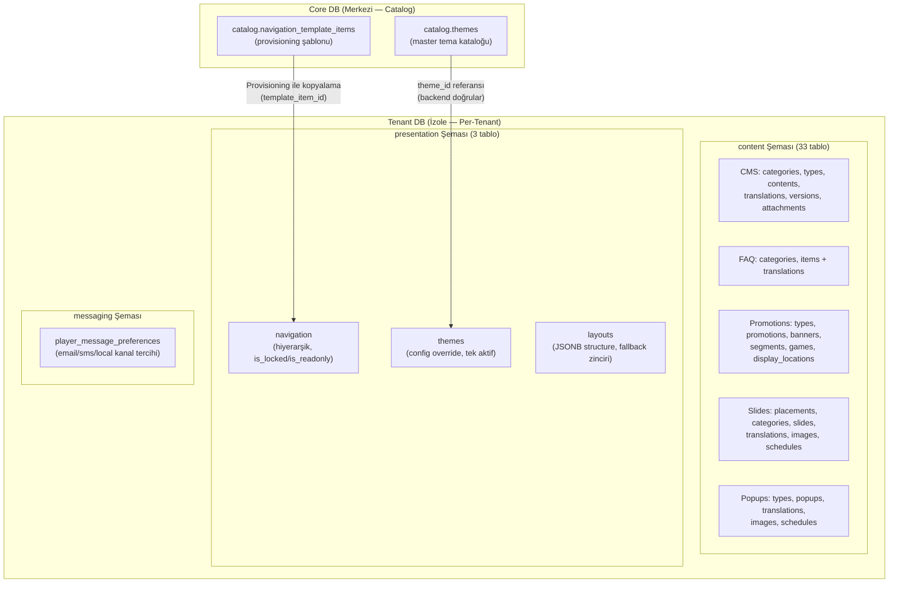
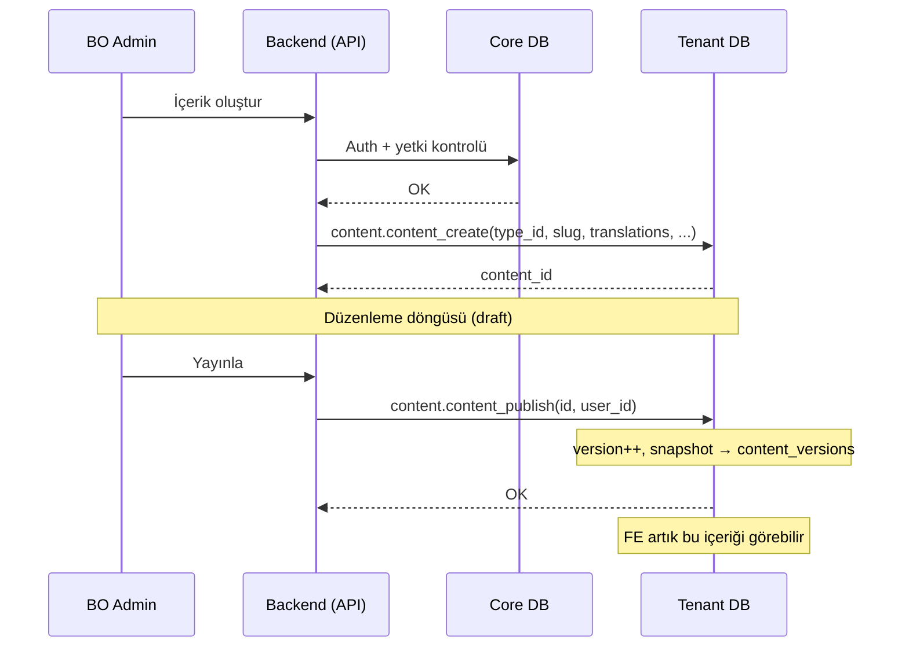
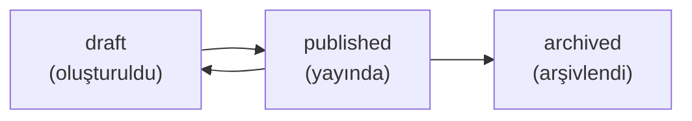
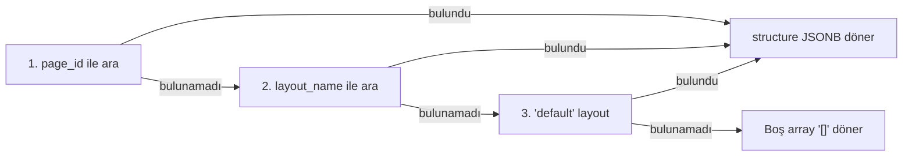

# Site Yönetimi — Geliştirici Rehberi

Tenant bazlı site içeriği ve arayüz yönetimi. Üç ana modül: **Content Management** (CMS, FAQ, Popup, Promosyon, Slide/Banner), **Presentation** (Navigasyon, Tema, Layout) ve **Mesaj Tercihleri**. Tüm veriler Tenant DB'de tutulur; yetki kontrolleri Core DB üzerinden yapılır.

---

## 1. Mimari Genel Bakış

### 1.1 Modül Yapısı

| # | Modül | Şema | BO Fonksiyon | FE Fonksiyon | Toplam |
|---|-------|------|-------------|-------------|--------|
| 1 | **CMS İçerik** | `content` | 11 | 2 | 13 |
| 2 | **FAQ** | `content` | 5 | 2 | 7 |
| 3 | **Popup** | `content` | 8 | 1 | 9 |
| 4 | **Promosyon** | `content` | 8 | 2 | 10 |
| 5 | **Slide/Banner** | `content` | 10 | 1 | 11 |
| 6 | **Navigasyon** | `presentation` | 7 | 1 | 8 |
| 7 | **Tema** | `presentation` | 4 | 1 | 5 |
| 8 | **Layout** | `presentation` | 4 | 1 | 5 |
| 9 | **Mesaj Tercihleri** | `messaging` | 1 | 2 | 3 |
| | **Toplam** | | **58** | **13** | **71** |

### 1.2 Veritabanı Dağılımı



### 1.3 Backend Orchestration — İçerik Yaşam Döngüsü



---

## 2. Content Management (CMS)

### 2.1 İçerik Durumları



| Durum | Açıklama | FE'de Görünür? |
|-------|----------|----------------|
| `draft` | Yeni oluşturulmuş veya düzenleniyor | Hayır |
| `published` | Yayında, FE'de erişilebilir | Evet |
| `archived` | Arşivlenmiş, FE'de görünmez | Hayır |

### 2.2 Çeviri Deseni (Translation Pattern)

Tüm content modülleri aynı çeviri deseni kullanır:

1. **Ana kayıt** → dile bağımsız veriler (slug, status, dates, config)
2. **Translation tablosu** → her dil için ayrı satır (title, description, body)
3. **CREATE**: Ana kayıt INSERT → çeviriler foreach INSERT
4. **UPDATE**: Ana kayıt UPDATE → çeviriler DELETE + foreach INSERT (replace-all)

```sql
-- Çeviri JSONB format (tüm modüllerde aynı yapı)
p_translations := '[
    {"languageCode": "en", "title": "Hello", "body": "..."},
    {"languageCode": "tr", "title": "Merhaba", "body": "..."}
]'::JSONB;
```

> **Neden DELETE+INSERT?** Hangi dillerin eklendiğini/kaldırıldığını takip etmek karmaşık. Tümünü silip yeniden eklemek daha güvenilir ve atomik.

### 2.3 Versiyonlama (content_publish)

`content_publish` çağrıldığında:

1. `contents.version` bir artırılır
2. `contents.status` → `'published'`, `published_at` → `NOW()`
3. Her dildeki çeviri `content_versions` tablosuna snapshot olarak kopyalanır
4. Çevirilerin `status` alanı → `'published'`

```
contents (v3, published) ←── Güncel
content_versions (v1, en) ←── Geçmiş
content_versions (v2, en) ←── Geçmiş
content_versions (v3, en) ←── Son yayın
```

### 2.4 Slug Benzersizliği

Her `contents.slug` tenant içinde benzersizdir (UNIQUE INDEX). FE tarafında `public_content_get(p_slug)` ile SEO-friendly URL'ler desteklenir.

### 2.5 Backend Çağrı Örnekleri

```sql
-- Kategori oluştur
SELECT content.content_category_upsert(
    NULL,           -- p_id (NULL = create)
    'blog',         -- p_code
    TRUE,           -- p_is_active
    '[{"languageCode":"en","name":"Blog"},{"languageCode":"tr","name":"Blog"}]'::JSONB,
    1               -- p_user_id
);

-- İçerik oluştur
SELECT content.content_create(
    1,              -- p_content_type_id
    'hello-world',  -- p_slug
    NULL,           -- p_featured_image_url
    '[{"languageCode":"en","title":"Hello World","body":"<p>Content...</p>"}]'::JSONB,
    NULL,           -- p_attachments
    1               -- p_user_id
);

-- Yayınla
SELECT content.content_publish(1, 1);

-- FE: Slug ile getir
SELECT content.public_content_get('hello-world', 'en');
```

---

## 3. FAQ Modülü

### 3.1 Yapı

FAQ sistemi iki seviyeli: **Kategoriler** ve **Öğeler**. Her ikisinin de çeviri tabloları var.

| Fonksiyon | Özel Davranış |
|-----------|---------------|
| `faq_category_delete` | Aktif öğeleri (`is_active=TRUE`) varsa silinemez |
| `faq_category_list` | Her kategori ile birlikte aktif öğe sayısını döner |
| `faq_item_upsert` | `is_featured` ile öne çıkan öğeler |
| `public_faq_get` | Her çağrıda `view_count` otomatik artırılır |

### 3.2 FE Filtreleme

`public_faq_list` şu filtreleri destekler:

| Parametre | Tip | Açıklama |
|-----------|-----|----------|
| `p_category_code` | VARCHAR | Kategori kodu filtresi |
| `p_is_featured` | BOOLEAN | Sadece öne çıkanlar |
| `p_search_text` | TEXT | Başlık/içerik arama (ILIKE) |
| `p_language_code` | CHAR(2) | Dil kodu |
| `p_offset/p_limit` | INTEGER | Sayfalama |

---

## 4. Popup Modülü

### 4.1 Popup Tipi ve Yapılandırma

Popup'lar `popup_types` tablosundan tip alır. Tip varsayılan boyut, overlay ve kapatma davranışını tanımlar. Popup kaydı bu değerleri override edebilir.

### 4.2 Hedefleme Sistemi (Targeting)

Popup'lar çoklu hedefleme kriterleriyle filtrelenir:

| Kriter | Tablo Kolonu | Mantık |
|--------|-------------|--------|
| **Ülke** | `country_codes[]`, `excluded_country_codes[]` | Dahil/hariç listeleri |
| **Segment** | `segment_ids[]` | Array overlap (`&&`) |
| **Sayfa URL** | `page_urls[]` | Array `ANY` eşleşme |
| **Zamanlama** | `popup_schedules` | Gün + saat aralığı |
| **Tarih** | `start_date`, `end_date` | Yayın penceresi |

### 4.3 Zamanlama (Schedule) Deseni

Slide ve Popup modülleri aynı zamanlama deseni kullanır:

```sql
-- Gün bazlı kontrol (DOW: 0=Pazar, 6=Cumartesi)
CASE EXTRACT(DOW FROM NOW())
    WHEN 0 THEN sc.day_sunday
    WHEN 1 THEN sc.day_monday
    ...
END = TRUE
-- Saat aralığı kontrolü
AND (sc.start_time IS NULL OR NOW()::TIME >= sc.start_time)
AND (sc.end_time IS NULL OR NOW()::TIME <= sc.end_time)
```

### 4.4 Tetikleme Tipleri

| Tip | Açıklama |
|-----|----------|
| `immediate` | Sayfa yüklenir yüklenmez |
| `delay` | `trigger_delay` saniye sonra |
| `scroll` | `trigger_scroll_percent` kaydırma sonrası |
| `exit_intent` | Fare sayfa dışına çıkınca |
| `click` | Belirli elemente tıklama |
| `login` | Giriş sonrası |
| `first_visit` | İlk ziyarette |
| `returning_visit` | Tekrar ziyarette |

### 4.5 Frekans Kontrolü

| Tip | Açıklama |
|-----|----------|
| `always` | Her seferinde |
| `once_per_session` | Oturum başına bir kez |
| `once_per_day` | Günde bir kez |
| `once_per_week` | Haftada bir kez |
| `once_ever` | Sadece bir kez (kalıcı) |
| `custom` | `frequency_cap` ve `frequency_hours` ile |

> **Not:** Frekans takibi backend/frontend cookie/localStorage tarafında yapılır. DB sadece kuralları tanımlar.

---

## 5. Promosyon Modülü

### 5.1 Alt Kayıt Tipleri

Her promosyon 5 alt kayıt tipine sahiptir:

| Alt Kayıt | Tablo | Açıklama |
|-----------|-------|----------|
| Çeviriler | `promotion_translations` | Dil bazlı başlık/açıklama |
| Bannerlar | `promotion_banners` | Cihaz bazlı görsel (desktop/mobile/tablet/app) |
| Segmentler | `promotion_segments` | Hedef kitle (player_category, vip_level, country...) |
| Oyunlar | `promotion_games` | Oyun/provider/kategori filtresi |
| Lokasyonlar | `promotion_display_locations` | Gösterim yeri (homepage, lobby, deposit...) |

### 5.2 Update Deseni

`promotion_update` tüm alt kayıtları DELETE+INSERT yapar:

```sql
-- 1. Ana kaydı güncelle
UPDATE content.promotions SET ... WHERE id = p_id;

-- 2. Alt kayıtları yenile (her biri için)
DELETE FROM content.promotion_translations WHERE promotion_id = p_id;
FOR v_item IN SELECT * FROM jsonb_array_elements(p_translations) LOOP
    INSERT INTO content.promotion_translations ...;
END LOOP;

-- Aynı desen: banners, segments, games, display_locations
```

### 5.3 FE Hedefleme

`public_promotion_list` şu filtreleri uygular:
- `is_active = TRUE` ve tarih aralığı kontrolü
- Ülke kodu filtresi (`country_codes && p_segment_ids` mantığı)
- Segment ID'leri overlap kontrolü
- `bonus_id IS NOT NULL` ise bonus bağlantılı promosyonlar

---

## 6. Slide/Banner Modülü

### 6.1 Placement Sistemi

Slide'lar placement'lara bağlıdır. Her placement bir `max_slides` limiti tanımlar.

```
slide_placements (homepage_hero, max_slides=5)
  └── slides (sort_order ile sıralı, max 5 tanesi FE'de gösterilir)
        ├── slide_translations (dil bazlı başlık/açıklama)
        ├── slide_images (cihaz + dil bazlı görseller)
        └── slide_schedules (gün + saat zamanlama)
```

### 6.2 FE Slide Akışı

`public_slide_list(p_placement_code, p_language_code, ...)`:

1. Placement'ın `max_slides` değerini al
2. Aktif + tarih aralığında olan slide'ları filtrele
3. Ülke ve segment hedeflemesini uygula
4. Zamanlama (gün + saat) kontrolü yap
5. `sort_order` ile sırala, `LIMIT max_slides`

### 6.3 Sıralama (Reorder)

`slide_reorder(p_placement_id, p_slide_ids, p_user_id)`:

- Frontend sürükle-bırak sonrası yeni sırayı array olarak gönderir
- Array index doğrudan `sort_order` olur: `[5,3,1]` → slide 5=0, slide 3=1, slide 1=2

---

## 7. Presentation Modülü

### 7.1 Navigasyon — Master Data Koruması

Navigation öğeleri provisioning ile core catalog'dan kopyalanabilir. Bu öğeler koruma bayraklarına sahiptir:

| Bayrak | Anlam | Etki |
|--------|-------|------|
| `is_locked = TRUE` | Silinmez öğe | `navigation_delete` → `error.navigation.item-locked` |
| `is_readonly = TRUE` | Hedef korumalı | `navigation_update` → target_type/url/action değişmez |
| Her ikisi `FALSE` | Serbest öğe | Tam düzenleme ve silme yetkisi |

```sql
-- navigation_update: Korumalı alan mantığı
target_type = CASE WHEN is_readonly
    THEN target_type                         -- Mevcut değer korunur
    ELSE COALESCE(p_target_type, target_type) -- Yeni değer uygulanır
END
```

> **Tenant oluşturduğu öğeler:** `is_locked=FALSE, is_readonly=FALSE, template_item_id=NULL` — tam serbestlik.

### 7.2 Navigasyon — Hiyerarşik Ağaç

`navigation_list` recursive CTE ile iç içe ağaç yapısı döner:

```json
[
    {
        "id": 1,
        "menuLocation": "main_header",
        "translationKey": "menu.main.casino",
        "children": [
            {"id": 3, "translationKey": "menu.main.slots", "children": []},
            {"id": 4, "translationKey": "menu.main.live", "children": []}
        ]
    }
]
```

### 7.3 Navigasyon — FE Dil Çözümleme

`public_navigation_get` hibrit lokalizasyon kullanır:

1. `custom_label` JSONB'de istenen dil varsa → onu kullan
2. Yoksa → `translation_key` döner, FE kendi i18n sistemiyle çevirir

```sql
-- Dil çözümleme mantığı
CASE
    WHEN n.custom_label IS NOT NULL AND n.custom_label ? p_language_code
    THEN n.custom_label ->> p_language_code
    ELSE NULL  -- FE translation_key ile çevirecek
END AS "label"
```

### 7.4 Tema — Tek Aktif Tema

Tenant'ın aynı anda sadece bir aktif teması olabilir (`UNIQUE partial index on is_active WHERE TRUE`).

```sql
-- theme_activate: Önce hepsini pasifle, sonra seçileni aktifle
UPDATE presentation.themes SET is_active = FALSE;
UPDATE presentation.themes SET is_active = TRUE WHERE id = p_id;
```

`theme_id` kolonu core `catalog.themes` tablosundaki tema referansıdır. Backend tarafında doğrulanır (cross-DB).

### 7.5 Layout — Fallback Zinciri

`public_layout_get` üç aşamalı fallback ile çalışır:



| Senaryo | Girdi | Açıklama |
|---------|-------|----------|
| Sayfa özel layout | `page_id=42` | O sayfaya özel widget yapısı |
| İsimli layout | `layout_name='game_detail'` | Oyun detay sayfası şablonu |
| Varsayılan | otomatik | Global default layout |
| Layout yok | — | Boş `[]` — FE varsayılan render |

---

## 8. Mesaj Tercihleri

### 8.1 Kanal Tercihleri

Her oyuncu 3 kanal için tercih belirleyebilir:

| Kanal | Açıklama |
|-------|----------|
| `email` | E-posta bildirimleri |
| `sms` | SMS bildirimleri |
| `local` | Uygulama içi bildirimler |

### 8.2 Varsayılan Değerler

Tercih kaydı yoksa, `player_message_preference_get` varsayılan değerler üretir:

```sql
-- VALUES ile 3 kanal tanımla, LEFT JOIN ile mevcut tercihleri eşle
FROM (VALUES ('email'), ('sms'), ('local')) AS channels(channel_type)
LEFT JOIN messaging.player_message_preferences pref
    ON pref.player_id = p_player_id AND pref.channel_type = channels.channel_type
```

Sonuç: Her zaman 3 satır döner — kayıt varsa gerçek değer, yoksa `opted_in = TRUE`.

### 8.3 Upsert Mantığı

```sql
INSERT INTO messaging.player_message_preferences (player_id, channel_type, opted_in)
VALUES (p_player_id, p_channel_type, p_opted_in)
ON CONFLICT (player_id, channel_type) DO UPDATE
SET opted_in = EXCLUDED.opted_in, updated_at = NOW();
```

---

## 9. Ortak Desenler

### 9.1 Soft Delete vs Hard Delete

| Modül | Silme Tipi | Kolon | Açıklama |
|-------|-----------|-------|----------|
| CMS İçerik | Soft | `is_active = FALSE` | İçerik arşivlenir |
| CMS Kategori/Tip | Soft | `is_active = FALSE` | Bağlı kayıt kontrolü |
| FAQ Kategori/Öğe | Soft | `is_active = FALSE` | Bağlı öğe kontrolü |
| Popup | Soft | `is_deleted = TRUE` | `deleted_at` + `deleted_by` |
| Promosyon | Soft | `is_deleted = TRUE` | `deleted_at` + `deleted_by` |
| Slide | Soft | `is_deleted = TRUE` | `deleted_at` + `deleted_by` + `is_active = FALSE` |
| Layout | Hard | `DELETE` | JSONB yapı, geri alma gereksiz |
| Navigasyon | Hard | `DELETE` (CASCADE) | `is_locked` kontrolü ile |

### 9.2 Upsert Deseni (NULL id = Create)

Kategori, tip ve benzeri CRUD fonksiyonlarında:

```sql
IF p_id IS NULL THEN
    -- CREATE: INSERT + RETURNING id
ELSE
    -- UPDATE: kayıt kontrolü + UPDATE
END IF;
```

### 9.3 Image/Schedule Replace-All Deseni

Görseller ve zamanlama kayıtları update'de DELETE+INSERT yapılır:

```sql
-- slide_update içinde
DELETE FROM content.slide_images WHERE slide_id = p_id;
DELETE FROM content.slide_schedules WHERE slide_id = p_id;

-- Yeni kayıtları ekle
FOR v_item IN SELECT * FROM jsonb_array_elements(p_images) LOOP
    INSERT INTO content.slide_images ...;
END LOOP;
```

### 9.4 FE Hedefleme Filtre Zinciri

Popup ve Slide modüllerinde FE sorgusu şu filtreleri sırayla uygular:

```
1. is_active = TRUE AND is_deleted = FALSE
2. start_date <= NOW() AND end_date > NOW()
3. country_codes IS NULL OR p_country = ANY(country_codes)
4. excluded_country_codes IS NULL OR NOT (p_country = ANY(excluded))
5. segment_ids IS NULL OR segment_ids && p_segment_ids
6. Schedule: day_of_week + time range
7. ORDER BY sort_order / priority
8. LIMIT max_slides (slide) veya priority DESC (popup)
```

---

## 10. Cross-DB Güvenlik

Tüm tenant fonksiyonları IDOR kontrolü **yapmaz**. Güvenlik Core DB üzerinden sağlanır:

```
1. API isteği → Backend
2. Backend → Core DB: user_assert_access_tenant(caller_id, tenant_id)
3. Core DB → OK/DENY
4. Backend → Tenant DB: content.content_create(...)
```

> **Presentation tabloları** tenant_id içermez çünkü her tenant izole DB'ye sahiptir. Core catalog referansları (theme_id, template_item_id) backend tarafında doğrulanır.

---

## 11. Fonksiyon Referansı

Detaylı fonksiyon listesi ve dönüş tipleri: [FUNCTIONS_TENANT.md](../reference/FUNCTIONS_TENANT.md)

| Şema | Bölüm | Fonksiyon Sayısı |
|------|-------|------------------|
| `content` | Content Schema (50) | BO: 42, FE: 8 |
| `presentation` | Presentation Schema (18) | BO: 15, FE: 3 |
| `messaging` | Player Message Preferences (3) | BO: 1, FE: 2 |
