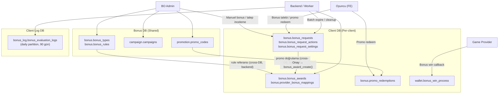
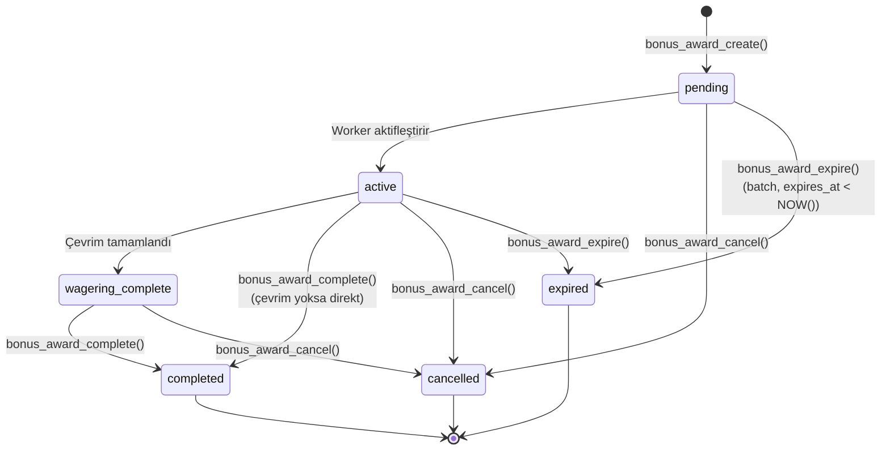
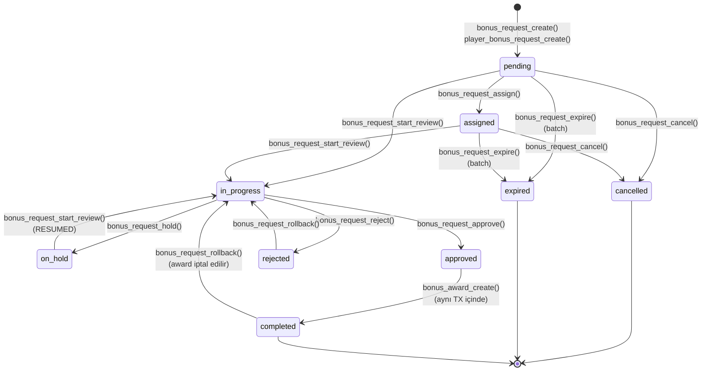

# SPEC_BONUS_ENGINE: Bonus Motoru Fonksiyonel Spesifikasyonu

JSON-driven generic rule engine ile bonus yönetimi: kural tanımlama, kampanya, promosyon kodu, award verme, çevrim (wagering), manuel talep workflow.

> İlgili spesifikasyonlar: [SPEC_GAME_GATEWAY.md](SPEC_GAME_GATEWAY.md) · [SPEC_FINANCE_GATEWAY.md](SPEC_FINANCE_GATEWAY.md) · [SPEC_PLAYER_AUTH_KYC.md](SPEC_PLAYER_AUTH_KYC.md)

---

## 1. Kapsam ve Veritabanı Dağılımı

Bonus Engine domaininde **46 fonksiyon**, **11 tablo**, **3 veritabanı** yer alır. Kural tanımları shared Bonus DB'de, oyuncu bazlı award/talep verileri client-izole Client DB'de saklanır.

| Veritabanı | Şema | Fonksiyon | Tablo | Açıklama |
|------------|------|-----------|-------|----------|
| **Bonus DB** (Shared) | bonus, campaign, promotion | 18 | 4 | Bonus tipi, kural, kampanya, promosyon kodu tanımları |
| **Client DB** (Per-client) | bonus, wallet | 26 | 6 | Award, promo kullanım, talep workflow, gateway |
| **Client Log DB** | bonus_log | — | 1 | Değerlendirme audit trail (daily partition, 90 gün) |
| **Toplam** | | **44 + 2 bakım** | **11** | |



### Cross-DB İlişkiler

| Kaynak DB | Hedef DB | İlişki | Backend Sorumluluğu |
|-----------|----------|--------|---------------------|
| Bonus DB | Client DB | bonus_rule_id referansı | Backend Bonus DB'den kuralı okur, rule_snapshot JSONB olarak Client DB'ye yazar |
| Bonus DB | Client DB | promo_code_id referansı | Backend Bonus DB'de kodu doğrular (aktif, geçerli, limit), Client DB'de redemption kaydeder |
| Bonus DB | Client DB | campaign_id referansı | Backend campaign bütçe/durum kontrolü yapar, Client DB'de award oluşturur |
| Client DB | Core DB | player segmentation | `auth.player_get_segmentation()` ile grup/kategori bilgisi (eligibility kontrolü) |
| Client DB | Client DB | wallet entegrasyonu | `bonus.bonus_award_create/cancel/complete` → `wallet.wallet_snapshots` + `transaction.transactions` |

---

## 2. Durum Makinaları ve İş Akışları

### 2.1 Bonus Award Durum Makinası



| Durum | Kod | Açıklama |
|-------|-----|----------|
| pending | `pending` | Award oluşturuldu, henüz aktifleşmedi |
| active | `active` | Bonus aktif, çevrim sürüyor |
| wagering_complete | `wagering_complete` | Çevrim hedefi tamamlandı, tamamlama bekliyor |
| pending_kyc | `pending_kyc` | KYC doğrulama bekliyor |
| completed | `completed` | Bonus tamamlandı, REAL wallet'a transfer edildi |
| expired | `expired` | Süre aşımı (batch expire) |
| cancelled | `cancelled` | İptal edildi (BO/sistem) |
| claimed | `claimed` | Oyuncu tarafından talep edildi |

### 2.2 Bonus Request Durum Makinası



| Durum | Kod | Açıklama |
|-------|-----|----------|
| pending | `pending` | Yeni talep, kuyrukta |
| assigned | `assigned` | Operatöre atandı |
| in_progress | `in_progress` | Aktif inceleme — diğer operatörler kilitli görür |
| on_hold | `on_hold` | Beklemede (ek bilgi gerekli, neden zorunlu) |
| approved | `approved` | Onaylandı (geçici durum, hemen completed'a geçer) |
| rejected | `rejected` | Reddedildi (review_note zorunlu, rollback ile geri alınabilir) |
| completed | `completed` | Bonus award oluşturuldu (rollback ile geri alınabilir) |
| cancelled | `cancelled` | İptal (final — oyuncu: sadece pending; operatör: pending/assigned) |
| expired | `expired` | Süre aşımı (batch, final) |
| failed | `failed` | Award oluşturma teknik hata |

### 2.3 Kampanya Durum Makinası

| Mevcut Durum | Yeni Durum | Tetikleyen |
|-------------|------------|------------|
| draft | active | campaign_update(status='active') |
| active | paused | campaign_update(status='paused') |
| paused | active | campaign_update(status='active') |
| active | ended | campaign_update(status='ended') veya campaign_delete() |
| paused | ended | campaign_update(status='ended') |

### 2.4 Çevrim (Wagering) Akışı

```
Bonus: 100 TL, 30x çevrim
wagering_target = bonus_amount × wagering_multiplier = 100 × 30 = 3.000 TL

Oyuncu oynar:
  50 TL slot  (%100 katkı) → progress += 50
  100 TL live (%10 katkı)  → progress += 10
  ...
  progress >= wagering_target → wagering_completed = true
```

**Çevrim şartı kaynakları (öncelik sırası):**

1. **Operatör override** — Onay sırasında `p_usage_criteria` parametresi
2. **Setting default** — `bonus_request_settings.default_usage_criteria`
3. **Kural tanımı** — `bonus_rules.usage_criteria`
4. **Çevrim yok** — Tümü NULL ise bonus direkt kullanılabilir

**Hesaplama formülleri:**

| Hesaplama | Formül |
|-----------|--------|
| Çevrim hedefi | `wagering_target = bonus_amount × wagering_multiplier` |
| Maks çekim | `max_withdrawal_amount = bonus_amount × max_withdrawal_factor` |
| İlerleme yüzdesi | `ROUND((wagering_progress / wagering_target) × 100, 2)` |
| Bütçe kullanım yüzdesi | `ROUND((spent_budget / total_budget) × 100, 2)` |

### 2.5 Wallet Mimarisi ve Harcama Önceliği

| Cüzdan | Tip | Açıklama |
|--------|-----|----------|
| REAL Wallet | `real` | Gerçek para (deposit/withdraw) |
| BONUS Wallet | `bonus` | Bonus para (tüm bonuslar buraya) |
| LOCKED Wallet | `locked` | Kilitli bakiye |

**Harcama önceliği (bahis sırasında):**

1. Uygun BONUS award'ları filtrele (`usage_criteria` ile)
2. Sırala: **earliest expiry first** (expires_at ASC NULLS LAST)
3. Sırayla bonus bakiyesinden düş
4. Tüm uygun bonuslar tükendiyse → REAL wallet'tan düş

**Transfer politikaları (çevrim tamamlandığında):**

| Politika | Davranış |
|----------|----------|
| transfer_earned | Kazanılan tutar REAL wallet'a, kalan bonus iptal |
| forfeit_remaining | Bonus bakiye iptal, sadece kazanç REAL'a |
| forfeit_all | Tüm bonus + kazanç iptal |

### 2.6 İşlem Tipi ID'leri

| ID | İşlem | Context |
|----|-------|---------|
| 40 | Bonus Credit | `bonus_award_create()` — BONUS wallet'a kredi |
| 41 | Bonus Debit / Reversal | `bonus_award_cancel()` / `bonus_award_expire()` — BONUS wallet'tan çıkış |
| 42 | Bonus Completion | `bonus_award_complete()` — BONUS→REAL transfer |
| 72 | Free Spin Bonus Win | `bonus_win_process()` — Game provider bonus kazanç |

### 2.7 Stacking ve Çakışma Kontrolü

| Kolon | Açıklama |
|-------|----------|
| `disables_other_bonuses` | Bu bonus aktifken başka bonus alınamaz |
| `stacking_group` | Aynı grupta max 1 aktif bonus (ör: "welcome_group") |

Backend award öncesinde kontrol eder:

1. Oyuncunun aktif bonus'u var mı ve `disables_other_bonuses = true` mi?
2. Aynı `stacking_group`'ta aktif bonus var mı?

### 2.8 6 JSONB Bileşen (Bonus Rules)

Her bonus kuralı (`bonus.bonus_rules`) 6 JSONB bileşenden oluşur:

| # | Bileşen | Soru | Zorunlu | Örnek |
|---|---------|------|---------|-------|
| 1 | `trigger_config` | Ne zaman tetiklenir? | **Evet** | `{"event":"first_deposit","conditions":{"min_amount":100}}` |
| 2 | `data_config` | Hangi veri gerekli? | Hayır | `{"source":"deposit_event","fields":["amount","currency"]}` |
| 3 | `eligibility_criteria` | Kim hak eder? | Hayır | `{"conditions":[{"field":"player.country","op":"in","value":["TR","DE"]}]}` |
| 4 | `reward_config` | Ne kadar verilir? | **Evet** | `{"type":"percentage","source_field":"event.amount","value":100,"max_amount":1000}` |
| 5 | `usage_criteria` | Nasıl kullanılmalı? | Hayır | `{"wagering_multiplier":30,"expires_in_days":30,"game_contributions":{"SLOT":100}}` |
| 6 | `target_config` | Bonus alt tipi? | Hayır | `{"bonus_subtype":"freebet","completion_target":"real"}` |

**TEXT→JSONB Pattern:** Tüm JSONB parametreler fonksiyona `TEXT` olarak geçirilir, fonksiyon içinde `::JSONB` cast yapılır.

### 2.9 Eligibility Field Kataloğu

`eligibility_criteria` koşullarında kullanılabilecek alanlar:

| Field Key | Kaynak | Tip | Desteklenen Operatörler |
|-----------|--------|-----|------------------------|
| `player.category` | category.code | string | `eq`, `neq`, `in`, `not_in` |
| `player.category_level` | categoryLevel | numeric | `eq`, `gt`, `gte`, `lt`, `lte`, `between` |
| `player.groups` | groupCodes | string[] | `contains`, `in`, `not_in` |
| `player.group_max_level` | groupMaxLevel | numeric | `eq`, `gt`, `gte`, `lt`, `lte`, `between` |
| `player.country` | country | string | `eq`, `neq`, `in`, `not_in` |
| `player.account_age_days` | accountAgeDays | numeric | `eq`, `gt`, `gte`, `lt`, `lte`, `between` |
| `player.kyc_status` | kycStatus | string | `eq`, `neq`, `in` |
| `player.deposit_count` | Backend stats | numeric | `eq`, `gt`, `gte`, `lt`, `lte`, `between` |
| `player.total_deposit` | Backend stats | numeric | `eq`, `gt`, `gte`, `lt`, `lte`, `between` |
| `event.amount` | Event data | numeric | Tüm numeric operatörler |
| `event.currency` | Event data | string | `eq`, `in` |
| `event.payment_method` | Event data | string | `eq`, `in`, `not_in` |

**Değerlendirme mantığı:** Varsayılan `AND` (tüm koşullar sağlanmalı). `"logic": "or"` ile herhangi birinin sağlanması yeterli.

### 2.10 Değerlendirme Tipleri

| Tip | Tetiklenme | Örnek |
|-----|-----------|-------|
| `immediate` | Event-driven: deposit gelince hemen | Hoş geldin bonusu (%100 ilk yatırım) |
| `periodic` | Cron schedule ile | Haftalık cashback (Pazartesi 00:00) |
| `manual` | Admin tetikler | VIP özel bonus |
| `claim` | Oyuncu talep eder | Talep et butonu ile aktifleştirme |

---

## 3. Veri Modeli

### 3.1 Bonus DB — bonus.bonus_types

| Kolon | Tip | Zorunlu | Varsayılan | Açıklama |
|-------|-----|---------|------------|----------|
| id | BIGSERIAL | Evet | PK | Bonus tipi ID |
| client_id | BIGINT | Hayır | NULL | NULL = platform seviyesi |
| type_code | VARCHAR(50) | Evet | — | Benzersiz kod (UPPER) |
| type_name | VARCHAR(255) | Evet | — | Bonus tipi adı |
| description | TEXT | Hayır | — | Açıklama |
| category | VARCHAR(50) | Evet | — | deposit_match, free_spin, free_bet, cashback, loyalty |
| value_type | VARCHAR(30) | Evet | — | percentage, fixed_amount, free_spins_count |
| is_active | BOOLEAN | Evet | true | — |
| created_at | TIMESTAMP | Evet | now() | — |
| updated_at | TIMESTAMP | Evet | now() | — |

**Unique:** `(client_id, type_code)` — IS NOT DISTINCT FROM ile NULL-safe

### 3.2 Bonus DB — bonus.bonus_rules

| Kolon | Tip | Zorunlu | Varsayılan | Açıklama |
|-------|-----|---------|------------|----------|
| id | BIGSERIAL | Evet | PK | Kural ID |
| client_id | BIGINT | Hayır | NULL | NULL = platform seviyesi |
| rule_code | VARCHAR(100) | Evet | — | Benzersiz kod (UPPER) |
| rule_name | VARCHAR(255) | Evet | — | Kural adı |
| bonus_type_id | BIGINT | Evet | — | FK → bonus_types(id) |
| trigger_config | JSONB | Evet | — | Event tetikleme tanımı |
| data_config | JSONB | Hayır | — | Veri kaynağı tanımı |
| eligibility_criteria | JSONB | Hayır | — | Oyuncu uygunluk koşulları |
| reward_config | JSONB | Evet | — | Ödül hesaplama kuralları |
| usage_criteria | JSONB | Hayır | — | Çevrim şartları, oyun katkıları |
| target_config | JSONB | Hayır | — | Bonus alt tipi, tamamlama hedefi |
| evaluation_type | VARCHAR(20) | Evet | 'immediate' | immediate, periodic, manual, claim |
| max_uses_total | INT | Hayır | — | NULL = limitsiz |
| max_uses_per_player | INT | Evet | 1 | — |
| current_uses_total | INT | Evet | 0 | Atomik sayaç (fonksiyonla güncellenmez) |
| valid_from | TIMESTAMPTZ | Hayır | — | Geçerlilik başlangıcı |
| valid_until | TIMESTAMPTZ | Hayır | — | Geçerlilik bitişi |
| disables_other_bonuses | BOOLEAN | Evet | false | Aktifken başka bonus engeller |
| stacking_group | VARCHAR(50) | Hayır | — | Stacking çakışma grubu |
| is_active | BOOLEAN | Evet | true | — |
| created_at | TIMESTAMPTZ | Evet | NOW() | — |
| updated_at | TIMESTAMPTZ | Evet | NOW() | — |

**Unique:** `(client_id, rule_code)` — IS NOT DISTINCT FROM ile NULL-safe
**FK:** `bonus_type_id → bonus_types(id)`
**GIN Index:** `trigger_config`, `eligibility_criteria`

### 3.3 Bonus DB — campaign.campaigns

| Kolon | Tip | Zorunlu | Varsayılan | Açıklama |
|-------|-----|---------|------------|----------|
| id | BIGSERIAL | Evet | PK | Kampanya ID |
| client_id | BIGINT | Hayır | NULL | — |
| campaign_code | VARCHAR(100) | Evet | — | Benzersiz kod (UPPER) |
| campaign_name | VARCHAR(255) | Evet | — | Kampanya adı |
| description | TEXT | Hayır | — | Açıklama |
| campaign_type | VARCHAR(50) | Evet | — | welcome, deposit_bonus, tournament, seasonal |
| bonus_rule_ids | JSONB | Hayır | — | Bağlı kural ID'leri dizisi |
| start_date | TIMESTAMPTZ | Evet | — | Başlangıç tarihi |
| end_date | TIMESTAMPTZ | Evet | — | Bitiş tarihi (> start_date) |
| budget_currency | CHAR(3) | Hayır | — | ISO 4217 para birimi |
| total_budget | DECIMAL(18,2) | Hayır | — | Toplam bütçe |
| spent_budget | DECIMAL(18,2) | Evet | 0 | Harcanan bütçe (atomik) |
| award_strategy | VARCHAR(30) | Evet | 'automatic' | automatic, claim, manual |
| target_segments | JSONB | Hayır | — | Hedef segment dizisi |
| status | VARCHAR(20) | Evet | 'draft' | draft, active, paused, ended |
| created_at | TIMESTAMPTZ | Evet | NOW() | — |
| updated_at | TIMESTAMPTZ | Evet | NOW() | — |

**Unique:** `(client_id, campaign_code)`
**GIN Index:** `bonus_rule_ids`, `target_segments`

### 3.4 Bonus DB — promotion.promo_codes

| Kolon | Tip | Zorunlu | Varsayılan | Açıklama |
|-------|-----|---------|------------|----------|
| id | BIGSERIAL | Evet | PK | Promo ID |
| client_id | BIGINT | Hayır | NULL | — |
| code | VARCHAR(50) | Evet | — | Promosyon kodu (UPPER) |
| promo_name | VARCHAR(255) | Evet | — | Promo adı |
| bonus_rule_id | BIGINT | Evet | — | FK → bonus_rules(id) |
| max_redemptions | INT | Hayır | — | NULL = limitsiz |
| max_per_player | INT | Evet | 1 | — |
| current_redemptions | INT | Evet | 0 | Atomik sayaç |
| valid_from | TIMESTAMP | Evet | — | Geçerlilik başlangıcı |
| valid_until | TIMESTAMP | Evet | — | Geçerlilik bitişi (> valid_from) |
| is_active | BOOLEAN | Evet | true | — |
| created_at | TIMESTAMP | Evet | now() | — |
| updated_at | TIMESTAMP | Evet | now() | — |

**Unique:** `(client_id, code)`
**FK:** `bonus_rule_id → bonus_rules(id)`
**Lookup Index:** `(client_id, upper(code)) WHERE is_active = true`

### 3.5 Client DB — bonus.bonus_awards

| Kolon | Tip | Zorunlu | Varsayılan | Açıklama |
|-------|-----|---------|------------|----------|
| id | BIGSERIAL | Evet | PK | Award ID |
| player_id | BIGINT | Evet | — | FK → auth.players(id) ON DELETE CASCADE |
| bonus_rule_id | BIGINT | Evet | — | Bonus DB kural referansı |
| bonus_type_code | VARCHAR(50) | Evet | — | Bonus tipi kodu |
| bonus_subtype | VARCHAR(30) | Hayır | — | monetary, freebet, freespin |
| promo_code_id | BIGINT | Hayır | — | Bonus DB promo referansı |
| campaign_id | BIGINT | Hayır | — | Bonus DB kampanya referansı |
| bonus_amount | DECIMAL(18,2) | Evet | — | Bonus tutarı |
| currency | CHAR(3) | Evet | — | Para birimi |
| rule_snapshot | JSONB | Hayır | — | Kural anındaki hali (değişmez) |
| usage_criteria | JSONB | Hayır | — | Çevrim kuralları |
| reward_details | JSONB | Hayır | — | Hesaplama detayları |
| wagering_target | DECIMAL(18,2) | Hayır | — | Çevrim hedefi |
| wagering_progress | DECIMAL(18,2) | Evet | 0 | Tamamlanan çevrim |
| wagering_completed | BOOLEAN | Evet | false | — |
| max_withdrawal_amount | DECIMAL(18,2) | Hayır | — | Maks çekim limiti |
| current_balance | DECIMAL(18,2) | Evet | 0 | Bonus bakiye |
| expires_at | TIMESTAMPTZ | Hayır | — | Son kullanma tarihi |
| status | VARCHAR(20) | Evet | 'pending' | Durum (bkz. §2.1) |
| client_transaction_id | BIGINT | Hayır | — | Bonus credit TX ID |
| completion_transaction_id | BIGINT | Hayır | — | BONUS→REAL TX ID |
| bonus_request_id | BIGINT | Hayır | — | FK → bonus_requests(id) |
| awarded_by | BIGINT | Hayır | — | Admin user ID |
| cancellation_reason | VARCHAR(255) | Hayır | — | İptal nedeni |
| cancelled_by | BIGINT | Hayır | — | İptal eden |
| awarded_at | TIMESTAMPTZ | Evet | NOW() | — |
| completed_at | TIMESTAMPTZ | Hayır | — | — |
| cancelled_at | TIMESTAMPTZ | Hayır | — | — |
| created_at | TIMESTAMPTZ | Evet | NOW() | — |
| updated_at | TIMESTAMPTZ | Evet | NOW() | — |

**FK:** `player_id → auth.players(id)`, `bonus_request_id → bonus_requests(id)`
**Key Index'ler:** `(player_id, status) WHERE status IN ('pending', 'active')`, `(expires_at) WHERE expires_at IS NOT NULL`, GIN `(usage_criteria)`

### 3.6 Client DB — bonus.provider_bonus_mappings

| Kolon | Tip | Zorunlu | Varsayılan | Açıklama |
|-------|-----|---------|------------|----------|
| id | BIGSERIAL | Evet | PK | — |
| bonus_award_id | BIGINT | Evet | — | FK → bonus_awards(id) |
| provider_code | VARCHAR(50) | Evet | — | PRAGMATIC, HUB88, EVOLUTION vb. |
| provider_bonus_type | VARCHAR(50) | Evet | — | FREE_SPINS, FREE_CHIPS, TOURNAMENT, FREEBET |
| provider_bonus_id | VARCHAR(100) | Evet | — | Provider bonus/campaign/reward ID |
| provider_request_id | VARCHAR(100) | Hayır | — | PP requestId, Hub88 reward_uuid |
| status | VARCHAR(20) | Evet | 'active' | active, completed, cancelled, expired |
| provider_data | JSONB | Hayır | — | Provider-specific metadata |
| created_at | TIMESTAMPTZ | Evet | NOW() | — |
| updated_at | TIMESTAMPTZ | Evet | NOW() | — |

**Unique:** `(provider_code, provider_bonus_id)`
**Check:** `status IN ('active', 'completed', 'cancelled', 'expired')`

### 3.7 Client DB — bonus.promo_redemptions

| Kolon | Tip | Zorunlu | Varsayılan | Açıklama |
|-------|-----|---------|------------|----------|
| id | BIGSERIAL | Evet | PK | — |
| player_id | BIGINT | Evet | — | FK → auth.players(id) |
| promo_code_id | BIGINT | Evet | — | Bonus DB promo referansı |
| promo_code | VARCHAR(50) | Evet | — | Kod kopyası (UPPER) |
| bonus_award_id | BIGINT | Hayır | — | FK → bonus_awards(id) |
| status | VARCHAR(20) | Evet | 'success' | success, failed, expired |
| failure_reason | VARCHAR(255) | Hayır | — | — |
| redeemed_at | TIMESTAMPTZ | Evet | NOW() | — |
| created_at | TIMESTAMPTZ | Evet | NOW() | — |
| updated_at | TIMESTAMPTZ | Evet | NOW() | — |

**Index:** `(player_id, promo_code_id)` — çift kullanım engeli kontrolü

### 3.8 Client DB — bonus.bonus_requests

| Kolon | Tip | Zorunlu | Varsayılan | Açıklama |
|-------|-----|---------|------------|----------|
| id | BIGSERIAL | Evet | PK | — |
| player_id | BIGINT | Evet | — | FK → auth.players(id) |
| request_source | VARCHAR(20) | Evet | — | player, operator |
| request_type | VARCHAR(50) | Evet | — | Bonus tipi kodu |
| requested_amount | DECIMAL(18,2) | Hayır | — | İstenen tutar (operatör: zorunlu) |
| currency | VARCHAR(20) | Hayır | — | Para birimi (operatör: zorunlu) |
| description | TEXT | Evet | — | Talep açıklaması |
| supporting_data | JSONB | Hayır | — | Ek veri/kanıt |
| status | VARCHAR(20) | Evet | 'pending' | Durum (bkz. §2.2) |
| priority | SMALLINT | Evet | 0 | 0=normal, 1=high, 2=urgent |
| assigned_to_id | BIGINT | Hayır | — | Atanan BO operatör |
| assigned_at | TIMESTAMPTZ | Hayır | — | — |
| reviewed_by_id | BIGINT | Hayır | — | İnceleyen BO operatör |
| review_note | VARCHAR(500) | Hayır | — | Onay/red notu |
| reviewed_at | TIMESTAMPTZ | Hayır | — | — |
| approved_amount | DECIMAL(18,2) | Hayır | — | Onaylanan tutar |
| approved_currency | VARCHAR(20) | Hayır | — | — |
| approved_bonus_type | VARCHAR(50) | Hayır | — | Onaylanan bonus tipi (farklı olabilir) |
| bonus_rule_id | BIGINT | Hayır | — | Bağlanan bonus kuralı |
| bonus_award_id | BIGINT | Hayır | — | Oluşturulan award |
| requested_by_id | BIGINT | Hayır | — | Operatör talebi: BO user_id |
| expires_at | TIMESTAMPTZ | Hayır | — | Otomatik expire tarihi |
| created_at | TIMESTAMPTZ | Evet | NOW() | — |
| updated_at | TIMESTAMPTZ | Evet | NOW() | — |

**FK:** `player_id → auth.players(id)`
**Key Index'ler:** `(player_id, request_type, status)`, `(status, created_at) WHERE status IN ('pending', 'assigned')`, `(expires_at) WHERE status IN ('pending', 'assigned')`

### 3.9 Client DB — bonus.bonus_request_actions

| Kolon | Tip | Zorunlu | Varsayılan | Açıklama |
|-------|-----|---------|------------|----------|
| id | BIGSERIAL | Evet | PK | — |
| request_id | BIGINT | Evet | — | FK → bonus_requests(id) |
| action | VARCHAR(30) | Evet | — | CREATED, ASSIGNED, REVIEW_STARTED, ON_HOLD, RESUMED, APPROVED, REJECTED, CANCELLED, EXPIRED, COMPLETED, FAILED, ROLLBACK, NOTE_ADDED, AMOUNT_ADJUSTED |
| performed_by_id | BIGINT | Hayır | — | player_id veya user_id |
| performed_by_type | VARCHAR(20) | Evet | — | PLAYER, BO_USER, SYSTEM |
| note | VARCHAR(500) | Hayır | — | Aksiyon notu |
| action_data | JSONB | Hayır | — | Eski/yeni değerler, detaylı metadata |
| created_at | TIMESTAMPTZ | Evet | NOW() | — |

**FK:** `request_id → bonus_requests(id)`
**Immutable:** Sadece INSERT (güncelleme/silme yok, audit trail)

### 3.10 Client DB — bonus.bonus_request_settings

| Kolon | Tip | Zorunlu | Varsayılan | Açıklama |
|-------|-----|---------|------------|----------|
| id | BIGSERIAL | Evet | PK | — |
| bonus_type_code | VARCHAR(50) | Evet | — | UNIQUE — bonus tipi kodu |
| display_name | JSONB | Evet | — | Lokalize ad: `{"tr":"...","en":"..."}` |
| rules_content | JSONB | Hayır | — | Lokalize HTML kurallar |
| is_requestable | BOOLEAN | Evet | false | Oyuncular talep edebilir mi? |
| eligible_groups | JSONB | Hayır | — | Uygun grup kodları dizisi |
| eligible_categories | JSONB | Hayır | — | Uygun kategori kodları dizisi |
| min_group_level | INT | Hayır | — | Minimum grup seviyesi |
| min_category_level | INT | Hayır | — | Minimum kategori seviyesi |
| cooldown_after_approved_days | INT | Evet | 30 | Onay sonrası bekleme (gün) |
| cooldown_after_rejected_days | INT | Evet | 3 | Red sonrası bekleme (gün) |
| max_pending_per_player | INT | Evet | 1 | Maks bekleyen talep sayısı |
| max_description_length | INT | Evet | 500 | — |
| require_minimum_deposit | BOOLEAN | Evet | false | — |
| min_deposit_amount | DECIMAL(18,2) | Hayır | — | — |
| default_usage_criteria | JSONB | Hayır | — | Varsayılan çevrim şartı |
| display_order | INT | Evet | 0 | Sıralama |
| is_active | BOOLEAN | Evet | true | — |
| created_at | TIMESTAMPTZ | Evet | NOW() | — |
| updated_at | TIMESTAMPTZ | Evet | NOW() | — |

**Unique:** `(bonus_type_code)`
**UPSERT:** `ON CONFLICT (bonus_type_code) WHERE is_active = true`

### 3.11 Client Log DB — bonus_log.bonus_evaluation_logs (Partitioned)

| Kolon | Tip | Zorunlu | Varsayılan | Açıklama |
|-------|-----|---------|------------|----------|
| id | BIGSERIAL | Evet | PK (composite) | — |
| client_id | BIGINT | Evet | — | — |
| player_id | BIGINT | Evet | — | — |
| bonus_rule_id | BIGINT | Evet | — | — |
| bonus_rule_code | VARCHAR(100) | Evet | — | Kural kodu snapshot |
| evaluation_result | VARCHAR(20) | Evet | — | awarded, rejected, error, skipped |
| rejection_reason | VARCHAR(100) | Hayır | — | — |
| rejection_details | JSONB | Hayır | — | — |
| trigger_event | VARCHAR(50) | Evet | — | Event tipi |
| event_data | JSONB | Hayır | — | Event snapshot |
| reward_amount | DECIMAL(18,2) | Hayır | — | Hesaplanan ödül (başarılı) |
| bonus_award_id | BIGINT | Hayır | — | Oluşturulan award ID |
| evaluated_at | TIMESTAMPTZ | Evet | NOW() | — |
| created_at | TIMESTAMPTZ | Evet | NOW() | PK (composite) |

**Partition:** RANGE (created_at) — Daily, 90 gün retention
**Composite PK:** `(id, created_at)`

---

## 4. Fonksiyon Spesifikasyonları

### 4.1 Bonus Tipleri — Bonus DB (4 fonksiyon)

#### `bonus.bonus_type_create`

| Parametre | Tip | Zorunlu | Varsayılan | Açıklama |
|-----------|-----|---------|------------|----------|
| p_client_id | BIGINT | Hayır | — | NULL = platform seviyesi |
| p_type_code | VARCHAR(50) | Evet | — | Benzersiz kod (→ UPPER) |
| p_type_name | VARCHAR(255) | Evet | — | Bonus tipi adı (TRIM) |
| p_description | TEXT | Hayır | NULL | Açıklama |
| p_category | VARCHAR(50) | Evet | NULL | Kategori (→ LOWER) |
| p_value_type | VARCHAR(30) | Evet | NULL | Değer tipi (→ LOWER) |

**Dönüş:** `BIGINT` — Yeni bonus type ID

**İş Kuralları:**
1. type_code, type_name, category, value_type zorunlu (NULL/boş hata).
2. Kod UPPER, kategori/value_type LOWER normalizasyon.
3. `(client_id, type_code)` UNIQUE — IS NOT DISTINCT FROM ile NULL-safe kontrol.
4. is_active=true, created_at/updated_at=NOW() ile oluşturulur.

**Hata Kodları:**

| Hata Key | ERRCODE | Koşul |
|----------|---------|-------|
| error.bonus-type.code-required | P0400 | type_code NULL/boş |
| error.bonus-type.name-required | P0400 | type_name NULL/boş |
| error.bonus-type.category-required | P0400 | category NULL/boş |
| error.bonus-type.value-type-required | P0400 | value_type NULL/boş |
| error.bonus-type.code-exists | P0409 | Aynı client'ta aynı kod |

---

#### `bonus.bonus_type_update`

| Parametre | Tip | Zorunlu | Varsayılan | Açıklama |
|-----------|-----|---------|------------|----------|
| p_id | BIGINT | Evet | — | Bonus type ID |
| p_type_code | VARCHAR(50) | Hayır | NULL | Yeni kod (→ UPPER) |
| p_type_name | VARCHAR(255) | Hayır | NULL | Yeni ad |
| p_description | TEXT | Hayır | NULL | Yeni açıklama |
| p_category | VARCHAR(50) | Hayır | NULL | Yeni kategori |
| p_value_type | VARCHAR(30) | Hayır | NULL | Yeni değer tipi |
| p_is_active | BOOLEAN | Hayır | NULL | Aktiflik durumu |

**Dönüş:** `VOID`

**İş Kuralları:**
1. p_id zorunlu. Kayıt bulunamazsa hata.
2. COALESCE pattern: NULL olan parametreler mevcut değeri korur.
3. type_code değişirse yeni kodun benzersizliği kontrol edilir.
4. NULLIF('') ile boş string'ler göz ardı edilir.
5. updated_at=NOW() güncellenir.

**Hata Kodları:**

| Hata Key | ERRCODE | Koşul |
|----------|---------|-------|
| error.bonus-type.id-required | P0400 | p_id NULL |
| error.bonus-type.not-found | P0404 | ID bulunamadı |
| error.bonus-type.code-exists | P0409 | Yeni kod çakışıyor |

---

#### `bonus.bonus_type_get`

| Parametre | Tip | Zorunlu | Varsayılan | Açıklama |
|-----------|-----|---------|------------|----------|
| p_id | BIGINT | Evet | — | Bonus type ID |

**Dönüş:** `JSONB`

**Dönüş Yapısı:**

| Alan | Tip | Açıklama |
|------|-----|----------|
| id | BIGINT | — |
| clientId | BIGINT/NULL | — |
| typeCode | VARCHAR | — |
| typeName | VARCHAR | — |
| description | TEXT | — |
| category | VARCHAR | — |
| valueType | VARCHAR | — |
| isActive | BOOLEAN | — |
| activeRuleCount | INTEGER | Bu tipe bağlı aktif kural sayısı |
| createdAt | TIMESTAMPTZ | — |
| updatedAt | TIMESTAMPTZ | — |

**İş Kuralları:**
1. p_id zorunlu.
2. bonus_rules tablosundan aktif kural sayısı hesaplanır (is_active=true).

**Hata Kodları:**

| Hata Key | ERRCODE | Koşul |
|----------|---------|-------|
| error.bonus-type.id-required | P0400 | p_id NULL |
| error.bonus-type.not-found | P0404 | Bulunamadı |

---

#### `bonus.bonus_type_list`

| Parametre | Tip | Zorunlu | Varsayılan | Açıklama |
|-----------|-----|---------|------------|----------|
| p_client_id | BIGINT | Hayır | NULL | NULL = tümü (platform + client) |
| p_category | VARCHAR(50) | Hayır | NULL | Kategori filtresi (LOWER) |
| p_is_active | BOOLEAN | Hayır | NULL | Aktiflik filtresi |

**Dönüş:** `JSONB` — Dizi

**Dönüş Yapısı (her eleman):**

| Alan | Tip | Açıklama |
|------|-----|----------|
| id | BIGINT | — |
| clientId | BIGINT/NULL | — |
| typeCode | VARCHAR | — |
| typeName | VARCHAR | — |
| category | VARCHAR | — |
| valueType | VARCHAR | — |
| isActive | BOOLEAN | — |
| activeRuleCount | INTEGER | — |

**İş Kuralları:**
1. p_client_id verilirse platform-level (NULL) + ilgili client tipleri döner.
2. Sıralama: category, type_code.
3. Boş sonuç → boş dizi `[]`.

---

### 4.2 Bonus Kuralları — Bonus DB (5 fonksiyon)

#### `bonus.bonus_rule_create`

| Parametre | Tip | Zorunlu | Varsayılan | Açıklama |
|-----------|-----|---------|------------|----------|
| p_client_id | BIGINT | Hayır | — | NULL = platform seviyesi |
| p_rule_code | VARCHAR(100) | Evet | — | Benzersiz kod (→ UPPER) |
| p_rule_name | VARCHAR(255) | Evet | — | Kural adı |
| p_bonus_type_id | BIGINT | Evet | — | Bonus tipi (aktif olmalı) |
| p_trigger_config | TEXT | Evet | — | Tetikleme tanımı (→ JSONB) |
| p_reward_config | TEXT | Evet | — | Ödül hesaplama (→ JSONB) |
| p_data_config | TEXT | Hayır | NULL | Veri kaynağı (→ JSONB) |
| p_eligibility_criteria | TEXT | Hayır | NULL | Uygunluk koşulları (→ JSONB) |
| p_usage_criteria | TEXT | Hayır | NULL | Çevrim şartları (→ JSONB) |
| p_target_config | TEXT | Hayır | NULL | Alt tip/hedef (→ JSONB) |
| p_evaluation_type | VARCHAR(20) | Hayır | 'immediate' | immediate, periodic, manual, claim |
| p_max_uses_total | INT | Hayır | NULL | NULL = limitsiz |
| p_max_uses_per_player | INT | Hayır | 1 | — |
| p_valid_from | TIMESTAMPTZ | Hayır | NULL | — |
| p_valid_until | TIMESTAMPTZ | Hayır | NULL | — |
| p_disables_other_bonuses | BOOLEAN | Hayır | false | — |
| p_stacking_group | VARCHAR(50) | Hayır | NULL | — |

**Dönüş:** `BIGINT` — Yeni kural ID

**İş Kuralları:**
1. rule_code, rule_name, trigger_config, reward_config zorunlu.
2. bonus_type_id mevcut VE aktif olmalı (is_active=true).
3. evaluation_type: immediate, periodic, manual, claim dışında hata.
4. 6 JSONB bileşen TEXT olarak alınır, fonksiyon içinde JSONB'ye cast edilir.
5. current_uses_total=0 ile başlatılır.
6. `(client_id, rule_code)` UNIQUE kontrolü.

**Hata Kodları:**

| Hata Key | ERRCODE | Koşul |
|----------|---------|-------|
| error.bonus-rule.code-required | P0400 | rule_code NULL/boş |
| error.bonus-rule.name-required | P0400 | rule_name NULL/boş |
| error.bonus-rule.trigger-config-required | P0400 | trigger_config NULL/boş |
| error.bonus-rule.reward-config-required | P0400 | reward_config NULL/boş |
| error.bonus-type.not-found-or-inactive | P0404 | Bonus tipi yok/inaktif |
| error.bonus-rule.invalid-evaluation-type | P0400 | Geçersiz evaluation_type |
| error.bonus-rule.code-exists | P0409 | Aynı client'ta aynı kod |

---

#### `bonus.bonus_rule_update`

| Parametre | Tip | Zorunlu | Varsayılan | Açıklama |
|-----------|-----|---------|------------|----------|
| p_id | BIGINT | Evet | — | Kural ID |
| p_rule_code | VARCHAR(100) | Hayır | NULL | — |
| p_rule_name | VARCHAR(255) | Hayır | NULL | — |
| p_bonus_type_id | BIGINT | Hayır | NULL | — |
| p_trigger_config | TEXT | Hayır | NULL | — |
| p_reward_config | TEXT | Hayır | NULL | — |
| p_data_config | TEXT | Hayır | NULL | — |
| p_eligibility_criteria | TEXT | Hayır | NULL | — |
| p_usage_criteria | TEXT | Hayır | NULL | — |
| p_target_config | TEXT | Hayır | NULL | — |
| p_evaluation_type | VARCHAR(20) | Hayır | NULL | — |
| p_max_uses_total | INT | Hayır | NULL | — |
| p_max_uses_per_player | INT | Hayır | NULL | — |
| p_valid_from | TIMESTAMPTZ | Hayır | NULL | — |
| p_valid_until | TIMESTAMPTZ | Hayır | NULL | — |
| p_disables_other_bonuses | BOOLEAN | Hayır | NULL | — |
| p_stacking_group | VARCHAR(50) | Hayır | NULL | — |
| p_is_active | BOOLEAN | Hayır | NULL | — |

**Dönüş:** `VOID`

**İş Kuralları:**
1. p_id zorunlu. Kayıt bulunamazsa hata.
2. COALESCE pattern: NULL olan parametreler mevcut değeri korur.
3. JSONB bileşenler CASE WHEN ile sadece NOT NULL ise güncellenir.
4. rule_code değişirse benzersizlik kontrolü.
5. bonus_type_id değişirse aktiflik kontrolü.
6. evaluation_type değişirse enum kontrolü.
7. **current_uses_total güncellenemez** — atomik operasyonlarla yönetilir.

**Hata Kodları:**

| Hata Key | ERRCODE | Koşul |
|----------|---------|-------|
| error.bonus-rule.id-required | P0400 | p_id NULL |
| error.bonus-rule.not-found | P0404 | Bulunamadı |
| error.bonus-rule.code-exists | P0409 | Kod çakışması |
| error.bonus-type.not-found-or-inactive | P0404 | Tip yok/inaktif |
| error.bonus-rule.invalid-evaluation-type | P0400 | Geçersiz tip |

---

#### `bonus.bonus_rule_get`

| Parametre | Tip | Zorunlu | Varsayılan | Açıklama |
|-----------|-----|---------|------------|----------|
| p_id | BIGINT | Evet | — | Kural ID |

**Dönüş:** `JSONB`

**Dönüş Yapısı:**

| Alan | Tip | Açıklama |
|------|-----|----------|
| id | BIGINT | — |
| clientId | BIGINT/NULL | — |
| ruleCode | VARCHAR | — |
| ruleName | VARCHAR | — |
| bonusTypeId | BIGINT | — |
| bonusTypeCode | VARCHAR | JOIN ile |
| bonusTypeName | VARCHAR | JOIN ile |
| category | VARCHAR | Tip kategorisi |
| triggerConfig | JSONB | Tetikleme tanımı |
| dataConfig | JSONB/NULL | Veri kaynağı |
| eligibilityCriteria | JSONB/NULL | Uygunluk koşulları |
| rewardConfig | JSONB | Ödül hesaplama |
| usageCriteria | JSONB/NULL | Çevrim şartları |
| targetConfig | JSONB/NULL | Alt tip/hedef |
| evaluationType | VARCHAR | — |
| maxUsesTotal | INT/NULL | — |
| maxUsesPerPlayer | INT | — |
| currentUsesTotal | INT | — |
| validFrom | TIMESTAMPTZ/NULL | — |
| validUntil | TIMESTAMPTZ/NULL | — |
| disablesOtherBonuses | BOOLEAN | — |
| stackingGroup | VARCHAR/NULL | — |
| isActive | BOOLEAN | — |
| createdAt | TIMESTAMPTZ | — |
| updatedAt | TIMESTAMPTZ | — |

**İş Kuralları:**
1. bonus_types tablosuyla JOIN — tip metadata dahil edilir.
2. Tüm 6 JSONB bileşen döner.

**Hata Kodları:**

| Hata Key | ERRCODE | Koşul |
|----------|---------|-------|
| error.bonus-rule.id-required | P0400 | p_id NULL |
| error.bonus-rule.not-found | P0404 | Bulunamadı |

---

#### `bonus.bonus_rule_list`

| Parametre | Tip | Zorunlu | Varsayılan | Açıklama |
|-----------|-----|---------|------------|----------|
| p_client_id | BIGINT | Hayır | NULL | NULL = tümü |
| p_bonus_type_id | BIGINT | Hayır | NULL | Tip filtresi |
| p_evaluation_type | VARCHAR(20) | Hayır | NULL | Değerlendirme tipi filtresi |
| p_is_active | BOOLEAN | Hayır | NULL | Aktiflik filtresi |

**Dönüş:** `JSONB` — Dizi

**Dönüş Yapısı (her eleman):**

| Alan | Tip | Açıklama |
|------|-----|----------|
| id | BIGINT | — |
| clientId | BIGINT/NULL | — |
| ruleCode | VARCHAR | — |
| ruleName | VARCHAR | — |
| bonusTypeId | BIGINT | — |
| bonusTypeCode | VARCHAR | — |
| category | VARCHAR | — |
| evaluationType | VARCHAR | — |
| maxUsesTotal | INT/NULL | — |
| currentUsesTotal | INT | — |
| maxUsesPerPlayer | INT | — |
| validFrom | TIMESTAMPTZ/NULL | — |
| validUntil | TIMESTAMPTZ/NULL | — |
| disablesOtherBonuses | BOOLEAN | — |
| stackingGroup | VARCHAR/NULL | — |
| isActive | BOOLEAN | — |
| createdAt | TIMESTAMPTZ | — |

**İş Kuralları:**
1. JSONB bileşenler dahil EDİLMEZ (performans). Detay için bonus_rule_get().
2. Sıralama: created_at DESC.
3. Boş sonuç → boş dizi `[]`.

---

#### `bonus.bonus_rule_delete`

| Parametre | Tip | Zorunlu | Varsayılan | Açıklama |
|-----------|-----|---------|------------|----------|
| p_id | BIGINT | Evet | — | Kural ID |

**Dönüş:** `VOID`

**İş Kuralları:**
1. p_id zorunlu. Kayıt bulunamazsa hata.
2. **Soft delete:** is_active=false olarak işaretlenir.
3. Worker bu kuralı artık değerlendirmez.
4. Mevcut bonus award'lar ETKİLENMEZ.
5. updated_at=NOW() güncellenir.

**Hata Kodları:**

| Hata Key | ERRCODE | Koşul |
|----------|---------|-------|
| error.bonus-rule.id-required | P0400 | p_id NULL |
| error.bonus-rule.not-found | P0404 | Bulunamadı |

---

### 4.3 Kampanyalar — Bonus DB (5 fonksiyon)

#### `campaign.campaign_create`

| Parametre | Tip | Zorunlu | Varsayılan | Açıklama |
|-----------|-----|---------|------------|----------|
| p_client_id | BIGINT | Evet | — | Client ID |
| p_campaign_code | VARCHAR(100) | Evet | — | Benzersiz kod (→ UPPER) |
| p_campaign_name | VARCHAR(255) | Evet | — | Kampanya adı |
| p_description | TEXT | Hayır | NULL | Açıklama |
| p_campaign_type | VARCHAR(50) | Evet | NULL | Tip (→ LOWER): welcome, deposit_bonus, tournament, seasonal |
| p_bonus_rule_ids | TEXT | Hayır | NULL | Kural ID'leri dizisi (→ JSONB) |
| p_start_date | TIMESTAMPTZ | Evet | NULL | Başlangıç tarihi |
| p_end_date | TIMESTAMPTZ | Evet | NULL | Bitiş tarihi (> start_date) |
| p_budget_currency | CHAR(3) | Hayır | NULL | ISO 4217 |
| p_total_budget | DECIMAL(18,2) | Hayır | NULL | Toplam bütçe |
| p_award_strategy | VARCHAR(30) | Hayır | 'automatic' | automatic, claim, manual |
| p_target_segments | TEXT | Hayır | NULL | Hedef segmentler (→ JSONB) |

**Dönüş:** `BIGINT` — Yeni kampanya ID

**İş Kuralları:**
1. campaign_code, campaign_name, campaign_type, start_date, end_date zorunlu.
2. end_date > start_date olmalı.
3. award_strategy: automatic, claim, manual dışında hata.
4. status='draft', spent_budget=0 ile başlatılır.
5. bonus_rule_ids ve target_segments TEXT→JSONB cast.
6. `(client_id, campaign_code)` UNIQUE kontrolü.

**Hata Kodları:**

| Hata Key | ERRCODE | Koşul |
|----------|---------|-------|
| error.campaign.code-required | P0400 | Kod NULL/boş |
| error.campaign.name-required | P0400 | Ad NULL/boş |
| error.campaign.type-required | P0400 | Tip NULL/boş |
| error.campaign.dates-required | P0400 | Tarih NULL |
| error.campaign.end-before-start | P0400 | Bitiş ≤ başlangıç |
| error.campaign.invalid-award-strategy | P0400 | Geçersiz strateji |
| error.campaign.code-exists | P0409 | Kod çakışması |

---

#### `campaign.campaign_update`

| Parametre | Tip | Zorunlu | Varsayılan | Açıklama |
|-----------|-----|---------|------------|----------|
| p_id | BIGINT | Evet | — | Kampanya ID |
| p_campaign_code | VARCHAR(100) | Hayır | NULL | — |
| p_campaign_name | VARCHAR(255) | Hayır | NULL | — |
| p_description | TEXT | Hayır | NULL | — |
| p_campaign_type | VARCHAR(50) | Hayır | NULL | — |
| p_bonus_rule_ids | TEXT | Hayır | NULL | — |
| p_start_date | TIMESTAMPTZ | Hayır | NULL | — |
| p_end_date | TIMESTAMPTZ | Hayır | NULL | — |
| p_budget_currency | CHAR(3) | Hayır | NULL | — |
| p_total_budget | DECIMAL(18,2) | Hayır | NULL | — |
| p_award_strategy | VARCHAR(30) | Hayır | NULL | — |
| p_target_segments | TEXT | Hayır | NULL | — |
| p_status | VARCHAR(20) | Hayır | NULL | draft, active, paused, ended |

**Dönüş:** `VOID`

**İş Kuralları:**
1. p_id zorunlu. Kayıt bulunamazsa hata.
2. COALESCE pattern.
3. Status enum: draft, active, paused, ended. Geçersiz hata.
4. award_strategy enum kontrolü.
5. **spent_budget güncellenemez** — atomik operasyonlarla yönetilir.

**Hata Kodları:**

| Hata Key | ERRCODE | Koşul |
|----------|---------|-------|
| error.campaign.id-required | P0400 | p_id NULL |
| error.campaign.not-found | P0404 | Bulunamadı |
| error.campaign.code-exists | P0409 | Kod çakışması |
| error.campaign.invalid-status | P0400 | Geçersiz status |
| error.campaign.invalid-award-strategy | P0400 | Geçersiz strateji |

---

#### `campaign.campaign_get`

| Parametre | Tip | Zorunlu | Varsayılan | Açıklama |
|-----------|-----|---------|------------|----------|
| p_id | BIGINT | Evet | — | Kampanya ID |

**Dönüş:** `JSONB`

**Dönüş Yapısı:**

| Alan | Tip | Açıklama |
|------|-----|----------|
| id | BIGINT | — |
| clientId | BIGINT | — |
| campaignCode | VARCHAR | — |
| campaignName | VARCHAR | — |
| description | TEXT | — |
| campaignType | VARCHAR | — |
| bonusRuleIds | JSONB/NULL | Kural ID dizisi |
| startDate | TIMESTAMPTZ | — |
| endDate | TIMESTAMPTZ | — |
| budgetCurrency | CHAR(3)/NULL | — |
| totalBudget | DECIMAL/NULL | — |
| spentBudget | DECIMAL | — |
| budgetUsedPercent | NUMERIC/NULL | `ROUND((spent / total) × 100, 2)` |
| awardStrategy | VARCHAR | — |
| targetSegments | JSONB/NULL | — |
| status | VARCHAR | — |
| createdAt | TIMESTAMPTZ | — |
| updatedAt | TIMESTAMPTZ | — |

**İş Kuralları:**
1. budgetUsedPercent: total_budget NULL veya ≤ 0 ise NULL döner.

**Hata Kodları:**

| Hata Key | ERRCODE | Koşul |
|----------|---------|-------|
| error.campaign.id-required | P0400 | p_id NULL |
| error.campaign.not-found | P0404 | Bulunamadı |

---

#### `campaign.campaign_list`

| Parametre | Tip | Zorunlu | Varsayılan | Açıklama |
|-----------|-----|---------|------------|----------|
| p_client_id | BIGINT | Hayır | NULL | Client filtresi |
| p_campaign_type | VARCHAR(50) | Hayır | NULL | Tip filtresi (LOWER) |
| p_status | VARCHAR(20) | Hayır | NULL | Durum filtresi |

**Dönüş:** `JSONB` — Dizi

**Dönüş Yapısı (her eleman):**

| Alan | Tip | Açıklama |
|------|-----|----------|
| id | BIGINT | — |
| clientId | BIGINT | — |
| campaignCode | VARCHAR | — |
| campaignName | VARCHAR | — |
| campaignType | VARCHAR | — |
| startDate | TIMESTAMPTZ | — |
| endDate | TIMESTAMPTZ | — |
| budgetCurrency | CHAR(3)/NULL | — |
| totalBudget | DECIMAL/NULL | — |
| spentBudget | DECIMAL | — |
| awardStrategy | VARCHAR | — |
| status | VARCHAR | — |
| createdAt | TIMESTAMPTZ | — |

**İş Kuralları:**
1. Sıralama: start_date DESC.
2. Boş sonuç → boş dizi `[]`.

---

#### `campaign.campaign_delete`

| Parametre | Tip | Zorunlu | Varsayılan | Açıklama |
|-----------|-----|---------|------------|----------|
| p_id | BIGINT | Evet | — | Kampanya ID |

**Dönüş:** `VOID`

**İş Kuralları:**
1. p_id zorunlu. Kayıt bulunamazsa hata.
2. **Soft delete:** status='ended' olarak işaretlenir.
3. Aktif award'lar ETKİLENMEZ.
4. updated_at=NOW() güncellenir.

**Hata Kodları:**

| Hata Key | ERRCODE | Koşul |
|----------|---------|-------|
| error.campaign.id-required | P0400 | p_id NULL |
| error.campaign.not-found | P0404 | Bulunamadı |

---

### 4.4 Promosyon Kodları — Bonus DB (4 fonksiyon)

#### `promotion.promo_code_create`

| Parametre | Tip | Zorunlu | Varsayılan | Açıklama |
|-----------|-----|---------|------------|----------|
| p_client_id | BIGINT | Evet | — | Client ID |
| p_code | VARCHAR(50) | Evet | — | Promo kodu (→ UPPER) |
| p_promo_name | VARCHAR(255) | Evet | — | Promo adı |
| p_bonus_rule_id | BIGINT | Evet | — | Bağlı kural (aktif olmalı) |
| p_max_redemptions | INT | Hayır | NULL | NULL = limitsiz |
| p_max_per_player | INT | Hayır | 1 | — |
| p_valid_from | TIMESTAMPTZ | Evet | NULL | Geçerlilik başlangıcı |
| p_valid_until | TIMESTAMPTZ | Evet | NULL | Geçerlilik bitişi (> valid_from) |

**Dönüş:** `BIGINT` — Yeni promo ID

**İş Kuralları:**
1. code, promo_name, valid_from, valid_until zorunlu.
2. valid_until > valid_from olmalı.
3. bonus_rule_id mevcut VE aktif olmalı.
4. Kod UPPER normalizasyonu.
5. current_redemptions=0 ile başlatılır.
6. `(client_id, code)` UNIQUE kontrolü.

**Hata Kodları:**

| Hata Key | ERRCODE | Koşul |
|----------|---------|-------|
| error.promo.code-required | P0400 | Kod NULL/boş |
| error.promo.name-required | P0400 | Ad NULL/boş |
| error.promo.dates-required | P0400 | Tarih NULL |
| error.promo.end-before-start | P0400 | Bitiş ≤ başlangıç |
| error.bonus-rule.not-found-or-inactive | P0404 | Kural yok/inaktif |
| error.promo.code-exists | P0409 | Kod çakışması |

---

#### `promotion.promo_code_update`

| Parametre | Tip | Zorunlu | Varsayılan | Açıklama |
|-----------|-----|---------|------------|----------|
| p_id | BIGINT | Evet | — | Promo ID |
| p_code | VARCHAR(50) | Hayır | NULL | Yeni kod (→ UPPER) |
| p_promo_name | VARCHAR(255) | Hayır | NULL | — |
| p_bonus_rule_id | BIGINT | Hayır | NULL | — |
| p_max_redemptions | INT | Hayır | NULL | — |
| p_max_per_player | INT | Hayır | NULL | — |
| p_valid_from | TIMESTAMPTZ | Hayır | NULL | — |
| p_valid_until | TIMESTAMPTZ | Hayır | NULL | — |
| p_is_active | BOOLEAN | Hayır | NULL | — |

**Dönüş:** `VOID`

**İş Kuralları:**
1. COALESCE pattern.
2. Kod değişirse benzersizlik kontrolü.
3. bonus_rule_id değişirse aktiflik kontrolü.
4. **current_redemptions güncellenemez** — atomik.

**Hata Kodları:**

| Hata Key | ERRCODE | Koşul |
|----------|---------|-------|
| error.promo.id-required | P0400 | p_id NULL |
| error.promo.not-found | P0404 | Bulunamadı |
| error.promo.code-exists | P0409 | Kod çakışması |
| error.bonus-rule.not-found-or-inactive | P0404 | Kural yok/inaktif |

---

#### `promotion.promo_code_get`

| Parametre | Tip | Zorunlu | Varsayılan | Açıklama |
|-----------|-----|---------|------------|----------|
| p_id | BIGINT | Evet | — | Promo ID |

**Dönüş:** `JSONB`

**Dönüş Yapısı:**

| Alan | Tip | Açıklama |
|------|-----|----------|
| id | BIGINT | — |
| clientId | BIGINT | — |
| code | VARCHAR | — |
| promoName | VARCHAR | — |
| bonusRuleId | BIGINT | — |
| bonusRuleCode | VARCHAR | JOIN ile |
| bonusRuleName | VARCHAR | JOIN ile |
| maxRedemptions | INT/NULL | — |
| maxPerPlayer | INT | — |
| currentRedemptions | INT | — |
| remainingRedemptions | INT/NULL | `GREATEST(max - current, 0)`, NULL = limitsiz |
| validFrom | TIMESTAMPTZ | — |
| validUntil | TIMESTAMPTZ | — |
| isActive | BOOLEAN | — |
| createdAt | TIMESTAMPTZ | — |
| updatedAt | TIMESTAMPTZ | — |

**İş Kuralları:**
1. bonus_rules ile JOIN — kural kodu ve adı dahil.
2. remainingRedemptions: max_redemptions NULL ise NULL (limitsiz).

**Hata Kodları:**

| Hata Key | ERRCODE | Koşul |
|----------|---------|-------|
| error.promo.id-required | P0400 | p_id NULL |
| error.promo.not-found | P0404 | Bulunamadı |

---

#### `promotion.promo_code_list`

| Parametre | Tip | Zorunlu | Varsayılan | Açıklama |
|-----------|-----|---------|------------|----------|
| p_client_id | BIGINT | Hayır | NULL | Client filtresi |
| p_bonus_rule_id | BIGINT | Hayır | NULL | Kural filtresi |
| p_is_active | BOOLEAN | Hayır | NULL | Aktiflik filtresi |

**Dönüş:** `JSONB` — Dizi

**Dönüş Yapısı (her eleman):**

| Alan | Tip | Açıklama |
|------|-----|----------|
| id | BIGINT | — |
| clientId | BIGINT | — |
| code | VARCHAR | — |
| promoName | VARCHAR | — |
| bonusRuleId | BIGINT | — |
| bonusRuleCode | VARCHAR | — |
| maxRedemptions | INT/NULL | — |
| currentRedemptions | INT | — |
| maxPerPlayer | INT | — |
| validFrom | TIMESTAMPTZ | — |
| validUntil | TIMESTAMPTZ | — |
| isActive | BOOLEAN | — |

**İş Kuralları:**
1. Sıralama: created_at DESC.
2. Boş sonuç → boş dizi `[]`.
3. remainingRedemptions liste dönüşünde DAHİL EDİLMEZ — detay için promo_code_get().

---

### 4.5 Bonus Award İşlemleri — Client DB (6 fonksiyon)

#### `bonus.bonus_award_create`

| Parametre | Tip | Zorunlu | Varsayılan | Açıklama |
|-----------|-----|---------|------------|----------|
| p_player_id | BIGINT | Evet | — | Oyuncu ID |
| p_bonus_rule_id | BIGINT | Evet | — | Bonus kuralı (Bonus DB ref) |
| p_bonus_type_code | VARCHAR(50) | Evet | — | Bonus tipi kodu |
| p_bonus_subtype | VARCHAR(30) | Hayır | NULL | monetary, freebet, freespin |
| p_promo_code_id | BIGINT | Hayır | NULL | Promo kodu ref (Bonus DB) |
| p_campaign_id | BIGINT | Hayır | NULL | Kampanya ref (Bonus DB) |
| p_bonus_amount | DECIMAL(18,2) | Evet | NULL | Bonus tutarı (> 0) |
| p_currency | CHAR(3) | Evet | NULL | Para birimi |
| p_usage_criteria | TEXT | Hayır | NULL | Çevrim şartları (→ JSONB) |
| p_rule_snapshot | TEXT | Hayır | NULL | Kural snapshot (→ JSONB) |
| p_reward_details | TEXT | Hayır | NULL | Hesaplama detayları (→ JSONB) |
| p_expires_at | TIMESTAMPTZ | Hayır | NULL | Son kullanma tarihi |
| p_awarded_by | BIGINT | Hayır | NULL | Admin user ID |
| p_bonus_request_id | BIGINT | Hayır | NULL | Manuel talep referansı |

**Dönüş:** `BIGINT` — Yeni award ID

**İş Kuralları:**
1. player_id, bonus_rule_id, bonus_amount (> 0), currency zorunlu.
2. **Çevrim hesaplama (usage_criteria JSONB'den):**
   - wagering_multiplier çıkarılır (default 0)
   - `wagering_target = bonus_amount × wagering_multiplier` (0 ise NULL)
3. **Maks çekim hesaplama:**
   - max_withdrawal_factor çıkarılır
   - `max_withdrawal_amount = bonus_amount × factor` (0/NULL ise NULL)
4. **Wallet işlemi:**
   - BONUS wallet aranır (wallet_type='BONUS', currency). Yoksa oluşturulur.
   - Wallet snapshot FOR UPDATE ile kilitlenir.
   - Transaction INSERT: type_id=40 (Bonus Credit), op_type=1 (Credit).
   - Wallet bakiye güncellenir.
5. Award INSERT: status='active', current_balance=bonus_amount, wagering_progress=0.
6. client_transaction_id award'a yazılır.

**Hata Kodları:**

| Hata Key | ERRCODE | Koşul |
|----------|---------|-------|
| error.bonus-award.player-required | P0400 | player_id NULL |
| error.bonus-award.rule-required | P0400 | bonus_rule_id NULL |
| error.bonus-award.amount-required | P0400 | amount NULL veya ≤ 0 |
| error.bonus-award.currency-required | P0400 | currency NULL |

---

#### `bonus.bonus_award_get`

| Parametre | Tip | Zorunlu | Varsayılan | Açıklama |
|-----------|-----|---------|------------|----------|
| p_id | BIGINT | Evet | — | Award ID |

**Dönüş:** `JSONB`

**Dönüş Yapısı:**

| Alan | Tip | Açıklama |
|------|-----|----------|
| id | BIGINT | — |
| playerId | BIGINT | — |
| bonusRuleId | BIGINT | — |
| bonusTypeCode | VARCHAR | — |
| bonusSubtype | VARCHAR/NULL | — |
| promoCodeId | BIGINT/NULL | — |
| campaignId | BIGINT/NULL | — |
| bonusAmount | DECIMAL | Başlangıç tutarı |
| currency | CHAR(3) | — |
| currentBalance | DECIMAL | Güncel bakiye |
| wageringTarget | DECIMAL/NULL | Çevrim hedefi |
| wageringProgress | DECIMAL | Tamamlanan çevrim |
| wageringCompleted | BOOLEAN | — |
| wageringPercent | NUMERIC/NULL | `ROUND((progress / target) × 100, 2)` |
| maxWithdrawalAmount | DECIMAL/NULL | — |
| usageCriteria | JSONB/NULL | — |
| rewardDetails | JSONB/NULL | — |
| expiresAt | TIMESTAMPTZ/NULL | — |
| status | VARCHAR | — |
| clientTransactionId | BIGINT/NULL | Bonus credit TX |
| completionTransactionId | BIGINT/NULL | BONUS→REAL TX |
| awardedBy | BIGINT/NULL | — |
| cancellationReason | VARCHAR/NULL | — |
| cancelledBy | BIGINT/NULL | — |
| awardedAt | TIMESTAMPTZ | — |
| completedAt | TIMESTAMPTZ/NULL | — |
| cancelledAt | TIMESTAMPTZ/NULL | — |
| createdAt | TIMESTAMPTZ | — |

**İş Kuralları:**
1. wageringPercent: target NULL veya 0 ise NULL.
2. Auth-agnostic — player veya BO çağırabilir.

**Hata Kodları:**

| Hata Key | ERRCODE | Koşul |
|----------|---------|-------|
| error.bonus-award.id-required | P0400 | p_id NULL |
| error.bonus-award.not-found | P0404 | Bulunamadı |

---

#### `bonus.bonus_award_list`

| Parametre | Tip | Zorunlu | Varsayılan | Açıklama |
|-----------|-----|---------|------------|----------|
| p_player_id | BIGINT | Evet | — | Oyuncu ID |
| p_status | VARCHAR(20) | Hayır | NULL | Durum filtresi |
| p_bonus_type_code | VARCHAR(50) | Hayır | NULL | Tip filtresi |

**Dönüş:** `JSONB` — Dizi

**Dönüş Yapısı (her eleman):**

| Alan | Tip | Açıklama |
|------|-----|----------|
| id | BIGINT | — |
| bonusRuleId | BIGINT | — |
| bonusTypeCode | VARCHAR | — |
| bonusSubtype | VARCHAR/NULL | — |
| bonusAmount | DECIMAL | — |
| currency | CHAR(3) | — |
| currentBalance | DECIMAL | — |
| wageringTarget | DECIMAL/NULL | — |
| wageringProgress | DECIMAL | — |
| wageringCompleted | BOOLEAN | — |
| wageringPercent | NUMERIC/NULL | — |
| maxWithdrawalAmount | DECIMAL/NULL | — |
| usageCriteria | JSONB/NULL | — |
| expiresAt | TIMESTAMPTZ/NULL | — |
| status | VARCHAR | — |
| awardedAt | TIMESTAMPTZ | — |

**İş Kuralları:**
1. p_player_id zorunlu.
2. **Sıralama:** expires_at ASC NULLS LAST, awarded_at ASC — FIFO harcama önceliği.
3. Her award için wageringPercent hesaplanır.
4. Boş sonuç → boş dizi `[]`.

**Hata Kodları:**

| Hata Key | ERRCODE | Koşul |
|----------|---------|-------|
| error.bonus-award.player-required | P0400 | player_id NULL |

---

#### `bonus.bonus_award_cancel`

| Parametre | Tip | Zorunlu | Varsayılan | Açıklama |
|-----------|-----|---------|------------|----------|
| p_id | BIGINT | Evet | — | Award ID |
| p_cancellation_reason | VARCHAR(255) | Hayır | NULL | İptal nedeni |
| p_cancelled_by | BIGINT | Hayır | NULL | İptal eden admin |

**Dönüş:** `VOID`

**İş Kuralları:**
1. p_id zorunlu. Kayıt bulunamazsa hata.
2. Status pending, active veya wagering_complete olmalı. Değilse hata.
3. **Wallet işlemi:**
   - current_balance > 0 ise BONUS wallet'tan düşülür.
   - Transaction: type_id=41 (Bonus reversal), op_type=2 (Debit).
   - wallet_snapshots FOR UPDATE ile kilitlenir.
4. Award güncelleme: status='cancelled', current_balance=0, cancelled_at=NOW().

**Hata Kodları:**

| Hata Key | ERRCODE | Koşul |
|----------|---------|-------|
| error.bonus-award.id-required | P0400 | p_id NULL |
| error.bonus-award.not-found | P0404 | Bulunamadı |
| error.bonus-award.cannot-cancel | P0400 | Status uygun değil |

---

#### `bonus.bonus_award_complete`

| Parametre | Tip | Zorunlu | Varsayılan | Açıklama |
|-----------|-----|---------|------------|----------|
| p_id | BIGINT | Evet | — | Award ID |

**Dönüş:** `DECIMAL` — REAL wallet'a transfer edilen tutar

**İş Kuralları:**
1. p_id zorunlu. Kayıt bulunamazsa hata.
2. Status active veya wagering_complete olmalı.
3. Çevrim gerekliyse tamamlanmış olmalı (wagering_completed=true).
4. **Transfer hesaplama:**
   - Base = current_balance
   - max_withdrawal_amount varsa ve > 0: transfer = MIN(base, max_withdrawal_amount)
   - Forfeit = base - transfer
5. **Wallet işlemleri (sıralı, deadlock engeli):**
   - BONUS wallet FOR UPDATE → debit (type_id=42, op_type=2)
   - REAL wallet FOR UPDATE → credit (type_id=42, op_type=1)
6. Award güncelleme: status='completed', current_balance=0, completed_at=NOW().
7. completion_transaction_id REAL wallet credit TX ID'si olarak yazılır.
8. **Sıfır bakiye:** current_balance=0 ise wallet işlemi yapılmaz, sadece status güncellenir.

**Hata Kodları:**

| Hata Key | ERRCODE | Koşul |
|----------|---------|-------|
| error.bonus-award.id-required | P0400 | p_id NULL |
| error.bonus-award.not-found | P0404 | Bulunamadı |
| error.bonus-award.not-completable | P0400 | Status uygun değil |
| error.bonus-award.wagering-not-complete | P0400 | Çevrim tamamlanmamış |
| error.bonus-award.wallet-not-found | P0400 | BONUS/REAL wallet yok |

---

#### `bonus.bonus_award_expire`

| Parametre | Tip | Zorunlu | Varsayılan | Açıklama |
|-----------|-----|---------|------------|----------|
| p_batch_size | INTEGER | Hayır | 100 | İşlenecek maks award sayısı |

**Dönüş:** `INTEGER` — Expire edilen award sayısı

**İş Kuralları:**
1. Hedef: status IN ('pending', 'active') AND expires_at IS NOT NULL AND expires_at < NOW().
2. **FOR UPDATE SKIP LOCKED** — eşzamanlı worker güvenliği.
3. Her award için:
   - current_balance > 0 ise BONUS wallet'tan düşülür (type_id=41).
   - status='expired', current_balance=0, cancelled_at=NOW(), cancellation_reason='Bonus expired'.
4. **Bonus Worker** (cron scheduler) tarafından periyodik çağrılır.
5. Hata fırlatmaz — işlenen sayı döner.

**Idempotency:** SKIP LOCKED ile aynı batch farklı worker'larca tekrarlanabilir.

---

### 4.6 Promo Kullanım — Client DB (2 fonksiyon)

#### `bonus.promo_redeem`

| Parametre | Tip | Zorunlu | Varsayılan | Açıklama |
|-----------|-----|---------|------------|----------|
| p_player_id | BIGINT | Evet | — | Oyuncu ID |
| p_promo_code_id | BIGINT | Evet | — | Bonus DB promo ID |
| p_promo_code | VARCHAR(50) | Evet | — | Promo kodu (→ UPPER, TRIM) |
| p_bonus_award_id | BIGINT | Hayır | NULL | Award ID (Worker async ise NULL) |
| p_status | VARCHAR(20) | Hayır | 'success' | success, failed, expired |

**Dönüş:** `BIGINT` — Yeni redemption ID

**İş Kuralları:**
1. player_id, promo_code_id, promo_code zorunlu.
2. Status enum: success, failed, expired.
3. Kod UPPER+TRIM normalizasyonu ile kaydedilir.
4. bonus_award_id NULL gelebilir — Worker tarafından async oluşturulabilir.
5. **NOT:** Kod geçerliliği (aktiflik, limit, süre) kontrolü bu fonksiyonda YAPILMAZ. Backend Bonus DB'de promo_code doğrulamasını yapar, sonra Client DB'de redemption kaydeder.

**Hata Kodları:**

| Hata Key | ERRCODE | Koşul |
|----------|---------|-------|
| error.promo.player-required | P0400 | player_id NULL |
| error.promo.code-id-required | P0400 | promo_code_id NULL |
| error.promo.code-required | P0400 | promo_code NULL/boş |
| error.promo.invalid-status | P0400 | Geçersiz status |

---

#### `bonus.promo_redemption_list`

| Parametre | Tip | Zorunlu | Varsayılan | Açıklama |
|-----------|-----|---------|------------|----------|
| p_player_id | BIGINT | Evet | — | Oyuncu ID |

**Dönüş:** `JSONB` — Dizi

**Dönüş Yapısı (her eleman):**

| Alan | Tip | Açıklama |
|------|-----|----------|
| id | BIGINT | — |
| promoCodeId | BIGINT | Bonus DB referansı |
| promoCode | VARCHAR | — |
| bonusAwardId | BIGINT/NULL | — |
| status | VARCHAR | success, failed, expired |
| failureReason | VARCHAR/NULL | — |
| redeemedAt | TIMESTAMPTZ | — |
| awardAmount | DECIMAL/NULL | bonus_awards JOIN |
| awardCurrency | CHAR(3)/NULL | bonus_awards JOIN |
| awardStatus | VARCHAR/NULL | bonus_awards JOIN |

**İş Kuralları:**
1. p_player_id zorunlu.
2. LEFT JOIN bonus_awards — award detayları dahil.
3. Sıralama: redeemed_at DESC.
4. Award expire/cancel olsa bile gösterilir.

**Hata Kodları:**

| Hata Key | ERRCODE | Koşul |
|----------|---------|-------|
| error.promo.player-required | P0400 | player_id NULL |

---

### 4.7 Bonus Talep Ayarları — Client DB (3 fonksiyon)

#### `bonus.bonus_request_setting_upsert`

| Parametre | Tip | Zorunlu | Varsayılan | Açıklama |
|-----------|-----|---------|------------|----------|
| p_bonus_type_code | VARCHAR(50) | Evet | — | Bonus tipi kodu (UPSERT key) |
| p_display_name | TEXT | Evet | — | Lokalize ad (→ JSONB): `{"tr":"...","en":"..."}` |
| p_rules_content | TEXT | Hayır | NULL | Lokalize HTML kurallar (→ JSONB) |
| p_is_requestable | BOOLEAN | Hayır | false | Oyuncular talep edebilir mi? |
| p_eligible_groups | TEXT | Hayır | NULL | Uygun grup kodları (→ JSONB dizi) |
| p_eligible_categories | TEXT | Hayır | NULL | Uygun kategori kodları (→ JSONB dizi) |
| p_min_group_level | INT | Hayır | NULL | Minimum grup seviyesi |
| p_min_category_level | INT | Hayır | NULL | Minimum kategori seviyesi |
| p_cooldown_after_approved | INT | Hayır | 30 | Onay sonrası bekleme (gün) |
| p_cooldown_after_rejected | INT | Hayır | 3 | Red sonrası bekleme (gün) |
| p_max_pending_per_player | INT | Hayır | 1 | Maks bekleyen talep |
| p_max_description_length | INT | Hayır | 500 | Açıklama uzunluk limiti |
| p_default_usage_criteria | TEXT | Hayır | NULL | Varsayılan çevrim (→ JSONB) |
| p_display_order | INT | Hayır | 0 | Sıralama |

**Dönüş:** `BIGINT` — Setting ID

**İş Kuralları:**
1. bonus_type_code ve display_name zorunlu.
2. Tüm TEXT parametreler JSONB'ye parse edilir ve doğrulanır.
3. **UPSERT:** `ON CONFLICT (bonus_type_code) WHERE is_active = true` — mevcut ayar güncellenir.
4. is_active=true, require_minimum_deposit=false ile oluşturulur.

**Hata Kodları:**

| Hata Key | ERRCODE | Koşul |
|----------|---------|-------|
| error.bonus-request.type-required | P0400 | bonus_type_code NULL/boş |
| error.bonus-request-settings.display-name-required | P0400 | display_name NULL/boş |
| error.bonus-request-settings.invalid-display-name | P0400 | JSONB parse hatası |
| error.bonus-request-settings.invalid-rules-content | P0400 | JSONB parse hatası |
| error.bonus-request-settings.invalid-eligible-groups | P0400 | JSONB parse hatası |
| error.bonus-request-settings.invalid-eligible-categories | P0400 | JSONB parse hatası |
| error.bonus-request-settings.invalid-usage-criteria | P0400 | JSONB parse hatası |

---

#### `bonus.bonus_request_setting_list`

**Parametresi yok.**

**Dönüş:** `JSONB` — Dizi

**Dönüş Yapısı (her eleman):**

| Alan | Tip | Açıklama |
|------|-----|----------|
| id | BIGINT | — |
| bonusTypeCode | VARCHAR | — |
| displayName | JSONB | Lokalize ad |
| rulesContent | JSONB/NULL | Lokalize kurallar |
| isRequestable | BOOLEAN | — |
| eligibleGroups | JSONB/NULL | — |
| eligibleCategories | JSONB/NULL | — |
| minGroupLevel | INT/NULL | — |
| minCategoryLevel | INT/NULL | — |
| cooldownAfterApprovedDays | INT | — |
| cooldownAfterRejectedDays | INT | — |
| maxPendingPerPlayer | INT | — |
| maxDescriptionLength | INT | — |
| requireMinimumDeposit | BOOLEAN | — |
| minDepositAmount | DECIMAL/NULL | — |
| defaultUsageCriteria | JSONB/NULL | — |
| displayOrder | INT | — |
| createdAt | TIMESTAMPTZ | — |
| updatedAt | TIMESTAMPTZ | — |

**İş Kuralları:**
1. Sadece is_active=true ayarlar döner.
2. Sıralama: display_order, bonus_type_code.
3. Boş sonuç → boş dizi `[]`.

---

#### `bonus.bonus_request_setting_get`

| Parametre | Tip | Zorunlu | Varsayılan | Açıklama |
|-----------|-----|---------|------------|----------|
| p_bonus_type_code | VARCHAR(50) | Evet | — | Bonus tipi kodu |

**Dönüş:** `JSONB` — Tekil ayar (aynı yapı, §4.7 list elemanı)

**İş Kuralları:**
1. is_active=true olan ayar aranır.
2. Bulunamazsa hata.

**Hata Kodları:**

| Hata Key | ERRCODE | Koşul |
|----------|---------|-------|
| error.bonus-request-settings.not-found | P0404 | Aktif ayar yok |

---

### 4.8 Bonus Talep Workflow — Client DB (12 fonksiyon)

#### `bonus.bonus_request_create`

| Parametre | Tip | Zorunlu | Varsayılan | Açıklama |
|-----------|-----|---------|------------|----------|
| p_player_id | BIGINT | Evet | — | Oyuncu ID |
| p_request_source | VARCHAR(20) | Evet | — | 'player' veya 'operator' |
| p_request_type | VARCHAR(50) | Evet | — | Bonus tipi kodu |
| p_description | TEXT | Evet | — | Talep açıklaması |
| p_requested_amount | DECIMAL(18,2) | Koşullu | NULL | Operatör: zorunlu, Oyuncu: opsiyonel |
| p_currency | VARCHAR(20) | Koşullu | NULL | Operatör: zorunlu, Oyuncu: opsiyonel |
| p_supporting_data | TEXT | Hayır | NULL | Ek veri (→ JSONB, hata sessiz) |
| p_priority | SMALLINT | Hayır | 0 | 0=normal, 1=high, 2=urgent |
| p_requested_by_id | BIGINT | Hayır | NULL | Operatör talebi: BO user_id |
| p_expires_in_hours | INT | Hayır | 72 | Expire süresi (≤ 0 ise NULL) |

**Dönüş:** `BIGINT` — Yeni request ID

**İş Kuralları:**
1. player_id, request_source, request_type, description zorunlu.
2. request_source: 'player' veya 'operator' dışında hata.
3. **Kaynak bazlı validasyon:**
   - **Operatör:** amount ve currency zorunlu.
   - **Oyuncu:** amount ve currency NULL olabilir (operatör karar verir).
4. expires_at = NOW() + (hours || ' hours')::INTERVAL. hours ≤ 0 ise NULL.
5. Status='pending' ile başlar.
6. supporting_data JSONB parse dener, hata olursa sessizce NULL.
7. CREATED action logu oluşturulur (performed_by_type: PLAYER veya BO_USER).
8. **NOT:** Cooldown ve eligibility kontrolü bu fonksiyonda YAPILMAZ — `player_bonus_request_create()` wrapper yapar.

**Hata Kodları:**

| Hata Key | ERRCODE | Koşul |
|----------|---------|-------|
| error.bonus-request.player-required | P0400 | player_id NULL |
| error.bonus-request.invalid-source | P0400 | Geçersiz source |
| error.bonus-request.type-required | P0400 | request_type NULL/boş |
| error.bonus-request.description-required | P0400 | description NULL/boş |
| error.bonus-request.amount-required | P0400 | Operatör + amount NULL/≤ 0 |
| error.bonus-request.currency-required | P0400 | Operatör + currency NULL/boş |

---

#### `bonus.bonus_request_get`

| Parametre | Tip | Zorunlu | Varsayılan | Açıklama |
|-----------|-----|---------|------------|----------|
| p_request_id | BIGINT | Evet | — | Talep ID |

**Dönüş:** `JSONB`

**Dönüş Yapısı:**

| Alan | Tip | Açıklama |
|------|-----|----------|
| id | BIGINT | — |
| playerId | BIGINT | — |
| requestSource | VARCHAR | player / operator |
| requestType | VARCHAR | Bonus tipi kodu |
| requestedAmount | DECIMAL/NULL | — |
| currency | VARCHAR/NULL | — |
| description | TEXT | — |
| supportingData | JSONB/NULL | — |
| status | VARCHAR | — |
| priority | SMALLINT | — |
| assignedToId | BIGINT/NULL | — |
| assignedAt | TIMESTAMPTZ/NULL | — |
| reviewedById | BIGINT/NULL | — |
| reviewNote | VARCHAR/NULL | — |
| reviewedAt | TIMESTAMPTZ/NULL | — |
| approvedAmount | DECIMAL/NULL | — |
| approvedCurrency | VARCHAR/NULL | — |
| approvedBonusType | VARCHAR/NULL | — |
| bonusRuleId | BIGINT/NULL | — |
| bonusAwardId | BIGINT/NULL | — |
| requestedById | BIGINT/NULL | Operatör talebi: BO user_id |
| expiresAt | TIMESTAMPTZ/NULL | — |
| createdAt | TIMESTAMPTZ | — |
| updatedAt | TIMESTAMPTZ | — |
| actions | JSONB dizi | Aksiyon geçmişi (aşağıda) |

**Actions dizisi (her eleman):**

| Alan | Tip | Açıklama |
|------|-----|----------|
| id | BIGINT | — |
| action | VARCHAR | CREATED, ASSIGNED, REVIEW_STARTED, ON_HOLD, RESUMED, APPROVED, REJECTED, CANCELLED, EXPIRED, COMPLETED, FAILED, ROLLBACK |
| performedById | BIGINT/NULL | — |
| performedByType | VARCHAR | PLAYER, BO_USER, SYSTEM |
| note | VARCHAR/NULL | — |
| actionData | JSONB/NULL | Detaylı metadata |
| createdAt | TIMESTAMPTZ | — |

**İş Kuralları:**
1. bonus_request_actions ile JOIN — kronolojik sıralı (created_at).
2. Tam aksiyon geçmişi dahil (action_data ile detay).

**Hata Kodları:**

| Hata Key | ERRCODE | Koşul |
|----------|---------|-------|
| error.bonus-request.not-found | P0404 | Talep bulunamadı |

---

#### `bonus.bonus_request_list`

| Parametre | Tip | Zorunlu | Varsayılan | Açıklama |
|-----------|-----|---------|------------|----------|
| p_status | VARCHAR(20) | Hayır | NULL | Durum filtresi |
| p_request_source | VARCHAR(20) | Hayır | NULL | Kaynak filtresi |
| p_player_id | BIGINT | Hayır | NULL | Oyuncu filtresi |
| p_assigned_to_id | BIGINT | Hayır | NULL | Atanan operatör filtresi |
| p_request_type | VARCHAR(50) | Hayır | NULL | Bonus tipi filtresi |
| p_priority | SMALLINT | Hayır | NULL | Öncelik filtresi |
| p_page | INT | Hayır | 1 | Sayfa numarası |
| p_page_size | INT | Hayır | 20 | Sayfa büyüklüğü |

**Dönüş:** `JSONB`

**Dönüş Yapısı:**

| Alan | Tip | Açıklama |
|------|-----|----------|
| items | JSONB dizi | Talep listesi |
| totalCount | BIGINT | Toplam kayıt sayısı |
| page | INT | Mevcut sayfa |
| pageSize | INT | Sayfa büyüklüğü |

**Items dizisi (her eleman):**

| Alan | Tip | Açıklama |
|------|-----|----------|
| id | BIGINT | — |
| playerId | BIGINT | — |
| requestSource | VARCHAR | — |
| requestType | VARCHAR | — |
| requestedAmount | DECIMAL/NULL | — |
| currency | VARCHAR/NULL | — |
| description | TEXT | 200 karaktere kırpılır |
| status | VARCHAR | — |
| priority | SMALLINT | — |
| assignedToId | BIGINT/NULL | — |
| assignedAt | TIMESTAMPTZ/NULL | — |
| reviewedById | BIGINT/NULL | — |
| reviewNote | VARCHAR/NULL | — |
| approvedAmount | DECIMAL/NULL | — |
| bonusAwardId | BIGINT/NULL | — |
| requestedById | BIGINT/NULL | — |
| expiresAt | TIMESTAMPTZ/NULL | — |
| createdAt | TIMESTAMPTZ | — |

**İş Kuralları:**
1. Tüm filtreler opsiyonel (AND/NULL mantığı).
2. **Sayfalama:** OFFSET = (page - 1) × pageSize.
3. Sıralama: created_at DESC.
4. description 200 karaktere kırpılır (liste performansı).
5. totalCount client-side pagination için dahil.

---

#### `bonus.bonus_request_assign`

| Parametre | Tip | Zorunlu | Varsayılan | Açıklama |
|-----------|-----|---------|------------|----------|
| p_request_id | BIGINT | Evet | — | Talep ID |
| p_assigned_to_id | BIGINT | Evet | — | Atanacak BO operatör |
| p_performed_by_id | BIGINT | Evet | — | Atamayı yapan admin |
| p_note | VARCHAR(500) | Hayır | NULL | Not |

**Dönüş:** `VOID`

**İş Kuralları:**
1. Status pending veya assigned olmalı.
2. **Durum geçişi:** pending/assigned → assigned.
3. assigned_to_id ve assigned_at=NOW() güncellenir.
4. ASSIGNED action logu oluşturulur.

**Hata Kodları:**

| Hata Key | ERRCODE | Koşul |
|----------|---------|-------|
| error.bonus-request.not-found | P0404 | Bulunamadı |
| error.bonus-request.invalid-status | P0400 | Status uygun değil |

---

#### `bonus.bonus_request_start_review`

| Parametre | Tip | Zorunlu | Varsayılan | Açıklama |
|-----------|-----|---------|------------|----------|
| p_request_id | BIGINT | Evet | — | Talep ID |
| p_performed_by_id | BIGINT | Evet | — | İnceleyen operatör |
| p_note | VARCHAR(500) | Hayır | NULL | Not |

**Dönüş:** `VOID`

**İş Kuralları:**
1. Status pending, assigned veya on_hold olmalı.
2. **Durum geçişi:** pending/assigned/on_hold → in_progress.
3. assigned_to_id = p_performed_by_id (inceleyen sahiplik alır).
4. assigned_at = COALESCE(assigned_at, NOW()) — ilk atama zamanı korunur.
5. **Aksiyon tipi:** on_hold'dan geliyorsa RESUMED, diğer durumlarda REVIEW_STARTED.

**Hata Kodları:**

| Hata Key | ERRCODE | Koşul |
|----------|---------|-------|
| error.bonus-request.not-found | P0404 | Bulunamadı |
| error.bonus-request.invalid-status | P0400 | Status uygun değil |

---

#### `bonus.bonus_request_hold`

| Parametre | Tip | Zorunlu | Varsayılan | Açıklama |
|-----------|-----|---------|------------|----------|
| p_request_id | BIGINT | Evet | — | Talep ID |
| p_performed_by_id | BIGINT | Evet | — | Operatör |
| p_hold_reason | VARCHAR(500) | Evet | — | Bekleme nedeni (zorunlu) |

**Dönüş:** `VOID`

**İş Kuralları:**
1. p_hold_reason zorunlu (NULL/boş hata).
2. Status in_progress olmalı.
3. **Durum geçişi:** in_progress → on_hold.
4. ON_HOLD action logu, hold_reason note olarak kaydedilir.

**Hata Kodları:**

| Hata Key | ERRCODE | Koşul |
|----------|---------|-------|
| error.bonus-request.hold-reason-required | P0400 | Neden NULL/boş |
| error.bonus-request.not-found | P0404 | Bulunamadı |
| error.bonus-request.invalid-status | P0400 | Status ≠ in_progress |

---

#### `bonus.bonus_request_approve`

| Parametre | Tip | Zorunlu | Varsayılan | Açıklama |
|-----------|-----|---------|------------|----------|
| p_request_id | BIGINT | Evet | — | Talep ID |
| p_reviewed_by_id | BIGINT | Evet | — | Onaylayan operatör |
| p_approved_amount | DECIMAL(18,2) | Evet | — | Onaylanan tutar (> 0) |
| p_approved_currency | VARCHAR(20) | Evet | — | Para birimi |
| p_approved_bonus_type | VARCHAR(50) | Hayır | NULL | Override bonus tipi |
| p_bonus_rule_id | BIGINT | Hayır | NULL | Bağlanacak kural |
| p_usage_criteria | TEXT | Hayır | NULL | Override çevrim (→ JSONB) |
| p_rule_snapshot | TEXT | Hayır | NULL | Kural snapshot (→ JSONB) |
| p_expires_in_days | INT | Hayır | NULL | Award expire süresi (gün) |
| p_review_note | VARCHAR(500) | Hayır | NULL | Onay notu |

**Dönüş:** `BIGINT` — Oluşturulan bonus_award_id

**İş Kuralları:**
1. Status in_progress olmalı.
2. approved_amount (> 0) ve approved_currency zorunlu.
3. **Usage criteria öncelik zinciri:**
   - Level 1: p_usage_criteria (operatör override)
   - Level 2: bonus_request_settings.default_usage_criteria
   - Level 3: NULL (çevrim yok)
4. **Durum geçişi (2 adım, atomik):**
   - approved: reviewed_by_id, review_note, reviewed_at=NOW(), approved_amount/currency/bonus_type güncellenir.
   - completed: `bonus_award_create()` çağrılır → award + wallet credit. bonus_award_id yazılır.
5. APPROVED ve COMPLETED action logları oluşturulur.
6. expires_at: p_expires_in_days verilmişse NOW() + (days || ' days')::INTERVAL.

**Hata Kodları:**

| Hata Key | ERRCODE | Koşul |
|----------|---------|-------|
| error.bonus-request.not-found | P0404 | Bulunamadı |
| error.bonus-request.invalid-status | P0400 | Status ≠ in_progress |
| error.bonus-request.amount-required | P0400 | amount NULL/≤ 0 |
| error.bonus-request.currency-required | P0400 | currency NULL/boş |

---

#### `bonus.bonus_request_reject`

| Parametre | Tip | Zorunlu | Varsayılan | Açıklama |
|-----------|-----|---------|------------|----------|
| p_request_id | BIGINT | Evet | — | Talep ID |
| p_reviewed_by_id | BIGINT | Evet | — | Reddeden operatör |
| p_review_note | VARCHAR(500) | Evet | — | Red nedeni (zorunlu) |

**Dönüş:** `VOID`

**İş Kuralları:**
1. p_review_note zorunlu (NULL/boş hata).
2. Status assigned veya in_progress olmalı.
3. **Durum geçişi:** assigned/in_progress → rejected.
4. reviewed_by_id, review_note, reviewed_at=NOW() güncellenir.
5. REJECTED action logu oluşturulur.
6. **Cooldown etkisi:** Kayıt silinmez, cooldown_after_rejected_days reviewed_at'e göre hesaplanır.

**Hata Kodları:**

| Hata Key | ERRCODE | Koşul |
|----------|---------|-------|
| error.bonus-request.review-note-required | P0400 | Not NULL/boş |
| error.bonus-request.not-found | P0404 | Bulunamadı |
| error.bonus-request.invalid-status | P0400 | Status uygun değil |

---

#### `bonus.bonus_request_cancel`

| Parametre | Tip | Zorunlu | Varsayılan | Açıklama |
|-----------|-----|---------|------------|----------|
| p_request_id | BIGINT | Evet | — | Talep ID |
| p_cancelled_by_id | BIGINT | Evet | — | İptal eden |
| p_cancelled_by_type | VARCHAR(20) | Hayır | 'BO_USER' | PLAYER veya BO_USER |
| p_note | VARCHAR(500) | Hayır | NULL | İptal notu |

**Dönüş:** `VOID`

**İş Kuralları:**
1. Status pending veya assigned olmalı (inceleme başlamış talepler iptal edilemez).
2. **Durum geçişi:** pending/assigned → cancelled.
3. CANCELLED action logu, performed_by_type korunarak oluşturulur.

**Hata Kodları:**

| Hata Key | ERRCODE | Koşul |
|----------|---------|-------|
| error.bonus-request.not-found | P0404 | Bulunamadı |
| error.bonus-request.invalid-status | P0400 | Status uygun değil |

---

#### `bonus.bonus_request_rollback`

| Parametre | Tip | Zorunlu | Varsayılan | Açıklama |
|-----------|-----|---------|------------|----------|
| p_request_id | BIGINT | Evet | — | Talep ID |
| p_performed_by_id | BIGINT | Evet | — | Geri alan admin |
| p_rollback_reason | VARCHAR(500) | Evet | — | Geri alma nedeni (zorunlu) |

**Dönüş:** `VOID`

**İş Kuralları:**
1. p_rollback_reason zorunlu (NULL/boş hata).
2. Status completed veya rejected olmalı.
3. **Completed rollback:**
   - `bonus_award_cancel()` çağrılır → BONUS wallet'tan geri çekilir.
   - approved_amount, approved_currency, approved_bonus_type, bonus_award_id temizlenir.
   - reviewed_by_id, review_note, reviewed_at temizlenir.
4. **Rejected rollback:**
   - Sadece status değişir.
   - reviewed_by_id, review_note, reviewed_at temizlenir.
5. **Durum geçişi:** completed/rejected → in_progress.
6. assigned_to_id = p_performed_by_id (geri alan incelemeye devam eder).
7. ROLLBACK action logu: action_data'da previous_status, completed için cancelled_award_id/amount/currency.

**Hata Kodları:**

| Hata Key | ERRCODE | Koşul |
|----------|---------|-------|
| error.bonus-request.rollback-reason-required | P0400 | Neden NULL/boş |
| error.bonus-request.not-found | P0404 | Bulunamadı |
| error.bonus-request.rollback-not-allowed | P0400 | Status uygun değil |

---

#### `bonus.bonus_request_expire`

| Parametre | Tip | Zorunlu | Varsayılan | Açıklama |
|-----------|-----|---------|------------|----------|
| p_batch_size | INT | Hayır | 100 | İşlenecek maks talep |

**Dönüş:** `INT` — Expire edilen talep sayısı

**İş Kuralları:**
1. Hedef: status IN ('pending', 'assigned') AND expires_at IS NOT NULL AND expires_at < NOW().
2. **FOR UPDATE SKIP LOCKED** — eşzamanlı worker güvenliği.
3. status='expired' güncellenir.
4. EXPIRED action logu (SYSTEM, performed_by_id NULL).
5. **NOT:** İnceleme sürecindeki (in_progress, on_hold) veya tamamlanmış talepler expire OLMAZ.

**Idempotency:** SKIP LOCKED ile tekrarlanabilir.

---

#### `bonus.bonus_request_cleanup`

| Parametre | Tip | Zorunlu | Varsayılan | Açıklama |
|-----------|-----|---------|------------|----------|
| p_retention_days | INT | Hayır | 90 | Saklama süresi (gün) |
| p_batch_size | INT | Hayır | 500 | Maks silinecek talep |

**Dönüş:** `INT` — Silinen talep sayısı

**İş Kuralları:**
1. **Silme hedefi:** status IN ('cancelled', 'expired') AND updated_at + retention_days < NOW().
2. **Korunan kayıtlar:** completed ve rejected talepler ASLA silinmez (cooldown geçmişi için gerekli).
3. **Cascade silme:**
   - Önce bonus_request_actions (FK cascade)
   - Sonra bonus_requests kaydı
4. **FOR UPDATE SKIP LOCKED** — eşzamanlı worker güvenliği.
5. Bonus Worker haftalık scheduler tarafından çağrılır.

**Idempotency:** SKIP LOCKED ile tekrarlanabilir.

---

### 4.9 Oyuncu Talep Fonksiyonları — Client DB (4 fonksiyon)

#### `bonus.player_bonus_request_create`

| Parametre | Tip | Zorunlu | Varsayılan | Açıklama |
|-----------|-----|---------|------------|----------|
| p_player_id | BIGINT | Evet | — | Oyuncu ID |
| p_request_type | VARCHAR(50) | Evet | — | Bonus tipi kodu |
| p_description | TEXT | Evet | — | Talep açıklaması |

**Dönüş:** `BIGINT` — Yeni request ID

**İş Kuralları:**
1. player_id, request_type, description zorunlu.
2. **5 aşamalı uygunluk kontrolü (sırayla):**
   - **1. Setting kontrolü:** `bonus_request_settings` tablosundan is_requestable=true ve is_active=true kontrolü.
   - **2. Açıklama uzunluk kontrolü:** LENGTH > max_description_length ise LEFT() ile kırpılır (hata fırlatılmaz).
   - **3. Grup/kategori uygunluğu (OR mantığı):**
     - Kod bazlı grup: `eligible_groups` dizisinde oyuncunun grupları var mı?
     - Kod bazlı kategori: `eligible_categories` dizisinde oyuncunun kategorisi var mı?
     - Level bazlı grup: oyuncunun max group level ≥ min_group_level?
     - Level bazlı kategori: oyuncunun category level ≥ min_category_level?
     - 4 kontrolden herhangi biri OK → uygun. Hiçbiri tanımlı değilse → uygun.
   - **4. Pending talep limiti:** status IN ('pending', 'assigned', 'in_progress', 'on_hold') sayısı ≥ max_pending_per_player ise hata.
   - **5a. Onay sonrası cooldown:** Son completed talebin reviewed_at + cooldown_after_approved_days > NOW() ise hata.
   - **5b. Red sonrası cooldown:** Son rejected talebin reviewed_at + cooldown_after_rejected_days > NOW() ise hata.
3. Tüm kontroller geçerse `bonus_request_create()` çağrılır (source='player', amount=NULL, currency=NULL, expires_in_hours=72).
4. Oyuncu segmentation verisi: `auth.player_classification` + `auth.player_categories` + `auth.player_groups` tablolarından.

**Hata Kodları:**

| Hata Key | ERRCODE | Koşul |
|----------|---------|-------|
| error.bonus-request.player-required | P0400 | player_id NULL |
| error.bonus-request.type-required | P0400 | request_type NULL/boş |
| error.bonus-request.description-required | P0400 | description NULL/boş |
| error.bonus-request.type-not-requestable | P0400 | Setting yok veya is_requestable=false |
| error.bonus-request.player-not-eligible | P0403 | Grup/kategori uygun değil |
| error.bonus-request.pending-exists | P0400 | Pending limit aşıldı |
| error.bonus-request.cooldown-after-approved | P0400 | Onay cooldown süresi dolmamış |
| error.bonus-request.cooldown-after-rejected | P0400 | Red cooldown süresi dolmamış |

---

#### `bonus.player_bonus_request_list`

| Parametre | Tip | Zorunlu | Varsayılan | Açıklama |
|-----------|-----|---------|------------|----------|
| p_player_id | BIGINT | Evet | — | Oyuncu ID |
| p_status | VARCHAR(20) | Hayır | NULL | Durum filtresi |
| p_page | INT | Hayır | 1 | Sayfa numarası |
| p_page_size | INT | Hayır | 10 | Sayfa büyüklüğü |

**Dönüş:** `JSONB`

**Dönüş Yapısı:**

| Alan | Tip | Açıklama |
|------|-----|----------|
| items | JSONB dizi | Talep listesi |
| totalCount | BIGINT | — |
| page | INT | — |
| pageSize | INT | — |

**Items dizisi (her eleman):**

| Alan | Tip | Açıklama |
|------|-----|----------|
| id | BIGINT | — |
| requestType | VARCHAR | — |
| displayName | TEXT | Lokalize ad (setting'den, dil önceliği: tr → en → typeCode) |
| description | TEXT | — |
| status | VARCHAR | — |
| requestedAmount | DECIMAL/NULL | — |
| approvedAmount | DECIMAL/NULL | — |
| approvedCurrency | VARCHAR/NULL | — |
| reviewNote | VARCHAR/NULL | — |
| bonusAwardId | BIGINT/NULL | — |
| createdAt | TIMESTAMPTZ | — |
| reviewedAt | TIMESTAMPTZ/NULL | — |
| wagering | JSONB | Çevrim bilgisi (aşağıda) |

**Wagering objesi:**

| Alan | Tip | Açıklama |
|------|-----|----------|
| hasWagering | BOOLEAN | Çevrim var mı? |
| wageringTarget | DECIMAL/NULL | Çevrim hedefi |
| wageringProgress | DECIMAL/NULL | İlerleme |
| progressPercent | NUMERIC/NULL | Yüzde |
| expiresAt | TIMESTAMPTZ/NULL | — |

**İş Kuralları:**
1. **BO-internal alanlar gizli:** assigned_to_id, reviewed_by_id, priority döndürülmez.
2. bonus_request_settings ile LEFT JOIN → lokalize displayName.
3. **Wagering bilgisi:** Sadece completed + bonus_award_id NOT NULL durumunda bonus_awards tablosundan çekilir.
4. Sıralama: created_at DESC.
5. Sayfalama: OFFSET = (GREATEST(page, 1) - 1) × pageSize.

---

#### `bonus.player_bonus_request_cancel`

| Parametre | Tip | Zorunlu | Varsayılan | Açıklama |
|-----------|-----|---------|------------|----------|
| p_player_id | BIGINT | Evet | — | Oyuncu ID |
| p_request_id | BIGINT | Evet | — | Talep ID |

**Dönüş:** `VOID`

**İş Kuralları:**
1. Talep bulunamazsa hata.
2. **Sahiplik kontrolü:** player_id eşleşmezse hata (IDOR koruması).
3. **Sadece pending** status iptal edilebilir (assigned bile iptal edilemez).
4. İç olarak `bonus_request_cancel()` çağrılır (cancelled_by_type='PLAYER').

**Hata Kodları:**

| Hata Key | ERRCODE | Koşul |
|----------|---------|-------|
| error.bonus-request.not-found | P0404 | Talep bulunamadı |
| error.bonus-request.not-owner | P0403 | Başka oyuncunun talebi |
| error.bonus-request.invalid-status | P0400 | Status ≠ pending |

---

#### `bonus.player_requestable_bonus_types`

| Parametre | Tip | Zorunlu | Varsayılan | Açıklama |
|-----------|-----|---------|------------|----------|
| p_player_id | BIGINT | Evet | — | Oyuncu ID |
| p_language | VARCHAR(10) | Hayır | 'tr' | Dil kodu |

**Dönüş:** `JSONB` — Dizi

**Dönüş Yapısı (her eleman):**

| Alan | Tip | Açıklama |
|------|-----|----------|
| typeCode | VARCHAR | Bonus tipi kodu |
| displayName | TEXT | Lokalize ad (dil → en → typeCode fallback) |
| rulesHtml | TEXT/NULL | Lokalize kural HTML |
| available | BOOLEAN | Şu anda talep edilebilir mi? |
| nextAvailableAt | TIMESTAMPTZ/NULL | Cooldown bitişi (available=false ise) |
| reason | VARCHAR/NULL | Engel nedeni: pending_exists, cooldown_after_approved, cooldown_after_rejected |
| hasWagering | BOOLEAN | Çevrim şartı var mı? |
| wageringMultiplier | DECIMAL/NULL | Çarpan (default_usage_criteria'dan) |
| wageringExpiresInDays | INT/NULL | Çevrim süresi (gün) |

**İş Kuralları:**
1. is_requestable=true ve is_active=true olan tüm ayarlar taranır.
2. **Grup/kategori uygunluk filtresi** (OR mantığı) — uygun olmayan tipler atlanır (listede görünmez).
3. **Availability kontrolü (sırayla):**
   - Pending talep limiti → reason='pending_exists'
   - Onay sonrası cooldown → reason='cooldown_after_approved', nextAvailableAt hesaplanır
   - Red sonrası cooldown → reason='cooldown_after_rejected', nextAvailableAt hesaplanır
4. **Lokalizasyon:** display_name ve rules_content p_language → 'en' → typeCode fallback zinciri.
5. **Çevrim ön bilgisi:** default_usage_criteria'dan wagering_multiplier ve expires_in_days çıkarılır.
6. Sıralama: display_order, bonus_type_code.

---

### 4.10 Gateway — Client DB (1 fonksiyon)

#### `wallet.bonus_win_process`

| Parametre | Tip | Zorunlu | Varsayılan | Açıklama |
|-----------|-----|---------|------------|----------|
| p_player_id | BIGINT | Evet | — | Oyuncu ID |
| p_currency_code | VARCHAR(20) | Evet | — | Para birimi |
| p_amount | DECIMAL(18,8) | Evet | — | Kazanç tutarı |
| p_idempotency_key | VARCHAR(100) | Evet | — | Tekrar koruma anahtarı |
| p_external_reference_id | VARCHAR(100) | Hayır | NULL | Provider referans ID |
| p_game_code | VARCHAR(100) | Hayır | NULL | Oyun kodu |
| p_provider_code | VARCHAR(50) | Hayır | NULL | Provider kodu |
| p_round_id | VARCHAR(100) | Hayır | NULL | Round ID |
| p_bonus_code | VARCHAR(100) | Hayır | NULL | Bonus kodu |
| p_metadata | TEXT | Hayır | NULL | Ek metadata (→ JSONB) |

**Dönüş:** `JSONB` — win_process dönüş yapısı (bkz. SPEC_GAME_GATEWAY)

**İş Kuralları:**
1. **Thin wrapper:** `wallet.win_process()` üzerine bonus-specific sarmalama.
2. p_bonus_code metadata JSONB'ye 'bonusCode' alanı olarak eklenir. Mevcut metadata korunur.
3. **Transaction type:** 72 (Free spin bonus win) olarak sabit.
4. **Auth-agnostic:** Game provider API seviyesinde authenticate olur.

> **Cross-reference:** Win process detayları için bkz. [SPEC_GAME_GATEWAY.md — §4.6 wallet.win_process](SPEC_GAME_GATEWAY.md)

---

### 4.11 Bakım Özeti

> **NOT:** Bakım fonksiyonlarının detaylı spesifikasyonları:
> - `bonus.bonus_award_expire` → §4.5
> - `bonus.bonus_request_expire` → §4.8
> - `bonus.bonus_request_cleanup` → §4.8

| Fonksiyon | Çağrı Sıklığı | Worker | Açıklama |
|-----------|---------------|--------|----------|
| bonus.bonus_award_expire(batch_size) | Periyodik (dakika/saat) | Bonus Worker | Süresi geçen aktif award'ları expire eder |
| bonus.bonus_request_expire(batch_size) | Günlük | Bonus Worker | Süresi geçen pending/assigned talepleri expire eder |
| bonus.bonus_request_cleanup(retention, batch_size) | Haftalık | Bonus Worker | cancelled/expired talepleri 90 gün sonra siler |

---

## 5. Validasyon Kuralları

### 5.1 Ortak Kurallar

| Kural | Uygulama Alanı | Açıklama |
|-------|---------------|----------|
| UNIQUE kod kontrolü | Tüm create/update | `(client_id, code)` bazlı, IS NOT DISTINCT FROM ile NULL-safe |
| FK aktiflik kontrolü | Rule→Type, Promo→Rule | Referans edilen kayıt is_active=true olmalı |
| TEXT→JSONB cast | JSONB parametreler | TEXT olarak alınır, fonksiyon içinde cast. Parse hatasında RAISE |
| COALESCE pattern | Tüm update | NULL parametre mevcut değeri korur |
| Tarih sırası | Campaign, Promo | end_date/valid_until > start_date/valid_from |
| Atomik sayaçlar | current_uses_total, current_redemptions, spent_budget | Standart update fonksiyonlarıyla güncellenemez |
| Soft delete | Rule (is_active), Campaign (status=ended) | Tarihsel veri korunur |
| Kod normalizasyonu | Tüm kodlar | UPPER() ile kaydedilir |
| Kategori/tip normalizasyonu | category, value_type, campaign_type | LOWER() ile kaydedilir |

### 5.2 Bonus Award Kuralları

| Kural | Açıklama |
|-------|----------|
| Wallet kilit sırası | BONUS wallet → REAL wallet (completion'da). Sıra asla tersine çevrilmez (deadlock engeli) |
| Çevrim kontrolü | bonus_award_complete: wagering_completed=true olmalı (target varsa) |
| Maks çekim | max_withdrawal_amount > 0 ise transfer capped |
| Sıfır bakiye | current_balance=0 ise wallet işlemi atlanır |
| rule_snapshot | Award oluşturulurken kuralın o anki hali saklanır (kural sonradan değişse bile award etkilenmez) |

### 5.3 Bonus Request Kuralları

| Kural | Açıklama |
|-------|----------|
| Kaynak bazlı zorunluluk | Operatör: amount+currency zorunlu. Oyuncu: opsiyonel |
| Durum geçiş kontrolü | Her fonksiyon sadece belirli kaynak durumlardan geçiş yapar |
| Sahiplik kontrolü | player_bonus_request_cancel: player_id eşleşmesi (IDOR koruması) |
| Zorunlu not | hold: hold_reason zorunlu. reject: review_note zorunlu. rollback: rollback_reason zorunlu |
| Cooldown hesaplama | reviewed_at + cooldown_days > NOW() |
| Pending limit | Aktif talepler (pending/assigned/in_progress/on_hold) sayılır |
| Retention koruması | completed/rejected talepler ASLA silinmez (cooldown geçmişi) |

### 5.4 Grup/Kategori Uygunluk (OR Mantığı)

Oyuncu talep uygunluğu 4 kontrolden **herhangi birinin** sağlanması yeterli:

1. Kod bazlı grup: oyuncu grupları ∩ eligible_groups ≠ ∅
2. Kod bazlı kategori: oyuncu kategorisi ∈ eligible_categories
3. Level bazlı grup: oyuncunun max group level ≥ min_group_level
4. Level bazlı kategori: oyuncunun category level ≥ min_category_level

Hiçbir filtre tanımlı değilse → herkes uygun.

---

## 6. Hata Kodları Referansı

### 6.1 Bonus Tipi

| Hata Key | ERRCODE | Koşul |
|----------|---------|-------|
| error.bonus-type.code-required | P0400 | Kod NULL/boş |
| error.bonus-type.name-required | P0400 | Ad NULL/boş |
| error.bonus-type.category-required | P0400 | Kategori NULL/boş |
| error.bonus-type.value-type-required | P0400 | Değer tipi NULL/boş |
| error.bonus-type.id-required | P0400 | ID NULL |
| error.bonus-type.not-found | P0404 | Bulunamadı |
| error.bonus-type.code-exists | P0409 | Kod çakışması |
| error.bonus-type.not-found-or-inactive | P0404 | Tip yok veya inaktif |

### 6.2 Bonus Kuralı

| Hata Key | ERRCODE | Koşul |
|----------|---------|-------|
| error.bonus-rule.code-required | P0400 | Kod NULL/boş |
| error.bonus-rule.name-required | P0400 | Ad NULL/boş |
| error.bonus-rule.trigger-config-required | P0400 | trigger_config NULL/boş |
| error.bonus-rule.reward-config-required | P0400 | reward_config NULL/boş |
| error.bonus-rule.invalid-evaluation-type | P0400 | Geçersiz evaluation_type |
| error.bonus-rule.id-required | P0400 | ID NULL |
| error.bonus-rule.not-found | P0404 | Bulunamadı |
| error.bonus-rule.code-exists | P0409 | Kod çakışması |
| error.bonus-rule.not-found-or-inactive | P0404 | Kural yok veya inaktif |

### 6.3 Kampanya

| Hata Key | ERRCODE | Koşul |
|----------|---------|-------|
| error.campaign.code-required | P0400 | Kod NULL/boş |
| error.campaign.name-required | P0400 | Ad NULL/boş |
| error.campaign.type-required | P0400 | Tip NULL/boş |
| error.campaign.dates-required | P0400 | Tarih NULL |
| error.campaign.end-before-start | P0400 | Bitiş ≤ başlangıç |
| error.campaign.invalid-award-strategy | P0400 | Geçersiz strateji |
| error.campaign.id-required | P0400 | ID NULL |
| error.campaign.not-found | P0404 | Bulunamadı |
| error.campaign.code-exists | P0409 | Kod çakışması |
| error.campaign.invalid-status | P0400 | Geçersiz status |

### 6.4 Promosyon Kodu

| Hata Key | ERRCODE | Koşul |
|----------|---------|-------|
| error.promo.code-required | P0400 | Kod NULL/boş |
| error.promo.name-required | P0400 | Ad NULL/boş |
| error.promo.dates-required | P0400 | Tarih NULL |
| error.promo.end-before-start | P0400 | Bitiş ≤ başlangıç |
| error.promo.id-required | P0400 | ID NULL |
| error.promo.not-found | P0404 | Bulunamadı |
| error.promo.code-exists | P0409 | Kod çakışması |
| error.promo.player-required | P0400 | player_id NULL |
| error.promo.code-id-required | P0400 | promo_code_id NULL |
| error.promo.invalid-status | P0400 | Geçersiz redemption status |

### 6.5 Bonus Award

| Hata Key | ERRCODE | Koşul |
|----------|---------|-------|
| error.bonus-award.player-required | P0400 | player_id NULL |
| error.bonus-award.rule-required | P0400 | bonus_rule_id NULL |
| error.bonus-award.amount-required | P0400 | amount NULL/≤ 0 |
| error.bonus-award.currency-required | P0400 | currency NULL |
| error.bonus-award.id-required | P0400 | ID NULL |
| error.bonus-award.not-found | P0404 | Bulunamadı |
| error.bonus-award.cannot-cancel | P0400 | İptal edilemez status |
| error.bonus-award.not-completable | P0400 | Tamamlanamaz status |
| error.bonus-award.wagering-not-complete | P0400 | Çevrim tamamlanmamış |
| error.bonus-award.wallet-not-found | P0400 | BONUS/REAL wallet yok |

### 6.6 Bonus Talep

| Hata Key | ERRCODE | Koşul |
|----------|---------|-------|
| error.bonus-request.player-required | P0400 | player_id NULL |
| error.bonus-request.invalid-source | P0400 | Geçersiz source |
| error.bonus-request.type-required | P0400 | request_type NULL/boş |
| error.bonus-request.description-required | P0400 | description NULL/boş |
| error.bonus-request.amount-required | P0400 | Operatör + amount NULL |
| error.bonus-request.currency-required | P0400 | Operatör + currency NULL |
| error.bonus-request.not-found | P0404 | Talep bulunamadı |
| error.bonus-request.invalid-status | P0400 | Durum geçişi uygun değil |
| error.bonus-request.hold-reason-required | P0400 | Hold nedeni NULL/boş |
| error.bonus-request.review-note-required | P0400 | Red notu NULL/boş |
| error.bonus-request.rollback-reason-required | P0400 | Rollback nedeni NULL/boş |
| error.bonus-request.rollback-not-allowed | P0400 | Rollback yapılamaz status |
| error.bonus-request.type-not-requestable | P0400 | Tip talep edilemez |
| error.bonus-request.player-not-eligible | P0403 | Oyuncu uygun değil |
| error.bonus-request.pending-exists | P0400 | Pending limit aşıldı |
| error.bonus-request.cooldown-after-approved | P0400 | Onay cooldown |
| error.bonus-request.cooldown-after-rejected | P0400 | Red cooldown |
| error.bonus-request.not-owner | P0403 | Sahiplik hatası |

### 6.7 Bonus Talep Ayarları

| Hata Key | ERRCODE | Koşul |
|----------|---------|-------|
| error.bonus-request-settings.display-name-required | P0400 | display_name NULL/boş |
| error.bonus-request-settings.invalid-display-name | P0400 | JSONB parse hatası |
| error.bonus-request-settings.invalid-rules-content | P0400 | JSONB parse hatası |
| error.bonus-request-settings.invalid-eligible-groups | P0400 | JSONB parse hatası |
| error.bonus-request-settings.invalid-eligible-categories | P0400 | JSONB parse hatası |
| error.bonus-request-settings.invalid-usage-criteria | P0400 | JSONB parse hatası |
| error.bonus-request-settings.not-found | P0404 | Aktif ayar yok |

---

## 7. Index ve Performans Notları

### 7.1 Bonus DB

| Index | Tablo | Tip | Açıklama |
|-------|-------|-----|----------|
| idx_bonus_types_code | bonus_types | UNIQUE | (client_id, type_code) |
| idx_bonus_types_active | bonus_types | Partial | is_active = true |
| idx_bonus_rules_code | bonus_rules | UNIQUE | (client_id, rule_code) |
| idx_bonus_rules_trigger | bonus_rules | GIN | trigger_config JSONB |
| idx_bonus_rules_eligibility | bonus_rules | GIN | eligibility_criteria JSONB |
| idx_bonus_rules_evaluation | bonus_rules | Partial | evaluation_type WHERE is_active |
| idx_bonus_rules_stacking | bonus_rules | Partial | stacking_group WHERE NOT NULL AND is_active |
| idx_campaigns_code | campaigns | UNIQUE | (client_id, campaign_code) |
| idx_campaigns_active | campaigns | Partial | status, dates WHERE status='active' |
| idx_campaigns_bonus_rules | campaigns | GIN | bonus_rule_ids JSONB |
| idx_campaigns_segments | campaigns | GIN | target_segments JSONB |
| idx_promo_codes_code | promo_codes | UNIQUE | (client_id, code) |
| idx_promo_codes_lookup | promo_codes | Partial | (client_id, upper(code)) WHERE is_active |

### 7.2 Client DB

| Index | Tablo | Tip | Açıklama |
|-------|-------|-----|----------|
| idx_bonus_awards_active | bonus_awards | Partial | (player_id, status) WHERE active |
| idx_bonus_awards_expires | bonus_awards | Partial | expires_at WHERE NOT NULL |
| idx_bonus_awards_wagering | bonus_awards | Partial | wagering_completed WHERE false AND active |
| idx_bonus_awards_usage | bonus_awards | GIN | usage_criteria JSONB |
| idx_bonus_awards_request | bonus_awards | Partial | bonus_request_id WHERE NOT NULL |
| idx_bonus_requests_pending | bonus_requests | Partial | (status, created_at) WHERE pending/assigned |
| idx_bonus_requests_player_type | bonus_requests | Composite | (player_id, request_type, status) |
| idx_bonus_requests_expires | bonus_requests | Partial | expires_at WHERE pending/assigned |
| idx_provider_bonus_mappings_lookup | provider_bonus_mappings | UNIQUE | (provider_code, provider_bonus_id) |
| idx_promo_redemptions_player_code | promo_redemptions | Composite | (player_id, promo_code_id) |

### 7.3 Client Log DB

| Index | Tablo | Tip | Açıklama |
|-------|-------|-----|----------|
| idx_bonus_eval_logs_player | bonus_evaluation_logs | Composite | (player_id, created_at) |
| idx_bonus_eval_logs_rule | bonus_evaluation_logs | Composite | (bonus_rule_id, created_at) |
| idx_bonus_eval_logs_result | bonus_evaluation_logs | Composite | (evaluation_result, created_at) |

### 7.4 Performans Notları

| Pattern | Açıklama |
|---------|----------|
| FOR UPDATE SKIP LOCKED | Batch expire/cleanup fonksiyonlarında eşzamanlı worker güvenliği |
| FOR UPDATE (sıralı) | Award completion: BONUS → REAL sırasıyla lock (deadlock engeli) |
| GIN Index | JSONB alanlarında `@>`, `?` operatörü ile arama |
| Partial Index | Sadece aktif/pending kayıtlarda index → daha az disk/bellek kullanımı |
| Rule snapshot | Award oluşturulurken kural kopyalanır → runtime'da Bonus DB'ye sorgu gerekmez |
| Pagination | bonus_request_list'te OFFSET-based pagination + totalCount |
| Description truncation | Liste dönüşlerinde description 200 karaktere kırpılır |

---

## 8. Dosya Haritası

### 8.1 Bonus DB — Tablolar

```
bonus/tables/bonus/bonus_types.sql
bonus/tables/bonus/bonus_rules.sql
bonus/tables/campaign/campaigns.sql
bonus/tables/promotion/promo_codes.sql
```

### 8.2 Bonus DB — Fonksiyonlar

```
bonus/functions/bonus/bonus_type_create.sql
bonus/functions/bonus/bonus_type_update.sql
bonus/functions/bonus/bonus_type_get.sql
bonus/functions/bonus/bonus_type_list.sql
bonus/functions/bonus/bonus_rule_create.sql
bonus/functions/bonus/bonus_rule_update.sql
bonus/functions/bonus/bonus_rule_get.sql
bonus/functions/bonus/bonus_rule_list.sql
bonus/functions/bonus/bonus_rule_delete.sql
bonus/functions/campaign/campaign_create.sql
bonus/functions/campaign/campaign_update.sql
bonus/functions/campaign/campaign_get.sql
bonus/functions/campaign/campaign_list.sql
bonus/functions/campaign/campaign_delete.sql
bonus/functions/promotion/promo_code_create.sql
bonus/functions/promotion/promo_code_update.sql
bonus/functions/promotion/promo_code_get.sql
bonus/functions/promotion/promo_code_list.sql
```

### 8.3 Bonus DB — Index ve Constraint

```
bonus/indexes/bonus.sql
bonus/constraints/bonus.sql
```

### 8.4 Client DB — Tablolar

```
client/tables/bonus/awards/bonus_awards.sql
client/tables/bonus/provider_bonus_mappings.sql
client/tables/bonus/redemptions/promo_redemptions.sql
client/tables/bonus/requests/bonus_requests.sql
client/tables/bonus/requests/bonus_request_actions.sql
client/tables/bonus/requests/bonus_request_settings.sql
```

### 8.5 Client DB — Fonksiyonlar

```
client/functions/backoffice/bonus/bonus_award_create.sql
client/functions/backoffice/bonus/bonus_award_get.sql
client/functions/backoffice/bonus/bonus_award_list.sql
client/functions/backoffice/bonus/bonus_award_cancel.sql
client/functions/backoffice/bonus/bonus_award_complete.sql
client/functions/backoffice/bonus/bonus_award_expire.sql
client/functions/backoffice/bonus/promo_redemption_list.sql
client/functions/backoffice/bonus/bonus_request_create.sql
client/functions/backoffice/bonus/bonus_request_get.sql
client/functions/backoffice/bonus/bonus_request_list.sql
client/functions/backoffice/bonus/bonus_request_assign.sql
client/functions/backoffice/bonus/bonus_request_start_review.sql
client/functions/backoffice/bonus/bonus_request_hold.sql
client/functions/backoffice/bonus/bonus_request_approve.sql
client/functions/backoffice/bonus/bonus_request_reject.sql
client/functions/backoffice/bonus/bonus_request_cancel.sql
client/functions/backoffice/bonus/bonus_request_rollback.sql
client/functions/backoffice/bonus/bonus_request_setting_upsert.sql
client/functions/backoffice/bonus/bonus_request_setting_list.sql
client/functions/backoffice/bonus/bonus_request_setting_get.sql
client/functions/frontend/bonus/player_bonus_request_create.sql
client/functions/frontend/bonus/player_bonus_request_list.sql
client/functions/frontend/bonus/player_bonus_request_cancel.sql
client/functions/frontend/bonus/player_requestable_bonus_types.sql
client/functions/frontend/bonus/promo_redeem.sql
client/functions/gateway/wallet/bonus_win_process.sql
```

### 8.6 Client DB — Bakım

```
client/functions/maintenance/bonus/bonus_request_expire.sql
client/functions/maintenance/bonus/bonus_request_cleanup.sql
```

### 8.7 Client DB — Index ve Constraint

```
client/indexes/bonus.sql
client/indexes/bonus_requests.sql
client/constraints/bonus.sql
client/constraints/bonus_requests.sql
```

### 8.8 Client Log DB

```
client_log/tables/bonus_log/bonus_evaluation_logs.sql
client_log/indexes/bonus_log.sql
```

---

_Bu spesifikasyon Bonus Engine domainindeki 46 fonksiyon, 11 tablo ve 3 veritabanını kapsar. Son güncelleme: 2026-02-23._
