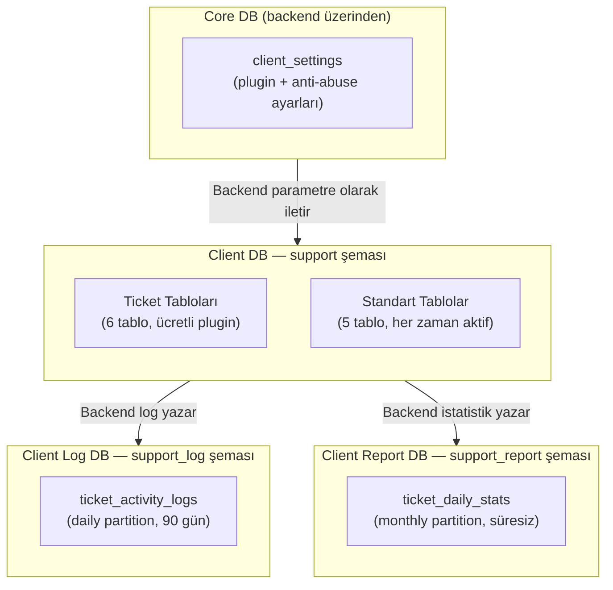
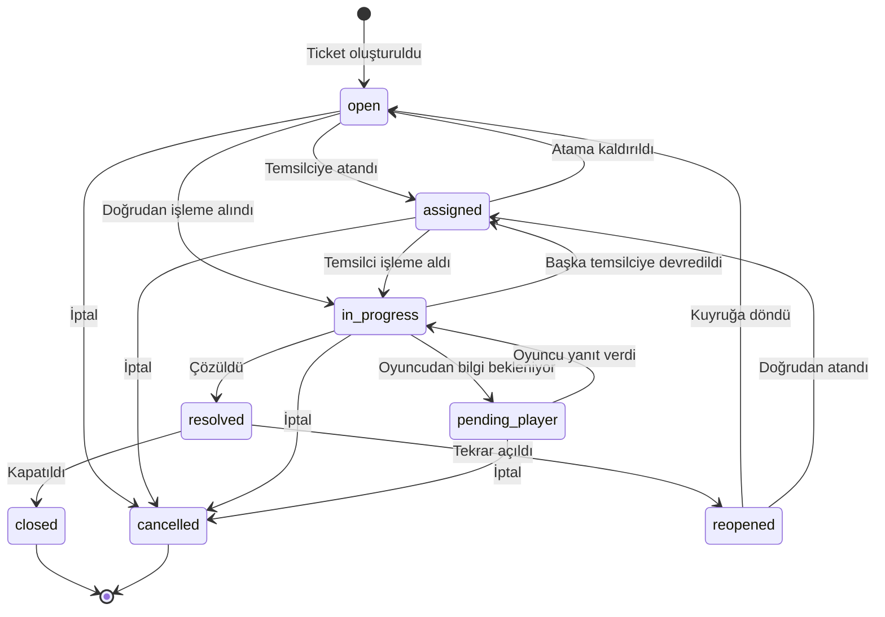
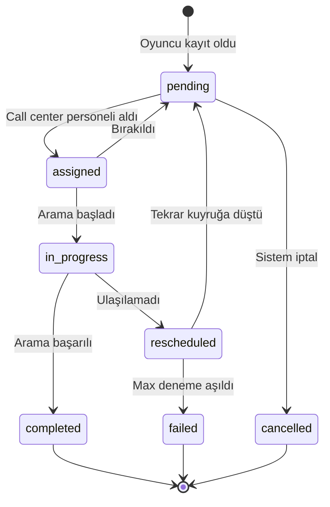

# SPEC_CALL_CENTER: Çağrı Merkezi ve Müşteri Destek Sistemi

Oyuncu destek sistemi üç alt sistemden oluşur: **Ticket Sistemi** (ücretli plugin), **Temsilci Atama** ve **Hoşgeldin Araması** (standart hizmetler). Tüm veriler Client DB `support` şemasında, bildirim logları Client Log DB `support_log` şemasında, istatistikler Client Report DB `support_report` şemasında tutulur.

> İlgili spesifikasyonlar: [SPEC_PLAYER_AUTH_KYC.md](SPEC_PLAYER_AUTH_KYC.md) (oyuncu kimlik), [SPEC_SITE_MANAGEMENT.md](SPEC_SITE_MANAGEMENT.md) (client ayarları, menü yapısı)

---

## 1. Kapsam ve Veritabanı Dağılımı

### 1.1 Kapsam Özeti

| Metrik | Değer |
|--------|-------|
| Toplam fonksiyon | 43 |
| Veritabanı | 3 (Client DB, Client Log DB, Client Report DB) |
| Şema | 3 (`support`, `support_log`, `support_report`) |
| Tablo | 13 (11 Client + 1 Log + 1 Report) |
| Alt sistem | 3 (Ticket, Temsilci Atama, Hoşgeldin Araması) |
| Hizmet modeli | Ticket = ücretli plugin; Temsilci + Hoşgeldin = standart |

### 1.2 Alt Sistem Dağılımı

| # | Alt Sistem | Tür | Fonksiyon | Kontrol |
|---|------------|-----|-----------|---------|
| 1 | **Ticket Sistemi** | Ücretli plugin | 26 | `ticket_plugin_enabled` client ayarı |
| 2 | **Temsilci Atama** | Standart | 3 | Her zaman aktif |
| 3 | **Hoşgeldin Araması** | Standart | 5 | Her zaman aktif |
| 4 | **Oyuncu Notları** | Standart | 4 | Her zaman aktif |
| 5 | **Agent Ayarları** | Standart | 3 | Her zaman aktif |
| 6 | **Dashboard** | Ücretli plugin | 2 | `ticket_plugin_enabled` |

### 1.3 Veritabanı Dağılım Tablosu

| DB | Şema | Fonksiyon | Tablo | Açıklama |
|----|------|-----------|-------|----------|
| Client DB | `support` | 43 | 11 | Tüm iş mantığı, CRUD, durum geçişleri |
| Client Log DB | `support_log` | 0 | 1 | Bildirim gönderim logları (daily partition) |
| Client Report DB | `support_report` | 0 | 1 | Günlük istatistikler (monthly partition) |

> **Cross-DB ilişki:** Core DB'den `ticket_plugin_enabled` ve anti-abuse ayarları backend tarafından okunup Client DB fonksiyonlarına parametre olarak iletilir. Client DB fonksiyonları Core DB'ye doğrudan erişmez.

### 1.4 DB Topolojisi

### 1.5 Plugin Kontrol Modeli

| Hizmet Grubu | `ticket_plugin_enabled = false` | `= true` |
|--------------|--------------------------------|-----------|
| `player_representative_*` | Çalışır | Çalışır |
| `welcome_call_task_*` | Çalışır | Çalışır |
| `agent_setting_*` | Çalışır | Çalışır |
| `player_note_*` | Çalışır | Çalışır |
| `ticket_*`, `player_ticket_*` | **Engellenir** | Çalışır |
| `ticket_category_*`, `ticket_tag_*` | **Engellenir** | Çalışır |
| `canned_response_*` | **Engellenir** | Çalışır |
| Dashboard & kuyruk | **Engellenir** | Çalışır |

> **Plugin kontrolü backend'de yapılır.** Client DB fonksiyonları plugin durumunu bilmez — backend `ticket_plugin_enabled = false` ise Client DB'ye çağrı yapmaz.

### 1.6 Client Settings Key'leri

#### Plugin Aktivasyonu (`'Plugin'` kategorisi — sadece superadmin/admin)

| Key | Tip | Varsayılan | Açıklama |
|-----|-----|------------|----------|
| `ticket_plugin_enabled` | `boolean` | `false` | Ticket plugin aktif mi? |

#### Anti-Abuse Ayarları (`'Support'` kategorisi — clientadmin+)

| Key | Tip | Varsayılan | Açıklama |
|-----|-----|------------|----------|
| `support_max_open_tickets_per_player` | `integer` | `1` | Aynı anda açık ticket limiti. `0` = limitsiz |
| `support_ticket_cooldown_minutes` | `integer` | `0` | Ticket kapandıktan sonra bekleme süresi (dk). `0` = yok |

---

## 2. Durum Makinaları ve İş Akışları

### 2.1 Ticket Durum Makinası

### 2.2 Ticket Durumları

| Kod | Durum | Açıklama | Final? |
|-----|-------|----------|--------|
| `open` | Açık | Yeni ticket, kimse almamış | Hayır |
| `assigned` | Atandı | Temsilciye atandı, henüz başlamadı | Hayır |
| `in_progress` | İşlemde | Aktif olarak işleniyor | Hayır |
| `pending_player` | Oyuncu Bekliyor | Oyuncudan yanıt/bilgi bekleniyor | Hayır |
| `resolved` | Çözüldü | Temsilci çözdü | Hayır |
| `closed` | Kapatıldı | Final durum | Evet |
| `reopened` | Tekrar Açıldı | Çözülen/kapatılan tekrar açıldı | Hayır |
| `cancelled` | İptal | Final durum | Evet |

### 2.3 Ticket Durum Geçiş Kuralları

| Mevcut Durum | Yeni Durum | Fonksiyon | Koşul |
|-------------|------------|-----------|-------|
| `open` | `assigned` | `ticket_assign` | Temsilci ID gerekli |
| `open` | `cancelled` | `ticket_cancel` | — |
| `assigned` | `in_progress` | (otomatik) | Temsilci işleme aldığında |
| `assigned` | `open` | `ticket_assign` | Atama kaldırıldığında |
| `assigned` | `cancelled` | `ticket_cancel` | — |
| `in_progress` | `pending_player` | `ticket_reply_player` | Bilgi talep edildiğinde |
| `in_progress` | `resolved` | `ticket_resolve` | — |
| `in_progress` | `assigned` | `ticket_assign` | Başka temsilciye devir |
| `in_progress` | `cancelled` | `ticket_cancel` | — |
| `pending_player` | `in_progress` | `player_ticket_reply` / `ticket_reply_player` | Yanıt geldiğinde otomatik |
| `pending_player` | `cancelled` | `ticket_cancel` | — |
| `resolved` | `closed` | `ticket_close` | Sadece `resolved`'dan |
| `resolved` | `reopened` | `ticket_reopen` | Oyuncu veya temsilci |
| `closed` | `reopened` | `ticket_reopen` | Oyuncu veya temsilci |
| `reopened` | `assigned` | `ticket_assign` | Doğrudan atama |

### 2.4 Ticket Aksiyon Tipleri

`ticket_actions.action` kolonunda kaydedilen değerler:

| Action | Açıklama | performed_by_type | Durum Değişimi |
|--------|----------|-------------------|----------------|
| `CREATED` | Ticket oluşturuldu | PLAYER / BO_USER | → `open` |
| `ASSIGNED` | Temsilciye atandı | BO_USER | → `assigned` |
| `REASSIGNED` | Başka temsilciye devredildi | BO_USER | → `assigned` |
| `UNASSIGNED` | Atama kaldırıldı | BO_USER | → `open` |
| `STARTED` | İşleme alındı | BO_USER | → `in_progress` |
| `PENDING_PLAYER` | Oyuncudan bilgi bekleniyor | BO_USER | → `pending_player` |
| `REPLIED_INTERNAL` | Dahili not eklendi | BO_USER | — (durum değişmez) |
| `REPLIED_PLAYER` | Oyuncuya yanıt | BO_USER | — veya → `in_progress` |
| `PLAYER_REPLIED` | Oyuncu yanıt verdi | PLAYER | → `in_progress` (pending_player'dan) |
| `RESOLVED` | Çözüldü | BO_USER | → `resolved` |
| `CLOSED` | Kapatıldı | BO_USER / SYSTEM | → `closed` |
| `REOPENED` | Tekrar açıldı | PLAYER / BO_USER | → `reopened` |
| `CANCELLED` | İptal edildi | PLAYER / BO_USER | → `cancelled` |
| `PRIORITY_CHANGED` | Öncelik değiştirildi | BO_USER | — (durum değişmez) |
| `CATEGORY_CHANGED` | Kategori değiştirildi | BO_USER | — (durum değişmez) |
| `TAG_ADDED` | Etiket eklendi | BO_USER | — (durum değişmez) |
| `TAG_REMOVED` | Etiket kaldırıldı | BO_USER | — (durum değişmez) |

### 2.5 Hoşgeldin Araması Durum Makinası

### 2.6 Hoşgeldin Araması Durumları

| Kod | Durum | Açıklama | Final? |
|-----|-------|----------|--------|
| `pending` | Bekliyor | Kuyrukte, atanmamış | Hayır |
| `assigned` | Atandı | Call center personeline atandı | Hayır |
| `in_progress` | İşlemde | Arama devam ediyor | Hayır |
| `completed` | Tamamlandı | Arama başarılı | Evet |
| `rescheduled` | Yeniden Planlandı | Ulaşılamadı, tekrar denenecek | Hayır |
| `failed` | Başarısız | Max deneme aşıldı veya yanlış numara | Evet |
| `cancelled` | İptal | Sistem tarafından iptal | Evet |

### 2.7 Arama Sonuçları

| Sonuç | Açıklama | Sonraki Durum |
|-------|----------|---------------|
| `answered` | Oyuncu cevap verdi | → `completed` |
| `no_answer` | Cevap yok | → `rescheduled` (veya `failed`) |
| `busy` | Hat meşgul | → `rescheduled` (veya `failed`) |
| `voicemail` | Sesli mesaja düştü | → `rescheduled` (veya `failed`) |
| `wrong_number` | Yanlış numara | → `failed` |
| `declined` | Oyuncu reddetti | → `completed` |

> **Max deneme mantığı:** `attempt_count + 1 >= max_attempts` ise `rescheduled` yerine `failed` olur. Varsayılan `max_attempts = 3`.

---

## 3. Veri Modeli

### 3.1 Client DB — `support` Şeması

#### 3.1.1 `support.ticket_categories`

Hiyerarşik kategori ağacı. JSONB çok dilli ad/açıklama desteği.

| Kolon | Tip | Constraint | Varsayılan | Açıklama |
|-------|-----|-----------|------------|----------|
| `id` | BIGSERIAL | PK | — | Kategori ID |
| `parent_id` | BIGINT | FK (self) | NULL | Üst kategori (NULL = kök) |
| `code` | VARCHAR(50) | NOT NULL | — | Benzersiz kod (aktifler arasında) |
| `name` | JSONB | NOT NULL | — | Çok dilli ad `{"tr":"...","en":"..."}` |
| `description` | JSONB | — | — | Çok dilli açıklama |
| `display_order` | INT | NOT NULL | `0` | Sıralama |
| `is_active` | BOOLEAN | NOT NULL | `true` | Soft delete |
| `created_at` | TIMESTAMPTZ | NOT NULL | `NOW()` | Oluşturma |
| `updated_at` | TIMESTAMPTZ | NOT NULL | `NOW()` | Güncelleme |

**Unique:** `uq_ticket_categories_code` — `(code) WHERE is_active = true`
**FK:** `fk_ticket_categories_parent` — `parent_id → ticket_categories(id)`

#### 3.1.2 `support.tickets`

Ana ticket tablosu. Tüm kanallardan gelen talepler.

| Kolon | Tip | Constraint | Varsayılan | Açıklama |
|-------|-----|-----------|------------|----------|
| `id` | BIGSERIAL | PK | — | Ticket ID |
| `player_id` | BIGINT | NOT NULL | — | Oyuncu ID (cross-DB) |
| `category_id` | BIGINT | FK | — | Kategori |
| `channel` | VARCHAR(20) | NOT NULL | — | Kanal: `phone`, `live_chat`, `email`, `social_media` |
| `subject` | VARCHAR(255) | NOT NULL | — | Başlık |
| `description` | TEXT | NOT NULL | — | Açıklama |
| `priority` | SMALLINT | NOT NULL | `1` | 0=low, 1=normal, 2=high, 3=urgent |
| `status` | VARCHAR(20) | NOT NULL | `'open'` | Ticket durumu (8 değer) |
| `assigned_to_id` | BIGINT | — | — | Atanan temsilci (cross-DB) |
| `assigned_at` | TIMESTAMPTZ | — | — | Atama zamanı |
| `created_by_id` | BIGINT | NOT NULL | — | Oluşturan (oyuncu veya BO kullanıcı) |
| `created_by_type` | VARCHAR(10) | NOT NULL | — | `PLAYER` veya `BO_USER` |
| `resolved_by_id` | BIGINT | — | — | Çözen temsilci |
| `resolved_at` | TIMESTAMPTZ | — | — | Çözüm zamanı |
| `closed_at` | TIMESTAMPTZ | — | — | Kapatma zamanı |
| `created_at` | TIMESTAMPTZ | NOT NULL | `NOW()` | Oluşturma |
| `updated_at` | TIMESTAMPTZ | NOT NULL | `NOW()` | Son güncelleme |

**FK:** `fk_tickets_category` — `category_id → ticket_categories(id)`

#### 3.1.3 `support.ticket_actions`

Immutable aksiyon logu. Her durum değişikliği ve yanıt kaydedilir.

| Kolon | Tip | Constraint | Varsayılan | Açıklama |
|-------|-----|-----------|------------|----------|
| `id` | BIGSERIAL | PK | — | Aksiyon ID |
| `ticket_id` | BIGINT | FK, NOT NULL | — | İlişkili ticket |
| `action` | VARCHAR(30) | NOT NULL | — | Aksiyon tipi (17 değer) |
| `performed_by_id` | BIGINT | — | — | İşlemi yapan |
| `performed_by_type` | VARCHAR(10) | NOT NULL | — | `PLAYER`, `BO_USER`, `SYSTEM` |
| `old_status` | VARCHAR(20) | — | — | Önceki durum |
| `new_status` | VARCHAR(20) | — | — | Yeni durum |
| `content` | TEXT | — | — | Yanıt/not içeriği |
| `is_internal` | BOOLEAN | NOT NULL | `false` | Dahili not? (oyuncuya gizli) |
| `channel` | VARCHAR(20) | — | — | Yanıt kanalı |
| `action_data` | JSONB | — | — | Ek veri (öncelik değişikliği vb.) |
| `created_at` | TIMESTAMPTZ | NOT NULL | `NOW()` | Oluşturma |

**FK:** `fk_ticket_actions_ticket` — `ticket_id → tickets(id)`

#### 3.1.4 `support.ticket_tags`

Yeniden kullanılabilir etiketler.

| Kolon | Tip | Constraint | Varsayılan | Açıklama |
|-------|-----|-----------|------------|----------|
| `id` | BIGSERIAL | PK | — | Tag ID |
| `name` | VARCHAR(50) | NOT NULL | — | Etiket adı |
| `color` | VARCHAR(7) | NOT NULL | `'#6B7280'` | HEX renk kodu |
| `is_active` | BOOLEAN | NOT NULL | `true` | Soft delete |
| `created_at` | TIMESTAMPTZ | NOT NULL | `NOW()` | Oluşturma |

**Unique:** `uq_ticket_tags_name` — `(name) WHERE is_active = true`

#### 3.1.5 `support.ticket_tag_assignments`

M:N ticket ↔ tag ilişkisi.

| Kolon | Tip | Constraint | Varsayılan | Açıklama |
|-------|-----|-----------|------------|----------|
| `id` | BIGSERIAL | PK | — | Atama ID |
| `ticket_id` | BIGINT | FK, NOT NULL | — | Ticket |
| `tag_id` | BIGINT | FK, NOT NULL | — | Tag |
| `assigned_by` | BIGINT | — | — | Atayan kullanıcı |
| `assigned_at` | TIMESTAMPTZ | NOT NULL | `NOW()` | Atama zamanı |

**Unique:** `uq_ticket_tag_assignment` — `(ticket_id, tag_id)`
**FK:** `fk_tag_assignments_ticket` — `ticket_id → tickets(id)`, `fk_tag_assignments_tag` — `tag_id → ticket_tags(id)`

#### 3.1.6 `support.canned_responses`

Hazır yanıt şablonları.

| Kolon | Tip | Constraint | Varsayılan | Açıklama |
|-------|-----|-----------|------------|----------|
| `id` | BIGSERIAL | PK | — | Yanıt ID |
| `category_id` | BIGINT | FK | — | İlişkili kategori (opsiyonel) |
| `title` | VARCHAR(100) | NOT NULL | — | Şablon başlığı |
| `content` | TEXT | NOT NULL | — | Yanıt içeriği |
| `is_active` | BOOLEAN | NOT NULL | `true` | Soft delete |
| `created_by` | BIGINT | — | — | Oluşturan |
| `created_at` | TIMESTAMPTZ | NOT NULL | `NOW()` | Oluşturma |
| `updated_at` | TIMESTAMPTZ | NOT NULL | `NOW()` | Güncelleme |

**FK:** `fk_canned_responses_category` — `category_id → ticket_categories(id)`

#### 3.1.7 `support.player_notes`

Ticket'tan bağımsız CRM tarzı oyuncu notları.

| Kolon | Tip | Constraint | Varsayılan | Açıklama |
|-------|-----|-----------|------------|----------|
| `id` | BIGSERIAL | PK | — | Not ID |
| `player_id` | BIGINT | NOT NULL | — | Oyuncu ID (cross-DB) |
| `note_type` | VARCHAR(20) | NOT NULL | `'general'` | `general`, `warning`, `vip`, `compliance` |
| `content` | TEXT | NOT NULL | — | Not içeriği |
| `is_pinned` | BOOLEAN | NOT NULL | `false` | Sabitlenmiş not |
| `created_by` | BIGINT | NOT NULL | — | Oluşturan (cross-DB) |
| `is_active` | BOOLEAN | NOT NULL | `true` | Soft delete |
| `created_at` | TIMESTAMPTZ | NOT NULL | `NOW()` | Oluşturma |
| `updated_at` | TIMESTAMPTZ | NOT NULL | `NOW()` | Güncelleme |

#### 3.1.8 `support.agent_settings`

Per-client agent profili: müsaitlik, kapasite, yetenekler.

| Kolon | Tip | Constraint | Varsayılan | Açıklama |
|-------|-----|-----------|------------|----------|
| `id` | BIGSERIAL | PK | — | Ayar ID |
| `user_id` | BIGINT | NOT NULL | — | BO kullanıcı ID (cross-DB) |
| `display_name` | VARCHAR(100) | — | — | Görünen ad |
| `is_available` | BOOLEAN | NOT NULL | `false` | Müsait mi? |
| `max_concurrent_tickets` | INT | NOT NULL | `10` | Eşzamanlı max ticket |
| `skills` | JSONB | NOT NULL | `'[]'` | Yetenek listesi |
| `is_active` | BOOLEAN | NOT NULL | `true` | Soft delete |
| `created_at` | TIMESTAMPTZ | NOT NULL | `NOW()` | Oluşturma |
| `updated_at` | TIMESTAMPTZ | NOT NULL | `NOW()` | Güncelleme |

**Unique:** `uq_agent_settings_user` — `(user_id) WHERE is_active = true`

#### 3.1.9 `support.player_representatives`

Oyuncu ↔ temsilci kalıcı atama. Her oyuncunun tek temsilcisi olabilir.

| Kolon | Tip | Constraint | Varsayılan | Açıklama |
|-------|-----|-----------|------------|----------|
| `id` | BIGSERIAL | PK | — | Atama ID |
| `player_id` | BIGINT | NOT NULL | — | Oyuncu ID (cross-DB) |
| `representative_id` | BIGINT | NOT NULL | — | Temsilci ID (cross-DB) |
| `assigned_by` | BIGINT | NOT NULL | — | Atayan (cross-DB) |
| `note` | VARCHAR(500) | — | — | Atama notu |
| `assigned_at` | TIMESTAMPTZ | NOT NULL | `NOW()` | Atama zamanı |

**Unique:** `uq_player_representative` — `(player_id)` — her oyuncuya tek temsilci

#### 3.1.10 `support.player_representative_history`

Immutable atama değişiklik tarihçesi.

| Kolon | Tip | Constraint | Varsayılan | Açıklama |
|-------|-----|-----------|------------|----------|
| `id` | BIGSERIAL | PK | — | Kayıt ID |
| `player_id` | BIGINT | NOT NULL | — | Oyuncu ID |
| `old_representative_id` | BIGINT | — | — | Önceki temsilci (ilk atamada NULL) |
| `new_representative_id` | BIGINT | NOT NULL | — | Yeni temsilci |
| `changed_by` | BIGINT | NOT NULL | — | Değiştiren |
| `change_reason` | VARCHAR(500) | NOT NULL | — | Değişiklik nedeni (zorunlu) |
| `changed_at` | TIMESTAMPTZ | NOT NULL | `NOW()` | Değişiklik zamanı |

#### 3.1.11 `support.welcome_call_tasks`

Hoşgeldin araması görevleri. Oyuncu kayıt sonrası otomatik oluşturulur.

| Kolon | Tip | Constraint | Varsayılan | Açıklama |
|-------|-----|-----------|------------|----------|
| `id` | BIGSERIAL | PK | — | Görev ID |
| `player_id` | BIGINT | NOT NULL | — | Oyuncu ID (cross-DB) |
| `status` | VARCHAR(20) | NOT NULL | `'pending'` | Görev durumu (7 değer) |
| `assigned_to_id` | BIGINT | — | — | Atanan personel |
| `assigned_at` | TIMESTAMPTZ | — | — | Atama zamanı |
| `call_result` | VARCHAR(20) | — | — | Arama sonucu (6 değer) |
| `call_notes` | TEXT | — | — | Arama notları |
| `call_duration_seconds` | INT | — | — | Arama süresi (sn) |
| `attempt_count` | SMALLINT | NOT NULL | `0` | Deneme sayısı |
| `max_attempts` | SMALLINT | NOT NULL | `3` | Max deneme |
| `next_attempt_at` | TIMESTAMPTZ | — | — | Sonraki deneme zamanı |
| `completed_at` | TIMESTAMPTZ | — | — | Tamamlanma zamanı |
| `created_at` | TIMESTAMPTZ | NOT NULL | `NOW()` | Oluşturma |
| `updated_at` | TIMESTAMPTZ | NOT NULL | `NOW()` | Güncelleme |

**Unique:** `uq_welcome_call_tasks_active_player` — `(player_id) WHERE status NOT IN ('completed', 'failed', 'cancelled')` — aktif oyuncu başına tek görev

### 3.2 Client Log DB — `support_log` Şeması

#### 3.2.1 `support_log.ticket_activity_logs` (Partitioned)

Bildirim gönderim logları. Daily partition, 90 gün retention.

| Kolon | Tip | Constraint | Varsayılan | Açıklama |
|-------|-----|-----------|------------|----------|
| `id` | BIGSERIAL | NOT NULL | — | Log ID |
| `ticket_id` | BIGINT | NOT NULL | — | İlişkili ticket |
| `notification_type` | VARCHAR(30) | NOT NULL | — | `ticket_created`, `ticket_assigned`, `ticket_replied`, `ticket_resolved`, `ticket_closed` |
| `channel` | VARCHAR(20) | NOT NULL | — | `email`, `sms`, `push`, `internal` |
| `recipient_id` | BIGINT | NOT NULL | — | Alıcı ID |
| `recipient_type` | VARCHAR(10) | NOT NULL | — | `PLAYER`, `BO_USER` |
| `status` | VARCHAR(20) | NOT NULL | `'pending'` | `pending`, `sent`, `failed` |
| `error_message` | TEXT | — | — | Hata mesajı |
| `created_at` | TIMESTAMPTZ | NOT NULL | `NOW()` | Oluşturma |
| `sent_at` | TIMESTAMPTZ | — | — | Gönderim zamanı |

**PK:** `(id, created_at)` — composite, partition key dahil
**Partition:** `RANGE (created_at)` — daily, 90 gün retention

### 3.3 Client Report DB — `support_report` Şeması

#### 3.3.1 `support_report.ticket_daily_stats` (Partitioned)

Günlük ticket istatistikleri. Monthly partition, süresiz retention.

| Kolon | Tip | Constraint | Varsayılan | Açıklama |
|-------|-----|-----------|------------|----------|
| `id` | BIGSERIAL | NOT NULL | — | Kayıt ID |
| `report_date` | DATE | NOT NULL | — | Rapor tarihi |
| `category_id` | BIGINT | — | — | Kategori (NULL = genel toplam) |
| `channel` | VARCHAR(20) | — | — | Kanal (NULL = genel toplam) |
| `representative_id` | BIGINT | — | — | Temsilci (NULL = genel toplam) |
| `tickets_opened` | INT | NOT NULL | `0` | Açılan ticket |
| `tickets_closed` | INT | NOT NULL | `0` | Kapatılan ticket |
| `tickets_resolved` | INT | NOT NULL | `0` | Çözülen ticket |
| `tickets_cancelled` | INT | NOT NULL | `0` | İptal edilen ticket |
| `tickets_reopened` | INT | NOT NULL | `0` | Tekrar açılan ticket |
| `avg_resolution_minutes` | INT | — | — | Ortalama çözüm süresi (dk) |
| `welcome_calls_completed` | INT | NOT NULL | `0` | Tamamlanan aramalar |
| `welcome_calls_failed` | INT | NOT NULL | `0` | Başarısız aramalar |
| `representatives_assigned` | INT | NOT NULL | `0` | Atanan temsilciler |
| `created_at` | TIMESTAMPTZ | NOT NULL | `NOW()` | Oluşturma |

**PK:** `(id, report_date)` — composite, partition key dahil
**Partition:** `RANGE (report_date)` — monthly, süresiz retention

---

## 4. Fonksiyon Spesifikasyonları

### 4.1 Ticket Yönetimi — BO (11 fonksiyon)

#### `support.ticket_create`

| Parametre | Tip | Zorunlu | Varsayılan | Açıklama |
|-----------|-----|---------|------------|----------|
| p_player_id | BIGINT | Evet | — | Oyuncu ID |
| p_channel | VARCHAR(20) | Evet | — | Kanal: `phone`, `live_chat`, `email`, `social_media` |
| p_subject | VARCHAR(255) | Evet | — | Başlık |
| p_description | TEXT | Evet | — | Açıklama |
| p_category_id | BIGINT | Hayır | NULL | Kategori ID |
| p_priority | SMALLINT | Hayır | `1` | 0=low, 1=normal, 2=high, 3=urgent |
| p_created_by_id | BIGINT | Hayır | NULL | Oluşturan (NULL ise p_player_id) |
| p_created_by_type | VARCHAR(10) | Hayır | `'BO_USER'` | `PLAYER` veya `BO_USER` |

**Dönüş:** `BIGINT` (yeni ticket ID)

**İş Kuralları:**
1. `p_player_id` NULL olamaz.
2. `p_subject` NULL veya boş olamaz.
3. `p_description` NULL veya boş olamaz.
4. `p_channel` geçerli değerler: `phone`, `live_chat`, `email`, `social_media`.
5. `p_priority` 0-3 arasında olmalı.
6. `p_created_by_type` geçerli değerler: `PLAYER`, `BO_USER`.
7. `p_category_id` verilmişse aktif kategori olmalı.
8. Ticket `status = 'open'` ile INSERT edilir. `created_by_id` COALESCE ile `p_player_id`'ye düşer.
9. `ticket_actions` tablosuna `CREATED` aksiyonu kaydedilir (`content = LEFT(p_description, 500)`).
10. Anti-abuse kontrolü **yoktur** — BO fonksiyonu olarak tasarlanmıştır.

**Hata Kodları:**

| Hata Key | ERRCODE | Koşul |
|----------|---------|-------|
| `error.support.player-required` | P0400 | p_player_id NULL |
| `error.support.subject-required` | P0400 | p_subject NULL/boş |
| `error.support.description-required` | P0400 | p_description NULL/boş |
| `error.support.invalid-channel` | P0400 | Geçersiz kanal |
| `error.support.invalid-priority` | P0400 | Priority 0-3 dışı |
| `error.support.invalid-created-by-type` | P0400 | Geçersiz tip |
| `error.support.category-not-found` | P0404 | Kategori bulunamadı/pasif |

---

#### `support.ticket_get`

| Parametre | Tip | Zorunlu | Varsayılan | Açıklama |
|-----------|-----|---------|------------|----------|
| p_ticket_id | BIGINT | Evet | — | Ticket ID |

**Dönüş:** `JSONB`

**Dönüş Yapısı:**

| Alan | Tip | Açıklama |
|------|-----|----------|
| id | BIGINT | Ticket ID |
| playerId | BIGINT | Oyuncu ID |
| categoryId | BIGINT? | Kategori ID |
| categoryName | TEXT? | Kategori adı |
| channel | VARCHAR | Kanal |
| subject | VARCHAR | Başlık |
| description | TEXT | Açıklama |
| priority | SMALLINT | Öncelik |
| status | VARCHAR | Durum |
| assignedToId | BIGINT? | Atanan temsilci |
| assignedAt | TIMESTAMPTZ? | Atama zamanı |
| createdById | BIGINT | Oluşturan |
| createdByType | VARCHAR | Oluşturan tipi |
| resolvedById | BIGINT? | Çözen |
| resolvedAt | TIMESTAMPTZ? | Çözüm zamanı |
| closedAt | TIMESTAMPTZ? | Kapatma zamanı |
| createdAt | TIMESTAMPTZ | Oluşturma |
| updatedAt | TIMESTAMPTZ | Güncelleme |
| tags | JSONB[] | Etiketler (id, name, color) |
| actions | JSONB[] | Aksiyon geçmişi (dahili notlar dahil) |

**`tags` öğe yapısı:**

| Alan | Tip | Açıklama |
|------|-----|----------|
| id | BIGINT | Tag ID |
| name | TEXT | Etiket adı |
| color | TEXT | HEX renk |

**`actions` öğe yapısı:**

| Alan | Tip | Açıklama |
|------|-----|----------|
| id | BIGINT | Aksiyon ID |
| action | VARCHAR | Aksiyon tipi |
| performedById | BIGINT | İşlemi yapan |
| performedByType | VARCHAR | Yapan tipi |
| oldStatus | VARCHAR? | Önceki durum |
| newStatus | VARCHAR? | Yeni durum |
| content | TEXT? | İçerik |
| isInternal | BOOLEAN | Dahili mi? |
| channel | VARCHAR? | Yanıt kanalı |
| actionData | JSONB? | Ek veri |
| createdAt | TIMESTAMPTZ | Oluşturma |

**İş Kuralları:**
1. Ticket yoksa hata.
2. Tüm aksiyonlar (dahili notlar dahil) döndürülür — BO perspektifi.
3. Etiketler sadece aktif olanlar döndürülür.
4. Aksiyonlar `created_at ASC` sıralı.

**Hata Kodları:**

| Hata Key | ERRCODE | Koşul |
|----------|---------|-------|
| `error.support.ticket-not-found` | P0404 | Ticket bulunamadı |

---

#### `support.ticket_list`

| Parametre | Tip | Zorunlu | Varsayılan | Açıklama |
|-----------|-----|---------|------------|----------|
| p_status | VARCHAR(20) | Hayır | NULL | Durum filtresi |
| p_channel | VARCHAR(20) | Hayır | NULL | Kanal filtresi |
| p_priority | SMALLINT | Hayır | NULL | Öncelik filtresi |
| p_category_id | BIGINT | Hayır | NULL | Kategori filtresi |
| p_assigned_to_id | BIGINT | Hayır | NULL | Temsilci filtresi |
| p_player_id | BIGINT | Hayır | NULL | Oyuncu filtresi |
| p_search | VARCHAR(255) | Hayır | NULL | Konu araması (ILIKE) |
| p_date_from | TIMESTAMPTZ | Hayır | NULL | Başlangıç tarihi |
| p_date_to | TIMESTAMPTZ | Hayır | NULL | Bitiş tarihi |
| p_page | INT | Hayır | `1` | Sayfa |
| p_page_size | INT | Hayır | `20` | Sayfa boyutu |

**Dönüş:** `JSONB`

**Dönüş Yapısı:**

| Alan | Tip | Açıklama |
|------|-----|----------|
| items | JSONB[] | Ticket listesi |
| totalCount | BIGINT | Toplam kayıt |
| page | INT | Mevcut sayfa |
| pageSize | INT | Sayfa boyutu |

**`items` öğe yapısı:**

| Alan | Tip | Açıklama |
|------|-----|----------|
| id | BIGINT | Ticket ID |
| playerId | BIGINT | Oyuncu ID |
| categoryId | BIGINT? | Kategori ID |
| categoryName | TEXT? | Kategori adı |
| channel | VARCHAR | Kanal |
| subject | VARCHAR | Başlık |
| priority | SMALLINT | Öncelik |
| status | VARCHAR | Durum |
| assignedToId | BIGINT? | Atanan temsilci |
| assignedAt | TIMESTAMPTZ? | Atama zamanı |
| createdById | BIGINT | Oluşturan |
| createdByType | VARCHAR | Oluşturan tipi |
| createdAt | TIMESTAMPTZ | Oluşturma |
| updatedAt | TIMESTAMPTZ | Güncelleme |

> **Not:** Liste görünümünde `description` alanı döndürülmez (performans).

**İş Kuralları:**
1. Tüm filtreler NULL geçildiğinde uygulanmaz (NULL-passthrough).
2. `p_search` ILIKE ile `subject` üzerinde aranır.
3. Sıralama: `created_at DESC`.

**Hata Kodları:** Yok — hata fırlatmaz.

---

#### `support.ticket_update`

| Parametre | Tip | Zorunlu | Varsayılan | Açıklama |
|-----------|-----|---------|------------|----------|
| p_ticket_id | BIGINT | Evet | — | Ticket ID |
| p_performed_by_id | BIGINT | Evet | — | İşlemi yapan |
| p_priority | SMALLINT | Hayır | NULL | Yeni öncelik |
| p_category_id | BIGINT | Hayır | NULL | Yeni kategori |

**Dönüş:** `VOID`

**İş Kuralları:**
1. Ticket yoksa hata.
2. `closed` veya `cancelled` durumundaki ticket güncellenemez.
3. `p_priority` verilmişse ve farklıysa: 0-3 validasyonu, UPDATE, `PRIORITY_CHANGED` aksiyonu (`action_data = {"old": <eski>, "new": <yeni>}`).
4. `p_category_id` verilmişse ve farklıysa: aktif kategori kontrolü, UPDATE, `CATEGORY_CHANGED` aksiyonu (`action_data = {"old": <eski>, "new": <yeni>}`).
5. `performed_by_type` her zaman `'BO_USER'`.

**Hata Kodları:**

| Hata Key | ERRCODE | Koşul |
|----------|---------|-------|
| `error.support.ticket-not-found` | P0404 | Ticket bulunamadı |
| `error.support.ticket-closed` | P0409 | Ticket kapalı/iptal |
| `error.support.invalid-priority` | P0400 | Priority 0-3 dışı |
| `error.support.category-not-found` | P0404 | Kategori bulunamadı/pasif |

---

#### `support.ticket_assign`

| Parametre | Tip | Zorunlu | Varsayılan | Açıklama |
|-----------|-----|---------|------------|----------|
| p_ticket_id | BIGINT | Evet | — | Ticket ID |
| p_assigned_to_id | BIGINT | Evet | — | Atanacak temsilci |
| p_performed_by_id | BIGINT | Evet | — | İşlemi yapan |
| p_note | VARCHAR(500) | Hayır | NULL | Atama notu |

**Dönüş:** `VOID`

**İş Kuralları:**
1. Ticket yoksa hata.
2. Durum `open`, `assigned` veya `reopened` olmalı.
3. Aynı temsilciye tekrar atama yapılamaz.
4. Aksiyon tipi belirlenir: önceden atanmışsa `REASSIGNED`, ilk atamaysa `ASSIGNED`.
5. Ticket güncellenir: `assigned_to_id`, `assigned_at = NOW()`, `status = 'assigned'`.
6. `ticket_actions` kaydı: `action_data = {"assignedToId": <id>}`, `content = p_note`.

**Hata Kodları:**

| Hata Key | ERRCODE | Koşul |
|----------|---------|-------|
| `error.support.ticket-not-found` | P0404 | Ticket bulunamadı |
| `error.support.ticket-invalid-status` | P0409 | Geçersiz durum (open/assigned/reopened dışı) |
| `error.support.ticket-already-assigned` | P0409 | Zaten aynı temsilciye atanmış |

---

#### `support.ticket_add_note`

| Parametre | Tip | Zorunlu | Varsayılan | Açıklama |
|-----------|-----|---------|------------|----------|
| p_ticket_id | BIGINT | Evet | — | Ticket ID |
| p_performed_by_id | BIGINT | Evet | — | İşlemi yapan |
| p_content | TEXT | Evet | — | Not içeriği |
| p_is_internal | BOOLEAN | Hayır | `true` | Dahili not? |

**Dönüş:** `BIGINT` (yeni aksiyon ID)

**İş Kuralları:**
1. Ticket yoksa hata.
2. `closed` veya `cancelled` durumundaki ticket'a not eklenemez.
3. `p_content` NULL veya boş olamaz.
4. `REPLIED_INTERNAL` aksiyonu kaydedilir. `is_internal` varsayılan `true`.
5. Durum değişikliği **olmaz** — sadece not eklenir.
6. `tickets.updated_at` güncellenir.

**Hata Kodları:**

| Hata Key | ERRCODE | Koşul |
|----------|---------|-------|
| `error.support.ticket-not-found` | P0404 | Ticket bulunamadı |
| `error.support.ticket-closed` | P0409 | Ticket kapalı/iptal |
| `error.support.description-required` | P0400 | İçerik NULL/boş |

---

#### `support.ticket_reply_player`

| Parametre | Tip | Zorunlu | Varsayılan | Açıklama |
|-----------|-----|---------|------------|----------|
| p_ticket_id | BIGINT | Evet | — | Ticket ID |
| p_performed_by_id | BIGINT | Evet | — | İşlemi yapan |
| p_content | TEXT | Evet | — | Yanıt içeriği |
| p_channel | VARCHAR(20) | Hayır | NULL | Yanıt kanalı |

**Dönüş:** `BIGINT` (yeni aksiyon ID)

**İş Kuralları:**
1. Ticket yoksa hata.
2. `closed` veya `cancelled` durumundaki ticket'a yanıt verilemez.
3. `p_content` NULL veya boş olamaz.
4. `REPLIED_PLAYER` aksiyonu kaydedilir (`is_internal = false`).
5. **Otomatik durum geçişi:** Ticket `pending_player` durumundaysa → `in_progress`'e geçer. Aksiyon kaydındaki `old_status`/`new_status` ikinci bir UPDATE ile yazılır.
6. Diğer durumlarda sadece `tickets.updated_at` güncellenir.

**Hata Kodları:**

| Hata Key | ERRCODE | Koşul |
|----------|---------|-------|
| `error.support.ticket-not-found` | P0404 | Ticket bulunamadı |
| `error.support.ticket-closed` | P0409 | Ticket kapalı/iptal |
| `error.support.description-required` | P0400 | İçerik NULL/boş |

---

#### `support.ticket_resolve`

| Parametre | Tip | Zorunlu | Varsayılan | Açıklama |
|-----------|-----|---------|------------|----------|
| p_ticket_id | BIGINT | Evet | — | Ticket ID |
| p_performed_by_id | BIGINT | Evet | — | İşlemi yapan |
| p_resolution_note | VARCHAR(500) | Hayır | NULL | Çözüm notu |

**Dönüş:** `VOID`

**İş Kuralları:**
1. Ticket yoksa hata.
2. Durum `in_progress` veya `pending_player` olmalı.
3. Ticket güncellenir: `status = 'resolved'`, `resolved_by_id`, `resolved_at = NOW()`.
4. `RESOLVED` aksiyonu kaydedilir (`content = p_resolution_note`).

**Hata Kodları:**

| Hata Key | ERRCODE | Koşul |
|----------|---------|-------|
| `error.support.ticket-not-found` | P0404 | Ticket bulunamadı |
| `error.support.ticket-invalid-status` | P0409 | Geçersiz durum |

---

#### `support.ticket_close`

| Parametre | Tip | Zorunlu | Varsayılan | Açıklama |
|-----------|-----|---------|------------|----------|
| p_ticket_id | BIGINT | Evet | — | Ticket ID |
| p_performed_by_id | BIGINT | Evet | — | İşlemi yapan |
| p_note | VARCHAR(500) | Hayır | NULL | Kapatma notu |

**Dönüş:** `VOID`

**İş Kuralları:**
1. Ticket yoksa hata.
2. Durum **sadece** `resolved` olmalı — başka durumdan kapatılamaz.
3. Ticket güncellenir: `status = 'closed'`, `closed_at = NOW()`.
4. `CLOSED` aksiyonu kaydedilir (`old_status = 'resolved'` hardcoded).

**Hata Kodları:**

| Hata Key | ERRCODE | Koşul |
|----------|---------|-------|
| `error.support.ticket-not-found` | P0404 | Ticket bulunamadı |
| `error.support.ticket-invalid-status` | P0409 | Durum `resolved` değil |

---

#### `support.ticket_reopen`

| Parametre | Tip | Zorunlu | Varsayılan | Açıklama |
|-----------|-----|---------|------------|----------|
| p_ticket_id | BIGINT | Evet | — | Ticket ID |
| p_performed_by_id | BIGINT | Evet | — | İşlemi yapan |
| p_performed_by_type | VARCHAR(10) | Evet | — | `PLAYER` veya `BO_USER` |
| p_reason | VARCHAR(500) | Evet | — | Tekrar açma nedeni (zorunlu) |

**Dönüş:** `VOID`

**İş Kuralları:**
1. Ticket yoksa hata.
2. Durum `resolved` veya `closed` olmalı.
3. `p_performed_by_type` geçerli olmalı.
4. Ticket güncellenir: `status = 'reopened'`, `resolved_by_id = NULL`, `resolved_at = NULL`, `closed_at = NULL`.
5. `REOPENED` aksiyonu kaydedilir (`content = p_reason`).

> **Önemli:** Reopen sırasında tüm çözüm/kapatma zaman damgaları sıfırlanır.

**Hata Kodları:**

| Hata Key | ERRCODE | Koşul |
|----------|---------|-------|
| `error.support.ticket-not-found` | P0404 | Ticket bulunamadı |
| `error.support.ticket-invalid-status` | P0409 | Geçersiz durum |
| `error.support.invalid-created-by-type` | P0400 | Geçersiz aktör tipi |

---

#### `support.ticket_cancel`

| Parametre | Tip | Zorunlu | Varsayılan | Açıklama |
|-----------|-----|---------|------------|----------|
| p_ticket_id | BIGINT | Evet | — | Ticket ID |
| p_performed_by_id | BIGINT | Evet | — | İşlemi yapan |
| p_performed_by_type | VARCHAR(10) | Evet | — | `PLAYER` veya `BO_USER` |
| p_note | VARCHAR(500) | Hayır | NULL | İptal notu |

**Dönüş:** `VOID`

**İş Kuralları:**
1. Ticket yoksa hata.
2. `closed` veya `cancelled` durumundaki ticket iptal edilemez.
3. `p_performed_by_type` geçerli olmalı.
4. Diğer tüm durumlardan (`open`, `assigned`, `in_progress`, `pending_player`, `reopened`) iptal edilebilir.
5. `CANCELLED` aksiyonu kaydedilir.

**Hata Kodları:**

| Hata Key | ERRCODE | Koşul |
|----------|---------|-------|
| `error.support.ticket-not-found` | P0404 | Ticket bulunamadı |
| `error.support.ticket-closed` | P0409 | Zaten kapalı/iptal |
| `error.support.invalid-created-by-type` | P0400 | Geçersiz aktör tipi |

---

### 4.2 Ticket — Oyuncu (4 fonksiyon)

#### `support.player_ticket_create`

| Parametre | Tip | Zorunlu | Varsayılan | Açıklama |
|-----------|-----|---------|------------|----------|
| p_player_id | BIGINT | Evet | — | Oyuncu ID |
| p_channel | VARCHAR(20) | Evet | — | Kanal |
| p_subject | VARCHAR(255) | Evet | — | Başlık |
| p_description | TEXT | Evet | — | Açıklama |
| p_category_id | BIGINT | Hayır | NULL | Kategori ID |
| p_max_open_tickets | INT | Hayır | `1` | Max açık ticket (backend'den) |
| p_cooldown_minutes | INT | Hayır | `0` | Cooldown süresi (backend'den) |

**Dönüş:** `BIGINT` (yeni ticket ID)

**İş Kuralları:**
1. **Anti-abuse — açık ticket limiti:** `p_max_open_tickets > 0` ise oyuncunun açık ticketları sayılır (durumlar: `open`, `assigned`, `in_progress`, `pending_player`, `reopened`). Limit aşılmışsa hata (P0429).
2. **Anti-abuse — cooldown:** `p_cooldown_minutes > 0` ise son kapatılan/iptal edilen ticket zamanı kontrol edilir. Süre dolmamışsa hata (P0429). İnterval: `(p_cooldown_minutes || ' minutes')::INTERVAL`.
3. İç fonksiyon çağrısı: `support.ticket_create(...)` çağrılır — `p_priority = 1` (normal, hardcoded), `p_created_by_type = 'PLAYER'`, `p_created_by_id = p_player_id`.
4. `ticket_create`'in tüm validasyon hataları üst fonksiyona propagate olur.

> **Cross-DB notu:** Anti-abuse parametreleri (`p_max_open_tickets`, `p_cooldown_minutes`) backend tarafından `core.client_settings`'ten okunup iletilir. Bu fonksiyon Core DB'ye erişmez.

**Hata Kodları:**

| Hata Key | ERRCODE | Koşul |
|----------|---------|-------|
| `error.support.max-open-tickets-reached` | P0429 | Açık ticket limiti dolmuş |
| `error.support.ticket-cooldown-active` | P0429 | Cooldown süresi dolmamış |
| + `ticket_create` hataları | P0400/P0404 | Validasyon (propagate) |

---

#### `support.player_ticket_list`

| Parametre | Tip | Zorunlu | Varsayılan | Açıklama |
|-----------|-----|---------|------------|----------|
| p_player_id | BIGINT | Evet | — | Oyuncu ID |
| p_status | VARCHAR(20) | Hayır | NULL | Durum filtresi |
| p_page | INT | Hayır | `1` | Sayfa |
| p_page_size | INT | Hayır | `10` | Sayfa boyutu |

**Dönüş:** `JSONB`

**Dönüş Yapısı:**

| Alan | Tip | Açıklama |
|------|-----|----------|
| items | JSONB[] | Ticket listesi |
| totalCount | BIGINT | Toplam kayıt |
| page | INT | Mevcut sayfa |
| pageSize | INT | Sayfa boyutu |

**`items` öğe yapısı:**

| Alan | Tip | Açıklama |
|------|-----|----------|
| id | BIGINT | Ticket ID |
| subject | VARCHAR | Başlık |
| channel | VARCHAR | Kanal |
| status | VARCHAR | Durum |
| priority | SMALLINT | Öncelik |
| categoryName | TEXT? | Kategori adı |
| createdAt | TIMESTAMPTZ | Oluşturma |
| lastReplyAt | TIMESTAMPTZ? | Son temsilci yanıtı |
| hasUnreadReply | BOOLEAN | Okunmamış yanıt var mı? |

**İş Kuralları:**
1. Sadece oyuncunun kendi ticketları döner.
2. `lastReplyAt`: `ticket_actions` tablosundan `REPLIED_PLAYER` aksiyonu ve `is_internal = false` koşuluyla en son yanıt zamanı.
3. `hasUnreadReply`: Temsilcinin son yanıtı oyuncunun son aksiyonundan sonra mı? (`performed_by_type = 'PLAYER'` ile karşılaştırma).
4. Sıralama: `updated_at DESC`.
5. Dahili notlar dahil edilmez.

**Hata Kodları:** Yok — hata fırlatmaz.

---

#### `support.player_ticket_get`

| Parametre | Tip | Zorunlu | Varsayılan | Açıklama |
|-----------|-----|---------|------------|----------|
| p_player_id | BIGINT | Evet | — | Oyuncu ID |
| p_ticket_id | BIGINT | Evet | — | Ticket ID |

**Dönüş:** `JSONB`

**Dönüş Yapısı:**

| Alan | Tip | Açıklama |
|------|-----|----------|
| id | BIGINT | Ticket ID |
| playerId | BIGINT | Oyuncu ID |
| categoryId | BIGINT? | Kategori ID |
| categoryName | TEXT? | Kategori adı |
| channel | VARCHAR | Kanal |
| subject | VARCHAR | Başlık |
| description | TEXT | Açıklama |
| priority | SMALLINT | Öncelik |
| status | VARCHAR | Durum |
| createdAt | TIMESTAMPTZ | Oluşturma |
| updatedAt | TIMESTAMPTZ | Güncelleme |
| resolvedAt | TIMESTAMPTZ? | Çözüm zamanı |
| closedAt | TIMESTAMPTZ? | Kapatma zamanı |
| actions | JSONB[] | Aksiyon geçmişi (dahili hariç) |

**`actions` öğe yapısı (oyuncu perspektifi):**

| Alan | Tip | Açıklama |
|------|-----|----------|
| id | BIGINT | Aksiyon ID |
| action | VARCHAR | Aksiyon tipi |
| performedByType | VARCHAR | Yapan tipi |
| content | TEXT? | İçerik |
| channel | VARCHAR? | Yanıt kanalı |
| createdAt | TIMESTAMPTZ | Oluşturma |

> **Gizlenen alanlar:** `performedById`, `assignedToId`, `createdById`, `createdByType`, `resolvedById` oyuncu görünümünde yer almaz.

**İş Kuralları:**
1. Ticket oyuncuya ait olmalı (WHERE clause'da `player_id` kontrolü).
2. **IDOR koruması:** Ticket bulunur ama oyuncuya ait değilse → P0403. Ticket hiç yoksa → P0404. İki aşamalı hata ayrımı.
3. Sadece `is_internal = false` aksiyonları döndürülür.
4. Aksiyonlar `created_at ASC` sıralı.

**Hata Kodları:**

| Hata Key | ERRCODE | Koşul |
|----------|---------|-------|
| `error.support.ticket-not-owner` | P0403 | Ticket başka oyuncuya ait |
| `error.support.ticket-not-found` | P0404 | Ticket bulunamadı |

---

#### `support.player_ticket_reply`

| Parametre | Tip | Zorunlu | Varsayılan | Açıklama |
|-----------|-----|---------|------------|----------|
| p_player_id | BIGINT | Evet | — | Oyuncu ID |
| p_ticket_id | BIGINT | Evet | — | Ticket ID |
| p_content | TEXT | Evet | — | Yanıt içeriği |

**Dönüş:** `BIGINT` (yeni aksiyon ID)

**İş Kuralları:**
1. Ticket yoksa hata (P0404).
2. Sahiplik kontrolü ayrı IF ile yapılır (P0403).
3. `closed` veya `cancelled` durumundaki ticket'a yanıt verilemez.
4. `p_content` NULL veya boş olamaz.
5. `PLAYER_REPLIED` aksiyonu kaydedilir (`performed_by_type = 'PLAYER'`, `is_internal = false`).
6. **Otomatik durum geçişi:** `pending_player` → `in_progress` (aynı pattern: `ticket_reply_player` ile).
7. Diğer durumlarda sadece `tickets.updated_at` güncellenir.

**Hata Kodları:**

| Hata Key | ERRCODE | Koşul |
|----------|---------|-------|
| `error.support.ticket-not-found` | P0404 | Ticket bulunamadı |
| `error.support.ticket-not-owner` | P0403 | Başka oyuncuya ait |
| `error.support.ticket-closed` | P0409 | Ticket kapalı/iptal |
| `error.support.description-required` | P0400 | İçerik NULL/boş |

---

### 4.3 Oyuncu Notları — BO (4 fonksiyon)

#### `support.player_note_create`

| Parametre | Tip | Zorunlu | Varsayılan | Açıklama |
|-----------|-----|---------|------------|----------|
| p_player_id | BIGINT | Evet | — | Oyuncu ID |
| p_note_type | VARCHAR(20) | Hayır | `'general'` | Not tipi |
| p_content | TEXT | Evet | — | Not içeriği |
| p_is_pinned | BOOLEAN | Hayır | `false` | Sabitlenmiş mi? |
| p_created_by | BIGINT | Evet | — | Oluşturan BO kullanıcı |

**Dönüş:** `BIGINT` (yeni not ID)

**İş Kuralları:**
1. `p_player_id` NULL olamaz.
2. `p_content` NULL veya boş olamaz.
3. `p_created_by` NULL olamaz.
4. `p_note_type` geçerli değerler: `general`, `warning`, `vip`, `compliance`.
5. `is_active = true` ile INSERT edilir.

**Hata Kodları:**

| Hata Key | ERRCODE | Koşul |
|----------|---------|-------|
| `error.support.player-required` | P0400 | p_player_id NULL |
| `error.support.note-content-required` | P0400 | İçerik NULL/boş |
| `error.support.created-by-required` | P0400 | p_created_by NULL |
| `error.support.invalid-note-type` | P0400 | Geçersiz tip |

---

#### `support.player_note_list`

| Parametre | Tip | Zorunlu | Varsayılan | Açıklama |
|-----------|-----|---------|------------|----------|
| p_player_id | BIGINT | Evet | — | Oyuncu ID |
| p_note_type | VARCHAR(20) | Hayır | NULL | Tip filtresi |
| p_page | INT | Hayır | `1` | Sayfa |
| p_page_size | INT | Hayır | `20` | Sayfa boyutu |

**Dönüş:** `JSONB`

**Dönüş Yapısı:**

| Alan | Tip | Açıklama |
|------|-----|----------|
| items | JSONB[] | Not listesi |
| totalCount | BIGINT | Toplam kayıt |
| page | INT | Mevcut sayfa |
| pageSize | INT | Sayfa boyutu |

**`items` öğe yapısı:**

| Alan | Tip | Açıklama |
|------|-----|----------|
| id | BIGINT | Not ID |
| playerId | BIGINT | Oyuncu ID |
| noteType | VARCHAR | Not tipi |
| content | TEXT | İçerik |
| isPinned | BOOLEAN | Sabitlenmiş mi? |
| createdBy | BIGINT | Oluşturan |
| createdAt | TIMESTAMPTZ | Oluşturma |
| updatedAt | TIMESTAMPTZ | Güncelleme |

**İş Kuralları:**
1. Sadece aktif notlar döner (`is_active = true`).
2. `p_note_type` opsiyonel filtre.
3. Sıralama: `is_pinned DESC, created_at DESC` (pinned önce).

**Hata Kodları:** Yok — hata fırlatmaz.

---

#### `support.player_note_update`

| Parametre | Tip | Zorunlu | Varsayılan | Açıklama |
|-----------|-----|---------|------------|----------|
| p_note_id | BIGINT | Evet | — | Not ID |
| p_content | TEXT | Hayır | NULL | Yeni içerik |
| p_note_type | VARCHAR(20) | Hayır | NULL | Yeni tip |
| p_is_pinned | BOOLEAN | Hayır | NULL | Yeni pin durumu |

**Dönüş:** `VOID`

**İş Kuralları:**
1. Not yoksa hata (P0404).
2. Not silinmişse (`is_active = false`) hata (P0409).
3. `p_note_type` verilmişse geçerli olmalı.
4. Üç parametre de NULL ise hata (güncelleme yok).
5. COALESCE pattern ile güncelleme; `updated_at = NOW()`.

**Hata Kodları:**

| Hata Key | ERRCODE | Koşul |
|----------|---------|-------|
| `error.support.note-not-found` | P0404 | Not bulunamadı |
| `error.support.note-deleted` | P0409 | Not zaten silinmiş |
| `error.support.invalid-note-type` | P0400 | Geçersiz tip |
| `error.support.no-update-fields` | P0400 | Tüm alanlar NULL |

---

#### `support.player_note_delete`

| Parametre | Tip | Zorunlu | Varsayılan | Açıklama |
|-----------|-----|---------|------------|----------|
| p_note_id | BIGINT | Evet | — | Not ID |

**Dönüş:** `VOID`

**İş Kuralları:**
1. Not yoksa hata (P0404).
2. Zaten silinmişse (`is_active = false`) hata (P0409).
3. Soft delete: `is_active = false`, `updated_at = NOW()`.

**Hata Kodları:**

| Hata Key | ERRCODE | Koşul |
|----------|---------|-------|
| `error.support.note-not-found` | P0404 | Not bulunamadı |
| `error.support.note-already-deleted` | P0409 | Zaten silinmiş |

---

### 4.4 Agent Ayarları — BO (3 fonksiyon)

#### `support.agent_setting_upsert`

| Parametre | Tip | Zorunlu | Varsayılan | Açıklama |
|-----------|-----|---------|------------|----------|
| p_user_id | BIGINT | Evet | — | BO kullanıcı ID |
| p_display_name | VARCHAR(100) | Hayır | NULL | Görünen ad |
| p_is_available | BOOLEAN | Hayır | `false` | Müsait mi? |
| p_max_concurrent_tickets | INT | Hayır | `10` | Max eşzamanlı ticket |
| p_skills | TEXT | Hayır | NULL | Yetenek JSON string |

**Dönüş:** `BIGINT` (upsert edilen kayıt ID)

**İş Kuralları:**
1. `p_user_id` NULL olamaz.
2. `p_max_concurrent_tickets >= 1` olmalı.
3. `p_skills` verilmişse JSONB olarak parse edilir; parse hatası → P0400. NULL ise `'[]'::JSONB` varsayılan.
4. `INSERT ... ON CONFLICT (user_id) WHERE is_active = true DO UPDATE` — partial unique index kullanarak upsert.

**Hata Kodları:**

| Hata Key | ERRCODE | Koşul |
|----------|---------|-------|
| `error.support.user-id-required` | P0400 | p_user_id NULL |
| `error.support.invalid-max-tickets` | P0400 | max_concurrent < 1 |
| `error.support.invalid-skills-format` | P0400 | Skills JSONB parse hatası |

---

#### `support.agent_setting_get`

| Parametre | Tip | Zorunlu | Varsayılan | Açıklama |
|-----------|-----|---------|------------|----------|
| p_user_id | BIGINT | Evet | — | BO kullanıcı ID |

**Dönüş:** `JSONB` (veya NULL — kayıt yoksa hata fırlatmaz)

**Dönüş Yapısı:**

| Alan | Tip | Açıklama |
|------|-----|----------|
| id | BIGINT | Ayar ID |
| userId | BIGINT | Kullanıcı ID |
| displayName | VARCHAR? | Görünen ad |
| isAvailable | BOOLEAN | Müsait mi? |
| maxConcurrentTickets | INT | Max ticket |
| skills | JSONB | Yetenekler |
| createdAt | TIMESTAMPTZ | Oluşturma |
| updatedAt | TIMESTAMPTZ | Güncelleme |

**İş Kuralları:**
1. Aktif kayıt varsa JSONB döner, yoksa NULL döner.
2. Hata fırlatmaz.

**Hata Kodları:** Yok.

---

#### `support.agent_setting_list`

| Parametre | Tip | Zorunlu | Varsayılan | Açıklama |
|-----------|-----|---------|------------|----------|
| p_is_available | BOOLEAN | Hayır | NULL | Müsaitlik filtresi |

**Dönüş:** `JSONB`

**Dönüş Yapısı:**

| Alan | Tip | Açıklama |
|------|-----|----------|
| items | JSONB[] | Agent listesi |

**`items` öğe yapısı:**

| Alan | Tip | Açıklama |
|------|-----|----------|
| id | BIGINT | Ayar ID |
| userId | BIGINT | Kullanıcı ID |
| displayName | VARCHAR? | Görünen ad |
| isAvailable | BOOLEAN | Müsait mi? |
| maxConcurrentTickets | INT | Max ticket |
| currentTicketCount | BIGINT | Mevcut açık ticket sayısı |
| skills | JSONB | Yetenekler |
| createdAt | TIMESTAMPTZ | Oluşturma |
| updatedAt | TIMESTAMPTZ | Güncelleme |

**İş Kuralları:**
1. Sadece aktif agent'lar döner.
2. `p_is_available` opsiyonel filtre.
3. `currentTicketCount`: `tickets` tablosundan `assigned_to_id = user_id` ve `status IN ('assigned', 'in_progress', 'pending_player')` sayılır.
4. Sıralama: `display_name ASC`.

> **Not:** Pagination yok — tüm agentlar tek seferde döner (düşük hacim).

**Hata Kodları:** Yok.

---

### 4.5 Hazır Yanıtlar — BO (4 fonksiyon)

#### `support.canned_response_create`

| Parametre | Tip | Zorunlu | Varsayılan | Açıklama |
|-----------|-----|---------|------------|----------|
| p_title | VARCHAR(100) | Evet | — | Şablon başlığı |
| p_content | TEXT | Evet | — | Yanıt içeriği |
| p_category_id | BIGINT | Hayır | NULL | İlişkili kategori |
| p_created_by | BIGINT | Hayır | NULL | Oluşturan |

**Dönüş:** `BIGINT` (yeni yanıt ID)

**İş Kuralları:**
1. `p_title` NULL veya boş olamaz (TRIM uygulanır).
2. `p_content` NULL veya boş olamaz.
3. `p_category_id` verilmişse aktif kategori olmalı.
4. `is_active = true` ile INSERT.

**Hata Kodları:**

| Hata Key | ERRCODE | Koşul |
|----------|---------|-------|
| `error.support.canned-title-required` | P0400 | Başlık NULL/boş |
| `error.support.canned-content-required` | P0400 | İçerik NULL/boş |
| `error.support.category-not-found` | P0404 | Kategori bulunamadı/pasif |

---

#### `support.canned_response_list`

| Parametre | Tip | Zorunlu | Varsayılan | Açıklama |
|-----------|-----|---------|------------|----------|
| p_category_id | BIGINT | Hayır | NULL | Kategori filtresi |
| p_search | VARCHAR(100) | Hayır | NULL | Başlık araması |

**Dönüş:** `JSONB`

**Dönüş Yapısı:**

| Alan | Tip | Açıklama |
|------|-----|----------|
| items | JSONB[] | Yanıt listesi |

**`items` öğe yapısı:**

| Alan | Tip | Açıklama |
|------|-----|----------|
| id | BIGINT | Yanıt ID |
| title | VARCHAR | Başlık |
| content | TEXT | İçerik |
| categoryId | BIGINT? | Kategori ID |
| categoryName | VARCHAR? | Kategori adı |
| createdBy | BIGINT? | Oluşturan |
| createdAt | TIMESTAMPTZ | Oluşturma |
| updatedAt | TIMESTAMPTZ | Güncelleme |

**İş Kuralları:**
1. Sadece aktif yanıtlar döner.
2. `p_category_id` opsiyonel filtre.
3. `p_search` ILIKE ile `title` üzerinde aranır.
4. Sıralama: `title ASC`.

> **Not:** Pagination yok — düşük hacim.

**Hata Kodları:** Yok.

---

#### `support.canned_response_update`

| Parametre | Tip | Zorunlu | Varsayılan | Açıklama |
|-----------|-----|---------|------------|----------|
| p_response_id | BIGINT | Evet | — | Yanıt ID |
| p_title | VARCHAR(100) | Hayır | NULL | Yeni başlık |
| p_content | TEXT | Hayır | NULL | Yeni içerik |
| p_category_id | BIGINT | Hayır | NULL | Yeni kategori |

**Dönüş:** `VOID`

**İş Kuralları:**
1. Yanıt yoksa hata (P0404).
2. Yanıt silinmişse (`is_active = false`) hata (P0409).
3. `p_title` verilmişse boş olamaz.
4. `p_content` verilmişse boş olamaz.
5. `p_category_id` verilmişse aktif kategori olmalı.
6. Üç parametre de NULL ise hata.
7. COALESCE pattern; TRIM(p_title); `updated_at = NOW()`.

**Hata Kodları:**

| Hata Key | ERRCODE | Koşul |
|----------|---------|-------|
| `error.support.canned-response-not-found` | P0404 | Yanıt bulunamadı |
| `error.support.canned-response-deleted` | P0409 | Yanıt silinmiş |
| `error.support.canned-title-required` | P0400 | Başlık boş |
| `error.support.canned-content-required` | P0400 | İçerik boş |
| `error.support.category-not-found` | P0404 | Kategori bulunamadı |
| `error.support.no-update-fields` | P0400 | Tüm alanlar NULL |

---

#### `support.canned_response_delete`

| Parametre | Tip | Zorunlu | Varsayılan | Açıklama |
|-----------|-----|---------|------------|----------|
| p_response_id | BIGINT | Evet | — | Yanıt ID |

**Dönüş:** `VOID`

**İş Kuralları:**
1. Yanıt yoksa hata (P0404).
2. Zaten silinmişse hata (P0409).
3. Soft delete: `is_active = false`, `updated_at = NOW()`.

**Hata Kodları:**

| Hata Key | ERRCODE | Koşul |
|----------|---------|-------|
| `error.support.canned-response-not-found` | P0404 | Yanıt bulunamadı |
| `error.support.canned-response-already-deleted` | P0409 | Zaten silinmiş |

---

### 4.6 Temsilci Atama — BO (3 fonksiyon)

#### `support.player_representative_assign`

| Parametre | Tip | Zorunlu | Varsayılan | Açıklama |
|-----------|-----|---------|------------|----------|
| p_player_id | BIGINT | Evet | — | Oyuncu ID |
| p_representative_id | BIGINT | Evet | — | Temsilci ID |
| p_assigned_by | BIGINT | Evet | — | Atayan BO kullanıcı |
| p_reason | VARCHAR(500) | Evet | — | Değişiklik nedeni (zorunlu, TRIM) |

**Dönüş:** `VOID`

**İş Kuralları:**
1. Dört parametre de NULL olamaz. `p_reason` TRIM sonrası da boş olamaz.
2. **Yeni atama:** `player_representatives` tablosunda kayıt yoksa → INSERT. `player_representative_history`'ye kayıt (`old_representative_id = NULL`).
3. **Aynı temsilci:** Zaten aynı temsilci atanmışsa → P0409 hata.
4. **Temsilci değişikliği:** Farklı temsilci → UPDATE `player_representatives`. `player_representative_history`'ye kayıt (eski ve yeni ID'ler).

**Hata Kodları:**

| Hata Key | ERRCODE | Koşul |
|----------|---------|-------|
| `error.support.player-required` | P0400 | p_player_id NULL |
| `error.support.representative-required` | P0400 | p_representative_id NULL |
| `error.support.assigned-by-required` | P0400 | p_assigned_by NULL |
| `error.support.representative-reason-required` | P0400 | p_reason NULL/boş |
| `error.support.representative-already-assigned` | P0409 | Aynı temsilci atanmış |

---

#### `support.player_representative_get`

| Parametre | Tip | Zorunlu | Varsayılan | Açıklama |
|-----------|-----|---------|------------|----------|
| p_player_id | BIGINT | Evet | — | Oyuncu ID |

**Dönüş:** `JSONB` (veya NULL — atama yoksa hata fırlatmaz)

**Dönüş Yapısı:**

| Alan | Tip | Açıklama |
|------|-----|----------|
| playerId | BIGINT | Oyuncu ID |
| representativeId | BIGINT | Temsilci ID |
| assignedBy | BIGINT | Atayan |
| note | VARCHAR? | Atama notu |
| assignedAt | TIMESTAMPTZ | Atama zamanı |

**İş Kuralları:**
1. Kayıt varsa JSONB döner, yoksa NULL döner.
2. Hata fırlatmaz.

**Hata Kodları:** Yok.

---

#### `support.player_representative_history_list`

| Parametre | Tip | Zorunlu | Varsayılan | Açıklama |
|-----------|-----|---------|------------|----------|
| p_player_id | BIGINT | Evet | — | Oyuncu ID |
| p_page | INT | Hayır | `1` | Sayfa |
| p_page_size | INT | Hayır | `20` | Sayfa boyutu |

**Dönüş:** `JSONB`

**Dönüş Yapısı:**

| Alan | Tip | Açıklama |
|------|-----|----------|
| items | JSONB[] | Tarihçe listesi |
| totalCount | BIGINT | Toplam kayıt |
| page | INT | Mevcut sayfa |
| pageSize | INT | Sayfa boyutu |

**`items` öğe yapısı:**

| Alan | Tip | Açıklama |
|------|-----|----------|
| id | BIGINT | Kayıt ID |
| oldRepresentativeId | BIGINT? | Önceki temsilci (ilk atamada NULL) |
| newRepresentativeId | BIGINT | Yeni temsilci |
| changedBy | BIGINT | Değiştiren |
| changeReason | VARCHAR | Değişiklik nedeni |
| changedAt | TIMESTAMPTZ | Değişiklik zamanı |

**İş Kuralları:**
1. Sıralama: `changed_at DESC`.
2. Pagination destekli.
3. Hata fırlatmaz.

**Hata Kodları:** Yok.

---

### 4.7 Hoşgeldin Araması — BO (4 fonksiyon + 1 maintenance)

#### `support.welcome_call_task_list`

| Parametre | Tip | Zorunlu | Varsayılan | Açıklama |
|-----------|-----|---------|------------|----------|
| p_status | VARCHAR(20) | Hayır | NULL | Durum filtresi |
| p_assigned_to_id | BIGINT | Hayır | NULL | Personel filtresi |
| p_page | INT | Hayır | `1` | Sayfa |
| p_page_size | INT | Hayır | `20` | Sayfa boyutu |

**Dönüş:** `JSONB`

**Dönüş Yapısı:**

| Alan | Tip | Açıklama |
|------|-----|----------|
| items | JSONB[] | Görev listesi |
| totalCount | BIGINT | Toplam kayıt |
| page | INT | Mevcut sayfa |
| pageSize | INT | Sayfa boyutu |

**`items` öğe yapısı:**

| Alan | Tip | Açıklama |
|------|-----|----------|
| id | BIGINT | Görev ID |
| playerId | BIGINT | Oyuncu ID |
| status | VARCHAR | Görev durumu |
| assignedToId | BIGINT? | Atanan personel |
| assignedAt | TIMESTAMPTZ? | Atama zamanı |
| callResult | VARCHAR? | Arama sonucu |
| callNotes | TEXT? | Arama notları |
| callDurationSeconds | INT? | Arama süresi |
| attemptCount | SMALLINT | Deneme sayısı |
| maxAttempts | SMALLINT | Max deneme |
| nextAttemptAt | TIMESTAMPTZ? | Sonraki deneme |
| completedAt | TIMESTAMPTZ? | Tamamlanma |
| createdAt | TIMESTAMPTZ | Oluşturma |
| updatedAt | TIMESTAMPTZ | Güncelleme |

**İş Kuralları:**
1. Opsiyonel `status` ve `assigned_to_id` filtreleri.
2. **Çift sıralama:** `rescheduled` olanlar `next_attempt_at ASC`, diğerleri `created_at ASC` (CASE ifadesi).
3. Pagination destekli.

**Hata Kodları:** Yok.

---

#### `support.welcome_call_task_assign`

| Parametre | Tip | Zorunlu | Varsayılan | Açıklama |
|-----------|-----|---------|------------|----------|
| p_task_id | BIGINT | Evet | — | Görev ID |
| p_assigned_to_id | BIGINT | Evet | — | Atanacak personel |

**Dönüş:** `VOID`

**İş Kuralları:**
1. Görev yoksa hata (P0404).
2. Durum `pending` veya `rescheduled` olmalı (P0409).
3. `p_assigned_to_id` NULL olamaz.
4. UPDATE: `status = 'assigned'`, `assigned_to_id`, `assigned_at = NOW()`.

**Hata Kodları:**

| Hata Key | ERRCODE | Koşul |
|----------|---------|-------|
| `error.support.welcome-task-not-found` | P0404 | Görev bulunamadı |
| `error.support.welcome-task-not-assignable` | P0409 | Durum pending/rescheduled değil |
| `error.support.assigned-to-required` | P0400 | p_assigned_to_id NULL |

---

#### `support.welcome_call_task_complete`

| Parametre | Tip | Zorunlu | Varsayılan | Açıklama |
|-----------|-----|---------|------------|----------|
| p_task_id | BIGINT | Evet | — | Görev ID |
| p_performed_by_id | BIGINT | Evet | — | İşlemi yapan |
| p_call_result | VARCHAR(20) | Evet | — | Arama sonucu |
| p_call_notes | TEXT | Hayır | NULL | Arama notları |
| p_call_duration_seconds | INT | Hayır | NULL | Arama süresi (sn) |

**Dönüş:** `VOID`

**İş Kuralları:**
1. Görev yoksa hata (P0404).
2. Durum `assigned` veya `in_progress` olmalı (P0409).
3. `p_call_result` geçerli değerler: `answered`, `declined`, `wrong_number`.
4. **Durum belirleme:** `wrong_number` → `failed`; diğerleri → `completed`.
5. UPDATE: durum, `call_result`, `call_notes`, `call_duration_seconds`, `attempt_count + 1`, `completed_at` (completed ise NOW(), failed ise NULL).
6. `player_representative_assign()` **bu fonksiyon içinde çağrılmaz** — backend ayrıca çağırmalıdır.

**Hata Kodları:**

| Hata Key | ERRCODE | Koşul |
|----------|---------|-------|
| `error.support.welcome-task-not-found` | P0404 | Görev bulunamadı |
| `error.support.welcome-task-not-in-progress` | P0409 | Durum assigned/in_progress değil |
| `error.support.invalid-call-result` | P0400 | Geçersiz arama sonucu |

---

#### `support.welcome_call_task_reschedule`

| Parametre | Tip | Zorunlu | Varsayılan | Açıklama |
|-----------|-----|---------|------------|----------|
| p_task_id | BIGINT | Evet | — | Görev ID |
| p_performed_by_id | BIGINT | Evet | — | İşlemi yapan |
| p_call_result | VARCHAR(20) | Evet | — | Arama sonucu |
| p_call_notes | TEXT | Hayır | NULL | Arama notları |
| p_reschedule_minutes | INT | Hayır | `60` | Yeniden planlama süresi (dk) |

**Dönüş:** `VOID`

**İş Kuralları:**
1. Görev yoksa hata (P0404).
2. Durum `assigned` veya `in_progress` olmalı (P0409).
3. `p_call_result` geçerli değerler: `no_answer`, `busy`, `voicemail`.
4. `attempt_count + 1` hesaplanır.
5. **Max deneme kontrolü:** `v_new_count >= max_attempts` ise → `status = 'failed'`.
6. **Normal:** `status = 'rescheduled'`, `next_attempt_at = NOW() + interval`, `assigned_to_id = NULL`, `assigned_at = NULL` (kuyrğa geri döner).

**Hata Kodları:**

| Hata Key | ERRCODE | Koşul |
|----------|---------|-------|
| `error.support.welcome-task-not-found` | P0404 | Görev bulunamadı |
| `error.support.welcome-task-not-in-progress` | P0409 | Durum assigned/in_progress değil |
| `error.support.invalid-reschedule-result` | P0400 | Geçersiz sonuç |

---

#### `support.welcome_call_task_cleanup` (Maintenance)

| Parametre | Tip | Zorunlu | Varsayılan | Açıklama |
|-----------|-----|---------|------------|----------|
| p_retention_days | INT | Hayır | `180` | Retention süresi (gün) |
| p_batch_size | INT | Hayır | `500` | Batch boyutu |

**Dönüş:** `INT` (silinen kayıt sayısı)

**İş Kuralları:**
1. `completed` veya `failed` durumundaki görevler silinir.
2. `updated_at < NOW() - interval` koşulu ile retention kontrolü.
3. **FOR UPDATE SKIP LOCKED** ile batch-safe concurrent silme.
4. Hard delete (soft delete değil).
5. `GET DIAGNOSTICS v_deleted = ROW_COUNT` ile silinen satır sayısı döndürülür.

**Idempotency:** FOR UPDATE SKIP LOCKED ile tekrarlanabilir.

**Hata Kodları:** Yok.

---

### 4.8 Ticket Kategorileri — BO (4 fonksiyon)

#### `support.ticket_category_create`

| Parametre | Tip | Zorunlu | Varsayılan | Açıklama |
|-----------|-----|---------|------------|----------|
| p_code | VARCHAR(50) | Evet | — | Benzersiz kod |
| p_name | TEXT | Evet | — | JSONB çok dilli ad `{"tr":"...","en":"..."}` |
| p_parent_id | BIGINT | Hayır | NULL | Üst kategori ID |
| p_description | TEXT | Hayır | NULL | JSONB çok dilli açıklama |
| p_display_order | INT | Hayır | `0` | Sıralama |

**Dönüş:** `BIGINT` (yeni kategori ID)

**İş Kuralları:**
1. `p_code` NULL veya boş olamaz (TRIM uygulanır).
2. `p_name` NULL veya boş olamaz.
3. `p_name` JSONB olarak parse edilir; parse hatası → P0400.
4. `p_description` verilmişse JSONB olarak parse edilir; parse hatası → P0400.
5. Aktif kategoriler arasında aynı `code` olamaz (P0409).
6. `p_parent_id` verilmişse aktif kategori olmalı (P0404).

**Hata Kodları:**

| Hata Key | ERRCODE | Koşul |
|----------|---------|-------|
| `error.support.category-code-required` | P0400 | Kod NULL/boş |
| `error.support.category-name-required` | P0400 | Ad NULL/boş |
| `error.support.invalid-category-name-format` | P0400 | Ad JSONB değil |
| `error.support.invalid-category-description-format` | P0400 | Açıklama JSONB değil |
| `error.support.category-code-exists` | P0409 | Kod zaten mevcut |
| `error.support.parent-category-not-found` | P0404 | Üst kategori bulunamadı |

---

#### `support.ticket_category_list`

| Parametre | Tip | Zorunlu | Varsayılan | Açıklama |
|-----------|-----|---------|------------|----------|
| p_language | VARCHAR(10) | Hayır | `'tr'` | Dil kodu |

**Dönüş:** `JSONB` (düz dizi — wrapper obje yok)

**Dönüş Yapısı (kök düzey dizi):**

| Alan | Tip | Açıklama |
|------|-----|----------|
| id | BIGINT | Kategori ID |
| code | VARCHAR | Kod |
| name | VARCHAR | Çözümlenmiş ad (p_language → 'en' → code fallback) |
| description | VARCHAR? | Çözümlenmiş açıklama |
| displayOrder | INT | Sıralama |
| children | JSONB[] | Alt kategoriler (aynı yapı, recursive) |

**İş Kuralları:**
1. Recursive CTE ile hiyerarşik ağaç oluşturulur.
2. Sadece aktif kategoriler (`is_active = true`).
3. Ad çözümleme: `COALESCE(name ->> p_language, name ->> 'en', code)`.
4. Sıralama: `display_order, code`.
5. 2 seviye derinlik explicit olarak handle edilir.

**Hata Kodları:** Yok.

---

#### `support.ticket_category_update`

| Parametre | Tip | Zorunlu | Varsayılan | Açıklama |
|-----------|-----|---------|------------|----------|
| p_category_id | BIGINT | Evet | — | Kategori ID |
| p_name | TEXT | Hayır | NULL | Yeni JSONB ad |
| p_description | TEXT | Hayır | NULL | Yeni JSONB açıklama |
| p_display_order | INT | Hayır | NULL | Yeni sıralama |

**Dönüş:** `VOID`

**İş Kuralları:**
1. Aktif kategori olmalı (P0404).
2. Üç parametre de NULL ise hata (P0400).
3. `p_name` verilmişse boş olmamalı ve JSONB olarak parse edilmeli.
4. `p_description` verilmişse JSONB olarak parse edilmeli.
5. COALESCE pattern; `updated_at = NOW()`.
6. `code` bu fonksiyon ile **güncellenemez**.

**Hata Kodları:**

| Hata Key | ERRCODE | Koşul |
|----------|---------|-------|
| `error.support.category-not-found` | P0404 | Kategori bulunamadı/pasif |
| `error.support.no-fields-to-update` | P0400 | Tüm alanlar NULL |
| `error.support.invalid-category-name-format` | P0400 | Ad JSONB değil |
| `error.support.invalid-category-description-format` | P0400 | Açıklama JSONB değil |

---

#### `support.ticket_category_delete`

| Parametre | Tip | Zorunlu | Varsayılan | Açıklama |
|-----------|-----|---------|------------|----------|
| p_category_id | BIGINT | Evet | — | Kategori ID |

**Dönüş:** `VOID`

**İş Kuralları:**
1. Aktif kategori olmalı (P0404).
2. Aktif alt kategorisi varsa silinemez (P0409).
3. Soft delete: `is_active = false`, `updated_at = NOW()`.

**Hata Kodları:**

| Hata Key | ERRCODE | Koşul |
|----------|---------|-------|
| `error.support.category-not-found` | P0404 | Kategori bulunamadı/pasif |
| `error.support.category-has-children` | P0409 | Alt kategorisi var |

---

### 4.9 Ticket Etiketleri — BO (3 fonksiyon)

#### `support.ticket_tag_create`

| Parametre | Tip | Zorunlu | Varsayılan | Açıklama |
|-----------|-----|---------|------------|----------|
| p_name | VARCHAR(50) | Evet | — | Etiket adı |
| p_color | VARCHAR(7) | Hayır | `'#6B7280'` | HEX renk kodu |

**Dönüş:** `BIGINT` (yeni tag ID)

**İş Kuralları:**
1. `p_name` NULL veya boş olamaz (TRIM uygulanır).
2. Aktif etiketler arasında aynı ad olamaz (P0409).
3. `p_color` verilmişse `^#[0-9A-Fa-f]{6}$` regex ile doğrulanır.
4. Renk verilmemişse varsayılan `'#6B7280'`.

**Hata Kodları:**

| Hata Key | ERRCODE | Koşul |
|----------|---------|-------|
| `error.support.tag-name-required` | P0400 | Ad NULL/boş |
| `error.support.tag-name-exists` | P0409 | Ad zaten mevcut |
| `error.support.invalid-tag-color` | P0400 | Geçersiz HEX renk |

---

#### `support.ticket_tag_list`

Parametresiz fonksiyon.

**Dönüş:** `JSONB`

**Dönüş Yapısı:**

| Alan | Tip | Açıklama |
|------|-----|----------|
| items | JSONB[] | Etiket listesi |

**`items` öğe yapısı:**

| Alan | Tip | Açıklama |
|------|-----|----------|
| id | BIGINT | Tag ID |
| name | VARCHAR | Etiket adı |
| color | VARCHAR | HEX renk |
| ticketCount | BIGINT | Kullanım sayısı |
| createdAt | TIMESTAMPTZ | Oluşturma |

**İş Kuralları:**
1. Sadece aktif etiketler (`is_active = true`).
2. `ticketCount`: `ticket_tag_assignments` tablosundan LEFT JOIN ile sayılır.
3. Sıralama: `name ASC`.

**Hata Kodları:** Yok.

---

#### `support.ticket_tag_update`

| Parametre | Tip | Zorunlu | Varsayılan | Açıklama |
|-----------|-----|---------|------------|----------|
| p_tag_id | BIGINT | Evet | — | Tag ID |
| p_name | VARCHAR(50) | Hayır | NULL | Yeni ad |
| p_color | VARCHAR(7) | Hayır | NULL | Yeni HEX renk |

**Dönüş:** `VOID`

**İş Kuralları:**
1. Aktif etiket olmalı (P0404).
2. İki parametre de NULL ise hata (P0400).
3. `p_name` verilmişse boş olmamalı; aktifler arasında benzersiz olmalı (kendisi hariç) (P0409).
4. `p_color` verilmişse `^#[0-9A-Fa-f]{6}$` regex ile doğrulanır.
5. COALESCE pattern ile güncelleme.

> **Not:** Bu tabloda `updated_at` kolonu yoktur.

**Hata Kodları:**

| Hata Key | ERRCODE | Koşul |
|----------|---------|-------|
| `error.support.tag-not-found` | P0404 | Etiket bulunamadı/pasif |
| `error.support.no-fields-to-update` | P0400 | Tüm alanlar NULL |
| `error.support.tag-name-exists` | P0409 | Ad zaten mevcut |
| `error.support.invalid-tag-color` | P0400 | Geçersiz HEX renk |

---

### 4.10 Dashboard — BO (2 fonksiyon)

#### `support.ticket_queue_list`

| Parametre | Tip | Zorunlu | Varsayılan | Açıklama |
|-----------|-----|---------|------------|----------|
| p_page | INT | Hayır | `1` | Sayfa |
| p_page_size | INT | Hayır | `20` | Sayfa boyutu |

**Dönüş:** `JSONB`

**Dönüş Yapısı:**

| Alan | Tip | Açıklama |
|------|-----|----------|
| items | JSONB[] | Kuyruk listesi |
| totalCount | BIGINT | Toplam kayıt |
| page | INT | Mevcut sayfa |
| pageSize | INT | Sayfa boyutu |

**`items` öğe yapısı:**

| Alan | Tip | Açıklama |
|------|-----|----------|
| id | BIGINT | Ticket ID |
| playerId | BIGINT | Oyuncu ID |
| subject | VARCHAR | Başlık |
| channel | VARCHAR | Kanal |
| status | VARCHAR | Durum (open/reopened) |
| priority | INT | Öncelik |
| categoryId | BIGINT? | Kategori ID |
| categoryName | VARCHAR? | Kategori adı |
| createdByType | VARCHAR | Oluşturan tipi |
| createdAt | TIMESTAMPTZ | Oluşturma |
| updatedAt | TIMESTAMPTZ | Güncelleme |

**İş Kuralları:**
1. Sadece atanmamış ticketlar: `status IN ('open', 'reopened')`.
2. Sıralama: `priority DESC, created_at ASC` (acil önce, eski önce).

**Hata Kodları:** Yok.

---

#### `support.ticket_dashboard_stats`

Parametresiz fonksiyon.

**Dönüş:** `JSONB`

**Dönüş Yapısı:**

| Alan | Tip | Açıklama |
|------|-----|----------|
| byStatus | JSONB | Duruma göre ticket dağılımı `{status: count}` |
| byPriority | JSONB | Önceliğe göre (low, normal, high, urgent) — kapalı/iptal hariç |
| byChannel | JSONB | Kanala göre `{channel: count}` — kapalı/iptal hariç |
| welcomeCalls | JSONB | Hoşgeldin arama istatistikleri |
| unassignedCount | BIGINT | Atanmamış ticket sayısı (open/reopened) |
| averageResolutionMinutesToday | NUMERIC | Bugünkü ortalama çözüm süresi (dk) |

**`welcomeCalls` yapısı:**

| Alan | Tip | Açıklama |
|------|-----|----------|
| pending | INT | Bekleyen (rescheduled dahil) |
| assigned | INT | Atanmış (in_progress dahil) |
| completedToday | INT | Bugün tamamlanan |
| failedToday | INT | Bugün başarısız |

**İş Kuralları:**
1. 5 ayrı sorgu çalıştırılır (byStatus, byPriority, byChannel, welcomeCalls, unassigned + avg resolution).
2. `byPriority` ve `byChannel` kapalı/iptal ticketları hariç tutar.
3. `averageResolutionMinutesToday`: `AVG(EXTRACT(EPOCH FROM (resolved_at - created_at)) / 60)` WHERE `resolved_at >= CURRENT_DATE`.
4. `welcomeCalls.completedToday/failedToday`: `completed_at >= CURRENT_DATE` / `updated_at >= CURRENT_DATE` filtresi.

**Hata Kodları:** Yok.

---

## 5. Validasyon Kuralları

### 5.1 Genel Kurallar

1. **Plugin kontrolü backend'de yapılır:** Client DB fonksiyonları `ticket_plugin_enabled` ayarını bilmez. Backend `false` ise ticket fonksiyonlarına çağrı yapmaz.
2. **Anti-abuse sadece oyuncu self-service:** `player_ticket_create` anti-abuse kontrolü yapar; `ticket_create` (BO) yapmaz.
3. **Soft delete pattern:** `player_notes`, `canned_responses`, `ticket_categories`, `ticket_tags` tabloları `is_active = false` ile silinir. `agent_settings` de aynı pattern.
4. **Partial unique index:** Benzersizlik kontrolleri `WHERE is_active = true` ile sadece aktif kayıtlar arasında yapılır.
5. **JSONB çok dilli alanlar:** Kategori `name` ve `description` alanları JSONB (`{"tr":"...","en":"..."}`) olarak saklanır. Fonksiyonlarda TEXT olarak alınır, JSONB'ye parse edilir.
6. **Cross-DB ID'ler:** `player_id`, `user_id`, `representative_id`, `assigned_to_id` alanları düz BIGINT — FK constraint yoktur (farklı fiziksel DB'ler).
7. **Immutable tablolar:** `ticket_actions` ve `player_representative_history` güncellenmez — sadece INSERT.
8. **Durum enum'ları DB seviyesinde CHECK constraint ile korunmaz** — fonksiyon katmanında kontrol edilir.

### 5.2 Kanal Değerleri

| Değer | Açıklama |
|-------|----------|
| `phone` | Telefon |
| `live_chat` | Canlı sohbet |
| `email` | E-posta |
| `social_media` | Sosyal medya |

### 5.3 Öncelik Değerleri

| Değer | Açıklama |
|-------|----------|
| `0` | Düşük (low) |
| `1` | Normal |
| `2` | Yüksek (high) |
| `3` | Acil (urgent) |

### 5.4 Not Tipleri

| Değer | Açıklama |
|-------|----------|
| `general` | Genel not |
| `warning` | Uyarı |
| `vip` | VIP notu |
| `compliance` | Uyumluluk notu |

### 5.5 HEX Renk Doğrulama

Etiket renkleri `^#[0-9A-Fa-f]{6}$` regex ile doğrulanır. Varsayılan: `#6B7280`.

---

## 6. Hata Kodları Referansı

### 6.1 Plugin & Anti-Abuse (Backend)

| Hata Key | ERRCODE | Koşul |
|----------|---------|-------|
| `error.support.ticket-plugin-disabled` | — | Backend seviyesinde (Client DB'ye gitmez) |

### 6.2 Anti-Abuse (P0429)

| Hata Key | ERRCODE | Koşul |
|----------|---------|-------|
| `error.support.max-open-tickets-reached` | P0429 | Açık ticket limiti dolmuş |
| `error.support.ticket-cooldown-active` | P0429 | Cooldown süresi dolmamış |

### 6.3 Ticket İşlemleri

| Hata Key | ERRCODE | Koşul |
|----------|---------|-------|
| `error.support.player-required` | P0400 | Player ID NULL |
| `error.support.subject-required` | P0400 | Başlık NULL/boş |
| `error.support.description-required` | P0400 | Açıklama/içerik NULL/boş |
| `error.support.invalid-channel` | P0400 | Geçersiz kanal |
| `error.support.invalid-priority` | P0400 | Priority 0-3 dışı |
| `error.support.invalid-created-by-type` | P0400 | Geçersiz aktör tipi |
| `error.support.ticket-not-found` | P0404 | Ticket bulunamadı |
| `error.support.category-not-found` | P0404 | Kategori bulunamadı/pasif |
| `error.support.ticket-closed` | P0409 | Ticket kapalı/iptal |
| `error.support.ticket-invalid-status` | P0409 | Geçersiz durum geçişi |
| `error.support.ticket-already-assigned` | P0409 | Zaten aynı temsilciye atanmış |
| `error.support.ticket-not-owner` | P0403 | Ticket başka oyuncuya ait |

### 6.4 Oyuncu Notları

| Hata Key | ERRCODE | Koşul |
|----------|---------|-------|
| `error.support.note-content-required` | P0400 | İçerik NULL/boş |
| `error.support.created-by-required` | P0400 | Oluşturan NULL |
| `error.support.invalid-note-type` | P0400 | Geçersiz not tipi |
| `error.support.no-update-fields` | P0400 | Tüm alanlar NULL |
| `error.support.note-not-found` | P0404 | Not bulunamadı |
| `error.support.note-deleted` | P0409 | Not zaten silinmiş |
| `error.support.note-already-deleted` | P0409 | Not zaten silinmiş (delete) |

### 6.5 Agent Ayarları

| Hata Key | ERRCODE | Koşul |
|----------|---------|-------|
| `error.support.user-id-required` | P0400 | User ID NULL |
| `error.support.invalid-max-tickets` | P0400 | Max tickets < 1 |
| `error.support.invalid-skills-format` | P0400 | Skills JSONB parse hatası |

### 6.6 Hazır Yanıtlar

| Hata Key | ERRCODE | Koşul |
|----------|---------|-------|
| `error.support.canned-title-required` | P0400 | Başlık NULL/boş |
| `error.support.canned-content-required` | P0400 | İçerik NULL/boş |
| `error.support.canned-response-not-found` | P0404 | Yanıt bulunamadı |
| `error.support.canned-response-deleted` | P0409 | Yanıt silinmiş |
| `error.support.canned-response-already-deleted` | P0409 | Zaten silinmiş |

### 6.7 Temsilci Atama

| Hata Key | ERRCODE | Koşul |
|----------|---------|-------|
| `error.support.representative-required` | P0400 | Temsilci ID NULL |
| `error.support.assigned-by-required` | P0400 | Atayan NULL |
| `error.support.representative-reason-required` | P0400 | Neden NULL/boş |
| `error.support.representative-already-assigned` | P0409 | Aynı temsilci zaten atanmış |

### 6.8 Hoşgeldin Araması

| Hata Key | ERRCODE | Koşul |
|----------|---------|-------|
| `error.support.welcome-task-not-found` | P0404 | Görev bulunamadı |
| `error.support.welcome-task-not-assignable` | P0409 | Atanabilir durumda değil |
| `error.support.welcome-task-not-in-progress` | P0409 | Durum assigned/in_progress değil |
| `error.support.assigned-to-required` | P0400 | Atanacak kişi NULL |
| `error.support.invalid-call-result` | P0400 | Geçersiz arama sonucu |
| `error.support.invalid-reschedule-result` | P0400 | Geçersiz yeniden planlama sonucu |

### 6.9 Kategoriler

| Hata Key | ERRCODE | Koşul |
|----------|---------|-------|
| `error.support.category-code-required` | P0400 | Kod NULL/boş |
| `error.support.category-name-required` | P0400 | Ad NULL/boş |
| `error.support.invalid-category-name-format` | P0400 | JSONB değil |
| `error.support.invalid-category-description-format` | P0400 | JSONB değil |
| `error.support.category-code-exists` | P0409 | Kod mevcut |
| `error.support.parent-category-not-found` | P0404 | Üst kategori yok |
| `error.support.category-has-children` | P0409 | Alt kategorisi var |
| `error.support.no-fields-to-update` | P0400 | Tüm alanlar NULL |

### 6.10 Etiketler

| Hata Key | ERRCODE | Koşul |
|----------|---------|-------|
| `error.support.tag-name-required` | P0400 | Ad NULL/boş |
| `error.support.tag-name-exists` | P0409 | Ad mevcut |
| `error.support.invalid-tag-color` | P0400 | Geçersiz HEX renk |
| `error.support.tag-not-found` | P0404 | Etiket bulunamadı |

---

## 7. Index ve Performans Notları

### 7.1 Client DB — `support` Şeması İndeksleri

#### `support.tickets`

| İndeks | Kolonlar | Filtre | Açıklama |
|--------|----------|--------|----------|
| `idx_support_tickets_player` | `(player_id)` | — | Oyuncu bazlı listeleme |
| `idx_support_tickets_status` | `(status)` | — | Durum filtresi |
| `idx_support_tickets_assigned` | `(assigned_to_id)` | `WHERE assigned_to_id IS NOT NULL` | Temsilci bazlı |
| `idx_support_tickets_category` | `(category_id)` | `WHERE category_id IS NOT NULL` | Kategori filtresi |
| `idx_support_tickets_channel` | `(channel)` | — | Kanal filtresi |
| `idx_support_tickets_priority_created` | `(priority DESC, created_at ASC)` | — | Kuyruk sıralaması |
| `idx_support_tickets_open_queue` | `(priority DESC, created_at ASC)` | `WHERE status IN ('open', 'reopened')` | Kuyruk optimize |
| `idx_support_tickets_created` | `(created_at DESC)` | — | Kronolojik listeleme |

#### `support.ticket_actions`

| İndeks | Kolonlar | Açıklama |
|--------|----------|----------|
| `idx_support_ticket_actions_ticket` | `(ticket_id)` | Ticket bazlı aksiyon |
| `idx_support_ticket_actions_ticket_created` | `(ticket_id, created_at)` | Sıralı aksiyon geçmişi |

#### `support.ticket_tag_assignments`

| İndeks | Kolonlar | Açıklama |
|--------|----------|----------|
| `idx_support_tag_assignments_ticket` | `(ticket_id)` | Ticket etiketleri |
| `idx_support_tag_assignments_tag` | `(tag_id)` | Etiket kullanımı |

#### `support.player_notes`

| İndeks | Kolonlar | Filtre | Açıklama |
|--------|----------|--------|----------|
| `idx_support_player_notes_player` | `(player_id)` | `WHERE is_active = true` | Aktif notlar |
| `idx_support_player_notes_pinned` | `(player_id, is_pinned DESC, created_at DESC)` | `WHERE is_active = true` | Pinned sıralama |

#### `support.agent_settings`

| İndeks | Kolonlar | Filtre | Açıklama |
|--------|----------|--------|----------|
| `idx_support_agent_settings_user` | `(user_id)` | `WHERE is_active = true` | Kullanıcı bazlı |
| `idx_support_agent_settings_available` | `(is_available)` | `WHERE is_active = true AND is_available = true` | Müsait agentlar |

#### `support.player_representatives`

| İndeks | Kolonlar | Açıklama |
|--------|----------|----------|
| `idx_support_player_rep_player` | `(player_id)` | Oyuncu bazlı |
| `idx_support_player_rep_representative` | `(representative_id)` | Temsilci bazlı |

#### `support.player_representative_history`

| İndeks | Kolonlar | Açıklama |
|--------|----------|----------|
| `idx_support_player_rep_history_player` | `(player_id, changed_at DESC)` | Tarihçe sıralaması |
| `idx_support_player_rep_history_representative` | `(new_representative_id)` | Temsilci bazlı |

#### `support.welcome_call_tasks`

| İndeks | Kolonlar | Filtre | Açıklama |
|--------|----------|--------|----------|
| `idx_support_welcome_tasks_status` | `(status)` | — | Durum filtresi |
| `idx_support_welcome_tasks_queue` | `(created_at ASC)` | `WHERE status = 'pending'` | Bekleme kuyruğu |
| `idx_support_welcome_tasks_assigned` | `(assigned_to_id)` | `WHERE assigned_to_id IS NOT NULL` | Atanmış görevler |
| `idx_support_welcome_tasks_reschedule` | `(next_attempt_at ASC)` | `WHERE status = 'rescheduled' AND next_attempt_at IS NOT NULL` | Yeniden planlanan |
| `idx_support_welcome_tasks_player` | `(player_id)` | — | Oyuncu bazlı |

#### `support.canned_responses`

| İndeks | Kolonlar | Filtre | Açıklama |
|--------|----------|--------|----------|
| `idx_support_canned_responses_category` | `(category_id)` | `WHERE is_active = true` | Kategori bazlı |

### 7.2 FK Constraint'ler

| Constraint | Tablo | Kolon | Referans |
|-----------|-------|-------|----------|
| `fk_ticket_actions_ticket` | `ticket_actions` | `ticket_id` | `tickets(id)` |
| `fk_tickets_category` | `tickets` | `category_id` | `ticket_categories(id)` |
| `fk_tag_assignments_ticket` | `ticket_tag_assignments` | `ticket_id` | `tickets(id)` |
| `fk_tag_assignments_tag` | `ticket_tag_assignments` | `tag_id` | `ticket_tags(id)` |
| `fk_canned_responses_category` | `canned_responses` | `category_id` | `ticket_categories(id)` |
| `fk_ticket_categories_parent` | `ticket_categories` | `parent_id` | `ticket_categories(id)` |

> **Cross-DB alanlar (FK yok):** `player_id`, `user_id`, `representative_id`, `assigned_to_id`, `performed_by_id`, `created_by`, `assigned_by`, `changed_by` — tümü backend seviyesinde doğrulanır.

### 7.3 Performans Notları

1. **Kuyruk sorgusu optimize:** `idx_support_tickets_open_queue` partial indeksi ile `ticket_queue_list` fonksiyonu hızlıdır.
2. **Dashboard istatistikleri:** `ticket_dashboard_stats` 5 ayrı sorgu çalıştırır — yüksek hacimli client'larda performans izlenmelidir. `ticket_daily_stats` report tablosu alternatif olarak kullanılabilir.
3. **Agent workload:** `agent_setting_list` her agent için `tickets` tablosundan alt sorgu yapar — agent sayısı fazlaysa dikkat edilmeli.
4. **Cleanup fonksiyonu:** `welcome_call_task_cleanup` FOR UPDATE SKIP LOCKED ile batch-safe. Concurrent worker güvenli.
5. **Partitioned tablolar:** `ticket_activity_logs` ve `ticket_daily_stats` için ek indeks tanımlanmamış — composite PK yeterli.

---

## 8. Dosya Haritası

### 8.1 Tablolar (13)

| Dosya | DB |
|-------|----|
| `client/tables/support/ticket_categories.sql` | Client |
| `client/tables/support/tickets.sql` | Client |
| `client/tables/support/ticket_actions.sql` | Client |
| `client/tables/support/ticket_tags.sql` | Client |
| `client/tables/support/ticket_tag_assignments.sql` | Client |
| `client/tables/support/player_notes.sql` | Client |
| `client/tables/support/agent_settings.sql` | Client |
| `client/tables/support/canned_responses.sql` | Client |
| `client/tables/support/player_representatives.sql` | Client |
| `client/tables/support/player_representative_history.sql` | Client |
| `client/tables/support/welcome_call_tasks.sql` | Client |
| `client_log/tables/support/ticket_activity_logs.sql` | Client Log |
| `client_report/tables/support/ticket_daily_stats.sql` | Client Report |

### 8.2 Ticket Fonksiyonları — BO (11)

| Dosya |
|-------|
| `client/functions/backoffice/support/ticket_create.sql` |
| `client/functions/backoffice/support/ticket_get.sql` |
| `client/functions/backoffice/support/ticket_list.sql` |
| `client/functions/backoffice/support/ticket_update.sql` |
| `client/functions/backoffice/support/ticket_assign.sql` |
| `client/functions/backoffice/support/ticket_add_note.sql` |
| `client/functions/backoffice/support/ticket_reply_player.sql` |
| `client/functions/backoffice/support/ticket_resolve.sql` |
| `client/functions/backoffice/support/ticket_close.sql` |
| `client/functions/backoffice/support/ticket_reopen.sql` |
| `client/functions/backoffice/support/ticket_cancel.sql` |

### 8.3 Ticket Fonksiyonları — Oyuncu (4)

| Dosya |
|-------|
| `client/functions/frontend/support/player_ticket_create.sql` |
| `client/functions/frontend/support/player_ticket_list.sql` |
| `client/functions/frontend/support/player_ticket_get.sql` |
| `client/functions/frontend/support/player_ticket_reply.sql` |

### 8.4 Oyuncu Notları (4)

| Dosya |
|-------|
| `client/functions/backoffice/support/player_note_create.sql` |
| `client/functions/backoffice/support/player_note_list.sql` |
| `client/functions/backoffice/support/player_note_update.sql` |
| `client/functions/backoffice/support/player_note_delete.sql` |

### 8.5 Agent & Canned Response (7)

| Dosya |
|-------|
| `client/functions/backoffice/support/agent_setting_upsert.sql` |
| `client/functions/backoffice/support/agent_setting_get.sql` |
| `client/functions/backoffice/support/agent_setting_list.sql` |
| `client/functions/backoffice/support/canned_response_create.sql` |
| `client/functions/backoffice/support/canned_response_list.sql` |
| `client/functions/backoffice/support/canned_response_update.sql` |
| `client/functions/backoffice/support/canned_response_delete.sql` |

### 8.6 Temsilci Atama (3)

| Dosya |
|-------|
| `client/functions/backoffice/support/player_representative_assign.sql` |
| `client/functions/backoffice/support/player_representative_get.sql` |
| `client/functions/backoffice/support/player_representative_history_list.sql` |

### 8.7 Hoşgeldin Araması (4 + 1 maintenance)

| Dosya |
|-------|
| `client/functions/backoffice/support/welcome_call_task_list.sql` |
| `client/functions/backoffice/support/welcome_call_task_assign.sql` |
| `client/functions/backoffice/support/welcome_call_task_complete.sql` |
| `client/functions/backoffice/support/welcome_call_task_reschedule.sql` |
| `client/functions/maintenance/support/welcome_call_task_cleanup.sql` |

### 8.8 Kategori, Tag, Dashboard (9)

| Dosya |
|-------|
| `client/functions/backoffice/support/ticket_category_create.sql` |
| `client/functions/backoffice/support/ticket_category_list.sql` |
| `client/functions/backoffice/support/ticket_category_update.sql` |
| `client/functions/backoffice/support/ticket_category_delete.sql` |
| `client/functions/backoffice/support/ticket_tag_create.sql` |
| `client/functions/backoffice/support/ticket_tag_list.sql` |
| `client/functions/backoffice/support/ticket_tag_update.sql` |
| `client/functions/backoffice/support/ticket_queue_list.sql` |
| `client/functions/backoffice/support/ticket_dashboard_stats.sql` |

### 8.9 İndeks ve Constraint Dosyaları

| Dosya |
|-------|
| `client/indexes/support.sql` |
| `client/constraints/support.sql` |

