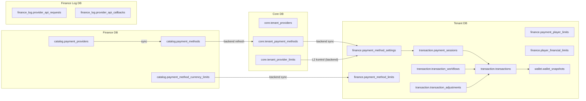
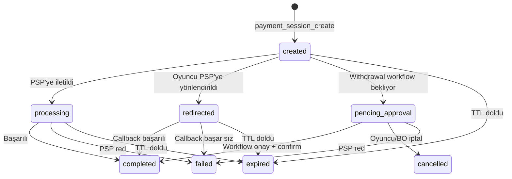
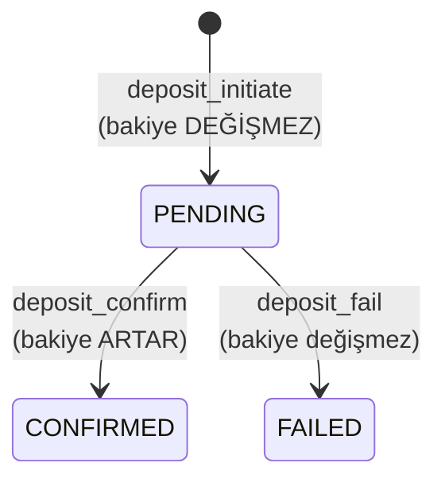
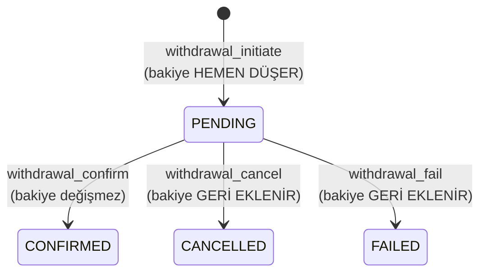
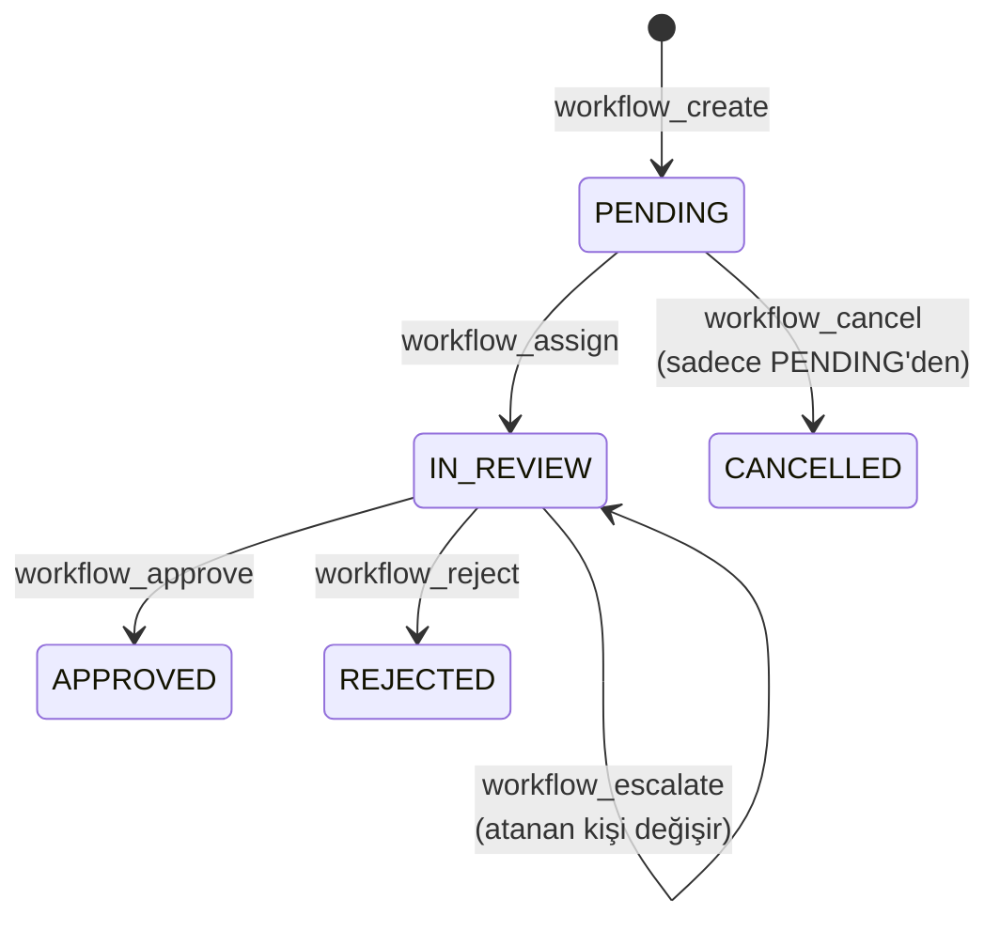
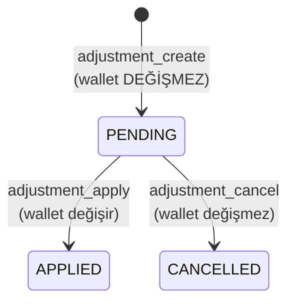
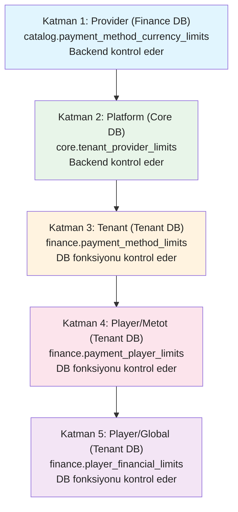

# SPEC_FINANCE_GATEWAY: Ödeme Gateway ve Finans İşlemleri Spesifikasyonu

Ödeme entegrasyonunun fonksiyonel spesifikasyonu: ödeme kataloğu, provider yönetimi, 4 katmanlı limit hiyerarşisi, deposit/withdrawal akışları, workflow onay mekanizması, hesap düzeltme, cashier. Toplam **66 fonksiyon**, **25 tablo**, **6 veritabanı**.

> **İlgili spesifikasyonlar:**
> - [SPEC_PLAYER_AUTH_KYC.md](SPEC_PLAYER_AUTH_KYC.md) — Oyuncu kayıt/login, wallet oluşturma
> - [SPEC_GAME_GATEWAY.md](SPEC_GAME_GATEWAY.md) — Seamless wallet (bet/win/rollback), oyun gateway
> - [SPEC_BONUS_ENGINE.md](SPEC_BONUS_ENGINE.md) — Bonus award, çevrim şartı, withdrawal bonus kontrolü

---

## 1. Kapsam ve Veritabanı Dağılımı

### 1.1 Kapsam Özeti

| Alan | Fonksiyon | Açıklama |
|------|-----------|----------|
| Ödeme Kataloğu (Finance DB) | 8 | Provider sync, metot CRUD, limit sync |
| Provider Yönetimi (Core DB) | 3 | Tenant'a provider açma/kapama, listeleme |
| Metot Yönetimi (Core DB) | 4 | Tenant'a metot atama, listeleme, kaldırma, refresh |
| Metot Sync ve Yapılandırma (Tenant DB) | 6 | Settings sync/remove/get/update/list, rollout sync |
| Limit Yönetimi (Tenant DB) | 9 | Metot limitleri, oyuncu limitleri, global finansal limitler |
| Ödeme Oturumları (Tenant DB) | 3 | Session oluşturma, sorgulama, güncelleme |
| Deposit İşlemleri (Tenant DB) | 4 | PSP deposit (initiate/confirm/fail) + manuel deposit |
| Withdrawal İşlemleri (Tenant DB) | 5 | PSP withdrawal (initiate/confirm/cancel/fail) + manuel |
| Workflow Yönetimi (Tenant DB) | 9 | Onay akışı: oluştur, ata, onayla, reddet, iptal, yükselt, not, listele, detay |
| Hesap Düzeltme (Tenant DB) | 5 | Adjustment: oluştur, uygula, iptal, detay, listele |
| Limit Doğrulama ve Cashier (Tenant DB) | 6 | Limit validasyon, fee hesaplama, cashier metot listeleme |
| Bakım (Finance Log DB) | 4 | Partition oluşturma, silme, bilgi, toplu bakım |
| **Toplam** | **66** | *61 implemente, 5 planlanmış* |

### 1.2 Veritabanı Dağılımı

| DB | Schema | Fonksiyon | Tablo | Açıklama |
|----|--------|-----------|-------|----------|
| **finance** | catalog | 8 | 3 | Master ödeme kataloğu, provider sync |
| **core** | core | 7 | 3 | Tenant-provider ve tenant-metot yönetimi |
| **tenant** | finance | 15 | 8 | Metot yapılandırma, limitler, döviz kurları |
| **tenant** | transaction | 17 | 7 | Session, workflow, adjustment |
| **tenant** | wallet | 9 | 2 | Deposit, withdrawal, bakiye |
| **finance_log** | finance_log | — | 2 | Provider API log (asenkron yazılır) |
| **finance_log** | maintenance | 4 | — | Partition yönetimi |
| **core_report** | — | — | (3) | Aylık rapor tabloları (paylaşımlı) |
| **tenant_report** | — | — | (3) | Aylık rapor tabloları (paylaşımlı) |

### 1.3 Cross-DB İlişki



### 1.4 Cross-DB Veri Akışı

- **Finance DB → Core DB:** `tenant_payment_method_refresh()` ile ödeme metotları tenant'a atanır (denormalize kopyalama)
- **Core DB → Tenant DB:** `payment_method_settings_sync()` ve `payment_method_limits_sync()` ile ayarlar senkronize edilir
- **Tenant DB → Finance Log DB:** Backend asenkron olarak provider API request/callback'leri yazar (RabbitMQ consumer)
- **L1+L2 Limitler:** Finance DB ve Core DB'deki limitler backend uygulama katmanında kontrol edilir (cross-DB join yapılamaz)
- **L3+L4+L5 Limitler:** Tenant DB fonksiyonları ile kontrol edilir

---

## 2. Durum Makinaları ve İş Akışları

### 2.1 Ödeme Oturumu (Payment Session) Durumları



| Durum | Kod | Açıklama |
|-------|-----|----------|
| `created` | — | Session oluşturuldu, işlem başlamadı |
| `processing` | — | PSP'ye istek gönderildi |
| `redirected` | — | Oyuncu PSP sayfasına yönlendirildi |
| `pending_approval` | — | Withdrawal workflow onayı bekliyor |
| `completed` | — | İşlem başarıyla tamamlandı |
| `failed` | — | İşlem başarısız |
| `cancelled` | — | İşlem iptal edildi |
| `expired` | — | Session süresi doldu (TTL) |

### 2.2 Transaction Durumları

| Durum | confirmed_at | processed_at | Açıklama |
|-------|-------------|-------------|----------|
| PENDING | NULL | NULL | İşlem başlatıldı, onay bekleniyor |
| CONFIRMED | SET | SET | İşlem onaylandı, wallet güncellendi |
| CANCELLED | NULL | SET | İşlem iptal edildi (description: 'CANCELLED:...') |
| FAILED | NULL | SET | İşlem başarısız (description: 'FAILED:...') |

### 2.3 Deposit Akışı



**Kritik:** Deposit'te bakiye **sadece confirm'de** artar. PSP onayı olmadan para eklenmez.

### 2.4 Withdrawal Akışı



**Kritik:** Withdrawal'da bakiye **initiate'de hemen** düşer (double-spend önleme). İptal/fail durumunda reversal transaction ile geri eklenir.

### 2.5 Deposit vs Withdrawal — Bakiye Stratejisi

| | Deposit | Withdrawal |
|---|---------|-----------|
| **Initiate** | Bakiye değişmez | Bakiye HEMEN düşer + bonus çevrim kontrolü |
| **Confirm** | Bakiye artar | Bakiye değişmez (zaten düşmüş) |
| **Cancel** | — | Bakiye GERİ eklenir (reversal tx, type=91) |
| **Fail** | Bakiye değişmez | Bakiye GERİ eklenir (reversal tx, type=91) |

### 2.6 Workflow Durum Geçişleri



| Mevcut Durum | Aksiyon | Yeni Durum | Kim Yapabilir |
|-------------|---------|-----------|---------------|
| `PENDING` | `workflow_assign` | `IN_REVIEW` | BO Operatör |
| `PENDING` | `workflow_cancel` | `CANCELLED` | Player veya BO |
| `IN_REVIEW` | `workflow_approve` | `APPROVED` | BO Operatör |
| `IN_REVIEW` | `workflow_reject` | `REJECTED` | BO Operatör |
| `IN_REVIEW` | `workflow_escalate` | `IN_REVIEW` | BO Operatör (atanan değişir) |

**Geçerli workflow tipleri:** `WITHDRAWAL`, `HIGH_VALUE`, `SUSPICIOUS`, `ADJUSTMENT`, `KYC_REQUIRED`

> **Önemli:** `IN_REVIEW` durumundaki talep oyuncu tarafından iptal edilemez. Bu, fraud ekibinin inceleme sürecini korur.

### 2.7 Hesap Düzeltme (Adjustment) Durumları



| Durum | Wallet Etkisi | Açıklama |
|-------|---------------|----------|
| `PENDING` | Yok | Talep oluşturuldu, workflow onayı bekleniyor |
| `APPLIED` | ±amount | Workflow onayı sonrası wallet'a uygulandı |
| `CANCELLED` | Yok | Workflow reddi sonrası iptal edildi |

**Geçerli adjustment tipleri:** `GAME_CORRECTION`, `BONUS_CORRECTION`, `FRAUD`, `MANUAL`

> **GGR Kuralı:** `GAME_CORRECTION` tipinde `provider_id` zorunludur. Bu bilgi GGR raporlamasına dahil edilir.

### 2.8 Bonus Çevrim Kontrolü (Withdrawal'da)

Withdrawal başlatıldığında `withdrawal_initiate()` fonksiyonu aktif bonus çevrim kontrolü yapar:

1. `bonus.bonus_awards` tablosunda `status='active'` VE `is_wagering_complete=false` olan kayıt varsa → **hata** (`error.withdrawal.active-wagering-incomplete`)
2. Çevrim tamamlanmış bonuslar tenant'ın `wagering_completion_policy` ayarına göre işlenir (backend kontrolü)

### 2.9 4 Katmanlı Limit Hiyerarşisi



| Katman | DB | Kontrol Eden | Tablo | Kapsam |
|--------|----|-------------|-------|--------|
| L1 — Provider | Finance DB | Backend | `catalog.payment_method_currency_limits` | Global PSP limitleri |
| L2 — Platform | Core DB | Backend | `core.tenant_provider_limits` | Tenant → metot atama limitleri |
| L3 — Tenant | Tenant DB | DB fonksiyonu | `finance.payment_method_limits` | Tenant'a özel metot limitleri |
| L4 — Player/Metot | Tenant DB | DB fonksiyonu | `finance.payment_player_limits` | Oyuncu başına metot limitleri |
| L5 — Player/Global | Tenant DB | DB fonksiyonu | `finance.player_financial_limits` | Oyuncu başına global limitler |

> L1+L2: Backend uygulama katmanında kontrol (farklı DB'ler arası join yapılamaz). L3-L5: Tenant DB fonksiyonu ile kontrol. **En kısıtlayıcı limit geçerli olur.**

### 2.10 Player Limit Tipleri

| Tip | Belirleyen | Açıklama |
|-----|-----------|----------|
| `self_imposed` | Oyuncu | Kendi koyduğu limit (sorumlu oyun) |
| `admin_imposed` | BO Admin | Admin tarafından konulan limit |

### 2.11 Transaction Type Matrisi

| ID | Kod | Kategori | Açıklama |
|----|-----|----------|----------|
| 80 | `deposit.provider` | deposit | PSP para yatırma |
| 81 | `deposit.manual` | deposit | Manuel para yatırma |
| 82 | `deposit.crypto` | deposit | Kripto para yatırma |
| 85 | `withdrawal.provider` | withdrawal | PSP para çekme |
| 86 | `withdrawal.manual` | withdrawal | Manuel para çekme |
| 87 | `withdrawal.crypto` | withdrawal | Kripto para çekme |
| 90 | `deposit.chargeback` | chargeback | Chargeback |
| 91 | `withdrawal.reversal` | reversal | Çekim iptali (reversal) |
| 95 | `adjustment.credit` | adjustment | Hesap düzeltme — ekleme |
| 96 | `adjustment.debit` | adjustment | Hesap düzeltme — kesme |

### 2.12 Fee Hesaplama Formülü

```
raw_fee = amount × fee_percent + fee_fixed
fee = MAX(fee_min, MIN(fee_max, raw_fee))
fee = MAX(0, fee)  -- negatif fee önleme

-- Deposit: oyuncu daha az alır
net_amount = amount - fee

-- Withdrawal: wallet'tan daha fazla düşülür
net_amount = amount + fee
```

---

## 3. Veri Modeli

### 3.1 Finance DB — Katalog Tabloları

#### `catalog.payment_providers`

| Kolon | Tip | Constraint | Varsayılan | Açıklama |
|-------|-----|-----------|------------|----------|
| id | BIGINT | PK | — | Core DB'den aynı ID (serial değil) |
| provider_code | VARCHAR(50) | NOT NULL | — | Provider kodu (UPPER) |
| provider_name | VARCHAR(255) | NOT NULL | — | Provider adı |
| is_active | BOOLEAN | NOT NULL | true | Aktif mi |
| created_at | TIMESTAMPTZ | NOT NULL | NOW() | — |
| updated_at | TIMESTAMPTZ | NOT NULL | NOW() | — |

#### `catalog.payment_methods`

| Kolon | Tip | Constraint | Varsayılan | Açıklama |
|-------|-----|-----------|------------|----------|
| id | BIGSERIAL | PK | — | Metot ID |
| provider_id | BIGINT | NOT NULL, FK | — | Provider referansı |
| external_method_id | VARCHAR(100) | — | — | PSP tarafındaki metot kodu |
| payment_method_code | VARCHAR(100) | NOT NULL | — | Metot kodu (LOWER) |
| payment_method_name | VARCHAR(255) | NOT NULL | — | Metot adı |
| payment_type | VARCHAR(50) | NOT NULL | — | CARD, EWALLET, BANK, CRYPTO, MOBILE, VOUCHER |
| payment_subtype | VARCHAR(50) | — | — | Alt tip (UPPER) |
| channel | VARCHAR(50) | — | 'online' | Kanal |
| supports_deposit | BOOLEAN | NOT NULL | true | Deposit destekler mi |
| supports_withdrawal | BOOLEAN | NOT NULL | true | Withdrawal destekler mi |
| supports_refund | BOOLEAN | NOT NULL | false | Refund destekler mi |
| min_deposit / max_deposit | DECIMAL(18,8) | — | — | Deposit min/max |
| min_withdrawal / max_withdrawal | DECIMAL(18,8) | — | — | Withdrawal min/max |
| deposit_fee_percent / withdrawal_fee_percent | DECIMAL(5,4) | — | — | Fee yüzde |
| deposit_fee_fixed / withdrawal_fee_fixed | DECIMAL(18,8) | — | — | Fee sabit |
| supported_currencies | CHAR(3)[] | — | '{}' | Desteklenen fiat |
| supported_cryptocurrencies | VARCHAR(20)[] | — | '{}' | Desteklenen crypto |
| blocked_countries | CHAR(2)[] | — | '{}' | Engelli ülkeler |
| requires_kyc_level | SMALLINT | — | 0 | Minimum KYC seviyesi |
| features | VARCHAR(50)[] | — | '{}' | Özellik etiketleri |
| sort_order | INTEGER | — | 0 | Sıralama |
| is_active | BOOLEAN | NOT NULL | true | Aktif mi (soft delete) |
| icon_url / logo_url / banner_url | VARCHAR(500) | — | — | Görseller |
| is_mobile / is_desktop / is_app | BOOLEAN | NOT NULL | true | Platform desteği |

> Kısaltılmış tablo — tam kolon listesi SQL dosyasında.

#### `catalog.payment_method_currency_limits`

| Kolon | Tip | Constraint | Varsayılan | Açıklama |
|-------|-----|-----------|------------|----------|
| id | BIGSERIAL | PK | — | — |
| payment_method_id | BIGINT | NOT NULL, FK | — | Metot referansı |
| currency_code | VARCHAR(20) | NOT NULL | — | Para birimi (UPPER) |
| currency_type | SMALLINT | NOT NULL | 1 | 1=fiat, 2=crypto |
| min_deposit / max_deposit | DECIMAL(18,8) | NOT NULL | — | Deposit limitleri |
| daily_deposit_limit / monthly_deposit_limit | DECIMAL(18,8) | — | — | Periyodik limitler |
| min_withdrawal / max_withdrawal | DECIMAL(18,8) | NOT NULL | — | Withdrawal limitleri |
| daily_withdrawal_limit / monthly_withdrawal_limit | DECIMAL(18,8) | — | — | Periyodik limitler |
| deposit_fee_percent / deposit_fee_fixed | DECIMAL(5,4) / DECIMAL(18,8) | — | 0 | Deposit fee |
| withdrawal_fee_percent / withdrawal_fee_fixed | DECIMAL(5,4) / DECIMAL(18,8) | — | 0 | Withdrawal fee |
| is_active | BOOLEAN | NOT NULL | true | Soft delete |

> **L1 (Provider) katmanı.** Global PSP limitleri. Backend uygulama katmanında kontrol edilir.

### 3.2 Tenant DB — Finans Yapılandırma Tabloları

#### `finance.payment_method_settings`

| Kolon | Tip | Constraint | Varsayılan | Açıklama |
|-------|-----|-----------|------------|----------|
| id | BIGSERIAL | PK | — | — |
| payment_method_id | BIGINT | NOT NULL | — | Katalog metot ID |
| provider_id | BIGINT | NOT NULL | — | Provider ID |
| payment_method_code | VARCHAR(100) | NOT NULL | — | Denormalize metot kodu |
| payment_method_name | VARCHAR(255) | NOT NULL | — | Denormalize metot adı |
| provider_code | VARCHAR(50) | NOT NULL | — | Denormalize provider kodu |
| payment_type | VARCHAR(50) | NOT NULL | — | Denormalize tip |
| allow_deposit | BOOLEAN | NOT NULL | true | Deposit izni |
| allow_withdrawal | BOOLEAN | NOT NULL | true | Withdrawal izni |
| display_order | INTEGER | — | 0 | Sıralama |
| is_visible | BOOLEAN | NOT NULL | true | Görünür mü |
| is_enabled | BOOLEAN | NOT NULL | true | Aktif mi |
| is_featured | BOOLEAN | NOT NULL | false | Öne çıkan mı |
| custom_name | VARCHAR(255) | — | — | Tenant özel adı |
| custom_icon_url | VARCHAR(500) | — | — | Tenant özel ikon |
| custom_description | TEXT | — | — | Tenant özel açıklama |
| allowed_platforms | VARCHAR(20)[] | — | '{WEB,MOBILE,APP}' | Platform filtresi |
| blocked_countries | CHAR(2)[] | — | '{}' | Engelli ülkeler |
| allowed_countries | CHAR(2)[] | — | '{}' | İzinli ülkeler |
| rollout_status | VARCHAR(20) | NOT NULL | 'production' | 'shadow' veya 'production' |
| requires_kyc_level | SMALLINT | — | 0 | Minimum KYC |
| core_synced_at | TIMESTAMP | — | — | Son sync zamanı |

#### `finance.payment_method_limits`

| Kolon | Tip | Constraint | Varsayılan | Açıklama |
|-------|-----|-----------|------------|----------|
| id | BIGSERIAL | PK | — | — |
| payment_method_id | BIGINT | NOT NULL | — | Metot referansı |
| currency_code | VARCHAR(20) | NOT NULL | — | Para birimi (UPPER) |
| currency_type | SMALLINT | NOT NULL | 1 | 1=fiat, 2=crypto |
| min_deposit / max_deposit | DECIMAL(18,8) | NOT NULL | — | Deposit min/max |
| daily/weekly/monthly_deposit_limit | DECIMAL(18,8) | — | — | Periyodik limitler |
| min_withdrawal / max_withdrawal | DECIMAL(18,8) | NOT NULL | — | Withdrawal min/max |
| daily/weekly/monthly_withdrawal_limit | DECIMAL(18,8) | — | — | Periyodik limitler |
| deposit_fee_percent | DECIMAL(5,4) | — | 0 | Deposit fee % |
| deposit_fee_fixed / deposit_fee_min / deposit_fee_max | DECIMAL(18,8) | — | — | Deposit fee detay |
| withdrawal_fee_percent | DECIMAL(5,4) | — | 0 | Withdrawal fee % |
| withdrawal_fee_fixed / withdrawal_fee_min / withdrawal_fee_max | DECIMAL(18,8) | — | — | Withdrawal fee detay |
| is_active | BOOLEAN | NOT NULL | true | Soft delete |

> **L3 (Tenant) katmanı.** Metot bazında tenant limitleri ve fee'ler. DB fonksiyonu ile kontrol edilir.

#### `finance.payment_player_limits`

| Kolon | Tip | Constraint | Varsayılan | Açıklama |
|-------|-----|-----------|------------|----------|
| id | BIGSERIAL | PK | — | — |
| player_id | BIGINT | NOT NULL | — | Oyuncu ID |
| payment_method_id | BIGINT | NOT NULL | — | Metot ID |
| payment_method_code | VARCHAR(100) | NOT NULL | — | Denormalize metot kodu |
| currency_code | VARCHAR(20) | NOT NULL | 'TRY' | Para birimi |
| currency_type | SMALLINT | NOT NULL | 1 | 1=fiat, 2=crypto |
| min_deposit / max_deposit | DECIMAL(18,8) | — | — | Deposit limitleri |
| min_withdrawal / max_withdrawal | DECIMAL(18,8) | — | — | Withdrawal limitleri |
| daily_deposit_limit / daily_withdrawal_limit | DECIMAL(18,8) | — | — | Günlük limitler |
| monthly_deposit_limit / monthly_withdrawal_limit | DECIMAL(18,8) | — | — | Aylık limitler |
| limit_type | VARCHAR(50) | — | — | 'self_imposed', 'responsible_gaming', 'admin_imposed' |

> **L4 (Player/Metot) katmanı.** Per-metot, per-oyuncu limitleri. Sorumlu oyun desteği.

#### `finance.player_financial_limits`

| Kolon | Tip | Constraint | Varsayılan | Açıklama |
|-------|-----|-----------|------------|----------|
| id | BIGSERIAL | PK | — | — |
| player_id | BIGINT | NOT NULL | — | Oyuncu ID |
| currency_code | VARCHAR(20) | NOT NULL | 'TRY' | Para birimi |
| currency_type | SMALLINT | NOT NULL | 1 | 1=fiat, 2=crypto |
| daily/weekly/monthly_deposit_limit | DECIMAL(18,8) | — | — | Deposit limitleri |
| daily/weekly/monthly_withdrawal_limit | DECIMAL(18,8) | — | — | Withdrawal limitleri |
| daily/weekly/monthly_loss_limit | DECIMAL(18,8) | — | — | Kayıp limitleri |
| daily/weekly/monthly_wager_limit | DECIMAL(18,8) | — | — | Bahis limitleri |
| limit_type | VARCHAR(50) | NOT NULL | 'admin_imposed' | 'self_imposed' veya 'admin_imposed' |

> **L5 (Player/Global) katmanı.** Metottan bağımsız, global oyuncu limitleri. Aynı oyuncu+para birimi için birden fazla limit_type olabilir.

#### `finance.crypto_rates` / `finance.crypto_rates_latest`

Kripto para kur tabloları. `crypto_rates`: Tarihsel kayıtlar (BIGSERIAL PK). `crypto_rates_latest`: Anlık kurlar (composite PK: provider, base_currency, symbol). NUMERIC(18,8) hassasiyetinde rate değerleri.

#### `finance.currency_rates` / `finance.currency_rates_latest`

Fiat döviz kur tabloları. Aynı pattern: tarihsel + anlık. NUMERIC(18,8) hassasiyetinde rate değerleri.

### 3.3 Tenant DB — Transaction Tabloları

#### `transaction.payment_sessions`

| Kolon | Tip | Constraint | Varsayılan | Açıklama |
|-------|-----|-----------|------------|----------|
| id | BIGSERIAL | PK | — | — |
| session_token | VARCHAR(100) | NOT NULL | — | UUID token |
| player_id | BIGINT | NOT NULL | — | Oyuncu ID |
| session_type | VARCHAR(20) | NOT NULL | — | 'DEPOSIT' veya 'WITHDRAWAL' |
| payment_method_id | BIGINT | — | — | Ödeme metodu |
| amount | DECIMAL(18,8) | NOT NULL | — | İşlem tutarı |
| currency_code | VARCHAR(20) | NOT NULL | — | Para birimi |
| fee_amount | DECIMAL(18,8) | NOT NULL | 0 | Fee tutarı |
| net_amount | DECIMAL(18,8) | — | — | Net tutar |
| status | VARCHAR(20) | NOT NULL | 'created' | Session durumu |
| idempotency_key | VARCHAR(100) | — | — | İdempotency anahtarı |
| transaction_id | BIGINT | — | — | Bağlı transaction |
| provider_transaction_id | VARCHAR(100) | — | — | PSP transaction ID |
| provider_redirect_url | TEXT | — | — | PSP yönlendirme URL |
| provider_data | JSONB | — | — | PSP ek verisi |
| ip_address | INET | — | — | İstemci IP |
| expires_at | TIMESTAMPTZ | NOT NULL | — | Son geçerlilik |
| completed_at | TIMESTAMPTZ | — | — | Tamamlanma zamanı |

#### `transaction.transactions` ◆ (Partitioned)

| Kolon | Tip | Constraint | Varsayılan | Açıklama |
|-------|-----|-----------|------------|----------|
| id | BIGSERIAL | PK (composite) | — | Transaction ID |
| player_id | BIGINT | NOT NULL | — | Oyuncu ID |
| wallet_id | BIGINT | NOT NULL | — | Wallet ID |
| transaction_type_id | SMALLINT | NOT NULL | — | Transaction tipi (80-96) |
| operation_type_id | SMALLINT | NOT NULL | — | 1=debit, 2=credit |
| amount | NUMERIC(18,8) | NOT NULL | — | İşlem tutarı |
| balance_after | NUMERIC(18,8) | NOT NULL | — | İşlem sonrası bakiye |
| related_transaction_id | BIGINT | — | — | İlişkili tx (reversal için) |
| bonus_award_id | BIGINT | — | — | Bonus award referansı |
| idempotency_key | VARCHAR(100) | — | — | İdempotency anahtarı |
| external_reference_id | VARCHAR(100) | — | — | Dış referans |
| source | VARCHAR(30) | NOT NULL | — | 'PAYMENT', 'ADMIN', 'GAME' |
| metadata | JSONB | — | — | Ek veri |
| confirmed_at | TIMESTAMPTZ | — | — | Onay zamanı |
| processed_at | TIMESTAMPTZ | — | — | İşlenme zamanı |
| created_at | TIMESTAMPTZ | NOT NULL | NOW() | Partition key |

**Partition:** RANGE by `created_at` (aylık). Composite PK: `(id, created_at)`.

#### `transaction.transaction_adjustments`

| Kolon | Tip | Constraint | Varsayılan | Açıklama |
|-------|-----|-----------|------------|----------|
| id | BIGSERIAL | PK | — | — |
| transaction_id | BIGINT | — | — | NULL → apply sonrası dolar |
| player_id | BIGINT | NOT NULL | — | Oyuncu ID |
| wallet_type | VARCHAR(10) | NOT NULL | — | 'REAL' veya 'BONUS' |
| direction | VARCHAR(10) | NOT NULL | — | 'CREDIT' veya 'DEBIT' |
| amount | NUMERIC(18,8) | NOT NULL | — | Tutar |
| currency_code | VARCHAR(20) | NOT NULL | — | Para birimi |
| adjustment_type | VARCHAR(30) | NOT NULL | — | GAME_CORRECTION, BONUS_CORRECTION, FRAUD, MANUAL |
| status | VARCHAR(20) | NOT NULL | 'PENDING' | PENDING → APPLIED / CANCELLED |
| provider_id | BIGINT | — | — | GGR için (GAME_CORRECTION zorunlu) |
| game_id | BIGINT | — | — | GGR için |
| external_ref | VARCHAR(100) | — | — | Provider referansı |
| reason | VARCHAR(500) | NOT NULL | — | Açıklama |
| created_by_id | BIGINT | NOT NULL | — | Talep eden BO user |
| approved_by_id | BIGINT | — | — | Onaylayan |
| workflow_id | BIGINT | — | — | Bağlı workflow |
| applied_at | TIMESTAMPTZ | — | — | Uygulama zamanı |

#### `transaction.transaction_workflows`

| Kolon | Tip | Constraint | Varsayılan | Açıklama |
|-------|-----|-----------|------------|----------|
| id | BIGSERIAL | PK | — | — |
| transaction_id | BIGINT | — | — | Bağlı transaction (nullable) |
| workflow_type | VARCHAR(30) | NOT NULL | — | WITHDRAWAL, ADJUSTMENT, HIGH_VALUE, SUSPICIOUS, KYC_REQUIRED |
| status | VARCHAR(30) | NOT NULL | — | PENDING, IN_REVIEW, APPROVED, REJECTED, CANCELLED |
| reason | VARCHAR(255) | — | — | Red/iptal sebebi |
| created_by_id | BIGINT | — | — | Oluşturan |
| assigned_to_id | BIGINT | — | — | Atanan BO user |

#### `transaction.transaction_workflow_actions`

| Kolon | Tip | Constraint | Varsayılan | Açıklama |
|-------|-----|-----------|------------|----------|
| id | BIGSERIAL | PK | — | — |
| workflow_id | BIGINT | NOT NULL | — | Workflow referansı |
| action | VARCHAR(30) | NOT NULL | — | CREATE, ASSIGN, APPROVE, REJECT, CANCEL, ESCALATE, NOTE |
| performed_by_id | BIGINT | — | — | İşlemi yapan |
| performed_by_type | VARCHAR(30) | NOT NULL | — | 'BO_USER', 'PLAYER', 'SYSTEM' |
| note | VARCHAR(255) | — | — | Not |

### 3.4 Tenant DB — Wallet Tabloları

#### `wallet.wallets`

| Kolon | Tip | Constraint | Varsayılan | Açıklama |
|-------|-----|-----------|------------|----------|
| id | BIGSERIAL | PK | — | — |
| player_id | BIGINT | NOT NULL | — | Oyuncu ID |
| wallet_type | VARCHAR(20) | NOT NULL | — | 'REAL', 'BONUS', 'LOCKED', 'COIN' |
| currency_type | SMALLINT | NOT NULL | 1 | 1=fiat, 2=crypto |
| currency_code | VARCHAR(20) | NOT NULL | — | Para birimi |
| status | SMALLINT | NOT NULL | 1 | 1=aktif |
| is_default | BOOLEAN | NOT NULL | false | Varsayılan wallet |

**Unique constraint:** `(player_id, wallet_type, currency_code)` — Her oyuncunun her wallet tipi ve para birimi için tek wallet'ı olur.

#### `wallet.wallet_snapshots`

| Kolon | Tip | Constraint | Varsayılan | Açıklama |
|-------|-----|-----------|------------|----------|
| wallet_id | BIGINT | PK | — | Wallet referansı |
| balance | NUMERIC(18,8) | NOT NULL | — | Anlık bakiye |
| last_transaction_id | BIGINT | NOT NULL | — | Son transaction ID |
| updated_at | TIMESTAMP | NOT NULL | NOW() | Son güncelleme |

> **FOR UPDATE kilidi** tüm wallet değişikliklerinde `wallet_snapshots` üzerinde uygulanır. Bu, eşzamanlı işlemlerde seri tutarlılık sağlar.

### 3.5 Finance Log DB — Log Tabloları

#### `finance_log.provider_api_requests` ◆ (Partitioned)

| Kolon | Tip | Constraint | Varsayılan | Açıklama |
|-------|-----|-----------|------------|----------|
| id | BIGSERIAL | PK (composite) | — | — |
| tenant_id | BIGINT | NOT NULL | — | Tenant ID |
| provider_code | VARCHAR(50) | NOT NULL | — | Provider kodu |
| action_type | VARCHAR(50) | NOT NULL | — | İşlem tipi |
| api_endpoint | VARCHAR(500) | NOT NULL | — | API endpoint |
| request_payload / response_payload | JSONB | — | — | İstek/yanıt |
| http_status_code | SMALLINT | — | — | HTTP durum kodu |
| response_time_ms | INTEGER | — | — | Yanıt süresi (ms) |
| session_token | VARCHAR(100) | — | — | Session token |
| created_at | TIMESTAMP | NOT NULL | NOW() | Partition key |

**Partition:** RANGE by `created_at` (günlük). Retention: 14 gün.

#### `finance_log.provider_api_callbacks` ◆ (Partitioned)

| Kolon | Tip | Constraint | Varsayılan | Açıklama |
|-------|-----|-----------|------------|----------|
| id | BIGSERIAL | PK (composite) | — | — |
| tenant_id | BIGINT | — | — | Tenant ID |
| provider_code | VARCHAR(50) | NOT NULL | — | Provider kodu |
| callback_type | VARCHAR(50) | NOT NULL | — | Callback tipi |
| raw_payload | JSONB | NOT NULL | — | Ham payload |
| parsed_payload | JSONB | — | — | Ayrıştırılmış payload |
| processing_status | VARCHAR(20) | NOT NULL | 'received' | İşleme durumu |
| signature_valid | BOOLEAN | — | — | İmza doğrulaması |
| source_ip | INET | — | — | Kaynak IP |
| created_at | TIMESTAMP | NOT NULL | NOW() | Partition key |

**Partition:** RANGE by `created_at` (günlük). Retention: 14 gün.

### 3.6 Core DB — Entegrasyon Tabloları

#### `core.tenant_providers`

| Kolon | Tip | Constraint | Varsayılan | Açıklama |
|-------|-----|-----------|------------|----------|
| id | BIGSERIAL | PK | — | — |
| tenant_id | BIGINT | NOT NULL | — | Tenant ID |
| provider_id | BIGINT | NOT NULL | — | Provider ID |
| mode | VARCHAR(20) | NOT NULL | 'real' | 'real' veya 'test' |
| is_enabled | BOOLEAN | NOT NULL | true | Aktif mi |
| rollout_status | VARCHAR(20) | NOT NULL | 'production' | CHECK: 'shadow' veya 'production' |

> Game Gateway ile paylaşılan tablo. Game provider'lar da burada saklanır.

#### `core.tenant_payment_methods`

| Kolon | Tip | Constraint | Varsayılan | Açıklama |
|-------|-----|-----------|------------|----------|
| id | BIGSERIAL | PK | — | — |
| tenant_id | BIGINT | NOT NULL | — | Tenant ID |
| payment_method_id | BIGINT | NOT NULL | — | Finance DB metot ID (cross-DB, FK yok) |
| payment_method_name | VARCHAR(255) | — | — | Denormalize ad |
| payment_method_code | VARCHAR(100) | — | — | Denormalize kod |
| provider_code | VARCHAR(50) | — | — | Denormalize provider kodu |
| payment_type | VARCHAR(50) | — | — | Denormalize tip |
| is_enabled | BOOLEAN | NOT NULL | true | Aktif mi |
| display_order | INTEGER | — | 0 | Sıralama |
| custom_name / custom_icon_url / custom_description | — | — | — | Tenant özelleştirmeleri |
| override_min/max_deposit / override_min/max_withdrawal | DECIMAL(18,8) | — | — | Limit override'ları |
| override_deposit/withdrawal_fee_percent / _fixed | DECIMAL | — | — | Fee override'ları |
| sync_status | VARCHAR(20) | — | 'pending' | Sync durumu |

> **Denormalizasyon sebebi:** Cross-DB FK kullanılamaz. Backend Finance DB'den veriyi alır, Core'a denormalize yazar. BO listesi bu tablodan sorgulanır (Finance DB'ye JOIN gerekmez).

#### `core.tenant_provider_limits`

| Kolon | Tip | Constraint | Varsayılan | Açıklama |
|-------|-----|-----------|------------|----------|
| id | BIGSERIAL | PK | — | — |
| tenant_id | BIGINT | NOT NULL | — | Tenant ID |
| provider_id | BIGINT | NOT NULL | — | Provider ID |
| payment_method_id | BIGINT | NOT NULL | — | Metot ID |
| min/max_deposit / min/max_withdrawal | DECIMAL(18,8) | — | — | Limitler |
| daily_deposit/withdrawal_limit | DECIMAL(18,8) | — | — | Günlük limitler |
| monthly_deposit/withdrawal_limit | DECIMAL(18,8) | — | — | Aylık limitler |

> **L2 (Platform) katmanı.** Backend uygulama katmanında kontrol edilir.

---

## 4. Fonksiyon Spesifikasyonları

### 4.1 Finance DB — Ödeme Kataloğu (8 fonksiyon)

#### `catalog.payment_provider_sync`

| Parametre | Tip | Zorunlu | Varsayılan | Açıklama |
|-----------|-----|---------|------------|----------|
| p_providers | TEXT | Evet | — | JSONB array olarak provider listesi (TEXT→JSONB cast) |

**Dönüş:** `INTEGER` (işlenen provider sayısı)

**İş Kuralları:**
1. p_providers NULL veya boşsa hata.
2. TEXT→JSONB cast yapılır. Array değilse hata.
3. Her element için ON CONFLICT UPSERT (id bazlı).
4. provider_code: UPPER(TRIM). is_active varsayılan true.
5. Aynı ID'ler kullanılır (Core DB ile cross-DB consistency).

**Hata Kodları:**

| Hata Key | ERRCODE | Koşul |
|----------|---------|-------|
| error.provider.data-required | P0400 | Veri NULL veya boş |
| error.provider.invalid-format | P0400 | JSONB array değil |

---

#### `catalog.payment_method_create`

| Parametre | Tip | Zorunlu | Varsayılan | Açıklama |
|-----------|-----|---------|------------|----------|
| p_provider_id | BIGINT | Evet | — | Provider ID |
| p_code | VARCHAR(100) | Evet | — | Metot kodu (min 2 karakter, LOWER) |
| p_name | VARCHAR(255) | Evet | — | Metot adı (min 2 karakter) |
| p_payment_type | VARCHAR(50) | Evet | — | CARD, EWALLET, BANK, CRYPTO, MOBILE, VOUCHER |
| p_external_method_id | VARCHAR(100) | Hayır | NULL | PSP metot kodu |
| p_channel | VARCHAR(50) | Hayır | 'ONLINE' | Kanal |
| p_supports_deposit | BOOLEAN | Hayır | true | Deposit desteği |
| p_supports_withdrawal | BOOLEAN | Hayır | true | Withdrawal desteği |
| p_min/max_deposit | DECIMAL(18,8) | Hayır | NULL | Deposit limitleri |
| p_min/max_withdrawal | DECIMAL(18,8) | Hayır | NULL | Withdrawal limitleri |
| p_deposit/withdrawal_fee_percent | DECIMAL(5,4) | Hayır | NULL | Fee yüzde |
| p_deposit/withdrawal_fee_fixed | DECIMAL(18,8) | Hayır | NULL | Fee sabit |
| p_supported_currencies | CHAR(3)[] | Hayır | '{}' | Desteklenen fiat |
| p_supported_cryptocurrencies | VARCHAR(20)[] | Hayır | '{}' | Desteklenen crypto |
| p_blocked_countries | CHAR(2)[] | Hayır | '{}' | Engelli ülkeler |
| p_requires_kyc_level | SMALLINT | Hayır | 0 | Minimum KYC |
| p_features | VARCHAR(50)[] | Hayır | '{}' | Özellik etiketleri |
| p_sort_order | INTEGER | Hayır | 0 | Sıralama |

> Toplam ~30 parametre. Tam liste için SQL dosyasına bakınız.

**Dönüş:** `BIGINT` (yeni metot ID)

**İş Kuralları:**
1. Provider ID zorunlu, provider `catalog.payment_providers`'da bulunmalı.
2. Code: min 2 karakter, LOWER(TRIM) dönüşümü.
3. Name: min 2 karakter, TRIM dönüşümü.
4. payment_type geçerli listede olmalı (6 tip).
5. Aynı provider altında duplicate code olamaz.
6. Channel varsayılan 'ONLINE', UPPER dönüşümü.

**Hata Kodları:**

| Hata Key | ERRCODE | Koşul |
|----------|---------|-------|
| error.payment-method.provider-required | P0400 | provider_id NULL |
| error.provider.not-found | P0404 | Provider bulunamadı |
| error.payment-method.code-invalid | P0400 | Code NULL veya < 2 karakter |
| error.payment-method.name-invalid | P0400 | Name NULL veya < 2 karakter |
| error.payment-method.type-invalid | P0400 | Geçersiz payment_type |
| error.payment-method.code-exists | P0409 | Code aynı provider'da zaten var |

---

#### `catalog.payment_method_update`

| Parametre | Tip | Zorunlu | Varsayılan | Açıklama |
|-----------|-----|---------|------------|----------|
| p_id | BIGINT | Evet | — | Güncellenecek metot ID |
| p_provider_id | BIGINT | Hayır | NULL | Yeni provider (NULL = değişmez) |
| p_code | VARCHAR(100) | Hayır | NULL | Yeni kod (NULL = değişmez) |
| p_name | VARCHAR(255) | Hayır | NULL | Yeni ad (NULL = değişmez) |
| p_payment_type | VARCHAR(50) | Hayır | NULL | Yeni tip (NULL = değişmez) |
| p_is_active | BOOLEAN | Hayır | NULL | Aktiflik (NULL = değişmez) |
| ... | ... | Hayır | NULL | Diğer alanlar COALESCE pattern |

**Dönüş:** `VOID`

**İş Kuralları:**
1. ID zorunlu, metot `catalog.payment_methods`'da bulunmalı.
2. COALESCE pattern: NULL geçilen parametreler mevcut değeri korur.
3. Provider değiştirilirse yeni provider validate edilir.
4. Code değiştirilirse min 2 karakter ve provider bazında uniqueness kontrol edilir.
5. payment_type değiştirilirse geçerlilik kontrol edilir.

**Hata Kodları:**

| Hata Key | ERRCODE | Koşul |
|----------|---------|-------|
| error.payment-method.id-required | P0400 | ID NULL |
| error.payment-method.not-found | P0404 | Metot bulunamadı |
| error.provider.not-found | P0404 | Yeni provider bulunamadı |
| error.payment-method.code-invalid | P0400 | Code < 2 karakter |
| error.payment-method.code-exists | P0409 | Code duplicate |
| error.payment-method.type-invalid | P0400 | Geçersiz payment_type |

---

#### `catalog.payment_method_delete`

| Parametre | Tip | Zorunlu | Varsayılan | Açıklama |
|-----------|-----|---------|------------|----------|
| p_id | BIGINT | Evet | — | Silinecek metot ID |

**Dönüş:** `VOID`

**İş Kuralları:**
1. Soft delete: `is_active = false`. Hard DELETE yapılmaz.
2. Zaten inactive olan kayıt güncellenemez (P0404 döner).

**Hata Kodları:**

| Hata Key | ERRCODE | Koşul |
|----------|---------|-------|
| error.payment-method.id-required | P0400 | ID NULL |
| error.payment-method.not-found | P0404 | Metot bulunamadı veya zaten inactive |

---

#### `catalog.payment_method_get`

| Parametre | Tip | Zorunlu | Varsayılan | Açıklama |
|-----------|-----|---------|------------|----------|
| p_id | BIGINT | Evet | — | Metot ID |

**Dönüş:** `TABLE` (34 kolon, tek satır)

**İş Kuralları:**
1. `catalog.payment_methods` ile `catalog.payment_providers` JOIN yapılır.
2. Tüm alanlar döner: supported_currencies[], blocked_countries[], features[] dahil.

**Hata Kodları:**

| Hata Key | ERRCODE | Koşul |
|----------|---------|-------|
| error.payment-method.id-required | P0400 | ID NULL |
| error.payment-method.not-found | P0404 | Metot bulunamadı |

---

#### `catalog.payment_method_list`

| Parametre | Tip | Zorunlu | Varsayılan | Açıklama |
|-----------|-----|---------|------------|----------|
| p_provider_id | BIGINT | Hayır | NULL | Provider filtresi |
| p_payment_type | VARCHAR(50) | Hayır | NULL | Tip filtresi (UPPER dönüşümü) |
| p_is_active | BOOLEAN | Hayır | NULL | Aktiflik filtresi |

**Dönüş:** `TABLE` (32 kolon, çoklu satır)

**İş Kuralları:**
1. Opsiyonel filtreler: provider_id, payment_type (case-insensitive), is_active.
2. Sıralama: sort_order ASC, payment_method_name ASC.

**Hata Kodları:** Yok (boş sonuç döner)

---

#### `catalog.payment_method_lookup`

| Parametre | Tip | Zorunlu | Varsayılan | Açıklama |
|-----------|-----|---------|------------|----------|
| p_provider_id | BIGINT | Hayır | NULL | Provider filtresi |

**Dönüş:** `TABLE` (10 kolon — id, code, name, provider_id, provider_code, provider_name, payment_type, supports_deposit, supports_withdrawal, is_active)

**İş Kuralları:**
1. Hafif sorgu — dropdown/seçim listeleri için.
2. Sıralama: sort_order ASC, payment_method_name ASC.

**Hata Kodları:** Yok

---

#### `catalog.payment_method_currency_limit_sync`

| Parametre | Tip | Zorunlu | Varsayılan | Açıklama |
|-----------|-----|---------|------------|----------|
| p_payment_method_id | BIGINT | Evet | — | Metot ID |
| p_limits | TEXT | Evet | — | JSONB array (TEXT→JSONB cast) |

**Dönüş:** `VOID`

**İş Kuralları:**
1. Metot `catalog.payment_methods`'da bulunmalı.
2. TEXT→JSONB cast, array formatı validate edilir.
3. Her element için ON CONFLICT UPSERT (payment_method_id, currency_code).
4. currency_code: UPPER(TRIM). currency_type varsayılan 1 (fiat).
5. Payload'da olmayan mevcut limitler soft-delete edilir (is_active=false).
6. **Not:** Haftalık limit yok (tenant katmanından farklı).

**Hata Kodları:**

| Hata Key | ERRCODE | Koşul |
|----------|---------|-------|
| error.payment-method.id-required | P0400 | Metot ID NULL |
| error.payment-method.not-found | P0404 | Metot bulunamadı |
| error.payment-method.limits-data-required | P0400 | Limit verisi NULL veya boş |
| error.payment-method.limits-invalid-format | P0400 | JSONB array değil |

---

### 4.2 Core DB — Provider Yönetimi (3 fonksiyon)

> **Auth:** Tüm Core DB fonksiyonları `security.user_assert_access_company()` IDOR kontrolü yapar.

#### `core.tenant_payment_provider_enable`

| Parametre | Tip | Zorunlu | Varsayılan | Açıklama |
|-----------|-----|---------|------------|----------|
| p_caller_id | BIGINT | Evet | — | İşlemi yapan kullanıcı |
| p_tenant_id | BIGINT | Evet | — | Tenant ID |
| p_provider_id | BIGINT | Evet | — | Provider ID |
| p_method_data | TEXT | Hayır | NULL | Seed edilecek metot listesi (JSONB array) |
| p_mode | VARCHAR(20) | Hayır | 'real' | 'real' veya 'test' |
| p_rollout_status | VARCHAR(20) | Hayır | 'production' | 'shadow' veya 'production' |

**Dönüş:** `INTEGER` (seed edilen yeni metot sayısı)

**İş Kuralları:**
1. IDOR kontrolü: `user_assert_access_company(p_caller_id, tenant.company_id)`.
2. Provider mevcut ve PAYMENT tipinde olmalı.
3. rollout_status 'shadow' veya 'production' olmalı.
4. `core.tenant_providers` tablosuna UPSERT (tenant_id, provider_id).
5. Zaten mevcutsa: is_enabled=true, mode ve rollout_status güncellenir.
6. p_method_data verilmişse: yeni metotlar `core.tenant_payment_methods`'a seed edilir (ON CONFLICT DO NOTHING).
7. Mevcut metotlar dokunulmaz — sadece yeni eklenir.

**Hata Kodları:**

| Hata Key | ERRCODE | Koşul |
|----------|---------|-------|
| error.tenant.not-found | P0404 | Tenant bulunamadı |
| error.provider.not-found | P0404 | Provider bulunamadı |
| error.provider.not-payment-type | P0400 | Provider PAYMENT tipinde değil |
| error.provider.invalid-rollout-status | P0400 | Geçersiz rollout_status |

---

#### `core.tenant_payment_provider_disable`

| Parametre | Tip | Zorunlu | Varsayılan | Açıklama |
|-----------|-----|---------|------------|----------|
| p_caller_id | BIGINT | Evet | — | İşlemi yapan kullanıcı |
| p_tenant_id | BIGINT | Evet | — | Tenant ID |
| p_provider_id | BIGINT | Evet | — | Provider ID |

**Dönüş:** `VOID`

**İş Kuralları:**
1. IDOR kontrolü.
2. Provider tenant'a atanmış olmalı (`core.tenant_providers`).
3. `is_enabled = false` yapılır.
4. Metotların durumu **değişmez** — backend seviyesinde filtrelenir.

**Hata Kodları:**

| Hata Key | ERRCODE | Koşul |
|----------|---------|-------|
| error.tenant.not-found | P0404 | Tenant bulunamadı |
| error.tenant-provider.not-found | P0404 | Provider tenant'a atanmamış |

---

#### `core.tenant_payment_provider_list`

| Parametre | Tip | Zorunlu | Varsayılan | Açıklama |
|-----------|-----|---------|------------|----------|
| p_caller_id | BIGINT | Evet | — | İşlemi yapan kullanıcı |
| p_tenant_id | BIGINT | Evet | — | Tenant ID |

**Dönüş:** `JSONB` (provider dizisi)

**Dönüş Yapısı:**

| Alan | Tip | Açıklama |
|------|-----|----------|
| providerId | BIGINT | Provider ID |
| providerCode | VARCHAR | Provider kodu |
| providerName | VARCHAR | Provider adı |
| mode | VARCHAR | 'real' veya 'test' |
| isEnabled | BOOLEAN | Aktif mi |
| rolloutStatus | VARCHAR | Shadow/production |
| methodCount | INTEGER | Atanmış metot sayısı |

**İş Kuralları:**
1. IDOR kontrolü.
2. Sadece PAYMENT tipindeki provider'lar listelenir.
3. Her provider için `core.tenant_payment_methods` tablosundan metot sayısı hesaplanır.
4. Sıralama: provider_name ASC.

**Hata Kodları:**

| Hata Key | ERRCODE | Koşul |
|----------|---------|-------|
| error.tenant.not-found | P0404 | Tenant bulunamadı |

---

### 4.3 Core DB — Ödeme Metot Yönetimi (4 fonksiyon)

#### `core.tenant_payment_method_upsert`

| Parametre | Tip | Zorunlu | Varsayılan | Açıklama |
|-----------|-----|---------|------------|----------|
| p_caller_id | BIGINT | Evet | — | İşlemi yapan kullanıcı |
| p_tenant_id | BIGINT | Evet | — | Tenant ID |
| p_payment_method_id | BIGINT | Evet | — | Metot ID |
| p_is_enabled | BOOLEAN | Hayır | NULL | Aktiflik (COALESCE) |
| p_is_visible | BOOLEAN | Hayır | NULL | Görünürlük |
| p_is_featured | BOOLEAN | Hayır | NULL | Öne çıkan |
| p_display_order | INTEGER | Hayır | NULL | Sıralama |
| p_custom_name | VARCHAR(255) | Hayır | NULL | Özel ad |
| p_allow_deposit / p_allow_withdrawal | BOOLEAN | Hayır | NULL | İzinler |
| p_override_min/max_deposit | DECIMAL(18,8) | Hayır | NULL | Deposit limit override |
| p_override_min/max_withdrawal | DECIMAL(18,8) | Hayır | NULL | Withdrawal limit override |
| p_override_deposit/withdrawal_fee_percent | DECIMAL(5,4) | Hayır | NULL | Fee override |
| p_allowed_platforms | VARCHAR(20)[] | Hayır | NULL | Platform filtresi |
| p_blocked_countries | CHAR(2)[] | Hayır | NULL | Engelli ülkeler |

**Dönüş:** `VOID`

**İş Kuralları:**
1. IDOR kontrolü.
2. Metot `core.tenant_payment_methods`'da tenant için mevcut olmalı.
3. COALESCE pattern: NULL parametreler mevcut değeri korur.
4. `sync_status = 'pending'` olarak işaretlenir (Tenant DB'ye sync tetikler).

**Hata Kodları:**

| Hata Key | ERRCODE | Koşul |
|----------|---------|-------|
| error.tenant.not-found | P0404 | Tenant bulunamadı |
| error.payment-method.id-required | P0400 | Metot ID NULL |
| error.tenant-payment-method.not-found | P0404 | Metot tenant'a atanmamış |

---

#### `core.tenant_payment_method_list`

| Parametre | Tip | Zorunlu | Varsayılan | Açıklama |
|-----------|-----|---------|------------|----------|
| p_caller_id | BIGINT | Evet | — | İşlemi yapan kullanıcı |
| p_tenant_id | BIGINT | Evet | — | Tenant ID |
| p_provider_code | VARCHAR(50) | Hayır | NULL | Provider kodu filtresi (case-insensitive) |
| p_payment_type | VARCHAR(50) | Hayır | NULL | Tip filtresi (case-insensitive) |
| p_is_enabled | BOOLEAN | Hayır | NULL | Aktiflik filtresi |
| p_search | TEXT | Hayır | NULL | Metin arama (ILIKE) |
| p_limit | INTEGER | Hayır | 50 | Sayfa boyutu |
| p_offset | INTEGER | Hayır | 0 | Sayfa offset |

**Dönüş:** `JSONB`

**Dönüş Yapısı:**

| Alan | Tip | Açıklama |
|------|-----|----------|
| items | JSONB[] | Metot listesi |
| totalCount | INTEGER | Toplam kayıt |
| limit | INTEGER | Sayfa boyutu |
| offset | INTEGER | Offset |

**İş Kuralları:**
1. IDOR kontrolü.
2. Denormalize tablodan sorgu — Finance DB'ye JOIN gerekmez.
3. Metin arama: payment_method_name, payment_method_code, custom_name üzerinde ILIKE.
4. OFFSET pagination (cursor değil).
5. Sıralama: display_order ASC, id ASC.

**Hata Kodları:**

| Hata Key | ERRCODE | Koşul |
|----------|---------|-------|
| error.tenant.not-found | P0404 | Tenant bulunamadı |

---

#### `core.tenant_payment_method_remove`

| Parametre | Tip | Zorunlu | Varsayılan | Açıklama |
|-----------|-----|---------|------------|----------|
| p_caller_id | BIGINT | Evet | — | İşlemi yapan kullanıcı |
| p_tenant_id | BIGINT | Evet | — | Tenant ID |
| p_payment_method_id | BIGINT | Evet | — | Metot ID |
| p_disabled_reason | VARCHAR(255) | Hayır | NULL | Kapatma sebebi (varsayılan: 'disabled_by_admin') |

**Dönüş:** `VOID`

**İş Kuralları:**
1. IDOR kontrolü.
2. Soft delete: `is_enabled = false`, `disabled_at = NOW()`.
3. `sync_status = 'pending'` (Tenant DB'ye sync tetikler).
4. Reason verilmezse 'disabled_by_admin' kullanılır.

**Hata Kodları:**

| Hata Key | ERRCODE | Koşul |
|----------|---------|-------|
| error.tenant.not-found | P0404 | Tenant bulunamadı |
| error.payment-method.id-required | P0400 | Metot ID NULL |
| error.tenant-payment-method.not-found | P0404 | Metot bulunamadı |

---

#### `core.tenant_payment_method_refresh`

| Parametre | Tip | Zorunlu | Varsayılan | Açıklama |
|-----------|-----|---------|------------|----------|
| p_caller_id | BIGINT | Evet | — | İşlemi yapan kullanıcı |
| p_tenant_id | BIGINT | Evet | — | Tenant ID |
| p_provider_id | BIGINT | Evet | — | Provider ID |
| p_method_data | TEXT | Evet | — | Metot listesi (JSONB array, TEXT→JSONB) |

**Dönüş:** `INTEGER` (yeni eklenen metot sayısı)

**İş Kuralları:**
1. IDOR kontrolü.
2. Provider PAYMENT tipinde olmalı.
3. TEXT→JSONB cast yapılır.
4. Her metot için ON CONFLICT DO NOTHING (tenant_id, payment_method_id).
5. Sadece yeni metotlar eklenir — mevcut metotlara dokunulmaz.
6. Denormalize alanlar (payment_method_name, provider_code, payment_type, icon_url) JSONB'den alınır.
7. `sync_status = 'pending'` ile eklenir.

**Hata Kodları:**

| Hata Key | ERRCODE | Koşul |
|----------|---------|-------|
| error.tenant.not-found | P0404 | Tenant bulunamadı |
| error.provider.not-payment-type | P0400 | Provider PAYMENT tipinde değil |
| error.payment-method.data-required | P0400 | Metot verisi NULL veya boş |

---

### 4.4 Tenant DB — Metot Sync ve Yapılandırma (6 fonksiyon)

> **Auth:** Tenant DB fonksiyonları auth-agnostic. Core DB'de yetki kontrolü yapılır.

#### `finance.payment_method_settings_sync`

| Parametre | Tip | Zorunlu | Varsayılan | Açıklama |
|-----------|-----|---------|------------|----------|
| p_payment_method_id | BIGINT | Evet | — | Metot ID |
| p_catalog_data | TEXT | Evet | — | Katalog verileri (TEXT→JSONB) |
| p_tenant_overrides | TEXT | Hayır | NULL | Tenant özelleştirmeleri (TEXT→JSONB, varsayılan '{}') |
| p_rollout_status | VARCHAR(20) | Hayır | 'production' | Shadow/production |

**Dönüş:** `VOID`

**İş Kuralları:**
1. payment_method_id zorunlu.
2. catalog_data TEXT→JSONB cast yapılır. Zorunlu.
3. tenant_overrides NULL ise boş JSONB ('{}') olarak işlenir.
4. Kayıt varsa UPDATE: Sadece katalog alanları (provider_id, payment_method_code vb.) güncellenir, tenant override'ları korunur (COALESCE).
5. Kayıt yoksa INSERT: Katalog alanları + tenant override varsayılanları (allow_deposit=true, allow_withdrawal=true vb.).
6. `core_synced_at = NOW()` güncellenir.

**Hata Kodları:**

| Hata Key | ERRCODE | Koşul |
|----------|---------|-------|
| error.payment-method.id-required | P0400 | Metot ID NULL |
| error.payment-method.catalog-data-required | P0400 | Katalog verisi NULL veya boş |

---

#### `finance.payment_method_settings_remove`

| Parametre | Tip | Zorunlu | Varsayılan | Açıklama |
|-----------|-----|---------|------------|----------|
| p_payment_method_id | BIGINT | Evet | — | Metot ID |

**Dönüş:** `VOID`

**İş Kuralları:**
1. Soft delete: `is_enabled = false`.
2. Kayıt bulunamazsa P0404.

**Hata Kodları:**

| Hata Key | ERRCODE | Koşul |
|----------|---------|-------|
| error.payment-method.id-required | P0400 | Metot ID NULL |
| error.payment-method.not-found | P0404 | Kayıt bulunamadı |

---

#### `finance.payment_method_settings_get`

| Parametre | Tip | Zorunlu | Varsayılan | Açıklama |
|-----------|-----|---------|------------|----------|
| p_payment_method_id | BIGINT | Evet | — | Metot ID |

**Dönüş:** `JSONB` (33 alanla detay objesi)

**Dönüş Yapısı:**

| Alan | Tip | Açıklama |
|------|-----|----------|
| paymentMethodId | BIGINT | Metot ID |
| providerId | BIGINT | Provider ID |
| providerCode | VARCHAR | Provider kodu |
| paymentMethodCode | VARCHAR | Metot kodu |
| paymentMethodName | VARCHAR | Metot adı |
| paymentType | VARCHAR | Tip |
| allowDeposit / allowWithdrawal | BOOLEAN | İzinler |
| isVisible / isEnabled / isFeatured | BOOLEAN | Görünürlük |
| displayOrder | INTEGER | Sıralama |
| customName / customIconUrl / customDescription | VARCHAR | Tenant özelleştirmeleri |
| rolloutStatus | VARCHAR | Shadow/production |
| requiresKycLevel | SMALLINT | Minimum KYC |
| coreSyncedAt | TIMESTAMP | Son sync |

**Hata Kodları:**

| Hata Key | ERRCODE | Koşul |
|----------|---------|-------|
| error.payment-method.id-required | P0400 | Metot ID NULL |
| error.payment-method.not-found | P0404 | Kayıt bulunamadı |

---

#### `finance.payment_method_settings_update`

| Parametre | Tip | Zorunlu | Varsayılan | Açıklama |
|-----------|-----|---------|------------|----------|
| p_payment_method_id | BIGINT | Evet | — | Metot ID |
| p_is_visible | BOOLEAN | Hayır | NULL | Görünürlük |
| p_is_featured | BOOLEAN | Hayır | NULL | Öne çıkan |
| p_allow_deposit | BOOLEAN | Hayır | NULL | Deposit izni |
| p_display_order | INTEGER | Hayır | NULL | Sıralama |
| p_custom_name | VARCHAR(255) | Hayır | NULL | Özel ad |
| p_custom_icon_url | VARCHAR(500) | Hayır | NULL | Özel ikon |
| p_custom_description | TEXT | Hayır | NULL | Özel açıklama |
| p_allowed_platforms | VARCHAR(20)[] | Hayır | NULL | Platform filtresi |
| p_blocked_countries | CHAR(2)[] | Hayır | NULL | Engelli ülkeler |
| p_allowed_countries | CHAR(2)[] | Hayır | NULL | İzinli ülkeler |
| p_available_from | TIMESTAMP | Hayır | NULL | Başlangıç tarihi |
| p_available_until | TIMESTAMP | Hayır | NULL | Bitiş tarihi |

**Dönüş:** `VOID`

**İş Kuralları:**
1. Sadece tenant-düzenlenebilir alanlar güncellenir.
2. COALESCE pattern: NULL parametreler mevcut değeri korur.
3. Katalog alanları (provider_id, payment_method_code vb.) bu fonksiyonla güncellenemez — sync ile gelir.

**Hata Kodları:**

| Hata Key | ERRCODE | Koşul |
|----------|---------|-------|
| error.payment-method.id-required | P0400 | Metot ID NULL |
| error.payment-method.not-found | P0404 | Kayıt bulunamadı |

---

#### `finance.payment_method_settings_list`

| Parametre | Tip | Zorunlu | Varsayılan | Açıklama |
|-----------|-----|---------|------------|----------|
| p_provider_ids | BIGINT[] | Hayır | NULL | Provider ID dizisi filtresi |
| p_player_id | BIGINT | Hayır | NULL | Shadow tester kontrolü için |
| p_payment_type | VARCHAR(50) | Hayır | NULL | Tip filtresi (UPPER) |
| p_is_enabled | BOOLEAN | Hayır | NULL | Aktiflik filtresi |
| p_is_visible | BOOLEAN | Hayır | NULL | Görünürlük filtresi |
| p_search | TEXT | Hayır | NULL | Metin arama (ILIKE) |
| p_limit | INTEGER | Hayır | 50 | Sayfa boyutu |
| p_cursor_order | INTEGER | Hayır | NULL | Cursor: display_order |
| p_cursor_id | BIGINT | Hayır | NULL | Cursor: id |

**Dönüş:** `JSONB`

**Dönüş Yapısı:**

| Alan | Tip | Açıklama |
|------|-----|----------|
| items | JSONB[] | Metot listesi (camelCase) |
| nextCursorOrder | INTEGER | Sonraki sayfa için cursor |
| nextCursorId | BIGINT | Sonraki sayfa için cursor |
| hasMore | BOOLEAN | Daha fazla kayıt var mı |

**İş Kuralları:**
1. p_player_id verilmişse: `auth.shadow_testers` tablosundan shadow tester kontrolü yapılır.
2. Shadow mod filtresi: `rollout_status = 'production' OR v_is_shadow_tester = true`.
3. Metin arama: payment_method_name, payment_method_code, custom_name üzerinde ILIKE.
4. Cursor pagination: `(display_order, id) > (p_cursor_order, p_cursor_id)`.
5. p_limit + 1 satır çekilir → hasMore hesaplanır.
6. custom_name varsa ad olarak gösterilir: `COALESCE(custom_name, payment_method_name)`.

**Hata Kodları:** Yok (boş sonuç döner)

---

#### `finance.payment_provider_rollout_sync`

| Parametre | Tip | Zorunlu | Varsayılan | Açıklama |
|-----------|-----|---------|------------|----------|
| p_provider_id | BIGINT | Evet | — | Provider ID |
| p_rollout_status | VARCHAR(20) | Evet | — | 'shadow' veya 'production' |

**Dönüş:** `INTEGER` (güncellenen satır sayısı)

**İş Kuralları:**
1. Provider ID zorunlu.
2. rollout_status 'shadow' veya 'production' olmalı.
3. İlgili provider'ın **tüm** payment_method_settings kayıtları toplu güncellenir.
4. Kullanım: Provider rollout durumu değiştiğinde backend bu fonksiyonu çağırır.

**Hata Kodları:**

| Hata Key | ERRCODE | Koşul |
|----------|---------|-------|
| error.provider.id-required | P0400 | Provider ID NULL |
| error.provider.invalid-rollout-status | P0400 | Geçersiz rollout_status |

---

### 4.5 Tenant DB — Limit Yönetimi (9 fonksiyon)

#### `finance.payment_method_limits_sync`

| Parametre | Tip | Zorunlu | Varsayılan | Açıklama |
|-----------|-----|---------|------------|----------|
| p_payment_method_id | BIGINT | Evet | — | Metot ID |
| p_limits | TEXT | Evet | — | JSONB array (TEXT→JSONB) |

**Dönüş:** `VOID`

**İş Kuralları:**
1. Metot `finance.payment_method_settings`'de bulunmalı.
2. TEXT→JSONB cast, array formatı validate edilir.
3. Her element için UPSERT (payment_method_id, currency_code).
4. currency_code: UPPER(TRIM). currency_type varsayılan 1.
5. Payload'da olmayan mevcut limitler soft-delete (is_active=false).
6. **Tenant katmanı:** Haftalık limit desteği var (katalog katmanından farklı).

**Hata Kodları:**

| Hata Key | ERRCODE | Koşul |
|----------|---------|-------|
| error.payment-method.id-required | P0400 | Metot ID NULL |
| error.payment-method.not-found | P0404 | Metot settings'de bulunamadı |
| error.payment-method.limits-data-required | P0400 | Limit verisi NULL veya boş |
| error.payment-method.limits-invalid-format | P0400 | JSONB array değil |

---

#### `finance.payment_method_limit_upsert`

| Parametre | Tip | Zorunlu | Varsayılan | Açıklama |
|-----------|-----|---------|------------|----------|
| p_payment_method_id | BIGINT | Evet | — | Metot ID |
| p_currency_code | VARCHAR(20) | Evet | — | Para birimi (UPPER) |
| p_currency_type | SMALLINT | Hayır | 1 | 1=fiat, 2=crypto |
| p_min_deposit | DECIMAL(18,8) | Evet | — | Min deposit |
| p_max_deposit | DECIMAL(18,8) | Evet | — | Max deposit |
| p_min_withdrawal | DECIMAL(18,8) | Evet | — | Min withdrawal |
| p_max_withdrawal | DECIMAL(18,8) | Evet | — | Max withdrawal |
| p_daily/weekly/monthly_deposit_limit | DECIMAL(18,8) | Hayır | NULL | Periyodik deposit limitleri |
| p_daily/weekly/monthly_withdrawal_limit | DECIMAL(18,8) | Hayır | NULL | Periyodik withdrawal limitleri |
| p_deposit_fee_percent | DECIMAL(5,4) | Hayır | NULL | Deposit fee % |
| p_deposit_fee_fixed / _min / _max | DECIMAL(18,8) | Hayır | NULL | Deposit fee detay |
| p_withdrawal_fee_percent | DECIMAL(5,4) | Hayır | NULL | Withdrawal fee % |
| p_withdrawal_fee_fixed / _min / _max | DECIMAL(18,8) | Hayır | NULL | Withdrawal fee detay |

**Dönüş:** `VOID`

**İş Kuralları:**
1. Metot settings'de bulunmalı.
2. Min/max deposit ve min/max withdrawal **zorunlu** (4 alan).
3. Periyodik limitler ve fee'ler opsiyonel.
4. UPSERT: (payment_method_id, currency_code). Varsa COALESCE ile güncellenir.
5. currency_code: UPPER(TRIM).

**Hata Kodları:**

| Hata Key | ERRCODE | Koşul |
|----------|---------|-------|
| error.payment-method.id-required | P0400 | Metot ID NULL |
| error.payment-method.currency-code-required | P0400 | Currency code NULL/boş |
| error.payment-method.limits-required | P0400 | 4 zorunlu limit alanı eksik |
| error.payment-method.not-found | P0404 | Metot settings'de bulunamadı |

---

#### `finance.payment_method_limit_list`

| Parametre | Tip | Zorunlu | Varsayılan | Açıklama |
|-----------|-----|---------|------------|----------|
| p_payment_method_id | BIGINT | Evet | — | Metot ID |

**Dönüş:** `JSONB` (limit dizisi, is_active=true olanlar)

**İş Kuralları:**
1. Metot settings'de bulunmalı.
2. Sadece aktif limitler döner.
3. Sıralama: currency_type, currency_code.
4. Boş sonuç → boş dizi `[]`.

**Hata Kodları:**

| Hata Key | ERRCODE | Koşul |
|----------|---------|-------|
| error.payment-method.id-required | P0400 | Metot ID NULL |
| error.payment-method.not-found | P0404 | Metot settings'de bulunamadı |

---

#### `finance.payment_player_limit_set`

| Parametre | Tip | Zorunlu | Varsayılan | Açıklama |
|-----------|-----|---------|------------|----------|
| p_player_id | BIGINT | Evet | — | Oyuncu ID |
| p_payment_method_id | BIGINT | Evet | — | Metot ID |
| p_payment_method_code | VARCHAR(100) | Evet | — | Denormalize metot kodu |
| p_currency_code | VARCHAR(20) | Evet | — | Para birimi (UPPER) |
| p_currency_type | SMALLINT | Hayır | 1 | 1=fiat, 2=crypto |
| p_min/max_deposit | DECIMAL(18,8) | Hayır | NULL | Deposit limitleri |
| p_min/max_withdrawal | DECIMAL(18,8) | Hayır | NULL | Withdrawal limitleri |
| p_daily_deposit/withdrawal_limit | DECIMAL(18,8) | Hayır | NULL | Günlük limitler |
| p_monthly_deposit/withdrawal_limit | DECIMAL(18,8) | Hayır | NULL | Aylık limitler |
| p_limit_type | VARCHAR(50) | Hayır | 'admin_imposed' | 'self_imposed', 'responsible_gaming', 'admin_imposed' |

**Dönüş:** `VOID`

**İş Kuralları:**
1. Player ID, metot ID ve currency code zorunlu.
2. limit_type geçerli listede olmalı (3 tip).
3. UPSERT: (player_id, payment_method_id, currency_code).
4. Tüm limit alanları opsiyonel — COALESCE ile mevcut değer korunur.
5. currency_code: UPPER(TRIM).

**Hata Kodları:**

| Hata Key | ERRCODE | Koşul |
|----------|---------|-------|
| error.player.id-required | P0400 | Player ID NULL |
| error.payment-method.id-required | P0400 | Metot ID NULL |
| error.payment-method.currency-code-required | P0400 | Currency code NULL/boş |
| error.player-limit.invalid-type | P0400 | Geçersiz limit_type |

---

#### `finance.payment_player_limit_get`

| Parametre | Tip | Zorunlu | Varsayılan | Açıklama |
|-----------|-----|---------|------------|----------|
| p_player_id | BIGINT | Evet | — | Oyuncu ID |
| p_payment_method_id | BIGINT | Evet | — | Metot ID |
| p_currency_code | VARCHAR(20) | Evet | — | Para birimi |

**Dönüş:** `JSONB` veya `NULL`

**İş Kuralları:**
1. Üç parametre de zorunlu.
2. Kayıt bulunamazsa NULL döner (hata DEĞİL — backend site-level limit uygular).
3. currency_code: UPPER(TRIM).

**Hata Kodları:**

| Hata Key | ERRCODE | Koşul |
|----------|---------|-------|
| error.player.id-required | P0400 | Player ID NULL |
| error.payment-method.id-required | P0400 | Metot ID NULL |
| error.payment-method.currency-code-required | P0400 | Currency code NULL/boş |

---

#### `finance.payment_player_limit_list`

| Parametre | Tip | Zorunlu | Varsayılan | Açıklama |
|-----------|-----|---------|------------|----------|
| p_player_id | BIGINT | Evet | — | Oyuncu ID |
| p_payment_method_id | BIGINT | Hayır | NULL | Metot filtresi |

**Dönüş:** `JSONB` (limit dizisi)

**İş Kuralları:**
1. Player ID zorunlu. Metot filtresi opsiyonel.
2. Sıralama: payment_method_id, currency_type, currency_code.
3. Boş sonuç → boş dizi `[]`.

**Hata Kodları:**

| Hata Key | ERRCODE | Koşul |
|----------|---------|-------|
| error.player.id-required | P0400 | Player ID NULL |

---

#### `finance.player_financial_limit_set`

| Parametre | Tip | Zorunlu | Varsayılan | Açıklama |
|-----------|-----|---------|------------|----------|
| p_player_id | BIGINT | Evet | — | Oyuncu ID |
| p_currency_code | VARCHAR(20) | Evet | — | Para birimi (UPPER) |
| p_currency_type | SMALLINT | Hayır | 1 | 1=fiat, 2=crypto |
| p_daily/weekly/monthly_deposit_limit | DECIMAL(18,8) | Hayır | NULL | Deposit limitleri |
| p_daily/weekly/monthly_withdrawal_limit | DECIMAL(18,8) | Hayır | NULL | Withdrawal limitleri |
| p_daily/weekly/monthly_loss_limit | DECIMAL(18,8) | Hayır | NULL | Kayıp limitleri |
| p_daily/weekly/monthly_wager_limit | DECIMAL(18,8) | Hayır | NULL | Bahis limitleri |
| p_limit_type | VARCHAR(50) | Hayır | 'admin_imposed' | 'self_imposed' veya 'admin_imposed' |

**Dönüş:** `VOID`

**İş Kuralları:**
1. Player ID ve currency code zorunlu.
2. limit_type zorunlu (NULL olamaz) ve 2 geçerli değerden biri olmalı.
3. UPSERT: (player_id, currency_code, limit_type).
4. Aynı oyuncu+para birimi için birden fazla limit_type olabilir (backend en kısıtlayıcıyı uygular).
5. Tüm limit alanları opsiyonel — COALESCE ile mevcut değer korunur.
6. **Ek limitler:** loss_limit ve wager_limit (sorumlu oyun — payment_player_limits'de yok).

**Hata Kodları:**

| Hata Key | ERRCODE | Koşul |
|----------|---------|-------|
| error.player.id-required | P0400 | Player ID NULL |
| error.financial-limit.currency-code-required | P0400 | Currency code NULL/boş |
| error.financial-limit.invalid-type | P0400 | limit_type NULL veya geçersiz |

---

#### `finance.player_financial_limit_get`

| Parametre | Tip | Zorunlu | Varsayılan | Açıklama |
|-----------|-----|---------|------------|----------|
| p_player_id | BIGINT | Evet | — | Oyuncu ID |
| p_currency_code | VARCHAR(20) | Evet | — | Para birimi |
| p_limit_type | VARCHAR(50) | Hayır | NULL | Tip filtresi |

**Dönüş:** `JSONB` veya `NULL`

**İş Kuralları:**
1. Player ID ve currency code zorunlu.
2. limit_type opsiyonel filtre.
3. Kayıt bulunamazsa NULL döner (hata değil).

**Hata Kodları:**

| Hata Key | ERRCODE | Koşul |
|----------|---------|-------|
| error.player.id-required | P0400 | Player ID NULL |
| error.financial-limit.currency-code-required | P0400 | Currency code NULL/boş |

---

#### `finance.player_financial_limit_list`

| Parametre | Tip | Zorunlu | Varsayılan | Açıklama |
|-----------|-----|---------|------------|----------|
| p_player_id | BIGINT | Evet | — | Oyuncu ID |
| p_limit_type | VARCHAR(50) | Hayır | NULL | Tip filtresi |

**Dönüş:** `JSONB` (limit dizisi)

**İş Kuralları:**
1. Player ID zorunlu. limit_type opsiyonel filtre.
2. Sıralama: limit_type, currency_type, currency_code.
3. Boş sonuç → boş dizi `[]`.

**Hata Kodları:**

| Hata Key | ERRCODE | Koşul |
|----------|---------|-------|
| error.player.id-required | P0400 | Player ID NULL |

---

### 4.6 Tenant DB — Ödeme Oturumları (3 fonksiyon)

#### `transaction.payment_session_create`

| Parametre | Tip | Zorunlu | Varsayılan | Açıklama |
|-----------|-----|---------|------------|----------|
| p_player_id | BIGINT | Evet | — | Oyuncu ID |
| p_session_type | VARCHAR(20) | Evet | — | 'DEPOSIT' veya 'WITHDRAWAL' |
| p_amount | DECIMAL(18,8) | Evet | — | İşlem tutarı (> 0) |
| p_currency_code | VARCHAR(20) | Evet | — | Para birimi |
| p_payment_method_id | BIGINT | Hayır | NULL | Ödeme metodu |
| p_fee_amount | DECIMAL(18,8) | Hayır | 0 | Fee tutarı |
| p_idempotency_key | VARCHAR(100) | Hayır | NULL | İdempotency anahtarı |
| p_ip_address | INET | Hayır | NULL | İstemci IP |
| p_device_type | VARCHAR(20) | Hayır | NULL | Cihaz tipi |
| p_user_agent | VARCHAR(500) | Hayır | NULL | User agent |
| p_metadata | TEXT | Hayır | NULL | Ek veri (TEXT→JSONB) |
| p_ttl_minutes | INT | Hayır | 30 | Session TTL (dakika) |

**Dönüş:** `JSONB`

**Dönüş Yapısı:**

| Alan | Tip | Açıklama |
|------|-----|----------|
| sessionId | BIGINT | Session ID |
| token | VARCHAR | UUID session token |
| playerId | BIGINT | Oyuncu ID |
| sessionType | VARCHAR | DEPOSIT / WITHDRAWAL |
| amount | DECIMAL | Tutar |
| currency | VARCHAR | Para birimi |
| feeAmount | DECIMAL | Fee |
| expiresAt | TIMESTAMPTZ | Son geçerlilik |

**İş Kuralları:**
1. player_id, session_type, amount zorunlu.
2. session_type 'DEPOSIT' veya 'WITHDRAWAL' olmalı.
3. amount > 0 olmalı.
4. Oyuncu mevcut ve status = 1 (aktif) olmalı.
5. Token: `gen_random_uuid()` ile üretilir.
6. expires_at = NOW() + p_ttl_minutes (varsayılan 30 dakika).
7. net_amount: WITHDRAWAL → amount + fee, DEPOSIT → amount.
8. İlk durum: `status = 'created'`.

**Hata Kodları:**

| Hata Key | ERRCODE | Koşul |
|----------|---------|-------|
| error.finance.session-player-required | P0400 | Player ID NULL |
| error.finance.session-type-required | P0400 | Geçersiz session_type |
| error.finance.session-amount-required | P0400 | Amount ≤ 0 |
| error.deposit.wallet-not-found | P0404 | Oyuncu bulunamadı |
| error.deposit.player-not-active | P0403 | Oyuncu aktif değil |

---

#### `transaction.payment_session_get`

| Parametre | Tip | Zorunlu | Varsayılan | Açıklama |
|-----------|-----|---------|------------|----------|
| p_session_token | VARCHAR(100) | Evet | — | Session token |

**Dönüş:** `JSONB` (tüm session alanları)

**İş Kuralları:**
1. Token ile session aranır.
2. **Otomatik expire:** Aktif session'ın süresi dolmuşsa status otomatik 'expired' yapılır ve P0410 hatası dönülür.
3. Aktif durumlar: 'created', 'processing', 'redirected', 'pending_approval'.
4. Zaten 'expired' olan session için de P0410 dönülür.

**Hata Kodları:**

| Hata Key | ERRCODE | Koşul |
|----------|---------|-------|
| error.finance.session-not-found | P0404 | Token bulunamadı |
| error.finance.session-expired | P0410 | Session süresi dolmuş |

---

#### `transaction.payment_session_update`

| Parametre | Tip | Zorunlu | Varsayılan | Açıklama |
|-----------|-----|---------|------------|----------|
| p_session_token | VARCHAR(100) | Evet | — | Session token |
| p_status | VARCHAR(20) | Hayır | NULL | Yeni durum |
| p_provider_transaction_id | VARCHAR(100) | Hayır | NULL | PSP transaction ID |
| p_provider_redirect_url | TEXT | Hayır | NULL | PSP yönlendirme URL |
| p_provider_data | TEXT | Hayır | NULL | PSP ek verisi (TEXT→JSONB) |
| p_transaction_id | BIGINT | Hayır | NULL | Bağlı transaction ID |

**Dönüş:** `VOID`

**İş Kuralları:**
1. COALESCE pattern: Sadece non-NULL parametreler güncellenir.
2. p_status = 'completed' ise `completed_at = NOW()` otomatik set edilir.
3. provider_data boş/whitespace ise NULL olarak saklanır.

**Hata Kodları:**

| Hata Key | ERRCODE | Koşul |
|----------|---------|-------|
| error.finance.session-not-found | P0404 | Token bulunamadı |

---

### 4.7 Tenant DB — Deposit İşlemleri (4 fonksiyon)

#### `wallet.deposit_initiate`

| Parametre | Tip | Zorunlu | Varsayılan | Açıklama |
|-----------|-----|---------|------------|----------|
| p_player_id | BIGINT | Evet | — | Oyuncu ID |
| p_currency_code | VARCHAR(20) | Evet | — | Para birimi |
| p_amount | DECIMAL(18,8) | Evet | — | Yatırım tutarı (> 0) |
| p_idempotency_key | VARCHAR(100) | Evet | — | İdempotency anahtarı |
| p_transaction_type_id | SMALLINT | Hayır | 80 | Transaction tipi |
| p_external_reference_id | VARCHAR(100) | Hayır | NULL | Dış referans |
| p_metadata | TEXT | Hayır | NULL | Ek veri |

**Dönüş:** `JSONB`

**Dönüş Yapısı:**

| Alan | Tip | Açıklama |
|------|-----|----------|
| transactionId | BIGINT | Transaction ID |
| cash | DECIMAL | REAL wallet bakiye (DEĞİŞMEZ) |
| bonus | DECIMAL | BONUS wallet bakiye |
| currency | VARCHAR | Para birimi |

**İş Kuralları:**
1. player_id, amount (> 0), idempotency_key zorunlu.
2. **İdempotency:** idempotency_key ile önceki işlem aranır. Bulunursa mevcut sonuç dönülür (hata yok).
3. Oyuncu status = 1 (aktif) olmalı.
4. REAL wallet bulunmalı (player_id + wallet_type='REAL' + currency_code + status=1).
5. **Bakiye DEĞİŞMEZ** — PENDING transaction oluşturulur, balance_after mevcut bakiye.
6. **FOR UPDATE kilidi YOK** — bakiye değişmediği için lock gerekmez.
7. operation_type_id = 2 (credit), source = 'PAYMENT'.

**Hata Kodları:**

| Hata Key | ERRCODE | Koşul |
|----------|---------|-------|
| error.deposit.player-required | P0400 | Player ID NULL |
| error.deposit.invalid-amount | P0400 | Amount ≤ 0 |
| error.deposit.idempotency-required | P0400 | İdempotency key NULL/boş |
| error.deposit.wallet-not-found | P0404 | REAL wallet bulunamadı |
| error.deposit.player-not-active | P0403 | Oyuncu aktif değil |

---

#### `wallet.deposit_confirm`

| Parametre | Tip | Zorunlu | Varsayılan | Açıklama |
|-----------|-----|---------|------------|----------|
| p_idempotency_key | VARCHAR(100) | Evet | — | İdempotency anahtarı |
| p_player_id | BIGINT | Hayır | NULL | Güvenlik kontrolü (opsiyonel) |
| p_external_reference_id | VARCHAR(100) | Hayır | NULL | PSP referansı |
| p_metadata | TEXT | Hayır | NULL | Ek veri (mevcut metadata ile merge) |

**Dönüş:** `JSONB` (transactionId, cash [artırılmış], bonus, currency)

**İş Kuralları:**
1. idempotency_key ile PENDING deposit transaction aranır (source='PAYMENT', operation_type_id=2).
2. **İdempotency:** Zaten confirmed_at SET ise mevcut sonuç dönülür (tekrar işlem yapılmaz).
3. p_player_id verilmişse player_id eşleşmeli (güvenlik kontrolü).
4. **wallet_snapshots FOR UPDATE kilidi** uygulanır.
5. new_balance = mevcut bakiye + transaction.amount.
6. Metadata merge: mevcut metadata + yeni parametreler.
7. Transaction: confirmed_at = NOW(), processed_at = NOW(), balance_after = new_balance.

**Hata Kodları:**

| Hata Key | ERRCODE | Koşul |
|----------|---------|-------|
| error.deposit-confirm.transaction-not-found | P0404 | PENDING deposit bulunamadı |
| error.deposit-confirm.player-mismatch | P0403 | Player ID uyuşmuyor |

---

#### `wallet.deposit_fail`

| Parametre | Tip | Zorunlu | Varsayılan | Açıklama |
|-----------|-----|---------|------------|----------|
| p_idempotency_key | VARCHAR(100) | Evet | — | İdempotency anahtarı |
| p_reason | VARCHAR(255) | Hayır | NULL | Başarısızlık sebebi |

**Dönüş:** `BOOLEAN`

**İş Kuralları:**
1. idempotency_key ile PENDING deposit aranır.
2. Bulunamazsa → TRUE (idempotent).
3. Zaten confirmed → P0409 hatası.
4. Zaten failed → sessizce TRUE.
5. **Wallet değişmez.**

**Hata Kodları:**

| Hata Key | ERRCODE | Koşul |
|----------|---------|-------|
| error.deposit-fail.already-confirmed | P0409 | Zaten onaylanmış |

---

#### `wallet.deposit_manual_process`

| Parametre | Tip | Zorunlu | Varsayılan | Açıklama |
|-----------|-----|---------|------------|----------|
| p_player_id | BIGINT | Evet | — | Oyuncu ID |
| p_currency_code | VARCHAR(20) | Evet | — | Para birimi |
| p_amount | DECIMAL(18,8) | Evet | — | Tutar (> 0) |
| p_idempotency_key | VARCHAR(100) | Evet | — | İdempotency anahtarı |
| p_description | VARCHAR(255) | Hayır | NULL | Açıklama |
| p_metadata | TEXT | Hayır | NULL | Ek veri |

**Dönüş:** `JSONB` (transactionId, cash, bonus, currency)

**İş Kuralları:**
1. Tek adımda: PSP yok, workflow yok, anında confirmed.
2. İdempotency kontrolü. FOR UPDATE kilidi.
3. type=81 (deposit.manual), op=2 (credit), confirmed_at = NOW().

**Hata Kodları:**

| Hata Key | ERRCODE | Koşul |
|----------|---------|-------|
| error.deposit.player-required | P0400 | Player ID NULL |
| error.deposit.invalid-amount | P0400 | Amount ≤ 0 |
| error.deposit.idempotency-required | P0400 | Key NULL/boş |
| error.deposit.wallet-not-found | P0404 | Oyuncu/wallet bulunamadı |
| error.deposit.player-not-active | P0403 | Oyuncu aktif değil |

---

### 4.8 Tenant DB — Withdrawal İşlemleri (5 fonksiyon)

#### `wallet.withdrawal_initiate`

| Parametre | Tip | Zorunlu | Varsayılan | Açıklama |
|-----------|-----|---------|------------|----------|
| p_player_id | BIGINT | Evet | — | Oyuncu ID |
| p_currency_code | VARCHAR(20) | Evet | — | Para birimi |
| p_amount | DECIMAL(18,8) | Evet | — | Çekim tutarı (> 0) |
| p_fee_amount | DECIMAL(18,8) | Hayır | 0 | Fee tutarı |
| p_idempotency_key | VARCHAR(100) | Evet | — | İdempotency anahtarı |
| p_transaction_type_id | SMALLINT | Hayır | 85 | Transaction tipi |
| p_external_reference_id | VARCHAR(100) | Hayır | NULL | Dış referans |
| p_metadata | TEXT | Hayır | NULL | Ek veri |

**Dönüş:** `JSONB` (transactionId, cash, bonus, currency)

**İş Kuralları:**
1. player_id, amount (> 0), idempotency_key zorunlu.
2. İdempotency kontrolü.
3. Oyuncu aktif olmalı.
4. **Bonus çevrim kontrolü:** `bonus.bonus_awards` → `status='active'` VE `is_wagering_complete=false` varsa hata.
5. **wallet_snapshots FOR UPDATE kilidi** (double-spend önleme).
6. total_debit = amount + fee_amount.
7. balance >= total_debit olmalı.
8. **Bakiye HEMEN düşer.** PENDING transaction oluşturulur.

**Hata Kodları:**

| Hata Key | ERRCODE | Koşul |
|----------|---------|-------|
| error.deposit.player-required | P0400 | Player ID NULL |
| error.deposit.invalid-amount | P0400 | Amount ≤ 0 |
| error.deposit.idempotency-required | P0400 | Key NULL/boş |
| error.deposit.wallet-not-found | P0404 | REAL wallet bulunamadı |
| error.deposit.player-not-active | P0403 | Oyuncu aktif değil |
| error.withdrawal.active-wagering-incomplete | P0403 | Aktif bonus çevrim tamamlanmamış |
| error.withdrawal.insufficient-balance | P0402 | Yetersiz bakiye |

---

#### `wallet.withdrawal_confirm`

| Parametre | Tip | Zorunlu | Varsayılan | Açıklama |
|-----------|-----|---------|------------|----------|
| p_idempotency_key | VARCHAR(100) | Evet | — | İdempotency anahtarı |

**Dönüş:** `BOOLEAN`

**İş Kuralları:**
1. Tam idempotent — hiçbir durumda hata fırlatmaz.
2. Bulunamazsa veya zaten confirmed → TRUE.
3. Transaction: confirmed_at = NOW(), processed_at = NOW().
4. **Wallet değişmez** (initiate'de zaten düşmüştü).

**Hata Kodları:** Yok

---

#### `wallet.withdrawal_cancel`

| Parametre | Tip | Zorunlu | Varsayılan | Açıklama |
|-----------|-----|---------|------------|----------|
| p_idempotency_key | VARCHAR(100) | Evet | — | İdempotency anahtarı |
| p_reason | VARCHAR(255) | Hayır | NULL | İptal sebebi |

**Dönüş:** `JSONB` (transactionId [reversal], cash, bonus, currency)

**İş Kuralları:**
1. PENDING withdrawal aranır. Bulunamazsa P0404.
2. Zaten confirmed → P0409.
3. Zaten cancelled (processed_at SET) → idempotent, mevcut bakiye dönülür.
4. Orijinal tx: description = 'CANCELLED: ' + reason.
5. **FOR UPDATE kilidi.** Reversal tx (type=91) oluşturulur.
6. **Bakiye GERİ eklenir.**

**Hata Kodları:**

| Hata Key | ERRCODE | Koşul |
|----------|---------|-------|
| error.withdrawal-cancel.already-confirmed | P0404 | Bulunamadı |
| error.withdrawal-cancel.already-confirmed | P0409 | Zaten onaylanmış |

---

#### `wallet.withdrawal_fail`

| Parametre | Tip | Zorunlu | Varsayılan | Açıklama |
|-----------|-----|---------|------------|----------|
| p_idempotency_key | VARCHAR(100) | Evet | — | İdempotency anahtarı |
| p_reason | VARCHAR(255) | Hayır | NULL | Başarısızlık sebebi |

**Dönüş:** `JSONB` (transactionId [reversal], cash, bonus, currency)

**İş Kuralları:**
1. `withdrawal_cancel` ile aynı mekanizma — reversal ile bakiye geri eklenir.
2. Fark: description = 'FAILED: ' + reason.

**Hata Kodları:**

| Hata Key | ERRCODE | Koşul |
|----------|---------|-------|
| error.withdrawal-fail.already-confirmed | P0404 | Bulunamadı |
| error.withdrawal-fail.already-confirmed | P0409 | Zaten onaylanmış |

---

#### `wallet.withdrawal_manual_process`

| Parametre | Tip | Zorunlu | Varsayılan | Açıklama |
|-----------|-----|---------|------------|----------|
| p_player_id | BIGINT | Evet | — | Oyuncu ID |
| p_currency_code | VARCHAR(20) | Evet | — | Para birimi |
| p_amount | DECIMAL(18,8) | Evet | — | Çekim tutarı (> 0) |
| p_idempotency_key | VARCHAR(100) | Evet | — | İdempotency anahtarı |
| p_description | VARCHAR(255) | Hayır | NULL | Açıklama |
| p_metadata | TEXT | Hayır | NULL | Ek veri |

**Dönüş:** `JSONB` (transactionId, cash, bonus, currency)

**İş Kuralları:**
1. Tek adımda: PSP yok, workflow yok, anında confirmed.
2. İdempotency kontrolü. FOR UPDATE kilidi. Bakiye kontrolü.
3. type=86 (withdrawal.manual), op=1 (debit), confirmed_at = NOW().

**Hata Kodları:**

| Hata Key | ERRCODE | Koşul |
|----------|---------|-------|
| error.deposit.player-required | P0400 | Player ID NULL |
| error.deposit.invalid-amount | P0400 | Amount ≤ 0 |
| error.deposit.idempotency-required | P0400 | Key NULL/boş |
| error.deposit.wallet-not-found | P0404 | Oyuncu/wallet bulunamadı |
| error.deposit.player-not-active | P0403 | Oyuncu aktif değil |
| error.withdrawal.insufficient-balance | P0402 | Yetersiz bakiye |

---

### 4.9 Tenant DB — Workflow Yönetimi (9 fonksiyon)

#### `transaction.workflow_create`

| Parametre | Tip | Zorunlu | Varsayılan | Açıklama |
|-----------|-----|---------|------------|----------|
| p_transaction_id | BIGINT | Hayır | NULL | Bağlı transaction ID |
| p_workflow_type | VARCHAR(30) | Evet | NULL | Workflow tipi |
| p_reason | VARCHAR(255) | Hayır | NULL | Sebep/açıklama |
| p_created_by_id | BIGINT | Hayır | NULL | Oluşturan kullanıcı |

**Dönüş:** `JSONB` (workflowId, transactionId, status, workflowType)

**Geçerli Workflow Tipleri:** `WITHDRAWAL`, `HIGH_VALUE`, `SUSPICIOUS`, `ADJUSTMENT`, `KYC_REQUIRED`

**İş Kuralları:**
1. workflow_type zorunlu ve geçerli listede olmalı.
2. p_transaction_id verilmişse: aynı transaction için aktif (PENDING/IN_REVIEW) workflow olmamalı.
3. performed_by_type: p_created_by_id varsa 'BO_USER', yoksa 'SYSTEM'.
4. Workflow status='PENDING' ile oluşturulur.
5. İlk action kaydı (action='CREATE') yazılır.

**Hata Kodları:**

| Hata Key | ERRCODE | Koşul |
|----------|---------|-------|
| error.workflow.invalid-type | P0400 | Geçersiz veya NULL workflow_type |
| error.workflow.already-pending | P0409 | Aynı tx için aktif workflow var |

---

#### `transaction.workflow_assign`

| Parametre | Tip | Zorunlu | Varsayılan | Açıklama |
|-----------|-----|---------|------------|----------|
| p_workflow_id | BIGINT | Evet | — | Workflow ID |
| p_assigned_to_id | BIGINT | Evet | — | Atanan BO kullanıcısı |
| p_assigned_by_id | BIGINT | Evet | — | Atamayı yapan |

**Dönüş:** `JSONB` (workflowId, status, assignedToId)

**İş Kuralları:**
1. Workflow mevcut olmalı.
2. Status PENDING veya IN_REVIEW olmalı (yeniden atama desteklenir).
3. Status → IN_REVIEW olarak güncellenir.
4. Action kaydı: action='ASSIGN'.

**Durum Geçişi:** PENDING → IN_REVIEW veya IN_REVIEW → IN_REVIEW (yeniden atama)

**Hata Kodları:**

| Hata Key | ERRCODE | Koşul |
|----------|---------|-------|
| error.workflow.not-found | P0404 | Workflow bulunamadı |
| error.workflow.not-pending | P0409 | Status PENDING veya IN_REVIEW değil |

---

#### `transaction.workflow_approve`

| Parametre | Tip | Zorunlu | Varsayılan | Açıklama |
|-----------|-----|---------|------------|----------|
| p_workflow_id | BIGINT | Evet | — | Workflow ID |
| p_approved_by_id | BIGINT | Evet | — | Onaylayan |
| p_note | VARCHAR(255) | Hayır | NULL | Onay notu |

**Dönüş:** `JSONB` (workflowId, transactionId, status, workflowType)

**İş Kuralları:**
1. Status = IN_REVIEW olmalı.
2. Status → APPROVED olarak güncellenir.
3. **Backend tetikleme:** Approve sonrası backend uygun fonksiyonu çağırmalı (withdrawal_confirm veya adjustment_apply).

**Durum Geçişi:** IN_REVIEW → APPROVED

**Hata Kodları:**

| Hata Key | ERRCODE | Koşul |
|----------|---------|-------|
| error.workflow.not-found | P0404 | Workflow bulunamadı |
| error.workflow.not-in-review | P0409 | Status IN_REVIEW değil |

---

#### `transaction.workflow_reject`

| Parametre | Tip | Zorunlu | Varsayılan | Açıklama |
|-----------|-----|---------|------------|----------|
| p_workflow_id | BIGINT | Evet | — | Workflow ID |
| p_rejected_by_id | BIGINT | Evet | — | Reddeden |
| p_reason | VARCHAR(255) | Evet | — | Red sebebi |

**Dönüş:** `JSONB` (workflowId, transactionId, status, workflowType)

**İş Kuralları:**
1. Status = IN_REVIEW olmalı.
2. Status → REJECTED, reason kaydedilir.
3. **Backend tetikleme:** Reject sonrası backend withdrawal_cancel veya adjustment_cancel çağırmalı.

**Durum Geçişi:** IN_REVIEW → REJECTED

**Hata Kodları:**

| Hata Key | ERRCODE | Koşul |
|----------|---------|-------|
| error.workflow.not-found | P0404 | Workflow bulunamadı |
| error.workflow.not-in-review | P0409 | Status IN_REVIEW değil |

---

#### `transaction.workflow_cancel`

| Parametre | Tip | Zorunlu | Varsayılan | Açıklama |
|-----------|-----|---------|------------|----------|
| p_workflow_id | BIGINT | Evet | — | Workflow ID |
| p_cancelled_by_id | BIGINT | Hayır | NULL | İptal eden |
| p_cancelled_by_type | VARCHAR(30) | Hayır | 'PLAYER' | 'PLAYER' veya 'BO_USER' |
| p_reason | VARCHAR(255) | Hayır | NULL | İptal sebebi |

**Dönüş:** `JSONB` (workflowId, transactionId, status)

**İş Kuralları:**
1. **Sadece PENDING durumdan** iptal edilebilir.
2. IN_REVIEW durumundaki workflow iptal edilemez (fraud ekibi koruması).
3. Status → CANCELLED, reason kaydedilir.
4. **Backend tetikleme:** Cancel sonrası backend withdrawal_cancel çağırmalı.

**Durum Geçişi:** PENDING → CANCELLED

**Hata Kodları:**

| Hata Key | ERRCODE | Koşul |
|----------|---------|-------|
| error.workflow.not-found | P0404 | Workflow bulunamadı |
| error.workflow.not-pending | P0409 | Status PENDING değil |

---

#### `transaction.workflow_escalate`

| Parametre | Tip | Zorunlu | Varsayılan | Açıklama |
|-----------|-----|---------|------------|----------|
| p_workflow_id | BIGINT | Evet | — | Workflow ID |
| p_escalated_to_id | BIGINT | Evet | — | Yükseltilen kullanıcı |
| p_escalated_by_id | BIGINT | Evet | — | Yükselten kullanıcı |
| p_note | VARCHAR(255) | Hayır | NULL | Yükseltme notu |

**Dönüş:** `JSONB` (workflowId, status, assignedToId)

**İş Kuralları:**
1. Status = IN_REVIEW olmalı.
2. assigned_to_id değişir, **status aynı kalır** (IN_REVIEW → IN_REVIEW).
3. Action kaydı: action='ESCALATE'.

**Durum Geçişi:** IN_REVIEW → IN_REVIEW (sadece atanan değişir)

**Hata Kodları:**

| Hata Key | ERRCODE | Koşul |
|----------|---------|-------|
| error.workflow.not-found | P0404 | Workflow bulunamadı |
| error.workflow.not-in-review | P0409 | Status IN_REVIEW değil |

---

#### `transaction.workflow_add_note`

| Parametre | Tip | Zorunlu | Varsayılan | Açıklama |
|-----------|-----|---------|------------|----------|
| p_workflow_id | BIGINT | Evet | — | Workflow ID |
| p_note | VARCHAR(255) | Evet | — | Not |
| p_performed_by_id | BIGINT | Evet | — | Not ekleyen |
| p_performed_by_type | VARCHAR(30) | Hayır | 'BO_USER' | Rol tipi |

**Dönüş:** `VOID`

**İş Kuralları:**
1. Workflow mevcut olmalı.
2. **Durum değişmez** — sadece audit trail'e action kaydı eklenir (action='NOTE').

**Hata Kodları:**

| Hata Key | ERRCODE | Koşul |
|----------|---------|-------|
| error.workflow.not-found | P0404 | Workflow bulunamadı |

---

#### `transaction.workflow_list`

| Parametre | Tip | Zorunlu | Varsayılan | Açıklama |
|-----------|-----|---------|------------|----------|
| p_status | VARCHAR(30) | Hayır | NULL | Durum filtresi |
| p_workflow_type | VARCHAR(30) | Hayır | NULL | Tip filtresi |
| p_assigned_to_id | BIGINT | Hayır | NULL | Atanan kişi filtresi |
| p_page | INT | Hayır | 1 | Sayfa numarası (1-indexed) |
| p_page_size | INT | Hayır | 20 | Sayfa boyutu |

**Dönüş:** `JSONB` (items[], total, page, pageSize)

**İş Kuralları:**
1. Opsiyonel filtreler: status, workflow_type, assigned_to_id.
2. 1-indexed sayfa numarası, varsayılan 20 kayıt/sayfa.
3. Sıralama: created_at DESC.
4. Boş sonuç → boş items dizisi.

**Hata Kodları:** Yok

---

#### `transaction.workflow_get`

| Parametre | Tip | Zorunlu | Varsayılan | Açıklama |
|-----------|-----|---------|------------|----------|
| p_workflow_id | BIGINT | Evet | — | Workflow ID |

**Dönüş:** `JSONB`

**Dönüş Yapısı:**

| Alan | Tip | Açıklama |
|------|-----|----------|
| workflowId | BIGINT | Workflow ID |
| transactionId | BIGINT | Bağlı transaction |
| workflowType | VARCHAR | Workflow tipi |
| status | VARCHAR | Mevcut durum |
| reason | VARCHAR | Sebep |
| assignedToId | BIGINT | Atanan kişi |
| transaction | JSONB | Bağlı transaction detayı (iç içe) |
| actions | JSONB[] | Aksiyon geçmişi (tam audit trail) |

**İş Kuralları:**
1. Workflow detayı + action geçmişi + bağlı transaction bilgisi.
2. actions dizisi: actionId, action, performedById, performedByType, note, createdAt.
3. transaction_id doluysa LEFT JOIN ile transaction detayı eklenir.

**Hata Kodları:**

| Hata Key | ERRCODE | Koşul |
|----------|---------|-------|
| error.workflow.not-found | P0404 | Workflow bulunamadı |

---

### 4.10 Tenant DB — Hesap Düzeltme (5 fonksiyon)

#### `transaction.adjustment_create`

| Parametre | Tip | Zorunlu | Varsayılan | Açıklama |
|-----------|-----|---------|------------|----------|
| p_player_id | BIGINT | Evet | — | Oyuncu ID |
| p_wallet_type | VARCHAR(10) | Evet | — | 'REAL' veya 'BONUS' |
| p_direction | VARCHAR(10) | Evet | — | 'CREDIT' veya 'DEBIT' |
| p_amount | DECIMAL(18,8) | Evet | — | Tutar (> 0) |
| p_currency_code | VARCHAR(20) | Evet | — | Para birimi |
| p_adjustment_type | VARCHAR(30) | Evet | — | GAME_CORRECTION, BONUS_CORRECTION, FRAUD, MANUAL |
| p_reason | VARCHAR(500) | Evet | — | Açıklama |
| p_created_by_id | BIGINT | Evet | — | Talep eden BO user |
| p_provider_id | BIGINT | Hayır | NULL | GGR için (GAME_CORRECTION zorunlu) |
| p_game_id | BIGINT | Hayır | NULL | GGR için |
| p_external_ref | VARCHAR(100) | Hayır | NULL | Provider referansı |

**Dönüş:** `JSONB` (adjustmentId, playerId, walletType, direction, amount, status)

**İş Kuralları:**
1. player_id, amount (> 0), direction, wallet_type, adjustment_type, reason, created_by_id zorunlu.
2. direction: 'CREDIT' veya 'DEBIT' olmalı.
3. wallet_type: 'REAL' veya 'BONUS' olmalı.
4. adjustment_type: 4 geçerli tipten biri olmalı.
5. **GAME_CORRECTION → provider_id zorunlu** (GGR raporlaması için).
6. Oyuncu mevcut ve aktif olmalı.
7. **Wallet DEĞİŞMEZ** — PENDING kayıt oluşturulur, workflow onayı beklenir.

**Hata Kodları:**

| Hata Key | ERRCODE | Koşul |
|----------|---------|-------|
| error.deposit.player-required | P0400 | Player ID NULL |
| error.deposit.invalid-amount | P0400 | Amount ≤ 0 |
| error.adjustment.invalid-direction | P0400 | Geçersiz direction |
| error.adjustment.invalid-wallet-type | P0400 | Geçersiz wallet_type |
| error.adjustment.invalid-type | P0400 | Geçersiz adjustment_type |
| error.adjustment.provider-required | P0400 | GAME_CORRECTION için provider_id NULL |
| error.wallet.player-not-found | P0404 | Oyuncu bulunamadı |
| error.deposit.player-not-active | P0403 | Oyuncu aktif değil |

---

#### `transaction.adjustment_apply`

| Parametre | Tip | Zorunlu | Varsayılan | Açıklama |
|-----------|-----|---------|------------|----------|
| p_adjustment_id | BIGINT | Evet | — | Adjustment ID |
| p_approved_by_id | BIGINT | Evet | — | Onaylayan BO user |

**Dönüş:** `JSONB` (adjustmentId, transactionId, cash, bonus, currency)

**İş Kuralları:**
1. Adjustment PENDING olmalı.
2. Direction → transaction type ve operation type belirlenir:
   - CREDIT → type=95 (adjustment.credit), op=2
   - DEBIT → type=96 (adjustment.debit), op=1
3. Wallet (wallet_type + currency_code) bulunmalı.
4. **wallet_snapshots FOR UPDATE kilidi.**
5. DEBIT ise balance >= amount kontrolü.
6. Transaction oluşturulur: source='ADMIN', confirmed_at = NOW().
7. Metadata: adjustmentId, adjustmentType, reason, walletType, providerId, gameId.
8. Adjustment güncellenir: status='APPLIED', transaction_id, approved_by_id, applied_at.
9. wallet_snapshots güncellenir.

**Hata Kodları:**

| Hata Key | ERRCODE | Koşul |
|----------|---------|-------|
| error.adjustment.not-found | P0404 | Adjustment bulunamadı |
| error.adjustment.not-pending | P0409 | Status PENDING değil |
| error.wallet.wallet-not-found | P0404 | Wallet bulunamadı |
| error.adjustment.insufficient-balance | P0402 | DEBIT için yetersiz bakiye |

---

#### `transaction.adjustment_cancel`

| Parametre | Tip | Zorunlu | Varsayılan | Açıklama |
|-----------|-----|---------|------------|----------|
| p_adjustment_id | BIGINT | Evet | — | Adjustment ID |
| p_cancelled_by_id | BIGINT | Evet | — | İptal eden |
| p_reason | VARCHAR(255) | Hayır | NULL | İptal sebebi |

**Dönüş:** `BOOLEAN`

**İş Kuralları:**
1. Adjustment PENDING olmalı.
2. Status → CANCELLED. approved_by_id = p_cancelled_by_id.
3. **Wallet değişmez** (zaten değişmemişti).

**Hata Kodları:**

| Hata Key | ERRCODE | Koşul |
|----------|---------|-------|
| error.adjustment.not-found | P0404 | Adjustment bulunamadı |
| error.adjustment.not-pending | P0409 | Status PENDING değil |

---

#### `transaction.adjustment_get`

| Parametre | Tip | Zorunlu | Varsayılan | Açıklama |
|-----------|-----|---------|------------|----------|
| p_adjustment_id | BIGINT | Evet | — | Adjustment ID |

**Dönüş:** `JSONB`

**Dönüş Yapısı:**

| Alan | Tip | Açıklama |
|------|-----|----------|
| adjustmentId | BIGINT | Adjustment ID |
| transactionId | BIGINT | Bağlı transaction (APPLIED ise) |
| playerId | BIGINT | Oyuncu |
| walletType | VARCHAR | REAL/BONUS |
| direction | VARCHAR | CREDIT/DEBIT |
| amount | DECIMAL | Tutar |
| currencyCode | VARCHAR | Para birimi |
| adjustmentType | VARCHAR | Düzeltme tipi |
| status | VARCHAR | Mevcut durum |
| providerId | BIGINT | GGR referansı |
| gameId | BIGINT | GGR referansı |
| externalRef | VARCHAR | Provider referansı |
| reason | VARCHAR | Açıklama |
| workflow | JSONB | Bağlı workflow detayı (iç içe, varsa) |

**İş Kuralları:**
1. LEFT JOIN ile bağlı workflow bilgisi dahil edilir.
2. Workflow varsa: workflowId, status, assignedToId, createdAt, updatedAt.

**Hata Kodları:**

| Hata Key | ERRCODE | Koşul |
|----------|---------|-------|
| error.adjustment.not-found | P0404 | Adjustment bulunamadı |

---

#### `transaction.adjustment_list`

| Parametre | Tip | Zorunlu | Varsayılan | Açıklama |
|-----------|-----|---------|------------|----------|
| p_player_id | BIGINT | Hayır | NULL | Oyuncu filtresi |
| p_status | VARCHAR(20) | Hayır | NULL | Durum filtresi |
| p_adjustment_type | VARCHAR(30) | Hayır | NULL | Tip filtresi |
| p_page | INT | Hayır | 1 | Sayfa (1-indexed) |
| p_page_size | INT | Hayır | 20 | Sayfa boyutu |

**Dönüş:** `JSONB` (items[], total, page, pageSize)

**İş Kuralları:**
1. Opsiyonel filtreler: player_id, status, adjustment_type.
2. 1-indexed sayfa numarası, varsayılan 20 kayıt/sayfa.
3. Sıralama: created_at DESC.

**Hata Kodları:** Yok

---

### 4.11 Tenant DB — Limit Doğrulama ve Cashier (6 fonksiyon)

> **5 fonksiyon henüz implemente edilmedi** (SQL dosyası yok). Guide'daki iş kuralları baz alınarak spesifiye edilmiştir.

#### `finance.calculate_fee` ✅

| Parametre | Tip | Zorunlu | Varsayılan | Açıklama |
|-----------|-----|---------|------------|----------|
| p_payment_method_id | BIGINT | Evet | — | Metot ID |
| p_currency_code | VARCHAR(20) | Evet | — | Para birimi |
| p_direction | VARCHAR(20) | Evet | — | 'DEPOSIT' veya 'WITHDRAWAL' |
| p_amount | DECIMAL(18,8) | Evet | — | İşlem tutarı |

**Dönüş:** `JSONB`

**Dönüş Yapısı:**

| Alan | Tip | Açıklama |
|------|-----|----------|
| feeAmount | DECIMAL | Hesaplanan fee |
| feePercent | DECIMAL | Yüzde |
| feeFixed | DECIMAL | Sabit fee |
| feeMin | DECIMAL | Minimum fee |
| feeMax | DECIMAL | Maksimum fee |
| netAmount | DECIMAL | Net tutar |
| direction | VARCHAR | İşlem yönü |

**İş Kuralları:**
1. direction 'DEPOSIT' veya 'WITHDRAWAL' olmalı.
2. `finance.payment_method_limits` tablosundan aktif limit kaydı aranır (method_id + currency_code + is_active=true).
3. Direction'a göre fee parametreleri seçilir (deposit_fee_* veya withdrawal_fee_*).
4. **Fee formülü:** `raw = amount × percent + fixed → fee = MAX(min, MIN(max, raw)) → MAX(0, fee)`.
5. **Net tutar:** DEPOSIT → amount - fee, WITHDRAWAL → amount + fee.

**Hata Kodları:**

| Hata Key | ERRCODE | Koşul |
|----------|---------|-------|
| error.calculate-fee.invalid-direction | P0400 | Geçersiz direction |
| error.calculate-fee.method-not-found | P0404 | Aktif limit bulunamadı |

---

#### `finance.validate_transaction_limits` 📋

| Parametre | Tip | Zorunlu | Varsayılan | Açıklama |
|-----------|-----|---------|------------|----------|
| p_player_id | BIGINT | Evet | — | Oyuncu ID |
| p_payment_method_id | BIGINT | Evet | — | Metot ID |
| p_currency_code | VARCHAR(20) | Evet | — | Para birimi |
| p_direction | VARCHAR(20) | Evet | — | 'DEPOSIT' veya 'WITHDRAWAL' |
| p_amount | DECIMAL(18,8) | Evet | — | İşlem tutarı |

**Dönüş:** `JSONB` (allowed: boolean, reason: varchar)

**İş Kuralları (Planlanmış):**
1. direction 'DEPOSIT' veya 'WITHDRAWAL' olmalı.
2. **L3 kontrolü:** `finance.payment_method_limits` tablosundan min/max ve periyodik limitler kontrol edilir.
3. **L4 kontrolü:** `finance.payment_player_limits` tablosundan oyuncu bazlı metot limitleri kontrol edilir.
4. **L5 kontrolü:** `finance.player_financial_limits` tablosundan global limitler kontrol edilir.
5. Periyodik limitler: günlük/haftalık/aylık toplam `transactions` tablosundan hesaplanır.
6. En kısıtlayıcı limit geçerli olur.

**Hata Kodları (Planlanmış):**

| Hata Key | ERRCODE | Koşul |
|----------|---------|-------|
| error.limit-validation.invalid-direction | P0400 | Geçersiz direction |

---

#### `finance.validate_deposit_limits` 📋

**Dönüş:** `JSONB`

**İş Kuralları:** `validate_transaction_limits(direction='DEPOSIT')` wrapper fonksiyonu.

---

#### `finance.validate_withdrawal_limits` 📋

**Dönüş:** `JSONB`

**İş Kuralları:** `validate_transaction_limits(direction='WITHDRAWAL')` wrapper fonksiyonu.

---

#### `finance.cashier_methods_list` 📋

| Parametre | Tip | Zorunlu | Varsayılan | Açıklama |
|-----------|-----|---------|------------|----------|
| p_player_id | BIGINT | Evet | — | Oyuncu ID |
| p_direction | VARCHAR(20) | Evet | — | 'DEPOSIT' veya 'WITHDRAWAL' |
| p_currency_code | VARCHAR(20) | Hayır | NULL | Para birimi filtresi |

**Dönüş:** `JSONB` (aktif ödeme yöntemleri listesi)

**İş Kuralları (Planlanmış):**
1. `finance.payment_method_settings` tablosundan aktif ve görünür metotlar listelenir.
2. Shadow mode filtresi: `rollout_status = 'production' OR oyuncu shadow tester`.
3. Platform filtresi: `allowed_platforms` kontrol edilir.
4. Ülke filtresi: `blocked_countries` / `allowed_countries` kontrol edilir.
5. direction filtresi: DEPOSIT → allow_deposit=true, WITHDRAWAL → allow_withdrawal=true.
6. Her metot için fee ve limit bilgisi dahil edilir.

**Hata Kodları (Planlanmış):**

| Hata Key | ERRCODE | Koşul |
|----------|---------|-------|
| error.cashier.invalid-direction | P0400 | Geçersiz direction |

---

#### `finance.cashier_method_detail` 📋

| Parametre | Tip | Zorunlu | Varsayılan | Açıklama |
|-----------|-----|---------|------------|----------|
| p_player_id | BIGINT | Evet | — | Oyuncu ID |
| p_payment_method_id | BIGINT | Evet | — | Metot ID |
| p_direction | VARCHAR(20) | Evet | — | 'DEPOSIT' veya 'WITHDRAWAL' |
| p_currency_code | VARCHAR(20) | Evet | — | Para birimi |

**Dönüş:** `JSONB` (metot detayı + oyuncu limitleri + fee bilgisi)

**İş Kuralları (Planlanmış):**
1. Metot ayarları + oyuncu bazlı limitler + fee bilgisi birleştirilir.
2. Min/max tutar: L3, L4, L5 katmanlarından en kısıtlayıcı değer.
3. Fee hesaplaması dahil edilir.
4. KYC seviyesi kontrolü.

---

### 4.12 Finance Log DB — Bakım (4 fonksiyon)

#### `maintenance.create_partitions`

| Parametre | Tip | Zorunlu | Varsayılan | Açıklama |
|-----------|-----|---------|------------|----------|
| p_look_ahead_days | INT | Hayır | 14 | İleri bakış günü |

**Dönüş:** `TABLE` (table_name, partition_name, range_start, range_end, action)

**İş Kuralları:**
1. `finance_log.provider_api_requests` ve `finance_log.provider_api_callbacks` için günlük partition oluşturur.
2. Mevcut gün + p_look_ahead_days gün ileri.
3. Partition adı: `_yYYYYmMMdDD` formatı.
4. IF NOT EXISTS — idempotent.
5. Zaten varsa action='EXISTS', yeni oluşturulursa action='CREATED'.

**Hata Kodları:** Yok

---

#### `maintenance.drop_expired_partitions`

| Parametre | Tip | Zorunlu | Varsayılan | Açıklama |
|-----------|-----|---------|------------|----------|
| p_retention_days | INT | Hayır | 14 | Saklama süresi (gün) |

**Dönüş:** `TABLE` (table_name, partition_name, partition_date, action)

**İş Kuralları:**
1. cutoff_date = CURRENT_DATE - p_retention_days.
2. Tarih bilgisi partition adından regex ile çıkarılır: `_y(\d{4})m(\d{2})d(\d{2})`.
3. **Güvenlik:** Partition tarihi >= CURRENT_DATE olan partition'lar ASLA silinmez.
4. cutoff_date'den eski partition'lar DROP TABLE IF EXISTS ile silinir.
5. Hatalı isimli partition'lar sessizce atlanır.

**Hata Kodları:** Yok

---

#### `maintenance.partition_info`

Parametresiz. Tüm finance_log partition'larının durumunu raporlar: parent_table, partition_count, oldest/newest_partition, total_size, default_partition_size.

**Hata Kodları:** Yok

---

#### `maintenance.run_maintenance`

| Parametre | Tip | Zorunlu | Varsayılan | Açıklama |
|-----------|-----|---------|------------|----------|
| p_retention_days | INT | Hayır | 14 | Saklama süresi |
| p_look_ahead_days | INT | Hayır | 14 | İleri bakış |

**Dönüş:** `TABLE` (operation, table_name, partition_name, detail)

**İş Kuralları:**
1. `create_partitions(p_look_ahead_days)` çağrılır → yeni partition'lar.
2. `drop_expired_partitions(p_retention_days)` çağrılır → eski partition'lar.
3. pg_cron ile zamanlanmış çalıştırma için tasarlanmıştır.

**Hata Kodları:** Yok

---

## 5. Validasyon Kuralları

### 5.1 Genel Kurallar

| Kural | Açıklama |
|-------|----------|
| Amount > 0 | Tüm tutarlar pozitif olmalı |
| Currency UPPER | Para birimi kodları UPPER(TRIM) dönüşümü |
| İdempotency key | Wallet işlemlerinde (deposit/withdrawal/manual) zorunlu |
| Player active | Wallet işlemlerinde oyuncu status = 1 olmalı |
| FOR UPDATE lock | Bakiye değişen tüm işlemlerde wallet_snapshots kilitlenir |

### 5.2 Deposit Kuralları

| Kural | Açıklama |
|-------|----------|
| Initiate: bakiye değişmez | PSP onayı olmadan para eklenmez |
| Confirm: idempotent | Zaten confirmed ise sessizce mevcut sonuç döner |
| Fail: confirmed olanı fail edemezsin | P0409 hatası |

### 5.3 Withdrawal Kuralları

| Kural | Açıklama |
|-------|----------|
| Initiate: bakiye HEMEN düşer | Double-spend önleme (pessimistic lock) |
| Bonus çevrim kontrolü | Aktif wagering varsa withdrawal başlatılamaz |
| Cancel/Fail: reversal tx | Bakiye geri eklenir, type=91 reversal transaction |
| Confirm: noop | Bakiye zaten düşmüş, sadece confirmed_at set edilir |

### 5.4 Workflow Kuralları

| Kural | Açıklama |
|-------|----------|
| Tekil aktif workflow | Aynı transaction için birden fazla aktif workflow olamaz |
| Cancel sadece PENDING'den | IN_REVIEW durumundan oyuncu iptal edemez |
| Approve/Reject sadece IN_REVIEW'dan | PENDING durumdan doğrudan onay/red yapılamaz |
| Backend post-action zorunlu | DB sadece workflow durumunu yönetir, backend sonrasını yapar |

### 5.5 Adjustment Kuralları

| Kural | Açıklama |
|-------|----------|
| GAME_CORRECTION → provider_id zorunlu | GGR raporlaması için |
| Wallet create'de değişmez | Apply ile değişir |
| DEBIT: bakiye kontrolü | Yetersiz bakiye → hata |

### 5.6 Limit Kuralları

| Kural | Açıklama |
|-------|----------|
| 5 katmanlı hiyerarşi | L1 (provider) → L2 (platform) → L3 (tenant) → L4 (player/metot) → L5 (player/global) |
| L1+L2: backend kontrolü | Farklı DB'ler, cross-DB join yapılamaz |
| L3+L4+L5: DB kontrolü | Tenant DB fonksiyonu ile |
| En kısıtlayıcı geçerli | Tüm katmanlar kontrol edilir, en düşük limit uygulanır |
| Player limit tipleri | self_imposed (oyuncu), admin_imposed (BO admin) |

---

## 6. Hata Kodları Referansı

### 6.1 Deposit Hataları

| Hata Key | ERRCODE | Koşul |
|----------|---------|-------|
| error.deposit.player-required | P0400 | Player ID NULL |
| error.deposit.invalid-amount | P0400 | Amount ≤ 0 |
| error.deposit.idempotency-required | P0400 | Key NULL/boş |
| error.deposit.wallet-not-found | P0404 | REAL wallet bulunamadı |
| error.deposit.player-not-active | P0403 | Oyuncu aktif değil |
| error.deposit-confirm.transaction-not-found | P0404 | PENDING deposit bulunamadı |
| error.deposit-confirm.player-mismatch | P0403 | Player ID uyuşmuyor |
| error.deposit-fail.already-confirmed | P0409 | Zaten onaylanmış |

### 6.2 Withdrawal Hataları

| Hata Key | ERRCODE | Koşul |
|----------|---------|-------|
| error.withdrawal.insufficient-balance | P0402 | Yetersiz bakiye |
| error.withdrawal.active-wagering-incomplete | P0403 | Aktif bonus çevrim tamamlanmamış |
| error.withdrawal-confirm.already-confirmed | P0409 | Zaten onaylanmış |
| error.withdrawal-cancel.already-confirmed | P0404/P0409 | Bulunamadı / zaten onaylanmış |
| error.withdrawal-fail.already-confirmed | P0404/P0409 | Bulunamadı / zaten onaylanmış |

### 6.3 Session Hataları

| Hata Key | ERRCODE | Koşul |
|----------|---------|-------|
| error.finance.session-player-required | P0400 | Player ID NULL |
| error.finance.session-type-required | P0400 | Geçersiz session_type |
| error.finance.session-amount-required | P0400 | Amount ≤ 0 |
| error.finance.session-not-found | P0404 | Token bulunamadı |
| error.finance.session-expired | P0410 | Session süresi dolmuş |

### 6.4 Workflow Hataları

| Hata Key | ERRCODE | Koşul |
|----------|---------|-------|
| error.workflow.invalid-type | P0400 | Geçersiz workflow_type |
| error.workflow.already-pending | P0409 | Aynı tx için aktif workflow var |
| error.workflow.not-found | P0404 | Workflow bulunamadı |
| error.workflow.not-pending | P0409 | Status PENDING değil |
| error.workflow.not-in-review | P0409 | Status IN_REVIEW değil |

### 6.5 Adjustment Hataları

| Hata Key | ERRCODE | Koşul |
|----------|---------|-------|
| error.adjustment.invalid-direction | P0400 | Geçersiz direction |
| error.adjustment.invalid-wallet-type | P0400 | Geçersiz wallet_type |
| error.adjustment.invalid-type | P0400 | Geçersiz adjustment_type |
| error.adjustment.provider-required | P0400 | GAME_CORRECTION için provider_id NULL |
| error.adjustment.not-found | P0404 | Adjustment bulunamadı |
| error.adjustment.not-pending | P0409 | Status PENDING değil |
| error.adjustment.insufficient-balance | P0402 | DEBIT için yetersiz bakiye |

### 6.6 Katalog Hataları

| Hata Key | ERRCODE | Koşul |
|----------|---------|-------|
| error.payment-method.id-required | P0400 | Metot ID NULL |
| error.payment-method.provider-required | P0400 | Provider ID NULL |
| error.payment-method.code-invalid | P0400 | Code NULL/kısa |
| error.payment-method.name-invalid | P0400 | Name NULL/kısa |
| error.payment-method.type-invalid | P0400 | Geçersiz payment_type |
| error.payment-method.code-exists | P0409 | Duplicate code |
| error.payment-method.not-found | P0404 | Metot bulunamadı |
| error.payment-method.catalog-data-required | P0400 | Katalog verisi boş |
| error.payment-method.currency-code-required | P0400 | Currency code boş |
| error.payment-method.limits-required | P0400 | Zorunlu limit alanları eksik |
| error.payment-method.limits-data-required | P0400 | Limit verisi boş |
| error.payment-method.limits-invalid-format | P0400 | JSONB array değil |
| error.payment-method.data-required | P0400 | Metot verisi boş |

### 6.7 Provider Hataları

| Hata Key | ERRCODE | Koşul |
|----------|---------|-------|
| error.provider.data-required | P0400 | Provider verisi boş |
| error.provider.invalid-format | P0400 | JSONB array değil |
| error.provider.not-found | P0404 | Provider bulunamadı |
| error.provider.not-payment-type | P0400 | Provider PAYMENT değil |
| error.provider.id-required | P0400 | Provider ID NULL |
| error.provider.invalid-rollout-status | P0400 | Geçersiz rollout_status |
| error.tenant.not-found | P0404 | Tenant bulunamadı |
| error.tenant-provider.not-found | P0404 | Provider tenant'a atanmamış |
| error.tenant-payment-method.not-found | P0404 | Metot tenant'a atanmamış |

### 6.8 Player Limit Hataları

| Hata Key | ERRCODE | Koşul |
|----------|---------|-------|
| error.player.id-required | P0400 | Player ID NULL |
| error.player-limit.invalid-type | P0400 | Geçersiz limit_type |
| error.financial-limit.currency-code-required | P0400 | Currency code boş |
| error.financial-limit.invalid-type | P0400 | Geçersiz limit_type |
| error.wallet.player-not-found | P0404 | Oyuncu bulunamadı |
| error.wallet.player-frozen | P0400 | Oyuncu frozen |
| error.wallet.player-required | P0400 | Player ID NULL |
| error.wallet.currency-required | P0400 | Currency code boş |

### 6.9 Fee/Limit/Cashier Hataları

| Hata Key | ERRCODE | Koşul |
|----------|---------|-------|
| error.calculate-fee.invalid-direction | P0400 | Geçersiz direction |
| error.calculate-fee.method-not-found | P0404 | Aktif limit bulunamadı |
| error.limit-validation.invalid-direction | P0400 | Geçersiz direction |
| error.cashier.invalid-direction | P0400 | Geçersiz direction |

---

## 7. Index ve Performans Notları

### 7.1 payment_sessions Index Stratejisi

| Index | Tip | Koşul | Amaç |
|-------|-----|-------|------|
| idx_payment_sessions_token | UNIQUE btree | — | Token ile hızlı lookup |
| idx_payment_sessions_player | btree(player_id, created_at DESC) | — | Oyuncu session'ları |
| idx_payment_sessions_active | btree(status, created_at DESC) | aktif durumlar | Aktif session'lar |
| idx_payment_sessions_expires | btree(expires_at) | aktif durumlar | Expire temizliği |
| idx_payment_sessions_idempotency | btree(idempotency_key, created_at) | key IS NOT NULL | İdempotency kontrolü |

### 7.2 Wallet Performans Notları

| Konu | Açıklama |
|------|----------|
| FOR UPDATE | Tüm wallet değişikliklerinde wallet_snapshots kilitlenir |
| Snapshot pattern | Bakiye wallet_snapshots'ta tutulur — transactions tablosunu taramak gerekmez |
| İdempotency index | transactions tablosunda idempotency_key + source kombinasyonu ile hızlı arama |

### 7.3 Partition Stratejisi

| Tablo | Partition | Retention |
|-------|-----------|-----------|
| transaction.transactions | Aylık (RANGE by created_at) | Sınırsız |
| finance_log.provider_api_requests | Günlük (RANGE by created_at) | 14 gün |
| finance_log.provider_api_callbacks | Günlük (RANGE by created_at) | 14 gün |

### 7.4 Genel Performans Kuralları

- **Denormalizasyon:** Core DB'deki `tenant_payment_methods` tablosu Finance DB'den denormalize veri taşır → BO listesi için cross-DB JOIN gerekmez.
- **Cursor pagination:** `payment_method_settings_list` fonksiyonunda `(display_order, id)` composite cursor.
- **OFFSET pagination:** Workflow ve adjustment listelerde klasik OFFSET (veri hacmi düşük).

---

## 8. Dosya Haritası

### 8.1 Finance DB

```
finance/
├── tables/catalog/
│   ├── payment_providers.sql
│   ├── payment_methods.sql
│   └── payment_method_currency_limits.sql
├── functions/catalog/
│   ├── payment_provider_sync.sql
│   ├── payment_method_create.sql
│   ├── payment_method_update.sql
│   ├── payment_method_delete.sql
│   ├── payment_method_get.sql
│   ├── payment_method_list.sql
│   ├── payment_method_lookup.sql
│   └── payment_method_currency_limit_sync.sql
```

### 8.2 Core DB

```
core/
├── tables/core/integration/
│   ├── tenant_providers.sql
│   ├── tenant_payment_methods.sql
│   └── tenant_provider_limits.sql
├── functions/core/tenant_payment_providers/
│   ├── tenant_payment_provider_enable.sql
│   ├── tenant_payment_provider_disable.sql
│   └── tenant_payment_provider_list.sql
├── functions/core/tenant_payment_methods/
│   ├── tenant_payment_method_upsert.sql
│   ├── tenant_payment_method_list.sql
│   ├── tenant_payment_method_remove.sql
│   └── tenant_payment_method_refresh.sql
```

### 8.3 Tenant DB — Finance Schema

```
tenant/
├── tables/finance/
│   ├── payment_method_settings.sql
│   ├── payment_method_limits.sql
│   ├── payment_player_limits.sql
│   ├── player_financial_limits.sql
│   ├── crypto_rates.sql
│   ├── crypto_rates_latest.sql
│   ├── currency_rates.sql
│   └── currency_rates_latest.sql
├── functions/backoffice/finance/
│   ├── payment_method_settings_sync.sql
│   ├── payment_method_settings_remove.sql
│   ├── payment_method_settings_get.sql
│   ├── payment_method_settings_update.sql
│   ├── payment_method_settings_list.sql
│   ├── payment_method_limits_sync.sql
│   ├── payment_method_limit_upsert.sql
│   ├── payment_method_limit_list.sql
│   ├── payment_player_limit_set.sql
│   ├── payment_player_limit_get.sql
│   ├── payment_player_limit_list.sql
│   ├── player_financial_limit_set.sql
│   ├── player_financial_limit_get.sql
│   ├── player_financial_limit_list.sql
│   └── payment_provider_rollout_sync.sql
├── functions/gateway/finance/
│   └── calculate_fee.sql
```

### 8.4 Tenant DB — Transaction Schema

```
tenant/
├── tables/transaction/
│   ├── payment_sessions.sql
│   ├── transactions.sql          (partitioned — monthly)
│   ├── transaction_adjustments.sql
│   ├── transaction_types.sql     (seed data)
│   ├── operation_types.sql       (seed data)
│   ├── transaction_workflows.sql
│   └── transaction_workflow_actions.sql
├── functions/gateway/transaction/
│   ├── payment_session_create.sql
│   ├── payment_session_get.sql
│   └── payment_session_update.sql
├── functions/backoffice/transaction/
│   ├── workflow_create.sql
│   ├── workflow_assign.sql
│   ├── workflow_approve.sql
│   ├── workflow_reject.sql
│   ├── workflow_cancel.sql
│   ├── workflow_escalate.sql
│   ├── workflow_add_note.sql
│   ├── workflow_list.sql
│   ├── workflow_get.sql
│   ├── adjustment_create.sql
│   ├── adjustment_apply.sql
│   ├── adjustment_cancel.sql
│   ├── adjustment_get.sql
│   └── adjustment_list.sql
```

### 8.5 Tenant DB — Wallet Schema

```
tenant/
├── tables/wallet/
│   ├── wallets.sql
│   └── wallet_snapshots.sql
├── functions/gateway/wallet/
│   ├── deposit_initiate.sql
│   ├── deposit_confirm.sql
│   ├── deposit_fail.sql
│   ├── withdrawal_initiate.sql
│   ├── withdrawal_confirm.sql
│   ├── withdrawal_cancel.sql
│   ├── withdrawal_fail.sql
│   ├── wallet_create.sql          (Game Gateway ile paylaşımlı)
│   └── player_balance_get.sql     (Game Gateway ile paylaşımlı)
├── functions/backoffice/wallet/
│   ├── deposit_manual_process.sql
│   └── withdrawal_manual_process.sql
```

### 8.6 Finance Log DB

```
finance_log/
├── tables/finance_log/
│   ├── provider_api_requests.sql   (partitioned — daily, 14 gün retention)
│   └── provider_api_callbacks.sql  (partitioned — daily, 14 gün retention)
├── functions/maintenance/
│   ├── create_partitions.sql
│   ├── drop_expired_partitions.sql
│   ├── partition_info.sql
│   └── run_maintenance.sql
```

