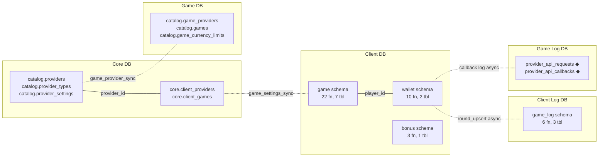
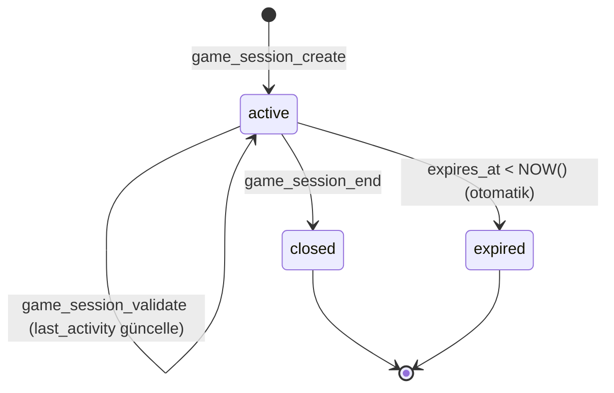
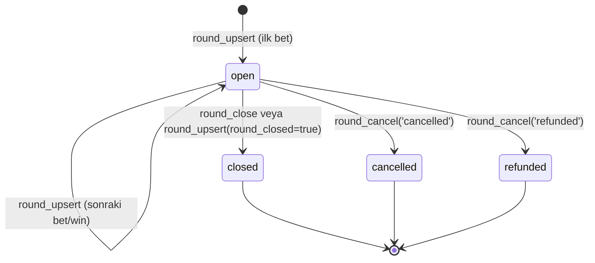
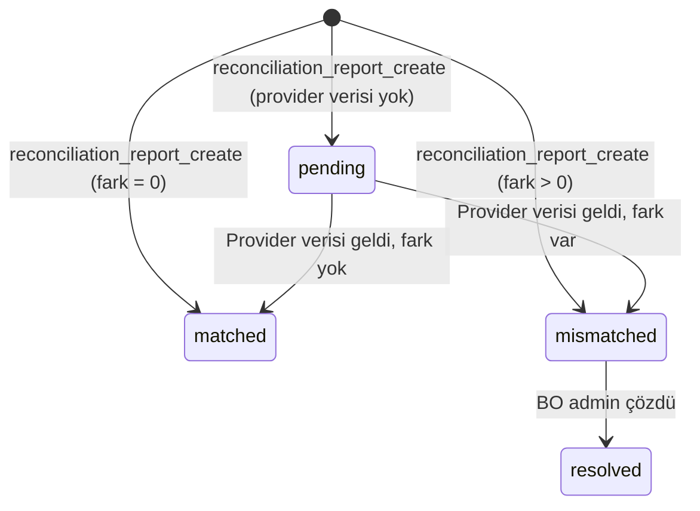
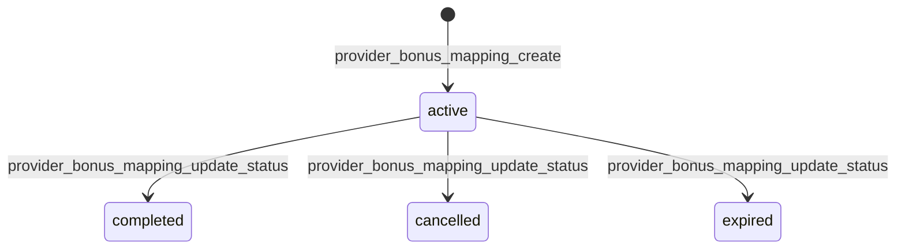

# SPEC_GAME_GATEWAY: Oyun Gateway ve Seamless Wallet Spesifikasyonu

Oyun entegrasyonunun fonksiyonel spesifikasyonu: oyun kataloğu, provider yönetimi, game session, seamless wallet (bet/win/rollback), lobi yönetimi, round takip, reconciliation. Toplam **60 fonksiyon**, **25 tablo**, **6 veritabanı**.

> **İlgili spesifikasyonlar:**
> - [SPEC_PLAYER_AUTH_KYC.md](SPEC_PLAYER_AUTH_KYC.md) — Oyuncu kayıt/login, shadow tester, wallet oluşturma
> - [SPEC_FINANCE_GATEWAY.md](SPEC_FINANCE_GATEWAY.md) — Deposit/withdrawal wallet işlemleri
> - [SPEC_BONUS_ENGINE.md](SPEC_BONUS_ENGINE.md) — Bonus award, free spin entegrasyonu

---

## 1. Kapsam ve Veritabanı Dağılımı

### 1.1 Kapsam Özeti

| Alan | Fonksiyon | Açıklama |
|------|-----------|----------|
| Oyun Kataloğu (Game DB) | 8 | Provider sync, oyun CRUD, bulk upsert, limit sync |
| Provider Yönetimi (Core DB) | 4 | Client'a provider açma/kapama, rollout, listeleme |
| Oyun Yönetimi (Core DB) | 4 | Client'a oyun atama, listeleme, kaldırma, refresh |
| Oyun Yapılandırma (Client DB) | 9 | Game settings sync/CRUD, limit yönetimi, rollout sync |
| Lobi Yönetimi (Client DB) | 8 | Section CRUD, çeviri, oyun atama, sıralama |
| Oyun Etiketleri (Client DB) | 3 | Label CRUD (new, hot, exclusive vb.) |
| Frontend Oyun (Client DB) | 2 | Oyuncu lobisi, oyun listesi |
| Game Sessions (Client DB) | 3 | Session oluşturma, doğrulama, kapatma |
| Wallet İşlemleri (Client DB) | 10 | Bet, win, rollback, adjustment, bakiye, player info |
| Bonus Provider Mapping (Client DB) | 3 | Free spin/freebet provider eşleme |
| Round Yaşam Döngüsü (Client Log DB) | 3 | Round upsert, close, cancel |
| Reconciliation (Client Log DB) | 3 | Rapor oluşturma, mismatch, listeleme |
| **Toplam** | **60** | |

### 1.2 Veritabanı Dağılımı

| DB | Schema | Fonksiyon | Tablo | Açıklama |
|----|--------|-----------|-------|----------|
| **game** | catalog | 8 | 3 | Master oyun kataloğu, provider sync |
| **core** | core | 8 | 2 | Client-provider ve client-game yönetimi |
| **core** | catalog | — | 3 | Provider referans tabloları (paylaşımlı) |
| **client** | game | 22 | 7 | Settings, lobi, etiket, session |
| **client** | wallet | 10 | 2 | Seamless wallet işlemleri |
| **client** | bonus | 3 | 1 | Provider bonus mapping |
| **client_log** | game_log | 6 | 3 | Round takip, reconciliation |
| **game_log** | game_log | — | 2 | Provider API log (asenkron yazılır) |
| **client_report** | game | — | 2 | Saatlik/günlük istatistik (paylaşımlı) |

### 1.3 Cross-DB İlişki



> **Cross-DB kuralı:** DB'ler arası doğrudan sorgu yapılmaz. Backend orchestrate eder. `game_id` ve `provider_id` referansları uygulama katmanında korunur. `idempotency_key` ve `external_round_id` ile cross-DB correlation sağlanır.

---

## 2. Durum Makinaları ve İş Akışları

### 2.1 Game Session Durumları



| Kod | Durum | Açıklama |
|-----|-------|----------|
| active | Aktif | Oyuncu oynuyor, callback'ler kabul edilir |
| closed | Kapatıldı | Oyuncu çıktı veya provider kapattı |
| expired | Süresi doldu | TTL aşıldı (varsayılan 480 dk) |

| Geçiş | Tetikleyen | ended_reason |
|--------|-----------|-------------|
| active → closed | game_session_end | PLAYER_LOGOUT, PROVIDER_CLOSE, FORCED |
| active → expired | game_session_validate (otomatik) | TIMEOUT |

### 2.2 Round Durumları



| Kod | Durum | Açıklama |
|-----|-------|----------|
| open | Açık | Round devam ediyor, tutarlar kümülatif |
| closed | Kapandı | Round normal tamamlandı |
| cancelled | İptal | Provider tarafından iptal edildi |
| refunded | İade | Full refund sonrası iade |

### 2.3 Reconciliation Durumları



| Kod | Durum | Açıklama |
|-----|-------|----------|
| pending | Beklemede | Provider verisi henüz gelmedi |
| matched | Eşleşti | our_total = provider_total |
| mismatched | Uyuşmadı | Fark tespit edildi |
| resolved | Çözüldü | BO admin tarafından çözüldü |

### 2.4 Provider Rollout Durumları

| Kod | Durum | Görünürlük |
|-----|-------|-----------|
| shadow | Gölge | Sadece shadow_testers tablosundaki oyuncular görür |
| production | Üretim | Tüm oyuncular görür |

> Shadow tester yönetimi için bkz. [SPEC_PLAYER_AUTH_KYC.md](SPEC_PLAYER_AUTH_KYC.md) §4.14

### 2.5 Bonus Provider Mapping Durumları



| Kod | Durum | Açıklama |
|-----|-------|----------|
| active | Aktif | Free spin/freebet devam ediyor |
| completed | Tamamlandı | Oyuncu kullandı |
| cancelled | İptal | Admin veya sistem iptal etti |
| expired | Süresi doldu | Kullanılmadan süre doldu |

---

## 3. Veri Modeli

### 3.1 Game DB — Oyun Kataloğu

#### `catalog.game_providers`

| Kolon | Tip | Constraint | Açıklama |
|-------|-----|-----------|----------|
| id | BIGINT | PK (serial değil) | Core catalog.providers.id ile aynı |
| provider_code | VARCHAR(50) | NOT NULL | PP, EVOLUTION vb. |
| provider_name | VARCHAR(255) | NOT NULL | Sağlayıcı adı |
| is_active | BOOLEAN | NOT NULL DEFAULT true | Aktiflik |
| created_at | TIMESTAMPTZ | NOT NULL DEFAULT NOW() | Oluşturma |
| updated_at | TIMESTAMPTZ | NOT NULL DEFAULT NOW() | Güncelleme |

#### `catalog.games`

| Kolon | Tip | Constraint | Açıklama |
|-------|-----|-----------|----------|
| id | BIGSERIAL | PK | Oyun ID |
| provider_id | BIGINT | NOT NULL | FK: game_providers.id |
| external_game_id | VARCHAR(100) | NOT NULL | Provider tarafı oyun ID |
| game_code | VARCHAR(100) | NOT NULL | Oyun kodu (lowercase) |
| game_name | VARCHAR(255) | NOT NULL | Oyun adı |
| studio | VARCHAR(100) | | Stüdyo adı |
| description | TEXT | | Açıklama |
| game_type | VARCHAR(50) | NOT NULL DEFAULT 'slot' | SLOT, LIVE, TABLE, CRASH, SCRATCH, BINGO, VIRTUAL |
| game_subtype | VARCHAR(50) | | Alt tip |
| categories | VARCHAR(50)[] | DEFAULT '{}' | Kategoriler |
| tags | VARCHAR(50)[] | DEFAULT '{}' | Etiketler |
| rtp | DECIMAL(5,2) | | Return to player (%) |
| volatility | VARCHAR(20) | | LOW, MEDIUM, HIGH, VERY_HIGH |
| hit_frequency | DECIMAL(5,2) | | İsabet oranı (%) |
| max_multiplier | DECIMAL(10,2) | | Maks çarpan |
| paylines | INTEGER | | Ödeme çizgisi |
| reels | INTEGER | | Makara sayısı |
| rows | INTEGER | | Satır sayısı |
| thumbnail_url | VARCHAR(500) | | Küçük resim |
| background_url | VARCHAR(500) | | Arka plan |
| logo_url | VARCHAR(500) | | Logo |
| banner_url | VARCHAR(500) | | Banner |
| min_bet | DECIMAL(18,8) | | Provider varsayılan min bahis |
| max_bet | DECIMAL(18,8) | | Provider varsayılan maks bahis |
| default_bet | DECIMAL(18,8) | | Varsayılan bahis |
| features | VARCHAR(50)[] | DEFAULT '{}' | Özellikler |
| has_demo | BOOLEAN | NOT NULL DEFAULT true | Demo modu var mı |
| has_jackpot | BOOLEAN | NOT NULL DEFAULT false | Jackpot var mı |
| jackpot_type | VARCHAR(50) | | Jackpot tipi |
| has_bonus_buy | BOOLEAN | NOT NULL DEFAULT false | Bonus buy var mı |
| is_mobile | BOOLEAN | NOT NULL DEFAULT true | Mobil destek |
| is_desktop | BOOLEAN | NOT NULL DEFAULT true | Masaüstü destek |
| is_tablet | BOOLEAN | NOT NULL DEFAULT true | Tablet destek |
| supported_platforms | VARCHAR(20)[] | DEFAULT '{web,mobile,app}' | Desteklenen platformlar |
| supported_currencies | CHAR(3)[] | DEFAULT '{}' | Desteklenen fiat |
| supported_cryptocurrencies | VARCHAR(20)[] | DEFAULT '{}' | Desteklenen crypto |
| supported_languages | CHAR(2)[] | DEFAULT '{}' | Desteklenen diller |
| blocked_countries | CHAR(2)[] | DEFAULT '{}' | Engelli ülkeler |
| certified_jurisdictions | VARCHAR(20)[] | DEFAULT '{}' | Sertifikalı yetki alanları |
| age_restriction | SMALLINT | DEFAULT 18 | Yaş sınırı |
| sort_order | INTEGER | DEFAULT 0 | Sıralama |
| popularity_score | INTEGER | DEFAULT 0 | Popülerlik puanı |
| release_date | DATE | | Çıkış tarihi |
| provider_updated_at | TIMESTAMPTZ | | Provider güncelleme zamanı |
| is_active | BOOLEAN | NOT NULL DEFAULT true | Aktiflik |
| created_at | TIMESTAMPTZ | NOT NULL DEFAULT NOW() | Oluşturma |
| updated_at | TIMESTAMPTZ | NOT NULL DEFAULT NOW() | Güncelleme |

**UNIQUE:** `(provider_id, external_game_id)`

#### `catalog.game_currency_limits`

| Kolon | Tip | Constraint | Açıklama |
|-------|-----|-----------|----------|
| id | BIGSERIAL | PK | |
| game_id | BIGINT | NOT NULL | FK: games.id |
| currency_code | VARCHAR(20) | NOT NULL | Para birimi kodu |
| currency_type | SMALLINT | NOT NULL DEFAULT 1 | 1=Fiat, 2=Crypto |
| min_bet | DECIMAL(18,8) | NOT NULL | Min bahis |
| max_bet | DECIMAL(18,8) | NOT NULL | Maks bahis |
| default_bet | DECIMAL(18,8) | | Varsayılan bahis |
| max_win | DECIMAL(18,8) | | Maks kazanç |
| is_active | BOOLEAN | NOT NULL DEFAULT true | Soft delete |
| created_at | TIMESTAMPTZ | NOT NULL DEFAULT NOW() | |
| updated_at | TIMESTAMPTZ | NOT NULL DEFAULT NOW() | |

**UNIQUE:** `(game_id, currency_code)`

### 3.2 Core DB — Provider & Oyun Atamaları

#### `core.client_providers`

| Kolon | Tip | Constraint | Açıklama |
|-------|-----|-----------|----------|
| id | BIGSERIAL | PK | |
| client_id | BIGINT | NOT NULL | FK: clients.id |
| provider_id | BIGINT | NOT NULL | FK: providers.id |
| mode | VARCHAR(20) | NOT NULL DEFAULT 'real' | real, demo, test |
| is_enabled | BOOLEAN | NOT NULL DEFAULT true | Aktiflik |
| rollout_status | VARCHAR(20) | NOT NULL DEFAULT 'production' | shadow, production |
| created_at | TIMESTAMP | NOT NULL DEFAULT now() | |
| updated_at | TIMESTAMP | NOT NULL DEFAULT now() | |

**CHECK:** `rollout_status IN ('shadow', 'production')`

#### `core.client_games`

| Kolon | Tip | Constraint | Açıklama |
|-------|-----|-----------|----------|
| id | BIGSERIAL | PK | |
| client_id | BIGINT | NOT NULL | FK: clients.id |
| game_id | BIGINT | NOT NULL | Game DB referansı (cross-DB, FK yok) |
| game_name | VARCHAR(255) | | Denormalize: oyun adı |
| game_code | VARCHAR(100) | | Denormalize: oyun kodu |
| provider_code | VARCHAR(50) | | Denormalize: provider kodu |
| game_type | VARCHAR(50) | | Denormalize: oyun tipi |
| thumbnail_url | VARCHAR(500) | | Denormalize: küçük resim |
| is_enabled | BOOLEAN | NOT NULL DEFAULT true | Aktiflik |
| enabled_at | TIMESTAMP | | Aktifleşme zamanı |
| disabled_at | TIMESTAMP | | Devre dışı bırakma zamanı |
| disabled_reason | VARCHAR(255) | | Devre dışı bırakma nedeni |
| is_visible | BOOLEAN | NOT NULL DEFAULT true | Görünürlük |
| is_featured | BOOLEAN | NOT NULL DEFAULT false | Öne çıkan |
| display_order | INTEGER | DEFAULT 0 | Sıralama |
| custom_name | VARCHAR(255) | | Client özel ad |
| custom_thumbnail_url | VARCHAR(500) | | Client özel görsel |
| custom_categories | VARCHAR(50)[] | DEFAULT '{}' | Client özel kategoriler |
| custom_tags | VARCHAR(50)[] | DEFAULT '{}' | Client özel etiketler |
| rtp_variant | VARCHAR(20) | | RTP varyantı |
| allowed_platforms | VARCHAR(20)[] | DEFAULT '{web,mobile,app}' | İzin verilen platformlar |
| blocked_countries | CHAR(2)[] | DEFAULT '{}' | Engelli ülkeler |
| allowed_countries | CHAR(2)[] | DEFAULT '{}' | İzinli ülkeler |
| available_from | TIMESTAMP | | Başlangıç zamanı |
| available_until | TIMESTAMP | | Bitiş zamanı |
| sync_status | VARCHAR(20) | DEFAULT 'pending' | pending, synced, failed |
| last_synced_at | TIMESTAMP | | Son senkronizasyon |
| created_at | TIMESTAMP | NOT NULL DEFAULT now() | |
| updated_at | TIMESTAMP | NOT NULL DEFAULT now() | |
| created_by | BIGINT | | Oluşturan kullanıcı |
| updated_by | BIGINT | | Güncelleyen kullanıcı |

### 3.3 Client DB — Oyun Yapılandırma

#### `game.game_settings`

| Kolon | Tip | Constraint | Açıklama |
|-------|-----|-----------|----------|
| id | BIGSERIAL | PK | |
| game_id | BIGINT | NOT NULL | Core client_games referansı |
| provider_id | BIGINT | NOT NULL | Provider ID |
| external_game_id | VARCHAR(100) | NOT NULL | Provider tarafı oyun ID |
| game_code | VARCHAR(100) | NOT NULL | Oyun kodu |
| game_name | VARCHAR(255) | NOT NULL | Oyun adı |
| provider_code | VARCHAR(50) | NOT NULL | Provider kodu |
| studio | VARCHAR(100) | | Stüdyo |
| game_type | VARCHAR(50) | NOT NULL DEFAULT 'SLOT' | Oyun tipi |
| game_subtype | VARCHAR(50) | | Alt tip |
| categories | VARCHAR(50)[] | DEFAULT '{}' | Katalog kategorileri |
| tags | VARCHAR(50)[] | DEFAULT '{}' | Katalog etiketleri |
| rtp | DECIMAL(5,2) | | RTP (%) |
| volatility | VARCHAR(20) | | Volatilite |
| max_multiplier | DECIMAL(10,2) | | Maks çarpan |
| paylines | INTEGER | | Ödeme çizgisi |
| thumbnail_url | VARCHAR(500) | | Katalog görseli |
| background_url | VARCHAR(500) | | Arka plan |
| logo_url | VARCHAR(500) | | Logo |
| features | VARCHAR(50)[] | DEFAULT '{}' | Özellikler |
| has_demo | BOOLEAN | NOT NULL DEFAULT true | Demo var mı |
| has_jackpot | BOOLEAN | NOT NULL DEFAULT false | Jackpot var mı |
| jackpot_type | VARCHAR(50) | | Jackpot tipi |
| has_bonus_buy | BOOLEAN | NOT NULL DEFAULT false | Bonus buy var mı |
| is_mobile | BOOLEAN | NOT NULL DEFAULT true | Mobil destek |
| is_desktop | BOOLEAN | NOT NULL DEFAULT true | Masaüstü destek |
| display_order | INTEGER | DEFAULT 0 | Client sıralama |
| is_visible | BOOLEAN | NOT NULL DEFAULT true | Görünürlük |
| is_enabled | BOOLEAN | NOT NULL DEFAULT true | Aktiflik |
| is_featured | BOOLEAN | NOT NULL DEFAULT false | Öne çıkan |
| custom_name | VARCHAR(255) | | Client özel ad |
| custom_thumbnail_url | VARCHAR(500) | | Client özel görsel |
| custom_categories | VARCHAR(50)[] | DEFAULT '{}' | Client özel kategoriler |
| custom_tags | VARCHAR(50)[] | DEFAULT '{}' | Client özel etiketler |
| rtp_variant | VARCHAR(20) | | RTP varyantı |
| allowed_platforms | VARCHAR(20)[] | DEFAULT '{WEB,MOBILE,APP}' | İzinli platformlar |
| blocked_countries | CHAR(2)[] | DEFAULT '{}' | Engelli ülkeler |
| allowed_countries | CHAR(2)[] | DEFAULT '{}' | İzinli ülkeler |
| rollout_status | VARCHAR(20) | NOT NULL DEFAULT 'production' | shadow, production |
| available_from | TIMESTAMP | | Başlangıç |
| available_until | TIMESTAMP | | Bitiş |
| popularity_score | INTEGER | DEFAULT 0 | Popülerlik |
| play_count | BIGINT | DEFAULT 0 | Oynanma sayısı |
| core_synced_at | TIMESTAMP | | Son sync zamanı |
| created_at | TIMESTAMP | NOT NULL DEFAULT now() | |
| updated_at | TIMESTAMP | NOT NULL DEFAULT now() | |

#### `game.game_limits`

| Kolon | Tip | Constraint | Açıklama |
|-------|-----|-----------|----------|
| id | BIGSERIAL | PK | |
| game_id | BIGINT | NOT NULL | game_settings referansı |
| currency_code | VARCHAR(20) | NOT NULL | Para birimi |
| currency_type | SMALLINT | NOT NULL DEFAULT 1 | 1=Fiat, 2=Crypto |
| min_bet | DECIMAL(18,8) | NOT NULL | Min bahis |
| max_bet | DECIMAL(18,8) | NOT NULL | Maks bahis |
| default_bet | DECIMAL(18,8) | | Varsayılan bahis |
| max_win | DECIMAL(18,8) | | Maks kazanç |
| is_active | BOOLEAN | NOT NULL DEFAULT true | Soft delete |
| created_at | TIMESTAMP | NOT NULL DEFAULT now() | |
| updated_at | TIMESTAMP | NOT NULL DEFAULT now() | |

**UNIQUE:** `(game_id, currency_code)`

#### `game.game_sessions`

| Kolon | Tip | Constraint | Açıklama |
|-------|-----|-----------|----------|
| id | BIGSERIAL | PK | |
| session_token | VARCHAR(100) | NOT NULL | Benzersiz oturum token |
| player_id | BIGINT | NOT NULL | Oyuncu ID |
| provider_code | VARCHAR(50) | NOT NULL | Provider kodu |
| game_code | VARCHAR(100) | NOT NULL | Oyun kodu |
| external_game_id | VARCHAR(100) | | Provider oyun ID |
| currency_code | VARCHAR(20) | NOT NULL | Para birimi |
| mode | VARCHAR(20) | NOT NULL DEFAULT 'real' | real, demo, fun |
| status | VARCHAR(20) | NOT NULL DEFAULT 'active' | active, expired, closed |
| ip_address | INET | | İstemci IP |
| device_type | VARCHAR(20) | | Cihaz tipi |
| user_agent | VARCHAR(500) | | User agent |
| launch_url | TEXT | | Provider launch URL |
| metadata | JSONB | | Ek veriler |
| created_at | TIMESTAMPTZ | NOT NULL DEFAULT NOW() | |
| expires_at | TIMESTAMPTZ | NOT NULL | Bitiş zamanı |
| last_activity_at | TIMESTAMPTZ | | Son aktivite |
| ended_at | TIMESTAMPTZ | | Kapanma zamanı |
| ended_reason | VARCHAR(50) | | PLAYER_LOGOUT, TIMEOUT, PROVIDER_CLOSE, FORCED |

#### `game.lobby_sections`

| Kolon | Tip | Constraint | Açıklama |
|-------|-----|-----------|----------|
| id | BIGINT | PK (IDENTITY) | |
| code | VARCHAR(100) | NOT NULL UNIQUE | Benzersiz kod |
| section_type | VARCHAR(30) | NOT NULL DEFAULT 'manual' | manual, auto_new, auto_popular, auto_jackpot, auto_top_rated |
| max_items | SMALLINT | NOT NULL DEFAULT 20 | Maks öğe |
| display_order | SMALLINT | NOT NULL DEFAULT 0 | Sıralama |
| link_url | VARCHAR(500) | | Yönlendirme URL |
| is_active | BOOLEAN | NOT NULL DEFAULT TRUE | Soft delete |
| created_at | TIMESTAMPTZ | NOT NULL DEFAULT NOW() | |
| updated_at | TIMESTAMPTZ | NOT NULL DEFAULT NOW() | |
| created_by | BIGINT | | Oluşturan |
| updated_by | BIGINT | | Güncelleyen |

#### `game.lobby_section_translations`

| Kolon | Tip | Constraint | Açıklama |
|-------|-----|-----------|----------|
| id | BIGINT | PK (IDENTITY) | |
| lobby_section_id | BIGINT | NOT NULL | FK: lobby_sections.id (CASCADE) |
| language_code | VARCHAR(5) | NOT NULL | Dil kodu (en, tr) |
| title | VARCHAR(200) | NOT NULL | Başlık |
| subtitle | VARCHAR(500) | | Alt başlık |

**UNIQUE:** `(lobby_section_id, language_code)`

#### `game.lobby_section_games`

| Kolon | Tip | Constraint | Açıklama |
|-------|-----|-----------|----------|
| id | BIGINT | PK (IDENTITY) | |
| lobby_section_id | BIGINT | NOT NULL | FK: lobby_sections.id (CASCADE) |
| game_id | BIGINT | NOT NULL | Core DB oyun ID (cross-DB, FK yok) |
| display_order | SMALLINT | NOT NULL DEFAULT 0 | Sıralama |
| is_active | BOOLEAN | NOT NULL DEFAULT TRUE | Soft delete |
| created_at | TIMESTAMPTZ | NOT NULL DEFAULT NOW() | |
| updated_at | TIMESTAMPTZ | NOT NULL DEFAULT NOW() | |
| created_by | BIGINT | | |
| updated_by | BIGINT | | |

**UNIQUE:** `(lobby_section_id, game_id)`

#### `game.game_labels`

| Kolon | Tip | Constraint | Açıklama |
|-------|-----|-----------|----------|
| id | BIGINT | PK (IDENTITY) | |
| game_id | BIGINT | NOT NULL | Core DB oyun ID (cross-DB, FK yok) |
| label_type | VARCHAR(30) | NOT NULL | new, hot, exclusive, jackpot, featured, top, live, recommended |
| label_color | VARCHAR(7) | | Hex renk (#RRGGBB) |
| expires_at | TIMESTAMPTZ | | NULL = kalıcı |
| is_active | BOOLEAN | NOT NULL DEFAULT TRUE | Soft delete |
| created_at | TIMESTAMPTZ | NOT NULL DEFAULT NOW() | |
| updated_at | TIMESTAMPTZ | NOT NULL DEFAULT NOW() | |
| created_by | BIGINT | | |
| updated_by | BIGINT | | |

**UNIQUE:** `(game_id, label_type)`

### 3.4 Client DB — Wallet

#### `wallet.wallets`

| Kolon | Tip | Constraint | Açıklama |
|-------|-----|-----------|----------|
| id | BIGSERIAL | PK | |
| player_id | BIGINT | NOT NULL | Oyuncu ID |
| wallet_type | VARCHAR(20) | NOT NULL | REAL, BONUS, LOCKED, COIN |
| currency_type | SMALLINT | NOT NULL DEFAULT 1 | 1=Fiat, 2=Crypto |
| currency_code | VARCHAR(20) | NOT NULL | Para birimi kodu |
| status | SMALLINT | NOT NULL DEFAULT 1 | 1=Aktif, 0=Pasif, 2=Dondurulmuş |
| is_default | BOOLEAN | NOT NULL DEFAULT false | Varsayılan cüzdan mı |
| created_at | TIMESTAMP | NOT NULL DEFAULT now() | |
| updated_at | TIMESTAMP | NOT NULL DEFAULT now() | |

> Wallet oluşturma için bkz. [SPEC_PLAYER_AUTH_KYC.md](SPEC_PLAYER_AUTH_KYC.md) §4.17

#### `wallet.wallet_snapshots`

| Kolon | Tip | Constraint | Açıklama |
|-------|-----|-----------|----------|
| wallet_id | BIGINT | PK | 1:1 wallets referansı |
| balance | NUMERIC(18,8) | NOT NULL | Güncel bakiye |
| last_transaction_id | BIGINT | NOT NULL | Son işlem ID |
| updated_at | TIMESTAMP | NOT NULL DEFAULT now() | |

#### `bonus.provider_bonus_mappings`

| Kolon | Tip | Constraint | Açıklama |
|-------|-----|-----------|----------|
| id | BIGSERIAL | PK | |
| bonus_award_id | BIGINT | NOT NULL | FK: bonus_awards.id |
| provider_code | VARCHAR(50) | NOT NULL | Provider kodu |
| provider_bonus_type | VARCHAR(50) | NOT NULL | FREE_SPINS, FREE_CHIPS, TOURNAMENT, FREEBET |
| provider_bonus_id | VARCHAR(100) | NOT NULL | Provider tarafı bonus ID |
| provider_request_id | VARCHAR(100) | | Provider istek ID |
| status | VARCHAR(20) | NOT NULL DEFAULT 'active' | active, completed, cancelled, expired |
| provider_data | JSONB | | Provider ek verileri |
| created_at | TIMESTAMP | NOT NULL DEFAULT NOW() | |
| updated_at | TIMESTAMP | NOT NULL DEFAULT NOW() | |

### 3.5 Client Log DB — Round ve Reconciliation

#### `game_log.game_rounds` ◆ (Günlük partition, 30 gün retention)

| Kolon | Tip | Constraint | Açıklama |
|-------|-----|-----------|----------|
| id | BIGSERIAL | | |
| player_id | BIGINT | NOT NULL | Oyuncu ID |
| game_code | VARCHAR(100) | NOT NULL | Oyun kodu |
| game_name | VARCHAR(255) | | Oyun adı |
| provider_code | VARCHAR(50) | NOT NULL | Provider kodu |
| game_type | VARCHAR(50) | | Oyun tipi |
| external_round_id | VARCHAR(100) | NOT NULL | Provider round ID |
| external_session_id | VARCHAR(100) | | Provider session ID |
| parent_round_id | VARCHAR(100) | | Üst round ID |
| bet_amount | DECIMAL(18,8) | NOT NULL DEFAULT 0 | Kümülatif bahis tutarı |
| win_amount | DECIMAL(18,8) | NOT NULL DEFAULT 0 | Kümülatif kazanç tutarı |
| net_amount | DECIMAL(18,8) | NOT NULL DEFAULT 0 | net = win - bet |
| jackpot_amount | DECIMAL(18,8) | DEFAULT 0 | Jackpot tutarı |
| currency_code | VARCHAR(20) | NOT NULL | Para birimi |
| round_status | VARCHAR(20) | NOT NULL DEFAULT 'open' | open, closed, cancelled, refunded |
| is_free_round | BOOLEAN | NOT NULL DEFAULT false | Free round mu |
| is_bonus_round | BOOLEAN | NOT NULL DEFAULT false | Bonus round mu |
| bonus_award_id | BIGINT | | Bonus award referansı |
| round_detail | JSONB | DEFAULT '{}' | Oyun tipine göre detaylar |
| started_at | TIMESTAMPTZ | NOT NULL DEFAULT NOW() | Başlangıç |
| ended_at | TIMESTAMPTZ | | Bitiş |
| duration_ms | INTEGER | | Süre (ms) |
| bet_transaction_id | BIGINT | | Client transactions referansı |
| win_transaction_id | BIGINT | | Client transactions referansı |
| device_type | VARCHAR(20) | | Cihaz |
| ip_address | INET | | IP adresi |
| created_at | TIMESTAMP | NOT NULL DEFAULT now() | Partition key |

**PK:** `(id, created_at)` — Composite (partition gereksinimi)

#### `game_log.reconciliation_reports`

| Kolon | Tip | Constraint | Açıklama |
|-------|-----|-----------|----------|
| id | BIGSERIAL | PK | |
| provider_code | VARCHAR(50) | NOT NULL | Provider kodu |
| report_date | DATE | NOT NULL | Rapor tarihi |
| currency_code | VARCHAR(20) | NOT NULL | Para birimi |
| our_total_bet | DECIMAL(18,8) | DEFAULT 0 | Bizim toplam bahis |
| our_total_win | DECIMAL(18,8) | DEFAULT 0 | Bizim toplam kazanç |
| our_total_rounds | BIGINT | DEFAULT 0 | Bizim round sayısı |
| provider_total_bet | DECIMAL(18,8) | DEFAULT 0 | Provider toplam bahis |
| provider_total_win | DECIMAL(18,8) | DEFAULT 0 | Provider toplam kazanç |
| provider_total_rounds | BIGINT | DEFAULT 0 | Provider round sayısı |
| bet_diff | DECIMAL(18,8) | GENERATED (our_bet - provider_bet) | Bahis farkı |
| win_diff | DECIMAL(18,8) | GENERATED (our_win - provider_win) | Kazanç farkı |
| status | VARCHAR(20) | NOT NULL DEFAULT 'pending' | pending, matched, mismatched, resolved |
| mismatch_details | JSONB | | Uyuşmazlık detayları |
| resolved_by | BIGINT | | Çözen kullanıcı |
| resolved_at | TIMESTAMPTZ | | Çözüm zamanı |
| created_at | TIMESTAMPTZ | NOT NULL DEFAULT NOW() | |
| updated_at | TIMESTAMPTZ | NOT NULL DEFAULT NOW() | |

#### `game_log.reconciliation_mismatches`

| Kolon | Tip | Constraint | Açıklama |
|-------|-----|-----------|----------|
| id | BIGSERIAL | PK | |
| report_id | BIGINT | NOT NULL | FK: reconciliation_reports.id |
| external_round_id | VARCHAR(100) | | Provider round ID |
| external_transaction_id | VARCHAR(100) | | Provider transaction ID |
| mismatch_type | VARCHAR(50) | NOT NULL | missing_our_side, missing_provider, amount_diff, status_diff |
| our_amount | DECIMAL(18,8) | | Bizim tutar |
| provider_amount | DECIMAL(18,8) | | Provider tutarı |
| our_status | VARCHAR(20) | | Bizim durum |
| provider_status | VARCHAR(20) | | Provider durumu |
| details | JSONB | | Detaylar |
| resolution_status | VARCHAR(20) | DEFAULT 'open' | open, resolved, ignored |
| resolved_by | BIGINT | | Çözen kullanıcı |
| resolved_at | TIMESTAMPTZ | | Çözüm zamanı |
| created_at | TIMESTAMPTZ | NOT NULL DEFAULT NOW() | |

### 3.6 Game Log DB — Provider API Logları (Asenkron)

#### `game_log.provider_api_requests` ◆ (Günlük partition, 7 gün retention)

| Kolon | Tip | Constraint | Açıklama |
|-------|-----|-----------|----------|
| id | BIGSERIAL | | |
| client_id | BIGINT | NOT NULL | Client ID |
| player_id | BIGINT | | Oyuncu ID |
| provider_code | VARCHAR(50) | NOT NULL | Provider kodu |
| game_code | VARCHAR(100) | | Oyun kodu |
| request_id | UUID | DEFAULT gen_random_uuid() | İstek ID |
| action_type | VARCHAR(50) | NOT NULL | game_launch, bet, win, balance, refund, rollback |
| api_endpoint | VARCHAR(500) | NOT NULL | API endpoint |
| api_method | VARCHAR(10) | NOT NULL DEFAULT 'POST' | HTTP metod |
| request_headers | JSONB | | İstek başlıkları |
| request_payload | JSONB | | İstek gövdesi |
| response_payload | JSONB | | Yanıt gövdesi |
| http_status_code | SMALLINT | | HTTP durum kodu |
| status | VARCHAR(20) | NOT NULL DEFAULT 'pending' | pending, success, failed, timeout, error |
| error_code | VARCHAR(50) | | Hata kodu |
| error_message | TEXT | | Hata mesajı |
| response_time_ms | INTEGER | | Yanıt süresi (ms) |
| external_round_id | VARCHAR(100) | | Round ID |
| external_transaction_id | VARCHAR(100) | | Transaction ID |
| amount | DECIMAL(18,8) | | Tutar |
| currency_code | VARCHAR(20) | | Para birimi |
| created_at | TIMESTAMP | NOT NULL DEFAULT now() | Partition key |

**PK:** `(id, created_at)` — Composite

#### `game_log.provider_api_callbacks` ◆ (Günlük partition, 7 gün retention)

| Kolon | Tip | Constraint | Açıklama |
|-------|-----|-----------|----------|
| id | BIGSERIAL | | |
| client_id | BIGINT | | Client ID |
| player_id | BIGINT | | Oyuncu ID |
| provider_code | VARCHAR(50) | NOT NULL | Provider kodu |
| game_code | VARCHAR(100) | | Oyun kodu |
| callback_type | VARCHAR(50) | NOT NULL | bet, win, refund, rollback, jackpot, freespin, bonus |
| callback_endpoint | VARCHAR(500) | | Callback endpoint |
| raw_payload | JSONB | NOT NULL | Ham callback verisi |
| parsed_payload | JSONB | | İşlenmiş veri |
| processing_status | VARCHAR(20) | NOT NULL DEFAULT 'received' | received, processing, processed, failed, rejected, duplicate |
| error_code | VARCHAR(50) | | Hata kodu |
| error_message | TEXT | | Hata mesajı |
| processing_time_ms | INTEGER | | İşleme süresi (ms) |
| external_round_id | VARCHAR(100) | | Round ID |
| external_transaction_id | VARCHAR(100) | | Transaction ID |
| amount | DECIMAL(18,8) | | Tutar |
| currency_code | VARCHAR(20) | | Para birimi |
| signature_valid | BOOLEAN | | İmza geçerli mi |
| source_ip | INET | | Kaynak IP |
| created_at | TIMESTAMP | NOT NULL DEFAULT now() | Partition key |

**PK:** `(id, created_at)` — Composite

### 3.7 Client Report DB — İstatistikler (Paylaşımlı)

#### `game.game_hourly_stats` ◆ (Aylık partition, sınırsız retention)

| Kolon | Tip | Constraint | Açıklama |
|-------|-----|-----------|----------|
| id | BIGSERIAL | | |
| period_hour | TIMESTAMPTZ | NOT NULL | Saat dilimi |
| player_id | BIGINT | NOT NULL | Oyuncu ID |
| wallet_id | BIGINT | NOT NULL | Cüzdan ID |
| currency | VARCHAR(20) | NOT NULL | Para birimi |
| total_bet | NUMERIC(18,8) | DEFAULT 0 | Toplam bahis |
| total_win | NUMERIC(18,8) | DEFAULT 0 | Toplam kazanç |
| total_count | INT | DEFAULT 0 | Toplam işlem |
| game_details | JSONB | DEFAULT '{}' | Oyun bazlı detay (document-based) |
| provider_stats | JSONB | DEFAULT '{}' | Provider bazlı özet |
| updated_at | TIMESTAMP | | Güncelleme |

**PK:** `(id, period_hour)` — Composite

#### `game.game_performance_daily` ◆ (Aylık partition, sınırsız retention)

| Kolon | Tip | Constraint | Açıklama |
|-------|-----|-----------|----------|
| id | BIGSERIAL | | |
| report_date | DATE | NOT NULL | Rapor tarihi |
| game_id | BIGINT | | NULL = provider toplamı |
| provider_id | BIGINT | NOT NULL | Provider ID |
| currency | VARCHAR(20) | NOT NULL | Para birimi |
| total_rounds | BIGINT | DEFAULT 0 | Toplam round |
| total_bet | NUMERIC(18,8) | DEFAULT 0 | Toplam bahis |
| total_win | NUMERIC(18,8) | DEFAULT 0 | Toplam kazanç |
| total_ggr | NUMERIC(18,8) | GENERATED (bet - win) | GGR |
| unique_players | INT | DEFAULT 0 | Tekil oyuncu |
| rtp_actual | NUMERIC(5,2) | DEFAULT 0 | Gerçek RTP |
| created_at | TIMESTAMP | NOT NULL DEFAULT now() | |
| updated_at | TIMESTAMP | | |

**PK:** `(id, report_date)` — Composite

---

## 4. Fonksiyon Spesifikasyonları

### 4.1 Oyun Kataloğu — Game DB (8 fonksiyon)

#### `catalog.game_provider_sync`

| Parametre | Tip | Zorunlu | Varsayılan | Açıklama |
|-----------|-----|---------|------------|----------|
| p_providers | TEXT | Evet | - | JSONB array (TEXT olarak): [{id, provider_code, provider_name, is_active}] |

**Dönüş:** `INTEGER` — Upsert edilen provider sayısı

**İş Kuralları:**
1. p_providers TEXT → `::JSONB` cast yapılır.
2. JSONB array doğrulanır.
3. Her eleman için UPSERT: mevcut provider_id varsa günceller, yoksa ekler.
4. provider_code UPPER normalizasyonu uygulanır.
5. Core DB'den Game DB'ye provider sync için kullanılır (aynı ID'ler).

**Hata Kodları:**

| Hata Key | ERRCODE | Koşul |
|----------|---------|-------|
| error.provider.data-required | P0400 | p_providers NULL veya boş |
| error.provider.invalid-format | P0400 | Geçersiz JSONB array |

---

#### `catalog.game_upsert`

| Parametre | Tip | Zorunlu | Varsayılan | Açıklama |
|-----------|-----|---------|------------|----------|
| p_provider_id | BIGINT | Evet | - | Provider ID |
| p_external_game_id | VARCHAR(100) | Evet | - | Provider tarafı oyun ID |
| p_game_code | VARCHAR(100) | Evet | - | Oyun kodu |
| p_game_name | VARCHAR(255) | Evet | - | Oyun adı |
| p_game_type | VARCHAR(50) | Evet | - | SLOT, LIVE, TABLE, CRASH, SCRATCH, BINGO, VIRTUAL |
| p_studio | VARCHAR(100) | Hayır | NULL | Stüdyo adı |
| p_description | TEXT | Hayır | NULL | Açıklama |
| p_game_subtype | VARCHAR(50) | Hayır | NULL | Alt tip |
| p_categories | VARCHAR(50)[] | Hayır | NULL | Kategoriler |
| p_tags | VARCHAR(50)[] | Hayır | NULL | Etiketler |
| p_rtp | DECIMAL(5,2) | Hayır | NULL | RTP (%) |
| p_volatility | VARCHAR(20) | Hayır | NULL | Volatilite |
| p_hit_frequency | DECIMAL(5,2) | Hayır | NULL | İsabet oranı |
| p_max_multiplier | DECIMAL(10,2) | Hayır | NULL | Maks çarpan |
| p_paylines | INTEGER | Hayır | NULL | Ödeme çizgisi |
| p_reels | INTEGER | Hayır | NULL | Makara sayısı |
| p_rows | INTEGER | Hayır | NULL | Satır sayısı |
| p_thumbnail_url | VARCHAR(500) | Hayır | NULL | Küçük resim |
| p_background_url | VARCHAR(500) | Hayır | NULL | Arka plan |
| p_logo_url | VARCHAR(500) | Hayır | NULL | Logo |
| p_banner_url | VARCHAR(500) | Hayır | NULL | Banner |
| p_min_bet | DECIMAL(18,8) | Hayır | NULL | Min bahis |
| p_max_bet | DECIMAL(18,8) | Hayır | NULL | Maks bahis |
| p_default_bet | DECIMAL(18,8) | Hayır | NULL | Varsayılan bahis |
| p_features | VARCHAR(50)[] | Hayır | NULL | Özellikler |
| p_has_demo | BOOLEAN | Hayır | true | Demo modu |
| p_has_jackpot | BOOLEAN | Hayır | false | Jackpot |
| p_jackpot_type | VARCHAR(50) | Hayır | NULL | Jackpot tipi |
| p_has_bonus_buy | BOOLEAN | Hayır | false | Bonus buy |
| p_is_mobile | BOOLEAN | Hayır | true | Mobil destek |
| p_is_desktop | BOOLEAN | Hayır | true | Masaüstü destek |
| p_is_tablet | BOOLEAN | Hayır | true | Tablet destek |
| p_supported_platforms | VARCHAR(20)[] | Hayır | '{web,mobile,app}' | Desteklenen platformlar |
| p_release_date | DATE | Hayır | NULL | Çıkış tarihi |

**Dönüş:** `BIGINT` — Oyun ID

**İş Kuralları:**
1. Provider varlığı kontrol edilir.
2. UPSERT: (provider_id, external_game_id) unique key.
3. game_code LOWER, game_type ve volatility UPPER normalizasyonu.
4. game_type validasyonu: SLOT, LIVE, TABLE, CRASH, SCRATCH, BINGO, VIRTUAL.
5. Mevcut oyun varsa güncellenir, yoksa eklenir.

**Hata Kodları:**

| Hata Key | ERRCODE | Koşul |
|----------|---------|-------|
| error.game.provider-id-required | P0400 | p_provider_id NULL |
| error.game.provider-not-found | P0404 | Provider bulunamadı |
| error.game.external-id-required | P0400 | p_external_game_id NULL/boş |
| error.game.code-required | P0400 | p_game_code NULL/boş |
| error.game.name-required | P0400 | p_game_name NULL/boş |
| error.game.type-required | P0400 | p_game_type NULL/boş |
| error.game.invalid-type | P0400 | Geçersiz game_type değeri |

---

#### `catalog.game_bulk_upsert`

| Parametre | Tip | Zorunlu | Varsayılan | Açıklama |
|-----------|-----|---------|------------|----------|
| p_provider_id | BIGINT | Evet | - | Provider ID |
| p_games | TEXT | Evet | - | JSONB array (TEXT olarak): oyun listesi |

**Dönüş:** `INTEGER` — Upsert edilen oyun sayısı

**İş Kuralları:**
1. Provider varlığı kontrol edilir.
2. p_games TEXT → `::JSONB` cast.
3. JSONB array doğrulanır.
4. Her eleman için UPSERT: (provider_id, external_game_id) unique key.
5. game_code LOWER, game_type ve volatility UPPER normalizasyonu.
6. Array alanları (categories, tags, features vb.) JSONB array'den extract edilir.
7. Varsayılan değerler: has_demo=true, has_jackpot=false, has_bonus_buy=false, is_mobile=true, is_desktop=true, is_tablet=true, age_restriction=18.
8. provider_updated_at güncellenir (provider sync zamanı).

**Hata Kodları:**

| Hata Key | ERRCODE | Koşul |
|----------|---------|-------|
| error.game.provider-id-required | P0400 | p_provider_id NULL |
| error.game.provider-not-found | P0404 | Provider bulunamadı |
| error.game.data-required | P0400 | p_games NULL/boş |
| error.game.invalid-format | P0400 | Geçersiz JSONB array |

---

#### `catalog.game_update`

| Parametre | Tip | Zorunlu | Varsayılan | Açıklama |
|-----------|-----|---------|------------|----------|
| p_id | BIGINT | Evet | - | Oyun ID |
| p_game_code | VARCHAR(100) | Hayır | NULL | Oyun kodu |
| _(+28 opsiyonel parametre — game_upsert ile aynı alanlar)_ | | | NULL | COALESCE pattern |
| p_is_active | BOOLEAN | Hayır | NULL | Aktiflik (soft delete) |

**Dönüş:** `VOID`

**İş Kuralları:**
1. Oyun varlığı kontrol edilir.
2. COALESCE pattern: NULL parametreler mevcut değeri korur.
3. game_code LOWER, game_type ve volatility UPPER normalizasyonu.
4. game_type validasyonu (aynı set).
5. p_is_active=FALSE → soft delete.

**Hata Kodları:**

| Hata Key | ERRCODE | Koşul |
|----------|---------|-------|
| error.game.id-required | P0400 | p_id NULL |
| error.game.not-found | P0404 | Oyun bulunamadı |
| error.game.invalid-type | P0400 | Geçersiz game_type |

---

#### `catalog.game_get`

| Parametre | Tip | Zorunlu | Varsayılan | Açıklama |
|-----------|-----|---------|------------|----------|
| p_id | BIGINT | Evet | - | Oyun ID |

**Dönüş:** `TABLE` — Tek oyun satırı (34 kolon + provider_code, provider_name)

**İş Kuralları:**
1. game_providers ile JOIN yapılır.
2. Provider bilgileri dahil edilir.
3. Backend sync ve BO detay ekranı için kullanılır.

**Hata Kodları:**

| Hata Key | ERRCODE | Koşul |
|----------|---------|-------|
| error.game.id-required | P0400 | p_id NULL |
| error.game.not-found | P0404 | Oyun bulunamadı |

---

#### `catalog.game_list`

| Parametre | Tip | Zorunlu | Varsayılan | Açıklama |
|-----------|-----|---------|------------|----------|
| p_provider_id | BIGINT | Hayır | NULL | Provider filtresi |
| p_game_type | VARCHAR(50) | Hayır | NULL | Oyun tipi filtresi |
| p_is_active | BOOLEAN | Hayır | NULL | Aktiflik filtresi |
| p_search | TEXT | Hayır | NULL | Metin arama (game_name, game_code, studio) |
| p_limit | INTEGER | Hayır | 50 | Sayfa boyutu |
| p_offset | INTEGER | Hayır | 0 | Başlangıç offset |

**Dönüş:** `TABLE` — Oyun listesi (24 kolon + total_count)

**İş Kuralları:**
1. Opsiyonel filtreler: provider, game_type, is_active, metin arama.
2. Metin arama: game_name, game_code, studio üzerinde ILIKE.
3. Sıralama: sort_order ASC, popularity_score DESC, id ASC.
4. total_count kolonu ile pagination desteği.

**Hata Kodları:** Yok (boş sonuç döner)

---

#### `catalog.game_lookup`

| Parametre | Tip | Zorunlu | Varsayılan | Açıklama |
|-----------|-----|---------|------------|----------|
| p_provider_id | BIGINT | Hayır | NULL | Provider filtresi |
| p_game_type | VARCHAR(50) | Hayır | NULL | Oyun tipi filtresi |
| p_search | TEXT | Hayır | NULL | Metin arama |

**Dönüş:** `TABLE(id, game_code, game_name, provider_id, provider_code, game_type)` — 6 kolon

**İş Kuralları:**
1. Hafif oyun listesi (dropdown/autocomplete için).
2. Sadece aktif oyunlar (is_active = true).
3. Minimal kolonlar: id, game_code, game_name, provider_id, provider_code, game_type.
4. Sıralama: game_name ASC.

**Hata Kodları:** Yok

---

#### `catalog.game_currency_limit_sync`

| Parametre | Tip | Zorunlu | Varsayılan | Açıklama |
|-----------|-----|---------|------------|----------|
| p_game_id | BIGINT | Evet | - | Oyun ID |
| p_limits | TEXT | Evet | - | JSONB array (TEXT): [{cc, ct, min, max, def, win}] |

**Dönüş:** `VOID`

**İş Kuralları:**
1. Oyun varlığı kontrol edilir.
2. p_limits TEXT → `::JSONB` cast.
3. JSONB array doğrulanır.
4. Her eleman için UPSERT: (game_id, currency_code) unique key.
5. Kısa key format: cc=currency_code, ct=currency_type, min=min_bet, max=max_bet, def=default_bet, win=max_win.
6. Payload'da olmayan limitler: is_active=false (soft delete).
7. Idempotent: tekrar çalıştırıldığında önceden silinenleri geri ekler.

**Hata Kodları:**

| Hata Key | ERRCODE | Koşul |
|----------|---------|-------|
| error.game.id-required | P0400 | p_game_id NULL |
| error.game.not-found | P0404 | Oyun bulunamadı |
| error.game.limits-data-required | P0400 | p_limits NULL/boş |
| error.game.limits-invalid-format | P0400 | Geçersiz JSONB array |

---

### 4.2 Provider Yönetimi — Core DB (4 fonksiyon)

#### `core.client_provider_enable`

| Parametre | Tip | Zorunlu | Varsayılan | Açıklama |
|-----------|-----|---------|------------|----------|
| p_caller_id | BIGINT | Evet | - | İşlemi yapan kullanıcı |
| p_client_id | BIGINT | Evet | - | Client ID |
| p_provider_id | BIGINT | Evet | - | Provider ID |
| p_game_data | TEXT | Hayır | NULL | JSONB array: seed edilecek oyun listesi |
| p_mode | VARCHAR(20) | Hayır | 'real' | real, demo, test |
| p_rollout_status | VARCHAR(20) | Hayır | 'production' | shadow, production |

**Dönüş:** `INTEGER` — Yeni eklenen oyun sayısı

**IDOR:** `security.user_assert_access_company(p_caller_id, v_company_id)`

**İş Kuralları:**
1. Client varlığı kontrol edilir, company_id alınır.
2. IDOR kontrolü (company erişimi).
3. Provider varlığı ve tipi kontrol edilir: GAME tipinde olmalı.
4. rollout_status validasyonu: 'shadow' veya 'production'.
5. UPSERT: client_providers (is_enabled=true, mode, rollout_status).
6. p_game_data varsa JSONB array parse edilir, client_games'e ON CONFLICT DO NOTHING ile seed edilir.
7. Mevcut oyunlar dokunulmaz.

**Hata Kodları:**

| Hata Key | ERRCODE | Koşul |
|----------|---------|-------|
| error.client.not-found | P0404 | Client bulunamadı |
| error.provider.not-found | P0404 | Provider bulunamadı |
| error.provider.not-game-type | P0400 | Provider GAME tipinde değil |
| error.provider.invalid-rollout-status | P0400 | Geçersiz rollout_status |

---

#### `core.client_provider_disable`

| Parametre | Tip | Zorunlu | Varsayılan | Açıklama |
|-----------|-----|---------|------------|----------|
| p_caller_id | BIGINT | Evet | - | İşlemi yapan kullanıcı |
| p_client_id | BIGINT | Evet | - | Client ID |
| p_provider_id | BIGINT | Evet | - | Provider ID |

**Dönüş:** `VOID`

**IDOR:** `security.user_assert_access_company(p_caller_id, v_company_id)`

**İş Kuralları:**
1. Client varlığı kontrol edilir.
2. IDOR kontrolü (company erişimi).
3. client_providers kaydı kontrol edilir.
4. is_enabled=false yapılır. Oyunlar (client_games) dokunulmaz.
5. Provider disable durumu, sorgu seviyesinde filtrelenir.

**Hata Kodları:**

| Hata Key | ERRCODE | Koşul |
|----------|---------|-------|
| error.client.not-found | P0404 | Client bulunamadı |
| error.client-provider.not-found | P0404 | Client-provider eşleşmesi bulunamadı |

---

#### `core.client_provider_list`

| Parametre | Tip | Zorunlu | Varsayılan | Açıklama |
|-----------|-----|---------|------------|----------|
| p_caller_id | BIGINT | Evet | - | İşlemi yapan kullanıcı |
| p_client_id | BIGINT | Evet | - | Client ID |

**Dönüş:** `JSONB` — Provider listesi

**Dönüş Yapısı:**

| Alan | Tip | Açıklama |
|------|-----|----------|
| id | BIGINT | client_providers.id |
| providerId | BIGINT | Provider ID |
| providerCode | VARCHAR | Provider kodu |
| providerName | VARCHAR | Provider adı |
| mode | VARCHAR | real, demo, test |
| isEnabled | BOOLEAN | Aktif mi |
| rolloutStatus | VARCHAR | shadow, production |
| gameCount | BIGINT | Atanmış oyun sayısı |
| createdAt | TIMESTAMP | Oluşturma |
| updatedAt | TIMESTAMP | Güncelleme |

**IDOR:** `security.user_assert_access_company(p_caller_id, v_company_id)`

**İş Kuralları:**
1. Sadece GAME tipindeki provider'lar listelenir.
2. Her provider için atanmış oyun sayısı (gameCount) hesaplanır.
3. Sıralama: provider_name ASC.
4. Boş sonuç: `[]` (boş JSONB array).

**Hata Kodları:**

| Hata Key | ERRCODE | Koşul |
|----------|---------|-------|
| error.client.not-found | P0404 | Client bulunamadı |

---

#### `core.client_provider_set_rollout`

| Parametre | Tip | Zorunlu | Varsayılan | Açıklama |
|-----------|-----|---------|------------|----------|
| p_caller_id | BIGINT | Evet | - | İşlemi yapan kullanıcı |
| p_client_id | BIGINT | Evet | - | Client ID |
| p_provider_id | BIGINT | Evet | - | Provider ID |
| p_rollout_status | VARCHAR(20) | Evet | - | shadow veya production |

**Dönüş:** `VOID`

**IDOR:** `security.user_assert_access_client(p_caller_id, p_client_id)`

**İş Kuralları:**
1. Client varlığı kontrol edilir.
2. IDOR kontrolü (client erişimi — diğer fonksiyonlardan farklı olarak company değil client).
3. rollout_status validasyonu: NOT NULL ve 'shadow' veya 'production'.
4. client_providers güncellenir.
5. UPDATE 0 satır etkilerse hata.

**Hata Kodları:**

| Hata Key | ERRCODE | Koşul |
|----------|---------|-------|
| error.client.not-found | P0404 | Client bulunamadı |
| error.provider.invalid-rollout-status | P0400 | NULL veya geçersiz rollout_status |
| error.client-provider.not-found | P0404 | Client-provider eşleşmesi bulunamadı |

---

### 4.3 Oyun Yönetimi — Core DB (4 fonksiyon)

#### `core.client_game_upsert`

| Parametre | Tip | Zorunlu | Varsayılan | Açıklama |
|-----------|-----|---------|------------|----------|
| p_caller_id | BIGINT | Evet | - | İşlemi yapan kullanıcı |
| p_client_id | BIGINT | Evet | - | Client ID |
| p_game_id | BIGINT | Evet | - | Oyun ID (Game DB) |
| p_is_enabled | BOOLEAN | Hayır | NULL | Aktiflik |
| p_is_visible | BOOLEAN | Hayır | NULL | Görünürlük |
| p_is_featured | BOOLEAN | Hayır | NULL | Öne çıkan |
| p_display_order | INTEGER | Hayır | NULL | Sıralama |
| p_custom_name | VARCHAR(255) | Hayır | NULL | Client özel ad |
| p_custom_thumbnail_url | VARCHAR(500) | Hayır | NULL | Client özel görsel |
| p_custom_categories | VARCHAR(50)[] | Hayır | NULL | Client özel kategoriler |
| p_custom_tags | VARCHAR(50)[] | Hayır | NULL | Client özel etiketler |
| p_rtp_variant | VARCHAR(20) | Hayır | NULL | RTP varyantı |
| p_allowed_platforms | VARCHAR(20)[] | Hayır | NULL | İzinli platformlar |
| p_blocked_countries | CHAR(2)[] | Hayır | NULL | Engelli ülkeler |
| p_allowed_countries | CHAR(2)[] | Hayır | NULL | İzinli ülkeler |
| p_available_from | TIMESTAMP | Hayır | NULL | Başlangıç |
| p_available_until | TIMESTAMP | Hayır | NULL | Bitiş |

**Dönüş:** `VOID`

**IDOR:** `security.user_assert_access_company(p_caller_id, v_company_id)`

**İş Kuralları:**
1. Client varlığı ve IDOR kontrolü.
2. p_game_id NOT NULL zorunlu.
3. client_games kaydı (client_id, game_id) mevcut olmalı (backend daha önce seed etmiş olmalı).
4. COALESCE pattern: NULL parametreler mevcut değeri korur.
5. sync_status='pending' ayarlanır (Client DB'ye propagasyon tetiklenir).
6. updated_by=p_caller_id, updated_at=NOW().

**Hata Kodları:**

| Hata Key | ERRCODE | Koşul |
|----------|---------|-------|
| error.client.not-found | P0404 | Client bulunamadı |
| error.game.id-required | P0400 | p_game_id NULL |
| error.client-game.not-found | P0404 | Client-game eşleşmesi bulunamadı |

---

#### `core.client_game_list`

| Parametre | Tip | Zorunlu | Varsayılan | Açıklama |
|-----------|-----|---------|------------|----------|
| p_caller_id | BIGINT | Evet | - | İşlemi yapan kullanıcı |
| p_client_id | BIGINT | Evet | - | Client ID |
| p_provider_code | VARCHAR(50) | Hayır | NULL | Provider filtresi |
| p_game_type | VARCHAR(50) | Hayır | NULL | Oyun tipi filtresi |
| p_is_enabled | BOOLEAN | Hayır | NULL | Aktiflik filtresi |
| p_search | TEXT | Hayır | NULL | Metin arama |
| p_limit | INTEGER | Hayır | 50 | Sayfa boyutu |
| p_offset | INTEGER | Hayır | 0 | Başlangıç offset |

**Dönüş:** `JSONB`

**Dönüş Yapısı:**

| Alan | Tip | Açıklama |
|------|-----|----------|
| items | JSONB[] | Oyun listesi |
| totalCount | BIGINT | Toplam sonuç sayısı |
| limit | INTEGER | Sayfa boyutu |
| offset | INTEGER | Başlangıç offset |

**IDOR:** `security.user_assert_access_company(p_caller_id, v_company_id)`

**İş Kuralları:**
1. Denormalize alanlar üzerinden filtreleme ve arama (cross-DB JOIN yok).
2. Filtreler: provider_code (UPPER TRIM), game_type (UPPER TRIM), is_enabled, ILIKE arama.
3. Metin arama: game_name, game_code, custom_name üzerinde.
4. Sıralama: display_order ASC, id ASC.
5. OFFSET/LIMIT pagination.

**Hata Kodları:**

| Hata Key | ERRCODE | Koşul |
|----------|---------|-------|
| error.client.not-found | P0404 | Client bulunamadı |

---

#### `core.client_game_remove`

| Parametre | Tip | Zorunlu | Varsayılan | Açıklama |
|-----------|-----|---------|------------|----------|
| p_caller_id | BIGINT | Evet | - | İşlemi yapan kullanıcı |
| p_client_id | BIGINT | Evet | - | Client ID |
| p_game_id | BIGINT | Evet | - | Oyun ID |
| p_disabled_reason | VARCHAR(255) | Hayır | NULL | Devre dışı bırakma nedeni |

**Dönüş:** `VOID`

**IDOR:** `security.user_assert_access_company(p_caller_id, v_company_id)`

**İş Kuralları:**
1. Soft delete: is_enabled=false, disabled_at=NOW().
2. disabled_reason: COALESCE(p_disabled_reason, 'disabled_by_admin').
3. sync_status='pending' (Client DB'ye propagasyon).
4. Fiziksel silme yapılmaz.

**Hata Kodları:**

| Hata Key | ERRCODE | Koşul |
|----------|---------|-------|
| error.client.not-found | P0404 | Client bulunamadı |
| error.game.id-required | P0400 | p_game_id NULL |
| error.client-game.not-found | P0404 | Client-game eşleşmesi bulunamadı |

---

#### `core.client_game_refresh`

| Parametre | Tip | Zorunlu | Varsayılan | Açıklama |
|-----------|-----|---------|------------|----------|
| p_caller_id | BIGINT | Evet | - | İşlemi yapan kullanıcı |
| p_client_id | BIGINT | Evet | - | Client ID |
| p_provider_id | BIGINT | Evet | - | Provider ID |
| p_game_data | TEXT | Evet | - | JSONB array: oyun listesi |

**Dönüş:** `INTEGER` — Yeni eklenen oyun sayısı

**IDOR:** `security.user_assert_access_company(p_caller_id, v_company_id)`

**İş Kuralları:**
1. Provider varlığı ve GAME tipi kontrolü.
2. p_game_data NOT NULL ve NOT empty zorunlu.
3. JSONB array parse edilir.
4. Her eleman için client_games'e INSERT ... ON CONFLICT DO NOTHING.
5. Her elemandan extract: game_id, game_name, game_code, provider_code, game_type, thumbnail_url.
6. Yeni eklenenler: sync_status='pending', created_by=p_caller_id.
7. Mevcut oyunlar dokunulmaz.

**Hata Kodları:**

| Hata Key | ERRCODE | Koşul |
|----------|---------|-------|
| error.client.not-found | P0404 | Client bulunamadı |
| error.provider.not-game-type | P0400 | Provider GAME tipinde değil |
| error.game.data-required | P0400 | p_game_data NULL/boş |

---

### 4.4 Oyun Yapılandırma — Client DB (9 fonksiyon)

#### `game.game_settings_sync`

| Parametre | Tip | Zorunlu | Varsayılan | Açıklama |
|-----------|-----|---------|------------|----------|
| p_game_id | BIGINT | Evet | - | Oyun ID |
| p_catalog_data | TEXT | Evet | - | JSONB: katalog verileri (Core'dan) |
| p_client_overrides | TEXT | Hayır | NULL | JSONB: client özelleştirmeleri |
| p_rollout_status | VARCHAR(20) | Hayır | 'production' | shadow, production |

**Dönüş:** `VOID`

**İş Kuralları:**
1. Core → Client oyun veri senkronizasyonu.
2. p_catalog_data JSONB parse: tüm katalog alanları.
3. p_client_overrides JSONB parse: display_order, is_visible, is_enabled, is_featured, blocked_countries, allowed_countries.
4. **INSERT:** Katalog + client override varsayılanları uygulanır (is_visible=true, is_enabled=true, is_featured=false).
5. **UPDATE:** SADECE katalog alanları güncellenir, **client override'ları korunur** (kritik: client özelleştirmesi kaybolmaz).
6. Array alanları JSONB array'den extract edilir.

**Hata Kodları:**

| Hata Key | ERRCODE | Koşul |
|----------|---------|-------|
| error.game.id-required | P0400 | p_game_id NULL |
| error.game.catalog-data-required | P0400 | p_catalog_data NULL/boş |

---

#### `game.game_settings_get`

| Parametre | Tip | Zorunlu | Varsayılan | Açıklama |
|-----------|-----|---------|------------|----------|
| p_game_id | BIGINT | Evet | - | Oyun ID |

**Dönüş:** `JSONB` — Tek oyun detayı

**Dönüş Yapısı (önemli alanlar):**

| Alan | Tip | Açıklama |
|------|-----|----------|
| gameId | BIGINT | Oyun ID |
| providerId | BIGINT | Provider ID |
| providerCode | VARCHAR | Provider kodu |
| externalGameId | VARCHAR | Provider tarafı oyun ID |
| gameCode | VARCHAR | Oyun kodu |
| gameName | VARCHAR | Oyun adı |
| gameType | VARCHAR | Oyun tipi |
| rtp | DECIMAL | RTP (%) |
| isEnabled | BOOLEAN | Aktif mi |
| isVisible | BOOLEAN | Görünür mü |
| isFeatured | BOOLEAN | Öne çıkan mı |
| rolloutStatus | VARCHAR | shadow, production |
| coreSyncedAt | TIMESTAMP | Son sync zamanı |

**İş Kuralları:**
1. Tüm katalog + client override alanlarını döner.
2. Backend, provider_id + external_game_id ile Gateway'e gRPC isteği yapar.
3. STABLE fonksiyon (read-only).

**Hata Kodları:**

| Hata Key | ERRCODE | Koşul |
|----------|---------|-------|
| error.game.id-required | P0400 | p_game_id NULL |
| error.game.not-found | P0404 | Oyun bulunamadı |

---

#### `game.game_settings_list`

| Parametre | Tip | Zorunlu | Varsayılan | Açıklama |
|-----------|-----|---------|------------|----------|
| p_provider_ids | BIGINT[] | Hayır | NULL | Provider filtresi (array) |
| p_player_id | BIGINT | Hayır | NULL | Shadow mode kontrolü için |
| p_game_type | VARCHAR(50) | Hayır | NULL | Oyun tipi filtresi |
| p_is_enabled | BOOLEAN | Hayır | NULL | Aktiflik filtresi |
| p_is_visible | BOOLEAN | Hayır | NULL | Görünürlük filtresi |
| p_search | TEXT | Hayır | NULL | Metin arama |
| p_limit | INTEGER | Hayır | 50 | Sayfa boyutu |
| p_cursor_order | INTEGER | Hayır | NULL | Cursor: display_order |
| p_cursor_id | BIGINT | Hayır | NULL | Cursor: id |

**Dönüş:** `JSONB`

**Dönüş Yapısı:**

| Alan | Tip | Açıklama |
|------|-----|----------|
| items | JSONB[] | Oyun listesi |
| nextCursorOrder | INTEGER | Sonraki cursor display_order |
| nextCursorId | BIGINT | Sonraki cursor id |
| hasMore | BOOLEAN | Daha fazla var mı |

**İş Kuralları:**
1. Cursor pagination: (display_order, id) composite — OFFSET kullanılmaz.
2. **Shadow mode:** rollout_status='shadow' oyunlar sadece shadow_testers tablosundaki oyunculara gösterilir.
3. Filtreler: provider (array), game_type, is_enabled, is_visible, metin arama.
4. Metin arama: game_name, game_code, custom_name üzerinde.
5. limit+1 çekilir → hasMore hesaplanır.

**Hata Kodları:** Yok

---

#### `game.game_settings_update`

| Parametre | Tip | Zorunlu | Varsayılan | Açıklama |
|-----------|-----|---------|------------|----------|
| p_game_id | BIGINT | Evet | - | Oyun ID |
| p_custom_name | VARCHAR(255) | Hayır | NULL | Client özel ad |
| p_custom_thumbnail_url | VARCHAR(500) | Hayır | NULL | Client özel görsel |
| p_custom_categories | VARCHAR(50)[] | Hayır | NULL | Client özel kategoriler |
| p_custom_tags | VARCHAR(50)[] | Hayır | NULL | Client özel etiketler |
| p_display_order | INTEGER | Hayır | NULL | Sıralama |
| p_is_visible | BOOLEAN | Hayır | NULL | Görünürlük |
| p_is_featured | BOOLEAN | Hayır | NULL | Öne çıkan |
| p_rtp_variant | VARCHAR(20) | Hayır | NULL | RTP varyantı |
| p_allowed_platforms | VARCHAR(20)[] | Hayır | NULL | İzinli platformlar |
| p_blocked_countries | CHAR(2)[] | Hayır | NULL | Engelli ülkeler |
| p_allowed_countries | CHAR(2)[] | Hayır | NULL | İzinli ülkeler |
| p_available_from | TIMESTAMP | Hayır | NULL | Başlangıç |
| p_available_until | TIMESTAMP | Hayır | NULL | Bitiş |

**Dönüş:** `VOID`

**İş Kuralları:**
1. Client özelleştirmesi: sadece client-editable alanlar güncellenir.
2. COALESCE pattern: NULL = mevcut değeri koru.
3. Katalog alanları (game_name, game_type vb.) bu fonksiyonla değiştirilemez.

**Hata Kodları:**

| Hata Key | ERRCODE | Koşul |
|----------|---------|-------|
| error.game.id-required | P0400 | p_game_id NULL |
| error.game.not-found | P0404 | Oyun bulunamadı |

---

#### `game.game_settings_remove`

| Parametre | Tip | Zorunlu | Varsayılan | Açıklama |
|-----------|-----|---------|------------|----------|
| p_game_id | BIGINT | Evet | - | Oyun ID |

**Dönüş:** `VOID`

**İş Kuralları:**
1. Soft disable: is_enabled=false.
2. Fiziksel silme yapılmaz, game_limits korunur.

**Hata Kodları:**

| Hata Key | ERRCODE | Koşul |
|----------|---------|-------|
| error.game.id-required | P0400 | p_game_id NULL |
| error.game.not-found | P0404 | Oyun bulunamadı |

---

#### `game.game_limits_sync`

| Parametre | Tip | Zorunlu | Varsayılan | Açıklama |
|-----------|-----|---------|------------|----------|
| p_game_id | BIGINT | Evet | - | Oyun ID |
| p_limits | TEXT | Evet | - | JSONB array (TEXT): limit listesi |

**Dönüş:** `VOID`

**İş Kuralları:**
1. Core → Client limit senkronizasyonu.
2. Her eleman için UPSERT: (game_id, currency_code) unique key.
3. Payload'da olmayan limitler: is_active=false (soft delete).
4. Senkronize edilen currency_code'lar izlenir.

**Hata Kodları:**

| Hata Key | ERRCODE | Koşul |
|----------|---------|-------|
| error.game.id-required | P0400 | p_game_id NULL |
| error.game.not-found | P0404 | Oyun bulunamadı |
| error.game.limits-data-required | P0400 | p_limits NULL/boş |
| error.game.limits-invalid-format | P0400 | Geçersiz JSONB array |

---

#### `game.game_limit_upsert`

| Parametre | Tip | Zorunlu | Varsayılan | Açıklama |
|-----------|-----|---------|------------|----------|
| p_game_id | BIGINT | Evet | - | Oyun ID |
| p_currency_code | VARCHAR(20) | Evet | - | Para birimi kodu |
| p_currency_type | SMALLINT | Hayır | 1 | 1=Fiat, 2=Crypto |
| p_min_bet | DECIMAL(18,8) | Evet | - | Min bahis |
| p_max_bet | DECIMAL(18,8) | Evet | - | Maks bahis |
| p_default_bet | DECIMAL(18,8) | Hayır | NULL | Varsayılan bahis |
| p_max_win | DECIMAL(18,8) | Hayır | NULL | Maks kazanç |

**Dönüş:** `VOID`

**İş Kuralları:**
1. UPSERT: (game_id, currency_code) unique key.
2. Oyun varlığı (game_settings) kontrol edilir.
3. currency_code UPPER normalizasyonu.
4. is_active=true ayarlanır.

**Hata Kodları:**

| Hata Key | ERRCODE | Koşul |
|----------|---------|-------|
| error.game.id-required | P0400 | p_game_id NULL |
| error.game.currency-code-required | P0400 | p_currency_code NULL/boş |
| error.game.bet-limits-required | P0400 | min_bet veya max_bet NULL |
| error.game.not-found | P0404 | Oyun bulunamadı |

---

#### `game.game_limit_list`

| Parametre | Tip | Zorunlu | Varsayılan | Açıklama |
|-----------|-----|---------|------------|----------|
| p_game_id | BIGINT | Evet | - | Oyun ID |

**Dönüş:** `JSONB` — Limit listesi

**Dönüş Yapısı (her eleman):**

| Alan | Tip | Açıklama |
|------|-----|----------|
| currencyCode | VARCHAR | Para birimi kodu |
| currencyType | SMALLINT | 1=Fiat, 2=Crypto |
| minBet | DECIMAL | Min bahis |
| maxBet | DECIMAL | Maks bahis |
| defaultBet | DECIMAL | Varsayılan bahis |
| maxWin | DECIMAL | Maks kazanç |
| isActive | BOOLEAN | Aktiflik |

**İş Kuralları:**
1. Oyun varlığı (game_settings) kontrol edilir.
2. Sadece aktif limitler (is_active=true) döner.
3. Sıralama: currency_type ASC, currency_code ASC.

**Hata Kodları:**

| Hata Key | ERRCODE | Koşul |
|----------|---------|-------|
| error.game.id-required | P0400 | p_game_id NULL |
| error.game.not-found | P0404 | Oyun bulunamadı |

---

#### `game.game_provider_rollout_sync`

| Parametre | Tip | Zorunlu | Varsayılan | Açıklama |
|-----------|-----|---------|------------|----------|
| p_provider_id | BIGINT | Evet | - | Provider ID |
| p_rollout_status | VARCHAR(20) | Evet | - | shadow veya production |

**Dönüş:** `INTEGER` — Güncellenen oyun sayısı

**İş Kuralları:**
1. Provider'a ait tüm oyunların rollout_status'unu toplu günceller.
2. Core DB'de provider durumu değiştiğinde çağrılır.
3. Güncellenen satır sayısı döner.

**Hata Kodları:**

| Hata Key | ERRCODE | Koşul |
|----------|---------|-------|
| error.provider.id-required | P0400 | p_provider_id NULL |
| error.provider.invalid-rollout-status | P0400 | Geçersiz rollout_status |

---

### 4.5 Lobi Yönetimi — Client DB (8 fonksiyon)

#### `game.upsert_lobby_section`

| Parametre | Tip | Zorunlu | Varsayılan | Açıklama |
|-----------|-----|---------|------------|----------|
| p_code | VARCHAR(100) | Evet | - | Benzersiz section kodu |
| p_section_type | VARCHAR(30) | Hayır | 'manual' | manual, auto_new, auto_popular, auto_jackpot, auto_top_rated |
| p_max_items | SMALLINT | Hayır | 20 | Maks öğe sayısı |
| p_display_order | SMALLINT | Hayır | 0 | Sıralama |
| p_link_url | VARCHAR(500) | Hayır | NULL | Yönlendirme URL |
| p_user_id | INTEGER | Hayır | NULL | İşlemi yapan kullanıcı |

**Dönüş:** `BIGINT` — Section ID

**İş Kuralları:**
1. UPSERT: code unique key.
2. Conflict durumunda: type, max_items, display_order, link_url güncellenir, is_active=TRUE yapılır.
3. max_items >= 1 zorunlu.
4. created_by / updated_by takip edilir.

**Hata Kodları:**

| Hata Key | ERRCODE | Koşul |
|----------|---------|-------|
| error.lobby-section.code-required | — | p_code NULL/boş |
| error.lobby-section.max-items-invalid | — | max_items < 1 |

---

#### `game.list_lobby_sections`

| Parametre | Tip | Zorunlu | Varsayılan | Açıklama |
|-----------|-----|---------|------------|----------|
| p_include_inactive | BOOLEAN | Hayır | FALSE | Pasif section'ları dahil et |

**Dönüş:** `JSONB` — Section listesi (çeviriler dahil)

**Dönüş Yapısı (her eleman):**

| Alan | Tip | Açıklama |
|------|-----|----------|
| id | BIGINT | Section ID |
| code | VARCHAR | Benzersiz kod |
| sectionType | VARCHAR | Section tipi |
| maxItems | SMALLINT | Maks öğe |
| displayOrder | SMALLINT | Sıralama |
| linkUrl | VARCHAR | URL |
| isActive | BOOLEAN | Aktiflik |
| translations | JSONB[] | {languageCode, title, subtitle} |

**İş Kuralları:**
1. BO panel için section listesi.
2. Çeviriler nested array olarak dahil edilir.
3. Sıralama: display_order ASC, id ASC.

**Hata Kodları:** Yok

---

#### `game.delete_lobby_section`

| Parametre | Tip | Zorunlu | Varsayılan | Açıklama |
|-----------|-----|---------|------------|----------|
| p_id | BIGINT | Evet | - | Section ID |
| p_user_id | INTEGER | Hayır | NULL | İşlemi yapan kullanıcı |

**Dönüş:** `VOID`

**İş Kuralları:**
1. Soft delete: is_active=FALSE.
2. Oyun atamaları korunur.

**Hata Kodları:**

| Hata Key | ERRCODE | Koşul |
|----------|---------|-------|
| error.lobby-section.id-required | — | p_id NULL |
| error.lobby-section.not-found | — | Section bulunamadı |

---

#### `game.reorder_lobby_sections`

| Parametre | Tip | Zorunlu | Varsayılan | Açıklama |
|-----------|-----|---------|------------|----------|
| p_items | JSONB | Evet | - | [{id, displayOrder}] array |
| p_user_id | INTEGER | Hayır | NULL | İşlemi yapan kullanıcı |

**Dönüş:** `VOID`

**İş Kuralları:**
1. Toplu display_order güncellemesi.
2. JSONB array iterate edilir, her eleman için UPDATE.

**Hata Kodları:**

| Hata Key | ERRCODE | Koşul |
|----------|---------|-------|
| error.lobby-section.items-required | — | p_items NULL/boş |

---

#### `game.upsert_lobby_section_translation`

| Parametre | Tip | Zorunlu | Varsayılan | Açıklama |
|-----------|-----|---------|------------|----------|
| p_lobby_section_id | BIGINT | Evet | - | Section ID |
| p_language_code | VARCHAR(5) | Evet | - | Dil kodu (en, tr) |
| p_title | VARCHAR(200) | Evet | - | Başlık |
| p_subtitle | VARCHAR(500) | Hayır | NULL | Alt başlık |

**Dönüş:** `BIGINT` — Translation ID

**İş Kuralları:**
1. UPSERT: (section_id, language_code) unique key.
2. language_code lowercase normalizasyonu.
3. Conflict durumunda title, subtitle güncellenir.

**Hata Kodları:**

| Hata Key | ERRCODE | Koşul |
|----------|---------|-------|
| error.lobby-section-translation.section-id-required | — | section_id NULL |
| error.lobby-section-translation.language-required | — | language_code NULL/boş |
| error.lobby-section-translation.title-required | — | title NULL/boş |

---

#### `game.add_game_to_lobby_section`

| Parametre | Tip | Zorunlu | Varsayılan | Açıklama |
|-----------|-----|---------|------------|----------|
| p_lobby_section_id | BIGINT | Evet | - | Section ID |
| p_game_id | BIGINT | Evet | - | Oyun ID (Core DB) |
| p_display_order | SMALLINT | Hayır | 0 | Sıralama |
| p_user_id | INTEGER | Hayır | NULL | İşlemi yapan kullanıcı |

**Dönüş:** `BIGINT` — Assignment ID

**İş Kuralları:**
1. Sadece `section_type='manual'` section'lara oyun eklenebilir.
2. Section varlığı ve is_active kontrolü.
3. UPSERT: (lobby_section_id, game_id) unique key.
4. Conflict durumunda: display_order güncellenir, is_active=TRUE yapılır.
5. game_id backend tarafından Core DB'den doğrulanmalı (cross-DB FK yok).

**Hata Kodları:**

| Hata Key | ERRCODE | Koşul |
|----------|---------|-------|
| error.lobby-section-game.section-id-required | — | section_id NULL |
| error.lobby-section-game.game-id-required | — | game_id NULL |
| error.lobby-section-game.section-not-found | — | Section bulunamadı veya pasif |
| error.lobby-section-game.section-not-manual | — | section_type != 'manual' |

---

#### `game.list_lobby_section_games`

| Parametre | Tip | Zorunlu | Varsayılan | Açıklama |
|-----------|-----|---------|------------|----------|
| p_lobby_section_id | BIGINT | Evet | - | Section ID |
| p_include_inactive | BOOLEAN | Hayır | FALSE | Pasif oyunları dahil et |

**Dönüş:** `JSONB` — Oyun atamaları listesi

**Dönüş Yapısı (her eleman):**

| Alan | Tip | Açıklama |
|------|-----|----------|
| id | BIGINT | Assignment ID |
| gameId | BIGINT | Oyun ID |
| displayOrder | SMALLINT | Sıralama |
| isActive | BOOLEAN | Aktiflik |
| createdAt | TIMESTAMPTZ | Oluşturma |

**İş Kuralları:**
1. Backend, dönen game_id'leri Core DB'den zenginleştirir.
2. Sıralama: display_order ASC, id ASC.

**Hata Kodları:**

| Hata Key | ERRCODE | Koşul |
|----------|---------|-------|
| error.lobby-section-game.section-id-required | — | section_id NULL |

---

#### `game.remove_game_from_lobby_section`

| Parametre | Tip | Zorunlu | Varsayılan | Açıklama |
|-----------|-----|---------|------------|----------|
| p_lobby_section_id | BIGINT | Evet | - | Section ID |
| p_game_id | BIGINT | Evet | - | Oyun ID |
| p_user_id | INTEGER | Hayır | NULL | İşlemi yapan kullanıcı |

**Dönüş:** `VOID`

**İş Kuralları:**
1. Soft remove: is_active=FALSE.

**Hata Kodları:**

| Hata Key | ERRCODE | Koşul |
|----------|---------|-------|
| error.lobby-section-game.section-id-required | — | section_id NULL |
| error.lobby-section-game.game-id-required | — | game_id NULL |
| error.lobby-section-game.not-found | — | Atama bulunamadı |

---

### 4.6 Oyun Etiketleri — Client DB (3 fonksiyon)

#### `game.upsert_game_label`

| Parametre | Tip | Zorunlu | Varsayılan | Açıklama |
|-----------|-----|---------|------------|----------|
| p_game_id | BIGINT | Evet | - | Oyun ID (Core DB) |
| p_label_type | VARCHAR(30) | Evet | - | new, hot, exclusive, jackpot, featured, top, live, recommended |
| p_label_color | VARCHAR(7) | Hayır | NULL | Hex renk (#RRGGBB) |
| p_expires_at | TIMESTAMPTZ | Hayır | NULL | Bitiş zamanı (NULL = kalıcı) |
| p_user_id | INTEGER | Hayır | NULL | İşlemi yapan kullanıcı |

**Dönüş:** `BIGINT` — Label ID

**İş Kuralları:**
1. UPSERT: (game_id, label_type) unique key.
2. label_type lowercase normalizasyonu.
3. expires_at geçmiş tarih olamaz.
4. Conflict durumunda: color, expires_at güncellenir, is_active=TRUE yapılır.

**Hata Kodları:**

| Hata Key | ERRCODE | Koşul |
|----------|---------|-------|
| error.game-label.game-id-required | — | game_id NULL |
| error.game-label.label-type-required | — | label_type NULL/boş |
| error.game-label.expires-in-past | — | expires_at < NOW() |

---

#### `game.list_game_labels`

| Parametre | Tip | Zorunlu | Varsayılan | Açıklama |
|-----------|-----|---------|------------|----------|
| p_game_id | BIGINT | Evet | - | Oyun ID |
| p_include_expired | BOOLEAN | Hayır | FALSE | Süresi dolmuşları dahil et |

**Dönüş:** `JSONB` — Label listesi

**İş Kuralları:**
1. is_active=TRUE filtresi.
2. p_include_expired=FALSE ise expires_at <= NOW() olanlar hariç tutulur.
3. Sıralama: label_type ASC.

**Hata Kodları:**

| Hata Key | ERRCODE | Koşul |
|----------|---------|-------|
| error.game-label.game-id-required | — | game_id NULL |

---

#### `game.delete_game_label`

| Parametre | Tip | Zorunlu | Varsayılan | Açıklama |
|-----------|-----|---------|------------|----------|
| p_id | BIGINT | Evet | - | Label ID |
| p_user_id | INTEGER | Hayır | NULL | İşlemi yapan kullanıcı |

**Dönüş:** `VOID`

**İş Kuralları:**
1. Soft delete: is_active=FALSE.
2. Sadece is_active=TRUE olan label'lar etkilenir.

**Hata Kodları:**

| Hata Key | ERRCODE | Koşul |
|----------|---------|-------|
| error.game-label.id-required | — | p_id NULL |
| error.game-label.not-found | — | Label bulunamadı |

---

### 4.7 Frontend Oyun — Client DB (2 fonksiyon)

#### `game.get_public_game_list`

| Parametre | Tip | Zorunlu | Varsayılan | Açıklama |
|-----------|-----|---------|------------|----------|
| p_provider_ids | BIGINT[] | Hayır | NULL | Provider filtresi (array) |
| p_player_id | BIGINT | Hayır | NULL | Shadow mode kontrolü için |
| p_section_code | VARCHAR(100) | Hayır | NULL | Lobi section filtresi |
| p_game_type | VARCHAR(50) | Hayır | NULL | Oyun tipi filtresi |
| p_search | TEXT | Hayır | NULL | Metin arama |
| p_limit | INTEGER | Hayır | 24 | Sayfa boyutu |
| p_cursor_order | INTEGER | Hayır | NULL | Cursor: display_order |
| p_cursor_id | BIGINT | Hayır | NULL | Cursor: id |

**Dönüş:** `JSONB`

**Dönüş Yapısı:**

| Alan | Tip | Açıklama |
|------|-----|----------|
| items | JSONB[] | Oyun listesi |
| hasMore | BOOLEAN | Daha fazla var mı |
| nextCursorOrder | INTEGER | Sonraki cursor |
| nextCursorId | BIGINT | Sonraki cursor |

**Her öğenin yapısı:**

| Alan | Tip | Açıklama |
|------|-----|----------|
| gameId | BIGINT | Oyun ID |
| providerCode | VARCHAR | Provider kodu |
| gameCode | VARCHAR | Oyun kodu |
| gameName | VARCHAR | Oyun adı |
| gameType | VARCHAR | Oyun tipi |
| thumbnailUrl | VARCHAR | Görsel |
| hasDemo | BOOLEAN | Demo var mı |
| hasJackpot | BOOLEAN | Jackpot var mı |
| hasBonusBuy | BOOLEAN | Bonus buy var mı |
| isFeatured | BOOLEAN | Öne çıkan |
| popularityScore | INTEGER | Popülerlik |
| labels | JSONB[] | Aktif etiketler [{labelType, labelColor}] |

**İş Kuralları:**
1. Oyuncu-facing (frontend) oyun listesi.
2. **Zorunlu filtreler:** is_enabled=TRUE AND is_visible=TRUE.
3. **Shadow mode:** Shadow oyunlar sadece shadow_testers tablosundaki oyunculara gösterilir; diğer oyuncular sadece 'production' oyunları görür.
4. Section filtresi: p_section_code verilirse lobby_section_games JOIN edilir (sadece manual section).
5. Aktif etiketler (labels) oyun kartına dahil edilir (expires_at kontrolü).
6. Cursor pagination: (display_order, game_id) composite — OFFSET kullanılmaz.
7. Section bulunamazsa boş sonuç döner (hata fırlatmaz).

**Hata Kodları:** Yok

---

#### `game.get_public_lobby`

| Parametre | Tip | Zorunlu | Varsayılan | Açıklama |
|-----------|-----|---------|------------|----------|
| p_language_code | VARCHAR(5) | Hayır | 'en' | Tercih edilen dil |
| p_player_id | BIGINT | Hayır | NULL | Shadow mode kontrolü için |

**Dönüş:** `JSONB` — Lobi yapısı

**Dönüş Yapısı (her section):**

| Alan | Tip | Açıklama |
|------|-----|----------|
| id | BIGINT | Section ID |
| code | VARCHAR | Section kodu |
| sectionType | VARCHAR | manual, auto_* |
| maxItems | SMALLINT | Maks öğe |
| displayOrder | SMALLINT | Sıralama |
| linkUrl | VARCHAR | URL |
| title | VARCHAR | Tercih edilen dilde başlık |
| subtitle | VARCHAR | Tercih edilen dilde alt başlık |
| gameIds | BIGINT[] | Manual section: oyun ID listesi; auto_*: boş array |

**İş Kuralları:**
1. Frontend lobi render yapısı.
2. Aktif section'lar çevirileriyle döner.
3. Dil tercih: p_language_code → 'en' fallback.
4. Manual section: lobby_section_games'ten game_id array'i.
5. Auto_* section: boş gameIds döner (backend Core DB'den doldurur).
6. Sıralama: display_order ASC, id ASC.

**Hata Kodları:** Yok

---

### 4.8 Game Sessions — Client DB (3 fonksiyon)

#### `game.game_session_create`

| Parametre | Tip | Zorunlu | Varsayılan | Açıklama |
|-----------|-----|---------|------------|----------|
| p_player_id | BIGINT | Evet | - | Oyuncu ID |
| p_provider_code | VARCHAR(50) | Evet | - | Provider kodu |
| p_game_code | VARCHAR(100) | Evet | - | Oyun kodu |
| p_external_game_id | VARCHAR(100) | Hayır | NULL | Provider tarafı oyun ID |
| p_currency_code | VARCHAR(20) | Hayır | NULL | Para birimi |
| p_mode | VARCHAR(20) | Hayır | 'real' | real, demo, fun |
| p_ip_address | INET | Hayır | NULL | İstemci IP |
| p_device_type | VARCHAR(20) | Hayır | NULL | Cihaz tipi |
| p_user_agent | VARCHAR(500) | Hayır | NULL | User agent |
| p_metadata | TEXT | Hayır | NULL | Ek veriler (JSONB olarak parse) |
| p_ttl_minutes | INT | Hayır | 480 | Session ömrü (dakika) |

**Dönüş:** `JSONB`

**Dönüş Yapısı:**

| Alan | Tip | Açıklama |
|------|-----|----------|
| sessionId | BIGINT | Session ID |
| sessionToken | VARCHAR | Benzersiz token (gen_random_uuid) |
| playerId | BIGINT | Oyuncu ID |
| gameCode | VARCHAR | Oyun kodu |
| currency | VARCHAR | Para birimi |
| expiresAt | TIMESTAMPTZ | Bitiş zamanı |

**İş Kuralları:**
1. Oyuncu varlığı ve durum kontrolü: status=1 (aktif) olmalı.
2. session_token: `gen_random_uuid()` ile üretilir.
3. expires_at = NOW() + p_ttl_minutes interval.
4. metadata varsa JSONB olarak parse edilir.
5. Provider callback'lerde bu token ile oyuncu çözümlenir.

**Hata Kodları:**

| Hata Key | ERRCODE | Koşul |
|----------|---------|-------|
| error.game.player-required | P0400 | p_player_id NULL |
| error.wallet.player-not-found | P0404 | Oyuncu bulunamadı |
| error.wallet.player-frozen | P0400 | Oyuncu status != 1 |

---

#### `game.game_session_validate`

| Parametre | Tip | Zorunlu | Varsayılan | Açıklama |
|-----------|-----|---------|------------|----------|
| p_session_token | VARCHAR(100) | Evet | - | Session token |

**Dönüş:** `JSONB`

**Dönüş Yapısı:**

| Alan | Tip | Açıklama |
|------|-----|----------|
| playerId | BIGINT | Oyuncu ID |
| providerCode | VARCHAR | Provider kodu |
| gameCode | VARCHAR | Oyun kodu |
| currencyCode | VARCHAR | Para birimi |
| mode | VARCHAR | real, demo, fun |

**İş Kuralları:**
1. Token ile session aranır.
2. status='active' kontrolü.
3. Expire kontrolü: expires_at < NOW() ise otomatik expire edilir ve hata fırlatılır.
4. Geçerli session'da last_activity_at = NOW() güncellenir.
5. Provider callback'lerinde oyuncu kimliğini çözümlemek için kullanılır.

**Hata Kodları:**

| Hata Key | ERRCODE | Koşul |
|----------|---------|-------|
| error.game.session-not-found | P0404 | Token bulunamadı |
| error.game.session-expired | P0400 | Session kapalı veya süresi dolmuş |

---

#### `game.game_session_end`

| Parametre | Tip | Zorunlu | Varsayılan | Açıklama |
|-----------|-----|---------|------------|----------|
| p_session_token | VARCHAR(100) | Evet | - | Session token |
| p_reason | VARCHAR(50) | Hayır | 'PLAYER_LOGOUT' | Kapanma nedeni |

**Dönüş:** `BOOLEAN` — Her zaman true (idempotent)

**İş Kuralları:**
1. Session'ı status='closed' olarak günceller.
2. ended_at=NOW(), ended_reason=p_reason kaydedilir.
3. **Idempotent:** Zaten closed/expired olan session'da sessizce true döner.
4. Olası reason değerleri: PLAYER_LOGOUT, PROVIDER_CLOSE, FORCED, TIMEOUT.

**Hata Kodları:** Yok (idempotent tasarım)

---

### 4.9 Wallet İşlemleri — Client DB (10 fonksiyon)

> Tüm wallet fonksiyonları `wallet` schema'sında, auth-agnostic. Ortak dönüş formatı:
> ```json
> {"transactionId": 123, "cash": 1000.00, "bonus": 50.00, "currency": "TRY"}
> ```

#### `wallet.player_info_get`

| Parametre | Tip | Zorunlu | Varsayılan | Açıklama |
|-----------|-----|---------|------------|----------|
| p_player_id | BIGINT | Evet | - | Oyuncu ID |

**Dönüş:** `JSONB`

**Dönüş Yapısı:**

| Alan | Tip | Açıklama |
|------|-----|----------|
| playerId | BIGINT | Oyuncu ID |
| username | VARCHAR | Kullanıcı adı |
| status | SMALLINT | Durum |
| countryCode | CHAR(2) | Ülke kodu |
| gender | SMALLINT | Cinsiyet |
| registeredAt | TIMESTAMP | Kayıt tarihi |

**İş Kuralları:**
1. Hub88 `/user/info` endpoint'i için kullanılır (PP kullanmaz).
2. auth.players ve profile.player_profile LEFT JOIN.
3. Şifreli PII alanları (first_name, last_name vb.) döndürülmez.
4. STABLE fonksiyon (read-only).

**Hata Kodları:**

| Hata Key | ERRCODE | Koşul |
|----------|---------|-------|
| error.wallet.player-not-found | P0404 | Oyuncu bulunamadı |

---

#### `wallet.player_balance_get`

| Parametre | Tip | Zorunlu | Varsayılan | Açıklama |
|-----------|-----|---------|------------|----------|
| p_player_id | BIGINT | Evet | - | Oyuncu ID |
| p_currency_code | VARCHAR(20) | Evet | - | Para birimi kodu |

**Dönüş:** `JSONB`

**Dönüş Yapısı:**

| Alan | Tip | Açıklama |
|------|-----|----------|
| cash | DECIMAL | REAL wallet bakiyesi (yoksa 0) |
| bonus | DECIMAL | BONUS wallet bakiyesi (yoksa 0) |
| currency | VARCHAR | Para birimi kodu |

**İş Kuralları:**
1. Oyuncu varlığı ve durum kontrolü: status=1 (aktif).
2. REAL ve BONUS wallet bakiyeleri wallet_snapshots'tan okunur.
3. Wallet bulunamazsa 0 döner (NULL değil).
4. STABLE fonksiyon (read-only).

**Hata Kodları:**

| Hata Key | ERRCODE | Koşul |
|----------|---------|-------|
| error.wallet.player-not-found | P0404 | Oyuncu bulunamadı |
| error.wallet.player-frozen | P0400 | Oyuncu status != 1 |

---

#### `wallet.player_balance_per_game_get`

| Parametre | Tip | Zorunlu | Varsayılan | Açıklama |
|-----------|-----|---------|------------|----------|
| p_player_id | BIGINT | Evet | - | Oyuncu ID |
| p_currency_code | VARCHAR(20) | Evet | - | Para birimi kodu |
| p_game_codes | TEXT | Hayır | NULL | Virgülle ayrılmış oyun kodları |

**Dönüş:** `JSONB`

**İş Kuralları:**
1. PP `getBalancePerGame` endpoint'i için (Hub88 kullanmaz).
2. p_game_codes NULL ise tek obje: {cash, bonus, currency}.
3. p_game_codes verilirse virgülle parse, her oyun için aynı bakiye döner.
4. Oyun bazlı ayrım yok — aynı wallet bakiyesi.

**Hata Kodları:**

| Hata Key | ERRCODE | Koşul |
|----------|---------|-------|
| error.wallet.player-not-found | P0404 | Oyuncu bulunamadı |
| error.wallet.player-frozen | P0400 | Oyuncu status != 1 |

---

#### `wallet.bet_process` ★ En Kritik Fonksiyon

| Parametre | Tip | Zorunlu | Varsayılan | Açıklama |
|-----------|-----|---------|------------|----------|
| p_player_id | BIGINT | Evet | - | Oyuncu ID |
| p_currency_code | VARCHAR(20) | Evet | - | Para birimi kodu |
| p_amount | DECIMAL(18,8) | Evet | - | Bahis tutarı (> 0) |
| p_idempotency_key | VARCHAR(100) | Evet | - | Tekrar koruma anahtarı |
| p_external_reference_id | VARCHAR(100) | Hayır | NULL | Provider referans ID |
| p_game_code | VARCHAR(100) | Hayır | NULL | Oyun kodu |
| p_provider_code | VARCHAR(50) | Hayır | NULL | Provider kodu |
| p_round_id | VARCHAR(100) | Hayır | NULL | Round ID |
| p_transaction_type_id | SMALLINT | Hayır | 3 | İşlem tipi (3=casino.bet) |
| p_metadata | TEXT | Hayır | NULL | Ek veriler (JSONB) |

**Dönüş:** `JSONB` — {transactionId, cash, bonus, currency}

**İş Kuralları:**
1. **Idempotency:** idempotency_key ile önceki işlem aranır. Bulunursa mevcut sonuç döner.
2. p_player_id NOT NULL, p_amount > 0, p_idempotency_key NOT empty zorunlu.
3. Oyuncu durum kontrolü: status=1 (aktif).
4. REAL wallet `FOR UPDATE` ile kilitlenir (concurrency koruması).
5. **Bakiye kontrolü:** balance >= p_amount. Yetersizse hata.
6. Transaction INSERT: operation_type_id=1 (DEBIT), source='GAME'.
7. wallet_snapshots güncellenir: balance -= p_amount, last_transaction_id.
8. BONUS wallet bakiyesi okunur (response için).
9. Metadata'ya gameCode, roundId, providerCode eklenir.

**Hata Kodları:**

| Hata Key | ERRCODE | Koşul |
|----------|---------|-------|
| error.game.player-required | P0400 | p_player_id NULL |
| error.wallet.amount-required | P0400 | p_amount NULL veya <= 0 |
| error.wallet.idempotency-key-required | P0400 | p_idempotency_key NULL/boş |
| error.wallet.player-not-found | P0404 | Oyuncu bulunamadı |
| error.wallet.player-frozen | P0400 | Oyuncu status != 1 |
| error.wallet.wallet-not-found | P0404 | REAL wallet bulunamadı |
| error.wallet.insufficient-balance | P0400 | Yetersiz bakiye |

---

#### `wallet.win_process`

| Parametre | Tip | Zorunlu | Varsayılan | Açıklama |
|-----------|-----|---------|------------|----------|
| p_player_id | BIGINT | Evet | - | Oyuncu ID |
| p_currency_code | VARCHAR(20) | Evet | - | Para birimi kodu |
| p_amount | DECIMAL(18,8) | Evet | - | Kazanç tutarı (>= 0) |
| p_idempotency_key | VARCHAR(100) | Evet | - | Tekrar koruma anahtarı |
| p_external_reference_id | VARCHAR(100) | Hayır | NULL | Provider referans ID |
| p_reference_transaction_key | VARCHAR(100) | Hayır | NULL | Orijinal bet referansı |
| p_game_code | VARCHAR(100) | Hayır | NULL | Oyun kodu |
| p_provider_code | VARCHAR(50) | Hayır | NULL | Provider kodu |
| p_round_id | VARCHAR(100) | Hayır | NULL | Round ID |
| p_transaction_type_id | SMALLINT | Hayır | 12 | İşlem tipi (12=casino.win) |
| p_metadata | TEXT | Hayır | NULL | Ek veriler (JSONB) |

**Dönüş:** `JSONB` — {transactionId, cash, bonus, currency}

**İş Kuralları:**
1. **Idempotency:** idempotency_key ile önceki işlem aranır.
2. p_amount >= 0 (sıfır geçerli — kayıp round kaydı).
3. **Bakiye kontrolü yok** — credit işlemi her zaman başarılı.
4. p_reference_transaction_key: Hub88 gönderir (orijinal bet UUID), PP göndermez (NULL).
5. Doluysa → orijinal bet transaction aranır, related_transaction_id olarak bağlanır.
6. Transaction INSERT: operation_type_id=2 (CREDIT), source='GAME'.
7. wallet_snapshots güncellenir: balance += p_amount.

**Hata Kodları:**

| Hata Key | ERRCODE | Koşul |
|----------|---------|-------|
| error.game.player-required | P0400 | p_player_id NULL |
| error.wallet.amount-required | P0400 | p_amount NULL veya < 0 |
| error.wallet.idempotency-key-required | P0400 | p_idempotency_key NULL/boş |
| error.wallet.player-not-found | P0404 | Oyuncu bulunamadı |
| error.wallet.player-frozen | P0400 | Oyuncu status != 1 |
| error.wallet.wallet-not-found | P0404 | REAL wallet bulunamadı |

---

#### `wallet.rollback_process`

| Parametre | Tip | Zorunlu | Varsayılan | Açıklama |
|-----------|-----|---------|------------|----------|
| p_player_id | BIGINT | Evet | - | Oyuncu ID |
| p_currency_code | VARCHAR(20) | Evet | - | Para birimi kodu |
| p_idempotency_key | VARCHAR(100) | Evet | - | Rollback idempotency key |
| p_original_reference | VARCHAR(100) | Evet | - | Orijinal işlem referansı |
| p_external_reference_id | VARCHAR(100) | Hayır | NULL | Provider referans ID |
| p_provider_code | VARCHAR(50) | Hayır | NULL | Provider kodu |
| p_round_id | VARCHAR(100) | Hayır | NULL | Round ID |
| p_transaction_type_id | SMALLINT | Hayır | 60 | İşlem tipi (60=casino.bet.refund) |
| p_metadata | TEXT | Hayır | NULL | Ek veriler (JSONB) |

**Dönüş:** `JSONB` — {transactionId, cash, bonus, currency}

**İş Kuralları:**
1. **Idempotency:** Rollback'in kendisi de idempotent (kendi key'i ile).
2. **Graceful failure:** Orijinal transaction bulunamazsa başarılı döner (transactionId=0). PP ve Hub88 spec'ine uygun.
3. Zaten rollback edilmiş transaction: mevcut bakiye ile başarılı döner (transactionId=0).
4. Orijinal transaction arama: external_reference_id VEYA idempotency_key ile, created_at DESC.
5. **Ters işlem belirleme:**
   - Orijinal DEBIT (bet) → Rollback CREDIT (bakiyeye geri ekle), tx_type=p_transaction_type_id.
   - Orijinal CREDIT (win) → Rollback DEBIT (bakiyeden düş), tx_type=63 (otomatik).
6. **Win rollback'te bakiye kontrolü:** Yetersiz bakiyede hata.
7. Duplicate rollback tespiti: related_transaction_id + tx_type IN (60,61,62,63) + source='GAME'.

**Hata Kodları:**

| Hata Key | ERRCODE | Koşul |
|----------|---------|-------|
| error.game.player-required | P0400 | p_player_id NULL |
| error.wallet.idempotency-key-required | P0400 | p_idempotency_key NULL/boş |
| error.wallet.insufficient-balance | P0400 | Win rollback'te yetersiz bakiye |

---

#### `wallet.jackpot_win_process` (Thin Wrapper)

| Parametre | Tip | Zorunlu | Varsayılan | Açıklama |
|-----------|-----|---------|------------|----------|
| _(win_process parametreleri + aşağıdaki ek parametre)_ | | | | |
| p_jackpot_id | VARCHAR(100) | Hayır | NULL | Jackpot ID |

**Dönüş:** `JSONB` — {transactionId, cash, bonus, currency}

**İş Kuralları:**
1. `win_process()` çağırır: transaction_type_id=**70** (casino.jackpot.win).
2. p_jackpot_id metadata'ya 'jackpotId' olarak eklenir.
3. p_reference_transaction_key=NULL (jackpot bet'e bağlanmaz).

**Hata Kodları:** win_process ile aynı.

---

#### `wallet.bonus_win_process` (Thin Wrapper)

| Parametre | Tip | Zorunlu | Varsayılan | Açıklama |
|-----------|-----|---------|------------|----------|
| _(win_process parametreleri + aşağıdaki ek parametre)_ | | | | |
| p_bonus_code | VARCHAR(100) | Hayır | NULL | Bonus kodu |

**Dönüş:** `JSONB` — {transactionId, cash, bonus, currency}

**İş Kuralları:**
1. `win_process()` çağırır: transaction_type_id=**72** (casino.bonus.free.win).
2. p_bonus_code metadata'ya 'bonusCode' olarak eklenir.
3. PP bonusWin callback endpoint'i için.

**Hata Kodları:** win_process ile aynı.

---

#### `wallet.promo_win_process` (Thin Wrapper)

| Parametre | Tip | Zorunlu | Varsayılan | Açıklama |
|-----------|-----|---------|------------|----------|
| _(win_process parametreleri + aşağıdaki ek parametreler)_ | | | | |
| p_campaign_id | VARCHAR(100) | Hayır | NULL | Kampanya ID |
| p_campaign_type | VARCHAR(50) | Hayır | NULL | Kampanya tipi |

**Dönüş:** `JSONB` — {transactionId, cash, bonus, currency}

**İş Kuralları:**
1. `win_process()` çağırır: transaction_type_id=**71** (casino.promo.win).
2. p_campaign_id ve p_campaign_type metadata'ya eklenir.
3. PP promoWin callback endpoint'i için (turnuva, prize drop).

**Hata Kodları:** win_process ile aynı.

---

#### `wallet.adjustment_process`

| Parametre | Tip | Zorunlu | Varsayılan | Açıklama |
|-----------|-----|---------|------------|----------|
| p_player_id | BIGINT | Evet | - | Oyuncu ID |
| p_currency_code | VARCHAR(20) | Evet | - | Para birimi kodu |
| p_amount | DECIMAL(18,8) | Evet | - | Tutar (+ credit, - debit) |
| p_idempotency_key | VARCHAR(100) | Evet | - | Tekrar koruma |
| p_external_reference_id | VARCHAR(100) | Hayır | NULL | Provider referans |
| p_provider_code | VARCHAR(50) | Hayır | NULL | Provider kodu |
| p_round_id | VARCHAR(100) | Hayır | NULL | Round ID |
| p_game_code | VARCHAR(100) | Hayır | NULL | Oyun kodu |
| p_metadata | TEXT | Hayır | NULL | Ek veriler |

**Dönüş:** `JSONB` — {transactionId, cash, bonus, currency}

**İş Kuralları:**
1. **Çift yönlü işlem:** p_amount > 0 → CREDIT, p_amount < 0 → DEBIT.
2. p_amount = 0 → hata (amount-required).
3. transaction_type_id=26 (sabit — casino.adjustment).
4. DEBIT durumunda bakiye kontrolü yapılır.
5. PP Live Casino adjustment endpoint'i için.
6. İşlem mutlak değer (ABS) ile kaydedilir.

**Hata Kodları:**

| Hata Key | ERRCODE | Koşul |
|----------|---------|-------|
| error.game.player-required | P0400 | p_player_id NULL |
| error.wallet.amount-required | P0400 | p_amount NULL veya 0 |
| error.wallet.idempotency-key-required | P0400 | p_idempotency_key NULL/boş |
| error.wallet.player-not-found | P0404 | Oyuncu bulunamadı |
| error.wallet.player-frozen | P0400 | Oyuncu status != 1 |
| error.wallet.wallet-not-found | P0404 | REAL wallet bulunamadı |
| error.wallet.insufficient-balance | P0400 | DEBIT'te yetersiz bakiye |

---

### 4.10 Bonus Provider Mapping — Client DB (3 fonksiyon)

#### `bonus.provider_bonus_mapping_create`

| Parametre | Tip | Zorunlu | Varsayılan | Açıklama |
|-----------|-----|---------|------------|----------|
| p_bonus_award_id | BIGINT | Evet | - | Bonus award ID |
| p_provider_code | VARCHAR(50) | Evet | - | Provider kodu |
| p_provider_bonus_type | VARCHAR(50) | Evet | - | FREE_SPINS, FREE_CHIPS, TOURNAMENT, FREEBET |
| p_provider_bonus_id | VARCHAR(100) | Evet | - | Provider tarafı bonus ID |
| p_provider_request_id | VARCHAR(100) | Hayır | NULL | Provider istek ID |
| p_provider_data | TEXT | Hayır | NULL | Provider ek verileri (JSONB) |

**Dönüş:** `BIGINT` — Mapping ID

**İş Kuralları:**
1. Provider tarafı bonus ile internal bonus_award arasında eşleme oluşturur.
2. Tüm string alanlar TRIM edilir.
3. p_provider_data varsa JSONB olarak parse edilir.
4. PP: campaignId + requestId, Hub88: campaign_uuid + reward_uuid.

**Hata Kodları:**

| Hata Key | ERRCODE | Koşul |
|----------|---------|-------|
| error.bonus-mapping.award-required | P0400 | p_bonus_award_id NULL |
| error.bonus-mapping.provider-required | P0400 | p_provider_code NULL/boş |
| error.bonus-mapping.data-required | P0400 | type veya bonus_id NULL/boş |

---

#### `bonus.provider_bonus_mapping_get`

| Parametre | Tip | Zorunlu | Varsayılan | Açıklama |
|-----------|-----|---------|------------|----------|
| p_provider_code | VARCHAR(50) | Evet | - | Provider kodu |
| p_provider_bonus_id | VARCHAR(100) | Evet | - | Provider bonus ID |

**Dönüş:** `JSONB` — Mapping bilgileri (bulunamazsa NULL)

**İş Kuralları:**
1. provider_code + provider_bonus_id ile arama.
2. Bulunamazsa NULL döner (hata fırlatmaz).
3. STABLE fonksiyon (read-only).

**Hata Kodları:** Yok

---

#### `bonus.provider_bonus_mapping_update_status`

| Parametre | Tip | Zorunlu | Varsayılan | Açıklama |
|-----------|-----|---------|------------|----------|
| p_id | BIGINT | Evet | - | Mapping ID |
| p_status | VARCHAR(20) | Evet | - | Yeni durum |

**Dönüş:** `VOID`

**İş Kuralları:**
1. Status validasyonu: 'active', 'completed', 'cancelled', 'expired'.
2. Mapping varlığı kontrol edilir.
3. updated_at=NOW() güncellenir.

**Hata Kodları:**

| Hata Key | ERRCODE | Koşul |
|----------|---------|-------|
| error.bonus-mapping.invalid-status | P0400 | Geçersiz status değeri |
| error.bonus-mapping.not-found | P0404 | Mapping bulunamadı |

---

### 4.11 Round Yaşam Döngüsü — Client Log DB (3 fonksiyon)

#### `game_log.round_upsert`

| Parametre | Tip | Zorunlu | Varsayılan | Açıklama |
|-----------|-----|---------|------------|----------|
| p_player_id | BIGINT | Evet | - | Oyuncu ID |
| p_game_code | VARCHAR(100) | Evet | - | Oyun kodu |
| p_provider_code | VARCHAR(50) | Evet | - | Provider kodu |
| p_external_round_id | VARCHAR(100) | Evet | - | Provider round ID |
| p_round_data | TEXT | Evet | - | JSONB: round verileri |

**Dönüş:** `BIGINT` — Round ID

**p_round_data JSONB Yapısı:**

| Alan | Tip | Açıklama |
|------|-----|----------|
| bet_amount | DECIMAL | Bahis tutarı (kümülatif eklenir) |
| win_amount | DECIMAL | Kazanç tutarı (kümülatif eklenir) |
| jackpot_amount | DECIMAL | Jackpot tutarı |
| round_closed | BOOLEAN | true ise otomatik kapatır (Hub88 flag) |
| game_name | VARCHAR | Oyun adı |
| game_type | VARCHAR | Oyun tipi |
| external_session_id | VARCHAR | Provider session ID |
| parent_round_id | VARCHAR | Üst round ID |
| currency_code | VARCHAR | Para birimi |
| is_free_round | BOOLEAN | Free round mu |
| is_bonus_round | BOOLEAN | Bonus round mu |
| bonus_award_id | BIGINT | Bonus award referansı |
| round_detail | JSONB | Oyun tipine özgü detaylar |
| device_type | VARCHAR | Cihaz tipi |
| ip_address | INET | IP adresi |
| bet_transaction_id | BIGINT | Bahis transaction referansı |
| win_transaction_id | BIGINT | Kazanç transaction referansı |

**İş Kuralları:**
1. **UPDATE-first pattern:** Mevcut round varsa (external_round_id + player_id + provider_code) tutarlar kümülatif artırılır; yoksa INSERT.
2. net_amount = win - bet hesaplanır.
3. round_closed=true ise otomatik status='closed', ended_at=NOW(), duration_ms hesaplanır.
4. Asenkron çağrılır (RabbitMQ consumer).
5. Günlük partition: created_at üzerinden.

**Hata Kodları:** Yok (asenkron — hata sessizce loglanır)

---

#### `game_log.round_close`

| Parametre | Tip | Zorunlu | Varsayılan | Açıklama |
|-----------|-----|---------|------------|----------|
| p_player_id | BIGINT | Evet | - | Oyuncu ID |
| p_provider_code | VARCHAR(50) | Evet | - | Provider kodu |
| p_external_round_id | VARCHAR(100) | Evet | - | Provider round ID |
| p_round_detail | TEXT | Hayır | NULL | Ek detaylar (JSONB) |

**Dönüş:** `VOID`

**İş Kuralları:**
1. Round'u status='closed' olarak günceller.
2. ended_at=NOW(), duration_ms hesaplanır.
3. p_round_detail varsa round_detail güncellenir.
4. **Idempotent:** Round bulunamazsa veya zaten kapalıysa sessizce başarılı.
5. PP endRound callback'i için kullanılır.

**Hata Kodları:** Yok (idempotent)

---

#### `game_log.round_cancel`

| Parametre | Tip | Zorunlu | Varsayılan | Açıklama |
|-----------|-----|---------|------------|----------|
| p_player_id | BIGINT | Evet | - | Oyuncu ID |
| p_provider_code | VARCHAR(50) | Evet | - | Provider kodu |
| p_external_round_id | VARCHAR(100) | Evet | - | Provider round ID |
| p_status | VARCHAR(20) | Hayır | 'cancelled' | cancelled veya refunded |

**Dönüş:** `VOID`

**İş Kuralları:**
1. Round'u belirtilen status'a günceller.
2. ended_at=NOW() kaydedilir.
3. **Idempotent:** Round bulunamazsa sessizce başarılı.
4. Provider iptal veya full refund sonrası çağrılır.

**Hata Kodları:** Yok (idempotent)

---

### 4.12 Reconciliation — Client Log DB (3 fonksiyon)

#### `game_log.reconciliation_report_create`

| Parametre | Tip | Zorunlu | Varsayılan | Açıklama |
|-----------|-----|---------|------------|----------|
| p_provider_code | VARCHAR(50) | Evet | - | Provider kodu |
| p_report_date | DATE | Evet | - | Rapor tarihi |
| p_currency_code | VARCHAR(20) | Evet | - | Para birimi |
| p_provider_data | TEXT | Hayır | NULL | Provider verileri (JSONB) |

**Dönüş:** `BIGINT` — Rapor ID

**p_provider_data JSONB Yapısı:**

| Alan | Tip | Açıklama |
|------|-----|----------|
| totalBet | DECIMAL | Provider toplam bahis |
| totalWin | DECIMAL | Provider toplam kazanç |
| totalRounds | BIGINT | Provider toplam round |

**İş Kuralları:**
1. game_rounds tablosundan aggregate: our_bet, our_win, our_rounds.
2. Günlük partition pruning: created_at >= date AND < date+1.
3. Filtre: round_status IN ('closed', 'open').
4. p_provider_data varsa provider tutarları kaydedilir.
5. **Status belirleme:** Provider verisi yoksa → 'pending'; fark=0 → 'matched'; fark>0 → 'mismatched'.
6. **Idempotent:** Aynı provider+date+currency ile mevcut rapor güncellenir.
7. bet_diff ve win_diff GENERATED kolonlar.

**Hata Kodları:**

| Hata Key | ERRCODE | Koşul |
|----------|---------|-------|
| error.reconciliation.provider-required | P0400 | p_provider_code NULL/boş |
| error.reconciliation.date-required | P0400 | p_report_date NULL |

---

#### `game_log.reconciliation_report_list`

| Parametre | Tip | Zorunlu | Varsayılan | Açıklama |
|-----------|-----|---------|------------|----------|
| p_provider_code | VARCHAR(50) | Hayır | NULL | Provider filtresi |
| p_status | VARCHAR(20) | Hayır | NULL | Status filtresi |
| p_date_from | DATE | Hayır | NULL | Başlangıç tarihi |
| p_date_to | DATE | Hayır | NULL | Bitiş tarihi |
| p_page | INT | Hayır | 1 | Sayfa numarası |
| p_page_size | INT | Hayır | 20 | Sayfa boyutu |

**Dönüş:** `JSONB` — {total, page, pageSize, items[]}

**Her raporun yapısı:**

| Alan | Tip | Açıklama |
|------|-----|----------|
| id | BIGINT | Rapor ID |
| providerCode | VARCHAR | Provider kodu |
| reportDate | DATE | Rapor tarihi |
| currencyCode | VARCHAR | Para birimi |
| ourTotalBet / ourTotalWin | DECIMAL | Bizim toplamlar |
| providerTotalBet / providerTotalWin | DECIMAL | Provider toplamları |
| betDiff / winDiff | DECIMAL | Farklar |
| status | VARCHAR | Durum |
| mismatchCount | INT | Uyuşmazlık sayısı |

**İş Kuralları:**
1. Opsiyonel filtreler: provider, status, tarih aralığı.
2. OFFSET/LIMIT pagination.
3. Mismatch sayısı lateral join ile hesaplanır.
4. Sıralama: reportDate DESC, id DESC.

**Hata Kodları:** Yok

---

#### `game_log.reconciliation_mismatch_upsert`

| Parametre | Tip | Zorunlu | Varsayılan | Açıklama |
|-----------|-----|---------|------------|----------|
| p_report_id | BIGINT | Evet | - | Rapor ID |
| p_external_round_id | VARCHAR(100) | Hayır | NULL | Provider round ID |
| p_external_transaction_id | VARCHAR(100) | Hayır | NULL | Provider transaction ID |
| p_mismatch_type | VARCHAR(50) | Hayır | NULL | missing_our_side, missing_provider, amount_diff, status_diff |
| p_our_amount | DECIMAL(18,8) | Hayır | NULL | Bizim tutar |
| p_provider_amount | DECIMAL(18,8) | Hayır | NULL | Provider tutarı |
| p_our_status | VARCHAR(20) | Hayır | NULL | Bizim durum |
| p_provider_status | VARCHAR(20) | Hayır | NULL | Provider durumu |
| p_details | TEXT | Hayır | NULL | Ek detaylar (JSONB) |

**Dönüş:** `BIGINT` — Mismatch ID

**İş Kuralları:**
1. Round/transaction bazlı uyuşmazlık kaydı.
2. p_details varsa JSONB olarak parse edilir.
3. resolution_status='open' olarak başlar.
4. Rapor ile ilişkilendirilir (p_report_id).

**Hata Kodları:**

| Hata Key | ERRCODE | Koşul |
|----------|---------|-------|
| error.reconciliation.provider-required | P0400 | p_report_id NULL |

---

## 5. Validasyon Kuralları

### 5.1 Ortak Wallet Kuralları

| Kural | Uygulanan Fonksiyonlar | Açıklama |
|-------|----------------------|----------|
| Idempotency | bet/win/rollback/adjustment | idempotency_key ile tekrar koruma. Aynı key → önceki sonuç |
| Player status | Tüm wallet fonksiyonları | status=1 (aktif) zorunlu. 0/2/3 → hata |
| FOR UPDATE lock | bet/win/adjustment | wallet_snapshots üzerinde row-level lock |
| DECIMAL(18,8) | Tüm tutarlar | Hem fiat hem crypto hassasiyeti |
| BONUS bakiye | Tüm wallet dönüşleri | Her zaman response'a dahil (0 olsa bile) |

### 5.2 Normalizasyon Kuralları

| Alan | Normalizasyon | Uygulanan Fonksiyonlar |
|------|-------------|----------------------|
| game_code | LOWER | game_upsert, game_bulk_upsert, game_update |
| game_type | UPPER | game_upsert, game_bulk_upsert, game_update |
| volatility | UPPER | game_upsert, game_bulk_upsert, game_update |
| provider_code | UPPER | game_provider_sync |
| currency_code | UPPER | game_limit_upsert |
| label_type | LOWER | upsert_game_label |
| language_code | LOWER | upsert_lobby_section_translation |

### 5.3 Geçerli game_type Değerleri

`SLOT`, `LIVE`, `TABLE`, `CRASH`, `SCRATCH`, `BINGO`, `VIRTUAL`

### 5.4 Transaction Type Referansı

| ID | Kod | Kategori | Yön | Açıklama |
|----|-----|----------|-----|----------|
| 3 | casino.bet | bet | DEBIT | Casino bahis (varsayılan) |
| 8 | casino.free.bet | bet | DEBIT | Free round bahisi |
| 12 | casino.win | win | CREDIT | Casino kazanç (varsayılan) |
| 26 | casino.adjustment | adjustment | DEBIT/CREDIT | Provider düzeltme |
| 60 | casino.bet.refund | refund | CREDIT | Bahis iadesi |
| 61 | live.casino.bet.refund | refund | CREDIT | Live casino bahis iadesi |
| 62 | casino.free.bet.refund | refund | CREDIT | Free round bahis iadesi |
| 63 | casino.win.rollback | rollback | DEBIT | Win geri alma (Hub88) |
| 70 | casino.jackpot.win | win | CREDIT | Jackpot kazancı |
| 71 | casino.promo.win | win | CREDIT | Turnuva / prize drop |
| 72 | casino.bonus.free.win | win | CREDIT | Free spins bonus kazancı |

---

## 6. Hata Kodları Referansı

### 6.1 Wallet Hata Kodları

| Hata Key | ERRCODE | Koşul |
|----------|---------|-------|
| error.game.player-required | P0400 | Player ID NULL |
| error.wallet.amount-required | P0400 | Tutar NULL, 0 veya geçersiz |
| error.wallet.idempotency-key-required | P0400 | Idempotency key boş |
| error.wallet.player-not-found | P0404 | Oyuncu bulunamadı |
| error.wallet.player-frozen | P0400 | Oyuncu dondurulmuş/pasif |
| error.wallet.wallet-not-found | P0404 | REAL wallet bulunamadı |
| error.wallet.insufficient-balance | P0400 | Yetersiz bakiye |

### 6.2 Game Session Hata Kodları

| Hata Key | ERRCODE | Koşul |
|----------|---------|-------|
| error.game.session-not-found | P0404 | Session token geçersiz |
| error.game.session-expired | P0400 | Session süresi dolmuş/kapalı |

### 6.3 Game Catalog Hata Kodları

| Hata Key | ERRCODE | Koşul |
|----------|---------|-------|
| error.game.id-required | P0400 | Game ID NULL |
| error.game.not-found | P0404 | Oyun bulunamadı |
| error.game.provider-id-required | P0400 | Provider ID NULL |
| error.game.provider-not-found | P0404 | Provider bulunamadı |
| error.game.external-id-required | P0400 | External game ID boş |
| error.game.code-required | P0400 | Game code boş |
| error.game.name-required | P0400 | Game name boş |
| error.game.type-required | P0400 | Game type boş |
| error.game.invalid-type | P0400 | Geçersiz game_type değeri |
| error.game.data-required | P0400 | Oyun verisi boş |
| error.game.invalid-format | P0400 | Geçersiz JSONB format |
| error.game.catalog-data-required | P0400 | Katalog verisi boş |
| error.game.currency-code-required | P0400 | Currency code boş |
| error.game.bet-limits-required | P0400 | Min/max bet boş |
| error.game.limits-data-required | P0400 | Limit verisi boş |
| error.game.limits-invalid-format | P0400 | Limit verisi geçersiz format |

### 6.4 Provider/Client Hata Kodları

| Hata Key | ERRCODE | Koşul |
|----------|---------|-------|
| error.client.not-found | P0404 | Client bulunamadı |
| error.provider.not-found | P0404 | Provider bulunamadı |
| error.provider.not-game-type | P0400 | Provider GAME tipinde değil |
| error.provider.invalid-rollout-status | P0400 | Geçersiz rollout_status |
| error.provider.id-required | P0400 | Provider ID NULL |
| error.client-provider.not-found | P0404 | Client-provider eşleşmesi yok |
| error.client-game.not-found | P0404 | Client-game eşleşmesi yok |

### 6.5 Lobi/Etiket Hata Kodları

| Hata Key | ERRCODE | Koşul |
|----------|---------|-------|
| error.lobby-section.code-required | — | Section kodu boş |
| error.lobby-section.max-items-invalid | — | max_items < 1 |
| error.lobby-section.id-required | — | Section ID NULL |
| error.lobby-section.not-found | — | Section bulunamadı |
| error.lobby-section.items-required | — | Items array boş |
| error.lobby-section-translation.section-id-required | — | Section ID NULL |
| error.lobby-section-translation.language-required | — | Dil kodu boş |
| error.lobby-section-translation.title-required | — | Başlık boş |
| error.lobby-section-game.section-id-required | — | Section ID NULL |
| error.lobby-section-game.game-id-required | — | Game ID NULL |
| error.lobby-section-game.section-not-found | — | Section bulunamadı/pasif |
| error.lobby-section-game.section-not-manual | — | Section tipi manual değil |
| error.lobby-section-game.not-found | — | Atama bulunamadı |
| error.game-label.game-id-required | — | Game ID NULL |
| error.game-label.label-type-required | — | Label type boş |
| error.game-label.expires-in-past | — | Bitiş tarihi geçmişte |
| error.game-label.id-required | — | Label ID NULL |
| error.game-label.not-found | — | Label bulunamadı |

### 6.6 Bonus Mapping Hata Kodları

| Hata Key | ERRCODE | Koşul |
|----------|---------|-------|
| error.bonus-mapping.award-required | P0400 | Bonus award ID NULL |
| error.bonus-mapping.provider-required | P0400 | Provider code boş |
| error.bonus-mapping.data-required | P0400 | Type veya bonus ID boş |
| error.bonus-mapping.invalid-status | P0400 | Geçersiz status değeri |
| error.bonus-mapping.not-found | P0404 | Mapping bulunamadı |

### 6.7 Reconciliation Hata Kodları

| Hata Key | ERRCODE | Koşul |
|----------|---------|-------|
| error.reconciliation.provider-required | P0400 | Provider code/report ID NULL |
| error.reconciliation.date-required | P0400 | Report date NULL |

---

## 7. Index ve Performans Notları

### 7.1 Kritik Index'ler

| Tablo | Index | Tip | Açıklama |
|-------|-------|-----|----------|
| game_sessions | session_token | UNIQUE | Token ile hızlı lookup |
| game_sessions | (player_id, status) | B-tree | Aktif session arama |
| game_settings | (game_id) | UNIQUE | Game ID ile hızlı erişim |
| game_settings | (provider_id, rollout_status) | B-tree | Shadow mode filtresi |
| game_limits | (game_id, currency_code) | UNIQUE | Limit arama |
| games | (provider_id, external_game_id) | UNIQUE | Upsert key |
| game_currency_limits | (game_id, currency_code) | UNIQUE | Upsert key |
| wallet_snapshots | wallet_id | PK | FOR UPDATE lock target |
| lobby_sections | code | UNIQUE | Section code lookup |
| lobby_section_games | (lobby_section_id, game_id) | UNIQUE | Upsert key |
| game_labels | (game_id, label_type) | UNIQUE | Upsert key |
| provider_bonus_mappings | (provider_code, provider_bonus_id) | B-tree | Lookup index |

### 7.2 Partition Tabloları

| Tablo | DB | Strateji | Retention | Açıklama |
|-------|-----|---------|-----------|----------|
| game_rounds | client_log | Günlük | 30 gün | Oyuncu başına round detayı |
| provider_api_requests | game_log | Günlük | 7 gün | Çıkış API logları |
| provider_api_callbacks | game_log | Günlük | 7 gün | Giriş callback logları |
| game_hourly_stats | client_report | Aylık | Sınırsız | Saatlik istatistik |
| game_performance_daily | client_report | Aylık | Sınırsız | Günlük performans |

### 7.3 Performans Notları

- **Wallet fonksiyonları:** `FOR UPDATE` row-level lock ile concurrency. Orleans grain seri erişim garantisi ile çift katmanlı koruma.
- **Idempotency cache:** Redis TTL 5dk → DB'ye gitmeden döner.
- **Balance cache:** Redis TTL 60sn, sadece okuma hızlandırma. Yazma her zaman DB'den.
- **Cursor pagination:** OFFSET yerine (display_order, id) composite cursor → büyük veri setlerinde performans.
- **JSONB aggregation:** game_hourly_stats document-based → satır sayısı %90+ azalır.
- **Partition pruning:** Reconciliation'da created_at range ile günlük partition'lar otomatik budanır.

---

## 8. Dosya Haritası

### 8.1 Game DB

| Dosya | Açıklama |
|-------|----------|
| `game/tables/catalog/game_providers.sql` | Provider referans tablosu |
| `game/tables/catalog/games.sql` | Master oyun kataloğu |
| `game/tables/catalog/game_currency_limits.sql` | Oyun bazlı para birimi limitleri |
| `game/functions/catalog/game_provider_sync.sql` | Provider sync |
| `game/functions/catalog/game_upsert.sql` | Tekli oyun upsert |
| `game/functions/catalog/game_bulk_upsert.sql` | Toplu oyun upsert |
| `game/functions/catalog/game_update.sql` | Oyun güncelleme |
| `game/functions/catalog/game_get.sql` | Tekli oyun detayı |
| `game/functions/catalog/game_list.sql` | Oyun listesi |
| `game/functions/catalog/game_lookup.sql` | Hafif oyun listesi |
| `game/functions/catalog/game_currency_limit_sync.sql` | Limit sync |

### 8.2 Core DB

| Dosya | Açıklama |
|-------|----------|
| `core/tables/core/integration/client_providers.sql` | Client-provider eşleme |
| `core/tables/core/integration/client_games.sql` | Client-game eşleme |
| `core/functions/core/client_providers/client_provider_enable.sql` | Provider açma |
| `core/functions/core/client_providers/client_provider_disable.sql` | Provider kapama |
| `core/functions/core/client_providers/client_provider_list.sql` | Provider listeleme |
| `core/functions/core/client_providers/client_provider_set_rollout.sql` | Rollout değiştirme |
| `core/functions/core/client_games/client_game_upsert.sql` | Oyun özelleştirme |
| `core/functions/core/client_games/client_game_list.sql` | Oyun listeleme |
| `core/functions/core/client_games/client_game_remove.sql` | Oyun kaldırma |
| `core/functions/core/client_games/client_game_refresh.sql` | Oyun yenileme |

### 8.3 Client DB — Game Schema

| Dosya | Açıklama |
|-------|----------|
| `client/tables/game/game_settings.sql` | Oyun yapılandırma |
| `client/tables/game/game_limits.sql` | Para birimi limitleri |
| `client/tables/game/game_sessions.sql` | Game session |
| `client/tables/game/lobby_sections.sql` | Lobi section'ları |
| `client/tables/game/lobby_section_translations.sql` | Section çevirileri |
| `client/tables/game/lobby_section_games.sql` | Section oyun atamaları |
| `client/tables/game/game_labels.sql` | Oyun etiketleri |
| `client/functions/gateway/game/game_session_create.sql` | Session oluşturma |
| `client/functions/gateway/game/game_session_validate.sql` | Session doğrulama |
| `client/functions/gateway/game/game_session_end.sql` | Session kapatma |
| `client/functions/backoffice/game/game_settings_sync.sql` | Settings sync |
| `client/functions/backoffice/game/game_settings_get.sql` | Settings detay |
| `client/functions/backoffice/game/game_settings_list.sql` | Settings listeleme |
| `client/functions/backoffice/game/game_settings_update.sql` | Settings güncelleme |
| `client/functions/backoffice/game/game_settings_remove.sql` | Settings kaldırma |
| `client/functions/backoffice/game/game_limits_sync.sql` | Limit sync |
| `client/functions/backoffice/game/game_limit_upsert.sql` | Limit upsert |
| `client/functions/backoffice/game/game_limit_list.sql` | Limit listeleme |
| `client/functions/backoffice/game/game_provider_rollout_sync.sql` | Rollout sync |
| `client/functions/backoffice/game/lobby_section_upsert.sql` | Section upsert |
| `client/functions/backoffice/game/lobby_section_list.sql` | Section listeleme |
| `client/functions/backoffice/game/lobby_section_delete.sql` | Section silme |
| `client/functions/backoffice/game/lobby_section_reorder.sql` | Section sıralama |
| `client/functions/backoffice/game/lobby_section_translation_upsert.sql` | Çeviri upsert |
| `client/functions/backoffice/game/lobby_section_game_add.sql` | Oyun ekleme |
| `client/functions/backoffice/game/lobby_section_game_list.sql` | Oyun listeleme |
| `client/functions/backoffice/game/lobby_section_game_remove.sql` | Oyun kaldırma |
| `client/functions/backoffice/game/game_label_upsert.sql` | Label upsert |
| `client/functions/backoffice/game/game_label_list.sql` | Label listeleme |
| `client/functions/backoffice/game/game_label_delete.sql` | Label silme |
| `client/functions/frontend/game/public_game_list.sql` | Frontend oyun listesi |
| `client/functions/frontend/game/public_lobby_get.sql` | Frontend lobi yapısı |

### 8.4 Client DB — Wallet & Bonus Schema

| Dosya | Açıklama |
|-------|----------|
| `client/tables/wallet/wallets.sql` | Cüzdanlar |
| `client/tables/wallet/wallet_snapshots.sql` | Bakiye snapshot'ları |
| `client/functions/gateway/wallet/player_info_get.sql` | Oyuncu bilgisi |
| `client/functions/gateway/wallet/player_balance_get.sql` | Bakiye sorgulama |
| `client/functions/gateway/wallet/player_balance_per_game_get.sql` | Oyun bazlı bakiye |
| `client/functions/gateway/wallet/bet_process.sql` | Bahis işlemi |
| `client/functions/gateway/wallet/win_process.sql` | Kazanç işlemi |
| `client/functions/gateway/wallet/rollback_process.sql` | Geri alma işlemi |
| `client/functions/gateway/wallet/jackpot_win_process.sql` | Jackpot kazancı |
| `client/functions/gateway/wallet/bonus_win_process.sql` | Bonus kazancı |
| `client/functions/gateway/wallet/promo_win_process.sql` | Promo kazancı |
| `client/functions/gateway/wallet/adjustment_process.sql` | Düzeltme işlemi |
| `client/functions/gateway/bonus/provider_bonus_mapping_create.sql` | Bonus mapping oluştur |
| `client/functions/gateway/bonus/provider_bonus_mapping_get.sql` | Bonus mapping sorgula |
| `client/functions/gateway/bonus/provider_bonus_mapping_update_status.sql` | Bonus mapping güncelle |

### 8.5 Client Log DB

| Dosya | Açıklama |
|-------|----------|
| `client_log/tables/game_log/game_rounds.sql` | Round tablosu (partitioned) |
| `client_log/tables/game_log/reconciliation_reports.sql` | Reconciliation rapor |
| `client_log/tables/game_log/reconciliation_mismatches.sql` | Uyuşmazlık detayları |
| `client_log/functions/game_log/round_upsert.sql` | Round upsert |
| `client_log/functions/game_log/round_close.sql` | Round kapatma |
| `client_log/functions/game_log/round_cancel.sql` | Round iptal |
| `client_log/functions/game_log/reconciliation_report_create.sql` | Rapor oluşturma |
| `client_log/functions/game_log/reconciliation_report_list.sql` | Rapor listeleme |
| `client_log/functions/game_log/reconciliation_mismatch_upsert.sql` | Mismatch kayıt |

### 8.6 Game Log DB

| Dosya | Açıklama |
|-------|----------|
| `game_log/tables/provider_api_requests.sql` | API istek logu (partitioned) |
| `game_log/tables/provider_api_callbacks.sql` | Callback logu (partitioned) |

### 8.7 Client Report DB

| Dosya | Açıklama |
|-------|----------|
| `client_report/tables/game/game_hourly_stats.sql` | Saatlik istatistik (partitioned) |
| `client_report/tables/game/game_performance_daily.sql` | Günlük performans (partitioned) |

---

_İlgili dökümanlar: [SPEC_PLAYER_AUTH_KYC.md](SPEC_PLAYER_AUTH_KYC.md) · [SPEC_FINANCE_GATEWAY.md](SPEC_FINANCE_GATEWAY.md) · [SPEC_BONUS_ENGINE.md](SPEC_BONUS_ENGINE.md) · [GAME_GATEWAY_GUIDE.md](GAME_GATEWAY_GUIDE.md)_
