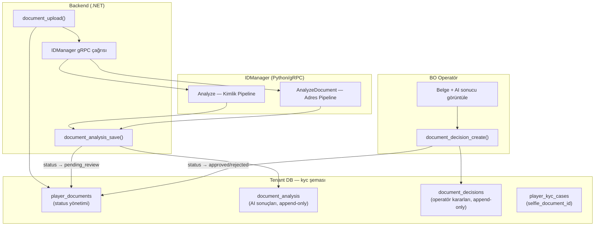
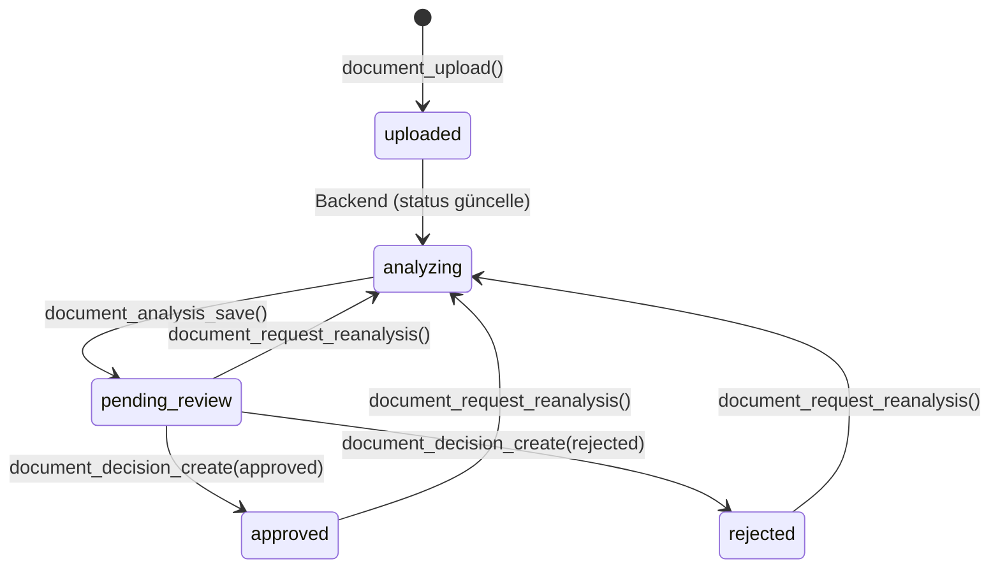

# SPEC_IDMANAGER_INTEGRATION: KYC Belge Doğrulama (IDManager AI)

IDManager (Python/gRPC) AI-destekli KYC belge doğrulama servisinin Nucleo.DB entegrasyonu. İki pipeline destekler: kimlik belgesi (yüz + canlılık) ve adres belgesi (metin analizi). Operatör son kararı verir; AI sonucu tavsiye niteliğindedir.

> İlgili spesifikasyonlar: [SPEC_PLAYER_AUTH_KYC.md](SPEC_PLAYER_AUTH_KYC.md)
> İlgili servis: `C:\Projects\Git\IDManager` (gRPC :5085, Python 3.11)
> Tasarım dokümanı: [IDMANAGER_INTEGRATION_DESIGN.md](../../.planning/IDMANAGER_INTEGRATION_DESIGN.md)

---

## 1. Kapsam ve Veritabanı Dağılımı

Bu spesifikasyon **7 yeni fonksiyon**, **2 yeni tablo** ve **4 güncellenen fonksiyonu** kapsar.

| Alan | Fonksiyon | Açıklama |
|------|-----------|----------|
| Belge Analizi | 4 | IDManager sonuç kaydetme, sorgulama, tekrar analiz |
| Operatör Kararı | 3 | Karar oluşturma ve geçmiş sorgulama |
| **Yeni Toplam** | **7** | |
| Güncellenen | 4 | document_upload, document_review (deprecated), document_get, kyc_case_get |

### DB Dağılımı

| DB | Şema | Modül | Fonksiyon | Tablo |
|----|------|-------|-----------|-------|
| Tenant | kyc | Document Analysis | 4 | 1 (document_analysis) |
| Tenant | kyc | Document Decisions | 3 | 1 (document_decisions) |

### DB Topolojisi

---

## 2. IDManager Pipeline'ları

### 2.1 Kimlik Pipeline (Analyze — ID_CARD)

Yüz tespiti + benzerlik + canlılık + belge format kontrolü + kalite analizi.

| Çıktı | Tip | Açıklama |
|-------|-----|----------|
| `face_detected_id` | bool | Belgede yüz bulundu mu |
| `face_detected_selfie` | bool | Selfie'de yüz bulundu mu |
| `document_check` | bool | Belge formatı geçerli mi |
| `face_similarity` | float | Yüz benzerliği (0-1) |
| `liveness_score` | float | Canlılık skoru (0-1) |
| `quality.*` | object | Blur, resolution, face size, angles |
| `risk_score` | int | 0-100 |
| `decision` | string | PASS / REVIEW / REJECT |

**Skorlama:** Similarity (max 50) + Liveness (max 40) + Quality bonus (10) = max 100

### 2.2 Adres Pipeline (AnalyzeDocument — UTILITY_BILL / BANK_STATEMENT / INVOICE)

PDF desteği + metin yoğunluğu + tablo yapısı + tarih tespiti. Yüz tespiti **yok**.

| Çıktı | Tip | Açıklama |
|-------|-----|----------|
| `address_doc_info.text_density` | float | Metin yoğunluğu (0-1) |
| `address_doc_info.table_detected` | bool | Tablo/grid yapısı |
| `address_doc_info.date_found` | bool | Tarih deseni |
| `address_doc_info.page_count` | int | Sayfa sayısı (PDF) |
| `address_doc_info.is_valid` | bool | Geçerli adres belgesi mi |
| `risk_score` | int | 0-110 |
| `decision` | string | PASS / REVIEW / REJECT |

**Skorlama:** Valid doc (50) + Text density (20) + Table (15) + Date (15) + Quality bonus (10) = max 110

### 2.3 IDManager DocumentType Enum

| Değer | Pipeline | Açıklama |
|-------|----------|----------|
| `ID_CARD` | Kimlik | Kimlik kartı, pasaport, ehliyet |
| `UTILITY_BILL` | Adres | Elektrik/su/gaz faturası |
| `BANK_STATEMENT` | Adres | Banka hesap özeti |
| `INVOICE` | Adres | Fatura |
| `OTHER_DOCUMENT` | Adres | Diğer adres belgesi |

### 2.4 Belge Tipi Eşleştirme

| player_documents.document_type | IDManager RPC | IDManager DocumentType |
|-------------------------------|---------------|----------------------|
| `identity` | `Analyze` | `ID_CARD` |
| `passport` | `Analyze` | `ID_CARD` |
| `driver_license` | `Analyze` | `ID_CARD` |
| `proof_of_address` | `AnalyzeDocument` | `UTILITY_BILL` / `BANK_STATEMENT` / `INVOICE` |
| `selfie` | — | — (Analyze'da input olarak kullanılır) |

---

## 3. Belge Durumu Akışı

| Durum | Açıklama |
|-------|----------|
| `uploaded` | Oyuncu belgeyi yükledi |
| `analyzing` | IDManager'a gönderildi, analiz bekleniyor |
| `pending_review` | AI analizi tamamlandı, operatör incelemesi bekliyor |
| `approved` | Operatör onayladı |
| `rejected` | Operatör reddetti |
| `expired` | Süresi doldu |

---

## 4. Veri Modeli

### 4.1 kyc.document_analysis (Yeni)

Append-only tablo. Her analiz çağrısı yeni satır oluşturur. Her iki pipeline'ın sonuçları tek tabloda; pipeline'a özgü alanlar nullable.

| Kolon | Tip | Zorunlu | Açıklama |
|-------|-----|---------|----------|
| id | BIGSERIAL | PK | — |
| player_id | BIGINT | Evet | Oyuncu ID |
| kyc_case_id | BIGINT | Evet | Bağlı KYC vakası |
| document_id | BIGINT | Evet | Analiz edilen belge |
| request_id | VARCHAR(100) | Evet | IDManager request_id (tracing) |
| job_id | UUID | Hayır | Async mod job UUID |
| analysis_type | VARCHAR(20) | Evet | analyze / analyze_selfie / analyze_document |
| idm_document_type | VARCHAR(20) | Evet | ID_CARD / UTILITY_BILL / BANK_STATEMENT / INVOICE / OTHER_DOCUMENT |
| face_detected_doc | BOOLEAN | Hayır | Kimlik: belgede yüz bulundu mu |
| face_detected_selfie | BOOLEAN | Hayır | Kimlik: selfie'de yüz bulundu mu |
| document_check | BOOLEAN | Hayır | Kimlik: belge format kontrolü |
| similarity_score | NUMERIC(5,4) | Hayır | Kimlik: yüz benzerliği (0-1) |
| liveness_score | NUMERIC(5,4) | Hayır | Kimlik: canlılık skoru (0-1) |
| address_doc_details | JSONB | Hayır | Adres: {text_density, table_detected, date_found, page_count, is_valid} |
| risk_score | SMALLINT | Hayır | Toplam risk skoru (kimlik: 0-100, adres: 0-110) |
| ai_decision | VARCHAR(10) | Evet | PASS / REVIEW / REJECT |
| rejection_reasons | TEXT[] | Hayır | Red sebepleri dizisi |
| quality_details | JSONB | Hayır | Kalite detayları |
| processing_time_ms | INTEGER | Hayır | İşlem süresi (ms) |
| analyzed_at | TIMESTAMP | Evet | Analiz zamanı |
| created_at | TIMESTAMP | Evet | Kayıt zamanı |

**Pipeline → Kolon Kullanım Matrisi:**

| Kolon | Kimlik | Adres |
|-------|:------:|:-----:|
| face_detected_doc | ✓ | NULL |
| face_detected_selfie | ✓ | NULL |
| document_check | ✓ | NULL |
| similarity_score | ✓ | NULL |
| liveness_score | ✓ | NULL |
| address_doc_details | NULL | ✓ |
| risk_score | ✓ (0-100) | ✓ (0-110) |
| ai_decision | ✓ | ✓ |

### 4.2 kyc.document_decisions (Yeni)

Append-only tablo. Her operatör kararı yeni satır. Son kayıt = geçerli karar.

| Kolon | Tip | Zorunlu | Açıklama |
|-------|-----|---------|----------|
| id | BIGSERIAL | PK | — |
| player_id | BIGINT | Evet | Oyuncu ID |
| kyc_case_id | BIGINT | Evet | Bağlı KYC vakası |
| document_id | BIGINT | Evet | Karar verilen belge |
| analysis_id | BIGINT | Hayır | Referans analiz (nullable) |
| decision | VARCHAR(10) | Evet | approved / rejected |
| reason | VARCHAR(500) | Hayır | Operatör notu |
| decided_by | BIGINT | Evet | Kararı veren BO kullanıcı |
| decided_at | TIMESTAMP | Evet | Karar zamanı |
| created_at | TIMESTAMP | Evet | Kayıt zamanı |

### 4.3 kyc.player_kyc_cases (Güncelleme)

| Eklenen Kolon | Tip | Açıklama |
|---------------|-----|----------|
| selfie_document_id | BIGINT | Case'e ait selfie → player_documents.id |

### 4.4 FK Constraints

| Constraint | Tablo | Referans | ON DELETE |
|-----------|-------|----------|----------|
| fk_kyc_cases_selfie | player_kyc_cases(selfie_document_id) | player_documents(id) | SET NULL |
| fk_document_analysis_player | document_analysis(player_id) | auth.players(id) | CASCADE |
| fk_document_analysis_case | document_analysis(kyc_case_id) | player_kyc_cases(id) | CASCADE |
| fk_document_analysis_document | document_analysis(document_id) | player_documents(id) | CASCADE |
| fk_document_decisions_player | document_decisions(player_id) | auth.players(id) | CASCADE |
| fk_document_decisions_case | document_decisions(kyc_case_id) | player_kyc_cases(id) | CASCADE |
| fk_document_decisions_document | document_decisions(document_id) | player_documents(id) | CASCADE |
| fk_document_decisions_analysis | document_decisions(analysis_id) | document_analysis(id) | SET NULL |

### 4.5 Indexes

**document_analysis:**
- `idx_doc_analysis_player` — (player_id)
- `idx_doc_analysis_case` — (kyc_case_id)
- `idx_doc_analysis_document` — (document_id)
- `idx_doc_analysis_request` — (request_id) — tracing
- `idx_doc_analysis_decision` — (ai_decision)
- `idx_doc_analysis_pending` — (kyc_case_id, ai_decision) WHERE ai_decision = 'REVIEW'
- `idx_doc_analysis_quality_gin` — GIN(quality_details) WHERE NOT NULL

**document_decisions:**
- `idx_doc_decisions_player` — (player_id)
- `idx_doc_decisions_case` — (kyc_case_id)
- `idx_doc_decisions_document` — (document_id)
- `idx_doc_decisions_decided_by` — (decided_by)
- `idx_doc_decisions_latest` — (document_id, decided_at DESC)

---

## 5. Fonksiyon Spesifikasyonları

### 5.1 Analiz Fonksiyonları (4)

#### `kyc.document_analysis_save`

| Parametre | Tip | Zorunlu | Varsayılan | Açıklama |
|-----------|-----|---------|------------|----------|
| p_player_id | BIGINT | Evet | — | Oyuncu ID |
| p_kyc_case_id | BIGINT | Evet | — | KYC case ID |
| p_document_id | BIGINT | Evet | — | Belge ID |
| p_request_id | VARCHAR(100) | Evet | — | IDManager request_id |
| p_analysis_type | VARCHAR(20) | Evet | — | analyze / analyze_selfie / analyze_document |
| p_idm_document_type | VARCHAR(20) | Evet | — | IDManager DocumentType |
| p_ai_decision | VARCHAR(10) | Evet | — | PASS / REVIEW / REJECT |
| p_risk_score | SMALLINT | Hayır | NULL | Risk skoru |
| p_rejection_reasons | TEXT[] | Hayır | NULL | Red sebepleri |
| p_quality_details | JSONB | Hayır | NULL | Kalite detayları |
| p_processing_time_ms | INTEGER | Hayır | NULL | İşlem süresi |
| p_job_id | UUID | Hayır | NULL | Async job ID |
| p_face_detected_doc | BOOLEAN | Hayır | NULL | Kimlik: belgede yüz |
| p_face_detected_selfie | BOOLEAN | Hayır | NULL | Kimlik: selfie'de yüz |
| p_document_check | BOOLEAN | Hayır | NULL | Kimlik: format kontrolü |
| p_similarity_score | NUMERIC(5,4) | Hayır | NULL | Kimlik: benzerlik |
| p_liveness_score | NUMERIC(5,4) | Hayır | NULL | Kimlik: canlılık |
| p_address_doc_details | JSONB | Hayır | NULL | Adres: detaylar |
| p_analyzed_at | TIMESTAMP | Hayır | NOW() | Analiz zamanı |

**Dönüş:** `BIGINT` — Yeni document_analysis.id

**İş Kuralları:**
1. `p_kyc_case_id` zorunlu (NULL → hata).
2. `p_request_id` zorunlu (NULL/boş → hata).
3. `p_ai_decision` zorunlu ve 'PASS', 'REVIEW', 'REJECT' dışında hata.
4. `p_analysis_type` yalnızca 'analyze', 'analyze_selfie', 'analyze_document' olabilir.
5. `p_idm_document_type` yalnızca 'ID_CARD', 'UTILITY_BILL', 'BANK_STATEMENT', 'INVOICE', 'OTHER_DOCUMENT' olabilir.
6. `player_documents.id` varlık ve player_id eşleşme kontrolü.
7. `player_kyc_cases.id` varlık ve player_id eşleşme kontrolü.
8. `document_analysis` tablosuna INSERT.
9. `player_documents.status` → `'pending_review'` olarak güncelle.
10. `player_kyc_workflows`'a `'ANALYSIS_COMPLETED'` kaydı.

**Hata Kodları:**

| Hata Key | ERRCODE | Koşul |
|----------|---------|-------|
| error.kyc-analysis.case-required | P0400 | kyc_case_id NULL |
| error.kyc-analysis.request-id-required | P0400 | request_id NULL/boş |
| error.kyc-analysis.decision-required | P0400 | ai_decision NULL/boş veya geçersiz |
| error.kyc-analysis.invalid-type | P0400 | Geçersiz analysis_type |
| error.kyc-analysis.invalid-document-type | P0400 | Geçersiz idm_document_type |
| error.kyc-analysis.document-not-found | P0404 | Belge bulunamadı veya player uyuşmazlığı |
| error.kyc-analysis.case-not-found | P0404 | Case bulunamadı veya player uyuşmazlığı |

---

#### `kyc.document_analysis_get`

| Parametre | Tip | Zorunlu | Varsayılan | Açıklama |
|-----------|-----|---------|------------|----------|
| p_document_id | BIGINT | Evet | — | Belge ID |

**Dönüş:** `JSONB` — Belgeye ait tüm analiz kayıtları (en yeniden eskiye). `[]` dizi döner.

**İş Kuralları:**
1. `p_document_id` zorunlu (NULL → hata).
2. Birden fazla kayıt olabilir (tekrar analiz).
3. Her kayıt `idmDocumentType` içerir; frontend pipeline panelini buna göre render eder.

**Hata Kodları:**

| Hata Key | ERRCODE | Koşul |
|----------|---------|-------|
| error.kyc-document.document-required | P0400 | document_id NULL |

---

#### `kyc.document_analysis_list_by_case`

| Parametre | Tip | Zorunlu | Varsayılan | Açıklama |
|-----------|-----|---------|------------|----------|
| p_kyc_case_id | BIGINT | Evet | — | KYC case ID |

**Dönüş:** `JSONB` — Case'teki tüm belgelerin tüm analizleri. `document_id` + `analyzed_at DESC` sıralaması.

**İş Kuralları:**
1. `p_kyc_case_id` zorunlu.
2. BO operatör ekranı bu fonksiyonu kullanır.

**Hata Kodları:**

| Hata Key | ERRCODE | Koşul |
|----------|---------|-------|
| error.kyc-case.case-required | P0400 | kyc_case_id NULL |

---

#### `kyc.document_request_reanalysis`

| Parametre | Tip | Zorunlu | Varsayılan | Açıklama |
|-----------|-----|---------|------------|----------|
| p_document_id | BIGINT | Evet | — | Belge ID |
| p_requested_by | BIGINT | Evet | — | Talep eden BO kullanıcı ID |

**Dönüş:** `VOID`

**İş Kuralları:**
1. Belge mevcut olmalı.
2. Case bağlantısı zorunlu (kyc_case_id NULL → hata).
3. Status yalnızca 'pending_review', 'approved', 'rejected' olabilir (diğer → hata).
4. `player_documents.status` → `'analyzing'`.
5. `player_kyc_workflows`'a `'REANALYSIS_REQUESTED'` kaydı.
6. Backend bu fonksiyon sonrası belge tipine göre uygun IDManager endpoint'ini çağırır.

**Hata Kodları:**

| Hata Key | ERRCODE | Koşul |
|----------|---------|-------|
| error.kyc-document.document-required | P0400 | document_id NULL |
| error.kyc-document.not-found | P0404 | Belge bulunamadı |
| error.kyc-reanalysis.case-required | P0400 | Case bağlantısı yok |
| error.kyc-reanalysis.not-eligible | P0400 | Uygun olmayan status |

---

### 5.2 Karar Fonksiyonları (3)

#### `kyc.document_decision_create`

| Parametre | Tip | Zorunlu | Varsayılan | Açıklama |
|-----------|-----|---------|------------|----------|
| p_document_id | BIGINT | Evet | — | Belge ID |
| p_analysis_id | BIGINT | Hayır | NULL | Referans analiz ID |
| p_decision | VARCHAR(10) | Evet | — | approved / rejected |
| p_reason | VARCHAR(500) | Hayır | NULL | Operatör notu |
| p_decided_by | BIGINT | Evet | — | Kararı veren BO kullanıcı |

**Dönüş:** `BIGINT` — Yeni document_decisions.id

**İş Kuralları:**
1. `p_document_id` zorunlu.
2. `p_decided_by` zorunlu.
3. `p_decision` yalnızca 'approved' veya 'rejected' olabilir.
4. `player_documents` varlık kontrolü.
5. `document_decisions` tablosuna INSERT (player_id, kyc_case_id belge kaydından alınır).
6. `player_documents.status` → karar değeri.
7. `player_documents.reviewed_at` güncelle.
8. Rejected ise `player_documents.rejection_reason` güncelle.
9. `player_kyc_workflows`'a `'DOCUMENT_APPROVED'` veya `'DOCUMENT_REJECTED'` kaydı.

**Hata Kodları:**

| Hata Key | ERRCODE | Koşul |
|----------|---------|-------|
| error.kyc-document.document-required | P0400 | document_id NULL |
| error.kyc-decision.decided-by-required | P0400 | decided_by NULL |
| error.kyc-decision.invalid-decision | P0400 | approved/rejected dışı |
| error.kyc-decision.document-not-found | P0404 | Belge bulunamadı |

---

#### `kyc.document_decision_list`

| Parametre | Tip | Zorunlu | Varsayılan | Açıklama |
|-----------|-----|---------|------------|----------|
| p_document_id | BIGINT | Evet | — | Belge ID |

**Dönüş:** `JSONB` — Belgeye ait tüm operatör kararları (en yeniden eskiye). `[]` dizi döner.

**Hata Kodları:**

| Hata Key | ERRCODE | Koşul |
|----------|---------|-------|
| error.kyc-document.document-required | P0400 | document_id NULL |

---

#### `kyc.document_decision_list_by_case`

| Parametre | Tip | Zorunlu | Varsayılan | Açıklama |
|-----------|-----|---------|------------|----------|
| p_kyc_case_id | BIGINT | Evet | — | KYC case ID |

**Dönüş:** `JSONB` — Case'teki tüm belgelerin karar geçmişi. `document_id` + `decided_at DESC` sıralaması.

**Hata Kodları:**

| Hata Key | ERRCODE | Koşul |
|----------|---------|-------|
| error.kyc-case.case-required | P0400 | kyc_case_id NULL |

---

## 6. Güncellenen Fonksiyonlar

### 6.1 `kyc.document_upload` — Güncellemeler

| Değişiklik | Açıklama |
|------------|----------|
| Status | `'pending'` → `'uploaded'` düzeltme |
| Selfie bağlama | `document_type = 'selfie'` ise `player_kyc_cases.selfie_document_id` güncelle |
| Workflow action | `'DOCUMENT_UPLOAD'` → `'DOCUMENT_UPLOADED'` (tutarlılık) |

### 6.2 `kyc.document_review` — DEPRECATED

`document_decision_create()` lehine kullanımdan kaldırıldı. Geriye uyumluluk: approved/rejected çağrıları `document_decision_create()`'e yönlendirilir.

### 6.3 `kyc.document_get` — Eklenen Response Alanları

| Alan | Tip | Açıklama |
|------|-----|----------|
| latestAnalysis | JSONB / null | Son analiz: id, idmDocumentType, aiDecision, riskScore, similarityScore, livenessScore, addressDocDetails, rejectionReasons, analyzedAt |
| latestDecision | JSONB / null | Son karar: id, decision, reason, decidedBy, decidedAt |
| analysisCount | INTEGER | Toplam analiz sayısı |
| decisionCount | INTEGER | Toplam karar sayısı |

### 6.4 `kyc.kyc_case_get` — Eklenen Response Alanları

| Alan | Tip | Açıklama |
|------|-----|----------|
| selfieDocumentId | BIGINT / null | Case'e ait selfie belge ID |
| documents[].latestAiDecision | VARCHAR | Her belge için son AI kararı |
| documents[].latestRiskScore | SMALLINT | Her belge için son risk skoru |
| documents[].latestIdmDocumentType | VARCHAR | Pipeline tipi |
| documents[].latestOperatorDecision | VARCHAR | Son operatör kararı |

---

## 7. Workflow Action Değerleri

| Action | Açıklama | Tetikleyen Fonksiyon |
|--------|----------|---------------------|
| `DOCUMENT_UPLOADED` | Belge yüklendi | `document_upload()` |
| `ANALYSIS_COMPLETED` | Analiz sonucu geldi | `document_analysis_save()` |
| `REANALYSIS_REQUESTED` | Tekrar analiz talebi | `document_request_reanalysis()` |
| `DOCUMENT_APPROVED` | Operatör onayladı | `document_decision_create()` |
| `DOCUMENT_REJECTED` | Operatör reddetti | `document_decision_create()` |

---

## 8. Hata Kodları Özeti

| Hata Kodu | ERRCODE | Kullanım |
|-----------|---------|----------|
| error.kyc-analysis.document-not-found | P0404 | Belge bulunamadı |
| error.kyc-analysis.case-not-found | P0404 | Case bulunamadı / player uyuşmazlığı |
| error.kyc-analysis.case-required | P0400 | kyc_case_id zorunlu |
| error.kyc-analysis.request-id-required | P0400 | request_id zorunlu |
| error.kyc-analysis.decision-required | P0400 | ai_decision zorunlu |
| error.kyc-analysis.invalid-type | P0400 | Geçersiz analysis_type |
| error.kyc-analysis.invalid-document-type | P0400 | Geçersiz idm_document_type |
| error.kyc-decision.document-not-found | P0404 | Belge bulunamadı |
| error.kyc-decision.invalid-decision | P0400 | Geçersiz karar |
| error.kyc-decision.decided-by-required | P0400 | decided_by zorunlu |
| error.kyc-reanalysis.not-eligible | P0400 | Uygun olmayan status |
| error.kyc-reanalysis.case-required | P0400 | Case bağlantısı zorunlu |
