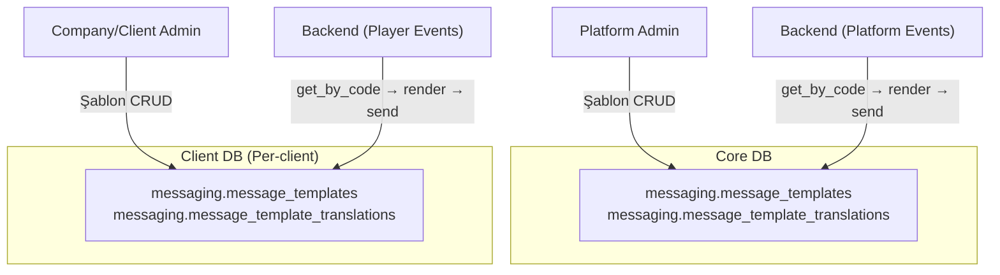
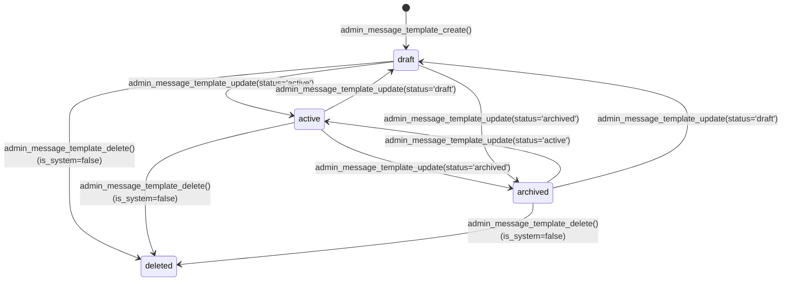
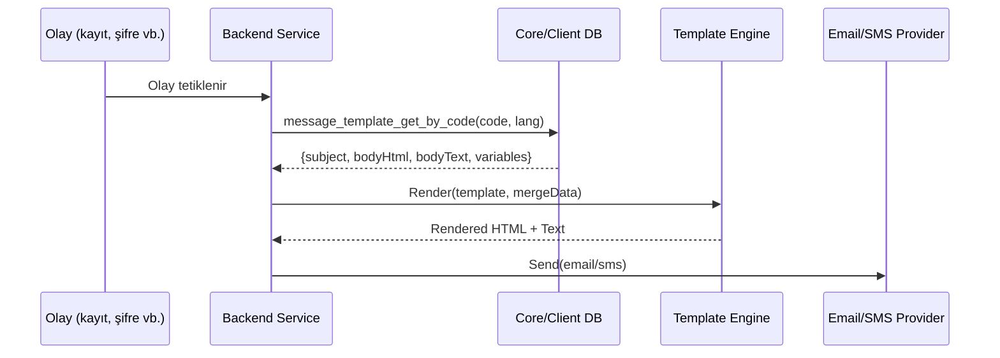

# SPEC_MESSAGE_TEMPLATE: Mesaj Şablon Yönetimi Fonksiyonel Spesifikasyonu

Platform (Core DB) ve client (Client DB) seviyesinde e-posta ve SMS şablon yönetimi: CRUD, çok dilli çeviri, kanal bazlı validasyon, merge tag sistemi, backend rendering desteği.

> İlgili spesifikasyonlar: [SPEC_CALL_CENTER.md](SPEC_CALL_CENTER.md) · [SPEC_SITE_MANAGEMENT.md](SPEC_SITE_MANAGEMENT.md) · [SPEC_PLAYER_AUTH_KYC.md](SPEC_PLAYER_AUTH_KYC.md)

---

## 1. Kapsam ve Veritabanı Dağılımı

Message Template domaininde **12 fonksiyon**, **4 tablo**, **2 veritabanı** yer alır. Platform şablonları Core DB'de, client şablonları Client DB'de birbirinden bağımsız yönetilir.

| Veritabanı | Şema | Fonksiyon | Tablo | Açıklama |
|------------|------|-----------|-------|----------|
| **Core DB** | messaging | 6 | 2 | Platform bildirim şablonları (BO kullanıcılarına yönelik) |
| **Client DB** | messaging | 6 | 2 | Client bildirim şablonları (oyunculara yönelik) |
| **Toplam** | | **12** | **4** | |



### İki Katmanlı Mimari

| Katman | Veritabanı | Hedef Kitle | Şablon Örnekleri |
|--------|-----------|-------------|------------------|
| **Platform** | Core DB | BO kullanıcıları | Hoş geldiniz, şifre sıfırlama, 2FA, rol değişikliği |
| **Client** | Client DB | Oyuncular | Kayıt, KYC, yatırım/çekim, bonus, hesap durumu |

- Platform ve client şablonları tamamen bağımsız — inheritance/override yok
- Client varsayılan şablonları backend tarafından client provisioning sırasında seed'lenir
- Her iki katmanda aynı fonksiyon seti (6'şar fonksiyon)

### Mevcut Kampanya Şablonları ile İlişki

Client DB'de `messaging.message_templates` tablosu hem kampanya hem bildirim şablonlarını barındırır. `category` kolonu ile ayrıştırılır:

| Kategori | Kullanım | Tetiklenme |
|----------|----------|------------|
| `campaign` | Kampanya e-postaları (mevcut) | BO admin → campaign publish → worker |
| `transactional` | Sistem bildirimleri (kayıt, şifre sıfırlama) | Event → backend → render → send |
| `notification` | Bilgilendirme (KYC, hesap durumu) | Event → backend → render → send |
| `marketing` | Pazarlama bildirimleri | Event → backend → render → send |

---

## 2. Şablon Durum Makinası



| Durum | Kod | Açıklama |
|-------|-----|----------|
| draft | `draft` | Yeni oluşturuldu, backend rendering'de kullanılmaz |
| active | `active` | Aktif — `message_template_get_by_code()` yalnızca bu durumu döndürür |
| archived | `archived` | Arşivlendi, rendering'de kullanılmaz |
| deleted | soft delete | Core: `is_active=FALSE`, Client: `is_deleted=TRUE` |

**Kısıtlama:** `is_system=TRUE` olan şablonlar silinemez (seed data koruması).

---

## 3. Kanal ve Çeviri Sistemi

### 3.1 Kanal Tipleri

| Kanal | Core DB | Client DB | Açıklama |
|-------|---------|-----------|----------|
| `email` | Evet | Evet | HTML + plain text e-posta |
| `sms` | Evet | Evet | Düz metin SMS |
| `local` | Hayır | Evet | Site içi bildirim (yalnızca kampanya) |

### 3.2 Kanal Bazlı Alan Kullanımı

| Alan | Email | SMS |
|------|-------|-----|
| `subject` | **Zorunlu** | NULL |
| `body_html` | **Zorunlu** | NULL |
| `body_text` | Opsiyonel (plain text fallback) | **Zorunlu** (ana içerik) |
| `preview_text` | Opsiyonel (inbox ön izleme) | NULL |

### 3.3 Çeviri Yönetimi

- Her şablon birden fazla dile çevrilebilir (`language_code CHAR(2)`)
- `(template_id, language_code)` UNIQUE — şablon başına dil tekrarı yok
- Çeviriler replace-all stratejisi ile güncellenir (update sırasında eski çeviriler silinir, yenileri eklenir)
- `message_template_get_by_code()` belirli bir dilde çeviriyi döndürür

### 3.4 Merge Tag (Template Variable) Sistemi

Her şablonun `variables` JSONB alanı merge tag tanımlarını içerir:

```json
[
  {"key": "player_name", "type": "string", "required": true, "description": "Oyuncunun görüntü adı"},
  {"key": "reset_link", "type": "string", "required": true, "description": "Şifre sıfırlama URL'i"},
  {"key": "expiry_hours", "type": "number", "required": false, "default": 24, "description": "Link geçerlilik süresi (saat)"}
]
```

- HTML/SMS gövdede `{{player_name}}`, `{{reset_link}}` şeklinde placeholder
- `variables` alanı **bilgilendirme amaçlı** — SQL seviyesinde render yapılmaz
- Render işlemi backend'de (C# template engine) yapılır
- Validasyon: backend rendering sırasında required field kontrolü

---

## 4. Veri Modeli

### 4.1 Core DB — messaging.message_templates

| Kolon | Tip | Zorunlu | Varsayılan | Açıklama |
|-------|-----|---------|------------|----------|
| id | SERIAL | Evet | PK | Şablon ID |
| code | VARCHAR(100) | Evet | — | Benzersiz şablon kodu (ör: 'user.welcome.email') |
| name | VARCHAR(200) | Evet | — | Görüntü adı (BO) |
| channel_type | VARCHAR(10) | Evet | — | 'email' veya 'sms' |
| category | VARCHAR(30) | Evet | — | 'transactional', 'notification', 'system' |
| description | TEXT | Hayır | NULL | Şablon açıklaması |
| variables | JSONB | Hayır | NULL | Merge tag tanımları |
| is_system | BOOLEAN | Evet | FALSE | Sistem şablonları silinemez |
| status | VARCHAR(20) | Evet | 'draft' | 'draft', 'active', 'archived' |
| created_at | TIMESTAMPTZ | Evet | now() | — |
| created_by | BIGINT | Hayır | — | Oluşturan kullanıcı |
| updated_at | TIMESTAMPTZ | Evet | now() | — |
| updated_by | BIGINT | Hayır | — | Güncelleyen kullanıcı |
| is_active | BOOLEAN | Evet | TRUE | Soft delete flag |

**Unique Index:** `(code) WHERE is_active = TRUE`
**Check:** `channel_type IN ('email', 'sms')`, `category IN ('transactional', 'notification', 'system')`, `status IN ('draft', 'active', 'archived')`

### 4.2 Core DB — messaging.message_template_translations

| Kolon | Tip | Zorunlu | Varsayılan | Açıklama |
|-------|-----|---------|------------|----------|
| id | SERIAL | Evet | PK | Çeviri ID |
| template_id | INTEGER | Evet | — | FK → message_templates(id) ON DELETE CASCADE |
| language_code | CHAR(2) | Evet | — | Dil kodu: en, tr, de |
| subject | VARCHAR(500) | Hayır | — | E-posta konusu (email: zorunlu, sms: NULL) |
| body_html | TEXT | Hayır | — | HTML gövde (email: zorunlu, sms: NULL) |
| body_text | TEXT | Evet | — | Düz metin (email: fallback, sms: ana içerik) |
| preview_text | VARCHAR(255) | Hayır | — | E-posta ön izleme (sms: NULL) |
| created_at | TIMESTAMPTZ | Evet | now() | — |
| created_by | BIGINT | Hayır | — | — |
| updated_at | TIMESTAMPTZ | Evet | now() | — |
| updated_by | BIGINT | Hayır | — | — |

**Unique:** `(template_id, language_code)`
**FK:** `template_id → message_templates(id) ON DELETE CASCADE`

### 4.3 Client DB — messaging.message_templates

| Kolon | Tip | Zorunlu | Varsayılan | Açıklama |
|-------|-----|---------|------------|----------|
| id | SERIAL | Evet | PK | Şablon ID |
| code | VARCHAR(100) | Evet | — | Benzersiz şablon kodu |
| name | VARCHAR(200) | Evet | — | Şablon adı (BO gösterimi) |
| channel_type | VARCHAR(10) | Evet | — | 'email', 'sms', 'local' |
| category | VARCHAR(30) | Evet | 'campaign' | 'campaign', 'transactional', 'notification', 'marketing' |
| description | TEXT | Hayır | NULL | Şablon açıklaması |
| variables | JSONB | Hayır | NULL | Merge tag tanımları |
| is_system | BOOLEAN | Evet | FALSE | Sistem şablonları silinemez |
| status | VARCHAR(20) | Evet | 'draft' | 'draft', 'active', 'archived' |
| created_at | TIMESTAMP | Evet | now() | — |
| created_by | INTEGER | Hayır | — | — |
| updated_at | TIMESTAMP | Hayır | — | — |
| updated_by | INTEGER | Hayır | — | — |
| is_deleted | BOOLEAN | Evet | FALSE | Soft delete flag |
| deleted_at | TIMESTAMP | Hayır | — | Silinme zamanı |
| deleted_by | INTEGER | Hayır | — | Silen kullanıcı |

**Unique Index:** `(code) WHERE is_deleted = FALSE`
**Check:** `channel_type IN ('email', 'sms', 'local')`, `category IN ('campaign', 'transactional', 'notification', 'marketing')`, `status IN ('draft', 'active', 'archived')`

### 4.4 Client DB — messaging.message_template_translations

| Kolon | Tip | Zorunlu | Varsayılan | Açıklama |
|-------|-----|---------|------------|----------|
| id | SERIAL | Evet | PK | Çeviri ID |
| template_id | INTEGER | Evet | — | FK → message_templates(id) ON DELETE CASCADE |
| language_code | CHAR(2) | Evet | — | Dil kodu: en, tr, de |
| subject | VARCHAR(500) | Hayır | — | E-posta konusu |
| body_html | TEXT | Hayır | — | HTML gövde |
| body_text | TEXT | Hayır | — | Düz metin |
| preview_text | VARCHAR(255) | Hayır | — | E-posta ön izleme |
| created_at | TIMESTAMP | Evet | now() | — |
| created_by | INTEGER | Hayır | — | — |
| updated_at | TIMESTAMP | Hayır | — | — |
| updated_by | INTEGER | Hayır | — | — |

**Unique:** `(template_id, language_code)`
**FK:** `template_id → message_templates(id) ON DELETE CASCADE`

### 4.5 Core vs Client Farklar

| Özellik | Core DB | Client DB |
|---------|---------|-----------|
| Soft delete flag | `is_active BOOLEAN` | `is_deleted BOOLEAN` + `deleted_at`, `deleted_by` |
| Caller ID tipi | `BIGINT` (p_caller_id) | `INTEGER` (p_user_id) |
| Timestamp tipi | `TIMESTAMPTZ` | `TIMESTAMP WITHOUT TIME ZONE` |
| Kanal tipleri | email, sms | email, sms, local |
| Kategoriler | transactional, notification, system | campaign, transactional, notification, marketing |
| Seed data | SQL dosyası ile (platform deploy) | Backend ile (client provisioning) |

---

## 5. Fonksiyon Spesifikasyonları

### 5.1 Platform Şablon Yönetimi — Core DB (6 fonksiyon)

#### `messaging.admin_message_template_create`

| Parametre | Tip | Zorunlu | Varsayılan | Açıklama |
|-----------|-----|---------|------------|----------|
| p_caller_id | BIGINT | Evet | — | İşlemi yapan kullanıcı ID |
| p_code | VARCHAR(100) | Evet | — | Benzersiz şablon kodu |
| p_name | VARCHAR(200) | Evet | — | Şablon adı |
| p_channel_type | VARCHAR(10) | Evet | — | 'email' veya 'sms' |
| p_category | VARCHAR(30) | Evet | — | 'transactional', 'notification', 'system' |
| p_description | TEXT | Hayır | NULL | Şablon açıklaması |
| p_variables | JSONB | Hayır | NULL | Merge tag tanımları |
| p_is_system | BOOLEAN | Hayır | FALSE | Sistem şablonu mu? |
| p_translations | JSONB | Hayır | NULL | Çeviri dizisi |

**Dönüş:** `INTEGER` — Yeni şablon ID

**p_translations JSONB Yapısı:**

```json
[
  {
    "language_code": "en",
    "subject": "Welcome!",
    "body_html": "<p>Welcome, {{user_name}}</p>",
    "body_text": "Welcome, {{user_name}}",
    "preview_text": "Your account is ready"
  }
]
```

**İş Kuralları:**
1. `p_code` ve `p_name` zorunlu (NULL/boş → hata).
2. `p_channel_type` yalnızca 'email' veya 'sms' olabilir.
3. `p_category` yalnızca 'transactional', 'notification', 'system' olabilir.
4. `code` benzersizlik kontrolü (`WHERE is_active = TRUE`).
5. Şablon `status = 'draft'` ile oluşturulur.
6. Çeviri kanal bazlı validasyon:
   - **Email:** `subject` ve `body_html` zorunlu.
   - **SMS:** `body_text` zorunlu.
7. Çeviriler `language_code CAST CHAR(2)` ile eklenir.

**Hata Kodları:**

| Hata Key | ERRCODE | Koşul |
|----------|---------|-------|
| error.notification-template.code-required | P0400 | code NULL/boş |
| error.notification-template.name-required | P0400 | name NULL/boş |
| error.notification-template.invalid-channel-type | P0400 | Geçersiz kanal tipi |
| error.notification-template.invalid-category | P0400 | Geçersiz kategori |
| error.notification-template.code-exists | P0409 | Aynı kod mevcut |
| error.notification-template.email-subject-required | P0400 | Email çevirisinde subject eksik |
| error.notification-template.email-body-html-required | P0400 | Email çevirisinde body_html eksik |
| error.notification-template.sms-body-text-required | P0400 | SMS çevirisinde body_text eksik |

---

#### `messaging.admin_message_template_update`

| Parametre | Tip | Zorunlu | Varsayılan | Açıklama |
|-----------|-----|---------|------------|----------|
| p_caller_id | BIGINT | Evet | — | İşlemi yapan kullanıcı ID |
| p_id | INTEGER | Evet | — | Şablon ID |
| p_name | VARCHAR(200) | Hayır | NULL | Yeni ad |
| p_category | VARCHAR(30) | Hayır | NULL | Yeni kategori |
| p_description | TEXT | Hayır | NULL | Yeni açıklama |
| p_variables | JSONB | Hayır | NULL | Yeni merge tag tanımları |
| p_status | VARCHAR(20) | Hayır | NULL | Yeni durum: draft, active, archived |
| p_translations | JSONB | Hayır | NULL | Çeviri dizisi (NULL = güncelleme yok) |

**Dönüş:** `BOOLEAN`

**İş Kuralları:**
1. Şablon mevcut olmalı (`WHERE is_active = TRUE`). Bulunamazsa hata.
2. COALESCE pattern: NULL olan parametreler mevcut değeri korur.
3. `channel_type` **değiştirilemez** (immutable).
4. `p_status` verilirse 'draft', 'active', 'archived' dışında hata.
5. `p_category` verilirse 'transactional', 'notification', 'system' dışında hata.
6. `p_translations` verilirse: replace-all stratejisi (eski çeviriler silinir, yenileri eklenir).
7. Çeviri kanal bazlı validasyon: create ile aynı kurallar.

**Hata Kodları:**

| Hata Key | ERRCODE | Koşul |
|----------|---------|-------|
| error.notification-template.not-found | P0404 | Şablon bulunamadı |
| error.notification-template.invalid-status | P0400 | Geçersiz durum |
| error.notification-template.invalid-category | P0400 | Geçersiz kategori |
| error.notification-template.email-subject-required | P0400 | Email subject eksik |
| error.notification-template.email-body-html-required | P0400 | Email body_html eksik |
| error.notification-template.sms-body-text-required | P0400 | SMS body_text eksik |

---

#### `messaging.admin_message_template_get`

| Parametre | Tip | Zorunlu | Varsayılan | Açıklama |
|-----------|-----|---------|------------|----------|
| p_caller_id | BIGINT | Evet | — | İşlemi yapan kullanıcı ID |
| p_id | INTEGER | Evet | — | Şablon ID |

**Dönüş:** `JSONB`

**Dönüş Yapısı:**

| Alan | Tip | Açıklama |
|------|-----|----------|
| id | INTEGER | Şablon ID |
| code | VARCHAR | Şablon kodu |
| name | VARCHAR | Şablon adı |
| channelType | VARCHAR | Kanal tipi |
| category | VARCHAR | Kategori |
| description | TEXT | Açıklama |
| variables | JSONB | Merge tag tanımları |
| isSystem | BOOLEAN | Sistem şablonu mu |
| status | VARCHAR | Durum |
| createdAt | TIMESTAMPTZ | Oluşturma zamanı |
| createdBy | BIGINT | Oluşturan |
| updatedAt | TIMESTAMPTZ | Güncelleme zamanı |
| updatedBy | BIGINT | Güncelleyen |
| translations | JSONB[] | Çeviri dizisi |

**translations dizisi elemanı:**

| Alan | Tip | Açıklama |
|------|-----|----------|
| id | INTEGER | Çeviri ID |
| languageCode | CHAR(2) | Dil kodu |
| subject | VARCHAR | E-posta konusu |
| bodyHtml | TEXT | HTML gövde |
| bodyText | TEXT | Düz metin |
| previewText | VARCHAR | Ön izleme |

**İş Kuralları:**
1. Şablon `WHERE is_active = TRUE` filtresi ile aranır.
2. Çeviriler `jsonb_agg` ile toplanır, `language_code` sıralı.
3. Çeviri yoksa `translations = []` döner.

**Hata Kodları:**

| Hata Key | ERRCODE | Koşul |
|----------|---------|-------|
| error.notification-template.not-found | P0404 | Şablon bulunamadı |

---

#### `messaging.admin_message_template_list`

| Parametre | Tip | Zorunlu | Varsayılan | Açıklama |
|-----------|-----|---------|------------|----------|
| p_caller_id | BIGINT | Evet | — | İşlemi yapan kullanıcı ID |
| p_channel_type | VARCHAR(10) | Hayır | NULL | Kanal filtresi |
| p_category | VARCHAR(30) | Hayır | NULL | Kategori filtresi |
| p_status | VARCHAR(20) | Hayır | NULL | Durum filtresi |
| p_search | VARCHAR(200) | Hayır | NULL | Ad/kod arama (ILIKE) |
| p_offset | INTEGER | Hayır | 0 | Sayfalama başlangıç |
| p_limit | INTEGER | Hayır | 20 | Sayfa boyutu |

**Dönüş:** `JSONB`

**Dönüş Yapısı:**

```json
{
  "items": [
    {
      "id": 1,
      "code": "user.welcome.email",
      "name": "User Welcome Email",
      "channelType": "email",
      "category": "transactional",
      "isSystem": true,
      "status": "active",
      "createdAt": "2026-02-24T..."
    }
  ],
  "totalCount": 8
}
```

**İş Kuralları:**
1. Filtre: `is_active = TRUE`.
2. Opsiyonel filtreler: `channel_type`, `category`, `status`.
3. Arama: `name ILIKE '%search%' OR code ILIKE '%search%'`.
4. Sıralama: `created_at DESC`.
5. Boş sonuç → `{ "items": [], "totalCount": 0 }`.

---

#### `messaging.admin_message_template_delete`

| Parametre | Tip | Zorunlu | Varsayılan | Açıklama |
|-----------|-----|---------|------------|----------|
| p_caller_id | BIGINT | Evet | — | İşlemi yapan kullanıcı ID |
| p_id | INTEGER | Evet | — | Şablon ID |

**Dönüş:** `VOID`

**İş Kuralları:**
1. Şablon mevcut olmalı (`WHERE is_active = TRUE`).
2. `is_system = TRUE` olan şablonlar **silinemez**.
3. Soft delete: `is_active = FALSE` + `updated_at`, `updated_by` güncellenir.

**Hata Kodları:**

| Hata Key | ERRCODE | Koşul |
|----------|---------|-------|
| error.notification-template.not-found | P0404 | Şablon bulunamadı |
| error.notification-template.system-template-cannot-be-deleted | P0403 | Sistem şablonu silinemez |

---

#### `messaging.message_template_get_by_code`

| Parametre | Tip | Zorunlu | Varsayılan | Açıklama |
|-----------|-----|---------|------------|----------|
| p_code | VARCHAR(100) | Evet | — | Şablon kodu |
| p_language_code | CHAR(2) | Evet | — | İstenen dil kodu |

**Dönüş:** `JSONB`

**Dönüş Yapısı:**

| Alan | Tip | Açıklama |
|------|-----|----------|
| code | VARCHAR | Şablon kodu |
| channelType | VARCHAR | Kanal tipi |
| variables | JSONB | Merge tag tanımları |
| subject | VARCHAR | E-posta konusu (email) |
| bodyHtml | TEXT | HTML gövde (email) |
| bodyText | TEXT | Düz metin (email fallback / SMS ana içerik) |
| previewText | VARCHAR | Ön izleme (email) |

**İş Kuralları:**
1. **Auth kontrolü yok** — backend internal kullanım.
2. Yalnızca `status = 'active' AND is_active = TRUE` olan şablonları döndürür.
3. Belirtilen dilde çeviri aranır.
4. Şablon veya çeviri bulunamazsa hata.

**Hata Kodları:**

| Hata Key | ERRCODE | Koşul |
|----------|---------|-------|
| error.notification-template.not-found | P0404 | Şablon bulunamadı veya aktif değil |
| error.notification-template.translation-not-found | P0404 | Belirtilen dilde çeviri yok |

---

### 5.2 Client Şablon Yönetimi — Client DB (6 fonksiyon)

Client fonksiyonları Core ile aynı imza ve iş kurallarını kullanır, aşağıdaki farklar hariç:

| Fark | Core DB | Client DB |
|------|---------|-----------|
| Parametre adı | `p_caller_id BIGINT` | `p_user_id INTEGER` |
| Aktiflik filtresi | `WHERE is_active = TRUE` | `WHERE is_deleted = FALSE` |
| Soft delete | `is_active = FALSE` | `is_deleted = TRUE`, `deleted_at = now()`, `deleted_by = p_user_id` |
| Kanal tipleri | 'email', 'sms' | 'email', 'sms' |
| Kategoriler | transactional, notification, system | transactional, notification, marketing |

#### `messaging.admin_message_template_create` (Client)

Aynı parametre seti, `p_user_id INTEGER` ile. Kategori validasyonu: `transactional`, `notification`, `marketing`.

#### `messaging.admin_message_template_update` (Client)

Aynı parametre seti. `p_user_id INTEGER`, `is_deleted = FALSE` filtresi.

#### `messaging.admin_message_template_get` (Client)

Aynı dönüş yapısı. `is_deleted = FALSE` filtresi.

#### `messaging.admin_message_template_list` (Client)

Aynı dönüş yapısı. `is_deleted = FALSE` filtresi.

#### `messaging.admin_message_template_delete` (Client)

Soft delete: `is_deleted = TRUE`, `deleted_at = now()`, `deleted_by = p_user_id`.

#### `messaging.message_template_get_by_code` (Client)

Aynı dönüş yapısı. `status = 'active' AND is_deleted = FALSE` filtresi.

---

## 6. İzinler

### 6.1 Permission Tanımları

| Permission | Scope | Açıklama |
|-----------|-------|----------|
| `platform.notification-template.manage` | platform | Platform şablon CRUD (create, update, delete) |
| `platform.notification-template.view` | platform | Platform şablon görüntüleme (get, list) |
| `client.notification-template.manage` | client | Client şablon CRUD |
| `client.notification-template.view` | client | Client şablon görüntüleme |

### 6.2 Rol Eşlemeleri

| Rol | Platform View | Platform Manage | Client View | Client Manage |
|-----|:---:|:---:|:---:|:---:|
| platform_admin | ✅ | ✅ | — | — |
| company_admin | — | — | ✅ | ✅ |
| client_admin | — | — | ✅ | ✅ |
| client_operator | — | — | ✅ | ✅ |

> **Not:** `message_template_get_by_code` auth kontrolü yapmaz — backend internal kullanım, permission gerektirmez.

---

## 7. Varsayılan Şablonlar (Seed Data)

### 7.1 Platform Şablonları (Core DB)

Dosya: `core/data/notification_templates_seed.sql`

**Email şablonları (6 adet):**

| Kod | Kategori | Açıklama | Merge Tag'ler |
|-----|----------|----------|---------------|
| `user.welcome.email` | transactional | BO kullanıcı hoş geldiniz | `user_name`, `login_url` |
| `user.password_reset.email` | transactional | Şifre sıfırlama bağlantısı | `user_name`, `reset_link`, `expiry_hours` |
| `user.email_verification.email` | transactional | E-posta doğrulama | `user_name`, `verification_link`, `expiry_hours` |
| `user.account_locked.email` | notification | Hesap kilitlendi | `user_name`, `reason`, `unlock_instructions` |
| `user.two_factor_enabled.email` | notification | 2FA etkinleştirildi | `user_name` |
| `user.role_changed.email` | notification | Rol değişikliği | `user_name`, `old_role`, `new_role` |

**SMS şablonları (2 adet):**

| Kod | Kategori | Açıklama | Merge Tag'ler |
|-----|----------|----------|---------------|
| `user.password_reset.sms` | transactional | Şifre sıfırlama kodu | `user_name`, `reset_code` |
| `user.two_factor_code.sms` | transactional | 2FA doğrulama kodu | `verification_code` |

- Tüm şablonlar `is_system = TRUE`, `status = 'active'`
- EN ve TR çevirileri dahil (toplam 16 çeviri)

### 7.2 Client Şablonları (Backend Seed — Client Provisioning)

Client varsayılan şablonları SQL dosyası ile değil, backend tarafından client oluşturulurken seed'lenir.

**Önerilen email şablonları (14 adet):**

| Kod | Kategori | Açıklama | Merge Tag'ler |
|-----|----------|----------|---------------|
| `player.welcome.email` | transactional | Oyuncu kayıt hoş geldiniz | `player_name`, `brand_name`, `login_url` |
| `player.password_reset.email` | transactional | Şifre sıfırlama | `player_name`, `reset_link`, `expiry_hours`, `brand_name` |
| `player.email_verification.email` | transactional | E-posta doğrulama | `player_name`, `verification_link`, `expiry_hours`, `brand_name` |
| `player.kyc_approved.email` | notification | KYC onaylandı | `player_name`, `brand_name` |
| `player.kyc_rejected.email` | notification | KYC reddedildi | `player_name`, `rejection_reason`, `brand_name` |
| `player.kyc_document_requested.email` | notification | KYC belge talebi | `player_name`, `document_type`, `brand_name` |
| `player.deposit_confirmed.email` | transactional | Yatırım onaylandı | `player_name`, `amount`, `currency`, `transaction_id`, `brand_name` |
| `player.withdrawal_approved.email` | transactional | Çekim onaylandı | `player_name`, `amount`, `currency`, `transaction_id`, `brand_name` |
| `player.withdrawal_rejected.email` | notification | Çekim reddedildi | `player_name`, `amount`, `currency`, `rejection_reason`, `brand_name` |
| `player.bonus_awarded.email` | notification | Bonus verildi | `player_name`, `bonus_name`, `bonus_amount`, `currency`, `brand_name` |
| `player.bonus_expired.email` | notification | Bonus süresi doldu | `player_name`, `bonus_name`, `brand_name` |
| `player.account_locked.email` | notification | Hesap kilitlendi | `player_name`, `reason`, `support_email`, `brand_name` |
| `player.account_suspended.email` | notification | Hesap askıya alındı | `player_name`, `reason`, `support_email`, `brand_name` |
| `player.self_exclusion_confirmed.email` | notification | Kendi kendini dışlama | `player_name`, `exclusion_period`, `brand_name` |

**Önerilen SMS şablonları (4 adet):**

| Kod | Kategori | Açıklama | Merge Tag'ler |
|-----|----------|----------|---------------|
| `player.password_reset.sms` | transactional | Şifre sıfırlama kodu | `player_name`, `reset_code`, `brand_name` |
| `player.email_verification.sms` | transactional | Doğrulama kodu | `player_name`, `verification_code`, `brand_name` |
| `player.deposit_confirmed.sms` | transactional | Yatırım bildirimi | `player_name`, `amount`, `currency`, `brand_name` |
| `player.withdrawal_approved.sms` | transactional | Çekim bildirimi | `player_name`, `amount`, `currency`, `brand_name` |

---

## 8. Hata Kodları Özet Tablosu

Tüm fonksiyonlarda kullanılan hata key'leri:

| Hata Key | ERRCODE | Fırlatan Fonksiyonlar |
|----------|---------|----------------------|
| error.notification-template.code-required | P0400 | create |
| error.notification-template.name-required | P0400 | create |
| error.notification-template.invalid-channel-type | P0400 | create |
| error.notification-template.invalid-category | P0400 | create, update |
| error.notification-template.code-exists | P0409 | create |
| error.notification-template.not-found | P0404 | update, get, delete, get_by_code |
| error.notification-template.invalid-status | P0400 | update |
| error.notification-template.email-subject-required | P0400 | create, update |
| error.notification-template.email-body-html-required | P0400 | create, update |
| error.notification-template.sms-body-text-required | P0400 | create, update |
| error.notification-template.system-template-cannot-be-deleted | P0403 | delete |
| error.notification-template.translation-not-found | P0404 | get_by_code |

---

## 9. Backend Entegrasyon Notları

### 9.1 Rendering Akışı



### 9.2 Cross-DB Kullanım

| Senaryo | Kaynak DB | Hedef | Açıklama |
|---------|-----------|-------|----------|
| BO kullanıcı bildirimi | Core DB | BO kullanıcısı | `message_template_get_by_code('user.welcome.email', 'en')` |
| Oyuncu bildirimi | Client DB | Oyuncu | `message_template_get_by_code('player.deposit_confirmed.email', 'tr')` |

Her iki DB bağımsız — backend ayrı connection kullanır, cross-DB sorgu yok.

### 9.3 Şablon Kodu Konvansiyonu

```
{hedef}.{olay}.{kanal}
```

| Segment | Değerler | Örnek |
|---------|----------|-------|
| hedef | `user` (platform), `player` (client) | `user`, `player` |
| olay | İş olayı adı | `welcome`, `password_reset`, `kyc_approved` |
| kanal | `email`, `sms` | `email`, `sms` |

**Örnekler:** `user.welcome.email`, `player.kyc_rejected.email`, `player.password_reset.sms`

---

## 10. Dosya Haritası

### 10.1 Core DB — Tablolar

```
core/tables/messaging/message_templates.sql
core/tables/messaging/message_template_translations.sql
```

### 10.2 Core DB — Fonksiyonlar

```
core/functions/messaging/message_template/admin_message_template_create.sql
core/functions/messaging/message_template/admin_message_template_update.sql
core/functions/messaging/message_template/admin_message_template_get.sql
core/functions/messaging/message_template/admin_message_template_list.sql
core/functions/messaging/message_template/admin_message_template_delete.sql
core/functions/messaging/message_template/message_template_get_by_code.sql
```

### 10.3 Core DB — Constraint ve Index

```
core/constraints/messaging_notification_template.sql
core/indexes/messaging_notification_template.sql
```

### 10.4 Core DB — Seed Data

```
core/data/notification_templates_seed.sql
```

### 10.5 Client DB — Tablolar

```
client/tables/messaging/message_templates.sql
client/tables/messaging/message_template_translations.sql
```

### 10.6 Client DB — Fonksiyonlar

```
client/functions/backoffice/messaging/message_template/admin_message_template_create.sql
client/functions/backoffice/messaging/message_template/admin_message_template_update.sql
client/functions/backoffice/messaging/message_template/admin_message_template_get.sql
client/functions/backoffice/messaging/message_template/admin_message_template_list.sql
client/functions/backoffice/messaging/message_template/admin_message_template_delete.sql
client/functions/backoffice/messaging/message_template/message_template_get_by_code.sql
```

### 10.7 Client DB — Constraint ve Index

```
client/constraints/messaging.sql          (message_template bölümü)
client/indexes/messaging.sql              (message_template bölümü)
```

---

_Bu spesifikasyon Message Template domainindeki 12 fonksiyon, 4 tablo ve 2 veritabanını kapsar. Son güncelleme: 2026-02-24._
