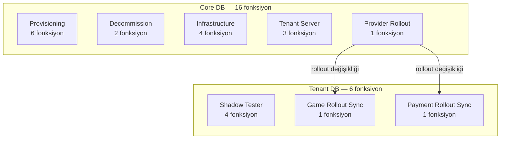
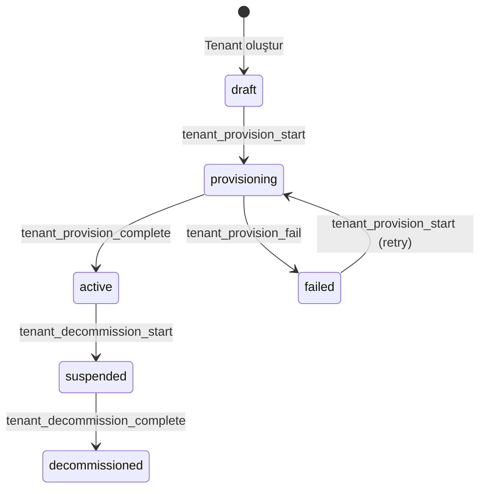

# SPEC_PLATFORM_OPERATIONS: Platform Operasyonları

Tenant provisioning yaşam döngüsü (oluşturma → canlıya alma → kapatma), altyapı sunucu yönetimi ve shadow mode (staged rollout) mekanizması.

> İlgili spesifikasyonlar: [SPEC_GAME_GATEWAY.md](SPEC_GAME_GATEWAY.md) · [SPEC_FINANCE_GATEWAY.md](SPEC_FINANCE_GATEWAY.md)

---

## 1. Kapsam ve Veritabanı Dağılımı

Bu spesifikasyon iki operasyonel alanı kapsar:

| Alan | Açıklama | Fonksiyon |
|------|----------|-----------|
| **Provisioning** | Tenant yaşam döngüsü, altyapı yönetimi, sunucu ataması | 15 |
| **Shadow Mode** | Staged rollout, shadow tester yönetimi, provider rollout senkronizasyonu | 7 |
| **Toplam** | | **22** |

> Shadow mode ayrıca `game_settings_list`, `game_settings_sync`, `payment_method_settings_list`, `payment_method_settings_sync` fonksiyonlarına rollout parametreleri ekler. Bu fonksiyonların tam spesifikasyonları [SPEC_GAME_GATEWAY.md](SPEC_GAME_GATEWAY.md) ve [SPEC_FINANCE_GATEWAY.md](SPEC_FINANCE_GATEWAY.md) içindedir.

### DB Dağılımı

| DB | Şema | Modül | Fonksiyon |
|----|------|-------|-----------|
| Core | core | Provisioning Orchestration | 6 |
| Core | core | Decommission | 2 |
| Core | core | Infrastructure Server | 4 |
| Core | core | Tenant Server | 3 |
| Core | core | Provider Rollout | 1 |
| Tenant | auth | Shadow Tester | 4 |
| Tenant | game | Game Rollout Sync | 1 |
| Tenant | finance | Payment Rollout Sync | 1 |

### DB Topolojisi



### Cross-DB İlişki

- **Provisioning**: Tümü Core DB. ProductionManager gRPC servisi tarafından çağrılır
- **Shadow Mode**: `tenant_provider_set_rollout` (Core) → backend → `game_provider_rollout_sync` + `payment_provider_rollout_sync` (Tenant)
- **Denormalizasyon**: rollout_status Core'da (`tenant_providers`) ve Tenant'ta (`game_settings`, `payment_method_settings`) tutulur; sync fonksiyonları tutarlılığı sağlar

---

## 2. Durum Makinaları ve İş Akışları

### 2.1 Tenant Provisioning Yaşam Döngüsü



| Durum | Açıklama |
|-------|----------|
| `draft` | Tenant kaydı yapıldı, ayarlar giriliyor |
| `provisioning` | ProductionManager adımları çalıştırıyor |
| `active` | Tüm health check'ler geçti, tenant canlı |
| `failed` | Bir adımda hata oluştu (retry edilebilir) |
| `suspended` | Decommission başlatıldı, servisler durduruluyor |
| `decommissioned` | Kalıcı kapatma tamamlandı |

**Not:** `user_authenticate` fonksiyonunda `provisioning_status != 'decommissioned'` filtresi var. Draft, pending, provisioning durumundaki tenant'lara erişim açıktır.

### 2.2 Provisioning Adımları (11 Adım)

| # | Adım | Açıklama | Max Retry |
|---|------|----------|-----------|
| 1 | `VALIDATE` | Konfigürasyon kontrol, sunucu erişim testi | 3 |
| 2 | `DB_PROVISION` | PostgreSQL container/user oluştur | 3 |
| 3 | `DB_CREATE` | 5 veritabanı oluştur | 3 |
| 4 | `DB_MIGRATE` | Template dump'tan `pg_restore` | 3 |
| 5 | `DB_SEED` | transaction_types, operation_types, ilk partition'lar | 3 |
| 6 | `WRITE_CONFIG` | DB connection string, secrets, routing | 3 |
| 7 | `BACKEND_DEPLOY` | Backend container deploy | 3 |
| 8 | `CALLBACK_DEPLOY` | Callback service container deploy | 3 |
| 9 | `FRONTEND_DEPLOY` | Nginx + Vue container deploy | 3 |
| 10 | `HEALTH_CHECK` | `pg_isready` + HTTP `/health` kontrolü | 3 |
| 11 | `ACTIVATE` | `provisioning_status = 'active'`, outbox event | 1 |

**Adım durumları:** `pending` → `running` → `completed` / `failed` / `skipped` / `rolled_back`

### 2.3 Decommission Adımları (4 Adım)

| # | Adım | Açıklama |
|---|------|----------|
| 1 | `STOP_SERVICES` | Tüm container'ları durdur |
| 2 | `DROP_DATABASES` | DB backup al, DB'leri sil |
| 3 | `CLEANUP_CONFIG` | Konfigürasyon dosyalarını temizle |
| 4 | `FINALIZE` | Son temizlik, kaynakları serbest bırak |

### 2.4 Rollout Durumları

| Durum | Açıklama |
|-------|----------|
| `production` | Herkese açık (varsayılan) |
| `shadow` | Sadece shadow tester'lar görür |

**Görünürlük matrisi:**

| Kullanıcı Tipi | `production` | `shadow` |
|----------------|:------------:|:--------:|
| Anonymous | Görür | Göremez |
| Normal oyuncu | Görür | Göremez |
| Shadow tester | Görür | Görür |

### 2.5 Sunucu Durumları

**Infrastructure Server:**

| Durum | Açıklama |
|-------|----------|
| `active` | Kullanıma açık |
| `maintenance` | Bakımda |
| `full` | Kapasite dolu |
| `decommissioned` | Kullanım dışı |

**Tenant Server (Container):**

| Durum | Açıklama |
|-------|----------|
| `pending` | Atama yapıldı, container oluşturulmadı |
| `creating` | Container oluşturuluyor |
| `running` | Container çalışıyor |
| `stopped` | Container durduruldu |
| `error` | Container hatası |
| `removed` | Container silindi |

---

## 3. Veri Modeli

### 3.1 core.tenants (Provisioning Kolonları)

| Kolon | Tip | Açıklama |
|-------|-----|----------|
| domain | VARCHAR(255) | Ana domain: eurobet.com |
| subdomain | VARCHAR(255) | Alt domain: app.eurobet.com |
| provisioning_status | VARCHAR(20) DEFAULT 'draft' | Yaşam döngüsü durumu |
| provisioning_step | VARCHAR(50) | Son tamamlanan adım |
| provisioned_at | TIMESTAMPTZ | İlk başarılı aktivasyon zamanı |
| decommissioned_at | TIMESTAMPTZ | Kapatma tamamlanma zamanı |
| hosting_mode | VARCHAR(20) DEFAULT 'shared' | dedicated / shared |
| status | SMALLINT DEFAULT 1 | 0=Devre Dışı, 1=Aktif, 2=Beklemede |

### 3.2 core.infrastructure_servers

| Kolon | Tip | Constraint | Açıklama |
|-------|-----|------------|----------|
| id | BIGSERIAL | PK | |
| server_code | VARCHAR(50) | NOT NULL UNIQUE | aws-eu-fra-01 |
| server_name | VARCHAR(255) | | Görüntüleme adı |
| host | VARCHAR(255) | NOT NULL | IP/hostname |
| docker_host | VARCHAR(255) | | Docker API endpoint |
| docker_tls_verify | BOOLEAN | DEFAULT true | TLS doğrulama |
| region | VARCHAR(50) | | eu-central-1 |
| cloud_provider | VARCHAR(50) | | aws, hetzner, bare-metal |
| availability_zone | VARCHAR(50) | | AZ |
| server_type | VARCHAR(30) | DEFAULT 'shared' | dedicated / shared |
| server_purpose | VARCHAR(30) | DEFAULT 'all' | all / db_only / app_only |
| specs | JSONB | DEFAULT '{}' | `{"cpu": 8, "ram_gb": 32, "disk_gb": 500}` |
| max_tenants | INTEGER | DEFAULT 10 | Kapasite limiti |
| current_tenants | INTEGER | DEFAULT 0 | Mevcut tenant sayısı |
| status | VARCHAR(20) | DEFAULT 'active' | active, maintenance, full, decommissioned |
| health_status | VARCHAR(20) | DEFAULT 'unknown' | healthy, degraded, unhealthy, unknown |
| last_health_at | TIMESTAMPTZ | | Son health check zamanı |
| health_metadata | JSONB | DEFAULT '{}' | `{"cpu_usage": 45, "ram_usage_pct": 72}` |
| created_at | TIMESTAMPTZ | NOT NULL DEFAULT NOW() | |
| updated_at | TIMESTAMPTZ | NOT NULL DEFAULT NOW() | |
| created_by | BIGINT | | Oluşturan kullanıcı |

### 3.3 core.tenant_servers

| Kolon | Tip | Constraint | Açıklama |
|-------|-----|------------|----------|
| id | BIGSERIAL | PK | |
| tenant_id | BIGINT | NOT NULL FK | core.tenants |
| server_id | BIGINT | NOT NULL FK | core.infrastructure_servers |
| server_role | VARCHAR(30) | NOT NULL | db_primary, db_replica, db_failover, backend, callback, frontend |
| container_id | VARCHAR(100) | | Docker container ID |
| container_name | VARCHAR(150) | | nucleo_tenant_42_db_primary |
| container_image | VARCHAR(255) | | postgres:16, nucleo/backend:latest |
| container_port | INTEGER | | Expose edilen port |
| status | VARCHAR(20) | DEFAULT 'pending' | pending, creating, running, stopped, error, removed |
| health_status | VARCHAR(20) | DEFAULT 'unknown' | healthy, unhealthy, unknown |
| health_endpoint | VARCHAR(255) | | http://host:8080/health |
| last_health_at | TIMESTAMPTZ | | Son health check zamanı |
| environment_vars | JSONB | DEFAULT '{}' | Container env vars |
| metadata | JSONB | DEFAULT '{}' | Ek metadata |
| created_at | TIMESTAMPTZ | NOT NULL DEFAULT NOW() | |
| updated_at | TIMESTAMPTZ | NOT NULL DEFAULT NOW() | |

**UNIQUE:** (tenant_id, server_id, server_role) — UPSERT pattern ile sağlanır

### 3.4 core.tenant_provisioning_log

| Kolon | Tip | Constraint | Açıklama |
|-------|-----|------------|----------|
| id | BIGSERIAL | PK | |
| tenant_id | BIGINT | NOT NULL FK | core.tenants |
| provision_run_id | UUID | NOT NULL | Oturum takip ID |
| step_name | VARCHAR(50) | NOT NULL | VALIDATE, DB_CREATE, ... |
| step_order | SMALLINT | NOT NULL | Sıra numarası |
| status | VARCHAR(20) | DEFAULT 'pending' | pending, running, completed, failed, skipped, rolled_back |
| started_at | TIMESTAMPTZ | | Adım başlangıcı |
| completed_at | TIMESTAMPTZ | | Adım bitişi |
| duration_ms | INTEGER | | Süre (ms) |
| error_message | TEXT | | Hata mesajı |
| error_detail | TEXT | | Stack trace |
| retry_count | SMALLINT | DEFAULT 0 | Deneme sayısı |
| max_retries | SMALLINT | DEFAULT 3 | Maksimum deneme |
| output | JSONB | DEFAULT '{}' | Adıma özel çıktı |
| created_at | TIMESTAMPTZ | NOT NULL DEFAULT NOW() | |

### 3.5 core.template_dumps

| Kolon | Tip | Constraint | Açıklama |
|-------|-----|------------|----------|
| id | BIGSERIAL | PK | |
| db_type | VARCHAR(30) | NOT NULL | tenant, tenant_audit, tenant_log, tenant_report, tenant_affiliate |
| version | VARCHAR(50) | NOT NULL | 2026.02.12-001 |
| dump_path | VARCHAR(500) | NOT NULL | s3://nucleo-dumps/tenant/... |
| dump_size_bytes | BIGINT | | Dosya boyutu |
| dump_format | VARCHAR(20) | DEFAULT 'custom' | custom (pg_dump -Fc), directory, plain |
| schema_hash | VARCHAR(64) | | Deploy script SHA256 |
| migration_version | VARCHAR(50) | | Migration seviyesi |
| status | VARCHAR(20) | DEFAULT 'active' | active, deprecated, failed |
| tested_at | TIMESTAMPTZ | | Test tamamlanma zamanı |
| notes | TEXT | | Versiyon notları |
| created_at | TIMESTAMPTZ | NOT NULL DEFAULT NOW() | |
| created_by | BIGINT | | Oluşturan |

### 3.6 auth.shadow_testers (Tenant DB)

| Kolon | Tip | Constraint | Açıklama |
|-------|-----|------------|----------|
| id | BIGSERIAL | PK | |
| player_id | BIGINT | NOT NULL UNIQUE | Oyuncu ID |
| note | VARCHAR(255) | | Neden shadow tester yapıldı |
| added_by | VARCHAR(100) | | Ekleyen kullanıcı |
| created_at | TIMESTAMPTZ | NOT NULL DEFAULT NOW() | |

**Not:** Tipik boyut 5-10 kayıt per tenant. `UNIQUE(player_id)` otomatik B-tree index oluşturur.

### 3.7 Rollout Status Kolonları (Mevcut Tablolarda)

| Tablo | DB | Kolon |
|-------|-----|-------|
| `core.tenant_providers` | Core | `rollout_status VARCHAR(20) DEFAULT 'production'` |
| `game.game_settings` | Tenant | `rollout_status VARCHAR(20) DEFAULT 'production'` |
| `finance.payment_method_settings` | Tenant | `rollout_status VARCHAR(20) DEFAULT 'production'` |

CHECK: `rollout_status IN ('shadow', 'production')`

---

## 4. Fonksiyon Spesifikasyonları

### 4.1 Provisioning Orchestration (6 fonksiyon)

#### `core.tenant_provision_start`

| Parametre | Tip | Zorunlu | Varsayılan | Açıklama |
|-----------|-----|---------|------------|----------|
| p_tenant_id | BIGINT | Evet | - | Tenant ID |

**Dönüş:** `UUID` — provisioning run_id

**İş Kuralları:**
1. Tenant mevcudiyet kontrolü
2. Durum kontrolü: sadece `draft` veya `failed` durumunda başlatılabilir
3. Ön koşul kontrolü: domain, base_currency tanımlanmış olmalı
4. Sunucu ataması kontrolü: en az `db_primary`, `backend`, `frontend` rolleri atanmış olmalı
5. `tenants.provisioning_status = 'provisioning'`, `provisioning_step = 'VALIDATE'` güncellenir
6. 11 adımın tamamı `tenant_provisioning_log`'a `status = 'pending'` olarak eklenir
7. Yeni `run_id` (UUID) üretilir ve dönülür

**Hata Kodları:**

| Hata Key | ERRCODE | Koşul |
|----------|---------|-------|
| error.tenant.not-found | P0404 | Tenant bulunamadı |
| error.provision.invalid-status | P0400 | Durum draft veya failed değil |
| error.provision.domain-required | P0400 | Domain tanımlanmamış |
| error.provision.base-currency-required | P0400 | Baz para birimi tanımlanmamış |
| error.provision.missing-server-assignments | P0400 | Zorunlu sunucu rolleri atanmamış |

**Güvenlik:** System caller (ProductionManager)

---

#### `core.tenant_provision_step_update`

| Parametre | Tip | Zorunlu | Varsayılan | Açıklama |
|-----------|-----|---------|------------|----------|
| p_tenant_id | BIGINT | Evet | - | Tenant ID |
| p_run_id | UUID | Evet | - | Provisioning run ID |
| p_step_name | VARCHAR(50) | Evet | - | Adım adı (VALIDATE, DB_CREATE, ...) |
| p_status | VARCHAR(20) | Evet | - | Yeni durum |
| p_error_message | TEXT | Hayır | NULL | Hata mesajı |
| p_error_detail | TEXT | Hayır | NULL | Hata detayı / stack trace |
| p_output | JSONB | Hayır | NULL | Adıma özel çıktı |

**Dönüş:** `VOID`

**İş Kuralları:**
1. `p_status` değerleri: `running`, `completed`, `failed`, `skipped`, `rolled_back`
2. `running` → `started_at = NOW()`, output birleştirilir
3. `completed` → `completed_at = NOW()`, `duration_ms` hesaplanır, output birleştirilir
4. `failed` → `completed_at = NOW()`, `duration_ms` hesaplanır, hata bilgileri kaydedilir, `retry_count` artırılır
5. `skipped` / `rolled_back` → `completed_at = NOW()`, output birleştirilir
6. `tenants.provisioning_step` güncellenir

**Hata Kodları:**

| Hata Key | ERRCODE | Koşul |
|----------|---------|-------|
| error.tenant.id-required | P0400 | tenant_id NULL |
| error.provision.run-id-required | P0400 | run_id NULL |
| error.provision.invalid-step-status | P0400 | Geçersiz status değeri |
| error.provision.step-not-found | P0404 | Adım kaydı bulunamadı |

**Güvenlik:** System caller (ProductionManager)

---

#### `core.tenant_provision_complete`

| Parametre | Tip | Zorunlu | Varsayılan | Açıklama |
|-----------|-----|---------|------------|----------|
| p_tenant_id | BIGINT | Evet | - | Tenant ID |
| p_run_id | UUID | Evet | - | Provisioning run ID |

**Dönüş:** `VOID`

**İş Kuralları:**
1. Tenant `provisioning` durumunda olmalı
2. Tüm adımlar `completed` veya `skipped` olmalı
3. `tenants` güncellenir: `provisioning_status = 'active'`, `provisioning_step = 'ACTIVATE'`, `provisioned_at = NOW()`
4. Outbox event yayınlanır: `tenant_provisioned`

**Outbox Event:**
```json
{
  "event": "tenant_provisioned",
  "tenantId": 42,
  "tenantCode": "eurobet",
  "runId": "uuid",
  "provisionedAt": "2026-02-23T..."
}
```

**Hata Kodları:**

| Hata Key | ERRCODE | Koşul |
|----------|---------|-------|
| error.tenant.id-required | P0400 | tenant_id NULL |
| error.provision.run-id-required | P0400 | run_id NULL |
| error.provision.not-in-provisioning | P0400 | Durum provisioning değil |
| error.provision.steps-not-complete | P0400 | Tamamlanmamış adım var |

**Güvenlik:** System caller (ProductionManager)

---

#### `core.tenant_provision_fail`

| Parametre | Tip | Zorunlu | Varsayılan | Açıklama |
|-----------|-----|---------|------------|----------|
| p_tenant_id | BIGINT | Evet | - | Tenant ID |
| p_run_id | UUID | Evet | - | Provisioning run ID |
| p_error_message | TEXT | Hayır | NULL | Hata mesajı |
| p_error_detail | TEXT | Hayır | NULL | Hata detayı |

**Dönüş:** `VOID`

**İş Kuralları:**
1. Tenant `provisioning` durumunda olmalı
2. `tenants.provisioning_status = 'failed'` güncellenir
3. Outbox event yayınlanır: `tenant_provision_failed`
4. BO'da "Retry" seçeneği sunulur (tekrar `tenant_provision_start` çağrılabilir)

**Outbox Event:**
```json
{
  "event": "tenant_provision_failed",
  "tenantId": 42,
  "tenantCode": "eurobet",
  "runId": "uuid",
  "failedStep": "DB_MIGRATE",
  "errorMessage": "...",
  "errorDetail": "...",
  "failedAt": "2026-02-23T..."
}
```

**Hata Kodları:**

| Hata Key | ERRCODE | Koşul |
|----------|---------|-------|
| error.tenant.id-required | P0400 | tenant_id NULL |
| error.provision.run-id-required | P0400 | run_id NULL |
| error.provision.not-in-provisioning | P0400 | Durum provisioning değil |

**Güvenlik:** System caller (ProductionManager)

---

#### `core.tenant_provision_status`

| Parametre | Tip | Zorunlu | Varsayılan | Açıklama |
|-----------|-----|---------|------------|----------|
| p_caller_id | BIGINT | Evet | - | Çağıran kullanıcı ID (IDOR) |
| p_tenant_id | BIGINT | Evet | - | Tenant ID |

**Dönüş:** `JSONB`

**Dönüş Yapısı:**

| Alan | Tip | Açıklama |
|------|-----|----------|
| tenantId | BIGINT | Tenant ID |
| tenantCode | VARCHAR | Tenant kodu |
| provisioningStatus | VARCHAR | Yaşam döngüsü durumu |
| provisioningStep | VARCHAR | Mevcut/son adım |
| provisionedAt | TIMESTAMPTZ | Aktivasyon zamanı |
| domain | VARCHAR | Domain |
| hostingMode | VARCHAR | dedicated / shared |
| currentRunId | UUID | Aktif run ID |
| steps | ARRAY | Adım detayları (aşağıda) |
| servers | ARRAY | Sunucu atamaları (aşağıda) |

**steps[] yapısı:**

| Alan | Tip | Açıklama |
|------|-----|----------|
| stepName | VARCHAR | Adım adı |
| stepOrder | SMALLINT | Sıra |
| status | VARCHAR | Durum |
| startedAt | TIMESTAMPTZ | Başlangıç |
| completedAt | TIMESTAMPTZ | Bitiş |
| durationMs | INTEGER | Süre (ms) |
| errorMessage | TEXT | Hata mesajı |
| retryCount | SMALLINT | Deneme sayısı |
| maxRetries | SMALLINT | Maks deneme |
| output | JSONB | Adım çıktısı |

**servers[] yapısı:**

| Alan | Tip | Açıklama |
|------|-----|----------|
| role | VARCHAR | db_primary, backend, vb. |
| host | VARCHAR | Sunucu adresi |
| region | VARCHAR | Bölge |
| containerId | VARCHAR | Container ID |
| containerName | VARCHAR | Container adı |
| status | VARCHAR | Container durumu |
| healthStatus | VARCHAR | Sağlık durumu |
| lastHealthAt | TIMESTAMPTZ | Son kontrol zamanı |

**İş Kuralları:**
1. IDOR koruması: çağıran kullanıcının tenant'ın company'sine erişimi olmalı
2. En son run_id'nin adımları döndürülür
3. Sunucu atamaları ve sağlık bilgileri dahil edilir

**Hata Kodları:**

| Hata Key | ERRCODE | Koşul |
|----------|---------|-------|
| error.tenant.not-found | P0404 | Tenant bulunamadı |

**Güvenlik:** IDOR korumalı (`user_assert_access_company`)

---

#### `core.tenant_provision_history_list`

| Parametre | Tip | Zorunlu | Varsayılan | Açıklama |
|-----------|-----|---------|------------|----------|
| p_caller_id | BIGINT | Evet | - | Çağıran kullanıcı ID (IDOR) |
| p_tenant_id | BIGINT | Evet | - | Tenant ID |

**Dönüş:** `TABLE`

| Kolon | Tip | Açıklama |
|-------|-----|----------|
| run_id | UUID | Oturum ID |
| run_type | VARCHAR | 'provisioning' veya 'decommission' |
| started_at | TIMESTAMPTZ | Başlangıç zamanı |
| completed_at | TIMESTAMPTZ | Bitiş zamanı |
| total_steps | INTEGER | Toplam adım sayısı |
| completed_steps | INTEGER | Tamamlanan adım sayısı |
| failed_steps | INTEGER | Başarısız adım sayısı |
| total_duration_ms | BIGINT | Toplam süre |
| last_step | VARCHAR | Son adım adı |
| last_status | VARCHAR | Son adım durumu |

**İş Kuralları:**
1. IDOR koruması
2. `provision_run_id`'ye göre gruplama
3. İlk adım VALIDATE ise run_type='provisioning', STOP_SERVICES ise run_type='decommission'
4. Her run için istatistikler hesaplanır
5. `started_at DESC` sıralama

**Hata Kodları:**

| Hata Key | ERRCODE | Koşul |
|----------|---------|-------|
| error.tenant.id-required | P0400 | tenant_id NULL |
| error.tenant.not-found | P0404 | Tenant bulunamadı |

**Güvenlik:** IDOR korumalı (`user_assert_access_company`)

---

### 4.2 Decommission (2 fonksiyon)

#### `core.tenant_decommission_start`

| Parametre | Tip | Zorunlu | Varsayılan | Açıklama |
|-----------|-----|---------|------------|----------|
| p_caller_id | BIGINT | Evet | - | Çağıran kullanıcı ID |
| p_tenant_id | BIGINT | Evet | - | Tenant ID |
| p_reason | TEXT | Hayır | NULL | Kapatma nedeni |

**Dönüş:** `UUID` — decommission run_id

**İş Kuralları:**
1. IDOR koruması
2. Tenant `active` veya `suspended` durumunda olmalı
3. `tenants.status = 0` (disabled), `provisioning_status = 'suspended'`, `provisioning_step = 'STOP_SERVICES'`
4. 4 decommission adımı oluşturulur: STOP_SERVICES, DROP_DATABASES, CLEANUP_CONFIG, FINALIZE
5. Outbox event yayınlanır: `tenant_decommission_started`

**Outbox Event:**
```json
{
  "event": "tenant_decommission_started",
  "tenantId": 42,
  "tenantCode": "eurobet",
  "runId": "uuid",
  "reason": "Sözleşme sona erdi",
  "startedAt": "2026-02-23T..."
}
```

**Hata Kodları:**

| Hata Key | ERRCODE | Koşul |
|----------|---------|-------|
| error.tenant.id-required | P0400 | tenant_id NULL |
| error.tenant.not-found | P0404 | Tenant bulunamadı |
| error.decommission.invalid-status | P0400 | Durum active veya suspended değil |

**Güvenlik:** IDOR korumalı (`user_assert_access_company`)

---

#### `core.tenant_decommission_complete`

| Parametre | Tip | Zorunlu | Varsayılan | Açıklama |
|-----------|-----|---------|------------|----------|
| p_tenant_id | BIGINT | Evet | - | Tenant ID |
| p_run_id | UUID | Evet | - | Decommission run ID |

**Dönüş:** `VOID`

**İş Kuralları:**
1. Tenant `suspended` durumunda olmalı
2. Tüm decommission adımları `completed` veya `skipped` olmalı
3. `tenants.provisioning_status = 'decommissioned'`, `provisioning_step = 'FINALIZE'`, `decommissioned_at = NOW()`
4. Tenant'a ait tüm `tenant_servers` kayıtları `status = 'removed'`, `health_status = 'unknown'` yapılır
5. İlgili infrastructure sunucuların `current_tenants` değeri 1 azaltılır (minimum 0)
6. Outbox event yayınlanır: `tenant_decommissioned`

**Hata Kodları:**

| Hata Key | ERRCODE | Koşul |
|----------|---------|-------|
| error.tenant.id-required | P0400 | tenant_id NULL |
| error.provision.run-id-required | P0400 | run_id NULL |
| error.decommission.not-in-progress | P0400 | Durum suspended değil |
| error.decommission.steps-not-complete | P0400 | Tamamlanmamış adım var |

**Güvenlik:** System caller (ProductionManager)

---

### 4.3 Infrastructure Server (4 fonksiyon)

#### `core.infrastructure_server_create`

| Parametre | Tip | Zorunlu | Varsayılan | Açıklama |
|-----------|-----|---------|------------|----------|
| p_caller_id | BIGINT | Evet | - | Çağıran kullanıcı ID |
| p_server_code | VARCHAR(50) | Evet | - | Benzersiz kod (aws-eu-fra-01) |
| p_server_name | VARCHAR(255) | Hayır | NULL | Görüntüleme adı |
| p_host | VARCHAR(255) | Evet | - | IP/hostname |
| p_docker_host | VARCHAR(255) | Hayır | NULL | Docker API endpoint |
| p_docker_tls_verify | BOOLEAN | Hayır | true | TLS doğrulama |
| p_region | VARCHAR(50) | Hayır | NULL | Cloud bölge |
| p_cloud_provider | VARCHAR(50) | Hayır | NULL | aws, hetzner, bare-metal |
| p_availability_zone | VARCHAR(50) | Hayır | NULL | AZ |
| p_server_type | VARCHAR(30) | Hayır | 'shared' | dedicated / shared |
| p_server_purpose | VARCHAR(30) | Hayır | 'all' | all / db_only / app_only |
| p_specs | JSONB | Hayır | '{}' | `{"cpu": 8, "ram_gb": 32}` |
| p_max_tenants | INTEGER | Hayır | 10 | Kapasite limiti |

**Dönüş:** `BIGINT` — yeni sunucu ID

**İş Kuralları:**
1. SUPER_ADMIN yetkisi gerekli (`role_level >= 100`)
2. `server_code` ve `host` zorunlu
3. `server_code` benzersiz olmalı (case-insensitive)
4. `server_type` değerleri: `dedicated`, `shared`
5. `server_purpose` değerleri: `all`, `db_only`, `app_only`
6. Yeni kayıt: `status = 'active'`, `health_status = 'unknown'`, `current_tenants = 0`

**Hata Kodları:**

| Hata Key | ERRCODE | Koşul |
|----------|---------|-------|
| error.auth.super-admin-required | P0403 | SUPER_ADMIN değil |
| error.server.code-required | P0400 | server_code NULL/boş |
| error.server.host-required | P0400 | host NULL/boş |
| error.server.code-exists | P0409 | server_code zaten var |
| error.server.invalid-type | P0400 | Geçersiz server_type |
| error.server.invalid-purpose | P0400 | Geçersiz server_purpose |

**Güvenlik:** SUPER_ADMIN only

---

#### `core.infrastructure_server_update`

| Parametre | Tip | Zorunlu | Varsayılan | Açıklama |
|-----------|-----|---------|------------|----------|
| p_caller_id | BIGINT | Evet | - | Çağıran kullanıcı ID |
| p_id | BIGINT | Evet | - | Sunucu ID |
| p_server_name | VARCHAR(255) | Hayır | NULL | Görüntüleme adı |
| p_host | VARCHAR(255) | Hayır | NULL | IP/hostname |
| p_docker_host | VARCHAR(255) | Hayır | NULL | Docker API endpoint |
| p_docker_tls_verify | BOOLEAN | Hayır | NULL | TLS doğrulama |
| p_region | VARCHAR(50) | Hayır | NULL | Bölge |
| p_cloud_provider | VARCHAR(50) | Hayır | NULL | Provider |
| p_availability_zone | VARCHAR(50) | Hayır | NULL | AZ |
| p_server_type | VARCHAR(30) | Hayır | NULL | dedicated / shared |
| p_server_purpose | VARCHAR(30) | Hayır | NULL | all / db_only / app_only |
| p_specs | JSONB | Hayır | NULL | Donanım bilgileri |
| p_max_tenants | INTEGER | Hayır | NULL | Kapasite limiti |
| p_current_tenants | INTEGER | Hayır | NULL | Mevcut tenant sayısı |
| p_status | VARCHAR(20) | Hayır | NULL | Durum |
| p_health_status | VARCHAR(20) | Hayır | NULL | Sağlık durumu |
| p_health_metadata | JSONB | Hayır | NULL | Sağlık metadata |

**Dönüş:** `VOID`

**İş Kuralları:**
1. SUPER_ADMIN yetkisi gerekli
2. COALESCE pattern: NULL geçilen parametreler mevcut değeri korur
3. `p_health_status` güncellendiğinde `last_health_at = NOW()` de güncellenir
4. `p_status` değerleri: `active`, `maintenance`, `full`, `decommissioned`
5. `p_health_status` değerleri: `healthy`, `degraded`, `unhealthy`, `unknown`

**Hata Kodları:**

| Hata Key | ERRCODE | Koşul |
|----------|---------|-------|
| error.auth.super-admin-required | P0403 | SUPER_ADMIN değil |
| error.server.id-required | P0400 | id NULL |
| error.server.invalid-type | P0400 | Geçersiz server_type |
| error.server.invalid-status | P0400 | Geçersiz status |
| error.server.not-found | P0404 | Sunucu bulunamadı |

**Güvenlik:** SUPER_ADMIN only

---

#### `core.infrastructure_server_get`

| Parametre | Tip | Zorunlu | Varsayılan | Açıklama |
|-----------|-----|---------|------------|----------|
| p_caller_id | BIGINT | Evet | - | Çağıran kullanıcı ID |
| p_id | BIGINT | Evet | - | Sunucu ID |

**Dönüş:** `JSONB`

**Dönüş Yapısı:**

| Alan | Tip | Açıklama |
|------|-----|----------|
| id | BIGINT | Sunucu ID |
| serverCode | VARCHAR | Benzersiz kod |
| serverName | VARCHAR | Görüntüleme adı |
| host | VARCHAR | IP/hostname |
| dockerHost | VARCHAR | Docker API |
| dockerTlsVerify | BOOLEAN | TLS |
| region | VARCHAR | Bölge |
| cloudProvider | VARCHAR | Provider |
| availabilityZone | VARCHAR | AZ |
| serverType | VARCHAR | dedicated / shared |
| serverPurpose | VARCHAR | all / db_only / app_only |
| specs | JSONB | Donanım |
| maxTenants | INTEGER | Kapasite |
| currentTenants | INTEGER | Mevcut |
| availableSlots | INTEGER | **Hesaplanan:** max - current (min 0) |
| status | VARCHAR | Durum |
| healthStatus | VARCHAR | Sağlık |
| lastHealthAt | TIMESTAMPTZ | Son kontrol |
| healthMetadata | JSONB | Sağlık metadata |
| createdAt | TIMESTAMPTZ | Oluşturulma |
| updatedAt | TIMESTAMPTZ | Güncellenme |

**İş Kuralları:**
1. SUPER_ADMIN yetkisi gerekli
2. `availableSlots = max_tenants - current_tenants` (minimum 0) hesaplanan alan

**Hata Kodları:**

| Hata Key | ERRCODE | Koşul |
|----------|---------|-------|
| error.auth.super-admin-required | P0403 | SUPER_ADMIN değil |
| error.server.id-required | P0400 | id NULL |
| error.server.not-found | P0404 | Sunucu bulunamadı |

**Güvenlik:** SUPER_ADMIN only

---

#### `core.infrastructure_server_list`

| Parametre | Tip | Zorunlu | Varsayılan | Açıklama |
|-----------|-----|---------|------------|----------|
| p_caller_id | BIGINT | Evet | - | Çağıran kullanıcı ID |
| p_region | VARCHAR(50) | Hayır | NULL | Bölge filtre |
| p_server_type | VARCHAR(30) | Hayır | NULL | Tip filtre |
| p_status | VARCHAR(20) | Hayır | NULL | Durum filtre |
| p_has_capacity | BOOLEAN | Hayır | NULL | Boş kapasite filtre |

**Dönüş:** `JSONB` — array

**Dönüş Yapısı (her eleman):**

| Alan | Tip | Açıklama |
|------|-----|----------|
| id | BIGINT | Sunucu ID |
| serverCode | VARCHAR | Kod |
| serverName | VARCHAR | Ad |
| host | VARCHAR | IP |
| region | VARCHAR | Bölge |
| cloudProvider | VARCHAR | Provider |
| serverType | VARCHAR | Tip |
| serverPurpose | VARCHAR | Amaç |
| specs | JSONB | Donanım |
| maxTenants | INTEGER | Kapasite |
| currentTenants | INTEGER | Mevcut |
| availableSlots | INTEGER | Boş slot |
| status | VARCHAR | Durum |
| healthStatus | VARCHAR | Sağlık |
| lastHealthAt | TIMESTAMPTZ | Son kontrol |

**İş Kuralları:**
1. SUPER_ADMIN yetkisi gerekli
2. Tüm filtreler opsiyonel (AND koşulları)
3. `p_has_capacity = true` → sadece `current_tenants < max_tenants` olanlar
4. Sıralama: region, server_code
5. Eşleşme yoksa boş array `[]`

**Hata Kodları:**

| Hata Key | ERRCODE | Koşul |
|----------|---------|-------|
| error.auth.super-admin-required | P0403 | SUPER_ADMIN değil |

**Güvenlik:** SUPER_ADMIN only

---

### 4.4 Tenant Server (3 fonksiyon)

#### `core.tenant_server_assign`

| Parametre | Tip | Zorunlu | Varsayılan | Açıklama |
|-----------|-----|---------|------------|----------|
| p_caller_id | BIGINT | Evet | - | Çağıran kullanıcı ID |
| p_tenant_id | BIGINT | Evet | - | Tenant ID |
| p_server_id | BIGINT | Evet | - | Infrastructure sunucu ID |
| p_server_role | VARCHAR(30) | Evet | - | Rol |
| p_container_image | VARCHAR(255) | Hayır | NULL | Container image |
| p_container_port | INTEGER | Hayır | NULL | Port |
| p_health_endpoint | VARCHAR(255) | Hayır | NULL | Health check endpoint |

**Dönüş:** `BIGINT` — tenant_servers.id (yeni veya mevcut)

**İş Kuralları:**
1. IDOR koruması: çağıranın tenant'ın company'sine erişimi olmalı
2. Sunucu mevcudiyet ve `status = 'active'` kontrolü
3. Shared sunucularda kapasite kontrolü: `current_tenants < max_tenants`
4. UPSERT pattern (tenant_id, server_id, server_role):
   - Yeni kayıt → `status = 'pending'`, INSERT
   - Mevcut kayıt → container_image/port/health_endpoint COALESCE ile güncelleme
5. Sadece YENİ atamalarda `infrastructure_servers.current_tenants` 1 artırılır
6. `server_role` değerleri: `db_primary`, `db_replica`, `db_failover`, `backend`, `callback`, `frontend`

**Hata Kodları:**

| Hata Key | ERRCODE | Koşul |
|----------|---------|-------|
| error.tenant.not-found | P0404 | Tenant bulunamadı |
| error.server.id-required | P0400 | server_id NULL |
| error.server.invalid-role | P0400 | Geçersiz server_role |
| error.server.not-found | P0404 | Sunucu bulunamadı |
| error.server.not-active | P0400 | Sunucu active değil |
| error.server.capacity-full | P0400 | Kapasite dolu |

**Güvenlik:** IDOR korumalı (`user_assert_access_company`)

---

#### `core.tenant_server_update`

| Parametre | Tip | Zorunlu | Varsayılan | Açıklama |
|-----------|-----|---------|------------|----------|
| p_tenant_id | BIGINT | Evet | - | Tenant ID |
| p_server_role | VARCHAR(30) | Evet | - | Sunucu rolü |
| p_container_id | VARCHAR(100) | Hayır | NULL | Docker container ID |
| p_container_name | VARCHAR(150) | Hayır | NULL | Container adı |
| p_container_image | VARCHAR(255) | Hayır | NULL | Container image |
| p_status | VARCHAR(20) | Hayır | NULL | Container durumu |
| p_health_status | VARCHAR(20) | Hayır | NULL | Sağlık durumu |
| p_environment_vars | JSONB | Hayır | NULL | Env vars |
| p_metadata | JSONB | Hayır | NULL | Ek metadata |

**Dönüş:** `VOID`

**İş Kuralları:**
1. Provisioning sırasında ProductionManager tarafından çağrılır
2. COALESCE pattern: NULL değerler mevcut değeri korur
3. `p_health_status` güncellendiğinde `last_health_at = NOW()` de güncellenir
4. (tenant_id, server_role) ile eşleşen kayıt güncellenir
5. `p_status` değerleri: `pending`, `creating`, `running`, `stopped`, `error`, `removed`

**Hata Kodları:**

| Hata Key | ERRCODE | Koşul |
|----------|---------|-------|
| error.tenant.id-required | P0400 | tenant_id NULL |
| error.server.role-required | P0400 | server_role NULL |
| error.server.invalid-container-status | P0400 | Geçersiz status |
| error.tenant-server.not-found | P0404 | Kayıt bulunamadı |

**Güvenlik:** System caller (p_caller_id = -1 olabilir)

---

#### `core.tenant_server_list`

| Parametre | Tip | Zorunlu | Varsayılan | Açıklama |
|-----------|-----|---------|------------|----------|
| p_caller_id | BIGINT | Evet | - | Çağıran kullanıcı ID |
| p_tenant_id | BIGINT | Evet | - | Tenant ID |

**Dönüş:** `JSONB` — array

**Dönüş Yapısı (her eleman):**

| Alan | Tip | Açıklama |
|------|-----|----------|
| id | BIGINT | Atama ID |
| serverId | BIGINT | Infrastructure sunucu ID |
| serverCode | VARCHAR | Sunucu kodu |
| serverName | VARCHAR | Sunucu adı |
| host | VARCHAR | IP/hostname |
| region | VARCHAR | Bölge |
| serverType | VARCHAR | dedicated / shared |
| serverRole | VARCHAR | Atanan rol |
| containerId | VARCHAR | Container ID |
| containerName | VARCHAR | Container adı |
| containerImage | VARCHAR | Image |
| containerPort | INTEGER | Port |
| status | VARCHAR | Container durumu |
| healthStatus | VARCHAR | Sağlık |
| healthEndpoint | VARCHAR | Health check URL |
| lastHealthAt | TIMESTAMPTZ | Son kontrol |
| createdAt | TIMESTAMPTZ | Oluşturulma |
| updatedAt | TIMESTAMPTZ | Güncellenme |

**İş Kuralları:**
1. IDOR koruması
2. `tenant_servers` JOIN `infrastructure_servers` ile detaylar dahil edilir
3. `server_role` sıralı
4. Eşleşme yoksa boş array `[]`

**Hata Kodları:**

| Hata Key | ERRCODE | Koşul |
|----------|---------|-------|
| error.tenant.not-found | P0404 | Tenant bulunamadı |

**Güvenlik:** IDOR korumalı (`user_assert_access_company`)

---

### 4.5 Provider Rollout (1 fonksiyon — Core DB)

#### `core.tenant_provider_set_rollout`

| Parametre | Tip | Zorunlu | Varsayılan | Açıklama |
|-----------|-----|---------|------------|----------|
| p_caller_id | BIGINT | Evet | - | Çağıran kullanıcı ID |
| p_tenant_id | BIGINT | Evet | - | Tenant ID |
| p_provider_id | BIGINT | Evet | - | Provider ID |
| p_rollout_status | VARCHAR(20) | Evet | - | 'shadow' veya 'production' |

**Dönüş:** `VOID`

**İş Kuralları:**
1. IDOR koruması: `user_assert_access_tenant`
2. `p_rollout_status` sadece `'shadow'` veya `'production'` olabilir
3. `core.tenant_providers` tablosunda rollout_status güncellenir
4. **Backend sorumluluğu:** Bu fonksiyon çağrıldıktan sonra backend Tenant DB'de `game_provider_rollout_sync` ve `payment_provider_rollout_sync` fonksiyonlarını çağırmalı

**Hata Kodları:**

| Hata Key | ERRCODE | Koşul |
|----------|---------|-------|
| error.tenant.not-found | P0404 | Tenant bulunamadı |
| error.provider.invalid-rollout-status | P0400 | rollout_status geçersiz |
| error.tenant-provider.not-found | P0404 | Tenant-provider eşleşmesi yok |

**Güvenlik:** IDOR korumalı (`user_assert_access_tenant`), SECURITY DEFINER

---

### 4.6 Shadow Tester Yönetimi (4 fonksiyon — Tenant DB)

#### `auth.shadow_tester_add`

| Parametre | Tip | Zorunlu | Varsayılan | Açıklama |
|-----------|-----|---------|------------|----------|
| p_player_id | BIGINT | Evet | - | Oyuncu ID |
| p_note | VARCHAR(255) | Hayır | NULL | Neden shadow tester yapıldı |
| p_added_by | VARCHAR(100) | Hayır | NULL | Ekleyen kullanıcı adı |

**Dönüş:** `VOID`

**İş Kuralları:**
1. Idempotent: `ON CONFLICT (player_id) DO NOTHING`
2. Zaten kayıtlıysa sessizce başarılı döner
3. Auth-agnostic (backend doğrudan çağırır)

**Hata Kodları:**

| Hata Key | ERRCODE | Koşul |
|----------|---------|-------|
| error.shadow-tester.player-id-required | P0400 | player_id NULL |

---

#### `auth.shadow_tester_remove`

| Parametre | Tip | Zorunlu | Varsayılan | Açıklama |
|-----------|-----|---------|------------|----------|
| p_player_id | BIGINT | Evet | - | Oyuncu ID |

**Dönüş:** `VOID`

**İş Kuralları:**
1. Hard DELETE: `DELETE FROM auth.shadow_testers WHERE player_id = p_player_id`
2. Kayıt yoksa sessizce başarılı döner
3. Auth-agnostic

**Hata Kodları:**

| Hata Key | ERRCODE | Koşul |
|----------|---------|-------|
| error.shadow-tester.player-id-required | P0400 | player_id NULL |

---

#### `auth.shadow_tester_list`

**Parametre:** Yok

**Dönüş:** `JSONB` — array

**Dönüş Yapısı (her eleman):**

| Alan | Tip | Açıklama |
|------|-----|----------|
| id | BIGINT | Kayıt ID |
| playerId | BIGINT | Oyuncu ID |
| username | VARCHAR | Oyuncu kullanıcı adı |
| note | VARCHAR | Not |
| addedBy | VARCHAR | Ekleyen |
| createdAt | TIMESTAMPTZ | Eklenme zamanı |

**İş Kuralları:**
1. LEFT JOIN `auth.players` ile username dahil edilir
2. `created_at DESC` sıralama
3. Kayıt yoksa boş array `[]`
4. STABLE fonksiyon

---

#### `auth.shadow_tester_get`

| Parametre | Tip | Zorunlu | Varsayılan | Açıklama |
|-----------|-----|---------|------------|----------|
| p_player_id | BIGINT | Evet | - | Oyuncu ID |

**Dönüş:** `JSONB`

**Dönüş Yapısı:**

| Alan | Tip | Açıklama |
|------|-----|----------|
| id | BIGINT | Kayıt ID |
| playerId | BIGINT | Oyuncu ID |
| username | VARCHAR | Oyuncu kullanıcı adı |
| note | VARCHAR | Not |
| addedBy | VARCHAR | Ekleyen |
| createdAt | TIMESTAMPTZ | Eklenme zamanı |

**İş Kuralları:**
1. LEFT JOIN `auth.players` ile username dahil edilir
2. STABLE fonksiyon

**Hata Kodları:**

| Hata Key | ERRCODE | Koşul |
|----------|---------|-------|
| error.shadow-tester.player-id-required | P0400 | player_id NULL |
| error.shadow-tester.not-found | P0404 | Kayıt bulunamadı |

---

### 4.7 Rollout Senkronizasyonu (2 fonksiyon — Tenant DB)

#### `game.game_provider_rollout_sync`

| Parametre | Tip | Zorunlu | Varsayılan | Açıklama |
|-----------|-----|---------|------------|----------|
| p_provider_id | BIGINT | Evet | - | Provider ID |
| p_rollout_status | VARCHAR(20) | Evet | - | 'shadow' veya 'production' |

**Dönüş:** `INTEGER` — güncellenen kayıt sayısı

**İş Kuralları:**
1. `p_rollout_status` sadece `'shadow'` veya `'production'` olabilir
2. `game.game_settings` tablosunda `provider_id` eşleşen TÜM kayıtların `rollout_status`'u toplu güncellenir
3. `updated_at = NOW()` güncellenir
4. Güncellenen satır sayısı dönülür
5. Backend, `tenant_provider_set_rollout` çağrıldıktan sonra bu fonksiyonu çağırır
6. Auth-agnostic

**Hata Kodları:**

| Hata Key | ERRCODE | Koşul |
|----------|---------|-------|
| error.provider.id-required | P0400 | provider_id NULL |
| error.provider.invalid-rollout-status | P0400 | Geçersiz rollout_status |

---

#### `finance.payment_provider_rollout_sync`

| Parametre | Tip | Zorunlu | Varsayılan | Açıklama |
|-----------|-----|---------|------------|----------|
| p_provider_id | BIGINT | Evet | - | Provider ID |
| p_rollout_status | VARCHAR(20) | Evet | - | 'shadow' veya 'production' |

**Dönüş:** `INTEGER` — güncellenen kayıt sayısı

**İş Kuralları:**
1. `p_rollout_status` sadece `'shadow'` veya `'production'` olabilir
2. `finance.payment_method_settings` tablosunda `provider_id` eşleşen TÜM kayıtların `rollout_status`'u toplu güncellenir
3. `updated_at = NOW()` güncellenir
4. Güncellenen satır sayısı dönülür
5. Auth-agnostic

**Hata Kodları:**

| Hata Key | ERRCODE | Koşul |
|----------|---------|-------|
| error.provider.id-required | P0400 | provider_id NULL |
| error.provider.invalid-rollout-status | P0400 | Geçersiz rollout_status |

---

### 4.8 Shadow Mode — Mevcut Fonksiyon Modifikasyonları (Cross-Reference)

Aşağıdaki fonksiyonlar shadow mode desteği için `p_rollout_status` parametresi ve/veya shadow visibility filtresi içerir. Tam spesifikasyonları ilgili SPEC dökümanlarındadır:

| Fonksiyon | DB | Modifikasyon | SPEC |
|-----------|-----|-------------|------|
| `game.game_settings_sync` | Tenant | +`p_rollout_status VARCHAR(20) DEFAULT 'production'` parametresi. INSERT'te kullanılır, UPDATE'te değişmez | SPEC_GAME_GATEWAY |
| `game.game_settings_list` | Tenant | Shadow visibility filtresi: `(rollout_status = 'production' OR v_is_shadow_tester = true)`. `p_player_id` ile `auth.shadow_testers` kontrol edilir | SPEC_GAME_GATEWAY |
| `finance.payment_method_settings_sync` | Tenant | +`p_rollout_status VARCHAR(20) DEFAULT 'production'` parametresi. INSERT'te kullanılır, UPDATE'te değişmez | SPEC_FINANCE_GATEWAY |
| `finance.payment_method_settings_list` | Tenant | Shadow visibility filtresi: `(rollout_status = 'production' OR v_is_shadow_tester = true)`. `p_player_id` ile `auth.shadow_testers` kontrol edilir | SPEC_FINANCE_GATEWAY |

**Shadow Visibility SQL Pattern:**
```sql
-- Fonksiyon başında:
v_is_shadow_tester := EXISTS (
    SELECT 1 FROM auth.shadow_testers st WHERE st.player_id = p_player_id
);

-- WHERE içinde:
AND (gs.rollout_status = 'production' OR v_is_shadow_tester = true)
```

**Performans:** production kayıtlar (%99+) için OR hemen TRUE → EXISTS çalışmaz → ek maliyet 0. Shadow kayıtlar (1-3 tenant) için EXISTS on UNIQUE index (5-10 kayıt) → nanosaniye.

---

## 5. Validasyon Kuralları

### Provisioning Ön Koşulları

| Kural | Açıklama |
|-------|----------|
| Domain zorunlu | `tenants.domain` tanımlanmış olmalı |
| Base currency zorunlu | `tenants.base_currency_code` tanımlanmış olmalı |
| Sunucu atamaları | En az `db_primary`, `backend`, `frontend` rolleri atanmış olmalı |
| Durum kontrolü | Sadece `draft` veya `failed` durumundan provisioning başlatılabilir |
| Decommission kontrolü | Sadece `active` veya `suspended` durumundan decommission başlatılabilir |

### Infrastructure Server Kuralları

| Kural | Açıklama |
|-------|----------|
| server_code benzersiz | Case-insensitive UNIQUE |
| server_type | `dedicated` veya `shared` |
| server_purpose | `all`, `db_only`, `app_only` |
| Kapasite | Shared sunucularda `current_tenants < max_tenants` |
| Durum değerleri | `active`, `maintenance`, `full`, `decommissioned` |

### Rollout Kuralları

| Kural | Açıklama |
|-------|----------|
| rollout_status | Sadece `'shadow'` veya `'production'` |
| Cascade sync | Core DB'de değişiklik sonrası backend Tenant DB sync fonksiyonlarını çağırmalı |
| Denormalizasyon tutarlılığı | Core (tenant_providers) ve Tenant (game_settings, payment_method_settings) aynı olmalı |

---

## 6. Hata Kodları Referansı

### Provisioning

| Hata Key | ERRCODE | Koşul |
|----------|---------|-------|
| error.tenant.not-found | P0404 | Tenant bulunamadı |
| error.tenant.id-required | P0400 | tenant_id NULL |
| error.provision.invalid-status | P0400 | Provisioning için uygun olmayan durum |
| error.provision.domain-required | P0400 | Domain tanımlanmamış |
| error.provision.base-currency-required | P0400 | Baz para birimi tanımlanmamış |
| error.provision.missing-server-assignments | P0400 | Zorunlu sunucu rolleri eksik |
| error.provision.run-id-required | P0400 | run_id NULL |
| error.provision.invalid-step-status | P0400 | Geçersiz adım durum değeri |
| error.provision.step-not-found | P0404 | Adım kaydı bulunamadı |
| error.provision.not-in-provisioning | P0400 | Tenant provisioning durumunda değil |
| error.provision.steps-not-complete | P0400 | Tamamlanmamış adımlar var |

### Decommission

| Hata Key | ERRCODE | Koşul |
|----------|---------|-------|
| error.decommission.invalid-status | P0400 | Decommission için uygun olmayan durum |
| error.decommission.not-in-progress | P0400 | Decommission sürmüyor (suspended değil) |
| error.decommission.steps-not-complete | P0400 | Tamamlanmamış decommission adımları var |

### Infrastructure

| Hata Key | ERRCODE | Koşul |
|----------|---------|-------|
| error.auth.super-admin-required | P0403 | SUPER_ADMIN yetkisi yok |
| error.server.code-required | P0400 | server_code NULL/boş |
| error.server.host-required | P0400 | host NULL/boş |
| error.server.id-required | P0400 | server id NULL |
| error.server.code-exists | P0409 | server_code zaten mevcut |
| error.server.invalid-type | P0400 | Geçersiz server_type |
| error.server.invalid-purpose | P0400 | Geçersiz server_purpose |
| error.server.invalid-status | P0400 | Geçersiz status |
| error.server.not-found | P0404 | Sunucu bulunamadı |
| error.server.not-active | P0400 | Sunucu aktif değil |
| error.server.capacity-full | P0400 | Sunucu kapasitesi dolu |
| error.server.role-required | P0400 | server_role NULL |
| error.server.invalid-role | P0400 | Geçersiz server_role |
| error.server.invalid-container-status | P0400 | Geçersiz container status |
| error.tenant-server.not-found | P0404 | Tenant-sunucu kaydı bulunamadı |

### Shadow Mode

| Hata Key | ERRCODE | Koşul |
|----------|---------|-------|
| error.shadow-tester.player-id-required | P0400 | player_id NULL |
| error.shadow-tester.not-found | P0404 | Shadow tester bulunamadı |
| error.provider.id-required | P0400 | provider_id NULL |
| error.provider.invalid-rollout-status | P0400 | Geçersiz rollout_status |
| error.tenant-provider.not-found | P0404 | Tenant-provider eşleşmesi yok |

---

## 7. Index ve Performans Notları

### Core DB

| Index | Tablo | Açıklama |
|-------|-------|----------|
| UNIQUE (server_code) | infrastructure_servers | Benzersiz sunucu kodu |
| (tenant_id, server_id, server_role) | tenant_servers | UPSERT pattern |
| (tenant_id, provision_run_id) | tenant_provisioning_log | Run bazlı adım sorguları |

### Tenant DB

| Index | Tablo | Açıklama |
|-------|-------|----------|
| UNIQUE (player_id) | shadow_testers | Otomatik B-tree, EXISTS sorgusu |
| (rollout_status) | game_settings | Shadow filtre performansı |
| (rollout_status) | payment_method_settings | Shadow filtre performansı |

### Performans Notları

1. **Shadow tester kontrolü:** `auth.shadow_testers` tipik olarak 5-10 kayıt içerir. UNIQUE index üzerinde EXISTS → nanosaniye
2. **Rollout filtre optimizasyonu:** `rollout_status = 'production'` kayıtlar %99+ olduğundan OR koşulunun sol tarafı hemen TRUE döner, EXISTS hiç çalışmaz
3. **Provisioning log:** Tenant başına ortalama 1-3 run, run başına 11-15 adım → küçük veri seti
4. **Kapasite kontrolü:** `infrastructure_server_list` ile `p_has_capacity = true` filtresi sunucu seçiminde kullanılır

---

## 8. Dosya Haritası

### 8.1 Provisioning Fonksiyonları (Core DB)

```
core/functions/core/provisioning/
├── tenant_provision_start.sql
├── tenant_provision_step_update.sql
├── tenant_provision_complete.sql
├── tenant_provision_fail.sql
├── tenant_provision_status.sql
└── tenant_provision_history_list.sql
```

### 8.2 Decommission Fonksiyonları (Core DB)

```
core/functions/core/provisioning/
├── tenant_decommission_start.sql
└── tenant_decommission_complete.sql
```

### 8.3 Infrastructure Fonksiyonları (Core DB)

```
core/functions/core/infrastructure/
├── infrastructure_server_create.sql
├── infrastructure_server_update.sql
├── infrastructure_server_get.sql
└── infrastructure_server_list.sql
```

### 8.4 Tenant Server Fonksiyonları (Core DB)

```
core/functions/core/tenant_servers/
├── tenant_server_assign.sql
├── tenant_server_update.sql
└── tenant_server_list.sql
```

### 8.5 Provider Rollout (Core DB)

```
core/functions/core/tenant_providers/
└── tenant_provider_set_rollout.sql
```

### 8.6 Shadow Tester Fonksiyonları (Tenant DB)

```
tenant/functions/backoffice/auth/
├── shadow_tester_add.sql
├── shadow_tester_remove.sql
├── shadow_tester_list.sql
└── shadow_tester_get.sql
```

### 8.7 Rollout Sync Fonksiyonları (Tenant DB)

```
tenant/functions/backoffice/game/
└── game_provider_rollout_sync.sql

tenant/functions/backoffice/finance/
└── payment_provider_rollout_sync.sql
```

### 8.8 Tablolar

```
core/tables/core/configuration/
├── infrastructure_servers.sql
├── tenant_servers.sql
├── tenant_provisioning_log.sql
└── template_dumps.sql

core/tables/core/organization/
└── tenants.sql                    (provisioning kolonları)

tenant/tables/player_auth/
└── shadow_testers.sql
```

### 8.9 Mevcut Fonksiyonlar (Shadow Mode Modifikasyonları)

```
tenant/functions/backoffice/game/
├── game_settings_sync.sql         (+p_rollout_status parametresi)
└── game_settings_list.sql         (+shadow visibility filtresi)

tenant/functions/backoffice/finance/
├── payment_method_settings_sync.sql  (+p_rollout_status parametresi)
└── payment_method_settings_list.sql  (+shadow visibility filtresi)
```
