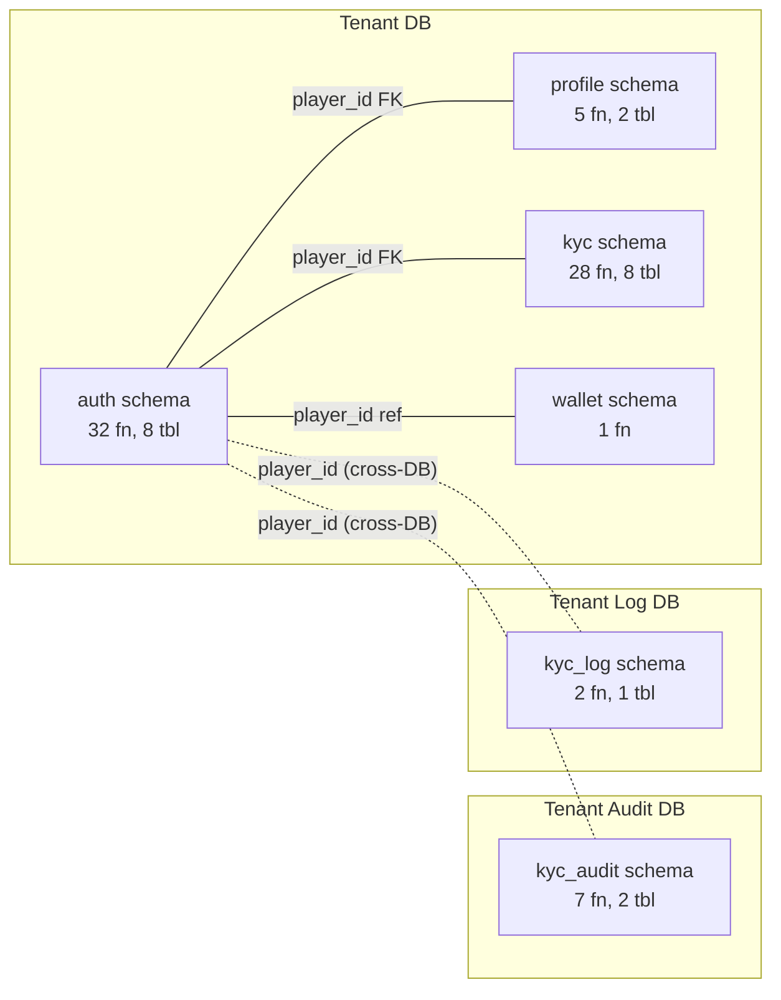
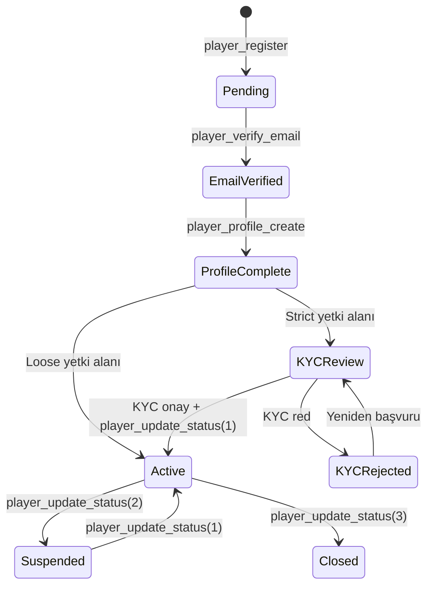
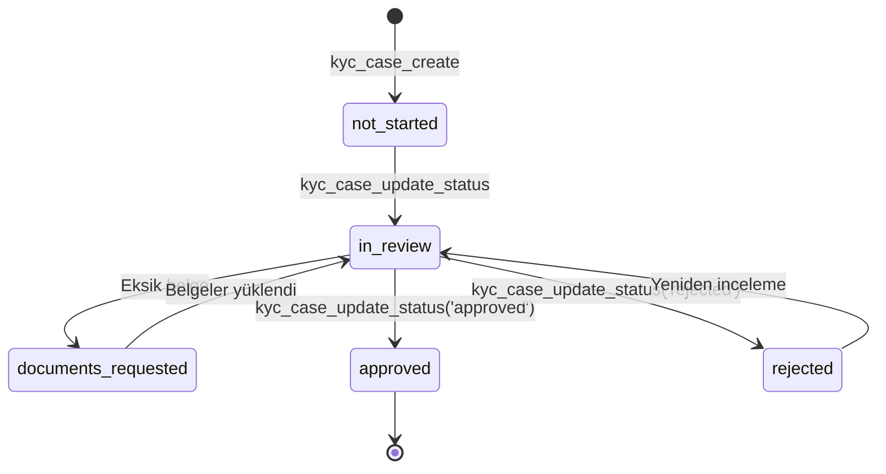
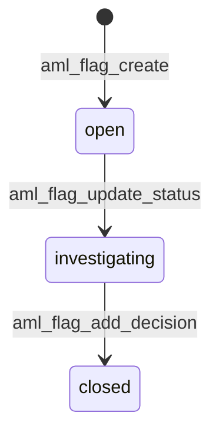

# SPEC_PLAYER_AUTH_KYC: Oyuncu Kimlik Doğrulama ve KYC Spesifikasyonu

Oyuncu yaşam döngüsünün fonksiyonel spesifikasyonu: kayıt, doğrulama, login, profil, KYC, kısıtlama, limit, AML, yetki alanı, cüzdan oluşturma. Toplam **75 fonksiyon**, **21 tablo**, **3 veritabanı**.

> **İlgili spesifikasyonlar:**
> - [SPEC_GAME_GATEWAY.md](SPEC_GAME_GATEWAY.md) — Wallet işlemleri (bet/win/rollback)
> - [SPEC_BONUS_ENGINE.md](SPEC_BONUS_ENGINE.md) — Bonus eligibility (segmentation verileri)
> - [SPEC_FINANCE_GATEWAY.md](SPEC_FINANCE_GATEWAY.md) — Çekim sırasında KYC/wagering kontrolü

---

## 1. Kapsam ve Veritabanı Dağılımı

### 1.1 Kapsam Özeti

| Alan | Fonksiyon | Açıklama |
|------|-----------|----------|
| Kayıt & Login | 10 | Kayıt, e-posta doğrulama, login, şifre yönetimi |
| Profil & Kimlik | 5 | PII şifreli saklama, profil CRUD, kimlik belgesi |
| Oyuncu Yönetimi (BO) | 22 | Kategori/grup CRUD, sınıflandırma, BO arama, durum, shadow tester |
| KYC Operasyonları | 28 | Vaka, belge, kısıtlama, limit, AML, yetki alanı |
| Cüzdan Oluşturma | 1 | Aktivasyon sonrası REAL + BONUS cüzdan |
| Tarama & Risk (Audit) | 7 | PEP/Sanctions tarama, risk değerlendirme |
| Sağlayıcı Log | 2 | KYC provider API logları |
| **Toplam** | **75** | |

### 1.2 Veritabanı Dağılımı

| DB | Schema | Fonksiyon | Tablo | Açıklama |
|----|--------|-----------|-------|----------|
| **tenant** | auth | 32 | 8 | Kayıt, login, şifre, BO yönetimi, sınıflandırma, shadow tester |
| **tenant** | profile | 5 | 2 | Profil, kimlik belgesi |
| **tenant** | kyc | 28 | 8 | KYC vaka, belge, kısıtlama, limit, AML, yetki alanı |
| **tenant** | wallet | 1 | — | Cüzdan oluşturma (tablolar Finance domain'inde) |
| **tenant_audit** | kyc_audit | 7 | 2 | Tarama sonuçları, risk değerlendirme |
| **tenant_log** | kyc_log | 2 | 1 | Provider API logları (günlük partition) |

### 1.3 Cross-DB İlişki

> **Cross-DB kuralı:** Tenant Audit ve Tenant Log DB'lerinde FK yoktur. `player_id` referansı uygulama katmanında korunur. DB'ler arası doğrudan sorgu yapılmaz.

---

## 2. Durum Makinaları ve İş Akışları

### 2.1 Oyuncu Durum Akışı

| Kod | Durum | Açıklama |
|-----|-------|----------|
| 0 | Pending | Kayıt yapılmış, e-posta doğrulanmamış |
| 1 | Active | Tam erişim |
| 2 | Suspended | Geçici askıya alınmış (BO kararı) |
| 3 | Closed | Kalıcı kapatılmış |

### 2.2 İki Aktivasyon Modeli

| Model | Akış | Açıklama |
|-------|------|----------|
| **Strict** (UK, DE) | Kayıt → E-posta → Profil → KYC → Aktif | KYC onayı olmadan oyun oynayamaz |
| **Loose** (Curacao) | Kayıt → E-posta → Profil → Aktif | Hemen oynayabilir, çekim için KYC gerekir |

### 2.3 KYC Vaka Yaşam Döngüsü

### 2.4 AML Flag Yaşam Döngüsü

> **Karar sonrası:** `aml_flag_add_decision` çağrıldığında flag otomatik `closed` olur. `sar_required=TRUE` ise SAR bilgileri kaydedilir.

### 2.5 Limit Cooling Period Kuralları

| Senaryo | Etki | Açıklama |
|---------|------|----------|
| Oyuncu limit **azaltır** | Anında | Sorumlu oyun: anında koruma |
| Oyuncu limit **artırır** | 24 saat bekleme | `pending_value` + `pending_activation_at` ayarlanır |
| Admin limit değiştirir | Anında | `set_by = 'admin'` ise bekleme yok |
| Scheduler çalışır | Bekleyenleri aktifleştirir | `limit_activate_pending()` → INT |

### 2.6 Token Yaşam Döngüsü

| Token Tipi | TTL | Davranış |
|------------|-----|----------|
| E-posta doğrulama | 1440 dk (24 saat) | Yeni token oluşturulduğunda eski kullanılmamışlar `used_at` ile işaretlenir |
| Şifre sıfırlama | 60 dk | Aynı pattern |

---

## 3. Veri Modeli

### 3.1 Veri Koruma Modeli (PII Şifreleme)

| Alan | DB Tipi | Şifreleme | Arama | Normalizasyon |
|------|---------|-----------|-------|---------------|
| `email` | BYTEA × 2 | AES-256 + SHA-256 | Hash ile tam eşleşme | `Trim().ToLowerInvariant()` |
| `first_name`, `last_name` | BYTEA × 2 | AES-256 + SHA-256 | Hash ile tam eşleşme | `Trim().ToLowerInvariant()` |
| `phone`, `gsm` | BYTEA × 2 | AES-256 + SHA-256 | Hash ile tam eşleşme | Sadece rakamlar (`905321234567`) |
| `identity_no` | BYTEA × 2 | AES-256 + SHA-256 | Hash ile tam eşleşme | `Trim()` |
| `address`, `middle_name` | BYTEA × 1 | Sadece AES-256 | Aranamaz | — |
| `password` | VARCHAR(255) | Argon2id | — | — |
| `username` | VARCHAR(150) | Düz metin | ILIKE | — |
| `birth_date` | DATE | Düz metin | Aralık sorgusu | — |

> **Kural:** Şifreleme ve hash oluşturma uygulama katmanında yapılır. DB'ye yalnızca byte[] (BYTEA) gelir. DB fonksiyonları BYTEA alanları okurken `encode(field, 'base64')` ile base64 string olarak döner.

> **Hash ile arama sınırlaması:** SHA-256 hash ile yalnızca **tam eşleşme** mümkündür. Partial/fuzzy arama desteklenmez. `ILIKE` araması sadece `username` alanında çalışır.

### 3.2 Tablo Özeti

| # | Tablo | DB | Kolon | Açıklama |
|---|-------|-----|-------|----------|
| 1 | `auth.players` | tenant | 20 | Oyuncu ana tablosu (şifreli email, Argon2id şifre, 2FA) |
| 2 | `auth.email_verification_tokens` | tenant | 6 | E-posta doğrulama tokenları (UUID, TTL 24h) |
| 3 | `auth.password_reset_tokens` | tenant | 6 | Şifre sıfırlama tokenları (UUID, TTL 60m) |
| 4 | `auth.player_password_history` | tenant | 4 | Şifre geçmişi (son N hash saklanır) |
| 5 | `auth.player_categories` | tenant | 8 | VIP kategorileri (Bronze, Silver, Gold) |
| 6 | `auth.player_groups` | tenant | 8 | Oyuncu grupları (hedefleme için) |
| 7 | `auth.player_classification` | tenant | 5 | Oyuncu-kategori/grup eşleme |
| 8 | `auth.shadow_testers` | tenant | 5 | Shadow mode test oyuncuları |
| 9 | `profile.player_profile` | tenant | 17 | Kişisel bilgiler (şifreli PII, GDPR/KVKK) |
| 10 | `profile.player_identity` | tenant | 6 | Kimlik belgesi (şifreli, doğrulama durumu) |
| 11 | `kyc.player_kyc_cases` | tenant | 9 | KYC vakaları |
| 12 | `kyc.player_kyc_workflows` | tenant | 8 | KYC durum değişiklik tarihçesi |
| 13 | `kyc.player_documents` | tenant | 18 | KYC belgeleri (DB veya object storage) |
| 14 | `kyc.player_jurisdiction` | tenant | 24 | Yetki alanı ve GeoIP takibi |
| 15 | `kyc.player_limits` | tenant | 14 | Sorumlu oyun limitleri (cooling period) |
| 16 | `kyc.player_restrictions` | tenant | 15 | Kısıtlamalar (self-exclusion, cooling-off) |
| 17 | `kyc.player_limit_history` | tenant | 13 | Limit/kısıtlama değişiklik logu |
| 18 | `kyc.player_aml_flags` | tenant | 35 | AML uyarıları ve SAR yönetimi |
| 19 | `kyc_audit.player_risk_assessments` | tenant_audit | 26 | Risk skorlama (6 bileşen) |
| 20 | `kyc_audit.player_screening_results` | tenant_audit | 21 | PEP/Sanctions tarama sonuçları |
| 21 | `kyc_log.player_kyc_provider_logs` | tenant_log | 14 | Provider API logları (günlük partition) |

### 3.3 Temel Tablo Yapıları

#### auth.players

| Kolon | Tip | Zorunlu | Varsayılan | Açıklama |
|-------|-----|---------|------------|----------|
| id | BIGSERIAL | PK | — | |
| username | VARCHAR(150) | Evet | — | Benzersiz, lowercase |
| email_encrypted | BYTEA | Evet | — | AES-256 ciphertext |
| email_hash | BYTEA | Evet | — | SHA-256 (arama için) |
| status | SMALLINT | Evet | 0 | 0=Pending, 1=Active, 2=Suspended, 3=Closed |
| email_verified | BOOLEAN | Evet | FALSE | |
| email_verified_at | TIMESTAMPTZ | Hayır | — | |
| password | VARCHAR(255) | Evet | — | Argon2id hash |
| two_factor_enabled | BOOLEAN | Evet | FALSE | |
| two_factor_key | BYTEA | Hayır | — | Şifreli 2FA anahtarı |
| payment_two_factor_enabled | BOOLEAN | Evet | FALSE | |
| payment_two_factor_key | BYTEA | Hayır | — | |
| access_failed_count | INTEGER | Evet | 0 | Başarısız giriş sayacı |
| lockout_enabled | BOOLEAN | Evet | FALSE | |
| lockout_end_at | TIMESTAMP | Hayır | — | Kilit bitiş zamanı |
| last_password_change_at | TIMESTAMP | Hayır | — | |
| require_password_change | BOOLEAN | Evet | FALSE | |
| registered_at | TIMESTAMP | Evet | now() | |
| last_login_at | TIMESTAMP | Hayır | — | |
| created_at | TIMESTAMP | Evet | now() | |
| updated_at | TIMESTAMP | Evet | now() | |

#### profile.player_profile

| Kolon | Tip | Zorunlu | Varsayılan | Açıklama |
|-------|-----|---------|------------|----------|
| id | BIGSERIAL | PK | — | |
| player_id | BIGINT | Evet, UNIQUE | — | FK → auth.players |
| first_name | BYTEA | Hayır | — | AES-256 encrypted |
| first_name_hash | BYTEA | Hayır | — | SHA-256 (arama) |
| middle_name | BYTEA | Hayır | — | AES-256, hash yok |
| last_name | BYTEA | Hayır | — | AES-256 encrypted |
| last_name_hash | BYTEA | Hayır | — | SHA-256 (arama) |
| birth_date | DATE | Hayır | — | Düz metin, aranabilir |
| address | BYTEA | Hayır | — | AES-256, hash yok |
| phone | BYTEA | Hayır | — | AES-256 encrypted |
| phone_hash | BYTEA | Hayır | — | SHA-256 (arama) |
| gsm | BYTEA | Hayır | — | AES-256 encrypted |
| gsm_hash | BYTEA | Hayır | — | SHA-256 (arama) |
| country_code | CHAR(2) | Hayır | — | ISO-3166 |
| city | VARCHAR(100) | Hayır | — | Düz metin |
| gender | SMALLINT | Hayır | — | 0=Belirtilmemiş, 1=Erkek, 2=Kadın |

#### kyc.player_kyc_cases

| Kolon | Tip | Zorunlu | Varsayılan | Açıklama |
|-------|-----|---------|------------|----------|
| id | BIGSERIAL | PK | — | |
| player_id | BIGINT | Evet, UNIQUE | — | FK → auth.players |
| current_status | VARCHAR(30) | Evet | — | not_started, in_review, approved, rejected, suspended |
| kyc_level | VARCHAR(20) | Hayır | — | basic, standard, enhanced |
| risk_level | VARCHAR(20) | Hayır | — | low, medium, high |
| assigned_reviewer_id | BIGINT | Hayır | — | BO kullanıcı ID |
| last_decision_reason | VARCHAR(255) | Hayır | — | |

#### kyc.player_restrictions

| Kolon | Tip | Zorunlu | Varsayılan | Açıklama |
|-------|-----|---------|------------|----------|
| id | BIGSERIAL | PK | — | |
| player_id | BIGINT | Evet | — | FK → auth.players |
| restriction_type | VARCHAR(30) | Evet | — | deposit, withdrawal, login, gameplay, cooling_off, self_exclusion |
| scope | VARCHAR(30) | Evet | 'all' | all, casino, sports, live |
| status | VARCHAR(20) | Evet | 'active' | active, expired, revoked |
| starts_at | TIMESTAMP | Evet | now() | |
| ends_at | TIMESTAMP | Hayır | — | NULL = kalıcı |
| reason | VARCHAR(500) | Hayır | — | |
| set_by | VARCHAR(20) | Evet | 'admin' | player, admin, regulator |
| can_be_revoked | BOOLEAN | Evet | FALSE | |
| min_duration_days | INT | Hayır | — | Minimum süre |

#### kyc.player_limits

| Kolon | Tip | Zorunlu | Varsayılan | Açıklama |
|-------|-----|---------|------------|----------|
| id | BIGSERIAL | PK | — | |
| player_id | BIGINT | Evet | — | FK → auth.players |
| limit_type | VARCHAR(30) | Evet | — | deposit, loss, wager, session |
| limit_period | VARCHAR(20) | Evet | — | daily, weekly, monthly |
| limit_value | DECIMAL(18,2) | Evet | — | Tutar veya dakika |
| currency_code | CHAR(3) | Hayır | — | NULL = session tipi |
| status | VARCHAR(20) | Evet | 'active' | active, pending_increase, expired |
| pending_value | DECIMAL(18,2) | Hayır | — | Artış talebi |
| pending_activation_at | TIMESTAMP | Hayır | — | Cooling period bitiş |
| set_by | VARCHAR(20) | Evet | 'player' | player, admin, system |

#### kyc.player_aml_flags (önemli kolonlar)

| Kolon | Tip | Açıklama |
|-------|-----|----------|
| flag_type | VARCHAR(50) | structuring, rapid_movement, unusual_pattern, large_transaction, ... |
| severity | VARCHAR(20) | low, medium, high, critical |
| status | VARCHAR(30) | open, investigating, closed |
| detection_method | VARCHAR(30) | automated, manual, external |
| related_transactions | JSONB | `[{id, type, amount, date}]` |
| evidence_data | JSONB | `{pattern, timeline, amounts}` |
| decision | VARCHAR(50) | no_suspicious_activity, suspicious_confirmed, requires_sar, ... |
| sar_required | BOOLEAN | SAR dosyalanacak mı? |
| sar_reference | VARCHAR(100) | SAR dosya numarası |
| actions_taken | JSONB | `[{action, at, by}]` |

---

## 4. Fonksiyon Spesifikasyonları

### 4.1 Kayıt ve E-posta Doğrulama

#### `auth.player_register`

| Parametre | Tip | Zorunlu | Varsayılan | Açıklama |
|-----------|-----|---------|------------|----------|
| p_username | VARCHAR(150) | Evet | — | Kullanıcı adı |
| p_email_encrypted | BYTEA | Evet | — | AES-256 şifreli email |
| p_email_hash | BYTEA | Evet | — | SHA-256 hash (arama) |
| p_password_hash | VARCHAR(255) | Evet | — | Argon2id hash |
| p_verification_token | UUID | Evet | — | Backend üretir |
| p_token_expires_minutes | INT | Hayır | 1440 | Token TTL (dakika) |
| p_country_code | CHAR(2) | Hayır | NULL | Ülke kodu |
| p_language | CHAR(2) | Hayır | NULL | Dil kodu |

**Dönüş:** `JSONB`

| Alan | Tip | Açıklama |
|------|-----|----------|
| playerId | BIGINT | Yeni oyuncu ID |
| username | VARCHAR | Normalize edilmiş username |
| status | SMALLINT | Her zaman 0 (Pending) |
| emailVerified | BOOLEAN | Her zaman false |
| createdAt | TIMESTAMPTZ | Kayıt zamanı |

**İş Kuralları:**
1. Username `LOWER(TRIM())` ile normalize edilir.
2. Username benzersizliği kontrol edilir (case-insensitive).
3. Email hash benzersizliği kontrol edilir.
4. Oyuncu `status=0` (Pending) ile oluşturulur.
5. Email verification token oluşturulur (`expires_at = NOW() + interval`).

**Hata Kodları:**

| Hata Key | ERRCODE | Koşul |
|----------|---------|-------|
| error.player-register.username-required | P0400 | p_username NULL/boş |
| error.player-register.email-required | P0400 | p_email_encrypted veya p_email_hash NULL |
| error.player-register.password-required | P0400 | p_password_hash NULL/boş |
| error.player-register.token-required | P0400 | p_verification_token NULL |
| error.player-register.username-exists | P0409 | Username zaten mevcut |
| error.player-register.email-exists | P0409 | Email hash zaten mevcut |

---

#### `auth.player_verify_email`

| Parametre | Tip | Zorunlu | Varsayılan | Açıklama |
|-----------|-----|---------|------------|----------|
| p_token | UUID | Evet | — | Doğrulama tokenı |

**Dönüş:** `JSONB` → `{playerId, emailVerified, emailVerifiedAt}`

**İş Kuralları:**
1. `used_at IS NULL` koşuluyla kullanılmamış token aranır.
2. Token süresi kontrol edilir (`expires_at > NOW()`).
3. Oyuncunun email'i zaten doğrulanmışsa hata.
4. Token `used_at = NOW()` ile işaretlenir.
5. Oyuncuda `email_verified = TRUE`, `email_verified_at = NOW()` güncellenir.

**Hata Kodları:**

| Hata Key | ERRCODE | Koşul |
|----------|---------|-------|
| error.player-verify.token-required | P0400 | p_token NULL |
| error.player-verify.token-not-found | P0404 | Kullanılmamış token bulunamadı |
| error.player-verify.token-expired | P0410 | Token süresi dolmuş |
| error.player-verify.already-verified | P0409 | Email zaten doğrulanmış |

---

#### `auth.player_resend_verification`

| Parametre | Tip | Zorunlu | Varsayılan | Açıklama |
|-----------|-----|---------|------------|----------|
| p_player_id | BIGINT | Evet | — | Oyuncu ID |
| p_new_token | UUID | Evet | — | Yeni token (backend üretir) |
| p_token_expires_minutes | INT | Hayır | 1440 | Token TTL |

**Dönüş:** `VOID`

**İş Kuralları:**
1. Oyuncu varlığı kontrol edilir.
2. Email zaten doğrulanmışsa hata.
3. Mevcut kullanılmamış tokenlar `used_at = NOW()` ile iptal edilir.
4. Yeni token oluşturulur.

**Hata Kodları:**

| Hata Key | ERRCODE | Koşul |
|----------|---------|-------|
| error.player-verify.player-required | P0400 | p_player_id NULL |
| error.player-verify.token-required | P0400 | p_new_token NULL |
| error.player-verify.player-not-found | P0404 | Oyuncu yok |
| error.player-verify.already-verified | P0409 | Email zaten doğrulanmış |

---

### 4.2 Login ve Hesap Güvenliği

#### `auth.player_authenticate`

| Parametre | Tip | Zorunlu | Varsayılan | Açıklama |
|-----------|-----|---------|------------|----------|
| p_email_hash | BYTEA | Evet | — | SHA-256 email hash |

**Dönüş:** `JSONB`

| Alan | Tip | Açıklama |
|------|-----|----------|
| player | JSONB | id, username, emailEncrypted (base64), status, emailVerified, registeredAt, lastLoginAt |
| credentials | JSONB | passwordHash, twoFactorEnabled, accessFailedCount, lockoutEnabled, lockoutEndAt, lastPasswordChangeAt, requirePasswordChange |
| kyc | JSONB | status, level, riskLevel (son KYC vakasından) |
| profileExists | BOOLEAN | Profil oluşturulmuş mu? |
| activeRestrictions | JSONB[] | Aktif kısıtlamalar (id, restrictionType, scope, startsAt, endsAt, reason, setBy) |

**İş Kuralları:**
1. Email hash ile oyuncu aranır. Bulunamazsa `invalid-credentials` hatası (email varlığı sızdırılmaz).
2. Hesap kilidi kontrol edilir: `lockout_enabled = TRUE AND lockout_end_at > NOW()` → `account-locked` hatası.
3. Kilit süresi dolmuşsa kilit otomatik kaldırılır.
4. Hesap durumu kontrol edilir: `status = 2` → `account-suspended`, `status = 3` → `account-closed`.
5. **Şifre doğrulaması DB'de yapılmaz** — backend Argon2id verify yapar.
6. En son KYC vakası, profil varlığı ve aktif kısıtlamalar toplanarak tek JSONB döner.

**Hata Kodları:**

| Hata Key | ERRCODE | Koşul |
|----------|---------|-------|
| error.player-auth.email-required | P0400 | p_email_hash NULL |
| error.player-auth.invalid-credentials | P0401 | Oyuncu bulunamadı |
| error.player-auth.account-locked | P0423 | Hesap kilitli |
| error.player-auth.account-suspended | P0403 | status = 2 |
| error.player-auth.account-closed | P0403 | status = 3 |

---

#### `auth.player_find_by_email_hash`

| Parametre | Tip | Zorunlu | Varsayılan | Açıklama |
|-----------|-----|---------|------------|----------|
| p_email_hash | BYTEA | Evet | — | SHA-256 email hash |

**Dönüş:** `JSONB` → `{playerId, status}` veya `NULL`

**İş Kuralları:**
1. Hafif arama: sadece `player_id` ve `status` döner.
2. Bulunamazsa NULL döner (hata fırlatmaz).
3. Kullanım: "Şifremi Unuttum" ve "Doğrulama Yeniden Gönder" akışlarında oyuncu varlığı kontrolü.

---

#### `auth.player_login_failed_increment`

| Parametre | Tip | Zorunlu | Varsayılan | Açıklama |
|-----------|-----|---------|------------|----------|
| p_player_id | BIGINT | Evet | — | Oyuncu ID |
| p_lock_threshold | INT | Hayır | 5 | Kilitleme eşiği |
| p_lock_duration_minutes | INT | Hayır | 30 | Kilit süresi (dk) |

**Dönüş:** `JSONB` → `{failedCount, isLocked, lockedUntil}`

**İş Kuralları:**
1. `access_failed_count` artırılır.
2. Sayaç eşiği aşarsa: `lockout_enabled = TRUE`, `lockout_end_at = NOW() + interval`.
3. Mevcut kilit durumu döner.

---

#### `auth.player_login_failed_reset`

| Parametre | Tip | Zorunlu | Varsayılan | Açıklama |
|-----------|-----|---------|------------|----------|
| p_player_id | BIGINT | Evet | — | Oyuncu ID |

**Dönüş:** `VOID`

**İş Kuralları:**
1. `access_failed_count = 0`, `lockout_enabled = FALSE`, `lockout_end_at = NULL`.
2. `last_login_at = NOW()` güncellenir.
3. Başarılı login sonrası backend tarafından çağrılır.

---

### 4.3 Şifre Yönetimi

#### `auth.player_change_password`

| Parametre | Tip | Zorunlu | Varsayılan | Açıklama |
|-----------|-----|---------|------------|----------|
| p_player_id | BIGINT | Evet | — | Oyuncu ID |
| p_new_password_hash | VARCHAR(255) | Evet | — | Yeni Argon2id hash |
| p_history_count | INT | Hayır | 3 | Saklanacak eski şifre sayısı |

**Dönüş:** `VOID`

**İş Kuralları:**
1. Oyuncu durumu kontrol edilir (status 0 veya 1 olmalı).
2. Mevcut şifre hash'i `player_password_history`'ye kaydedilir.
3. Yeni hash `players.password`'e yazılır.
4. `require_password_change = FALSE` temizlenir.
5. `history_count`'tan fazla eski kayıt silinir.
6. **Eski şifre doğrulaması DB'de yapılmaz** — backend Argon2id verify yapar.

| Hata Key | ERRCODE | Koşul |
|----------|---------|-------|
| error.player-password.player-required | P0400 | p_player_id NULL |
| error.player-password.password-required | P0400 | p_new_password_hash NULL/boş |
| error.player-password.player-not-found | P0404 | Oyuncu yok |
| error.player-password.account-inactive | P0403 | status 2 veya 3 |

---

#### `auth.player_reset_password_request`

| Parametre | Tip | Zorunlu | Varsayılan | Açıklama |
|-----------|-----|---------|------------|----------|
| p_player_id | BIGINT | Evet | — | Oyuncu ID |
| p_token | UUID | Evet | — | Reset tokenı (backend üretir) |
| p_expires_minutes | INT | Hayır | 60 | Token TTL |

**Dönüş:** `VOID`

**İş Kuralları:**
1. Mevcut kullanılmamış reset tokenları iptal edilir.
2. Yeni token oluşturulur.

| Hata Key | ERRCODE | Koşul |
|----------|---------|-------|
| error.player-password.player-required | P0400 | p_player_id NULL |
| error.player-password.token-required | P0400 | p_token NULL |
| error.player-password.player-not-found | P0404 | Oyuncu yok |

---

#### `auth.player_reset_password_confirm`

| Parametre | Tip | Zorunlu | Varsayılan | Açıklama |
|-----------|-----|---------|------------|----------|
| p_token | UUID | Evet | — | Reset tokenı |
| p_new_password_hash | VARCHAR(255) | Evet | — | Yeni Argon2id hash |
| p_history_count | INT | Hayır | 3 | Eski şifre saklama sayısı |

**Dönüş:** `JSONB` → `{playerId, passwordChanged: true}`

**İş Kuralları:**
1. Kullanılmamış token aranır, süresi kontrol edilir.
2. Token kullanıldı olarak işaretlenir.
3. Eski şifre history'ye kaydedilir.
4. Yeni şifre yazılır, eski history temizlenir.

| Hata Key | ERRCODE | Koşul |
|----------|---------|-------|
| error.player-password.token-required | P0400 | p_token NULL |
| error.player-password.password-required | P0400 | p_new_password_hash NULL/boş |
| error.player-password.token-not-found | P0404 | Token bulunamadı |
| error.player-password.token-expired | P0410 | Token süresi dolmuş |

---

### 4.4 Profil ve Kimlik Belgesi

#### `profile.player_profile_create`

| Parametre | Tip | Zorunlu | Varsayılan | Açıklama |
|-----------|-----|---------|------------|----------|
| p_player_id | BIGINT | Evet | — | Oyuncu ID |
| p_first_name | BYTEA | Hayır | NULL | AES-256 encrypted |
| p_first_name_hash | BYTEA | Hayır | NULL | SHA-256 hash |
| p_middle_name | BYTEA | Hayır | NULL | AES-256 (hash yok) |
| p_last_name | BYTEA | Hayır | NULL | AES-256 encrypted |
| p_last_name_hash | BYTEA | Hayır | NULL | SHA-256 hash |
| p_birth_date | DATE | Hayır | NULL | Düz metin |
| p_address | BYTEA | Hayır | NULL | AES-256 (hash yok) |
| p_phone | BYTEA | Hayır | NULL | AES-256 encrypted |
| p_phone_hash | BYTEA | Hayır | NULL | SHA-256 hash |
| p_gsm | BYTEA | Hayır | NULL | AES-256 encrypted |
| p_gsm_hash | BYTEA | Hayır | NULL | SHA-256 hash |
| p_country_code | CHAR(2) | Hayır | NULL | ISO-3166 |
| p_city | VARCHAR(100) | Hayır | NULL | |
| p_gender | SMALLINT | Hayır | NULL | 0/1/2 |

**Dönüş:** `BIGINT` (profil ID)

**İş Kuralları:**
1. Oyuncu varlığı kontrol edilir.
2. Oyuncu başına **tek profil** — zaten varsa hata.
3. Tüm PII alanları şifreli olarak saklanır.

| Hata Key | ERRCODE | Koşul |
|----------|---------|-------|
| error.player-profile.player-required | P0400 | p_player_id NULL |
| error.player-profile.player-not-found | P0404 | Oyuncu yok |
| error.player-profile.already-exists | P0409 | Profil zaten mevcut |

---

#### `profile.player_profile_get`

| Parametre | Tip | Zorunlu | Varsayılan | Açıklama |
|-----------|-----|---------|------------|----------|
| p_player_id | BIGINT | Evet | — | Oyuncu ID |

**Dönüş:** `JSONB`

| Alan | Tip | Açıklama |
|------|-----|----------|
| firstName | VARCHAR | base64 encoded (backend decrypt eder) |
| middleName | VARCHAR | base64 encoded |
| lastName | VARCHAR | base64 encoded |
| birthDate | DATE | Düz metin |
| address | VARCHAR | base64 encoded |
| phone | VARCHAR | base64 encoded |
| gsm | VARCHAR | base64 encoded |
| countryCode | CHAR(2) | Düz metin |
| city | VARCHAR | Düz metin |
| gender | SMALLINT | Düz metin |

> **BYTEA → base64 pattern:** DB fonksiyonu `encode(field, 'base64')` kullanır. Backend `base64 → byte[] → AES decrypt` yapar.

| Hata Key | ERRCODE | Koşul |
|----------|---------|-------|
| error.player-profile.player-required | P0400 | p_player_id NULL |
| error.player-profile.not-found | P0404 | Profil yok |

---

#### `profile.player_profile_update`

Parametre listesi `player_profile_create` ile aynı. Tüm alanlar opsiyonel.

**Dönüş:** `VOID`

**İş Kuralları:**
1. COALESCE pattern: sadece gönderilen alanlar güncellenir.
2. NULL gönderilirse mevcut değer korunur.

---

#### `profile.player_identity_upsert`

| Parametre | Tip | Zorunlu | Varsayılan | Açıklama |
|-----------|-----|---------|------------|----------|
| p_player_id | BIGINT | Evet | — | Oyuncu ID |
| p_identity_no | BYTEA | Evet | — | AES-256 encrypted kimlik no |
| p_identity_no_hash | BYTEA | Evet | — | SHA-256 hash |

**Dönüş:** `BIGINT` (kimlik kayıt ID)

**İş Kuralları:**
1. Kayıt varsa: güncellenir + `identity_confirmed = FALSE`, `verified_at = NULL` sıfırlanır.
2. Kayıt yoksa: yeni oluşturulur.

---

#### `profile.player_identity_get`

| Parametre | Tip | Zorunlu | Varsayılan | Açıklama |
|-----------|-----|---------|------------|----------|
| p_player_id | BIGINT | Evet | — | Oyuncu ID |

**Dönüş:** `JSONB` veya `NULL` → `{id, playerId, identityNo (base64), identityConfirmed, verifiedAt}`

> Kimlik henüz yüklenmemişse NULL döner (hata değil).

---

### 4.5 BO Oyuncu Yönetimi

#### `auth.player_get`

| Parametre | Tip | Zorunlu | Varsayılan | Açıklama |
|-----------|-----|---------|------------|----------|
| p_player_id | BIGINT | Evet | — | Oyuncu ID |

**Dönüş:** `JSONB` — Kapsamlı oyuncu detayı

| Alan | Tip | Açıklama |
|------|-----|----------|
| id, username, status | — | Temel bilgiler |
| emailEncrypted | VARCHAR | base64 (backend decrypt) |
| emailVerified, emailVerifiedAt | — | Doğrulama durumu |
| twoFactorEnabled, paymentTwoFactorEnabled | — | 2FA durumu |
| accessFailedCount, lockoutEnabled, lockoutEndAt | — | Kilit durumu |
| profile | JSONB | firstName, lastName, birthDate, ... (base64 PII) |
| identity | JSONB | identityNo (base64), identityConfirmed, verifiedAt |
| kyc | JSONB | caseId, status, level, riskLevel, reviewerId |
| classification | JSONB | category (id, code, name, level), groups[] |
| wallets | JSONB[] | walletId, walletType, currencyCode, balance, isDefault, status |
| restrictions | JSONB[] | id, restrictionType, scope, status, dates, reason, setBy |

| Hata Key | ERRCODE | Koşul |
|----------|---------|-------|
| error.player.player-required | P0400 | p_player_id NULL |
| error.player.not-found | P0404 | Oyuncu yok |

---

#### `auth.player_list`

| Parametre | Tip | Zorunlu | Varsayılan | Açıklama |
|-----------|-----|---------|------------|----------|
| p_status | SMALLINT | Hayır | NULL | Durum filtresi |
| p_email_verified | BOOLEAN | Hayır | NULL | |
| p_search | VARCHAR(255) | Hayır | NULL | Username ILIKE araması |
| p_email_hash | BYTEA | Hayır | NULL | Tam eşleşme |
| p_first_name_hash | BYTEA | Hayır | NULL | Tam eşleşme |
| p_last_name_hash | BYTEA | Hayır | NULL | Tam eşleşme |
| p_phone_hash | BYTEA | Hayır | NULL | Tam eşleşme |
| p_identity_no_hash | BYTEA | Hayır | NULL | Tam eşleşme |
| p_category_id | BIGINT | Hayır | NULL | Kategori filtresi |
| p_group_id | BIGINT | Hayır | NULL | Grup filtresi |
| p_country_code | CHAR(2) | Hayır | NULL | |
| p_birth_date_from | DATE | Hayır | NULL | |
| p_birth_date_to | DATE | Hayır | NULL | |
| p_date_from | TIMESTAMPTZ | Hayır | NULL | Kayıt tarihi başlangıç |
| p_date_to | TIMESTAMPTZ | Hayır | NULL | Kayıt tarihi bitiş |
| p_page | INT | Hayır | 1 | |
| p_page_size | INT | Hayır | 20 | |

**Dönüş:** `JSONB` → `{items[], totalCount, page, pageSize}`

**İş Kuralları:**
1. Tüm filtreler opsiyonel, NULL olanlar atlanır.
2. Hash filtreler (email, ad, soyad, telefon, kimlik) **tam eşleşme** — partial arama yok.
3. `p_search` alanı sadece `username` üzerinde ILIKE araması yapar.
4. Kategori/grup filtresi EXISTS subquery ile çalışır.
5. Sonuçlar `registered_at DESC` sıralı.

---

#### `auth.player_update_status`

| Parametre | Tip | Zorunlu | Varsayılan | Açıklama |
|-----------|-----|---------|------------|----------|
| p_player_id | BIGINT | Evet | — | Oyuncu ID |
| p_new_status | SMALLINT | Evet | — | 0, 1, 2 veya 3 |
| p_reason | VARCHAR(255) | Hayır | NULL | Durum değişiklik nedeni |

**Dönüş:** `VOID`

**İş Kuralları:**
1. Geçerli status: 0, 1, 2, 3.
2. Aynı duruma geçiş engellenir.
3. Oturum sonlandırma backend sorumluluğundadır (DB yapmaz).

| Hata Key | ERRCODE | Koşul |
|----------|---------|-------|
| error.player.player-required | P0400 | p_player_id NULL |
| error.player.invalid-status | P0400 | Geçersiz status değeri |
| error.player.not-found | P0404 | Oyuncu yok |
| error.player.status-unchanged | P0400 | Aynı durum |

---

#### `auth.player_get_segmentation`

| Parametre | Tip | Zorunlu | Varsayılan | Açıklama |
|-----------|-----|---------|------------|----------|
| p_player_id | BIGINT | Evet | — | Oyuncu ID |

**Dönüş:** `JSONB`

| Alan | Tip | Açıklama |
|------|-----|----------|
| playerId | BIGINT | |
| category | JSONB | code, level |
| categoryLevel | INT | |
| groups | VARCHAR[] | Grup kodları |
| groupCodes | VARCHAR[] | Grup kodları (alias) |
| groupMaxLevel | INT | En yüksek grup seviyesi |
| country | CHAR(2) | Profildeki ülke |
| kycStatus | VARCHAR | Son KYC vaka durumu |
| accountAgeDays | INT | Hesap yaşı (gün) |
| registeredAt | TIMESTAMPTZ | Kayıt tarihi |

> **Kullanım:** Bonus eligibility değerlendirmesi için tek giriş noktası. Backend bu veriyi bonus rule engine'e iletir.

---

### 4.6 Kategori ve Grup CRUD

#### Kategori Fonksiyonları

| Fonksiyon | Parametreler | Dönüş | Açıklama |
|-----------|-------------|-------|----------|
| `auth.player_category_create` | p_category_code, p_category_name, p_level(=0), p_description | BIGINT | Kod UPPER(TRIM) normalize, benzersiz |
| `auth.player_category_update` | p_id, p_category_name, p_level, p_description, p_is_active | VOID | COALESCE partial update |
| `auth.player_category_get` | p_id | JSONB | Detay + playerCount |
| `auth.player_category_list` | p_is_active(=NULL) | JSONB | Liste + playerCount, ORDER BY level |
| `auth.player_category_delete` | p_id | VOID | Soft delete (is_active=FALSE) |

#### Grup Fonksiyonları

| Fonksiyon | Parametreler | Dönüş | Açıklama |
|-----------|-------------|-------|----------|
| `auth.player_group_create` | p_group_code, p_group_name, p_level(=0), p_description | BIGINT | Aynı pattern |
| `auth.player_group_update` | p_id, p_group_name, p_level, p_description, p_is_active | VOID | COALESCE |
| `auth.player_group_get` | p_id | JSONB | Detay + playerCount |
| `auth.player_group_list` | p_is_active(=NULL) | JSONB | Liste + playerCount |
| `auth.player_group_delete` | p_id | VOID | Soft delete |

> **Ortak pattern:** Kategori tek atama (oyuncu başına 1), grup çoklu atama (oyuncu başına N).

### 4.7 Sınıflandırma (Classification)

| Fonksiyon | Parametreler | Dönüş | Açıklama |
|-----------|-------------|-------|----------|
| `auth.player_classification_assign` | p_player_id, p_group_id, p_category_id | VOID | Kategori: upsert (tek). Grup: ON CONFLICT DO NOTHING (çoklu, idempotent) |
| `auth.player_classification_bulk_assign` | p_player_ids(BIGINT[]), p_group_id, p_category_id | INT | Toplu atama, etkilenen satır sayısı döner |
| `auth.player_classification_list` | p_player_id | JSONB | `{category: {...}, groups: [...]}` |
| `auth.player_classification_remove` | p_player_id, p_group_id, p_category_id | VOID | Grup: DELETE. Kategori: SET NULL |

---

### 4.8 Shadow Tester

| Fonksiyon | Parametreler | Dönüş | Açıklama |
|-----------|-------------|-------|----------|
| `auth.shadow_tester_add` | p_player_id, p_note, p_added_by | VOID | ON CONFLICT DO NOTHING (idempotent) |
| `auth.shadow_tester_get` | p_player_id | JSONB | `{id, playerId, username, note, addedBy, createdAt}` |
| `auth.shadow_tester_list` | — | JSONB | Tüm testerlar, ORDER BY created_at DESC |
| `auth.shadow_tester_remove` | p_player_id | VOID | Hard delete |

---

### 4.9 KYC Vaka Yönetimi

#### `kyc.kyc_case_create`

| Parametre | Tip | Zorunlu | Varsayılan | Açıklama |
|-----------|-----|---------|------------|----------|
| p_player_id | BIGINT | Evet | — | |
| p_initial_status | VARCHAR(30) | Hayır | 'not_started' | |
| p_kyc_level | VARCHAR(20) | Hayır | 'basic' | basic, standard, enhanced |

**Dönüş:** `BIGINT` (case ID)

**İş Kuralları:**
1. Oyuncu varlığı kontrol edilir.
2. Vaka oluşturulur.
3. İlk workflow kaydı eklenir (action='CREATE').

---

#### `kyc.kyc_case_update_status`

| Parametre | Tip | Zorunlu | Varsayılan | Açıklama |
|-----------|-----|---------|------------|----------|
| p_case_id | BIGINT | Evet | — | |
| p_new_status | VARCHAR(30) | Evet | — | |
| p_reason | VARCHAR(255) | Hayır | NULL | |
| p_performed_by | BIGINT | Hayır | NULL | |

**Dönüş:** `VOID`

**İş Kuralları:**
1. Aynı duruma geçiş engellenir.
2. Workflow tarihçe kaydı eklenir (action='STATUS_CHANGE', önceki ve yeni durum).

---

#### `kyc.kyc_case_assign_reviewer`

| Parametre | Tip | Zorunlu | Varsayılan | Açıklama |
|-----------|-----|---------|------------|----------|
| p_case_id | BIGINT | Evet | — | |
| p_reviewer_id | BIGINT | Evet | — | |

**Dönüş:** `VOID` — Workflow kaydı eklenir (action='ASSIGN_REVIEWER').

---

#### `kyc.kyc_case_get`

| Parametre | Tip | Zorunlu | Varsayılan | Açıklama |
|-----------|-----|---------|------------|----------|
| p_case_id | BIGINT | Evet | — | |

**Dönüş:** `JSONB` — Vaka detayı + workflows[] + documents[]

---

#### `kyc.kyc_case_list`

| Parametre | Tip | Zorunlu | Varsayılan | Açıklama |
|-----------|-----|---------|------------|----------|
| p_status | VARCHAR(30) | Hayır | NULL | |
| p_kyc_level | VARCHAR(20) | Hayır | NULL | |
| p_risk_level | VARCHAR(20) | Hayır | NULL | |
| p_reviewer_id | BIGINT | Hayır | NULL | |
| p_player_id | BIGINT | Hayır | NULL | |
| p_page | INT | Hayır | 1 | |
| p_page_size | INT | Hayır | 20 | |

**Dönüş:** `JSONB` → `{items[], totalCount, page, pageSize}`

---

### 4.10 KYC Belge Yönetimi

#### `kyc.document_upload`

| Parametre | Tip | Zorunlu | Varsayılan | Açıklama |
|-----------|-----|---------|------------|----------|
| p_player_id | BIGINT | Evet | — | |
| p_kyc_case_id | BIGINT | Hayır | NULL | Vakaya bağlama (opsiyonel) |
| p_document_type | VARCHAR(30) | Evet | — | identity, passport, driver_license, proof_of_address, selfie |
| p_file_name | VARCHAR(255) | Hayır | NULL | |
| p_mime_type | VARCHAR(50) | Hayır | NULL | |
| p_storage_type | VARCHAR(20) | Evet | — | 'db' veya 'object_storage' |
| p_file_data | BYTEA | Hayır | NULL | DB storage için |
| p_storage_path | VARCHAR(500) | Hayır | NULL | Object storage için |
| p_encryption_key_id | VARCHAR(100) | Hayır | NULL | |
| p_file_hash | BYTEA | Evet | — | Bütünlük kontrolü |
| p_file_size | BIGINT | Hayır | NULL | |

**Dönüş:** `BIGINT` (document ID)

**İş Kuralları:**
1. Oyuncu varlığı kontrol edilir.
2. Vaka verilmişse, vakanın oyuncuya ait olduğu doğrulanır.
3. Belge `status='pending'` ile oluşturulur.
4. Vakaya bağlıysa workflow kaydı eklenir (action='DOCUMENT_UPLOAD').

---

#### `kyc.document_review`

| Parametre | Tip | Zorunlu | Varsayılan | Açıklama |
|-----------|-----|---------|------------|----------|
| p_document_id | BIGINT | Evet | — | |
| p_new_status | VARCHAR(30) | Evet | — | approved, rejected |
| p_rejection_reason | VARCHAR(255) | Hayır | NULL | |
| p_reviewed_by | BIGINT | Hayır | NULL | |

**Dönüş:** `VOID`

**İş Kuralları:**
1. Belge `reviewed_at = NOW()` ile güncellenir.
2. Vakaya bağlıysa workflow kaydı eklenir (reason: `document_type → new_status`).

---

#### Diğer Belge Fonksiyonları

| Fonksiyon | Parametreler | Dönüş | Açıklama |
|-----------|-------------|-------|----------|
| `kyc.document_get` | p_document_id | JSONB | Meta veri (file_data hariç, performans için) |
| `kyc.document_list` | p_player_id, p_kyc_case_id, p_document_type, p_status | JSONB | Filtreli liste, ORDER BY uploaded_at DESC |

---

### 4.11 Kısıtlama Yönetimi

#### `kyc.restriction_create`

| Parametre | Tip | Zorunlu | Varsayılan | Açıklama |
|-----------|-----|---------|------------|----------|
| p_player_id | BIGINT | Evet | — | |
| p_restriction_type | VARCHAR(30) | Evet | — | deposit, withdrawal, login, gameplay, cooling_off, self_exclusion |
| p_scope | VARCHAR(30) | Hayır | 'all' | all, casino, sports, live |
| p_starts_at | TIMESTAMP | Hayır | NOW() | |
| p_ends_at | TIMESTAMP | Hayır | NULL | NULL = kalıcı |
| p_reason | VARCHAR(500) | Hayır | NULL | |
| p_set_by | VARCHAR(20) | Hayır | 'admin' | |
| p_can_be_revoked | BOOLEAN | Hayır | FALSE | |
| p_min_duration_days | INT | Hayır | NULL | |

**Dönüş:** `BIGINT` (restriction ID) — History kaydı eklenir.

---

#### `kyc.restriction_revoke`

| Parametre | Tip | Zorunlu | Varsayılan | Açıklama |
|-----------|-----|---------|------------|----------|
| p_restriction_id | BIGINT | Evet | — | |
| p_revoked_by | BIGINT | Hayır | NULL | |
| p_reason | VARCHAR(500) | Hayır | NULL | |

**Dönüş:** `VOID`

**İş Kuralları:**
1. Kısıtlama aktif olmalı (status='active').
2. `can_be_revoked = FALSE` ise kaldırılamaz.
3. `min_duration_days` belirtildiyse, başlangıçtan itibaren minimum süre dolmuş olmalı.
4. `status = 'revoked'` olarak güncellenir.

| Hata Key | ERRCODE | Koşul |
|----------|---------|-------|
| error.kyc-restriction.not-active | P0409 | Aktif değil |
| error.kyc-restriction.cannot-revoke | P0403 | can_be_revoked=FALSE |
| error.kyc-restriction.min-duration-not-met | P0403 | Minimum süre dolmamış |

---

#### Diğer Kısıtlama Fonksiyonları

| Fonksiyon | Parametreler | Dönüş | Açıklama |
|-----------|-------------|-------|----------|
| `kyc.restriction_get` | p_restriction_id | JSONB | Tam detay |
| `kyc.restriction_list` | p_player_id, p_status, p_restriction_type | JSONB | Filtreli liste |

---

### 4.12 Limit Yönetimi

#### `kyc.limit_set`

| Parametre | Tip | Zorunlu | Varsayılan | Açıklama |
|-----------|-----|---------|------------|----------|
| p_player_id | BIGINT | Evet | — | |
| p_limit_type | VARCHAR(30) | Evet | — | deposit, loss, wager, session |
| p_limit_period | VARCHAR(20) | Evet | — | daily, weekly, monthly |
| p_limit_value | DECIMAL(18,2) | Evet | — | > 0 |
| p_currency_code | CHAR(3) | Hayır | NULL | |
| p_set_by | VARCHAR(20) | Hayır | 'player' | |
| p_admin_user_id | BIGINT | Hayır | NULL | |

**Dönüş:** `BIGINT` (limit ID)

**İş Kuralları:**
1. Aynı tip/periyot için aktif limit aranır.
2. **Mevcut limit varsa:**
   - Admin: anında güncelleme.
   - Oyuncu azaltma: anında güncelleme.
   - Oyuncu artırma: `pending_value` + `pending_activation_at = NOW() + 24 saat`.
3. **Yeni limit:** aktif olarak oluşturulur.
4. History kaydı eklenir.

---

#### Diğer Limit Fonksiyonları

| Fonksiyon | Parametreler | Dönüş | Açıklama |
|-----------|-------------|-------|----------|
| `kyc.limit_remove` | p_limit_id, p_performed_by, p_admin_user_id, p_reason | VOID | Soft delete (status='removed') |
| `kyc.limit_activate_pending` | — | INT | Scheduler: cooling period dolmuş limitleri aktifleştirir |
| `kyc.limit_get` | p_player_id | JSONB | Aktif limitler listesi |
| `kyc.limit_history_list` | p_player_id, p_entity_type, p_page, p_page_size | JSONB | Paginated tarihçe |

---

### 4.13 AML Flag Yönetimi

#### `kyc.aml_flag_create`

| Parametre | Tip | Zorunlu | Varsayılan | Açıklama |
|-----------|-----|---------|------------|----------|
| p_player_id | BIGINT | Evet | — | |
| p_flag_type | VARCHAR(50) | Evet | — | |
| p_severity | VARCHAR(20) | Evet | — | low, medium, high, critical |
| p_description | TEXT | Evet | — | |
| p_detection_method | VARCHAR(30) | Evet | — | automated, manual, external |
| p_rule_id | VARCHAR(50) | Hayır | NULL | Otomasyon kural ID |
| p_rule_name | VARCHAR(100) | Hayır | NULL | |
| p_related_transactions | JSONB | Hayır | NULL | `[{id, type, amount, date}]` |
| p_evidence_data | JSONB | Hayır | NULL | |
| p_threshold_amount | DECIMAL(18,2) | Hayır | NULL | |
| p_actual_amount | DECIMAL(18,2) | Hayır | NULL | |
| p_currency_code | CHAR(3) | Hayır | NULL | |
| p_period_start | TIMESTAMP | Hayır | NULL | |
| p_period_end | TIMESTAMP | Hayır | NULL | |
| p_transaction_count | INT | Hayır | NULL | |

**Dönüş:** `BIGINT` (flag ID) — `status = 'open'` ile oluşturulur.

---

#### `kyc.aml_flag_add_decision`

| Parametre | Tip | Zorunlu | Varsayılan | Açıklama |
|-----------|-----|---------|------------|----------|
| p_flag_id | BIGINT | Evet | — | |
| p_decision | VARCHAR(50) | Evet | — | |
| p_decision_by | BIGINT | Evet | — | |
| p_decision_reason | TEXT | Hayır | NULL | |
| p_sar_required | BOOLEAN | Hayır | FALSE | |
| p_sar_reference | VARCHAR(100) | Hayır | NULL | |
| p_actions_taken | JSONB | Hayır | NULL | |

**Dönüş:** `VOID`

**İş Kuralları:**
1. Karar kaydedilir.
2. Flag otomatik olarak `status = 'closed'`, `closed_at = NOW()` olur.
3. `sar_required = TRUE` ise SAR referans bilgileri saklanır.

---

#### Diğer AML Fonksiyonları

| Fonksiyon | Parametreler | Dönüş | Açıklama |
|-----------|-------------|-------|----------|
| `kyc.aml_flag_assign` | p_flag_id, p_assigned_to | VOID | Soruşturmacı ata |
| `kyc.aml_flag_update_status` | p_flag_id, p_new_status, p_investigated_by, p_notes | VOID | Durum güncelle; notes append edilir |
| `kyc.aml_flag_get` | p_flag_id | JSONB | Tam detay (35 alan) |
| `kyc.aml_flag_list` | p_player_id, p_status, p_severity, p_flag_type, p_assigned_to, p_page, p_page_size | JSONB | Paginated liste |

---

### 4.14 Yetki Alanı (Jurisdiction)

#### `kyc.jurisdiction_create`

| Parametre | Tip | Zorunlu | Varsayılan | Açıklama |
|-----------|-----|---------|------------|----------|
| p_player_id | BIGINT | Evet | — | |
| p_registration_country_code | CHAR(2) | Evet | — | |
| p_registration_ip_country | CHAR(2) | Hayır | NULL | |
| p_declared_country_code | CHAR(2) | Hayır | NULL | |
| p_jurisdiction_id | INT | Hayır | NULL | |
| p_assigned_by | VARCHAR(20) | Hayır | 'system' | |

**Dönüş:** `BIGINT` — Oyuncu başına tek kayıt (UNIQUE constraint).

---

#### `kyc.jurisdiction_update`

COALESCE partial update. Önemli: `jurisdiction_id` değiştiğinde `previous_jurisdiction_id` ve `jurisdiction_changed_at` otomatik güncellenir.

---

#### `kyc.jurisdiction_update_geo`

| Parametre | Tip | Zorunlu | Varsayılan | Açıklama |
|-----------|-----|---------|------------|----------|
| p_player_id | BIGINT | Evet | — | |
| p_ip_address | VARCHAR(45) | Evet | — | IPv4/IPv6 |
| p_ip_country | CHAR(2) | Evet | — | |
| p_is_vpn | BOOLEAN | Hayır | FALSE | |

**Dönüş:** `VOID`

**İş Kuralları:**
1. Her login/işlemde çağrılır.
2. `last_ip_address`, `last_ip_country`, `last_geo_check_at` güncellenir.
3. VPN tespit edilirse: `vpn_detected = TRUE`, `vpn_detection_count++`, `last_vpn_detection_at = NOW()`.

---

#### `kyc.jurisdiction_get`

`p_player_id` → `JSONB` veya `NULL`. Kayıt yoksa NULL döner (hata değil).

---

### 4.15 Cüzdan Oluşturma

#### `wallet.wallet_create`

| Parametre | Tip | Zorunlu | Varsayılan | Açıklama |
|-----------|-----|---------|------------|----------|
| p_player_id | BIGINT | Evet | — | |
| p_currency_code | VARCHAR(20) | Evet | — | |
| p_currency_type | SMALLINT | Hayır | 1 | |

**Dönüş:** `JSONB` → `{playerId, currencyCode, wallets[{walletId, walletType, balance, isDefault}]}`

**İş Kuralları:**
1. Oyuncu aktif olmalı (status 0 veya 1).
2. REAL wallet (is_default=TRUE) + BONUS wallet (is_default=FALSE) oluşturulur.
3. **Idempotent:** `ON CONFLICT (player_id, wallet_type, currency_code) DO NOTHING`.
4. Her wallet için `wallet_snapshot` (balance=0) oluşturulur.
5. Mevcut wallet'lar döner.

---

### 4.16 Tarama ve Risk Değerlendirme (Tenant Audit DB)

#### `kyc_audit.screening_result_create`

| Parametre | Tip | Zorunlu | Varsayılan | Açıklama |
|-----------|-----|---------|------------|----------|
| p_player_id | BIGINT | Evet | — | |
| p_kyc_case_id | BIGINT | Hayır | NULL | |
| p_screening_type | VARCHAR(30) | Evet | — | pep, sanctions, adverse_media, watchlist, fraud |
| p_provider_code | VARCHAR(50) | Evet | — | SUMSUB, ONFIDO, REFINITIV, ... |
| p_provider_reference | VARCHAR(100) | Hayır | NULL | |
| p_provider_scan_id | VARCHAR(100) | Hayır | NULL | |
| p_result_status | VARCHAR(30) | Evet | — | clear, potential_match, confirmed_match, false_positive, error |
| p_match_score | INT | Hayır | NULL | 0-100 |
| p_match_count | INT | Hayır | 0 | |
| p_matched_entities | JSONB | Hayır | NULL | `[{name, list, score, details}]` |
| p_raw_response | JSONB | Hayır | NULL | |
| p_expires_at | TIMESTAMP | Hayır | NULL | |
| p_next_screening_due | TIMESTAMP | Hayır | NULL | |

**Dönüş:** `BIGINT` (screening result ID)

---

#### `kyc_audit.screening_result_review`

| Parametre | Tip | Zorunlu | Varsayılan | Açıklama |
|-----------|-----|---------|------------|----------|
| p_screening_id | BIGINT | Evet | — | |
| p_review_decision | VARCHAR(30) | Evet | — | accept, reject, escalate |
| p_reviewed_by | BIGINT | Evet | — | |
| p_review_notes | TEXT | Hayır | NULL | |

**Dönüş:** `VOID` — `review_status='reviewed'`, `reviewed_at=NOW()`.

---

#### `kyc_audit.risk_assessment_create`

| Parametre | Tip | Zorunlu | Varsayılan | Açıklama |
|-----------|-----|---------|------------|----------|
| p_player_id | BIGINT | Evet | — | |
| p_assessment_type | VARCHAR(30) | Evet | — | initial, periodic, event_triggered |
| p_risk_score | INT | Evet | — | 0-100 bileşik skor |
| p_risk_level | VARCHAR(20) | Evet | — | low, medium, high, critical |
| p_previous_risk_level | VARCHAR(20) | Hayır | NULL | |
| p_risk_factors | JSONB | Hayır | {} | Detaylı faktör dağılımı |
| p_country_risk_score | INT | Hayır | 0 | |
| p_occupation_risk_score | INT | Hayır | 0 | |
| p_pep_risk_score | INT | Hayır | 0 | |
| p_transaction_risk_score | INT | Hayır | 0 | |
| p_sof_risk_score | INT | Hayır | 0 | Source of Funds |
| p_behavioral_risk_score | INT | Hayır | 0 | |
| p_trigger_event | VARCHAR(50) | Hayır | NULL | |
| p_trigger_reference_id | BIGINT | Hayır | NULL | |
| p_trigger_details | JSONB | Hayır | NULL | |
| p_recommended_actions | JSONB | Hayır | NULL | |
| p_assessed_by | VARCHAR(20) | Hayır | 'system' | |
| p_admin_user_id | BIGINT | Hayır | NULL | |
| p_valid_until | TIMESTAMP | Hayır | NULL | |

**Dönüş:** `BIGINT` (assessment ID)

**İş Kuralları:**
1. `risk_change` otomatik hesaplanır: increased, decreased, unchanged.
2. 6 bileşen skoru ayrı ayrı saklanır.

---

#### Diğer Audit Fonksiyonları

| Fonksiyon | Parametreler | Dönüş | Açıklama |
|-----------|-------------|-------|----------|
| `kyc_audit.screening_result_get` | p_screening_id | JSONB | Tam detay |
| `kyc_audit.screening_result_list` | p_player_id, p_screening_type, p_result_status, p_review_status, p_page, p_page_size | JSONB | Paginated |
| `kyc_audit.risk_assessment_get` | p_player_id | JSONB veya NULL | En son değerlendirme (LIMIT 1) |
| `kyc_audit.risk_assessment_list` | p_player_id, p_risk_level, p_assessment_type, p_page, p_page_size | JSONB | Paginated tarihçe |

---

### 4.17 KYC Provider Logları (Tenant Log DB)

| Fonksiyon | Parametreler | Dönüş | Açıklama |
|-----------|-------------|-------|----------|
| `kyc_log.provider_log_create` | p_player_id, p_kyc_case_id, p_provider_code, p_provider_reference, p_api_endpoint, p_api_method, p_request_payload(JSONB), p_response_payload(JSONB), p_status, p_http_status_code, p_error_message, p_response_time_ms | BIGINT | API log kaydı (partitioned tablo) |
| `kyc_log.provider_log_list` | p_player_id, p_kyc_case_id, p_provider_code, p_status, p_page, p_page_size | JSONB | Paginated (payload hariç, performans) |

---

## 5. Hata Kodları Referansı

| Domain | Prefix | Sayı |
|--------|--------|------|
| Kayıt | error.player-register.* | 6 |
| E-posta Doğrulama | error.player-verify.* | 6 |
| Login | error.player-auth.* | 5 |
| Şifre | error.player-password.* | 7 |
| Profil | error.player-profile.* | 4 |
| Kimlik | error.player-identity.* | 3 |
| Oyuncu BO | error.player.* | 4 |
| Kategori | error.player-category.* | 4 |
| Grup | error.player-group.* | 4 |
| Sınıflandırma | error.player-classification.* | 5 |
| Shadow Tester | error.shadow-tester.* | 2 |
| Cüzdan | error.wallet.* | 3 |
| KYC Vaka | error.kyc-case.* | 5 |
| KYC Belge | error.kyc-document.* | 7 |
| Kısıtlama | error.kyc-restriction.* | 6 |
| Limit | error.kyc-limit.* | 5 |
| AML | error.kyc-aml.* | 10 |
| Yetki Alanı | error.kyc-jurisdiction.* | 4 |
| Tarama | error.kyc-screening.* | 5 |
| Risk | error.kyc-risk.* | 3 |
| Provider Log | error.kyc-provider-log.* | 3 |

### ERRCODE Eşleme

| ERRCODE | HTTP | Anlam |
|---------|------|-------|
| P0400 | 400 | Geçersiz parametre / validasyon |
| P0401 | 401 | Kimlik doğrulama başarısız |
| P0403 | 403 | Erişim engellendi |
| P0404 | 404 | Kayıt bulunamadı |
| P0409 | 409 | Çakışma (zaten mevcut) |
| P0410 | 410 | Süresi dolmuş (token) |
| P0423 | 423 | Hesap kilitli |

---

## 6. Index ve Performans Notları

### Kritik Index'ler

| Tablo | Index | Tip | Açıklama |
|-------|-------|-----|----------|
| auth.players | idx_players_username | UNIQUE | Login araması |
| auth.players | idx_players_email_hash | btree | Email ile arama (authenticate) |
| auth.players | idx_players_email_verified | partial | WHERE email_verified = FALSE |
| auth.players | idx_players_lockout | partial | WHERE lockout_enabled = TRUE |
| auth.email_verification_tokens | idx_evt_token | UNIQUE | Token araması |
| auth.email_verification_tokens | idx_evt_expires | partial | WHERE used_at IS NULL |
| profile.player_profile | idx_player_profile_player | UNIQUE | 1:1 ilişki |
| profile.player_profile | idx_*_hash | partial | WHERE *_hash IS NOT NULL (4 adet) |
| kyc.player_kyc_cases | idx_kyc_cases_player | UNIQUE | 1:1 ilişki |
| kyc.player_kyc_cases | idx_kyc_cases_pending | partial | WHERE current_status = 'IN_REVIEW' |
| kyc.player_limits | idx_player_limits_pending | partial | WHERE status = 'PENDING_INCREASE' |
| kyc.player_aml_flags | idx_player_aml_open | partial | WHERE status IN ('OPEN', 'INVESTIGATING') |
| kyc.player_aml_flags | idx_player_aml_*_gin | GIN | JSONB arama (3 adet) |

### Partition Bilgisi

| Tablo | DB | Strateji | Retention |
|-------|-----|----------|-----------|
| kyc_log.player_kyc_provider_logs | tenant_log | Daily (created_at) | 90+ gün |

---

## 7. Dosya Haritası

### Tablolar

| Dizin | Dosya Sayısı |
|-------|-------------|
| `tenant/tables/player_auth/` | 8 (players, tokens×2, password_history, categories, groups, classification, shadow_testers) |
| `tenant/tables/player_profile/` | 2 (player_profile, player_identity) |
| `tenant/tables/kyc/` | 8 (kyc_cases, workflows, documents, jurisdiction, limits, restrictions, limit_history, aml_flags) |
| `tenant_audit/tables/` | 2 (risk_assessments, screening_results) |
| `tenant_log/tables/` | 1 (provider_logs) |

### Fonksiyonlar

| Dizin | Dosya Sayısı |
|-------|-------------|
| `tenant/functions/frontend/auth/` | 10 |
| `tenant/functions/frontend/profile/` | 5 |
| `tenant/functions/backoffice/auth/` | 22 |
| `tenant/functions/backoffice/kyc/` | 28 |
| `tenant/functions/gateway/wallet/` | 1 (wallet_create) |
| `tenant_audit/functions/kyc_audit/` | 7 |
| `tenant_log/functions/kyc_log/` | 2 |

### Constraint & Index

| Dosya | Açıklama |
|-------|----------|
| `tenant/constraints/auth.sql` | FK constraints (tokens → players) |
| `tenant/indexes/auth.sql` | Auth schema index'leri |
