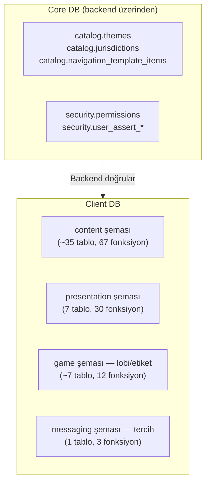
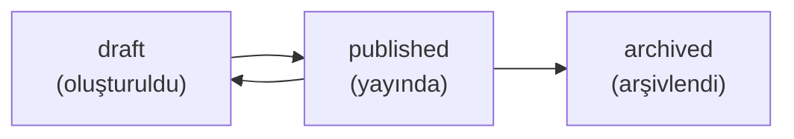

# SPEC_SITE_MANAGEMENT: Site Yönetimi ve İçerik Sistemi

Client bazlı site içeriği ve arayüz yönetimi. Dört ana alan: **Content Management** (CMS, FAQ, Popup, Promosyon, Slide/Banner, Güven Elementleri, SEO), **Presentation** (Navigasyon, Tema, Layout, Sosyal Medya, Site Ayarları, Duyuru Çubukları), **Game Lobby** (Lobi Bölümleri, Oyun Etiketleri) ve **Mesaj Tercihleri**. Tüm veriler Client DB'de tutulur.

> İlgili spesifikasyonlar: [SPEC_PLAYER_AUTH_KYC.md](SPEC_PLAYER_AUTH_KYC.md) (oyuncu kimlik), [SPEC_GAME_GATEWAY.md](SPEC_GAME_GATEWAY.md) (oyun gateway), [SPEC_CALL_CENTER.md](SPEC_CALL_CENTER.md) (destek sistemi)

---

## 1. Kapsam ve Veritabanı Dağılımı

### 1.1 Modül Dağılımı

| # | Modül | Şema | BO | FE | Toplam |
|---|-------|------|----|----|--------|
| 1 | CMS İçerik | `content` | 11 | 2 | 13 |
| 2 | FAQ | `content` | 5 | 2 | 7 |
| 3 | Popup | `content` | 8 | 1 | 9 |
| 4 | Promosyon | `content` | 8 | 2 | 10 |
| 5 | Slide/Banner | `content` | 10 | 1 | 11 |
| 6 | Güven Logoları | `content` | 4 | 1 | 5 |
| 7 | Operatör Lisansları | `content` | 4 | (6 ile ortak) | 4 |
| 8 | SEO Yönlendirme | `content` | 5 | — | 5 |
| 9 | İçerik SEO Meta | `content` | 3 | — | 3 |
| 10 | Navigasyon | `presentation` | 7 | 1 | 8 |
| 11 | Tema | `presentation` | 4 | 1 | 5 |
| 12 | Layout | `presentation` | 4 | 1 | 5 |
| 13 | Sosyal Medya | `presentation` | 4 | — | 4 |
| 14 | Site Ayarları | `presentation` | 3 | — | 3 |
| 15 | Duyuru Çubukları | `presentation` | 4 | 1 | 5 |
| 16 | Lobi Bölümleri | `game` | 8 | 1 | 9 |
| 17 | Oyun Etiketleri | `game` | 3 | (16 ile ortak) | 3 |
| 18 | Mesaj Tercihleri | `messaging` | 1 | 2 | 3 |
| | **Toplam** | | **96** | **16** | **112** |

### 1.2 Veritabanı Dağılımı

| Şema | BO Fonksiyon | FE Fonksiyon | Tablo |
|------|-------------|-------------|-------|
| `content` | 58 | 9 | ~35 |
| `presentation` | 26 | 4 | 7 |
| `game` (lobi/etiket) | 11 | 1 | ~7 |
| `messaging` (tercih) | 1 | 2 | 1 |

> **Cross-DB ilişki:** Core DB'den yetki kontrolü + katalog referansları (theme_id, jurisdiction_id, navigation template) backend tarafından yapılır. Client DB fonksiyonları Core DB'ye doğrudan erişmez.

### 1.3 DB Topolojisi



---

## 2. Durum Makinaları ve İş Akışları

### 2.1 İçerik (CMS) Durum Makinası



| Durum | Açıklama | FE Görünür? |
|-------|----------|-------------|
| `draft` | Yeni oluşturulmuş veya düzenleniyor | Hayır |
| `published` | Yayında, FE'de erişilebilir | Evet |
| `archived` | Arşivlenmiş | Hayır |

### 2.2 Çeviri Deseni (Translation Pattern)

Tüm content modülleri aynı çeviri deseni kullanır:

1. **Ana kayıt** → dile bağımsız veriler (slug, status, dates, config)
2. **Translation tablosu** → her dil için ayrı satır (title, description, body)
3. **CREATE**: Ana kayıt INSERT → çeviriler foreach INSERT
4. **UPDATE**: Ana kayıt UPDATE → çeviriler DELETE + foreach INSERT (replace-all)

```sql
-- Çeviri JSONB format (tüm modüllerde aynı yapı)
p_translations := '[
    {"languageCode": "en", "title": "Hello", "body": "..."},
    {"languageCode": "tr", "title": "Merhaba", "body": "..."}
]'::JSONB;
```

### 2.3 Versiyonlama (content_publish)

`content_publish` çağrıldığında:
1. `contents.version` bir artırılır
2. `contents.status` → `'published'`, `published_at` → `NOW()`
3. Her dildeki çeviri `content_versions` tablosuna snapshot olarak kopyalanır
4. Çevirilerin `status` alanı → `'published'`

### 2.4 Upsert Deseni (NULL id = Create)

Kategori, tip ve benzeri CRUD fonksiyonlarında:
```sql
IF p_id IS NULL THEN
    -- CREATE: INSERT + RETURNING id
ELSE
    -- UPDATE: kayıt kontrolü + UPDATE
END IF;
```

### 2.5 Image/Schedule Replace-All Deseni

Görseller ve zamanlama kayıtları update'de DELETE+INSERT yapılır:
```sql
DELETE FROM child_table WHERE parent_id = p_id;
FOR v_item IN SELECT * FROM jsonb_array_elements(p_items) LOOP
    INSERT INTO child_table ...;
END LOOP;
```

### 2.6 FE Hedefleme Filtre Zinciri

Popup, Slide ve Promosyon modüllerinde FE sorgusu şu filtreleri uygular:
1. `is_active = TRUE` (ve `is_deleted = FALSE` varsa)
2. Tarih aralığı: `start_date <= NOW() AND end_date > NOW()`
3. Ülke dahil/hariç: `country_codes && p_country` / `excluded_country_codes`
4. Segment overlap: `segment_ids && p_segment_ids`
5. Zamanlama: gün + saat aralığı (schedule tablosu)
6. Sıralama: `sort_order` / `priority DESC`
7. Limit: `max_slides` (slide) / priority bazlı (popup)

### 2.7 Soft Delete vs Hard Delete

| Modül | Silme Tipi | Pattern |
|-------|-----------|---------|
| CMS İçerik/Kategori/Tip | Soft | `is_active = FALSE` |
| FAQ Kategori/Öğe | Soft | `is_active = FALSE` |
| Popup | Soft | `is_deleted = TRUE`, `deleted_at`, `is_active = FALSE` |
| Promosyon | Soft | `is_active = FALSE` |
| Slide | Soft | `is_deleted = TRUE`, `deleted_at`, `is_active = FALSE` |
| Trust Logo / Operator License | Soft | `is_active = FALSE` |
| SEO Redirect / Social Link | Soft | `is_active = FALSE` |
| Announcement Bar | Soft | `is_active = FALSE` |
| Lobby Section / Game Label | Soft | `is_active = FALSE` |
| Layout | **Hard** | `DELETE` (geri alma gereksiz) |
| Navigasyon | **Hard** | `DELETE` (`is_locked` kontrolü ile) |

---

## 3. Veri Modeli — Özet

Toplam ~50 tablo. Tablo detayları SQL dosyalarındadır. Aşağıda şema bazlı özet:

### 3.1 `content` Şeması (~35 tablo)

| Grup | Tablolar | Açıklama |
|------|---------|----------|
| CMS | `content_categories`, `content_category_translations`, `content_types`, `content_type_translations`, `contents`, `content_translations`, `content_versions`, `content_attachments` | İçerik yönetimi (slug bazlı, versiyonlu) |
| FAQ | `faq_categories`, `faq_category_translations`, `faq_items`, `faq_item_translations` | Sıkça sorulan sorular |
| Popup | `popup_types`, `popup_type_translations`, `popups`, `popup_translations`, `popup_images`, `popup_schedules` | Hedeflemeli popup sistemi |
| Promosyon | `promotion_types`, `promotion_type_translations`, `promotions`, `promotion_translations`, `promotion_banners`, `promotion_segments`, `promotion_games`, `promotion_display_locations` | Kampanya yönetimi |
| Slide | `slide_placements`, `slide_categories`, `slide_category_translations`, `slides`, `slide_translations`, `slide_images`, `slide_schedules` | Banner/slider sistemi |
| Güven | `trust_logos`, `operator_licenses` | Güven logoları ve lisanslar |
| SEO | `seo_redirects` | URL yönlendirme (+ `content_translations` üzerinde SEO meta alanları) |

### 3.2 `presentation` Şeması (7 tablo)

| Tablo | Açıklama |
|-------|----------|
| `navigation` | Hiyerarşik menü yapısı (`is_locked`, `is_readonly` koruması) |
| `themes` | Tema konfigürasyonu (tek aktif tema — partial unique) |
| `layouts` | Sayfa layout JSONB yapısı (fallback zinciri) |
| `social_links` | Platform UNIQUE, `is_contact` ayrımı |
| `site_settings` | Singleton tablo (tek satır) |
| `announcement_bars` | Zaman pencereli, hedef kitleye özel duyurular |
| `announcement_bar_translations` | Duyuru çevirileri |

### 3.3 `game` Şeması — Lobi/Etiket (~4 tablo)

| Tablo | Açıklama |
|-------|----------|
| `lobby_sections` | Lobi bölümleri (`manual` / `auto_*` tipler) |
| `lobby_section_translations` | Bölüm çevirileri |
| `lobby_section_games` | M:N bölüm ↔ oyun (sadece `manual` tipler) |
| `game_labels` | Oyun etiketleri (new, hot, exclusive — `expires_at` ile) |

### 3.4 `messaging` Şeması — Tercih (1 tablo)

| Tablo | Açıklama |
|-------|----------|
| `player_message_preferences` | Email/SMS/local kanal tercihleri (UPSERT by player_id + channel_type) |

---

## 4. Fonksiyon Spesifikasyonları

### 4.1 CMS İçerik (13 fonksiyon)

#### `content.content_category_upsert`

| Parametre | Tip | Zorunlu | Varsayılan | Açıklama |
|-----------|-----|---------|------------|----------|
| p_id | INTEGER | Hayır | NULL | NULL = create, değer = update |
| p_code | VARCHAR(50) | Create'de evet | NULL | Kategori kodu |
| p_icon | VARCHAR(100) | Hayır | NULL | İkon |
| p_sort_order | INTEGER | Hayır | `0` | Sıralama |
| p_user_id | INTEGER | Evet | NULL | İşlemi yapan |
| p_translations | JSONB | Hayır | NULL | `[{languageCode, name, description}]` |

**Dönüş:** `INTEGER` (kategori ID)

**İş Kuralları:**
1. `p_id = NULL` → INSERT (create), aksi → UPDATE.
2. Create'de `p_code` zorunlu.
3. Çeviriler DELETE+INSERT pattern ile güncellenir.

**Hata Kodları:**

| Hata Key | ERRCODE | Koşul |
|----------|---------|-------|
| `error.content.user-id-required` | P0400 | p_user_id NULL |
| `error.content.category-not-found` | P0404 | Update'de ID bulunamadı |
| `error.content.category-code-required` | P0400 | Create'de kod eksik |

---

#### `content.content_category_delete`

`(p_id INTEGER, p_user_id INTEGER) → VOID`

**Kurallar:** Soft delete. Aktif content_type'lar varsa engellenir.

**Hatalar:** `error.content.category-id-required` (P0400), `error.content.category-not-found` (P0404), `error.content.category-has-active-types` (P0409)

---

#### `content.content_category_list`

`(p_language_code CHAR(2) DEFAULT 'en') → JSONB`

**Dönüş:** `[{id, code, icon, sortOrder, isActive, name, description}]` — Sadece aktifler, `sort_order, id` sıralı.

---

#### `content.content_type_upsert`

| Parametre | Tip | Zorunlu | Varsayılan | Açıklama |
|-----------|-----|---------|------------|----------|
| p_id | INTEGER | Hayır | NULL | Upsert pattern |
| p_category_id | INTEGER | Hayır | NULL | Kategori |
| p_code | VARCHAR(50) | Create'de evet | NULL | Tip kodu |
| p_template_key | VARCHAR(100) | Hayır | NULL | Şablon anahtarı |
| p_icon | VARCHAR(100) | Hayır | NULL | İkon |
| p_requires_acceptance | BOOLEAN | Hayır | `FALSE` | Kabul gerekli mi? |
| p_show_in_footer | BOOLEAN | Hayır | `FALSE` | Footer'da göster |
| p_show_in_menu | BOOLEAN | Hayır | `FALSE` | Menüde göster |
| p_sort_order | INTEGER | Hayır | `0` | Sıralama |
| p_user_id | INTEGER | Evet | NULL | İşlemi yapan |
| p_translations | JSONB | Hayır | NULL | `[{languageCode, name, description}]` |

**Dönüş:** `INTEGER`

**Hatalar:** `error.content.user-id-required` (P0400), `error.content.type-not-found` (P0404), `error.content.type-code-required` (P0400)

---

#### `content.content_type_delete`

`(p_id INTEGER, p_user_id INTEGER) → VOID`

**Kurallar:** Soft delete. Aktif içerikler varsa engellenir.

**Hatalar:** `error.content.type-id-required` (P0400), `error.content.type-not-found` (P0404), `error.content.type-has-active-contents` (P0409)

---

#### `content.content_type_list`

`(p_category_id INTEGER DEFAULT NULL, p_language_code CHAR(2) DEFAULT 'en') → JSONB`

**Dönüş:** `[{id, categoryId, code, templateKey, icon, requiresAcceptance, showInFooter, showInMenu, sortOrder, isActive, name, description}]`

---

#### `content.content_create`

| Parametre | Tip | Zorunlu | Varsayılan | Açıklama |
|-----------|-----|---------|------------|----------|
| p_content_type_id | INTEGER | Evet | — | İçerik tipi |
| p_slug | VARCHAR(255) | Evet | — | SEO-friendly URL (client UNIQUE) |
| p_featured_image_url | VARCHAR(500) | Hayır | NULL | Öne çıkan görsel |
| p_translations | JSONB | Evet | — | `[{languageCode, title, subtitle, summary, body, metaTitle, metaDescription, metaKeywords}]` |
| p_attachments | JSONB | Hayır | NULL | `[{fileName, filePath, fileType, fileSize, altText, caption}]` |
| p_user_id | INTEGER | Evet | — | İşlemi yapan |

**Dönüş:** `INTEGER` (yeni içerik ID)

**İş Kuralları:**
1. `status = 'draft'`, `version = 1` ile oluşturulur.
2. `p_translations` zorunlu ve boş olamaz.
3. Ekler (attachments) array indeksine göre `sort_order` alır.

**Hatalar:** `error.content.type-id-required` (P0400), `error.content.slug-required` (P0400), `error.content.user-id-required` (P0400), `error.content.translations-required` (P0400)

---

#### `content.content_update`

`(p_id INTEGER, p_slug VARCHAR(255) DEFAULT NULL, p_featured_image_url VARCHAR(500) DEFAULT NULL, p_translations JSONB DEFAULT NULL, p_attachments JSONB DEFAULT NULL, p_user_id INTEGER) → VOID`

**İş Kuralları:**
1. Aktif kayıt olmalı (`is_active = TRUE`).
2. Çeviriler verilmişse DELETE+INSERT; çeviriler `status = 'draft'`'a döner.
3. Ekler verilmişse DELETE+INSERT (boş dizi tüm ekleri siler).

**Hatalar:** `error.content.id-required` (P0400), `error.content.user-id-required` (P0400), `error.content.not-found` (P0404)

---

#### `content.content_get`

`(p_id INTEGER) → JSONB`

**Dönüş Yapısı:**

| Alan | Tip | Açıklama |
|------|-----|----------|
| id, contentTypeId, slug, featuredImageUrl | — | Ana bilgiler |
| version, status, publishedAt, expiresAt | — | Durum bilgileri |
| translations | JSONB[] | `[{id, languageCode, title, subtitle, summary, body, metaTitle, metaDescription, metaKeywords, status}]` |
| attachments | JSONB[] | `[{id, fileName, filePath, fileType, fileSize, altText, caption, sortOrder, isFeatured}]` |
| versions | JSONB[] | Son 10 versiyon `[{id, languageCode, version, title, changeNote, createdAt, createdBy}]` |

**Hatalar:** `error.content.id-required` (P0400), `error.content.not-found` (P0404)

---

#### `content.content_list`

`(p_content_type_id INTEGER DEFAULT NULL, p_status VARCHAR(20) DEFAULT NULL, p_search TEXT DEFAULT NULL, p_language_code CHAR(2) DEFAULT 'en', p_offset INTEGER DEFAULT 0, p_limit INTEGER DEFAULT 20) → JSONB`

**Dönüş:** `{items: [{id, contentTypeId, slug, featuredImageUrl, version, status, publishedAt, title, summary, createdAt, updatedAt}], totalCount}`

**İş Kuralları:** `p_search` → slug veya title ILIKE. `p_status` → draft/published/archived. Sıralama: `created_at DESC`.

---

#### `content.content_publish`

`(p_id INTEGER, p_user_id INTEGER) → VOID`

**İş Kuralları:**
1. `status = 'published'`, `published_at = NOW()`.
2. `version` bir artırılır.
3. Tüm dillerdeki çeviriler `content_versions`'a snapshot olarak kopyalanır.
4. Çevirilerin `status` → `'published'`.

**Hatalar:** `error.content.id-required` (P0400), `error.content.user-id-required` (P0400), `error.content.not-found` (P0404)

---

#### `content.public_content_get` (FE)

`(p_slug VARCHAR(255), p_language_code CHAR(2)) → JSONB`

**Dönüş:** `{title, subtitle, summary, body, metaTitle, metaDescription, featuredImageUrl, publishedAt, contentType, requiresAcceptance, attachments: [{fileName, filePath, fileType, altText, caption}]}`

**İş Kuralları:** Sadece `published` + `is_active` + expire kontrolü. Hata fırlatmaz — bulunamazsa NULL döner.

---

#### `content.public_content_list` (FE)

`(p_type_code VARCHAR(50), p_language_code CHAR(2), p_offset INTEGER DEFAULT 0, p_limit INTEGER DEFAULT 20) → JSONB`

**Dönüş:** `{items: [{slug, title, subtitle, summary, featuredImageUrl, publishedAt}], totalCount}`

---

### 4.2 FAQ (7 fonksiyon)

#### `content.faq_category_upsert`

`(p_id INTEGER DEFAULT NULL, p_code VARCHAR(50) DEFAULT NULL, p_icon VARCHAR(100) DEFAULT NULL, p_sort_order INTEGER DEFAULT 0, p_user_id INTEGER DEFAULT NULL, p_translations JSONB DEFAULT NULL) → INTEGER`

**Kurallar:** Upsert pattern. Çeviriler: `[{languageCode, name, description}]`.

**Hatalar:** `error.faq.user-id-required` (P0400), `error.faq.category-not-found` (P0404), `error.faq.category-code-required` (P0400)

---

#### `content.faq_category_delete`

`(p_id INTEGER, p_user_id INTEGER) → VOID`

**Kurallar:** Soft delete. Aktif öğeler varsa engellenir.

**Hatalar:** `error.faq.category-id-required` (P0400), `error.faq.category-not-found` (P0404), `error.faq.category-has-active-items` (P0409)

---

#### `content.faq_category_list`

`(p_language_code CHAR(2) DEFAULT 'en') → JSONB`

**Dönüş:** `[{id, code, icon, sortOrder, name, description, itemCount}]` — `itemCount` = aktif FAQ öğe sayısı.

---

#### `content.faq_item_upsert`

`(p_id INTEGER DEFAULT NULL, p_category_id INTEGER DEFAULT NULL, p_sort_order INTEGER DEFAULT 0, p_is_featured BOOLEAN DEFAULT FALSE, p_user_id INTEGER DEFAULT NULL, p_translations JSONB DEFAULT NULL) → INTEGER`

**Kurallar:** Upsert pattern. Çeviriler: `[{languageCode, question, answer, status}]`. `status` varsayılan `'published'`.

**Hatalar:** `error.faq.user-id-required` (P0400), `error.faq.item-not-found` (P0404)

---

#### `content.faq_item_delete`

`(p_id INTEGER, p_user_id INTEGER) → VOID` — Soft delete.

**Hatalar:** `error.faq.item-id-required` (P0400), `error.faq.item-not-found` (P0404)

---

#### `content.public_faq_list` (FE)

`(p_category_code VARCHAR(50) DEFAULT NULL, p_language_code CHAR(2) DEFAULT 'en', p_is_featured BOOLEAN DEFAULT NULL, p_search TEXT DEFAULT NULL, p_offset INTEGER DEFAULT 0, p_limit INTEGER DEFAULT 20) → JSONB`

**Dönüş:** `{items: [{id, question, answer, categoryCode, isFeatured, viewCount, helpfulCount, notHelpfulCount}], totalCount}`

**İş Kuralları:** `p_search` → question VE answer üzerinde ILIKE. Sadece `status = 'published'` çeviriler.

---

#### `content.public_faq_get` (FE)

`(p_id INTEGER, p_language_code CHAR(2) DEFAULT 'en') → JSONB`

**Dönüş:** `{id, question, answer, categoryCode, categoryName, isFeatured, viewCount, helpfulCount, notHelpfulCount}`

**İş Kuralları:** Her çağrıda `view_count` artırılır (yan etki). Bulunamazsa NULL döner.

---

### 4.3 Popup (9 fonksiyon)

#### `content.popup_type_upsert`

`(p_id INTEGER DEFAULT NULL, p_code VARCHAR(50) DEFAULT NULL, p_icon VARCHAR(50) DEFAULT NULL, p_default_width INTEGER DEFAULT NULL, p_default_height INTEGER DEFAULT NULL, p_has_overlay BOOLEAN DEFAULT TRUE, p_can_close BOOLEAN DEFAULT TRUE, p_close_on_overlay_click BOOLEAN DEFAULT TRUE, p_sort_order INTEGER DEFAULT 0, p_user_id INTEGER DEFAULT NULL, p_translations JSONB DEFAULT NULL) → INTEGER`

**Hatalar:** `error.popup.user-id-required` (P0400), `error.popup.type-not-found` (P0404), `error.popup.type-code-required` (P0400)

---

#### `content.popup_type_list`

`(p_language_code CHAR(2) DEFAULT 'en') → JSONB`

**Dönüş:** `[{id, code, icon, defaultWidth, defaultHeight, hasOverlay, canClose, closeOnOverlayClick, sortOrder, name, description}]`

---

#### `content.popup_create`

| Parametre | Tip | Zorunlu | Varsayılan | Açıklama |
|-----------|-----|---------|------------|----------|
| p_popup_type_id | INTEGER | Evet | — | Popup tipi |
| p_code | VARCHAR(50) | Hayır | NULL | Benzersiz kod |
| p_config | JSONB | Hayır | NULL | Yapılandırma (aşağıda) |
| p_targeting | JSONB | Hayır | NULL | Hedefleme (aşağıda) |
| p_translations | JSONB | Hayır | NULL | Çeviriler |
| p_images | JSONB | Hayır | NULL | Görseller |
| p_schedule | JSONB | Hayır | NULL | Zamanlama |
| p_user_id | INTEGER | Evet | NULL | İşlemi yapan |

**`p_config` yapısı:** `{displayDuration, autoClose, width, height, triggerType, triggerDelay, triggerScrollPercent, triggerExitIntent, frequencyType, frequencyCap, frequencyHours, linkUrl, linkTarget, startDate, endDate, priority}`

**`p_targeting` yapısı:** `{segmentIds[], countryCodes[], excludedCountryCodes[], pageUrls[], excludedPageUrls[]}`

**`p_translations`:** `[{languageCode, title, subtitle, bodyText, ctaText, ctaSecondaryText, closeButtonText}]`

**`p_images`:** `[{languageCode, deviceType, imagePosition, imageUrl, imageUrl2x, imageUrlWebp, width, height, fileSize, objectFit, borderRadius}]`

**`p_schedule`:** `{daySunday..daySaturday, startTime, endTime, timezone, priority}`

**Tetikleme tipleri:** `immediate`, `delay`, `scroll`, `exit_intent`, `click`, `login`, `first_visit`, `returning_visit`

**Frekans tipleri:** `always`, `once_per_session`, `once_per_day`, `once_per_week`, `once_ever`, `custom`

**Dönüş:** `INTEGER`

**Hatalar:** `error.popup.type-id-required` (P0400), `error.popup.user-id-required` (P0400)

---

#### `content.popup_update`

`(p_id INTEGER, p_config JSONB DEFAULT NULL, p_targeting JSONB DEFAULT NULL, p_translations JSONB DEFAULT NULL, p_images JSONB DEFAULT NULL, p_schedule JSONB DEFAULT NULL, p_user_id INTEGER DEFAULT NULL) → VOID`

**Kurallar:** `is_deleted = FALSE` kontrolü. Config/targeting → COALESCE partial update. Translations/images/schedule → DELETE+INSERT.

**Hatalar:** `error.popup.id-required` (P0400), `error.popup.user-id-required` (P0400), `error.popup.not-found` (P0404)

---

#### `content.popup_get`

`(p_id INTEGER) → JSONB`

**Dönüş:** Tam popup detayı — config, targeting, translations, images, schedule dahil.

**Hatalar:** `error.popup.id-required` (P0400), `error.popup.not-found` (P0404)

---

#### `content.popup_list`

`(p_popup_type_id INTEGER DEFAULT NULL, p_is_active BOOLEAN DEFAULT NULL, p_language_code CHAR(2) DEFAULT 'en', p_offset INTEGER DEFAULT 0, p_limit INTEGER DEFAULT 20) → JSONB`

**Dönüş:** `{items: [{id, popupTypeId, code, triggerType, frequencyType, startDate, endDate, priority, isActive, title, createdAt}], totalCount}`

---

#### `content.popup_delete`

`(p_id INTEGER, p_user_id INTEGER) → VOID`

**Kurallar:** `is_deleted = TRUE`, `deleted_at = NOW()`, `is_active = FALSE`.

**Hatalar:** `error.popup.id-required` (P0400), `error.popup.not-found` (P0404)

---

#### `content.popup_toggle_active`

`(p_id INTEGER, p_user_id INTEGER) → BOOLEAN`

**Kurallar:** `is_active` flip. Sadece `is_deleted = FALSE`. Yeni değeri döndürür.

**Hatalar:** `error.popup.id-required` (P0400), `error.popup.not-found` (P0404)

---

#### `content.public_popup_list` (FE)

`(p_page_url TEXT DEFAULT NULL, p_country_code CHAR(2) DEFAULT NULL, p_segment_ids INTEGER[] DEFAULT NULL, p_language_code CHAR(2) DEFAULT 'en', p_device_type VARCHAR(20) DEFAULT NULL) → JSONB`

**Dönüş:** Popup dizisi — trigger/frequency/display config + çeviri + görseller.

**İş Kuralları:**
1. Ülke dahil/hariç, segment overlap, sayfa URL eşleşme.
2. Schedule gün+saat kontrolü.
3. Görseller `language_code` + `device_type` (fallback: `desktop`) ile filtrelenir.
4. `priority DESC` sıralı. Hata fırlatmaz.

---

### 4.4 Promosyon (10 fonksiyon)

#### `content.promotion_type_upsert`

`(p_id INTEGER DEFAULT NULL, p_code VARCHAR(50) DEFAULT NULL, p_icon VARCHAR(50) DEFAULT NULL, p_color VARCHAR(20) DEFAULT NULL, p_badge_text VARCHAR(30) DEFAULT NULL, p_sort_order INTEGER DEFAULT 0, p_user_id INTEGER DEFAULT NULL, p_translations JSONB DEFAULT NULL) → INTEGER`

**Hatalar:** `error.promotion.user-id-required` (P0400), `error.promotion.type-not-found` (P0404), `error.promotion.type-code-required` (P0400)

---

#### `content.promotion_type_list`

`(p_language_code CHAR(2) DEFAULT 'en') → JSONB`

**Dönüş:** `[{id, code, icon, color, badgeText, sortOrder, name, description}]`

---

#### `content.promotion_create`

| Parametre | Tip | Zorunlu | Varsayılan | Açıklama |
|-----------|-----|---------|------------|----------|
| p_code | VARCHAR(50) | Evet | — | Promosyon kodu |
| p_promotion_type_id | INTEGER | Evet | — | Tip |
| p_bonus_id | INTEGER | Hayır | NULL | Bağlı bonus |
| p_min_deposit | NUMERIC(18,2) | Hayır | NULL | Min depozit |
| p_max_deposit | NUMERIC(18,2) | Hayır | NULL | Max depozit |
| p_start_date | TIMESTAMP | Hayır | NULL | Başlangıç |
| p_end_date | TIMESTAMP | Hayır | NULL | Bitiş |
| p_sort_order | INTEGER | Hayır | `0` | Sıralama |
| p_is_featured | BOOLEAN | Hayır | `FALSE` | Öne çıkan |
| p_is_new_members_only | BOOLEAN | Hayır | `FALSE` | Yeni üyelere özel |
| p_translations | JSONB | Hayır | NULL | `[{languageCode, title, subtitle, summary, description, termsConditions, ctaText, ctaUrl, metaTitle, metaDescription}]` |
| p_banners | JSONB | Hayır | NULL | `[{languageCode, deviceType, imageUrl, altText, width, height}]` |
| p_segments | JSONB | Hayır | NULL | `[{segmentType, segmentValue, isInclude}]` |
| p_games | JSONB | Hayır | NULL | `[{filterType, filterValue, isInclude}]` |
| p_display_locations | JSONB | Hayır | NULL | `[{locationCode, sortOrder}]` |
| p_user_id | INTEGER | Evet | NULL | İşlemi yapan |

**Dönüş:** `INTEGER`

**Hatalar:** `error.promotion.code-required` (P0400), `error.promotion.type-id-required` (P0400), `error.promotion.user-id-required` (P0400)

---

#### `content.promotion_update`

`(p_id INTEGER, p_bonus_id/p_min_deposit/.../p_display_locations, p_user_id INTEGER) → VOID`

**Kurallar:** Ana kayıt COALESCE. Tüm alt tablolar (translations, banners, segments, games, display_locations) non-null ise DELETE+INSERT.

**Hatalar:** `error.promotion.id-required` (P0400), `error.promotion.user-id-required` (P0400), `error.promotion.not-found` (P0404)

---

#### `content.promotion_get`

`(p_id INTEGER) → JSONB`

**Dönüş:** Tam promosyon detayı — translations, banners, segments, games, displayLocations dahil.

**Hatalar:** `error.promotion.id-required` (P0400), `error.promotion.not-found` (P0404)

---

#### `content.promotion_list`

`(p_promotion_type_id INTEGER DEFAULT NULL, p_is_active BOOLEAN DEFAULT NULL, p_is_featured BOOLEAN DEFAULT NULL, p_language_code CHAR(2) DEFAULT 'en', p_offset INTEGER DEFAULT 0, p_limit INTEGER DEFAULT 20) → JSONB`

**Dönüş:** `{items: [{id, code, promotionTypeId, bonusId, startDate, endDate, sortOrder, isFeatured, isNewMembersOnly, isActive, title, summary, createdAt}], totalCount}`

---

#### `content.promotion_delete`

`(p_id INTEGER, p_user_id INTEGER) → VOID` — Soft delete (`is_active = FALSE`).

**Hatalar:** `error.promotion.id-required` (P0400), `error.promotion.not-found` (P0404)

---

#### `content.promotion_toggle_featured`

`(p_id INTEGER, p_user_id INTEGER) → BOOLEAN` — `is_featured` flip. Yeni değeri döndürür.

**Hatalar:** `error.promotion.id-required` (P0400), `error.promotion.not-found` (P0404)

---

#### `content.public_promotion_list` (FE)

`(p_language_code CHAR(2) DEFAULT 'en', p_type_code VARCHAR(50) DEFAULT NULL, p_segment_ids INTEGER[] DEFAULT NULL, p_offset INTEGER DEFAULT 0, p_limit INTEGER DEFAULT 20) → JSONB`

**Dönüş:** `{items: [{id, code, typeCode, typeIcon, typeColor, bonusId, minDeposit, maxDeposit, startDate, endDate, isFeatured, isNewMembersOnly, title, subtitle, summary, ctaText, ctaUrl, banners: [...]}], totalCount}`

**İş Kuralları:** `is_featured DESC, sort_order` sıralı. Tarih aralığı filtresi. Bannerlar dil bazlı.

---

#### `content.public_promotion_get` (FE)

`(p_id INTEGER, p_language_code CHAR(2) DEFAULT 'en') → JSONB`

**Dönüş:** Liste + description, termsConditions, metaTitle, metaDescription, typeBadgeText eklenir.

---

### 4.5 Slide/Banner (11 fonksiyon)

#### `content.slide_placement_upsert`

`(p_id INTEGER DEFAULT NULL, p_code VARCHAR(50) DEFAULT NULL, p_name VARCHAR(100) DEFAULT NULL, p_description VARCHAR(500) DEFAULT NULL, p_max_slides INTEGER DEFAULT 5, p_width INTEGER DEFAULT NULL, p_height INTEGER DEFAULT NULL, p_aspect_ratio VARCHAR(10) DEFAULT NULL, p_user_id INTEGER DEFAULT NULL) → INTEGER`

**Kurallar:** Çevirisi yok — direkt alan. `p_max_slides` varsayılan 5.

**Hatalar:** `error.slide.user-id-required` (P0400), `error.slide.placement-not-found` (P0404), `error.slide.placement-code-required` (P0400), `error.slide.placement-name-required` (P0400)

---

#### `content.slide_placement_list`

`() → JSONB`

**Dönüş:** `[{id, code, name, description, maxSlides, width, height, aspectRatio, isActive, slideCount}]` — `slideCount` = aktif+silinmemiş slide sayısı.

---

#### `content.slide_category_upsert`

`(p_id INTEGER DEFAULT NULL, p_code VARCHAR(50) DEFAULT NULL, p_icon VARCHAR(50) DEFAULT NULL, p_color VARCHAR(20) DEFAULT NULL, p_sort_order INTEGER DEFAULT 0, p_user_id INTEGER DEFAULT NULL, p_translations JSONB DEFAULT NULL) → INTEGER`

**Hatalar:** `error.slide.user-id-required` (P0400), `error.slide.category-not-found` (P0404), `error.slide.category-code-required` (P0400)

---

#### `content.slide_category_list`

`(p_language_code CHAR(2) DEFAULT 'en') → JSONB`

**Dönüş:** `[{id, code, icon, color, sortOrder, name, description}]`

---

#### `content.slide_create`

| Parametre | Tip | Açıklama |
|-----------|-----|----------|
| p_placement_id | INTEGER | Placement (zorunlu) |
| p_category_id | INTEGER | Kategori (opsiyonel) |
| p_code | VARCHAR(50) | Kod |
| p_config | JSONB | `{sortOrder, priority, linkUrl, linkTarget, linkType, linkReference, startDate, endDate, displayDuration, animationType}` |
| p_targeting | JSONB | `{segmentIds[], countryCodes[], excludedCountryCodes[]}` |
| p_translations | JSONB | `[{languageCode, title, subtitle, description, ctaText, ctaSecondaryText, altText}]` |
| p_images | JSONB | `[{languageCode, deviceType, imageUrl, imageUrl2x, imageUrlWebp, width, height, fileSize, fallbackColor}]` |
| p_schedule | JSONB | `{daySunday..daySaturday, startTime, endTime, timezone, priority}` |
| p_user_id | INTEGER | İşlemi yapan |

**Dönüş:** `INTEGER`

**Hatalar:** `error.slide.placement-id-required` (P0400), `error.slide.user-id-required` (P0400)

---

#### `content.slide_update`

`(p_id INTEGER, p_config, p_targeting, p_translations, p_images, p_schedule, p_user_id) → VOID`

**Kurallar:** Config/targeting → COALESCE. Diğerleri → DELETE+INSERT. `is_deleted = FALSE` kontrolü.

**Hatalar:** `error.slide.id-required` (P0400), `error.slide.user-id-required` (P0400), `error.slide.not-found` (P0404)

---

#### `content.slide_get`

`(p_id INTEGER) → JSONB` — Tam detay: config, targeting, translations, images, schedule.

**Hatalar:** `error.slide.id-required` (P0400), `error.slide.not-found` (P0404)

---

#### `content.slide_list`

`(p_placement_id INTEGER DEFAULT NULL, p_category_id INTEGER DEFAULT NULL, p_is_active BOOLEAN DEFAULT NULL, p_language_code CHAR(2) DEFAULT 'en', p_offset INTEGER DEFAULT 0, p_limit INTEGER DEFAULT 20) → JSONB`

**Dönüş:** `{items: [{id, placementId, categoryId, code, sortOrder, priority, linkType, startDate, endDate, isActive, title, createdAt}], totalCount}`

---

#### `content.slide_delete`

`(p_id INTEGER, p_user_id INTEGER) → VOID` — `is_deleted = TRUE`, `deleted_at`, `is_active = FALSE`.

**Hatalar:** `error.slide.id-required` (P0400), `error.slide.not-found` (P0404)

---

#### `content.slide_reorder`

`(p_placement_id INTEGER, p_slide_ids INTEGER[], p_user_id INTEGER) → VOID`

**Kurallar:** Array indeksi → `sort_order` (0-based). Sadece eşleşen + silinmemiş slide'lar güncellenir.

**Hatalar:** `error.slide.placement-id-required` (P0400), `error.slide.slide-ids-required` (P0400)

---

#### `content.public_slide_list` (FE)

`(p_placement_code VARCHAR(50), p_language_code CHAR(2) DEFAULT 'en', p_country_code CHAR(2) DEFAULT NULL, p_segment_ids INTEGER[] DEFAULT NULL, p_device_type VARCHAR(20) DEFAULT NULL) → JSONB`

**Dönüş:** Slide dizisi — `{id, code, linkUrl, linkTarget, linkType, linkReference, displayDuration, animationType, title, subtitle, description, ctaText, ctaSecondaryText, altText, images: [...]}`

**İş Kuralları:** `placement.max_slides` ile LIMIT. Ülke/segment/schedule filtreleri. Boş placement → `'[]'` döner.

---

### 4.6 Güven Logoları (5 fonksiyon)

#### `content.upsert_trust_logo`

`(p_code VARCHAR(100), p_logo_type VARCHAR(50), p_name VARCHAR(200), p_logo_url VARCHAR(500), p_link_url VARCHAR(500) DEFAULT NULL, p_display_order SMALLINT DEFAULT 0, p_country_codes VARCHAR(2)[] DEFAULT '{}', p_user_id INTEGER DEFAULT NULL) → BIGINT`

**Kurallar:** UPSERT ON CONFLICT (code). `logo_type` değerleri: `rg_org`, `payment`, `testing_cert`, `ssl_badge`, `award`, `partner_logo`.

**Hatalar:** `error.trust-logo.code-required` (P0400), `error.trust-logo.type-required` (P0400), `error.trust-logo.name-required` (P0400), `error.trust-logo.logo-url-required` (P0400)

---

#### `content.list_trust_logos`

`(p_logo_type VARCHAR(50) DEFAULT NULL, p_include_inactive BOOLEAN DEFAULT FALSE) → JSONB`

**Dönüş:** `[{id, code, logoType, name, logoUrl, linkUrl, displayOrder, countryCodes, isActive, createdAt, updatedAt}]`

---

#### `content.delete_trust_logo`

`(p_id BIGINT, p_user_id INTEGER DEFAULT NULL) → VOID` — Soft delete.

**Hatalar:** `error.trust-logo.id-required` (P0400), `error.trust-logo.not-found` (P0404)

---

#### `content.reorder_trust_logos`

`(p_items JSONB, p_user_id INTEGER DEFAULT NULL) → VOID`

**Kurallar:** `p_items: [{id, displayOrder}]`. Olmayan ID'ler sessizce atlanır.

**Hatalar:** `error.trust-logo.items-required` (P0400)

---

#### `content.get_public_trust_elements` (FE)

`(p_player_country VARCHAR(2) DEFAULT NULL) → JSONB`

**Dönüş:** `{licenses: [...], rgOrgs: [...], payments: [...], certs: [...], awards: [...], partners: [...]}`

**İş Kuralları:** `country_codes = '{}'` → tüm ülkelere göster. Lisanslar `expiry_date > CURRENT_DATE` kontrolü. Backend jurisdiction bilgisini Core DB'den zenginleştirir.

---

### 4.7 Operatör Lisansları (4 fonksiyon)

#### `content.upsert_operator_license`

`(p_jurisdiction_id INT, p_license_number VARCHAR(200), p_verification_url VARCHAR(500) DEFAULT NULL, p_logo_url VARCHAR(500) DEFAULT NULL, p_country_codes VARCHAR(2)[] DEFAULT '{}', p_issued_date DATE DEFAULT NULL, p_expiry_date DATE DEFAULT NULL, p_display_order SMALLINT DEFAULT 0, p_user_id INTEGER DEFAULT NULL) → BIGINT`

**Kurallar:** UPSERT ON CONFLICT (`jurisdiction_id + license_number`). `expiry_date > issued_date` kontrolü. `jurisdiction_id` backend'de Core DB'den doğrulanır.

**Hatalar:** `error.operator-license.jurisdiction-required` (P0400), `error.operator-license.license-number-required` (P0400), `error.operator-license.expiry-before-issued` (P0400)

---

#### `content.list_operator_licenses`

`(p_include_inactive BOOLEAN DEFAULT FALSE) → JSONB`

**Dönüş:** `[{id, jurisdictionId, licenseNumber, verificationUrl, logoUrl, countryCodes, issuedDate, expiryDate, displayOrder, isActive, createdAt, updatedAt}]`

---

#### `content.get_operator_license`

`(p_id BIGINT) → JSONB` — Pasif kayıtları da döndürür.

**Hatalar:** `error.operator-license.id-required` (P0400), `error.operator-license.not-found` (P0404)

---

#### `content.delete_operator_license`

`(p_id BIGINT, p_user_id INTEGER DEFAULT NULL) → VOID` — Soft delete.

**Hatalar:** `error.operator-license.id-required` (P0400), `error.operator-license.not-found` (P0404)

---

### 4.8 SEO Yönlendirme (5 fonksiyon)

#### `content.upsert_seo_redirect`

`(p_from_slug VARCHAR(500), p_to_url VARCHAR(500), p_redirect_type SMALLINT DEFAULT 301, p_user_id INTEGER DEFAULT NULL) → BIGINT`

**İş Kuralları:**
1. UPSERT ON CONFLICT (`from_slug`).
2. `redirect_type` sadece 301 veya 302 olabilir.
3. Döngüsel redirect koruması: `from_slug ≠ to_url` (case-insensitive, trimmed).
4. Conflict'te pasif kaydı yeniden aktifleştirir.

**Hatalar:** `error.seo-redirect.from-slug-required` (P0400), `error.seo-redirect.to-url-required` (P0400), `error.seo-redirect.invalid-redirect-type` (P0400), `error.seo-redirect.circular-redirect` (P0400)

---

#### `content.list_seo_redirects`

`(p_search VARCHAR(200) DEFAULT NULL, p_include_inactive BOOLEAN DEFAULT FALSE, p_limit INTEGER DEFAULT 50, p_offset INTEGER DEFAULT 0) → JSONB`

**Dönüş:** `{total, items: [{id, fromSlug, toUrl, redirectType, isActive, createdAt, updatedAt}]}`

---

#### `content.get_seo_redirect_by_slug`

`(p_from_slug VARCHAR(500)) → JSONB`

**Dönüş:** `{toUrl, redirectType}` veya NULL. **Middleware lookup** — her HTTP isteğinde çağrılır. Hata fırlatmaz.

---

#### `content.delete_seo_redirect`

`(p_id BIGINT, p_user_id INTEGER DEFAULT NULL) → VOID` — Soft delete.

**Hatalar:** `error.seo-redirect.id-required` (P0400), `error.seo-redirect.not-found` (P0404)

---

#### `content.bulk_import_seo_redirects`

`(p_items JSONB, p_user_id INTEGER DEFAULT NULL) → JSONB`

**Dönüş:** `{inserted, updated, skipped}`

**İş Kuralları:**
1. `p_items: [{fromSlug, toUrl, redirectType}]`.
2. Geçersiz/eksik alanlar sessizce atlanır (`skipped` sayacı).
3. UPSERT per item; conflict'te yeniden aktifleştirir.
4. `xmax = 0` ile INSERT vs UPDATE ayrımı yapılır.
5. Kısmi başarı geçerlidir (per-item hata yoktur).

**Hatalar:** `error.seo-redirect.items-required` (P0400)

---

### 4.9 İçerik SEO Meta (3 fonksiyon)

#### `content.get_content_seo_meta`

`(p_content_id INTEGER, p_language_code CHAR(2)) → JSONB`

**Dönüş:** `{contentId, languageCode, title, metaTitle, metaDescription, metaKeywords, ogTitle, ogDescription, ogImageUrl, twitterCard, twitterTitle, twitterDescription, twitterImageUrl, robotsDirective, canonicalUrl, slug}`

**Hatalar:** `error.content-seo-meta.content-id-required` (P0400), `error.content-seo-meta.language-required` (P0400), `error.content-seo-meta.translation-not-found` (P0404)

---

#### `content.list_contents_seo_status`

`(p_language_code CHAR(2) DEFAULT NULL, p_limit INTEGER DEFAULT 50, p_offset INTEGER DEFAULT 0) → JSONB`

**Dönüş:** `{total, items: [{contentId, languageCode, slug, title, contentStatus, hasMetaTitle, hasMetaDescription, hasOgTitle, hasOgImage, hasTwitterCard, hasCanonicalUrl, robotsDirective, seoScore}]}`

**SEO Puanı (0-100):** metaTitle=20, metaDesc=20, ogTitle=15, ogImage=15, twitterCard=15, canonicalUrl=15.

---

#### `content.update_content_seo_meta`

| Parametre | Tip | Zorunlu | Varsayılan | Açıklama |
|-----------|-----|---------|------------|----------|
| p_content_id | INTEGER | Evet | — | İçerik ID |
| p_language_code | CHAR(2) | Evet | — | Dil kodu |
| p_meta_title | VARCHAR(255) | Hayır | NULL | Meta başlık |
| p_meta_description | VARCHAR(500) | Hayır | NULL | Meta açıklama |
| p_meta_keywords | VARCHAR(500) | Hayır | NULL | Anahtar kelimeler |
| p_og_title | VARCHAR(200) | Hayır | NULL | OG başlık |
| p_og_description | VARCHAR(500) | Hayır | NULL | OG açıklama |
| p_og_image_url | VARCHAR(500) | Hayır | NULL | OG görsel |
| p_twitter_card | VARCHAR(30) | Hayır | NULL | Twitter card tipi |
| p_twitter_title | VARCHAR(200) | Hayır | NULL | Twitter başlık |
| p_twitter_description | VARCHAR(500) | Hayır | NULL | Twitter açıklama |
| p_twitter_image_url | VARCHAR(500) | Hayır | NULL | Twitter görsel |
| p_robots_directive | VARCHAR(100) | Hayır | NULL | Robots directive |
| p_canonical_url | VARCHAR(500) | Hayır | NULL | Canonical URL |
| p_user_id | INTEGER | Hayır | NULL | İşlemi yapan |

**Dönüş:** `VOID`

**İş Kuralları:** COALESCE — NULL parametreler mevcut değeri korur. `p_twitter_card` geçerli değerler: `summary`, `summary_large_image`, `app`, `player`.

**Hatalar:** `error.content-seo-meta.content-id-required` (P0400), `error.content-seo-meta.language-required` (P0400), `error.content-seo-meta.invalid-twitter-card` (P0400), `error.content-seo-meta.translation-not-found` (P0404)

---

### 4.10 Navigasyon (8 fonksiyon)

#### `presentation.navigation_create`

| Parametre | Tip | Zorunlu | Varsayılan | Açıklama |
|-----------|-----|---------|------------|----------|
| p_menu_location | VARCHAR(50) | Evet | — | Menü konumu (main_header, footer...) |
| p_custom_label | JSONB | Evet | — | Çok dilli etiket `{"tr":"...","en":"..."}` |
| p_icon | VARCHAR(50) | Hayır | NULL | İkon |
| p_badge_text | VARCHAR(20) | Hayır | NULL | Rozet metni |
| p_badge_color | VARCHAR(20) | Hayır | NULL | Rozet rengi |
| p_target_type | VARCHAR(20) | Hayır | `'internal'` | Hedef tipi |
| p_target_url | VARCHAR(255) | Hayır | NULL | Hedef URL |
| p_target_action | VARCHAR(50) | Hayır | NULL | Hedef aksiyon |
| p_open_in_new_tab | BOOLEAN | Hayır | `FALSE` | Yeni sekmede aç |
| p_parent_id | BIGINT | Hayır | NULL | Üst menü öğesi |
| p_display_order | INT | Hayır | `0` | Sıralama |
| p_requires_auth | BOOLEAN | Hayır | `FALSE` | Giriş gerekli |
| p_requires_guest | BOOLEAN | Hayır | `FALSE` | Misafir gerekli |
| p_device_visibility | VARCHAR(20) | Hayır | `'all'` | Cihaz görünürlüğü |
| p_custom_css_class | VARCHAR(100) | Hayır | NULL | CSS class |

**Dönüş:** `BIGINT`

**İş Kuralları:** Her zaman `is_locked = FALSE`, `is_readonly = FALSE`, `template_item_id = NULL` (client-owned). `p_parent_id` verilmişse varlık kontrolü.

**Hatalar:** `error.navigation.location-required` (P0400), `error.navigation.label-required` (P0400), `error.navigation.parent-not-found` (P0404)

---

#### `presentation.navigation_update`

`(p_id BIGINT, p_custom_label JSONB DEFAULT NULL, p_icon/p_badge_text/.../p_custom_css_class) → VOID`

**İş Kuralları:**
1. `is_readonly = TRUE` ise `target_type`, `target_url`, `target_action` değişmez (CASE guard).
2. Diğer alanlar COALESCE ile güncellenir.

**Hatalar:** `error.navigation.id-required` (P0400), `error.navigation.item-not-found` (P0404)

---

#### `presentation.navigation_delete`

`(p_id BIGINT) → VOID`

**İş Kuralları:**
1. `is_locked = TRUE` ise silinemez (template item).
2. Alt öğeleri varsa silinemez (önce alt öğeler silinmeli).
3. **Hard delete** (CASCADE yok — children kontrolü).

**Hatalar:** `error.navigation.id-required` (P0400), `error.navigation.item-not-found` (P0404), `error.navigation.item-locked` (P0409), `error.navigation.has-children` (P0409)

---

#### `presentation.navigation_get`

`(p_id BIGINT) → JSONB`

**Dönüş:** `{id, templateItemId, menuLocation, translationKey, customLabel, icon, badgeText, badgeColor, targetType, targetUrl, targetAction, openInNewTab, parentId, displayOrder, isVisible, requiresAuth, requiresGuest, requiredRoles, deviceVisibility, isLocked, isReadonly, customCssClass, createdAt, updatedAt}`

**Hatalar:** `error.navigation.id-required` (P0400), `error.navigation.item-not-found` (P0404)

---

#### `presentation.navigation_list`

`(p_menu_location VARCHAR(50) DEFAULT NULL) → JSONB`

**Dönüş:** Hiyerarşik ağaç — recursive CTE. `children` nested array. NULL location = tüm lokasyonlar. Gizli öğeler dahil (BO görünümü).

---

#### `presentation.navigation_reorder`

`(p_menu_location VARCHAR(50), p_parent_id BIGINT DEFAULT NULL, p_item_ids BIGINT[]) → VOID`

**Kurallar:** Array indeksi → `display_order`. `IS NOT DISTINCT FROM` ile NULL-safe parent eşleşme.

**Hatalar:** `error.navigation.location-required` (P0400), `error.navigation.item-ids-required` (P0400)

---

#### `presentation.navigation_toggle_visible`

`(p_id BIGINT) → BOOLEAN` — `is_visible` flip. Yeni değeri döndürür.

**Hatalar:** `error.navigation.id-required` (P0400), `error.navigation.item-not-found` (P0404)

---

#### `presentation.public_navigation_get` (FE)

`(p_menu_location VARCHAR(50), p_is_authenticated BOOLEAN, p_device_type VARCHAR(20) DEFAULT NULL, p_language_code CHAR(2) DEFAULT 'en') → JSONB`

**Dönüş:** `[{id, label, icon, badgeText, badgeColor, targetType, targetUrl, targetAction, openInNewTab, customCssClass, children: [...]}]`

**İş Kuralları:**
1. Auth filtresi: `requires_auth/requires_guest` ile oyuncu durumuna göre.
2. Cihaz filtresi: `device_visibility = 'all'` veya eşleşme.
3. Dil çözümleme: `custom_label ->> lang` → `custom_label ->> 'en'` → `translation_key` fallback.
4. İki seviye hiyerarşi (root + children).

---

### 4.11 Tema (5 fonksiyon)

#### `presentation.theme_upsert`

`(p_theme_id INT, p_config JSONB DEFAULT '{}', p_custom_css TEXT DEFAULT NULL) → BIGINT`

**Kurallar:** `theme_id` CONFLICT key. Backend Core DB'den doğrular.

**Hatalar:** `error.theme.theme-id-required` (P0400)

---

#### `presentation.theme_activate`

`(p_id BIGINT) → VOID`

**Kurallar:** Önce tüm temaları pasifle, sonra hedefi aktifle → tek aktif tema garantisi.

**Hatalar:** `error.theme.id-required` (P0400), `error.theme.not-found` (P0404)

---

#### `presentation.theme_get`

`(p_id BIGINT DEFAULT NULL) → JSONB`

**Kurallar:** `NULL id` → aktif temayı getir. Spesifik ID → direkt lookup.

**Dönüş:** `{id, themeId, config, customCss, isActive, createdAt, updatedAt}`

**Hatalar:** `error.theme.not-found` (P0404)

---

#### `presentation.theme_list`

`() → JSONB`

**Dönüş:** `[{id, themeId, config, customCss, isActive, createdAt, updatedAt}]` — Aktif tema önce, sonra `updated_at DESC`.

---

#### `presentation.public_theme_get` (FE)

`() → JSONB`

**Dönüş:** `{themeId, config, customCss}` — Aktif tema yoksa `{themeId: NULL, config: {}, customCss: NULL}`.

---

### 4.12 Layout (5 fonksiyon)

#### `presentation.layout_upsert`

`(p_id BIGINT DEFAULT NULL, p_layout_name VARCHAR(50) DEFAULT 'default', p_page_id BIGINT DEFAULT NULL, p_structure JSONB DEFAULT '[]') → BIGINT`

**Kurallar:** `page_id = NULL` → global layout.

**Hatalar:** `error.layout.name-required` (P0400), `error.layout.structure-required` (P0400), `error.layout.not-found` (P0404)

---

#### `presentation.layout_delete`

`(p_id BIGINT) → VOID` — **Hard delete** (geri alınamaz).

**Hatalar:** `error.layout.id-required` (P0400), `error.layout.not-found` (P0404)

---

#### `presentation.layout_get`

`(p_id BIGINT) → JSONB`

**Dönüş:** `{id, layoutName, pageId, structure, isActive, createdAt, updatedAt}`

**Hatalar:** `error.layout.id-required` (P0400), `error.layout.not-found` (P0404)

---

#### `presentation.layout_list`

`() → JSONB`

**Dönüş:** `[{id, layoutName, pageId, structure, isActive, createdAt, updatedAt}]` — Global layout'lar önce.

---

#### `presentation.public_layout_get` (FE)

`(p_layout_name VARCHAR(50) DEFAULT NULL, p_page_id BIGINT DEFAULT NULL) → JSONB`

**Fallback zinciri:**
1. `p_page_id` ile ara → bulunursa dön
2. `p_layout_name` ile ara (page_id IS NULL) → bulunursa dön
3. `'default'` layout → bulunursa dön
4. Hiçbiri yoksa → `'[]'` dön

---

### 4.13 Sosyal Medya (4 fonksiyon)

#### `presentation.upsert_social_link`

`(p_platform VARCHAR(50), p_url VARCHAR(500), p_icon_class VARCHAR(100) DEFAULT NULL, p_display_order SMALLINT DEFAULT 0, p_is_contact BOOLEAN DEFAULT FALSE, p_user_id INTEGER DEFAULT NULL) → BIGINT`

**Kurallar:** UPSERT by `platform` (LOWER+TRIM normalize). `is_contact = TRUE` → iletişim kanalı (WhatsApp, Telegram). Conflict'te yeniden aktifleştirir.

**Hatalar:** `error.social-link.platform-required` (P0400), `error.social-link.url-required` (P0400)

---

#### `presentation.list_social_links`

`(p_is_contact BOOLEAN DEFAULT NULL, p_include_inactive BOOLEAN DEFAULT FALSE) → JSONB`

**Dönüş:** `[{id, platform, url, iconClass, displayOrder, isContact, isActive, createdAt, updatedAt}]`

---

#### `presentation.delete_social_link`

`(p_id BIGINT, p_user_id INTEGER DEFAULT NULL) → VOID` — Soft delete.

**Hatalar:** `error.social-link.id-required` (P0400), `error.social-link.not-found` (P0404)

---

#### `presentation.reorder_social_links`

`(p_items JSONB, p_user_id INTEGER DEFAULT NULL) → VOID`

**Kurallar:** `[{id, displayOrder}]` — olmayan ID'ler sessizce atlanır.

**Hatalar:** `error.social-link.items-required` (P0400)

---

### 4.14 Site Ayarları (3 fonksiyon)

#### `presentation.upsert_site_settings`

| Parametre | Tip | Açıklama |
|-----------|-----|----------|
| p_company_name | VARCHAR(200) | Şirket adı |
| p_company_reg_number | VARCHAR(100) | Kayıt numarası |
| p_contact_email | VARCHAR(200) | İletişim e-posta |
| p_contact_phone | VARCHAR(50) | İletişim telefon |
| p_contact_address | JSONB | Adres (JSONB) |
| p_analytics_config | JSONB | Analytics yapılandırması |
| p_cookie_consent_config | JSONB | Cookie consent |
| p_age_gate_config | JSONB | Yaş kapısı |
| p_live_chat_provider | VARCHAR(50) | Chat sağlayıcı |
| p_live_chat_config | JSONB | Chat yapılandırması |
| p_user_id | INTEGER | İşlemi yapan |

Tüm parametreler DEFAULT NULL.

**Dönüş:** `BIGINT`

**Kurallar:** Singleton tablo. Önce UPDATE; NOT FOUND ise INSERT. COALESCE ile kısmi güncelleme. INSERT'te varsayılanlar: `age_gate_config = '{"min_age": 18}'`.

---

#### `presentation.get_site_settings`

`() → JSONB`

**Dönüş:** `{id, companyName, companyRegNumber, contactEmail, contactPhone, contactAddress, analyticsConfig, cookieConsentConfig, ageGateConfig, liveChatProvider, liveChatConfig, updatedAt}` — Tablo boşsa `'{}'` döner.

---

#### `presentation.update_site_settings_partial`

`(p_field_name VARCHAR(50), p_value JSONB, p_user_id INTEGER DEFAULT NULL) → VOID`

**Geçerli `p_field_name` değerleri:** `analyticsConfig`, `cookieConsentConfig`, `ageGateConfig`, `liveChatConfig`

**Kurallar:** Hedef JSONB alanını tamamen değiştirir (merge değil, replace). Şirket/iletişim bilgileri bu fonksiyonla güncellenemez.

**Hatalar:** `error.site-settings.field-name-required` (P0400), `error.site-settings.value-required` (P0400), `error.site-settings.invalid-field` (P0400), `error.site-settings.not-found` (P0404)

---

### 4.15 Duyuru Çubukları (5 fonksiyon)

#### `presentation.upsert_announcement_bar`

`(p_code VARCHAR(100), p_starts_at TIMESTAMPTZ DEFAULT NULL, p_ends_at TIMESTAMPTZ DEFAULT NULL, p_target_audience VARCHAR(20) DEFAULT 'all', p_country_codes VARCHAR(2)[] DEFAULT '{}', p_priority SMALLINT DEFAULT 0, p_bg_color VARCHAR(7) DEFAULT NULL, p_text_color VARCHAR(7) DEFAULT NULL, p_is_dismissible BOOLEAN DEFAULT TRUE, p_user_id INTEGER DEFAULT NULL) → BIGINT`

**Kurallar:** UPSERT by `code`. `target_audience`: `all`, `guest`, `logged_in`. `ends_at > starts_at` kontrolü.

**Hatalar:** `error.announcement-bar.code-required` (P0400), `error.announcement-bar.invalid-audience` (P0400), `error.announcement-bar.ends-before-starts` (P0400)

---

#### `presentation.upsert_announcement_bar_translation`

`(p_announcement_bar_id BIGINT, p_language_code VARCHAR(5), p_text TEXT, p_link_url VARCHAR(500) DEFAULT NULL, p_link_label VARCHAR(100) DEFAULT NULL) → BIGINT`

**Kurallar:** UPSERT by `(bar_id, language_code)`. `language_code` LOWER+TRIM normalize.

**Hatalar:** `error.announcement-bar-translation.bar-id-required` (P0400), `error.announcement-bar-translation.language-required` (P0400), `error.announcement-bar-translation.text-required` (P0400)

---

#### `presentation.list_announcement_bars`

`(p_include_inactive BOOLEAN DEFAULT FALSE) → JSONB`

**Dönüş:** `[{id, code, startsAt, endsAt, targetAudience, countryCodes, priority, bgColor, textColor, isDismissible, isActive, createdAt, updatedAt, translations: [{languageCode, text, linkUrl, linkLabel}]}]` — `priority DESC` sıralı.

---

#### `presentation.delete_announcement_bar`

`(p_id BIGINT, p_user_id INTEGER DEFAULT NULL) → VOID` — Soft delete. Çeviriler korunur.

**Hatalar:** `error.announcement-bar.id-required` (P0400), `error.announcement-bar.not-found` (P0404)

---

#### `presentation.get_active_announcement_bars` (FE)

`(p_player_country VARCHAR(2) DEFAULT NULL, p_language_code VARCHAR(5) DEFAULT 'en', p_target_audience VARCHAR(20) DEFAULT 'all') → JSONB`

**Dönüş:** `[{id, code, targetAudience, priority, bgColor, textColor, isDismissible, text, linkUrl, linkLabel}]`

**İş Kuralları:**
1. Zaman penceresi: `starts_at <= NOW() AND ends_at > NOW()` (NULL = açık uçlu).
2. `target_audience = 'all'` satırlar her zaman dahil; diğerleri parametre ile eşleşmeli.
3. Ülke filtresi: `country_codes = '{}'` = global.
4. Çeviri fallback: tercih edilen dil → `'en'`.
5. `priority DESC, id` sıralı.

---

### 4.16 Lobi Bölümleri (9 fonksiyon)

#### `game.upsert_lobby_section`

`(p_code VARCHAR(100), p_section_type VARCHAR(30) DEFAULT 'manual', p_max_items SMALLINT DEFAULT 20, p_display_order SMALLINT DEFAULT 0, p_link_url VARCHAR(500) DEFAULT NULL, p_user_id INTEGER DEFAULT NULL) → BIGINT`

**Kurallar:** UPSERT by `code`. `section_type`: `manual`, `auto_new`, `auto_popular`, `auto_jackpot`, `auto_top_rated`. `max_items >= 1`.

**Hatalar:** `error.lobby-section.code-required` (P0400), `error.lobby-section.max-items-invalid` (P0400)

---

#### `game.upsert_lobby_section_translation`

`(p_lobby_section_id BIGINT, p_language_code VARCHAR(5), p_title VARCHAR(200), p_subtitle VARCHAR(500) DEFAULT NULL) → BIGINT`

**Kurallar:** UPSERT by `(section_id, language_code)`.

**Hatalar:** `error.lobby-section-translation.section-id-required` (P0400), `error.lobby-section-translation.language-required` (P0400), `error.lobby-section-translation.title-required` (P0400)

---

#### `game.list_lobby_sections`

`(p_include_inactive BOOLEAN DEFAULT FALSE) → JSONB`

**Dönüş:** `[{id, code, sectionType, maxItems, displayOrder, linkUrl, isActive, createdAt, updatedAt, translations: [{languageCode, title, subtitle}]}]`

---

#### `game.delete_lobby_section`

`(p_id BIGINT, p_user_id INTEGER DEFAULT NULL) → VOID` — Soft delete.

**Hatalar:** `error.lobby-section.id-required` (P0400), `error.lobby-section.not-found` (P0404)

---

#### `game.reorder_lobby_sections`

`(p_items JSONB, p_user_id INTEGER DEFAULT NULL) → VOID`

**Kurallar:** `[{id, displayOrder}]`. Olmayan ID'ler atlanır.

**Hatalar:** `error.lobby-section.items-required` (P0400)

---

#### `game.add_game_to_lobby_section`

`(p_lobby_section_id BIGINT, p_game_id BIGINT, p_display_order SMALLINT DEFAULT 0, p_user_id INTEGER DEFAULT NULL) → BIGINT`

**İş Kuralları:**
1. Sadece `section_type = 'manual'` ve `is_active = TRUE` bölümlere eklenebilir.
2. `game_id` backend'de Core DB'den doğrulanır.
3. UPSERT: conflict'te yeniden aktifleştirir + `display_order` günceller.

**Hatalar:** `error.lobby-section-game.section-id-required` (P0400), `error.lobby-section-game.game-id-required` (P0400), `error.lobby-section-game.section-not-found` (P0404), `error.lobby-section-game.section-not-manual` (P0409)

---

#### `game.remove_game_from_lobby_section`

`(p_lobby_section_id BIGINT, p_game_id BIGINT, p_user_id INTEGER DEFAULT NULL) → VOID` — Soft delete.

**Hatalar:** `error.lobby-section-game.section-id-required` (P0400), `error.lobby-section-game.game-id-required` (P0400), `error.lobby-section-game.not-found` (P0404)

---

#### `game.list_lobby_section_games`

`(p_lobby_section_id BIGINT, p_include_inactive BOOLEAN DEFAULT FALSE) → JSONB`

**Dönüş:** `[{id, gameId, displayOrder, isActive, createdAt}]` — Backend Core DB'den oyun detaylarını zenginleştirir.

**Hatalar:** `error.lobby-section-game.section-id-required` (P0400)

---

#### `game.get_public_lobby` (FE)

`(p_language_code VARCHAR(5) DEFAULT 'en', p_player_id BIGINT DEFAULT NULL) → JSONB`

**Dönüş:** `[{id, code, sectionType, maxItems, displayOrder, linkUrl, title, subtitle, gameIds: BIGINT[]}]`

**İş Kuralları:**
1. `manual` bölümler → `lobby_section_games` tablosundan game_id listesi.
2. `auto_*` bölümler → boş `gameIds[]` (backend Core DB'den doldurur).
3. Shadow mode: `auth.shadow_testers` tablosu kontrol edilir.
4. Çeviri fallback: tercih edilen dil → `'en'`.

---

### 4.17 Oyun Etiketleri (3 fonksiyon)

#### `game.upsert_game_label`

`(p_game_id BIGINT, p_label_type VARCHAR(30), p_label_color VARCHAR(7) DEFAULT NULL, p_expires_at TIMESTAMPTZ DEFAULT NULL, p_user_id INTEGER DEFAULT NULL) → BIGINT`

**Kurallar:** UPSERT by `(game_id, label_type)`. `label_type` LOWER+TRIM. `expires_at` gelecekte olmalı. NULL = kalıcı.

**Hatalar:** `error.game-label.game-id-required` (P0400), `error.game-label.label-type-required` (P0400), `error.game-label.expires-in-past` (P0400)

---

#### `game.list_game_labels`

`(p_game_id BIGINT, p_include_expired BOOLEAN DEFAULT FALSE) → JSONB`

**Dönüş:** `[{id, labelType, labelColor, expiresAt, isActive, createdAt, updatedAt}]`

**Kurallar:** Varsayılan olarak expire olmuşlar hariç. NULL `expires_at` = hiç expire olmaz.

**Hatalar:** `error.game-label.game-id-required` (P0400)

---

#### `game.delete_game_label`

`(p_id BIGINT, p_user_id INTEGER DEFAULT NULL) → VOID` — Soft delete. Zaten pasifse not-found.

**Hatalar:** `error.game-label.id-required` (P0400), `error.game-label.not-found` (P0404)

---

### 4.18 Mesaj Tercihleri (3 fonksiyon)

#### `messaging.player_message_preference_bo_get` (BO)

`(p_player_id BIGINT) → JSONB`

**Dönüş:** `[{channelType, isOptedIn, updatedAt}]` — Her zaman 3 kanal döner (eksik kayıtlar `isOptedIn = TRUE` varsayılan).

**Hatalar:** `error.messaging.player-id-required` (P0400)

---

#### `messaging.player_message_preference_get` (FE)

`(p_player_id BIGINT) → JSONB`

**Dönüş:** `[{channelType, isOptedIn, updatedAt}]` — BO versiyonuyla aynı pattern.

**Hatalar:** `error.messaging.player-id-required` (P0400)

---

#### `messaging.player_message_preference_upsert` (FE)

`(p_player_id BIGINT, p_channel_type VARCHAR(10), p_is_opted_in BOOLEAN) → VOID`

**Kurallar:** UPSERT by `(player_id, channel_type)`. Geçerli kanallar: `email`, `sms`, `local`.

**Hatalar:** `error.messaging.player-id-required` (P0400), `error.messaging.preference.invalid-channel-type` (P0400), `error.messaging.preference.opted-in-required` (P0400)

---

## 5. Validasyon Kuralları

### 5.1 Genel Kurallar

1. **Yetki kontrolü backend'de yapılır:** Client DB fonksiyonları yetki kontrolü yapmaz — Core DB `user_assert_*` fonksiyonları kullanılır.
2. **Cross-DB referanslar:** `theme_id`, `jurisdiction_id`, `game_id`, `template_item_id` backend'de Core DB'den doğrulanır. Client DB'de FK yoktur.
3. **Translation pattern:** Çeviriler her zaman DELETE+INSERT ile güncellenir (replace-all).
4. **JSONB config alanları:** NULL parametre = mevcut değer korunur (COALESCE pattern).
5. **Slug benzersizliği:** `contents.slug` client içinde UNIQUE INDEX.
6. **Hedefleme:** `country_codes = '{}'` → tüm ülkelere göster. NULL `country_code` → tüm ülkelere göster.
7. **Zamanlama:** Schedule tabloları `day_sunday`..`day_saturday` BOOLEAN + `start_time`/`end_time` TIME ile gün+saat aralığı tanımlar.

### 5.2 Trigger Tipleri (Popup)

`immediate`, `delay`, `scroll`, `exit_intent`, `click`, `login`, `first_visit`, `returning_visit`

### 5.3 Frekans Tipleri (Popup)

`always`, `once_per_session`, `once_per_day`, `once_per_week`, `once_ever`, `custom`

### 5.4 Lobi Bölüm Tipleri

`manual`, `auto_new`, `auto_popular`, `auto_jackpot`, `auto_top_rated`

### 5.5 Navigasyon Koruma Bayrakları

| Bayrak | Anlam | Etki |
|--------|-------|------|
| `is_locked = TRUE` | Silinmez öğe (template) | `navigation_delete` engellenir |
| `is_readonly = TRUE` | Hedef korumalı | `target_type/url/action` değişmez |
| Her ikisi `FALSE` | Serbest öğe (client-owned) | Tam düzenleme |

---

## 6. Hata Kodları Referansı

### 6.1 Content (CMS)

| Hata Key | ERRCODE | Koşul |
|----------|---------|-------|
| `error.content.user-id-required` | P0400 | User ID eksik |
| `error.content.category-not-found` | P0404 | Kategori bulunamadı |
| `error.content.category-code-required` | P0400 | Kategori kodu eksik |
| `error.content.category-has-active-types` | P0409 | Aktif tipler var |
| `error.content.type-not-found` | P0404 | Tip bulunamadı |
| `error.content.type-code-required` | P0400 | Tip kodu eksik |
| `error.content.type-has-active-contents` | P0409 | Aktif içerikler var |
| `error.content.type-id-required` | P0400 | Tip ID eksik |
| `error.content.slug-required` | P0400 | Slug eksik |
| `error.content.translations-required` | P0400 | Çeviriler eksik |
| `error.content.id-required` | P0400 | İçerik ID eksik |
| `error.content.not-found` | P0404 | İçerik bulunamadı |

### 6.2 FAQ

| Hata Key | ERRCODE | Koşul |
|----------|---------|-------|
| `error.faq.user-id-required` | P0400 | User ID eksik |
| `error.faq.category-not-found` | P0404 | Kategori bulunamadı |
| `error.faq.category-code-required` | P0400 | Kod eksik |
| `error.faq.category-has-active-items` | P0409 | Aktif öğeler var |
| `error.faq.item-not-found` | P0404 | Öğe bulunamadı |
| `error.faq.item-id-required` | P0400 | Öğe ID eksik |

### 6.3 Popup

| Hata Key | ERRCODE | Koşul |
|----------|---------|-------|
| `error.popup.type-id-required` | P0400 | Tip ID eksik |
| `error.popup.user-id-required` | P0400 | User ID eksik |
| `error.popup.type-not-found` | P0404 | Tip bulunamadı |
| `error.popup.type-code-required` | P0400 | Tip kodu eksik |
| `error.popup.id-required` | P0400 | Popup ID eksik |
| `error.popup.not-found` | P0404 | Popup bulunamadı |

### 6.4 Promosyon

| Hata Key | ERRCODE | Koşul |
|----------|---------|-------|
| `error.promotion.code-required` | P0400 | Kod eksik |
| `error.promotion.type-id-required` | P0400 | Tip ID eksik |
| `error.promotion.user-id-required` | P0400 | User ID eksik |
| `error.promotion.type-not-found` | P0404 | Tip bulunamadı |
| `error.promotion.type-code-required` | P0400 | Tip kodu eksik |
| `error.promotion.id-required` | P0400 | Promosyon ID eksik |
| `error.promotion.not-found` | P0404 | Promosyon bulunamadı |

### 6.5 Slide

| Hata Key | ERRCODE | Koşul |
|----------|---------|-------|
| `error.slide.placement-id-required` | P0400 | Placement ID eksik |
| `error.slide.user-id-required` | P0400 | User ID eksik |
| `error.slide.placement-not-found` | P0404 | Placement bulunamadı |
| `error.slide.placement-code-required` | P0400 | Placement kodu eksik |
| `error.slide.placement-name-required` | P0400 | Placement adı eksik |
| `error.slide.category-not-found` | P0404 | Kategori bulunamadı |
| `error.slide.category-code-required` | P0400 | Kategori kodu eksik |
| `error.slide.id-required` | P0400 | Slide ID eksik |
| `error.slide.not-found` | P0404 | Slide bulunamadı |
| `error.slide.slide-ids-required` | P0400 | Sıralama dizisi eksik |

### 6.6 Güven Logoları & Lisanslar

| Hata Key | ERRCODE | Koşul |
|----------|---------|-------|
| `error.trust-logo.code-required` | P0400 | Kod eksik |
| `error.trust-logo.type-required` | P0400 | Tip eksik |
| `error.trust-logo.name-required` | P0400 | Ad eksik |
| `error.trust-logo.logo-url-required` | P0400 | URL eksik |
| `error.trust-logo.id-required` | P0400 | ID eksik |
| `error.trust-logo.not-found` | P0404 | Logo bulunamadı |
| `error.trust-logo.items-required` | P0400 | Reorder dizisi eksik |
| `error.operator-license.jurisdiction-required` | P0400 | Jurisdiction eksik |
| `error.operator-license.license-number-required` | P0400 | Lisans no eksik |
| `error.operator-license.expiry-before-issued` | P0400 | Bitiş < başlangıç |
| `error.operator-license.id-required` | P0400 | ID eksik |
| `error.operator-license.not-found` | P0404 | Lisans bulunamadı |

### 6.7 SEO

| Hata Key | ERRCODE | Koşul |
|----------|---------|-------|
| `error.seo-redirect.from-slug-required` | P0400 | From slug eksik |
| `error.seo-redirect.to-url-required` | P0400 | To URL eksik |
| `error.seo-redirect.invalid-redirect-type` | P0400 | 301/302 dışı |
| `error.seo-redirect.circular-redirect` | P0400 | Döngüsel redirect |
| `error.seo-redirect.id-required` | P0400 | ID eksik |
| `error.seo-redirect.not-found` | P0404 | Redirect bulunamadı |
| `error.seo-redirect.items-required` | P0400 | İçe aktarma dizisi eksik |
| `error.content-seo-meta.content-id-required` | P0400 | İçerik ID eksik |
| `error.content-seo-meta.language-required` | P0400 | Dil kodu eksik |
| `error.content-seo-meta.invalid-twitter-card` | P0400 | Geçersiz twitter card |
| `error.content-seo-meta.translation-not-found` | P0404 | Çeviri bulunamadı |

### 6.8 Navigasyon

| Hata Key | ERRCODE | Koşul |
|----------|---------|-------|
| `error.navigation.location-required` | P0400 | Lokasyon eksik |
| `error.navigation.label-required` | P0400 | Etiket eksik |
| `error.navigation.parent-not-found` | P0404 | Üst öğe bulunamadı |
| `error.navigation.id-required` | P0400 | ID eksik |
| `error.navigation.item-not-found` | P0404 | Öğe bulunamadı |
| `error.navigation.item-locked` | P0409 | Kilitli öğe (template) |
| `error.navigation.has-children` | P0409 | Alt öğeleri var |
| `error.navigation.item-ids-required` | P0400 | Sıralama dizisi eksik |

### 6.9 Tema & Layout

| Hata Key | ERRCODE | Koşul |
|----------|---------|-------|
| `error.theme.theme-id-required` | P0400 | Tema ID eksik |
| `error.theme.id-required` | P0400 | ID eksik |
| `error.theme.not-found` | P0404 | Tema bulunamadı |
| `error.layout.name-required` | P0400 | Layout adı eksik |
| `error.layout.structure-required` | P0400 | Yapı eksik |
| `error.layout.id-required` | P0400 | ID eksik |
| `error.layout.not-found` | P0404 | Layout bulunamadı |

### 6.10 Sosyal Medya & Site Ayarları & Duyuru

| Hata Key | ERRCODE | Koşul |
|----------|---------|-------|
| `error.social-link.platform-required` | P0400 | Platform eksik |
| `error.social-link.url-required` | P0400 | URL eksik |
| `error.social-link.id-required` | P0400 | ID eksik |
| `error.social-link.not-found` | P0404 | Link bulunamadı |
| `error.social-link.items-required` | P0400 | Reorder dizisi eksik |
| `error.site-settings.field-name-required` | P0400 | Alan adı eksik |
| `error.site-settings.value-required` | P0400 | Değer eksik |
| `error.site-settings.invalid-field` | P0400 | Geçersiz alan adı |
| `error.site-settings.not-found` | P0404 | Ayarlar bulunamadı |
| `error.announcement-bar.code-required` | P0400 | Kod eksik |
| `error.announcement-bar.invalid-audience` | P0400 | Geçersiz hedef kitle |
| `error.announcement-bar.ends-before-starts` | P0400 | Bitiş < başlangıç |
| `error.announcement-bar.id-required` | P0400 | ID eksik |
| `error.announcement-bar.not-found` | P0404 | Duyuru bulunamadı |
| `error.announcement-bar-translation.*` | P0400 | Çeviri validasyonu |

### 6.11 Lobi & Etiket

| Hata Key | ERRCODE | Koşul |
|----------|---------|-------|
| `error.lobby-section.code-required` | P0400 | Kod eksik |
| `error.lobby-section.max-items-invalid` | P0400 | Max items < 1 |
| `error.lobby-section.id-required` | P0400 | ID eksik |
| `error.lobby-section.not-found` | P0404 | Bölüm bulunamadı |
| `error.lobby-section.items-required` | P0400 | Reorder dizisi eksik |
| `error.lobby-section-game.section-id-required` | P0400 | Section ID eksik |
| `error.lobby-section-game.game-id-required` | P0400 | Game ID eksik |
| `error.lobby-section-game.section-not-found` | P0404 | Bölüm bulunamadı |
| `error.lobby-section-game.section-not-manual` | P0409 | Manual tip değil |
| `error.lobby-section-game.not-found` | P0404 | Atama bulunamadı |
| `error.lobby-section-translation.*` | P0400 | Çeviri validasyonu |
| `error.game-label.game-id-required` | P0400 | Game ID eksik |
| `error.game-label.label-type-required` | P0400 | Label type eksik |
| `error.game-label.expires-in-past` | P0400 | Geçmiş tarih |
| `error.game-label.id-required` | P0400 | ID eksik |
| `error.game-label.not-found` | P0404 | Etiket bulunamadı |

### 6.12 Mesaj Tercihleri

| Hata Key | ERRCODE | Koşul |
|----------|---------|-------|
| `error.messaging.player-id-required` | P0400 | Player ID eksik |
| `error.messaging.preference.invalid-channel-type` | P0400 | Geçersiz kanal |
| `error.messaging.preference.opted-in-required` | P0400 | Opted-in eksik |

---

## 7. Index ve Performans Notları

1. **SEO Redirect middleware lookup:** `get_seo_redirect_by_slug` her HTTP isteğinde çağrılır — `from_slug` üzerinde UNIQUE indeks performansı sağlar.
2. **Content slug UNIQUE:** Client bazlı benzersiz slug indeksi.
3. **Popup/Slide FE sorguları:** Çoklu WHERE koşulları (active, date, country, segment, schedule) — composite indeks değerlendirmesi yapılmalı.
4. **Singleton tablo (site_settings):** Tek satır, indeks gereksiz.
5. **Navigation recursive CTE:** İki seviye hiyerarşi — büyük menü yapılarında performans izlenmeli.
6. **Lobby section games:** `is_active + display_order` composite partial indeks önerisi.
7. **Game labels expiry:** `expires_at` üzerinde partial indeks (`WHERE is_active = TRUE AND expires_at IS NOT NULL`).

---

## 8. Dosya Haritası

### 8.1 Content Fonksiyonları — BO (58)

| Grup | Adet | Dosya Konumu |
|------|------|-------------|
| CMS Kategori/Tip | 6 | `client/functions/backoffice/content/content_category_*.sql`, `content_type_*.sql` |
| CMS İçerik | 5 | `client/functions/backoffice/content/content_create/update/get/list/publish.sql` |
| FAQ | 5 | `client/functions/backoffice/content/faq_*.sql` |
| Popup | 8 | `client/functions/backoffice/content/popup_*.sql` |
| Promosyon | 8 | `client/functions/backoffice/content/promotion_*.sql` |
| Slide | 10 | `client/functions/backoffice/content/slide_*.sql` |
| Güven Logoları | 4 | `client/functions/backoffice/content/trust_logo_*.sql` |
| Operatör Lisansları | 4 | `client/functions/backoffice/content/operator_license_*.sql` |
| SEO Redirect | 5 | `client/functions/backoffice/content/seo_redirect_*.sql` |
| İçerik SEO Meta | 3 | `client/functions/backoffice/content/content_seo_*.sql` |

### 8.2 Content Fonksiyonları — FE (9)

| Dosya |
|-------|
| `client/functions/frontend/content/public_content_get.sql` |
| `client/functions/frontend/content/public_content_list.sql` |
| `client/functions/frontend/content/public_faq_list.sql` |
| `client/functions/frontend/content/public_faq_get.sql` |
| `client/functions/frontend/content/public_popup_list.sql` |
| `client/functions/frontend/content/public_promotion_list.sql` |
| `client/functions/frontend/content/public_promotion_get.sql` |
| `client/functions/frontend/content/public_slide_list.sql` |
| `client/functions/frontend/content/get_public_trust_elements.sql` |

### 8.3 Presentation Fonksiyonları — BO (26)

| Grup | Adet | Dosya Konumu |
|------|------|-------------|
| Navigasyon | 7 | `client/functions/backoffice/presentation/navigation_*.sql` |
| Tema | 4 | `client/functions/backoffice/presentation/theme_*.sql` |
| Layout | 4 | `client/functions/backoffice/presentation/layout_*.sql` |
| Sosyal Medya | 4 | `client/functions/backoffice/presentation/social_link_*.sql` |
| Site Ayarları | 3 | `client/functions/backoffice/presentation/site_settings_*.sql` |
| Duyuru Çubukları | 4 | `client/functions/backoffice/presentation/announcement_bar_*.sql` |

### 8.4 Presentation Fonksiyonları — FE (4)

| Dosya |
|-------|
| `client/functions/frontend/presentation/public_navigation_get.sql` |
| `client/functions/frontend/presentation/public_theme_get.sql` |
| `client/functions/frontend/presentation/public_layout_get.sql` |
| `client/functions/frontend/presentation/get_active_announcement_bars.sql` |

### 8.5 Game (Lobi/Etiket) Fonksiyonları (12)

| Grup | Adet | Dosya Konumu |
|------|------|-------------|
| Lobi BO | 8 | `client/functions/backoffice/game/lobby_section_*.sql` |
| Etiket BO | 3 | `client/functions/backoffice/game/game_label_*.sql` |
| Lobi FE | 1 | `client/functions/frontend/game/public_lobby_get.sql` |

### 8.6 Messaging (Tercih) Fonksiyonları (3)

| Dosya |
|-------|
| `client/functions/backoffice/messaging/player_message_preference_bo_get.sql` |
| `client/functions/frontend/messaging/player_message_preference_get.sql` |
| `client/functions/frontend/messaging/player_message_preference_upsert.sql` |

### 8.7 Tablo Dosyaları (~50)

| Grup | Konum |
|------|-------|
| Content (~35) | `client/tables/content/cms/`, `faq/`, `popup/`, `promotion/`, `slide/`, `trust/`, `seo/` |
| Presentation (7) | `client/tables/presentation/` |
| Game Lobi (~4) | `client/tables/game/` (lobby + label tablolar) |
| Messaging (1) | `client/tables/messaging/player_message_preferences.sql` |

### 8.8 Fonksiyon İsimlendirme Notu

Bazı fonksiyonlar eski stil (verb-first) isimlendirme kullanır:

| Dosya Adı | Gerçek Fonksiyon Adı |
|-----------|---------------------|
| `trust_logo_upsert.sql` | `content.upsert_trust_logo` |
| `trust_logo_list.sql` | `content.list_trust_logos` |
| `operator_license_upsert.sql` | `content.upsert_operator_license` |
| `seo_redirect_upsert.sql` | `content.upsert_seo_redirect` |
| `seo_redirect_bulk_import.sql` | `content.bulk_import_seo_redirects` |
| `content_seo_meta_get.sql` | `content.get_content_seo_meta` |
| `social_link_upsert.sql` | `presentation.upsert_social_link` |
| `site_settings_upsert.sql` | `presentation.upsert_site_settings` |
| `announcement_bar_upsert.sql` | `presentation.upsert_announcement_bar` |
| `public_lobby_get.sql` | `game.get_public_lobby` |
| `get_public_trust_elements.sql` | `content.get_public_trust_elements` |
| `get_active_announcement_bars.sql` | `presentation.get_active_announcement_bars` |