# SORTIS ONE – VERİTABANI MİMARİSİ

Bu doküman, **Sortis One platformunun** tüm veritabanlarını, şemalarını ve tablolarını sistematik bir şekilde açıklar.

---

## 1. Genel Mimari Prensipler

- Sistem **multi-client (whitelabel)** çalışır
- Her whitelabel **tam veri izolasyonuna** sahiptir
- **5 fiziksel veritabanı** vardır: core, game, finance, bonus, client
- Paylaşılan veritabanlarında iş verileri, loglar, audit ve raporlar **aynı DB içinde farklı schema'larda** tutulur
- Client katmanında tüm sorumluluklar **tek birleşik DB** altında 30 schema ile organize edilir
- Tüm yazma yetkileri **kontrollü ve tekil servisler** üzerinden yapılır
- Log verileri **kısa ömürlüdür**, audit verileri **kalıcıdır**

---

## 2. Multi-Client Mimari Diyagramı

```mermaid
flowchart TD
    subgraph core["CORE (Shared, 16 schema)"]
        CD["core (iş + log + audit + report)"]
    end
    subgraph gw["Gateway & Plugin"]
        GD["game (iş + log) · finance (iş + log) · bonus · analytics"]
    end
    subgraph clients["Client Veritabanları (per-client, birleşik DB)"]
        T1["client_001 (30 schema)"]
        T2["client_002 (30 schema)"]
        TX["client_XXX (30 schema)"]
    end
    CD --> GD
    GD --> T1
    GD --> T2
    GD --> TX
```

> 5 fiziksel veritabanı: core (16 schema), game, finance, bonus, client (30 schema). Her client için tek bir birleşik veritabanı klonlanır. Core veritabanı tüm clientlar arasında paylaşılır.

---

## 3. Veritabanı Özet Matrisi

| #   | Veritabanı         | Amaç                                                      | Client Bağımsız | Partition | Retention   |
| --- | ------------------ | --------------------------------------------------------- | --------------- | --------- | ----------- |
| 1   | `core`             | Platform merkezi yapı (16 schema: iş + log + audit + report) | ✅           | Hybrid*   | Çeşitli**   |
| 2   | `game`             | Oyun gateway entegrasyon + logları                        | ✅              | Daily     | 7–30 gün    |
| 3   | `finance`          | Finans gateway entegrasyon + logları                      | ✅              | Daily     | 14–30 gün   |
| 4   | `bonus`            | Bonus ve promosyon yapılandırması                         | ✅              | ❌        | Sınırsız    |
| 5   | `client`           | Client birleşik DB (30 schema): iş verileri + log + audit + report + affiliate | ❌ | Hybrid*** | Çeşitli**** |

> \* `core` Hybrid: İş schema'ları Monthly (messaging.user_messages 180 gün, security.user_sessions 90 gün), log schema'ları (backoffice_log, logs) Daily (30-90 gün), audit schema'ları (backoffice_audit) Daily (90 gün), report schema'ları (finance_report, billing_report, performance) Monthly (sınırsız).
> \*\* Core retention schema'ya göre değişir: iş verileri sınırsız, loglar 30-90 gün, audit 90 gün, raporlar sınırsız.
> \*\*\* `client` Hybrid: İş schema'ları Monthly (sınırsız), log schema'ları Daily (30-90 gün), audit schema'ları Hybrid (365 gün - 5 yıl), report schema'ları Monthly (sınırsız), affiliate schema'ları Monthly (sınırsız).
> \*\*\*\* Client retention schema'ya göre değişir: iş verileri sınırsız, loglar 30-90 gün, audit 1-5 yıl, raporlar sınırsız.

---

## 4. Core Veritabanı (16 Schema)

Core veritabanı, platformun merkezi konfigürasyon ve yönetim verilerini barındırır. **Globaldir**, **read-heavy** çalışır ve **finansal state tutmaz**. Eski ayrı core_log, core_audit ve core_report veritabanları artık bu DB içinde schema olarak birleştirilmiştir.

### 4.1 Şema Listesi

#### İş Schema'ları

| Şema           | Amaç                                         |
| -------------- | -------------------------------------------- |
| `catalog`      | Referans ve master data (Kategorize)         |
| `core`         | Client ve şirket bilgileri                   |
| `presentation` | Backoffice ve Client Frontend yapılandırması |
| `routing`      | Provider endpoint ve callback yönlendirmesi  |
| `security`     | Kullanıcı, rol ve yetki yönetimi             |
| `billing`      | Komisyon ve faturalandırma                   |
| `messaging`    | Kullanıcı mesajlaşma sistemi                 |
| `outbox`       | Transactional outbox mesajları               |
| `maintenance`  | Partition yönetim fonksiyonları               |
| `infra`        | PostgreSQL extension'ları                    |

#### Log/Audit/Report Schema'ları (eski ayrı DB'lerden birleştirildi)

| Şema               | Eski DB          | Eski Şema Adı   | Amaç                                         |
| ------------------- | ---------------- | ---------------- | -------------------------------------------- |
| `backoffice_log`    | core_log         | backoffice       | Platform operasyonel logları (30-90 gün)     |
| `logs`              | core_log         | logs             | Genel teknik loglar                          |
| `backoffice_audit`  | core_audit       | backoffice       | Platform denetim kayıtları (90 gün)          |
| `finance_report`    | core_report      | finance          | Finansal raporlama (sınırsız)                |
| `billing_report`    | core_report      | billing          | Faturalandırma raporlama (sınırsız)          |
| `performance`       | core_report      | performance      | Global performans metrikleri (sınırsız)      |

---

### 4.2 catalog Şeması

Referans dataları içerir. **Read-only** karakterlidir. Mantıksal gruplara ayrılmıştır:

#### Reference & Localization

| Tablo                 | Açıklama                         |
| --------------------- | -------------------------------- |
| `countries`           | Ülke listesi ve kodları          |
| `currencies`          | Para birimi tanımları (ISO 4217) |
| `cryptocurrencies`    | Kripto para birimi kataloğu (Coinlayer /list sync) |
| `languages`           | Desteklenen diller               |
| `timezones`           | Saat dilimi referans kataloğu    |
| `localization_keys`   | Lokalizasyon anahtar tanımları   |
| `localization_values` | Lokalizasyon çevirileri          |

> **Para Birimi Tip Standardı:**
> - **Fiat katalog:** `catalog.currencies` → `CHAR(3)` PK (ISO 4217: TRY, EUR, USD)
> - **Kripto katalog:** `catalog.cryptocurrencies` → `VARCHAR(20)` symbol (BTC, ETH, USDT)
> - **Birleşik kullanım:** Fiat+Kripto birlikte kullanılan tablolarda `varchar(20)` kullanılır. Bu pattern client (`wallets.currency_code`), report, affiliate ve log DB'lerindeki tüm currency kolonlarında geçerlidir.
> - **Sadece fiat:** Core billing tabloları (`character(3)`) ve `core.client_currencies` yalnızca fiat para birimlerini barındırır.

#### Provider & Game Catalyst

| Tablo               | Açıklama                         |
| ------------------- | -------------------------------- |
| `providers`         | Provider (oyun/ödeme) tanımları  |
| `provider_types`    | Provider tip kategorileri        |
| `provider_settings` | Provider yapılandırma şablonları |
| `games`             | Global oyun kataloğu             |
| `payment_methods`   | Ödeme metodları kataloğu         |

#### Compliance (Regulatory, KYC, RG)

| Tablo                         | Açıklama                                |
| ----------------------------- | --------------------------------------- |
| `jurisdictions`               | Lisans otoriteleri (MGA, UKGC, GGL vb.) |
| `kyc_policies`                | Jurisdiction bazlı KYC kuralları        |
| `kyc_document_requirements`   | Gerekli KYC belgeleri                   |
| `kyc_level_requirements`      | KYC seviye geçiş kuralları              |
| `responsible_gaming_policies` | Sorumlu oyun politikaları               |
| `data_retention_policies`     | Jurisdiction bazlı veri saklama süreleri |

#### UI Kit (Theme Market)

| Tablo                       | Açıklama                                       |
| --------------------------- | ---------------------------------------------- |
| `themes`                    | Global tema tanımları ve varsayılan configleri |
| `widgets`                   | Kullanılabilir frontend widget'ları            |
| `ui_positions`              | Sayfa üzerindeki slot alanları (header vs.)    |
| `navigation_templates`      | Hazır navigasyon şablonları (Casino/Spor vb.)  |
| `navigation_template_items` | Şablon içeriğindeki menü öğeleri (Master Data) |

#### Geo (IP Resolution Cache)

| Tablo               | Açıklama                                   |
| ------------------- | ------------------------------------------ |
| `ip_geo_cache`      | ip-api.com çözümleme cache (TTL 30 gün, INET PK) |

#### Transaction Definitions

| Tablo               | Açıklama                                   |
| ------------------- | ------------------------------------------ |
| `operation_types`   | Operasyon tipi tanımları (DEBIT/CREDIT)    |
| `transaction_types` | İşlem tipi tanımları (BET, WIN, BONUS vb.) |

---

### 4.3 core Şeması

Client ve şirket yönetimi.

#### Organization

| Tablo       | Açıklama                                           |
| ----------- | -------------------------------------------------- |
| `companies` | Platform operatör şirketleri (faturalama seviyesi) |
| `clients`   | Client (marka/site) tanımları                      |

#### Configuration

| Tablo                  | Açıklama                                              |
| ---------------------- | ----------------------------------------------------- |
| `platform_settings`    | Platform seviyesi dış servis ayarları (şifreli config) |
| `client_currencies`        | Client'a tanımlı para birimleri                       |
| `client_cryptocurrencies`  | Client'a tanımlı kripto para birimleri                |
| `client_languages`         | Client'a tanımlı diller                               |
| `client_settings`      | Client özel konfigürasyonları                         |
| `client_jurisdictions` | Client lisans/jurisdiction eşleştirmeleri             |

#### Integration

| Tablo                    | Açıklama                                     |
| ------------------------ | -------------------------------------------- |
| `client_games`           | Client'a açık oyunlar                        |
| `client_payment_methods` | Client'a açık ödeme metodları                |
| `client_providers`       | Client-provider eşleştirmeleri               |
| `client_provider_limits` | Provider'ın client için belirlediği limitler |

---

### 4.4 security Şeması

Backoffice kullanıcı ve yetki yönetimi.

#### Identity

| Tablo                   | Açıklama                                    |
| ----------------------- | ------------------------------------------- |
| `users`                 | Backoffice kullanıcıları                    |
| `user_sessions`         | Aktif oturumlar                             |
| `user_password_history` | Şifre değişiklik geçmişi (son N şifre)      |
| `password_policy`       | Platform geneli şifre politikası (tek satır)|

#### RBAC (Role Based Access Control)

| Tablo                             | Açıklama                                                           |
| --------------------------------- | ------------------------------------------------------------------ |
| `roles`                           | Rol tanımları                                                      |
| `permissions`                     | Sistem yetki tanımları                                             |
| `role_permissions`                | Rol-yetki eşleştirmeleri                                           |
| `user_roles`                      | Kullanıcı-rol atamaları                                            |
| `user_client_roles`               | Client bazlı rol atamaları                                         |
| `user_allowed_clients`            | Kullanıcının erişebildiği clientlar                                |
| `user_permission_overrides`       | Kullanıcı bazlı yetki override (global veya context-scoped)       |
| `permission_templates`            | Toplu yetki atama şablonları (snapshot model)                      |
| `permission_template_items`       | Şablon içindeki yetki tanımları                                    |
| `permission_template_assignments` | Şablon-kullanıcı atamaları (audit trail, soft-delete)              |

#### Secrets

| Tablo              | Açıklama                                 |
| ------------------ | ---------------------------------------- |
| `secrets_provider` | Provider API key ve secret'ları (global) |
| `secrets_client`   | Client özel secret'ları (prod/staging)   |

---

### 4.5 presentation Şeması

Mantıksal olarak ikiye ayrılmıştır: **Backoffice** (Yönetim Paneli) ve **Frontend** (Client Sitesi).

#### Backoffice UI (Klasör: `backoffice/`)

Yönetim paneli menü ve sayfa yapısı.

| Tablo         | Açıklama             |
| ------------- | -------------------- |
| `contexts`    | UI context tanımları |
| `menu_groups` | Menü grup yapısı     |
| `menus`       | Ana menü tanımları   |
| `submenus`    | Alt menü tanımları   |
| `pages`       | Sayfa tanımları      |
| `tabs`        | Tab yapılandırması   |

#### Client Frontend / Theme Engine (Klasör: `frontend/`)

Client'ın son kullanıcıya gösterdiği yüzün yönetimi.

| Tablo               | Açıklama                                                          |
| ------------------- | ----------------------------------------------------------------- |
| `client_themes`     | Client'ın seçtiği tema ve konfigürasyonu (renk, logo)             |
| `client_layouts`    | Sayfa bazlı widget yerleşimleri (JSON yapısı)                     |
| `client_navigation` | Dinamik site menüleri (`translation_key` veya `custom_label` ile) |

> 📋 **Not**: `client_navigation` tablosu "Hybrid Localization" destekler. Menü başlıkları sistemdeki bir çeviri anahtarından (`translation_key`) veya doğrudan client'ın girdiği özel metinden (`custom_label`) gelebilir.

---

### 4.6 routing Şeması

Provider endpoint yönetimi.

| Tablo                | Açıklama                       |
| -------------------- | ------------------------------ |
| `callback_routes`    | Callback yönlendirme kuralları |
| `provider_callbacks` | Provider callback tanımları    |
| `provider_endpoints` | Provider API endpoint'leri     |

---

### 4.7 messaging Şeması

Backoffice kullanıcıları arası mesajlaşma sistemi. Draft yönetimi, toplu (publish) ve birebir (direct) mesaj desteği.

**Klasör Yapısı:** `core/tables/messaging/`

| Tablo                            | Açıklama                                                          |
| -------------------------------- | ----------------------------------------------------------------- |
| `user_message_drafts`            | Admin mesaj taslakları ve yönetimi (NOT partitioned)              |
| `user_messages`                  | Kullanıcı mesaj kutusu (**PARTITIONED** monthly, 180 gün)         |
| `message_templates`              | Platform bildirim şablonları (email/SMS, transactional/notification/system) |
| `message_template_translations`  | Şablon çevirileri (dil bazlı: subject, body_html, body_text)     |

> **Draft akışı:** Admin → `admin_message_draft_create` → (opsiyonel zamanlama) → `admin_message_publish(draft_id)` → alıcılar çözümlenir (0 alıcı = hata) → her alıcıya ayrı `user_messages` satırı (draft_id ile bağlı). Geri çekme: `admin_message_recall(draft_id)` → mesajlar soft delete + draft status → cancelled.
> **Status akışı:** `draft → scheduled → published`, `draft → published`, `draft/scheduled → cancelled`, `published → cancelled` (recall)
> **Direct mesaj:** Admin → `admin_message_send` → alıcı varlık/aktiflik kontrolü + kendine gönderim engeli → tek `user_messages` satırı (draft ile ilgisi yok).
> **Yetki:** Backend `messaging.*` permission'ları ile kontrol eder. DB fonksiyonları auth-agnostic, sadece veri bütünlüğü kontrolü yapar.

---

## 5. Gateway Veritabanları (Game & Finance)

Sortis One, entegrasyon karmaşasını önlemek için **"Registry vs Implementation" (Kayıt vs Uygulama)** desenini kullanır.

### 5.1 Mimari Yaklaşım

- **Registry (Core DB):** Sağlayıcının kim olduğu, genel ayarları ve aktiflik durumu `core.catalog` şemasında tutulur.
- **Implementation (Gateway DBs):** Sağlayıcının kendine özel tabloları, transaction detayları ve iş mantığı `game` veya `finance` veritabanlarında, **her sağlayıcı için ayrı bir şema** altında tutulur.

### 5.2 Game Veritabanı (`game`) — Birleşik (iş + log)

Oyun sağlayıcılarının entegrasyon detaylarını ve log kayıtlarını barındırır. Her provider için izole bir şema açılır. Eski ayrı `game_log` veritabanı artık `game_log` schema'sı olarak bu DB içindedir.

**İş Schema'ları:**

| Şema (Örnek) | İçerik                                            |
| ------------ | ------------------------------------------------- |
| `game`       | Game gateway ortak tabloları                      |
| `pragmatic`  | Pragmatic Play özel bahis, tur ve sonuç tabloları |
| `evolution`  | Evolution Gaming özel tabloları                   |
| `sportradar` | Spor bahisleri kupon ve oran tabloları            |
| `infra`      | PostgreSQL extension'ları                         |
| `catalog`    | Referans data                                     |

**Log Schema'ları:**

| Şema         | İçerik                                            |
| ------------ | ------------------------------------------------- |
| `game_log`   | Provider API çağrı logları (Daily partition, 7 gün) |
| `maintenance`| Partition yönetim fonksiyonları                   |

**Avantajı:** `DROP SCHEMA pragmatic CASCADE` komutuyla bir entegrasyon sistemden tamamen temizlenebilir (Garbage Collection).

### 5.3 Finance Veritabanı (`finance`) — Birleşik (iş + log)

Ödeme sistemlerinin entegrasyon detaylarını ve log kayıtlarını barındırır. Eski ayrı `finance_log` veritabanı artık `finance_log` schema'sı olarak bu DB içindedir.

**İş Schema'ları:**

| Şema (Örnek) | İçerik                                     |
| ------------ | ------------------------------------------ |
| `finance`    | Finance gateway ortak tabloları            |
| `stripe`     | Stripe müşteri tokenları ve charge logları |
| `papara`     | Papara cüzdan ve işlem kayıtları           |
| `crypto`     | Blockchain işlem takibi                    |
| `infra`      | PostgreSQL extension'ları                  |
| `catalog`    | Referans data                              |

**Log Schema'ları:**

| Şema          | İçerik                                              |
| ------------- | --------------------------------------------------- |
| `finance_log` | Ödeme sağlayıcı API çağrı logları (Daily partition, 14 gün) |
| `maintenance` | Partition yönetim fonksiyonları                     |

---

### 5.4 Analytics Veritabanı (`analytics`)

Risk analiz, oyuncu skorlama ve fraud tespiti için merkezi veritabanı. Tüm client'ların verileri `client_id` ile ayrışır. Tablolar UPSERT ile çalışır, partition gerekmez.

**Erişim:** RiskManager (skor yazma, baseline okuma), Report Cluster (baseline yazma), BO Cluster (skor okuma). Tüm erişim `risk` şemasındaki fonksiyonlar üzerinden (`SECURITY DEFINER`).

| Şema   | Amaç                                    |
| ------ | ---------------------------------------- |
| `risk` | Risk analiz tabloları ve fonksiyonları   |
| `infra`| PostgreSQL extension'ları                |

| Tablo                    | Açıklama                                                 |
| ------------------------ | -------------------------------------------------------- |
| `risk_player_baselines`  | Oyuncu bazlı istatistiksel özet (Report Cluster yazar)   |
| `risk_client_baselines`  | Client bazlı özet istatistikler (Report Cluster yazar)   |
| `risk_player_scores`     | Güncel risk skorları (RiskManager yazar, BO Cluster okur) |

---

## 6. Client Veritabanı (`client`) — Birleşik DB (30 Schema)

Her client için klonlanan tek birleşik veritabanıdır. Oyuncu verileri, finansal işlemler, site içeriği, loglar, audit kayıtları, raporlar ve affiliate sistemi tek DB altında 30 schema ile organize edilir.

### 6.1 Şema Listesi

#### İş Schema'ları (Business)

| Şema          | Amaç                                          |
| ------------- | --------------------------------------------- |
| `auth`        | Oyuncu kimlik ve güvenliği                    |
| `profile`     | Oyuncu profil bilgileri                       |
| `wallet`      | Cüzdan ve bakiye                              |
| `transaction` | Finansal işlemler ve akışlar                  |
| `finance`     | Ödeme metodları, kur ve limit ayarları        |
| `game`        | Oyun limitleri, ayarları ve oturum yönetimi   |
| `bonus`       | Bonus kazanımları, talep sistemi ve çevrim durumu |
| `content`     | CMS, FAQ, Promosyon, Banner ve Popup yönetimi |
| `presentation`| Navigasyon, tema ve layout yönetimi           |
| `kyc`         | KYC süreçleri ve belge yönetimi               |
| `messaging`   | Kampanya, şablon ve oyuncu mesaj kutusu       |
| `support`     | Çağrı merkezi, ticket sistemi ve oyuncu destek |

#### Log Schema'ları (Operasyonel, 30-90 gün)

| Şema              | Amaç                                          |
| ----------------- | --------------------------------------------- |
| `affiliate_log`   | Affiliate API istek ve komisyon logları        |
| `bonus_log`       | Bonus işlem ve kural yürütme logları           |
| `game_log`        | Oyun round/spin detay logları                  |
| `kyc_log`         | KYC provider API çağrı logları                 |
| `messaging_log`   | Mesaj gönderim detay logları                   |
| `support_log`     | Ticket aktivite log kayıtları                  |

#### Audit Schema'ları (Denetim, 1-5 yıl)

| Şema              | Amaç                                          |
| ----------------- | --------------------------------------------- |
| `affiliate_audit` | Affiliate denetim kayıtları                    |
| `kyc_audit`       | KYC denetim kayıtları                          |
| `player_audit`    | Oyuncu oturum ve giriş denetim kayıtları       |

#### Report Schema'ları (Raporlama, sınırsız)

| Şema              | Amaç                                          |
| ----------------- | --------------------------------------------- |
| `finance_report`  | Finansal özetler ve KPI'lar                    |
| `game_report`     | Oyun performans raporları                      |
| `support_report`  | Destek sistemi raporları                       |

#### Affiliate Schema'ları (İş verileri, sınırsız)

| Şema              | Amaç                                          |
| ----------------- | --------------------------------------------- |
| `affiliate`       | Affiliate iş verileri                          |
| `campaign`        | Affiliate kampanya verileri                    |
| `commission`      | Affiliate komisyon verileri                    |
| `payout`          | Affiliate ödeme verileri                       |
| `tracking`        | Affiliate takip verileri                       |

#### Altyapı Schema'ları (Paylaşılan)

| Şema          | Amaç                                          |
| ------------- | --------------------------------------------- |
| `infra`       | PostgreSQL extension'ları                      |
| `maintenance` | Partition yönetim fonksiyonları                |

### 6.2 content Şeması (CMS & Marketing)

Dinamik site içeriği ve pazarlama materyalleri yönetimi. Çoklu dil desteği (translation tabloları) ile çalışır.

**Klasör Yapısı:** `client/tables/content/`

| Klasör       | Tablolar                                                                                                                               |
| ------------ | -------------------------------------------------------------------------------------------------------------------------------------- |
| `cms/`       | `content_categories`, `content_category_translations`, `content_types`, `content_type_translations`, `contents`, `content_translations`, `content_versions`, `content_attachments` |
| `faq/`       | `faq_categories`, `faq_category_translations`, `faq_items`, `faq_item_translations`                                                    |
| `promotion/` | `promotion_types`, `promotion_type_translations`, `promotions`, `promotion_translations`, `promotion_banners`, `promotion_segments`, `promotion_games`, `promotion_display_locations` |
| `slide/`     | `slide_placements`, `slide_categories`, `slide_category_translations`, `slides`, `slide_translations`, `slide_images`, `slide_schedules` |
| `popup/`     | `popup_types`, `popup_type_translations`, `popups`, `popup_translations`, `popup_images`, `popup_schedules`                            |
| `trust/`     | `trust_logos` (ödeme/güven logoları, rozet ve sertifikalar), `operator_licenses` (lisans bilgileri, yetki alanı bazlı)                 |
| `seo/`       | `seo_redirects` (URL yönlendirme kuralları, 301/302, bulk import destekli)                                                             |

### 6.2b presentation Şeması (Site Arayüzü)

Frontend navigasyon, tema ve layout yönetimi. Core catalog'dan provisioning ile kopyalanır, client bazlı özelleştirilebilir.

**Klasör Yapısı:** `client/tables/presentation/`

| Tablo                         | Açıklama                                                                            |
| ----------------------------- | ----------------------------------------------------------------------------------- |
| `navigation`                  | Dinamik menü yönetimi. Hiyerarşik, is_locked/is_readonly korumalı                  |
| `themes`                      | Client tema seçimi ve config override. Tek aktif tema (UNIQUE partial index)        |
| `layouts`                     | Sayfa layout tanımları, JSONB structure ile widget pozisyonları                     |
| `site_settings`               | Tek satırlık genel site ayarları (company_name, contact, JSONB config alanları)     |
| `social_links`                | Sosyal medya ve iletişim kanalı bağlantıları (platform UNIQUE, display_order)      |
| `announcement_bars`           | Duyuru çubukları (hedef kitle, zaman penceresi, ülke filtresi, öncelik)             |
| `announcement_bar_translations` | Duyuru çubuğu metni çevirileri (UNIQUE: bar_id + language_code)                  |

### 6.3 finance Şeması

Döviz kurları, ödeme metodu ayarları ve limit yönetimi.

**Klasör Yapısı:** `client/tables/finance/`

| Tablo                     | Açıklama                                              |
| ------------------------- | ----------------------------------------------------- |
| `currency_rates`          | Döviz kuru tarihçesi (audit/raporlama)                |
| `currency_rates_latest`   | Güncel döviz kurları (hızlı erişim cache)             |
| `crypto_rates`            | Kripto kur tarihçesi (CryptoManager gRPC, audit/raporlama) |
| `crypto_rates_latest`     | Güncel kripto kurları (hızlı erişim, change verileri) |
| `payment_method_settings` | Client ödeme metodu yapılandırması                    |
| `payment_method_limits`   | Para birimi bazlı ödeme limitleri ve ücretler         |
| `payment_player_limits`      | Oyuncu bazlı ödeme yöntemi limitleri                  |
| `player_financial_limits`    | Oyuncu genel finansal limitleri (yöntemden bağımsız)   |

**Views:**

| View                 | Açıklama                                    |
| -------------------- | ------------------------------------------- |
| `v_daily_base_rates` | Günlük son kur değerleri                    |
| `v_cross_rates`      | Çapraz kur hesaplaması (base rate'lerden)   |

### 6.3b transaction Şeması

İşlem kayıtları, iş akışları ve ödeme oturumları.

**Klasör Yapısı:** `client/tables/transaction/`

| Tablo                         | Açıklama                                              |
| ----------------------------- | ----------------------------------------------------- |
| `operation_types`             | Cüzdan operasyon tipleri (CREDIT, DEBIT, LOCK, UNLOCK)|
| `transaction_types`           | İşlem tipi tanımları (DEPOSIT, WITHDRAW, BET, WIN)    |
| `transactions`                | Ana işlem tablosu (partitioned monthly). Deposit/withdrawal/bet/win tüm mali hareketler |
| `transaction_workflows`       | İşlem onay iş akışları (pending → approved/rejected). `transaction_id` nullable (ADJUSTMENT workflow'ları için) |
| `transaction_workflow_actions` | İş akışı adım geçmişi (audit trail)                  |
| `transaction_adjustments`     | BO hesap düzeltme detayları (workflow onaylı, GGR referanslı) |
| `payment_sessions`            | Ödeme oturumları (token, TTL, PSP redirect/callback)  |

> **Partitioning:** `transactions` tablosu `RANGE(created_at)` ile aylık partition'lanır. Composite PK: `(id, created_at)`.

### 6.4 wallet Şeması

Oyuncu cüzdan yönetimi. Fiat (TRY, EUR, USD) ve kripto (BTC, ETH, SOL) para birimlerini destekler.

**Klasör Yapısı:** `client/tables/wallet/`

| Tablo               | Açıklama                                              |
| ------------------- | ----------------------------------------------------- |
| `wallets`           | Oyuncu cüzdanları (fiat + kripto, tip bazlı)          |
| `wallet_snapshots`  | Cüzdan anlık bakiye görüntüsü (1:1, performans için) |

> **Cüzdan Tipleri:** `REAL` (gerçek para), `BONUS` (bonus bakiye), `LOCKED` (kilitli bakiye), `COIN` (kripto cüzdan).
>
> **Para Birimi Ayrımı:** `currency_type` alanı ile fiat (1) ve crypto (2) ayrımı yapılır. `currency_code varchar(20)` hem fiat kodlarını (TRY, EUR) hem kripto sembollerini (BTC, ETH, SOL) destekler.
>
> **Unique Constraint:** `(player_id, wallet_type, currency_code)` — bir oyuncunun aynı tip+currency kombinasyonunda birden fazla cüzdanı olamaz.

---

### 6.5 game Şeması

Oyun ayarları, limitleri ve oturum yönetimi.

**Klasör Yapısı:** `client/tables/game/`

| Tablo                        | Açıklama                                                                              |
| ---------------------------- | ------------------------------------------------------------------------------------- |
| `game_settings`              | Client oyun yapılandırması (aktiflik, görünürlük, özelleştirme, shadow mode)          |
| `game_limits`                | Oyun bazlı bahis limitleri ve para birimi ayarları                                    |
| `game_sessions`              | Aktif oyun oturumları ve token doğrulama                                              |
| `lobby_sections`             | Lobi bölüm tanımları (code UNIQUE, section_type: manual/auto_*, max_items, sıralama)  |
| `lobby_section_translations` | Lobi bölümü başlık/alt başlık çevirileri (UNIQUE: section_id + language_code)         |
| `lobby_section_games`        | Manuel küratörlük: bölüm-oyun eşleştirmesi (UNIQUE: section_id + game_id)             |
| `game_labels`                | Oyun kartı rozet/etiket yönetimi (new, hot, exclusive vb., süreli veya kalıcı)        |

### 6.6 bonus Şeması

Bonus kazanımları, manuel talep sistemi ve promosyon kullanımları.

**Klasör Yapısı:** `client/tables/bonus/`

| Klasör         | Tablolar                  | Açıklama                              |
| -------------- | ------------------------- | ------------------------------------- |
| `awards/`      | `bonus_awards`            | Oyuncuya verilen bonuslar (bonus_request_id referanslı) |
| `redemptions/` | `promo_redemptions`       | Promosyon kod kullanımları            |
| `mappings/`    | `provider_bonus_mappings` | Provider tarafı bonus takibi (free spin/free bet eşleştirmesi) |
| `requests/`    | `bonus_request_settings`  | Talep edilebilir bonus tipi ayarları (eligibility, cooldown, display_name JSONB) |
|                | `bonus_requests`          | Oyuncu/operatör bonus talepleri (10 durumlu state machine) |
|                | `bonus_request_actions`   | Talep aksiyon geçmişi (immutable audit trail) |

### 6.7 messaging Şeması

Kampanya bazlı toplu mesajlaşma, tekrar kullanılabilir şablonlar ve oyuncu inbox yönetimi. 3 kanal desteklenir: **email**, **SMS**, **local message box**.

**Klasör Yapısı:** `client/tables/messaging/`

#### Template (Şablonlar)

| Tablo                            | Açıklama                                         |
| -------------------------------- | ------------------------------------------------ |
| `message_templates`              | Tekrar kullanılabilir mesaj şablonları (kanal bazlı) |
| `message_template_translations`  | Şablon çevirileri (dil bazlı)                   |

#### Campaign (Kampanyalar)

| Tablo                            | Açıklama                                              |
| -------------------------------- | ----------------------------------------------------- |
| `message_campaigns`              | Ana kampanya tablosu (durum, zamanlama, istatistik)   |
| `message_campaign_translations`  | Kampanya içerik çevirileri                            |
| `message_campaign_segments`      | Hedef kitle segmentasyonu (include/exclude)           |
| `message_campaign_recipients`    | Çözümlenmiş alıcı listesi ve gönderim durumu          |

#### Player Inbox (Oyuncu Mesaj Kutusu)

| Tablo                        | Açıklama                                                  |
| ---------------------------- | --------------------------------------------------------- |
| `player_messages`            | Oyuncu yerel mesaj kutusu (**PARTITIONED** monthly, 180 gün) |
| `player_message_preferences` | Oyuncu kanal tercihleri (opt-in/opt-out)                  |

> **Akış:** BO operatör → `admin_campaign_create` → `admin_campaign_publish` → RabbitMQ → Worker alıcıları çözer → email/SMS gönderir + local kanal için `player_messages`'a yazar.
> **Tekil mesaj:** Sistem servisleri veya BO kullanıcı → `admin_player_message_send` → doğrudan `player_messages`'a yazar (kampanya altyapısı gerektirmez).

### 6.8 support Şeması (Çağrı Merkezi & Ticket)

Ticket tabanlı oyuncu destek sistemi, temsilci ataması, hoşgeldin araması ve operatör not yönetimi. Ticket modülü plugin olarak çalışır (`ticket_plugin_enabled` client ayarı).

**Klasör Yapısı:** `client/tables/support/`

**Detaylı dokümantasyon:** [CALL_CENTER_GUIDE.md](../guides/CALL_CENTER_GUIDE.md)

| Tablo                          | Açıklama                                              |
| ------------------------------ | ----------------------------------------------------- |
| `ticket_categories`            | Hiyerarşik ticket kategorileri (JSONB çoklu dil)      |
| `tickets`                      | Ana ticket tablosu (6 durumlu state machine)           |
| `ticket_actions`               | Ticket aksiyon geçmişi (mesaj, not, durum değişikliği) |
| `ticket_tags`                  | Ticket etiketleri (renk kodu ile)                     |
| `ticket_tag_assignments`       | Ticket ↔ etiket M:N ilişki tablosu                    |
| `ticket_activity_log_outbox`   | Outbox: Aktivite log olayları (client_log'a aktarılır) |
| `player_notes`                 | Operatör oyuncu notları (soft delete)                 |
| `player_representatives`       | Oyuncu ↔ temsilci atamaları                           |
| `player_representative_history`| Temsilci atama değişiklik geçmişi                     |
| `agent_settings`               | Operatör kişisel ayarları (JSONB preferences)         |
| `canned_responses`             | Hazır yanıt şablonları (kategori bazlı)               |
| `welcome_call_tasks`           | Hoşgeldin araması görevleri (5 durumlu state machine) |

---

## 7. Reporting Veritabanları (Analytics Store)

Analitik ve raporlama işlemleri için optimize edilmiş, column-based veya aggregate-based tablolardan oluşur. "Read-Heavy" yükü buraya yönlendirilir.

### 7.1 Client DB — Report Schema'ları

Client'a özel mikro ve makro raporlar. Artık ayrı `client_report` DB'si yerine client birleşik DB'nin report schema'ları altındadır.

**Schema'lar:**

- **`finance_report`**: Finansal özetler ve KPI'lar.
    - `player_hourly_stats`: Oyuncu bazlı saatlik net durum (Hybrid JSONB).
    - `transaction_hourly_stats`: İşlem tipi ve metod bazlı saatlik özet (JSONB).
    - `system_hourly_kpi`: Sistem geneli saatlik operasyonel metrikler.
- **`game_report`**: Oyun performans raporları.
    - `game_hourly_stats`: Oyuncu bazlı oyun aktivite özeti (JSONB Consolidated).
    - `game_performance_daily`: Oyun ve Provider bazlı günlük performans/RTP analizi.
- **`support_report`**: Destek sistemi raporları.
    - `ticket_daily_stats`: Günlük ticket istatistikleri (**PARTITIONED** monthly, sınırsız).

> **Not:** Eski `client_report` DB'sindeki `finance` ve `game` schema'ları, client'ın mevcut `finance` ve `game` schema'larıyla çakışmaması için `finance_report` ve `game_report` olarak yeniden adlandırılmıştır.

### 7.2 Core DB — Report Schema'ları

Merkezi yönetim (Sortis One Admin) raporları. Artık core DB'nin schema'ları olarak birleştirilmiştir (eski ayrı `core_report` DB'si).

**Şemalar:**

- **`finance_report`** (eski adı: `finance`): Genel finansal görünüm.
    - `client_daily_kpi`: Client bazlı günlük performans karnesi.
- **`billing_report`** (eski adı: `billing`): Faturalandırma.
    - `monthly_invoices`: Ay sonu client fatura ve komisyon hesaplamaları.
- **`performance`**: Global metrikler.
    - `provider_global_daily`: Tüm clientlar genelinde provider hacim analizi.
    - `payment_global_daily`: Tüm clientlar genelinde ödeme metodu başarı ve hacim analizi.
    - `client_traffic_hourly`: Client bazlı saatlik trafik ve sistem sağlık monitörü.

---

## 8. Log Verileri (Operational Store)

Yüksek hacimli "Write-Heavy" operasyonel veriler, iş verilerinden ayrı schema'larda tutulur.

### 8.1 Game DB — `game_log` Schema'sı — Hybrid Tasarım

**Mimari karar:** Yüksek hacimli oyun verileri iki katmanda ayrıştırılır:

**Gateway katmanı — game DB, `game_log` schema'sı (shared, 7 gün):**
- Provider API çağrı logları (outbound requests + inbound callbacks)
- Gateway seviyesi: tüm client'lar için ortak endpoint logları
- Düşük-orta hacim (round başına 1-2 kayıt)

**Client katmanı — client DB, `game_log` şeması (per-client, 30 gün):**
- Oyun turları/round detayları (spin sonuçları, bahis/kazanç, round metadata)
- Yüksek hacim: per-client izolasyon ile yük doğal olarak dağılır
- `round_detail` JSONB: oyun tipine göre değişken detaylar (semboller, çarpanlar, kartlar)

**Tablolar:**

| DB | Tablo | Açıklama | Partition | Retention |
|----|-------|----------|-----------|-----------|
| `game` | `game_log.provider_api_requests` | Provider'lara yapılan API çağrıları | Daily | 7 gün |
| `game` | `game_log.provider_api_callbacks` | Provider'lardan gelen callback'ler | Daily | 7 gün |
| `client` | `game_log.game_rounds` | Oyun round/spin detayları (per-client) | Daily | 30 gün |
| `client` | `game_log.reconciliation_reports` | Günlük provider reconciliation raporları | — | 30 gün |
| `client` | `game_log.reconciliation_mismatches` | Round bazlı mismatch kayıtları | — | 30 gün |

### 8.2 Finance DB — `finance_log` Schema'sı

- **Kapsam:** Ödeme denemeleri, webhook bildirimleri, 3D secure logları.
- **Yapı:** Günlük (Daily) partition.
- **Retention:** 14 gün.
- **Amaç:** İşlem doğrulama ve fraud analizi.

**Tablolar:**

| DB | Tablo | Açıklama | Partition | Retention |
|----|-------|----------|-----------|-----------|
| `finance` | `finance_log.provider_api_requests` | Ödeme sağlayıcılara yapılan API çağrıları | Daily | 14 gün |
| `finance` | `finance_log.provider_api_callbacks` | Ödeme sağlayıcılardan gelen callback'ler | Daily | 14 gün |

### 8.3 Core DB — Log/Audit Schema'ları

Core DB'nin log ve audit schema'ları (eski ayrı core_log ve core_audit DB'lerinden birleştirildi):

| Şema               | Eski DB      | Amaç                                         | Partition | Retention |
| ------------------- | ------------ | -------------------------------------------- | --------- | --------- |
| `backoffice_log`    | core_log     | Platform operasyonel logları                 | Daily     | 30-90 gün |
| `logs`              | core_log     | Genel teknik loglar                          | Daily     | 30-90 gün |
| `backoffice_audit`  | core_audit   | Platform denetim kayıtları                   | Daily     | 90 gün    |

### 8.4 Client DB — Log Schema'ları

Client birleşik DB'nin log schema'ları. Operasyonel loglar, affiliate, KYC ve mesajlaşma loglarını barındırır.

**Schema'lar:**

| Şema              | İçerik                                                       | Partition | Retention |
| ----------------- | ------------------------------------------------------------ | --------- | --------- |
| `affiliate_log`   | Affiliate API istek logları, rapor üretimleri, komisyon hesaplamaları | Daily     | 90 gün    |
| `bonus_log`       | Bonus işlem ve kural yürütme logları                         | Daily     | 90 gün    |
| `game_log`        | Oyun round/spin detay logları + reconciliation raporları ve mismatch kayıtları | Daily     | 30 gün    |
| `kyc_log`         | KYC provider API çağrı logları                               | Daily     | 90+ gün   |
| `messaging_log`   | Mesaj gönderim detay logları (email/SMS/local)               | Daily     | 90 gün    |
| `support_log`     | Ticket aktivite bildirimleri ve log kayıtları                | Daily     | 90 gün    |

**messaging_log Tabloları:**

| Tablo                    | Açıklama                                                    |
| ------------------------ | ----------------------------------------------------------- |
| `message_delivery_logs`  | Worker gönderim logları: provider yanıtı, hata, süre (**PARTITIONED** daily) |

**support_log Tabloları:**

| Tablo                    | Açıklama                                                    |
| ------------------------ | ----------------------------------------------------------- |
| `ticket_activity_logs`   | Ticket aktivite bildirimleri: atama, durum değişikliği, mesaj (**PARTITIONED** daily) |

### 8.5 Log Stratejisi

Tüm log schema'ları **`DROP PARTITION`** stratejisi ile temizlenir. Detaylar için bkz: `LOGSTRATEGY.md`.

---

## 9. Partition Yapısı

Partitioned tablolar **kendi tablo dosyasında inline** tanımlıdır (`PARTITION BY RANGE` + `DEFAULT` partition). 5 veritabanında (client birleşik DB dahil) toplam 41 tablo partitioned çalışır.

| DB | Schema Grubu | Strateji | Tablo Sayısı | Retention |
|----|-------------|----------|-------------|-----------|
| `core` | iş schema'ları | Monthly | 2 | 90–180 gün |
| `core` | backoffice_audit | Daily | 1 | 90 gün |
| `core` | backoffice_log, logs | Daily | 4 | 30–90 gün |
| `core` | finance_report, billing_report, performance | Monthly | 5 | Sınırsız |
| `game` | game_log | Daily | 2 | 7 gün |
| `finance` | finance_log | Daily | 2 | 14 gün |
| `client` | iş schema'ları | Monthly | 2 | Sınırsız* |
| `client` | log schema'ları | Daily | 8 | 30–90 gün |
| `client` | audit schema'ları | Hybrid | 2 | 365 gün / 5 yıl |
| `client` | report schema'ları | Monthly | 6 | Sınırsız |
| `client` | affiliate schema'ları | Monthly | 7 | Sınırsız |

> \* `core` Monthly (iş): `messaging.user_messages` (180 gün) + `security.user_sessions` (90 gün).
> \* `client` iş Monthly: `transaction.transactions` (sınırsız) + `messaging.player_messages` (180 gün).
> \* `client` audit Hybrid: `player_audit.login_attempts` Daily (365 gün), `player_audit.login_sessions` Monthly (5 yıl).

Her partitioned veritabanı `maintenance` şemasında 4 yönetim fonksiyonu içerir: `create_partitions`, `drop_expired_partitions`, `partition_info`, `run_maintenance`.

> Detaylar için bkz: **[PARTITION_ARCHITECTURE.md](PARTITION_ARCHITECTURE.md)**
