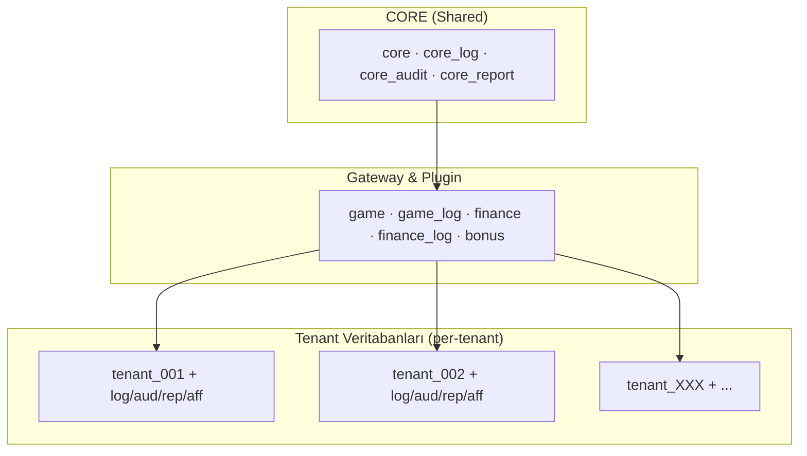

# NUCLEO – VERİTABANI MİMARİSİ

Bu doküman, **Nucleo platformunun** tüm veritabanlarını, şemalarını ve tablolarını sistematik bir şekilde açıklar.

---

## 1. Genel Mimari Prensipler

- Sistem **multi-tenant (whitelabel)** çalışır
- Her whitelabel **tam veri izolasyonuna** sahiptir
- Operasyonel veriler, raporlar ve loglar **farklı DB'lerde** tutulur
- Hiçbir DB birden fazla sorumluluk taşımaz
- Tüm yazma yetkileri **kontrollü ve tekil servisler** üzerinden yapılır
- Log verileri **kısa ömürlüdür**, audit verileri **kalıcıdır**

---

## 2. Multi-Tenant Mimari Diyagramı

> Her tenant için ayrı bir veritabanı klonlanır. Core veritabanı tüm tenantlar arasında paylaşılır.

---

## 3. Veritabanı Özet Matrisi

| #   | Veritabanı         | Amaç                                                      | Tenant Bağımsız | Partition | Retention   |
| --- | ------------------ | --------------------------------------------------------- | --------------- | --------- | ----------- |
| 1   | `core`             | Platform yapılandırması ve merkezi veriler                | ✅              | Monthly*  | Sınırsız    |
| 2   | `core_log`         | Merkezi teknik log kayıtları                              | ✅              | Daily     | 30–90 gün   |
| 3   | `core_audit`       | Backoffice güvenlik denetim kayıtları                     | ✅              | Daily     | 90 gün      |
| 4   | `core_report`      | Merkezi raporlama ve BI verileri                          | ✅              | Monthly   | Sınırsız    |
| 5   | `game`             | Oyun gateway entegrasyon durumu                           | ✅              | Daily     | 14–30 gün   |
| 6   | `game_log`         | Oyun gateway teknik logları                               | ✅              | Daily     | 7–14 gün    |
| 7   | `finance`          | Finans gateway entegrasyon durumu                         | ✅              | Daily     | 14–30 gün   |
| 8   | `finance_log`      | Finans gateway teknik logları                             | ✅              | Daily     | 14–30 gün   |
| 9   | `bonus`            | Bonus ve promosyon yapılandırması                         | ✅              | ❌        | Sınırsız    |
| 10  | `tenant`           | Kiracıya özel iş verileri                                 | ❌              | Monthly   | Sınırsız    |
| 11  | `tenant_log`       | Kiracıya özel operasyonel loglar (dahil: `affiliate_log`) | ❌              | Daily     | 30–90 gün   |
| 12  | `tenant_audit`     | Kiracıya özel audit kayıtları (dahil: `affiliate_audit`, `player_audit`)  | ❌              | Hybrid*   | 1–5 yıl     |
| 13  | `tenant_report`    | Kiracıya özel raporlar ve istatistikler                   | ❌              | Monthly   | Sınırsız    |
| 14  | `tenant_affiliate` | Affiliate tracking ve komisyon yönetimi                   | ❌              | Monthly   | Sınırsız    |

> \* `core`: `messaging.user_messages` Monthly partition (180 gün) + `security.user_sessions` Monthly partition (90 gün).
> \* `tenant_audit` Hybrid: `player_audit.login_attempts` Daily partition (365 gün), `player_audit.login_sessions` Monthly partition (5 yıl). Diğer tablolar (affiliate_audit, kyc_audit) partitioned değildir.

---

## 4. Core Veritabanı

Core veritabanı, platformun merkezi konfigürasyon ve yönetim verilerini barındırır. **Globaldir**, **read-heavy** çalışır ve **finansal state tutmaz**.

### 4.1 Şema Listesi

| Şema           | Amaç                                         |
| -------------- | -------------------------------------------- |
| `catalog`      | Referans ve master data (Kategorize)         |
| `core`         | Tenant ve şirket bilgileri                   |
| `presentation` | Backoffice ve Tenant Frontend yapılandırması |
| `routing`      | Provider endpoint ve callback yönlendirmesi  |
| `security`     | Kullanıcı, rol ve yetki yönetimi             |
| `billing`      | Komisyon ve faturalandırma                   |
| `messaging`    | Kullanıcı mesajlaşma sistemi                 |
| `maintenance`  | Partition yönetim fonksiyonları               |
| `infra`        | PostgreSQL extension'ları                    |

---

### 4.2 catalog Şeması

Referans dataları içerir. **Read-only** karakterlidir. Mantıksal gruplara ayrılmıştır:

#### Reference & Localization

| Tablo                 | Açıklama                         |
| --------------------- | -------------------------------- |
| `countries`           | Ülke listesi ve kodları          |
| `currencies`          | Para birimi tanımları (ISO 4217) |
| `cryptocurrencies`    | Kripto para birimi kataloğu (Coinlayer /list sync) |
| `languages`           | Desteklenen diller               |
| `timezones`           | Saat dilimi referans kataloğu    |
| `localization_keys`   | Lokalizasyon anahtar tanımları   |
| `localization_values` | Lokalizasyon çevirileri          |

> **Para Birimi Tip Standardı:**
> - **Fiat katalog:** `catalog.currencies` → `CHAR(3)` PK (ISO 4217: TRY, EUR, USD)
> - **Kripto katalog:** `catalog.cryptocurrencies` → `VARCHAR(20)` symbol (BTC, ETH, USDT)
> - **Birleşik kullanım:** Fiat+Kripto birlikte kullanılan tablolarda `varchar(20)` kullanılır. Bu pattern tenant (`wallets.currency_code`), report, affiliate ve log DB'lerindeki tüm currency kolonlarında geçerlidir.
> - **Sadece fiat:** Core billing tabloları (`character(3)`) ve `core.tenant_currencies` yalnızca fiat para birimlerini barındırır.

#### Provider & Game Catalyst

| Tablo               | Açıklama                         |
| ------------------- | -------------------------------- |
| `providers`         | Provider (oyun/ödeme) tanımları  |
| `provider_types`    | Provider tip kategorileri        |
| `provider_settings` | Provider yapılandırma şablonları |
| `games`             | Global oyun kataloğu             |
| `payment_methods`   | Ödeme metodları kataloğu         |

#### Compliance (Regulatory, KYC, RG)

| Tablo                         | Açıklama                                |
| ----------------------------- | --------------------------------------- |
| `jurisdictions`               | Lisans otoriteleri (MGA, UKGC, GGL vb.) |
| `kyc_policies`                | Jurisdiction bazlı KYC kuralları        |
| `kyc_document_requirements`   | Gerekli KYC belgeleri                   |
| `kyc_level_requirements`      | KYC seviye geçiş kuralları              |
| `responsible_gaming_policies` | Sorumlu oyun politikaları               |
| `data_retention_policies`     | Jurisdiction bazlı veri saklama süreleri |

#### UI Kit (Theme Market)

| Tablo                       | Açıklama                                       |
| --------------------------- | ---------------------------------------------- |
| `themes`                    | Global tema tanımları ve varsayılan configleri |
| `widgets`                   | Kullanılabilir frontend widget'ları            |
| `ui_positions`              | Sayfa üzerindeki slot alanları (header vs.)    |
| `navigation_templates`      | Hazır navigasyon şablonları (Casino/Spor vb.)  |
| `navigation_template_items` | Şablon içeriğindeki menü öğeleri (Master Data) |

#### Geo (IP Resolution Cache)

| Tablo               | Açıklama                                   |
| ------------------- | ------------------------------------------ |
| `ip_geo_cache`      | ip-api.com çözümleme cache (TTL 30 gün, INET PK) |

#### Transaction Definitions

| Tablo               | Açıklama                                   |
| ------------------- | ------------------------------------------ |
| `operation_types`   | Operasyon tipi tanımları (DEBIT/CREDIT)    |
| `transaction_types` | İşlem tipi tanımları (BET, WIN, BONUS vb.) |

---

### 4.3 core Şeması

Tenant ve şirket yönetimi.

#### Organization

| Tablo       | Açıklama                                           |
| ----------- | -------------------------------------------------- |
| `companies` | Platform operatör şirketleri (faturalama seviyesi) |
| `tenants`   | Tenant (marka/site) tanımları                      |

#### Configuration

| Tablo                  | Açıklama                                              |
| ---------------------- | ----------------------------------------------------- |
| `platform_settings`    | Platform seviyesi dış servis ayarları (şifreli config) |
| `tenant_currencies`        | Tenant'a tanımlı para birimleri                       |
| `tenant_cryptocurrencies`  | Tenant'a tanımlı kripto para birimleri                |
| `tenant_languages`         | Tenant'a tanımlı diller                               |
| `tenant_settings`      | Tenant özel konfigürasyonları                         |
| `tenant_jurisdictions` | Tenant lisans/jurisdiction eşleştirmeleri             |

#### Integration

| Tablo                    | Açıklama                                     |
| ------------------------ | -------------------------------------------- |
| `tenant_games`           | Tenant'a açık oyunlar                        |
| `tenant_payment_methods` | Tenant'a açık ödeme metodları                |
| `tenant_providers`       | Tenant-provider eşleştirmeleri               |
| `tenant_provider_limits` | Provider'ın tenant için belirlediği limitler |

---

### 4.4 security Şeması

Backoffice kullanıcı ve yetki yönetimi.

#### Identity

| Tablo                   | Açıklama                                    |
| ----------------------- | ------------------------------------------- |
| `users`                 | Backoffice kullanıcıları                    |
| `user_sessions`         | Aktif oturumlar                             |
| `user_password_history` | Şifre değişiklik geçmişi (son N şifre)      |
| `password_policy`       | Platform geneli şifre politikası (tek satır)|

#### RBAC (Role Based Access Control)

| Tablo                             | Açıklama                                                           |
| --------------------------------- | ------------------------------------------------------------------ |
| `roles`                           | Rol tanımları                                                      |
| `permissions`                     | Sistem yetki tanımları                                             |
| `role_permissions`                | Rol-yetki eşleştirmeleri                                           |
| `user_roles`                      | Kullanıcı-rol atamaları                                            |
| `user_tenant_roles`               | Tenant bazlı rol atamaları                                         |
| `user_allowed_tenants`            | Kullanıcının erişebildiği tenantlar                                |
| `user_permission_overrides`       | Kullanıcı bazlı yetki override (global veya context-scoped)       |
| `permission_templates`            | Toplu yetki atama şablonları (snapshot model)                      |
| `permission_template_items`       | Şablon içindeki yetki tanımları                                    |
| `permission_template_assignments` | Şablon-kullanıcı atamaları (audit trail, soft-delete)              |

#### Secrets

| Tablo              | Açıklama                                 |
| ------------------ | ---------------------------------------- |
| `secrets_provider` | Provider API key ve secret'ları (global) |
| `secrets_tenant`   | Tenant özel secret'ları (prod/staging)   |

---

### 4.5 presentation Şeması

Mantıksal olarak ikiye ayrılmıştır: **Backoffice** (Yönetim Paneli) ve **Frontend** (Tenant Sitesi).

#### Backoffice UI (Klasör: `backoffice/`)

Yönetim paneli menü ve sayfa yapısı.

| Tablo         | Açıklama             |
| ------------- | -------------------- |
| `contexts`    | UI context tanımları |
| `menu_groups` | Menü grup yapısı     |
| `menus`       | Ana menü tanımları   |
| `submenus`    | Alt menü tanımları   |
| `pages`       | Sayfa tanımları      |
| `tabs`        | Tab yapılandırması   |

#### Tenant Frontend / Theme Engine (Klasör: `frontend/`)

Tenant'ın son kullanıcıya gösterdiği yüzün yönetimi.

| Tablo               | Açıklama                                                          |
| ------------------- | ----------------------------------------------------------------- |
| `tenant_themes`     | Tenant'ın seçtiği tema ve konfigürasyonu (renk, logo)             |
| `tenant_layouts`    | Sayfa bazlı widget yerleşimleri (JSON yapısı)                     |
| `tenant_navigation` | Dinamik site menüleri (`translation_key` veya `custom_label` ile) |

> 📋 **Not**: `tenant_navigation` tablosu "Hybrid Localization" destekler. Menü başlıkları sistemdeki bir çeviri anahtarından (`translation_key`) veya doğrudan tenant'ın girdiği özel metinden (`custom_label`) gelebilir.

---

### 4.6 routing Şeması

Provider endpoint yönetimi.

| Tablo                | Açıklama                       |
| -------------------- | ------------------------------ |
| `callback_routes`    | Callback yönlendirme kuralları |
| `provider_callbacks` | Provider callback tanımları    |
| `provider_endpoints` | Provider API endpoint'leri     |

---

### 4.7 messaging Şeması

Backoffice kullanıcıları arası mesajlaşma sistemi. Draft yönetimi, toplu (publish) ve birebir (direct) mesaj desteği.

**Klasör Yapısı:** `core/tables/messaging/`

| Tablo                  | Açıklama                                                          |
| ---------------------- | ----------------------------------------------------------------- |
| `user_message_drafts`  | Admin mesaj taslakları ve yönetimi (NOT partitioned)              |
| `user_messages`        | Kullanıcı mesaj kutusu (**PARTITIONED** monthly, 180 gün)         |

> **Draft akışı:** Admin → `admin_message_draft_create` → (opsiyonel zamanlama) → `admin_message_publish(draft_id)` → alıcılar çözümlenir (0 alıcı = hata) → her alıcıya ayrı `user_messages` satırı (draft_id ile bağlı). Geri çekme: `admin_message_recall(draft_id)` → mesajlar soft delete + draft status → cancelled.
> **Status akışı:** `draft → scheduled → published`, `draft → published`, `draft/scheduled → cancelled`, `published → cancelled` (recall)
> **Direct mesaj:** Admin → `admin_message_send` → alıcı varlık/aktiflik kontrolü + kendine gönderim engeli → tek `user_messages` satırı (draft ile ilgisi yok).
> **Yetki:** Backend `messaging.*` permission'ları ile kontrol eder. DB fonksiyonları auth-agnostic, sadece veri bütünlüğü kontrolü yapar.

---

## 5. Gateway Veritabanları (Game & Finance)

Nucleo, entegrasyon karmaşasını önlemek için **"Registry vs Implementation" (Kayıt vs Uygulama)** desenini kullanır.

### 5.1 Mimari Yaklaşım

- **Registry (Core DB):** Sağlayıcının kim olduğu, genel ayarları ve aktiflik durumu `core.catalog` şemasında tutulur.
- **Implementation (Gateway DBs):** Sağlayıcının kendine özel tabloları, transaction detayları ve iş mantığı `game` veya `finance` veritabanlarında, **her sağlayıcı için ayrı bir şema** altında tutulur.

### 5.2 Game Veritabanı (`game`)

Oyun sağlayıcılarının entegrasyon detaylarını barındırır. Her provider için izole bir şema açılır.

| Şema (Örnek) | İçerik                                            |
| ------------ | ------------------------------------------------- |
| `pragmatic`  | Pragmatic Play özel bahis, tur ve sonuç tabloları |
| `evolution`  | Evolution Gaming özel tabloları                   |
| `sportradar` | Spor bahisleri kupon ve oran tabloları            |

**Avantajı:** `DROP SCHEMA pragmatic CASCADE` komutuyla bir entegrasyon sistemden tamamen temizlenebilir (Garbage Collection).

### 5.3 Finance Veritabanı (`finance`)

Ödeme sistemlerinin entegrasyon detaylarını barındırır.

| Şema (Örnek) | İçerik                                     |
| ------------ | ------------------------------------------ |
| `stripe`     | Stripe müşteri tokenları ve charge logları |
| `papara`     | Papara cüzdan ve işlem kayıtları           |
| `crypto`     | Blockchain işlem takibi                    |

---

---

## 6. Tenant Veritabanı (`tenant`)

Her tenant için klonlanan ana iş veritabanıdır. Oyuncu verileri, finansal işlemler ve site içeriği burada tutulur.

### 6.1 Şema Listesi

| Şema          | Amaç                                          |
| ------------- | --------------------------------------------- |
| `auth`        | Oyuncu kimlik ve güvenliği                    |
| `profile`     | Oyuncu profil bilgileri                       |
| `wallet`      | Cüzdan ve bakiye                              |
| `transaction` | Finansal işlemler ve akışlar                  |
| `finance`     | Ödeme metodları, kur ve limit ayarları        |
| `game`        | Oyun limitleri, ayarları ve oturum yönetimi   |
| `bonus`       | Bonus kazanımları, talep sistemi ve çevrim durumu |
| `content`     | CMS, FAQ, Promosyon, Banner ve Popup yönetimi |
| `presentation`| Navigasyon, tema ve layout yönetimi           |
| `kyc`         | KYC süreçleri ve belge yönetimi               |
| `messaging`   | Kampanya, şablon ve oyuncu mesaj kutusu       |
| `support`     | Çağrı merkezi, ticket sistemi ve oyuncu destek |
| `maintenance` | Partition yönetim fonksiyonları                |

### 6.2 content Şeması (CMS & Marketing)

Dinamik site içeriği ve pazarlama materyalleri yönetimi. Çoklu dil desteği (translation tabloları) ile çalışır.

**Klasör Yapısı:** `tenant/tables/content/`

| Klasör       | Tablolar                                                                                                                               |
| ------------ | -------------------------------------------------------------------------------------------------------------------------------------- |
| `cms/`       | `content_categories`, `content_category_translations`, `content_types`, `content_type_translations`, `contents`, `content_translations`, `content_versions`, `content_attachments` |
| `faq/`       | `faq_categories`, `faq_category_translations`, `faq_items`, `faq_item_translations`                                                    |
| `promotion/` | `promotion_types`, `promotion_type_translations`, `promotions`, `promotion_translations`, `promotion_banners`, `promotion_segments`, `promotion_games`, `promotion_display_locations` |
| `slide/`     | `slide_placements`, `slide_categories`, `slide_category_translations`, `slides`, `slide_translations`, `slide_images`, `slide_schedules` |
| `popup/`     | `popup_types`, `popup_type_translations`, `popups`, `popup_translations`, `popup_images`, `popup_schedules`                            |
| `trust/`     | `trust_logos` (ödeme/güven logoları, rozet ve sertifikalar), `operator_licenses` (lisans bilgileri, yetki alanı bazlı)                 |
| `seo/`       | `seo_redirects` (URL yönlendirme kuralları, 301/302, bulk import destekli)                                                             |

### 6.2b presentation Şeması (Site Arayüzü)

Frontend navigasyon, tema ve layout yönetimi. Core catalog'dan provisioning ile kopyalanır, tenant bazlı özelleştirilebilir.

**Klasör Yapısı:** `tenant/tables/presentation/`

| Tablo                         | Açıklama                                                                            |
| ----------------------------- | ----------------------------------------------------------------------------------- |
| `navigation`                  | Dinamik menü yönetimi. Hiyerarşik, is_locked/is_readonly korumalı                  |
| `themes`                      | Tenant tema seçimi ve config override. Tek aktif tema (UNIQUE partial index)        |
| `layouts`                     | Sayfa layout tanımları, JSONB structure ile widget pozisyonları                     |
| `site_settings`               | Tek satırlık genel site ayarları (company_name, contact, JSONB config alanları)     |
| `social_links`                | Sosyal medya ve iletişim kanalı bağlantıları (platform UNIQUE, display_order)      |
| `announcement_bars`           | Duyuru çubukları (hedef kitle, zaman penceresi, ülke filtresi, öncelik)             |
| `announcement_bar_translations` | Duyuru çubuğu metni çevirileri (UNIQUE: bar_id + language_code)                  |

### 6.3 finance Şeması

Döviz kurları, ödeme metodu ayarları ve limit yönetimi.

**Klasör Yapısı:** `tenant/tables/finance/`

| Tablo                     | Açıklama                                              |
| ------------------------- | ----------------------------------------------------- |
| `currency_rates`          | Döviz kuru tarihçesi (audit/raporlama)                |
| `currency_rates_latest`   | Güncel döviz kurları (hızlı erişim cache)             |
| `crypto_rates`            | Kripto kur tarihçesi (CryptoManager gRPC, audit/raporlama) |
| `crypto_rates_latest`     | Güncel kripto kurları (hızlı erişim, change verileri) |
| `payment_method_settings` | Tenant ödeme metodu yapılandırması                    |
| `payment_method_limits`   | Para birimi bazlı ödeme limitleri ve ücretler         |
| `payment_player_limits`      | Oyuncu bazlı ödeme yöntemi limitleri                  |
| `player_financial_limits`    | Oyuncu genel finansal limitleri (yöntemden bağımsız)   |

**Views:**

| View                 | Açıklama                                    |
| -------------------- | ------------------------------------------- |
| `v_daily_base_rates` | Günlük son kur değerleri                    |
| `v_cross_rates`      | Çapraz kur hesaplaması (base rate'lerden)   |

### 6.3b transaction Şeması

İşlem kayıtları, iş akışları ve ödeme oturumları.

**Klasör Yapısı:** `tenant/tables/transaction/`

| Tablo                         | Açıklama                                              |
| ----------------------------- | ----------------------------------------------------- |
| `operation_types`             | Cüzdan operasyon tipleri (CREDIT, DEBIT, LOCK, UNLOCK)|
| `transaction_types`           | İşlem tipi tanımları (DEPOSIT, WITHDRAW, BET, WIN)    |
| `transactions`                | Ana işlem tablosu (partitioned monthly). Deposit/withdrawal/bet/win tüm mali hareketler |
| `transaction_workflows`       | İşlem onay iş akışları (pending → approved/rejected). `transaction_id` nullable (ADJUSTMENT workflow'ları için) |
| `transaction_workflow_actions` | İş akışı adım geçmişi (audit trail)                  |
| `transaction_adjustments`     | BO hesap düzeltme detayları (workflow onaylı, GGR referanslı) |
| `payment_sessions`            | Ödeme oturumları (token, TTL, PSP redirect/callback)  |

> **Partitioning:** `transactions` tablosu `RANGE(created_at)` ile aylık partition'lanır. Composite PK: `(id, created_at)`.

### 6.4 wallet Şeması

Oyuncu cüzdan yönetimi. Fiat (TRY, EUR, USD) ve kripto (BTC, ETH, SOL) para birimlerini destekler.

**Klasör Yapısı:** `tenant/tables/wallet/`

| Tablo               | Açıklama                                              |
| ------------------- | ----------------------------------------------------- |
| `wallets`           | Oyuncu cüzdanları (fiat + kripto, tip bazlı)          |
| `wallet_snapshots`  | Cüzdan anlık bakiye görüntüsü (1:1, performans için) |

> **Cüzdan Tipleri:** `REAL` (gerçek para), `BONUS` (bonus bakiye), `LOCKED` (kilitli bakiye), `COIN` (kripto cüzdan).
>
> **Para Birimi Ayrımı:** `currency_type` alanı ile fiat (1) ve crypto (2) ayrımı yapılır. `currency_code varchar(20)` hem fiat kodlarını (TRY, EUR) hem kripto sembollerini (BTC, ETH, SOL) destekler.
>
> **Unique Constraint:** `(player_id, wallet_type, currency_code)` — bir oyuncunun aynı tip+currency kombinasyonunda birden fazla cüzdanı olamaz.

---

### 6.5 game Şeması

Oyun ayarları, limitleri ve oturum yönetimi.

**Klasör Yapısı:** `tenant/tables/game/`

| Tablo                        | Açıklama                                                                              |
| ---------------------------- | ------------------------------------------------------------------------------------- |
| `game_settings`              | Tenant oyun yapılandırması (aktiflik, görünürlük, özelleştirme, shadow mode)          |
| `game_limits`                | Oyun bazlı bahis limitleri ve para birimi ayarları                                    |
| `game_sessions`              | Aktif oyun oturumları ve token doğrulama                                              |
| `lobby_sections`             | Lobi bölüm tanımları (code UNIQUE, section_type: manual/auto_*, max_items, sıralama)  |
| `lobby_section_translations` | Lobi bölümü başlık/alt başlık çevirileri (UNIQUE: section_id + language_code)         |
| `lobby_section_games`        | Manuel küratörlük: bölüm-oyun eşleştirmesi (UNIQUE: section_id + game_id)             |
| `game_labels`                | Oyun kartı rozet/etiket yönetimi (new, hot, exclusive vb., süreli veya kalıcı)        |

### 6.6 bonus Şeması

Bonus kazanımları, manuel talep sistemi ve promosyon kullanımları.

**Klasör Yapısı:** `tenant/tables/bonus/`

| Klasör         | Tablolar                  | Açıklama                              |
| -------------- | ------------------------- | ------------------------------------- |
| `awards/`      | `bonus_awards`            | Oyuncuya verilen bonuslar (bonus_request_id referanslı) |
| `redemptions/` | `promo_redemptions`       | Promosyon kod kullanımları            |
| `mappings/`    | `provider_bonus_mappings` | Provider tarafı bonus takibi (free spin/free bet eşleştirmesi) |
| `requests/`    | `bonus_request_settings`  | Talep edilebilir bonus tipi ayarları (eligibility, cooldown, display_name JSONB) |
|                | `bonus_requests`          | Oyuncu/operatör bonus talepleri (10 durumlu state machine) |
|                | `bonus_request_actions`   | Talep aksiyon geçmişi (immutable audit trail) |

### 6.7 messaging Şeması

Kampanya bazlı toplu mesajlaşma, tekrar kullanılabilir şablonlar ve oyuncu inbox yönetimi. 3 kanal desteklenir: **email**, **SMS**, **local message box**.

**Klasör Yapısı:** `tenant/tables/messaging/`

#### Template (Şablonlar)

| Tablo                            | Açıklama                                         |
| -------------------------------- | ------------------------------------------------ |
| `message_templates`              | Tekrar kullanılabilir mesaj şablonları (kanal bazlı) |
| `message_template_translations`  | Şablon çevirileri (dil bazlı)                   |

#### Campaign (Kampanyalar)

| Tablo                            | Açıklama                                              |
| -------------------------------- | ----------------------------------------------------- |
| `message_campaigns`              | Ana kampanya tablosu (durum, zamanlama, istatistik)   |
| `message_campaign_translations`  | Kampanya içerik çevirileri                            |
| `message_campaign_segments`      | Hedef kitle segmentasyonu (include/exclude)           |
| `message_campaign_recipients`    | Çözümlenmiş alıcı listesi ve gönderim durumu          |

#### Player Inbox (Oyuncu Mesaj Kutusu)

| Tablo                        | Açıklama                                                  |
| ---------------------------- | --------------------------------------------------------- |
| `player_messages`            | Oyuncu yerel mesaj kutusu (**PARTITIONED** monthly, 180 gün) |
| `player_message_preferences` | Oyuncu kanal tercihleri (opt-in/opt-out)                  |

> **Akış:** BO operatör → `admin_campaign_create` → `admin_campaign_publish` → RabbitMQ → Worker alıcıları çözer → email/SMS gönderir + local kanal için `player_messages`'a yazar.
> **Tekil mesaj:** Sistem servisleri veya BO kullanıcı → `admin_player_message_send` → doğrudan `player_messages`'a yazar (kampanya altyapısı gerektirmez).

### 6.8 support Şeması (Çağrı Merkezi & Ticket)

Ticket tabanlı oyuncu destek sistemi, temsilci ataması, hoşgeldin araması ve operatör not yönetimi. Ticket modülü plugin olarak çalışır (`ticket_plugin_enabled` tenant ayarı).

**Klasör Yapısı:** `tenant/tables/support/`

**Detaylı dokümantasyon:** [CALL_CENTER_GUIDE.md](../guides/CALL_CENTER_GUIDE.md)

| Tablo                          | Açıklama                                              |
| ------------------------------ | ----------------------------------------------------- |
| `ticket_categories`            | Hiyerarşik ticket kategorileri (JSONB çoklu dil)      |
| `tickets`                      | Ana ticket tablosu (6 durumlu state machine)           |
| `ticket_actions`               | Ticket aksiyon geçmişi (mesaj, not, durum değişikliği) |
| `ticket_tags`                  | Ticket etiketleri (renk kodu ile)                     |
| `ticket_tag_assignments`       | Ticket ↔ etiket M:N ilişki tablosu                    |
| `ticket_activity_log_outbox`   | Outbox: Aktivite log olayları (tenant_log'a aktarılır) |
| `player_notes`                 | Operatör oyuncu notları (soft delete)                 |
| `player_representatives`       | Oyuncu ↔ temsilci atamaları                           |
| `player_representative_history`| Temsilci atama değişiklik geçmişi                     |
| `agent_settings`               | Operatör kişisel ayarları (JSONB preferences)         |
| `canned_responses`             | Hazır yanıt şablonları (kategori bazlı)               |
| `welcome_call_tasks`           | Hoşgeldin araması görevleri (5 durumlu state machine) |

---

## 7. Reporting Veritabanları (Analytics Store)

Analitik ve raporlama işlemleri için optimize edilmiş, column-based veya aggregate-based tablolardan oluşur. "Read-Heavy" yükü buraya yönlendirilir.

### 7.1 Tenant Report (`tenant_report`)

Tenant'a özel mikro ve makro raporlar.

**Şemalar:**

- **`finance`**: Finansal özetler ve KPI'lar.
    - `player_hourly_stats`: Oyuncu bazlı saatlik net durum (Hybrid JSONB).
    - `transaction_hourly_stats`: İşlem tipi ve metod bazlı saatlik özet (JSONB).
    - `system_hourly_kpi`: Sistem geneli saatlik operasyonel metrikler.
- **`game`**: Oyun performans raporları.
    - `game_hourly_stats`: Oyuncu bazlı oyun aktivite özeti (JSONB Consolidated).
    - `game_performance_daily`: Oyun ve Provider bazlı günlük performans/RTP analizi.
- **`support`**: Destek sistemi raporları.
    - `ticket_daily_stats`: Günlük ticket istatistikleri (**PARTITIONED** monthly, sınırsız).

### 7.2 Core Report (`core_report`)

Merkezi yönetim (NucleoAdmin) raporları.

**Şemalar:**

- **`finance`**: Genel finansal görünüm.
    - `tenant_daily_kpi`: Tenant bazlı günlük performans karnesi.
- **`billing`**: Faturalandırma.
    - `monthly_invoices`: Ay sonu tenant fatura ve komisyon hesaplamaları.
- **`performance`**: Global metrikler.
    - `provider_global_daily`: Tüm tenantlar genelinde provider hacim analizi.
    - `payment_global_daily`: Tüm tenantlar genelinde ödeme metodu başarı ve hacim analizi.
    - `tenant_traffic_hourly`: Tenant bazlı saatlik trafik ve sistem sağlık monitörü.

---

## 8. Log Veritabanları (Operational Store)

Yüksek hacimli "Write-Heavy" operasyonel veriler, ana işlem veritabanlarını yormamak için ayrıştırılmıştır.

### 8.1 Game Log (`game_log`) — Hybrid Tasarım

**Mimari karar:** Yüksek hacimli oyun verileri iki katmanda ayrıştırılır:

**Gateway katmanı — `game_log` DB (shared, 7 gün):**
- Provider API çağrı logları (outbound requests + inbound callbacks)
- Gateway seviyesi: tüm tenant'lar için ortak endpoint logları
- Düşük-orta hacim (round başına 1-2 kayıt)

**Tenant katmanı — `tenant_log` DB, `game_log` şeması (per-tenant, 30 gün):**
- Oyun turları/round detayları (spin sonuçları, bahis/kazanç, round metadata)
- Yüksek hacim: per-tenant izolasyon ile yük doğal olarak dağılır
- `round_detail` JSONB: oyun tipine göre değişken detaylar (semboller, çarpanlar, kartlar)

**Tablolar:**

| DB | Tablo | Açıklama | Partition | Retention |
|----|-------|----------|-----------|-----------|
| `game_log` | `game_log.provider_api_requests` | Provider'lara yapılan API çağrıları | Daily | 7 gün |
| `game_log` | `game_log.provider_api_callbacks` | Provider'lardan gelen callback'ler | Daily | 7 gün |
| `tenant_log` | `game_log.game_rounds` | Oyun round/spin detayları (per-tenant) | Daily | 30 gün |
| `tenant_log` | `game_log.reconciliation_reports` | Günlük provider reconciliation raporları | — | 30 gün |
| `tenant_log` | `game_log.reconciliation_mismatches` | Round bazlı mismatch kayıtları | — | 30 gün |

### 8.2 Finance Log (`finance_log`)

- **Kapsam:** Ödeme denemeleri, webhook bildirimleri, 3D secure logları.
- **Yapı:** Günlük (Daily) partition.
- **Retention:** 14 gün.
- **Amaç:** İşlem doğrulama ve fraud analizi.

**Tablolar:**

| DB | Tablo | Açıklama | Partition | Retention |
|----|-------|----------|-----------|-----------|
| `finance_log` | `finance_log.provider_api_requests` | Ödeme sağlayıcılara yapılan API çağrıları | Daily | 14 gün |
| `finance_log` | `finance_log.provider_api_callbacks` | Ödeme sağlayıcılardan gelen callback'ler | Daily | 14 gün |

### 8.3 Tenant Log (`tenant_log`)

Her tenant için klonlanan operasyonel log veritabanı. Affiliate, KYC ve mesajlaşma loglarını barındırır.

**Şemalar:**

| Şema              | İçerik                                                       | Partition | Retention |
| ----------------- | ------------------------------------------------------------ | --------- | --------- |
| `affiliate_log`   | Affiliate API istek logları, rapor üretimleri, komisyon hesaplamaları | Daily     | 90 gün    |
| `bonus_log`       | Bonus işlem ve kural yürütme logları                         | Daily     | 90 gün    |
| `game_log`        | Oyun round/spin detay logları + reconciliation raporları ve mismatch kayıtları | Daily     | 30 gün    |
| `kyc_log`         | KYC provider API çağrı logları                               | Daily     | 90+ gün   |
| `messaging_log`   | Mesaj gönderim detay logları (email/SMS/local)               | Daily     | 90 gün    |
| `support_log`     | Ticket aktivite bildirimleri ve log kayıtları                | Daily     | 90 gün    |

**messaging_log Tabloları:**

| Tablo                    | Açıklama                                                    |
| ------------------------ | ----------------------------------------------------------- |
| `message_delivery_logs`  | Worker gönderim logları: provider yanıtı, hata, süre (**PARTITIONED** daily) |

**support_log Tabloları:**

| Tablo                    | Açıklama                                                    |
| ------------------------ | ----------------------------------------------------------- |
| `ticket_activity_logs`   | Ticket aktivite bildirimleri: atama, durum değişikliği, mesaj (**PARTITIONED** daily) |

### 8.4 Log Stratejisi

Tüm log veritabanları **`DROP PARTITION`** stratejisi ile temizlenir. Detaylar için bkz: `LOGSTRATEGY.md`.

---

## 9. Partition Yapısı

Partitioned tablolar **kendi tablo dosyasında inline** tanımlıdır (`PARTITION BY RANGE` + `DEFAULT` partition). 11 veritabanında toplam 41 tablo partitioned çalışır.

| DB | Strateji | Tablo Sayısı | Retention |
|----|----------|-------------|-----------|
| `core` | Monthly | 2 | 90–180 gün |
| `core_audit` | Daily | 1 | 90 gün |
| `core_log` | Daily | 4 | 30–90 gün |
| `core_report` | Monthly | 5 | Sınırsız |
| `game_log` | Daily | 2 | 7 gün |
| `finance_log` | Daily | 2 | 14 gün |
| `tenant` | Monthly | 2 | Sınırsız* |
| `tenant_log` | Daily | 8 | 30–90 gün |
| `tenant_audit` | Hybrid | 2 | 365 gün / 5 yıl |
| `tenant_report` | Monthly | 6 | Sınırsız |
| `tenant_affiliate` | Monthly | 7 | Sınırsız |

> \* `core` Monthly: `messaging.user_messages` (180 gün) + `security.user_sessions` (90 gün).
> \* `tenant` Monthly: `transaction.transactions` (sınırsız) + `messaging.player_messages` (180 gün).
> \* `tenant_audit` Hybrid: `player_audit.login_attempts` Daily (365 gün), `player_audit.login_sessions` Monthly (5 yıl).

Her partitioned veritabanı `maintenance` şemasında 4 yönetim fonksiyonu içerir: `create_partitions`, `drop_expired_partitions`, `partition_info`, `run_maintenance`.

> Detaylar için bkz: **[PARTITION_ARCHITECTURE.md](PARTITION_ARCHITECTURE.md)**
