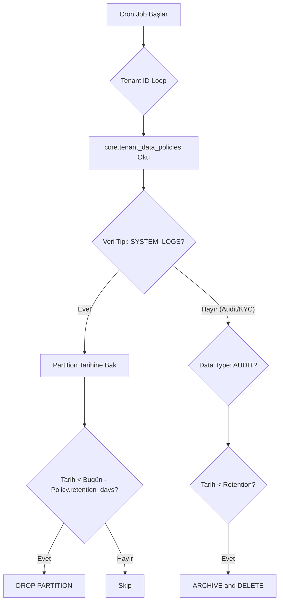

# NUCLEO – LOG / AUDIT / BUSINESS

## Log, Audit ve Retention Stratejisi

Bu doküman, **Nucleo platformu** içinde üretilen **log, audit ve business (history)** verilerinin  
hangi veritabanında tutulacağını, ne kadar süre saklanacağını ve retention süresi sonunda  
nasıl temizleneceğini tanımlar.

**ÖNEMLİ:** Retention politikaları **statik değildir**. Tenant bazında, jurisdiction kurallarına (KYC/AML) göre  
**Dinamik Retention** uygulanır. Bu kurallar `core.tenant_data_policies` tablosunda saklanır.

---

## 1. Genel Özet Tablosu

| DB / Kategori      | Ne Tutulur                                              | Partition       | Varsayılan Süre | Olası Politikalar |
| ------------------ | ------------------------------------------------------- | --------------- | --------------- | ----------------- |
| **core**           | Platform domain + kullanıcı mesajlaşma                  | Monthly*        | Sınırsız        | DROP partition    |
| **core_log**       | Core + gateway teknik log (ERROR / WARN / INFO)         | Daily           | 30–90 gün       | DROP partition    |
| **core_audit**     | Backoffice güvenlik denetim kayıtları                   | Daily           | 90 gün          | DROP partition    |
| **core_report**    | Merkezi raporlama ve BI verileri                        | Monthly         | Sınırsız        | -                 |
| **game**           | Oyun sağlayıcı ve oyun kataloğu (referans veri)        | ❌              | Sınırsız        | -                 |
| **game_log**       | Gateway seviyesi provider API logları (paylaşımlı)      | Daily           | 7 gün           | DROP partition    |
| **finance**        | Ödeme sağlayıcı ve yöntem kataloğu (referans veri)     | ❌              | Sınırsız        | -                 |
| **finance_log**    | Finance gateway logları (henüz oluşturulmadı)           | Daily (plan)    | 14–30 gün       | DROP partition    |
| **bonus**          | Bonus tanım, kural, kampanya ve promosyon yapılandırması | ❌             | Sınırsız        | -                 |
| **tenant**         | Business & history (transactions, player_messages, wallets) | Monthly    | Sınırsız**      | -                 |
| **tenant_log**     | Tenant operasyonel log + KYC/messaging/game logları     | Daily           | 30–90 gün***    | DROP partition    |
| **tenant_audit**   | Tenant audit kayıtları (player_audit + affiliate_audit) | Hybrid****      | 365 gün–5 yıl   | DROP partition    |
| **tenant_report**  | Kiracıya özel raporlar ve istatistikler                 | Monthly         | Sınırsız        | -                 |
| **tenant_affiliate**| Affiliate tracking ve komisyon yönetimi                 | Monthly         | Sınırsız        | -                 |

> \* Core DB: `messaging.user_messages` Monthly partition (180 gün) + `security.user_sessions` Monthly partition (90 gün). Diğer core tabloları partitioned değildir, sınırsız retention.
>
> \*\* `transaction.transactions`: Sınırsız retention. `messaging.player_messages`: 180 gün retention (monthly partition ile yönetilir).
>
> \*\*\* `tenant_log` schemaları: `affiliate_log` (3 tablo, 90 gün), `kyc_log` (1 tablo, 90+ gün), `messaging_log` (1 tablo, 90 gün), `game_log` (1 tablo — `game_rounds`, 30 gün). KYC provider logları için retention compliance gereksinimleri doğrultusunda 90+ güne uzatılabilir.
>
> \*\*\*\* `tenant_audit` Hybrid: `player_audit.login_attempts` Daily (365 gün), `player_audit.login_sessions` Monthly (5 yıl). Diğer tablolar (affiliate_audit, kyc_audit) partitioned değildir.

---

## 2. Dinamik Retention Yapısı (`tenant_data_policies`)

Sistemde her tenant'ın maruz kaldığı regülasyonlar (MGA, Curaçao, UKGC vb.) farklıdır.  
Bu nedenle log ve audit verilerinin saklanma süresi **Configurable Job** mantığıyla yönetilir.

### 2.1 Konfigürasyon Tablosu

`core.tenant_data_policies` tablosu, temizlik job'ları için kaynak görevi görür.

```sql
SELECT * FROM core.tenant_data_policies WHERE tenant_id = 123;
```

**Örnek Kayıtlar:**

| Tenant ID | Veri Tipi   | Saklama (Gün) | Süre Sonu Aksiyon | Açıklama                |
| --------- | ----------- | ------------- | ----------------- | ----------------------- |
| 1 (Demo)  | SYSTEM_LOGS | 30            | `DROP_PARTITION`  | Demo site teknik loglar |
| 1 (Demo)  | AUDIT_LOGS  | 365           | `ARCHIVE_COLD`    | Demo site audit         |
| 2 (MGA)   | SYSTEM_LOGS | 90            | `DROP_PARTITION`  | Production loglar       |
| 2 (MGA)   | KYC_DATA    | 1825 (5 yıl)  | `ANONYMIZE`       | GDPR/KYC uyumluluğu     |
| 2 (MGA)   | AUDIT_LOGS  | 3650 (10 yıl) | `ARCHIVE_COLD`    | Finansal denetim        |
| 2 (MGA)   | KYC_SCREENING | 1825 (5 yıl) | `ARCHIVE_COLD`  | PEP/Sanctions tarama    |
| 2 (MGA)   | AML_FLAGS   | 3650 (10 yıl) | `ARCHIVE_COLD`    | AML uyarıları ve SAR    |
| 2 (MGA)   | RISK_ASSESSMENTS | 1825 (5 yıl) | `ARCHIVE_COLD` | Risk değerlendirmeleri |
| 2 (MGA)   | KYC_PROVIDER_LOGS | 90  | `DROP_PARTITION`   | KYC API logları         |
| 2 (MGA)   | MESSAGING_DELIVERY_LOGS | 90 | `DROP_PARTITION` | Mesaj gönderim logları  |
| 2 (MGA)   | PLAYER_MESSAGES | 180  | `DROP_PARTITION`   | Oyuncu inbox mesajları  |

### 2.2 Aksiyon Türleri

| Aksiyon          | Açıklama                                                   | Kullanım Yeri                         |
| ---------------- | ---------------------------------------------------------- | ------------------------------------- |
| `DROP_PARTITION` | Veriyi fiziksel olarak ve hızla siler. Geri dönüşü yoktur. | Teknik Loglar (Log DBs)               |
| `DELETE_ROWS`    | Satır bazlı silme yapar (Vacuum maliyeti yüksektir).       | Partition olmayan tablolar            |
| `ARCHIVE_COLD`   | Veriyi S3/Blob storage'a taşır ve DB'den siler.            | Transaction/Audit History             |
| `ANONYMIZE`      | Veriyi silmez ama PII (Kişisel Veri) alanlarını maskeler.  | KYC/User Data (Right to be forgotten) |

---

## 3. Partition ve DROP Stratejisi

Partition kullanılan veritabanlarında (`*_log` DB'leri), retention süresi dolduğunda:

- `DELETE` komutu yerine **`DROP TABLE partition_name`** kullanılır.
- Bu işlem IO spike yaratmaz ve anında yer açar.

### 3.1 Job Akışı

Gece çalışan maintenance job şu mantığı izler:



---

## 4. Archive ve Cold Storage

Retention stratejisinde **archive**, log ve audit verileri için farklı ele alınmalıdır.

### 4.1 Log Verileri (Teknik Borç)

- ❌ Archive **gerekmez**.
- Loglar operasyonel pencere (window) içindir.
- Süre dolunca silinir.

### 4.2 Audit ve Finansal Veriler (Yasal Zorunluluk)

- 🟡 Archive **önemlidir**.
- Veritabanında (hot storage) tutmak pahalıdır.
- Süresi dolan (örn: 2 yıldan eski) veriler **JSON/Parquet** formatında S3'e taşınır.
- Veritabanından silinir (`core.tenant_data_policies.action_type = 'ARCHIVE_COLD'`).

### 4.3 ARCHIVE ve DELETE Stratejisi

Arşivleme gerektiren verilerde (özellikle Audit verileri için) `ARCHIVE_COLD` süreci **DELETE** işleminden önce çalışmalıdır.

1. **Partition Detach**: Eğer tablo partition yapısına sahipse, silinecek partition ana tablodan ayrılır (`DETACH PARTITION`). Bu, partition üzerinde lock beklemeden işlem yapmayı sağlar ve production trafiğini minimum etkiler.
2. **Data Export**: Ayrılan partition (veya partition olmayan tablolarda ilgili tarih aralığı) `COPY` komutu ile `.csv` veya sıkıştırılmış formatta sunucu diskine yazılır.
3. **Cold Storage Upload**: Export edilen dosya S3, Azure Blob Storage veya Glacier gibi ucuz ve güvenli bir depolama alanına yüklenir. Dosya isimlendirmesinde `tenant_id`, `table_name` ve `date_range` mutlaka bulunmalıdır.
4. **Verification**: Dosyanın başarıyla yüklendiği ve checksum doğrulamasının yapıldığı teyit edilir.
5. **DROP / DELETE**:
    - Partition yapısında: Detach edilen tablo tamamen silinir (`DROP TABLE`).
    - Standart tabloda: İlgili satırlar silinir (`DELETE FROM table WHERE ...`). Eğer silinecek veri çok büyükse chunk'lar halinde silinmelidir.

> **Not:** Bu süreç atomik olmalıdır. Upload onayı alınmadan **ASLA** silme işlemi yapılmamalıdır.

---

## 5. Operasyonel Sorumluluk

Retention ve DROP işlemleri **otomasyonun sorumluluğundadır**.

1.  **Config**: Ürün/Compliance ekibi tenant açılırken politikaları girer.
2.  **Execution**: DevOps/DBA tarafından kurulan cron job'lar bu politikaları uygular.
3.  **Monitoring**: Silinen veya taşınan veriler `ops_log` tablosuna yazılır.

> **Güvenlik Notu**: Aktif (`CURRENT`) partition asla silinmemelidir. Job'lar her zaman `partition_date < today` kontrolü yapmalıdır.

---

## 6. KYC/AML Veri Dağılımı

KYC ve AML verileri, kullanım senaryosuna göre farklı veritabanlarına dağıtılmıştır:

### 6.1 tenant DB (Business Data - Sınırsız)

Real-time sorgulama gerektiren operasyonel veriler:

| Tablo | Açıklama |
|-------|----------|
| `kyc.player_jurisdiction` | Oyuncunun tabi olduğu jurisdiction |
| `kyc.player_kyc_cases` | Güncel KYC durumu |
| `kyc.player_documents` | Aktif belgeler |
| `kyc.player_limits` | Aktif limitler |
| `kyc.player_restrictions` | Aktif kısıtlamalar |
| `kyc.player_aml_flags` | Aktif AML alert'leri (işlemleri bloklar) |
| `kyc.player_kyc_workflows` | KYC workflow geçmişi |
| `kyc.player_limit_history` | Limit değişiklik geçmişi |

### 6.2 tenant_audit DB (Compliance Audit - 5-10 yıl)

Karar ve değerlendirme kayıtları:

| Tablo | Açıklama | Veri Tipi |
|-------|----------|-----------|
| `kyc_audit.player_screening_results` | PEP/Sanctions tarama sonuçları | KYC_SCREENING |
| `kyc_audit.player_risk_assessments` | Risk değerlendirme geçmişi | RISK_ASSESSMENTS |

### 6.3 tenant_log DB (Operational Logs - 90+ gün)

API call ve gönderim logları:

| Tablo | Açıklama | Veri Tipi | Retention |
|-------|----------|-----------|-----------|
| `kyc_log.player_kyc_provider_logs` | KYC provider API logları | KYC_PROVIDER_LOGS | 90+ gün |
| `messaging_log.message_delivery_logs` | Mesaj gönderim detay logları (email/SMS/local) | MESSAGING_DELIVERY_LOGS | 90 gün |

> **Not:** KYC provider logları için retention süresi standart 30-90 günden **90+ güne** uzatılmıştır.
> Bu, KYC dispute'larında geçmiş API yanıtlarına erişim sağlamak içindir.
>
> **Not:** Messaging delivery logları her gönderim denemesinin provider yanıtını, hata kodunu ve süresini kaydeder.
> Worker servisi tarafından yazılır. Günlük partition ile yönetilir, 90 gün retention.

---

## 7. Altın Kural

> **"Loglar çabuk silinir, Auditler arşivlenir, KYC verileri anonimleşir."**
