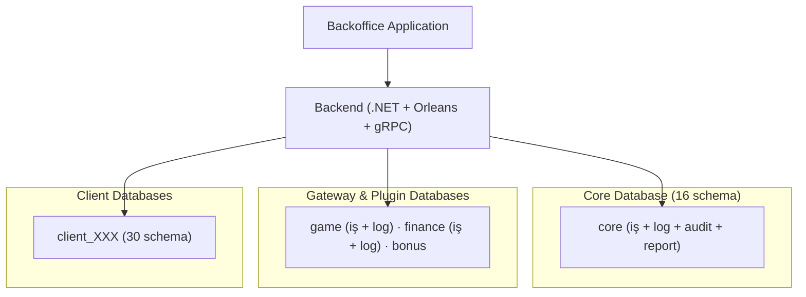
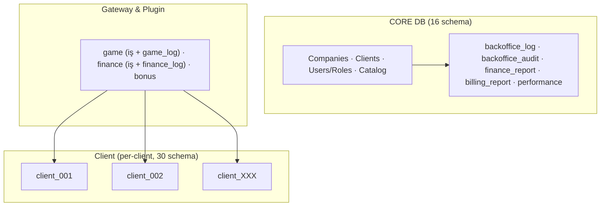
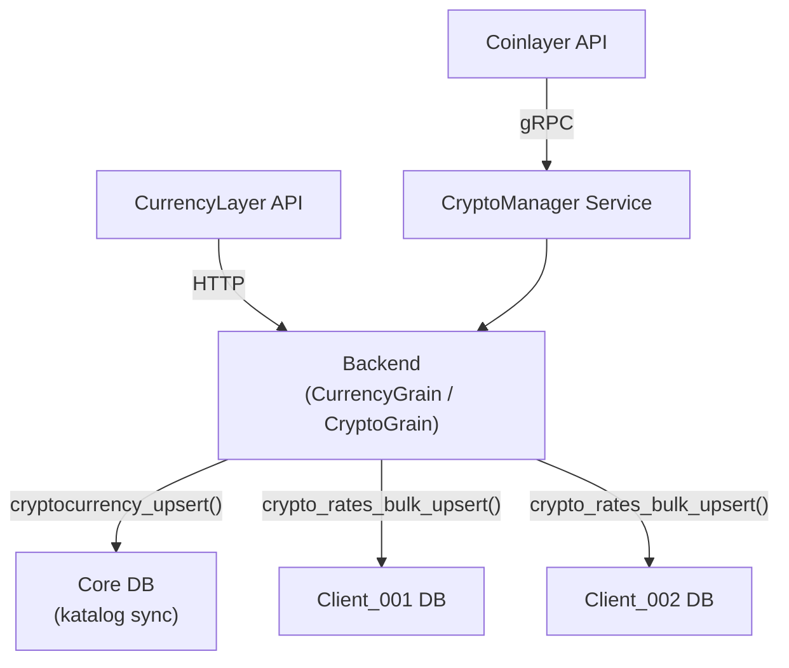
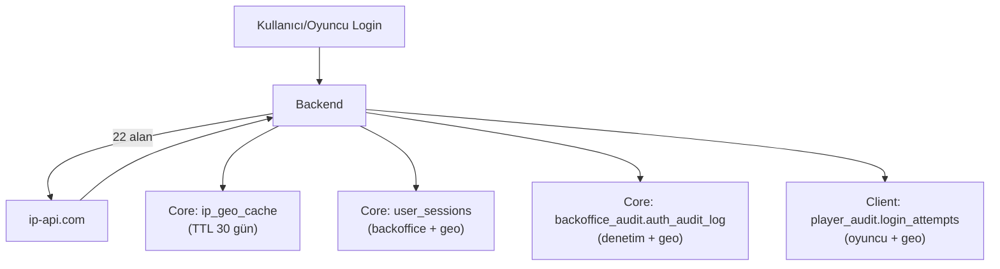
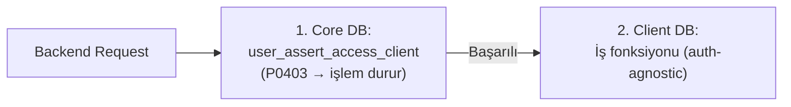

# SORTIS ONE DATABASE PROJESİ - GENEL BAKIŞ

Bu doküman, **OneDB** projesinin büyük resmini ve sistemin nasıl çalıştığını açıklar.

---

## İçindekiler

1. [Proje Hakkında](#1-proje-hakkında)
2. [Sistem Mimarisi](#2-sistem-mimarisi)
3. [Veritabanı Katmanları](#3-veritabanı-katmanları)
4. [Multi-Client Yapı](#4-multi-client-yapı)
5. [Veri Akışı](#5-veri-akışı)
6. [Proje Yapısı](#6-proje-yapısı)
7. [Deploy Süreci](#7-deploy-süreci)
8. [Geliştirici Rehberi](#8-geliştirici-rehberi)
9. [Güvenlik ve Yetkilendirme](#9-güvenlik-ve-yetkilendirme)
10. [Log ve Audit Stratejisi](#10-log-ve-audit-stratejisi)

---

## 1. Proje Hakkında

### 1.1 Ne İçin Kullanılıyor?

**Sortis One**, online gaming/betting platformları için tasarlanmış **multi-client (whitelabel)** bir veritabanı altyapısıdır. Platform:

- **Oyun Entegrasyonu** - Game provider'larla entegrasyon (Pragmatic, Evolution vb.)
- **Ödeme İşlemleri** - Finance provider'larla ödeme yönetimi (Stripe, Papara vb.)
- **Oyuncu Yönetimi** - Kayıt, cüzdan, işlemler, KYC süreçleri
- **Bonus Sistemi** - Promosyon ve kampanyalar
- **Mesajlaşma** - Kampanya, şablon ve oyuncu inbox (email/SMS/local)
- **Kullanıcı Mesajlaşma** - Backoffice kullanıcılar arası mesaj sistemi (draft/publish/recall/direct)
- **Affiliate Sistemi** - Ortaklık ve komisyon yönetimi
- **Multi-Client** - Birden fazla markanın tek platformda çalışması
- **Theme Engine** - Client'ların kendi frontend ve navigasyonunu yönetebilmesi
- **Fiat & Kripto Kur Takibi** - CurrencyLayer ve Coinlayer entegrasyonu
- **GeoIP Takibi** - ip-api.com entegrasyonu ile IP lokasyon çözümleme

### 1.2 Temel Prensipler

| Prensip                          | Açıklama                                                 |
| -------------------------------- | -------------------------------------------------------- |
| **Veri İzolasyonu**              | Her client (marka) tam veri izolasyonuna sahiptir        |
| **Sorumluluk Ayrımı**            | Her veritabanı belirli bir domain sorumluluğu taşır     |
| **Log ≠ Audit ≠ Business**       | Farklı veri tipleri aynı DB içinde farklı schema'larda tutulur |
| **Core Shared, Client Isolated** | Merkezi veriler paylaşılır, client verileri izole edilir |
| **Cross-DB Yasağı**              | Fiziksel DB'ler arası doğrudan sorgu yapılamaz           |

---

## 2. Sistem Mimarisi

### 2.1 Üst Düzey Görünüm



### 2.2 Veritabanı Etkileşim Haritası



---

## 3. Veritabanı Katmanları

### 3.1 Veritabanı Matrisi

| #  | Veritabanı         | Amaç                                      | Paylaşım | Partition      | Retention     |
|----|--------------------|--------------------------------------------|----------|----------------|---------------|
| 1  | `core`             | Platform merkezi yapı (16 schema: iş + log + audit + report) | Shared | Hybrid* | Çeşitli** |
| 2  | `game`             | Oyun gateway entegrasyon + logları         | Shared   | Daily (2)      | 7 gün         |
| 3  | `finance`          | Finans gateway entegrasyon + logları       | Shared   | Daily (2)      | 14 gün        |
| 4  | `bonus`            | Bonus ve promosyon yapılandırması          | Shared   | -              | Sınırsız      |
| 5  | `client`           | Client'a özel birleşik DB (30 schema: iş verileri, log, audit, report, affiliate) | Isolated | Hybrid*** | Değişken**** |

> **Toplam:** 5 veritabanı, 41 partitioned tablo, 5 DB'de partition yönetimi, ~671 fonksiyon
>
> \* `core` Hybrid: İş schema'ları Monthly (messaging.user_messages 180 gün, security.user_sessions 90 gün), log schema'ları (backoffice_log, logs) Daily (30-90 gün), audit (backoffice_audit) Daily (90 gün), report schema'ları (finance_report, billing_report, performance) Monthly (sınırsız)
> \*\* Core retention: iş verileri sınırsız, loglar 30-90 gün, audit 90 gün, raporlar sınırsız
> \*\*\* `client` birleşik DB partition detayı:
>   - Monthly: transaction.transactions, messaging.player_messages, player_audit.login_sessions (5 yıl), finance_report.* (sınırsız), game_report.* (sınırsız), support_report.* (sınırsız), tracking.* (sınırsız)
>   - Daily: affiliate_log (90 gün), bonus_log (90 gün), kyc_log (90 gün), messaging_log (90 gün), game_log.game_rounds (30 gün), support_log (90 gün), player_audit.login_attempts (365 gün)
> \*\*\*\* Client retention: iş verileri sınırsız, loglar 30-90 gün, audit 1-5 yıl, raporlar sınırsız

### 3.2 Core Veritabanı (Merkezi, 16 Schema)

Core veritabanı platformun beynidir. Tüm merkezi konfigürasyon ve yönetim verilerini barındırır. Eski ayrı core_log, core_audit ve core_report veritabanları artık bu DB içinde schema olarak birleştirilmiştir.

```
CORE DATABASE (16 schema)
│
├── İŞ SCHEMA'LARI
│   ├── catalog (Referans Data)
│   │   ├── reference        → Ülkeler, para birimleri, kripto paralar, diller, saat dilimleri
│   │   ├── localization     → Lokalizasyon key/value çevirileri
│   │   ├── provider         → Provider tipleri, sağlayıcılar, ayarlar, ödeme metodları
│   │   ├── game             → Oyun kataloğu
│   │   ├── compliance       → Jurisdiction, KYC kuralları, data retention, RG politikaları
│   │   ├── uikit            → Tema marketi, widget'lar, navigasyon şablonları
│   │   ├── geo              → IP geo cache (ip-api.com, TTL 30 gün)
│   │   └── transaction      → İşlem ve operasyon tipi tanımları
│   │
│   ├── core (Client Yönetimi)
│   │   ├── organization     → Şirketler, departmanlar, clientlar
│   │   ├── configuration    → Platform ayarları, client dil/kur/kripto/jurisdiction ayarları
│   │   └── integration      → Client provider/oyun/ödeme erişimleri
│   │
│   ├── security (Yetki Yönetimi)
│   │   ├── identity         → Backoffice kullanıcıları, oturumlar, şifre geçmişi
│   │   ├── rbac             → Roller, yetkiler, kullanıcı-rol atamaları
│   │   └── secrets          → Provider ve client API anahtarları
│   │
│   ├── presentation (UI Yapısı)
│   │   ├── backoffice       → Admin panel menü, sayfa, tab, context yapısı
│   │   └── frontend         → Client tema, layout, navigasyon (Theme Engine)
│   │
│   ├── messaging (Kullanıcı Mesajlaşma)
│   │   ├── user_message_drafts  → Draft/publish/recall yönetimi
│   │   └── user_messages        → Kullanıcı inbox (monthly partitioned)
│   │
│   ├── billing (Faturalandırma)
│   │   ├── client_*         → Client faturaları (Sortis One'ın alacakları)
│   │   └── provider_*       → Provider ödemeleri (Sortis One'ın borçları)
│   │
│   ├── routing (Provider Yönlendirme)
│   │   ├── provider_endpoints   → API endpoint'leri
│   │   └── provider_callbacks   → Callback tanımları
│   │
│   ├── outbox (Event Outbox Pattern)
│   │   └── outbox_messages  → Transactional outbox mesajları
│   │
│   ├── infra → PostgreSQL extension'ları
│   └── maintenance → Partition yönetimi (4 fonksiyon)
│
├── LOG SCHEMA'LARI (eski core_log DB'den)
│   ├── backoffice_log       → Platform operasyonel logları (30-90 gün)
│   └── logs                 → Genel teknik loglar
│
├── AUDIT SCHEMA'LARI (eski core_audit DB'den)
│   └── backoffice_audit     → Platform denetim kayıtları (90 gün)
│
└── REPORT SCHEMA'LARI (eski core_report DB'den)
    ├── finance_report       → Finansal raporlama (sınırsız)
    ├── billing_report       → Faturalandırma raporlama (sınırsız)
    └── performance          → Global performans metrikleri (sınırsız)
```

### 3.3 Client Veritabanı (Oyuncu Verileri)

Her client (marka) için `client` şablon DB'si klonlanarak `client_<clientid>` formatında oluşturulur.

```
CLIENT DATABASE (per client)
├── player_auth    → Oyuncu kimlik, kategori/grup, şifre yönetimi, shadow testers
├── player_profile → Oyuncu profil, kimlik bilgileri, adres/iletişim
├── wallet         → Cüzdan bakiyeleri ve snapshot'ları (fiat + kripto)
├── transaction    → Finansal işlemler ve workflow'lar (monthly partitioned)
├── finance        → Döviz/kripto kurları, ödeme limitleri, player limitleri
├── game           → Oyun limitleri ve ayarları
├── bonus          → Bonus kazanımları ve promosyon kullanımları
├── content        → CMS, FAQ, promosyon, slide, popup yönetimi
├── kyc            → KYC süreçleri, belgeler, limitler, kısıtlamalar, AML bayrakları
├── messaging      → Kampanya, şablon, oyuncu mesaj kutusu (monthly partitioned)
├── support        → Destek talepleri, ticket yönetimi
└── maintenance    → Partition yönetimi, bonus temizliği, destek bakımı
```

> Detaylı tablo listeleri için bkz: **[DATABASE_ARCHITECTURE.md](DATABASE_ARCHITECTURE.md)**

---

## 4. Multi-Client Yapı

### 4.1 Database-Per-Client Model

Sortis One, her client için **tek bir birleşik veritabanı** (`client_{id}`) kullanır. Bu DB, 30 schema ile tüm iş verilerini, logları, audit kayıtlarını, raporları ve affiliate verilerini barındırır.

```
Client kaydı yapıldığında (örn: client_id = 5):
└── client_5 (tek birleşik DB — 30 schema)
    ├── Core Business (14): auth, profile, transaction, finance, wallet, game, kyc, bonus, content, messaging, presentation, support, infra, maintenance
    ├── Log (6): affiliate_log, bonus_log, kyc_log, messaging_log, game_log, support_log
    ├── Audit (3): affiliate_audit, kyc_audit, player_audit
    ├── Report (3): finance_report, game_report, support_report
    └── Affiliate (5): affiliate, campaign, commission, payout, tracking
```

### 4.2 Cross-DB İletişim

**5 fiziksel DB (core, game, finance, bonus, client) arası doğrudan sorgu yapılamaz.** Aynı DB içindeki tüm schema'lar arası JOIN mümkündür (core DB'deki iş ve log/audit/report schema'ları dahil).

| Yöntem | Kullanım |
|--------|----------|
| **Backend Application** (Önerilen) | Ayrı DB connection'ları ile. Core'dan okur, client'a yazar |
| `dblink` / `postgres_fdw` | Sadece zorunlu durumlarda |

**Örnek akış:** Backend önce Core DB'den `client_cryptocurrency_mapping_list()` çağırır, sonra her client DB'ye bağlanıp `crypto_rates_bulk_upsert()` çalıştırır.

### 4.3 Client Seeding

Yeni client oluşturulduğunda:
1. Core DB'de `client_create()` ile client kaydı yapılır
2. Backend, `deploy_client.sql` şablonunu klonlayarak yeni birleşik client DB oluşturur (30 schema)
3. Core DB'de client-currency, client-language gibi mapping'ler atanır

---

## 5. Veri Akışı

### 5.1 Kur Senkronizasyonu (Currency & Crypto)



**Akış:**
1. **Katalog sync:** Coinlayer `/list` → `catalog.cryptocurrency_upsert()` (Core DB)
2. **Mapping okuma:** `client_cryptocurrency_mapping_list()` → hangi client'a hangi coin (Core DB)
3. **Kur yazma:** Her client DB'ye `crypto_rates_bulk_upsert()` çağrısı (Client DB)

### 5.2 Outbox Pattern (Event-Driven)

Backend, veritabanı transaction'ı içinde hem iş verisini hem de outbox mesajını yazar. Ayrı bir worker outbox'tan okuyarak event'leri RabbitMQ'ya iletir.

### 5.3 GeoIP Çözümleme



---

## 6. Proje Yapısı

### 6.1 Klasör Yapısı

```
OneDB/
│
├── .context/                    # Claude AI context ve proje talimatları
│   └── CLAUDE.md               # Proje geliştirme kuralları
├── .docs/                       # Proje dokümantasyonu
│   ├── reference/               # Mimari ve referans dökümanları
│   │   ├── PROJECT_OVERVIEW.md      # Bu dosya
│   │   ├── DATABASE_ARCHITECTURE.md # Detaylı DB mimarisi
│   │   ├── DATABASE_FUNCTIONS.md    # Fonksiyon referansı (index)
│   │   ├── FUNCTIONS_CORE.md        # Core katmanı fonksiyonları
│   │   ├── FUNCTIONS_CLIENT.md      # Client katmanı fonksiyonları
│   │   ├── FUNCTIONS_GATEWAY.md     # Gateway katmanı fonksiyonları
│   │   ├── PARTITION_ARCHITECTURE.md# Partition yapısı
│   │   └── LOGSTRATEGY.md           # Log/audit stratejisi
│   └── guides/                  # Geliştirici rehberleri
│       ├── GAME_GATEWAY_GUIDE.md         # Oyun gateway entegrasyon rehberi
│       ├── FINANCE_GATEWAY_GUIDE.md      # Finans gateway entegrasyon rehberi
│       ├── BONUS_ENGINE_GUIDE.md         # Bonus motoru rehberi
│       ├── PROVISIONING_GUIDE.md         # Client provisioning rehberi
│       ├── SHADOW_MODE_GUIDE.md          # Shadow mode test rehberi
│       ├── CROSS_DB_JOIN_GUIDE.md        # Cross-DB join rehberi
│       ├── CALL_CENTER_GUIDE.md          # Çağrı merkezi rehberi
│       ├── PLAYER_AUTH_KYC_GUIDE.md      # Oyuncu auth & KYC rehberi
│       └── IMPLEMENTATION_CHANGE_GUIDE.md# Implementasyon değişiklik rehberi
│
├── core/                        # Core birleşik DB (16 schema: iş + log + audit + report)
│   ├── tables/
│   │   ├── catalog/
│   │   │   ├── reference/      # Ülkeler, para birimleri, kripto paralar, diller
│   │   │   ├── provider/       # Provider tipleri, sağlayıcılar, ödeme metodları
│   │   │   ├── compliance/     # Jurisdiction, KYC, RG politikaları
│   │   │   ├── game/           # Oyun kataloğu
│   │   │   ├── uikit/          # Tema, widget, navigasyon şablonları
│   │   │   ├── geo/            # IP geo cache
│   │   │   └── transaction/    # İşlem/operasyon tipi tanımları
│   │   ├── core/
│   │   │   ├── organization/   # Şirketler, departmanlar, clientlar
│   │   │   ├── configuration/  # Platform/client ayarları, kur/kripto/dil mapping
│   │   │   └── integration/    # Client-provider/game/payment erişimleri
│   │   ├── security/
│   │   │   ├── identity/       # Kullanıcılar, oturumlar, şifre geçmişi
│   │   │   ├── rbac/           # Roller, yetkiler, atamalar
│   │   │   └── secrets/        # API anahtarları
│   │   ├── presentation/
│   │   │   ├── backoffice/     # Admin panel menü/sayfa/tab
│   │   │   └── frontend/       # Theme engine
│   │   ├── messaging/          # Kullanıcı mesajlaşma (draft + inbox)
│   │   ├── routing/            # Provider endpoint/callback
│   │   ├── billing/            # Faturalandırma
│   │   └── outbox/             # Event outbox
│   ├── functions/              # Stored procedures (schema/domain bazlı)
│   ├── triggers/               # Trigger'lar
│   ├── constraints/            # FK constraint'ler (schema bazlı)
│   ├── indexes/                # Performance index'ler (schema bazlı)
│   └── data/                   # Seed data (permissions, roles, menus, localization)
│
├── game/                        # Game gateway birleşik DB (iş + game_log schema'sı)
├── finance/                     # Finance gateway birleşik DB (iş + finance_log schema'sı)
├── bonus/                       # Bonus plugin veritabanı
│
├── client/                      # Client şablon veritabanı
│   ├── tables/
│   │   ├── player_auth/        # Oyuncu kimlik ve güvenlik
│   │   ├── player_profile/     # Oyuncu profil
│   │   ├── finance/            # Kur, kripto kur, ödeme ayarları
│   │   ├── transaction/        # Finansal işlemler (monthly partitioned)
│   │   ├── wallet/             # Cüzdan bakiyeleri (fiat + kripto)
│   │   ├── game/               # Oyun limitleri
│   │   ├── kyc/                # KYC süreçleri
│   │   ├── bonus/              # Bonus kazanımları
│   │   ├── content/            # CMS, FAQ, promosyon, slide, popup
│   │   └── messaging/          # Kampanya, şablon, oyuncu inbox
│   ├── functions/              # ~219 iş fonksiyonu + maintenance
│   │   ├── backoffice/         # Backoffice CRUD (auth, bonus, finance, game, kyc, messaging, support, transaction, wallet)
│   │   ├── frontend/           # Oyuncu-facing (auth, bonus, messaging, profile, support)
│   │   ├── gateway/            # Provider entegrasyon (bonus, finance, game, transaction, wallet)
│   │   └── maintenance/        # Partition, bonus temizliği, destek bakımı
│   ├── views/                   # Kur view'ları (cross rates)
│   ├── constraints/             # FK constraint'ler
│   └── indexes/                 # Performance index'ler
│
├── deploy_core.sql              # Core birleşik DB deploy (iş + log + audit + report, 16 schema)
├── deploy_core_staging.sql      # Core staging deploy (seed dahil)
├── deploy_core_production.sql   # Core production deploy (seed dahil)
├── deploy_game.sql              # Game birleşik DB deploy (iş + game_log)
├── deploy_finance.sql           # Finance birleşik DB deploy (iş + finance_log)
├── deploy_bonus.sql             # Bonus plugin deploy
└── deploy_client.sql            # Client birleşik deploy (30 schema)
```

---

## 7. Deploy Süreci

### 7.1 Deploy Sırası

Veritabanları aşağıdaki sırada deploy edilmelidir:

**1. Shared (Core + Gateway) Katmanı:**

| Sıra | Script | Açıklama |
|------|--------|----------|
| 1 | `deploy_core.sql` | Core birleşik DB (16 schema: iş + log + audit + report) |
| 2 | `deploy_game.sql` | Game birleşik DB (iş + game_log schema) |
| 3 | `deploy_finance.sql` | Finance birleşik DB (iş + finance_log schema) |
| 4 | `deploy_bonus.sql` | Bonus yapılandırması |

**2. Client Katmanı (her client için):**

| Sıra | Script | Açıklama |
|------|--------|----------|
| 5 | `deploy_client.sql` | Client birleşik DB (30 schema: iş + log + audit + report + affiliate) |

**3. Staging / Development (opsiyonel):**

| Script | Açıklama |
|--------|----------|
| `deploy_core_staging.sql` | Core deploy + localization + seed data + permissions + roles |
| `deploy_core_production.sql` | Core deploy + permissions + roles (seed data hariç) |

### 7.2 Her Deploy Script İçindeki Sıra

```
1. SET client_encoding + BEGIN
2. CREATE SCHEMA IF NOT EXISTS ...
3. CREATE EXTENSION IF NOT EXISTS ...
4. \i tables/...            (partition tanımı + default partition dahil)
5. \i views/...             (varsa)
6. \i functions/...         (iş fonksiyonları)
7. \i constraints/...       (FK constraint'ler)
8. \i indexes/...           (performance index'ler)
9. \i functions/maintenance/ (partition yönetimi)
10. SELECT * FROM maintenance.create_partitions();  (ilk partition'ları oluştur)
11. COMMIT
```

---

## 8. Geliştirici Rehberi

### 8.1 Yeni Tablo Ekleme

1. Tablo dosyasını uygun klasöre oluştur: `{db}/tables/{schema}/{domain}/{tablo_adi}.sql`
2. Gerekirse FK constraint'i: `{db}/constraints/{schema}.sql`
3. Performance index'leri: `{db}/indexes/{schema}.sql`
4. Deploy script'e `\i` satırı ekle (doğru sıraya: tables → constraints → indexes)
5. `DATABASE_ARCHITECTURE.md` güncelle

### 8.2 Yeni Fonksiyon Ekleme

1. Fonksiyon dosyası: `{db}/functions/{schema}/{domain}/{fonksiyon_adi}.sql`
2. Deploy script'e `\i` satırı ekle
3. İlgili fonksiyon dosyasını güncelle (`FUNCTIONS_CORE.md`, `FUNCTIONS_CLIENT.md` veya `FUNCTIONS_GATEWAY.md`)

### 8.3 Partition Ekleme

1. Tablo dosyasında inline tanım: `PARTITION BY RANGE (key)` + `CREATE TABLE ... DEFAULT`
2. Composite PK: `PRIMARY KEY (id, partition_key)`
3. Tabloya referans veren FK'ları kaldır (app-level bütünlük)
4. `maintenance` fonksiyonlarını güncelle (yeni tabloyu ekle)
5. `PARTITION_ARCHITECTURE.md` güncelle

### 8.4 Kod Stili

| Kural | Detay |
|-------|-------|
| **Header (tablo)** | `-- =====` (45 karakter), Türkçe |
| **Header (fonksiyon)** | `-- ====` (64 karakter), Türkçe |
| **Satır içi yorum** | Türkçe |
| **COMMENT ON** | English (TABLE ve FUNCTION için). COLUMN için kullanılmaz |
| **Değişken isimleri** | snake_case, English. Parametre: `p_`, Değişken: `v_` |
| **Hata mesajları** | English key formatı: `'error.domain.description'` |
| **Delete fonksiyonları** | Yeni fonksiyonlar soft delete (`is_active = FALSE`) |

---

## 9. Güvenlik ve Yetkilendirme

### 9.1 RBAC (Role Based Access Control)

8 sistem rolü: `superadmin`, `admin`, `companyadmin`, `clientadmin`, `moderator`, `editor`, `operator`, `user`

143 permission (`core/data/permissions_full.sql`). Yetkiler UPSERT pattern ile tanımlanır.

### 9.2 IDOR Koruması (Insecure Direct Object Reference)

Core DB `security` şemasında merkezi access control fonksiyonları:

| Fonksiyon | Açıklama |
|-----------|----------|
| `user_get_access_level(caller_id)` | Caller'ın erişim seviyesini döner |
| `user_assert_access_company(caller_id, company_id)` | Company erişim kontrolü (P0403 exception) |
| `user_assert_access_client(caller_id, client_id)` | Client erişim kontrolü (P0403 exception) |
| `user_assert_manage_user(caller_id, target_user_id)` | Kullanıcı yönetim kontrolü (P0403 exception) |

### 9.3 Cross-DB Güvenlik Deseni

Client DB fonksiyonları auth kontrolü **yapmaz**. Yetkilendirme Core DB'de, iş mantığı Client DB'de çalışır:



### 9.4 GeoIP ile Güvenlik İzleme

Tüm login ve oturum olayları 22 GeoIP alanı ile zenginleştirilir (ip-api.com). Proxy, hosting ve mobil tespiti dahil.

---

## 10. Log ve Audit Stratejisi

### 10.1 Altın Kurallar

> 1. **"5 fiziksel DB: core, game, finance, bonus, client. Core paylaşılır, client izole edilir."**
> 2. **"Log kısa ömürlüdür, audit kalıcıdır. Her ikisi de ana DB'nin schema'sı olarak yaşar."**
> 3. **"Her client için ayrı veritabanı = tam izolasyon."**
> 4. **"Frontend state (tema) Core'da, business data Client'ta tutulur."**

### 10.2 Retention Stratejisi

| Veri Tipi | DB / Schema | Partition | Retention |
|-----------|-------------|-----------|-----------|
| Core teknik loglar | `core` DB: backoffice_log, logs schema'ları | Daily | 30-90 gün |
| Core auth denetim | `core` DB: backoffice_audit schema'sı | Daily | 90 gün |
| Core raporlar | `core` DB: finance_report, billing_report, performance schema'ları | Monthly | Sınırsız |
| Game loglar | `game` DB: game_log schema'sı | Daily | 7 gün |
| Finance loglar | `finance` DB: finance_log schema'sı | Daily | 14 gün |
| Player audit | `client` DB: player_audit schema'sı | Hybrid | 365 gün - 5 yıl |
| Client iş verileri | `client` DB: iş + affiliate schema'ları | Monthly | Sınırsız |
| Client raporlar | `client` DB: report schema'ları | Monthly | Sınırsız |
| Kullanıcı mesajları | `core`, `client` | Monthly | 180 gün |

> Detaylar: **[LOGSTRATEGY.md](LOGSTRATEGY.md)** | Partition detayları: **[PARTITION_ARCHITECTURE.md](PARTITION_ARCHITECTURE.md)**

---

## İlgili Dökümanlar

### Referans Dökümanları

| Doküman | Açıklama |
|---------|----------|
| [DATABASE_ARCHITECTURE.md](DATABASE_ARCHITECTURE.md) | Detaylı veritabanı mimarisi, şemalar ve tablolar |
| [DATABASE_FUNCTIONS.md](DATABASE_FUNCTIONS.md) | Fonksiyon referansı (index → [Core](FUNCTIONS_CORE.md) · [Client](FUNCTIONS_CLIENT.md) · [Gateway](FUNCTIONS_GATEWAY.md)) |
| [LOGSTRATEGY.md](LOGSTRATEGY.md) | Log, audit ve retention stratejisi |
| [PARTITION_ARCHITECTURE.md](PARTITION_ARCHITECTURE.md) | Partition yapısı ve yönetim fonksiyonları |

### Geliştirici Rehberleri

| Doküman | Açıklama |
|---------|----------|
| [GAME_GATEWAY_GUIDE.md](../guides/GAME_GATEWAY_GUIDE.md) | Oyun gateway entegrasyon rehberi (PP + Hub88) |
| [FINANCE_GATEWAY_GUIDE.md](../guides/FINANCE_GATEWAY_GUIDE.md) | Finans gateway entegrasyon rehberi |
| [BONUS_ENGINE_GUIDE.md](../guides/BONUS_ENGINE_GUIDE.md) | Bonus motoru ve kural sistemi rehberi |
| [PROVISIONING_GUIDE.md](../guides/PROVISIONING_GUIDE.md) | Client provisioning rehberi |
| [SHADOW_MODE_GUIDE.md](../guides/SHADOW_MODE_GUIDE.md) | Shadow mode test rehberi |
| [CROSS_DB_JOIN_GUIDE.md](../guides/CROSS_DB_JOIN_GUIDE.md) | Cross-DB join rehberi |
| [CALL_CENTER_GUIDE.md](../guides/CALL_CENTER_GUIDE.md) | Çağrı merkezi ve ticket sistemi rehberi |
| [PLAYER_AUTH_KYC_GUIDE.md](../guides/PLAYER_AUTH_KYC_GUIDE.md) | Oyuncu auth & KYC rehberi |
| [IMPLEMENTATION_CHANGE_GUIDE.md](../guides/IMPLEMENTATION_CHANGE_GUIDE.md) | Implementasyon değişiklik rehberi |

### Diğer

| Doküman | Açıklama |
|---------|----------|
| [README.md](../../README.md) | Kurulum ve deploy kılavuzu |

---

_Son Güncelleme: 2026-03-01_
